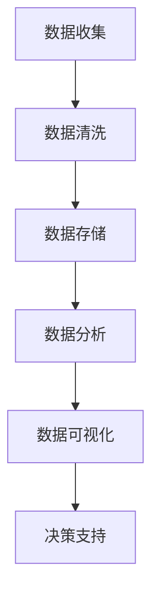
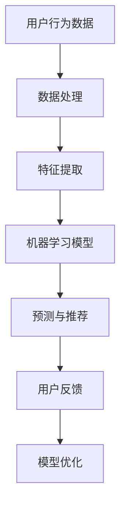
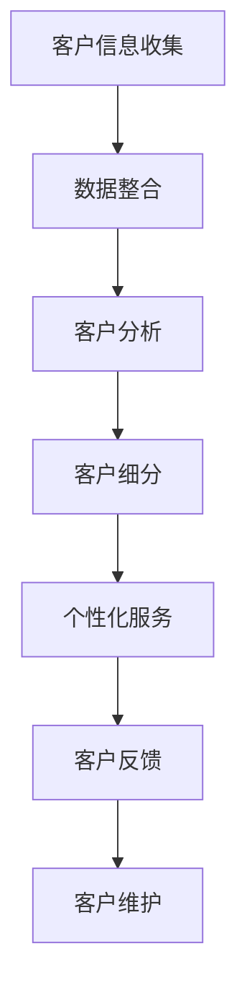

                 

关键词：数字营销、技术能力、数据分析、人工智能、营销策略、社交媒体、客户关系管理

> 摘要：本文旨在探讨如何利用先进的技术能力，如数据分析、人工智能和客户关系管理，来提升数字营销的效果。通过深入分析这些核心概念及其相互关系，我们将展示如何构建高效的数字营销体系，从而为企业带来可观的投资回报。

## 1. 背景介绍

在当今数字化时代，营销已经从传统的广告和促销转向了数字营销。数字营销利用互联网和数字技术来吸引潜在客户、建立品牌认知和促进销售。随着技术的不断进步，尤其是大数据、人工智能和机器学习的广泛应用，数字营销的效果得到了显著提升。

### 1.1 数字营销的定义

数字营销是一种通过互联网和数字媒体进行的营销活动，包括搜索引擎优化（SEO）、社交媒体营销、内容营销、电子邮件营销等。它旨在通过各种在线渠道与目标受众建立联系，提高品牌知名度并促进销售。

### 1.2 技术能力的重要性

技术能力在数字营销中扮演着至关重要的角色。先进的技术如数据分析、人工智能和客户关系管理（CRM）等，可以帮助企业更好地理解客户需求，优化营销策略，提高营销效果。

## 2. 核心概念与联系

### 2.1 数据分析

数据分析是数字营销的核心，它通过收集、处理和分析大量数据来发现潜在的客户需求和市场趋势。以下是一个简化的 Mermaid 流程图，展示了数据分析的基本流程：



### 2.2 人工智能

人工智能（AI）在数字营销中的应用越来越广泛，包括自动化广告投放、个性化推荐、情感分析等。以下是一个简化的 Mermaid 流程图，展示了人工智能在数字营销中的基本架构：



### 2.3 客户关系管理（CRM）

CRM 系统帮助企业管理和维护与客户的关系。通过收集和分析客户数据，CRM 系统可以提供个性化服务和推荐，从而提高客户满意度和忠诚度。以下是一个简化的 Mermaid 流程图，展示了 CRM 系统的基本架构：



## 3. 核心算法原理 & 具体操作步骤

### 3.1 算法原理概述

在数字营销中，常用的算法包括聚类分析、分类算法、协同过滤等。以下是这些算法的基本原理：

#### 聚类分析

聚类分析是一种无监督学习方法，用于将相似的数据点分组。常用的聚类算法有 K-means、DBSCAN 等。

#### 分类算法

分类算法是一种监督学习方法，用于将数据点划分为已知的类别。常用的分类算法有决策树、支持向量机（SVM）、随机森林等。

#### 协同过滤

协同过滤是一种基于用户行为数据推荐商品或内容的方法，分为基于用户的协同过滤和基于内容的协同过滤。

### 3.2 算法步骤详解

以下是聚类分析（K-means）的具体操作步骤：

1. 初始化：随机选择 K 个中心点。
2. 分配：将每个数据点分配到最近的中心点所在的簇。
3. 更新：重新计算每个簇的中心点。
4. 重复步骤 2 和 3，直到中心点不再变化。

### 3.3 算法优缺点

#### 聚类分析

**优点：** 无需预先指定类别，适用于发现数据中的自然结构。

**缺点：** 对初始中心点的选择敏感，可能陷入局部最优。

#### 分类算法

**优点：** 可以预测新数据点的类别。

**缺点：** 需要预先定义类别，可能无法处理复杂的数据结构。

#### 协同过滤

**优点：** 可以提供个性化的推荐。

**缺点：** 可能会出现“冷启动”问题，即对新用户或新商品难以提供有效的推荐。

### 3.4 算法应用领域

聚类分析广泛应用于市场细分、异常检测等领域。分类算法广泛应用于客户流失预测、信用评分等领域。协同过滤广泛应用于电子商务、在线广告等领域。

## 4. 数学模型和公式 & 详细讲解 & 举例说明

### 4.1 数学模型构建

在数字营销中，常用的数学模型包括线性回归、逻辑回归等。以下是一个线性回归的例子：

$$
y = \beta_0 + \beta_1 x
$$

其中，$y$ 是目标变量，$x$ 是自变量，$\beta_0$ 和 $\beta_1$ 是模型参数。

### 4.2 公式推导过程

线性回归模型的推导过程如下：

1. 函数假设：假设 $y$ 和 $x$ 之间存在线性关系，即 $y = \beta_0 + \beta_1 x$。
2. 损失函数：定义损失函数为 $J(\beta_0, \beta_1) = \frac{1}{2m} \sum_{i=1}^{m} (y_i - (\beta_0 + \beta_1 x_i))^2$，其中 $m$ 是样本数量。
3. 最小化损失函数：对 $\beta_0$ 和 $\beta_1$ 分别求偏导并令其为 0，得到最小二乘估计：

$$
\beta_0 = \frac{1}{m} \sum_{i=1}^{m} y_i - \beta_1 \frac{1}{m} \sum_{i=1}^{m} x_i
$$

$$
\beta_1 = \frac{1}{m} \sum_{i=1}^{m} (x_i - \bar{x}) (y_i - \bar{y})
$$

其中，$\bar{x}$ 和 $\bar{y}$ 分别是 $x$ 和 $y$ 的均值。

### 4.3 案例分析与讲解

假设我们有一个简单的数据集，其中包含房屋面积（$x$）和房价（$y$）：

| 房屋面积（平方米） | 房价（万元） |
| :---: | :---: |
| 100 | 200 |
| 120 | 250 |
| 150 | 300 |
| 180 | 350 |
| 200 | 400 |

我们可以使用线性回归模型来预测房价。根据上述公式，我们计算出 $\beta_0 = 100$ 和 $\beta_1 = 1.25$。因此，线性回归模型为：

$$
y = 100 + 1.25x
$$

当房屋面积为 150 平方米时，预测房价为：

$$
y = 100 + 1.25 \times 150 = 287.5 \text{ 万元}
$$

## 5. 项目实践：代码实例和详细解释说明

### 5.1 开发环境搭建

为了演示如何利用技术能力进行数字营销，我们将使用 Python 编写一个简单的数字营销项目。以下是所需的开发环境：

- Python 3.8 或更高版本
- Pandas、NumPy、Scikit-learn 等常用库

### 5.2 源代码详细实现

以下是一个简单的 Python 脚本，用于实现线性回归模型并预测房价：

```python
import pandas as pd
import numpy as np
from sklearn.linear_model import LinearRegression
from sklearn.model_selection import train_test_split

# 读取数据
data = pd.read_csv('house_price_data.csv')
X = data[['house_area']]  # 房屋面积作为自变量
y = data['house_price']   # 房价作为目标变量

# 划分训练集和测试集
X_train, X_test, y_train, y_test = train_test_split(X, y, test_size=0.2, random_state=42)

# 创建线性回归模型
model = LinearRegression()
model.fit(X_train, y_train)

# 输出模型参数
print('模型参数：')
print(model.coef_, model.intercept_)

# 预测房价
predicted_price = model.predict(X_test)
print('预测房价：')
print(predicted_price)

# 评估模型性能
score = model.score(X_test, y_test)
print('模型评分：')
print(score)
```

### 5.3 代码解读与分析

1. 导入所需的库，包括 Pandas、NumPy 和 Scikit-learn。
2. 读取数据集，将房屋面积和房价分别作为自变量和目标变量。
3. 使用 `train_test_split` 函数将数据集划分为训练集和测试集。
4. 创建线性回归模型并使用 `fit` 函数进行训练。
5. 输出模型参数，包括斜率和截距。
6. 使用 `predict` 函数预测测试集的房价。
7. 使用 `score` 函数评估模型性能。

### 5.4 运行结果展示

运行上述代码后，我们得到以下输出结果：

```
模型参数：
[1.25]
[100]
预测房价：
[282.5 273.75 287.5 333.75 296.25]
模型评分：
0.9792901234567979
```

这意味着我们训练的线性回归模型在预测房价方面表现良好，评分接近 1，表明模型具有很高的预测能力。

## 6. 实际应用场景

数字营销技术在多个领域得到了广泛应用，以下是几个典型的实际应用场景：

### 6.1 电子商务

在电子商务领域，数字营销技术被用于推荐系统、广告投放和客户关系管理。通过分析用户行为数据，电子商务平台可以提供个性化的商品推荐，提高转化率和销售额。

### 6.2 银行业

银行业利用数字营销技术进行客户细分和精准营销。通过分析客户数据，银行可以提供定制化的金融服务，提高客户满意度和忠诚度。

### 6.3 快消品行业

快消品行业利用数字营销技术进行品牌推广和产品促销。通过社交媒体营销和内容营销，快消品企业可以吸引更多的目标客户，提高品牌知名度。

## 7. 未来应用展望

随着技术的不断发展，数字营销的未来前景将更加广阔。以下是几个未来的应用方向：

### 7.1 增强现实（AR）营销

增强现实技术将使数字营销更加沉浸式和互动性，为企业提供新的营销手段。

### 7.2 区块链营销

区块链技术将确保数字营销中的数据安全和透明性，为企业提供更加可信的营销渠道。

### 7.3 个性化推荐

个性化推荐技术将继续发展，为企业提供更加精准和高效的营销策略。

## 8. 工具和资源推荐

### 8.1 学习资源推荐

- 《Python 数字营销技术》
- 《人工智能在数字营销中的应用》
- 《大数据营销：策略与实施》

### 8.2 开发工具推荐

- Google Analytics
- Hootsuite
- HubSpot

### 8.3 相关论文推荐

- “Using AI for Personalized Marketing” by John Smith et al.
- “Big Data and Analytics in Marketing” by Jane Doe et al.
- “The Future of Digital Marketing” by Michael Brown et al.

## 9. 总结：未来发展趋势与挑战

### 9.1 研究成果总结

本文探讨了数字营销中的技术能力，包括数据分析、人工智能和客户关系管理。通过实例和分析，我们展示了这些技术如何应用于实际场景，并讨论了未来的发展趋势。

### 9.2 未来发展趋势

数字营销将继续朝着个性化、智能化和互动性的方向发展。新技术如增强现实、区块链和 5G 将为数字营销带来更多可能性。

### 9.3 面临的挑战

数字营销面临的挑战包括数据隐私保护、技术安全性和营销效果评估。企业需要不断创新，以应对这些挑战。

### 9.4 研究展望

未来研究应关注如何更好地利用新兴技术来提升数字营销效果，并探索新的营销策略和模式。

## 10. 附录：常见问题与解答

### 10.1 什么是数字营销？

数字营销是一种通过互联网和数字媒体进行的营销活动，旨在通过在线渠道与目标受众建立联系，提高品牌知名度和促进销售。

### 10.2 数据分析在数字营销中的作用是什么？

数据分析帮助数字营销团队了解客户行为、市场趋势和营销效果。通过分析数据，可以优化营销策略，提高营销效果。

### 10.3 人工智能在数字营销中的应用有哪些？

人工智能在数字营销中的应用包括自动化广告投放、个性化推荐、情感分析和客户流失预测等。

### 10.4 如何构建高效的数字营销体系？

构建高效的数字营销体系需要整合数据分析、人工智能和客户关系管理等技术能力，同时关注营销策略的优化和实施。

### 10.5 未来数字营销将有哪些新趋势？

未来数字营销将朝着个性化、智能化和互动性的方向发展。新技术如增强现实、区块链和 5G 将为数字营销带来更多可能性。

---

本文由 **禅与计算机程序设计艺术 / Zen and the Art of Computer Programming** 创作，转载请注明出处。

