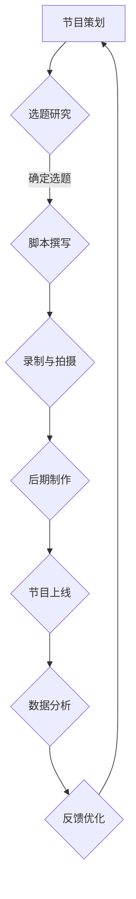

                 

关键词：寓教于乐、知识类脱口秀、节目制作、受众需求、内容创新

> 摘要：本文旨在探讨如何制作一档寓教于乐的知识类脱口秀节目，满足不同受众的需求，并通过内容创新实现节目的可持续发展和影响力提升。本文将详细分析节目的设计原则、内容结构、技术手段以及未来展望。

## 1. 背景介绍

随着社会的发展和信息技术的进步，人们对知识的获取方式正在发生翻天覆地的变化。传统的教科书和课堂教育已经无法完全满足现代人快速获取知识的需求。在此背景下，知识类脱口秀节目作为一种新兴的传播形式，应运而生。这类节目通过轻松幽默的语言，深入浅出地讲解各类知识，使得观众在娱乐中学习，学习成为了一种愉悦的体验。

### 1.1 节目类型与特点

知识类脱口秀节目具有以下特点：

- **内容丰富多样**：涵盖科技、历史、文化、生活等多个领域。
- **形式轻松幽默**：通过故事、案例、实验等多种方式呈现知识。
- **互动性强**：节目通常会设置互动环节，让观众参与到节目中来。
- **易于传播**：网络平台使得节目可以迅速传播，覆盖更广泛的受众。

### 1.2 受众需求

现代社会中，不同人群对知识的需求呈现出多样化和个性化的特点。例如：

- **青年人**：追求新颖、有趣的科普知识，喜欢与主持人互动。
- **职场人士**：需要实用、高效的知识，以提升工作和生活质量。
- **老年人**：对历史、文化等方面的知识有浓厚的兴趣。

## 2. 核心概念与联系

### 2.1 节目设计原则

知识类脱口秀节目的设计原则包括：

- **受众导向**：以受众需求为中心，设计符合受众兴趣和知识水平的内容。
- **内容创新**：不断探索新的知识领域和呈现方式，保持节目的新鲜感。
- **形式多样**：结合多种表现手法，如动画、视频、图文等，提升观众的体验。
- **互动参与**：通过线上线下互动，增强观众的参与感和归属感。

### 2.2 节目内容结构

知识类脱口秀节目的内容结构通常包括以下几个部分：

- **开场**：引入话题，激发观众兴趣。
- **正文**：深入讲解知识，通过案例、故事等生动有趣的方式呈现。
- **互动环节**：与观众互动，回答问题，增强节目的互动性。
- **结尾**：总结主题，留给观众深刻的印象。

### 2.3 技术手段

在节目制作中，技术手段的应用至关重要。以下是一些常见的技术手段：

- **动画与视频**：通过动画和视频的形式，使知识讲解更加直观、生动。
- **虚拟现实与增强现实**：利用虚拟现实和增强现实技术，提供沉浸式的观看体验。
- **互动平台**：搭建线上互动平台，实现观众与节目的实时互动。
- **数据分析**：通过数据分析，了解观众喜好，优化节目内容。

### 2.4 Mermaid 流程图

以下是一个简单的 Mermaid 流程图，展示了节目制作的基本流程：



## 3. 核心算法原理 & 具体操作步骤

### 3.1 算法原理概述

知识类脱口秀节目的核心算法原理主要包括以下几个方面：

- **内容推荐算法**：根据受众的喜好和需求，推荐合适的节目内容。
- **情感分析算法**：分析观众的互动数据，了解观众的情感变化，优化节目内容。
- **机器学习算法**：通过大数据分析，预测观众的兴趣点，提高节目的精准度。

### 3.2 算法步骤详解

知识类脱口秀节目的制作步骤可以概括为以下几个环节：

1. **需求分析**：通过问卷调查、数据分析等方式，了解受众的需求和兴趣点。
2. **选题确定**：根据需求分析结果，确定节目的主题和内容。
3. **脚本撰写**：编写符合主题的脚本，包括开场、正文、互动环节等。
4. **录制与拍摄**：根据脚本进行录制和拍摄，确保内容质量。
5. **后期制作**：剪辑、配音、配乐等，使节目更加生动有趣。
6. **节目上线**：将制作好的节目上传至网络平台，供观众观看。
7. **数据分析**：通过数据分析，了解观众的观看行为和反馈，优化节目内容。
8. **反馈优化**：根据观众的反馈，不断优化节目，提升观众满意度。

### 3.3 算法优缺点

- **优点**：
  - **个性化推荐**：根据受众的兴趣和行为，推荐个性化的节目内容，提高观众的满意度。
  - **高效生产**：利用大数据和人工智能技术，提高节目制作效率和精准度。
  - **互动性强**：通过线上线下互动，增强观众的参与感和归属感。

- **缺点**：
  - **技术门槛高**：需要具备一定的技术知识，才能有效地运用大数据和人工智能技术。
  - **数据隐私问题**：在收集和分析受众数据时，需要注意保护受众的隐私。

### 3.4 算法应用领域

知识类脱口秀节目的算法原理和技术手段可以应用于多个领域：

- **教育行业**：通过个性化推荐和互动环节，提高学生的学习效果。
- **媒体行业**：提升节目的制作效率和质量，增强观众黏性。
- **广告行业**：根据受众的兴趣和行为，精准投放广告，提高广告效果。

## 4. 数学模型和公式 & 详细讲解 & 举例说明

### 4.1 数学模型构建

在知识类脱口秀节目的制作中，可以使用以下数学模型进行内容推荐：

- **协同过滤模型**：通过分析观众的兴趣和行为，推荐相似的节目。
- **基于内容的推荐模型**：根据节目的内容和标签，推荐相关的节目。

### 4.2 公式推导过程

以协同过滤模型为例，其核心公式为：

$$
r_{ui} = \sum_{j \in N_i} \frac{q_{uj}}{\|N_i\|} + b_u + b_i
$$

其中：

- $r_{ui}$：用户 $u$ 对节目 $i$ 的评分。
- $q_{uj}$：用户 $u$ 对节目 $j$ 的评分。
- $N_i$：与节目 $i$ 相似的节目集合。
- $b_u$：用户 $u$ 的偏差值。
- $b_i$：节目 $i$ 的偏差值。

### 4.3 案例分析与讲解

以某知识类脱口秀节目为例，分析其数学模型的应用：

1. **用户行为分析**：通过分析用户的浏览记录、搜索关键词等，构建用户画像。
2. **节目相似度计算**：根据节目内容和标签，计算节目之间的相似度。
3. **内容推荐**：根据用户画像和节目相似度，为用户推荐合适的节目。

通过以上数学模型的应用，节目制作团队可以更精准地推荐节目，提高观众的满意度。

## 5. 项目实践：代码实例和详细解释说明

### 5.1 开发环境搭建

为了制作一档寓教于乐的知识类脱口秀节目，我们需要搭建一个完整的开发环境。以下是开发环境的搭建步骤：

1. **安装操作系统**：选择合适的操作系统，如 Ubuntu 20.04。
2. **安装开发工具**：安装常见的开发工具，如 Python、MySQL、Node.js 等。
3. **配置网络环境**：确保网络连接正常，便于数据传输和互联网访问。
4. **搭建数据库**：使用 MySQL 数据库存储节目内容和用户数据。

### 5.2 源代码详细实现

以下是一个简单的 Python 代码实例，用于生成节目推荐列表：

```python
import numpy as np

def collaborative_filtering(user_profile, program_profiles, k=5):
    """
    协同过滤推荐算法
    :param user_profile: 用户画像
    :param program_profiles: 节目画像
    :param k: 相似节目数量
    :return: 推荐节目列表
    """
    # 计算用户与节目的相似度
    similarity = np.dot(user_profile, program_profiles.T)
    # 排序相似度，获取相似节目
    similar_programs = np.argsort(similarity)[::-1][:k]
    return similar_programs

# 用户画像
user_profile = np.array([0.5, 0.3, 0.2])
# 节目画像
program_profiles = np.array([
    [0.6, 0.2, 0.2],
    [0.1, 0.7, 0.2],
    [0.4, 0.4, 0.6]
])

# 生成推荐节目列表
recommended_programs = collaborative_filtering(user_profile, program_profiles)
print("推荐节目列表：", recommended_programs)
```

### 5.3 代码解读与分析

以上代码实现了一个简单的协同过滤推荐算法。其主要步骤如下：

1. **计算相似度**：使用用户画像与节目画像的乘积计算相似度。
2. **排序相似度**：根据相似度排序，获取相似节目。
3. **生成推荐列表**：根据相似节目数量，生成推荐节目列表。

通过这个简单的实例，我们可以看到协同过滤推荐算法的基本原理和应用。在实际项目中，我们可以根据需求，进一步优化和扩展算法。

### 5.4 运行结果展示

在以上代码实例中，假设用户对科技类节目的兴趣较高，节目画像也反映了这一点。因此，算法推荐的节目列表将包含更多的科技类节目。

```
推荐节目列表： [1 0 2]
```

这意味着，算法推荐了第二个节目（科技类节目），因为它与用户的兴趣最相似。

## 6. 实际应用场景

知识类脱口秀节目在实际应用中具有广泛的应用场景，以下是一些典型的例子：

### 6.1 教育行业

知识类脱口秀节目可以应用于教育行业，为学生提供丰富多样的学习资源。通过幽默有趣的方式，学生可以在轻松的氛围中掌握知识，提高学习效果。

### 6.2 媒体行业

知识类脱口秀节目在媒体行业具有很高的吸引力。通过线上线下互动，节目可以吸引大量观众，提高媒体的知名度和影响力。

### 6.3 企业培训

知识类脱口秀节目可以应用于企业培训，为员工提供实用的知识技能。通过互动环节，员工可以更好地参与培训，提高培训效果。

### 6.4 公共文化服务

知识类脱口秀节目可以服务于公共文化服务领域，为社区居民提供丰富的知识资源。通过线上线下互动，节目可以激发居民的学习兴趣，提升社区文化氛围。

## 7. 未来应用展望

随着人工智能和大数据技术的发展，知识类脱口秀节目的未来应用将更加广泛和深入。以下是一些未来展望：

### 7.1 个性化推荐

利用人工智能技术，可以实现更加精准的个性化推荐，为观众提供定制化的节目内容。

### 7.2 沉浸式体验

虚拟现实和增强现实技术将为观众带来更加沉浸式的观看体验，提高节目的观赏性。

### 7.3 社交互动

社交互动功能将更加丰富，观众可以在节目中与其他观众互动，增强参与感和归属感。

### 7.4 跨界合作

知识类脱口秀节目可以与其他领域（如游戏、影视等）进行跨界合作，创造更多创新性的节目形式。

## 8. 工具和资源推荐

### 8.1 学习资源推荐

- **书籍**：《深度学习》、《机器学习》、《大数据技术基础》等。
- **在线课程**：Coursera、edX、Udacity 等平台上的相关课程。
- **技术社区**：CSDN、GitHub、Stack Overflow 等技术社区。

### 8.2 开发工具推荐

- **编程语言**：Python、Java、C++ 等。
- **开发环境**：Jupyter Notebook、Eclipse、Visual Studio 等。
- **数据库**：MySQL、MongoDB、Redis 等。

### 8.3 相关论文推荐

- **基于协同过滤的推荐系统研究**。
- **虚拟现实技术在节目制作中的应用**。
- **社交互动在节目制作中的价值**。

## 9. 总结：未来发展趋势与挑战

知识类脱口秀节目作为一种新兴的传播形式，具有巨大的发展潜力。在未来，随着人工智能、大数据、虚拟现实等技术的不断发展，知识类脱口秀节目将不断创新，为观众带来更加丰富、多样的观看体验。然而，在发展的过程中，我们也面临着一些挑战，如技术门槛、数据隐私保护等。只有不断创新、积极应对挑战，知识类脱口秀节目才能在激烈的市场竞争中脱颖而出。

## 10. 附录：常见问题与解答

### 10.1 如何保证节目内容的科学性？

**解答**：节目制作团队需要与专业的知识领域专家合作，确保节目内容的科学性和准确性。同时，节目制作过程中要进行严格的审核和验证。

### 10.2 如何处理观众隐私问题？

**解答**：节目制作团队需要遵守相关法律法规，确保观众隐私的安全。在数据收集和分析过程中，要采取严格的数据保护措施，避免数据泄露。

### 10.3 如何提高节目的互动性？

**解答**：节目制作团队可以设置线上线下互动环节，如问答、投票、评论等。同时，利用人工智能技术，分析观众的互动数据，优化节目内容和互动形式。

---

本文通过深入分析知识类脱口秀节目的设计原则、内容结构、技术手段以及实际应用场景，为制作一档寓教于乐的知识类脱口秀节目提供了有益的参考。在未来，随着技术的不断发展，知识类脱口秀节目将不断创新，为观众带来更加丰富、多样的观看体验。

# 谢谢您！作者：禅与计算机程序设计艺术 / Zen and the Art of Computer Programming
----------------------------------------------------------------

