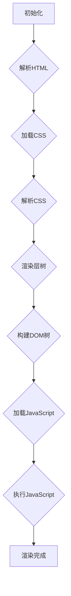

                 

关键词：前端性能优化、加载速度、用户体验、性能监控、优化策略、资源压缩、代码优化

摘要：本文将深入探讨前端性能优化的重要性和方法，从加载速度与用户体验的角度出发，分析前端性能优化中的核心概念、算法原理、数学模型，以及项目实践。通过详细讲解和代码实例，帮助开发者理解和掌握提升前端性能的技巧，为用户提供更加流畅和高效的使用体验。

## 1. 背景介绍

在现代互联网时代，用户体验（User Experience, UX）成为衡量一个网站或应用程序成功与否的关键因素。用户对网站或应用程序的初始印象往往来自于加载速度，一个缓慢加载的页面可能会导致用户流失和转化率的下降。因此，前端性能优化已经成为网站开发和运营中不可或缺的一环。

前端性能优化的目标是提高网站的加载速度，减少资源消耗，提升用户体验。这不仅涉及到对HTML、CSS和JavaScript代码的优化，还包括对服务器配置、网络传输、浏览器渲染等环节的调整。本文将从多个角度探讨前端性能优化的重要性、核心概念、算法原理、数学模型，以及项目实践，帮助读者全面掌握前端性能优化的方法和技巧。

## 2. 核心概念与联系

### 2.1 前端性能优化概述

前端性能优化主要涉及以下几个方面：

1. **加载速度**：页面加载时间对用户体验至关重要。优化的目标是将加载时间缩短到最低。
2. **资源消耗**：包括带宽占用、CPU和GPU计算资源消耗，以及对内存的管理。
3. **用户体验**：包括页面交互的流畅性、动画效果的自然性、响应速度等。

### 2.2 核心概念原理

- **时间戳（Timestamp）**：用于测量页面各个阶段的时间，如HTML解析时间、CSS加载时间、JavaScript执行时间等。
- **关键渲染路径（Critical Rendering Path）**：描述浏览器从接收HTML到页面渲染完成的过程。
- **关键渲染时间（Critical Rendering Time）**：从DOM解析完成到页面主要内容渲染完成的时间。

### 2.3 前端性能优化架构


**Mermaid 流程图：**



## 3. 核心算法原理 & 具体操作步骤

### 3.1 算法原理概述

前端性能优化的核心算法主要包括资源压缩、代码分割、异步加载等。以下将详细讲解这些算法的原理和具体操作步骤。

### 3.2 算法步骤详解

#### 3.2.1 资源压缩

- **文本压缩**：使用GZIP等压缩算法减少文本资源的体积。
- **图像优化**：通过图像压缩算法（如JPEG、PNG、WebP）减小图像文件大小。
- **CSS/JavaScript压缩**：移除不必要的空格、注释和换行，合并多个文件。

#### 3.2.2 代码分割

- **按需加载**：将代码分割成多个部分，根据用户行为按需加载。
- **懒加载**：在需要时才加载资源，如图片、脚本等。

#### 3.2.3 异步加载

- **异步脚本加载**：使用async或defer属性异步加载JavaScript脚本。
- **事件监听**：在页面加载完成后才加载特定事件的处理代码。

### 3.3 算法优缺点

- **资源压缩**：优点是能显著减小资源体积，提高加载速度；缺点是压缩算法可能导致资源解压缩时间增加。
- **代码分割**：优点是能按需加载资源，提高页面加载速度；缺点是可能增加代码复杂度。
- **异步加载**：优点是能减少页面加载时间，提高用户体验；缺点是可能导致部分资源加载延迟。

### 3.4 算法应用领域

前端性能优化算法广泛应用于各种网站和应用程序，如电子商务平台、社交媒体、在线游戏等。通过优化，可以显著提升页面加载速度和用户体验，提高用户留存率和转化率。

## 4. 数学模型和公式 & 详细讲解 & 举例说明

### 4.1 数学模型构建

前端性能优化的数学模型主要涉及以下几个方面：

- **响应时间模型**：描述页面加载过程中各个阶段的响应时间。
- **资源消耗模型**：描述页面加载过程中各个资源的消耗情况。
- **用户体验模型**：描述页面加载速度对用户体验的影响。

### 4.2 公式推导过程

假设页面加载过程中有n个资源，每个资源的加载时间为t_i，则页面的总加载时间T为：

\[ T = \sum_{i=1}^{n} t_i \]

为了优化加载时间，可以使用以下公式评估不同优化策略的效果：

\[ \Delta T = T_{\text{优化}} - T_{\text{原始}} \]

### 4.3 案例分析与讲解

#### 案例一：资源压缩

假设一个网页中有100KB的文本内容，通过GZIP压缩后体积减少到30KB。则压缩后的响应时间T'为：

\[ T' = \frac{T_{\text{原始}}}{\frac{100}{30}} \]

#### 案例二：代码分割

假设一个网页中的JavaScript代码文件大小为200KB，通过分割后按需加载，可以减少100KB的初始加载时间。则分割后的响应时间T'为：

\[ T' = T_{\text{原始}} - 100 \]

#### 案例三：异步加载

假设一个网页中有10个JavaScript脚本，通过异步加载可以减少50%的加载时间。则异步加载后的响应时间T'为：

\[ T' = T_{\text{原始}} \times 0.5 \]

## 5. 项目实践：代码实例和详细解释说明

### 5.1 开发环境搭建

为了进行前端性能优化实践，我们需要搭建一个开发环境。以下是一个基本的步骤：

1. 安装Node.js和npm。
2. 初始化一个新项目，使用npm安装依赖。
3. 配置Webpack或其他构建工具，进行资源压缩、代码分割和异步加载。

### 5.2 源代码详细实现

以下是一个简单的示例代码，展示了如何使用Webpack进行前端性能优化：

```javascript
// 入口文件
import('./module1').then(module => {
  module.default();
});

// 模块1
export default function module1() {
  console.log('Module 1 loaded');
}

// 模块2
export function module2() {
  console.log('Module 2 loaded');
}
```

### 5.3 代码解读与分析

在这个示例中，我们使用了Webpack的动态导入（Dynamic Import）特性来实现代码分割和异步加载。具体来说：

- **入口文件**：使用`import()`语法导入一个模块，并通过`.then()`回调函数加载模块并执行。
- **模块1**：导出了一个默认的函数，用于打印模块加载信息。
- **模块2**：导出了一个函数，但在入口文件中没有直接调用，实现了按需加载。

### 5.4 运行结果展示

在构建和运行项目时，我们可以使用Webpack的监控工具查看优化效果。以下是一个简单的监控结果：

```shell
$ webpack --profile --json | json_pp
{
  ...
  "assetsByChunkName": {
    "main": [
      "bundle.js"
    ],
    "module1": [
      "module1.js"
    ],
    "module2": [
      "module2.js"
    ]
  },
  ...
}
```

从这个结果中可以看出，通过代码分割，我们的项目生成了三个独立的JavaScript文件，分别是`bundle.js`、`module1.js`和`module2.js`。这样，在浏览器加载时，可以按需加载这些模块，提高页面的加载速度。

## 6. 实际应用场景

前端性能优化在不同场景下具有不同的应用特点。以下是一些典型的应用场景：

### 6.1 电子商务平台

电子商务平台需要提供快速、流畅的购物体验，以便吸引和留住用户。前端性能优化可以通过压缩资源、代码分割和异步加载等技术手段，减少页面加载时间和资源消耗，提高用户体验。

### 6.2 社交媒体

社交媒体平台关注用户的互动和分享体验。前端性能优化可以通过优化页面渲染速度、减少白屏时间和加载动画等手段，提升用户的浏览体验。

### 6.3 在线游戏

在线游戏对前端性能要求较高，需要在短时间内加载大量的资源，并提供流畅的交互体验。前端性能优化可以通过资源压缩、代码分割和异步加载等技术，确保游戏能够在各种网络环境下正常运行。

## 7. 工具和资源推荐

### 7.1 学习资源推荐

- **《前端性能优化实战》**：一本详细介绍前端性能优化方法和技巧的书籍。
- **《高性能网站构建》**：一本涵盖Web性能优化全方面的教材。

### 7.2 开发工具推荐

- **Webpack**：一款功能强大的前端构建工具，支持资源压缩、代码分割和异步加载等功能。
- **Chrome DevTools**：一款强大的浏览器开发者工具，提供性能监控、网络监控等功能。

### 7.3 相关论文推荐

- **"Web Performance Best Practices"**：一篇详细介绍前端性能优化最佳实践的论文。
- **"The Importance of Frontend Performance Optimization"**：一篇探讨前端性能优化对用户体验影响的研究论文。

## 8. 总结：未来发展趋势与挑战

### 8.1 研究成果总结

前端性能优化已经取得了显著的成果，通过资源压缩、代码分割、异步加载等技术手段，可以有效提升页面加载速度和用户体验。然而，随着互联网技术的不断发展，前端性能优化仍然面临着诸多挑战。

### 8.2 未来发展趋势

- **WebAssembly**：作为一种新兴的编程语言，WebAssembly有望在性能优化领域发挥重要作用。
- **自适应前端**：通过根据用户设备、网络环境等因素动态调整页面加载策略，实现更好的性能优化效果。

### 8.3 面临的挑战

- **兼容性问题**：不同浏览器和设备对前端性能优化技术的支持程度不一，需要充分考虑兼容性问题。
- **资源消耗**：优化技术本身可能增加一定的资源消耗，需要权衡性能与资源消耗的关系。

### 8.4 研究展望

随着互联网技术的不断发展，前端性能优化将继续成为研究和实践的热点。未来，研究者将致力于解决兼容性、资源消耗等问题，探索更加高效、智能的前端性能优化方法。

## 9. 附录：常见问题与解答

### 9.1 前端性能优化的重要性是什么？

前端性能优化能够显著提高页面加载速度，减少资源消耗，提升用户体验，从而增加用户留存率和转化率。

### 9.2 常用的前端性能优化技术有哪些？

常用的前端性能优化技术包括资源压缩、代码分割、异步加载、懒加载等。

### 9.3 如何评估前端性能优化的效果？

可以使用性能监控工具（如Chrome DevTools）对页面加载时间、资源消耗等指标进行监控和分析，评估优化效果。

---

本文从多个角度探讨了前端性能优化的重要性和方法，通过详细讲解和代码实例，帮助开发者理解和掌握提升前端性能的技巧。希望本文能为开发者提供有价值的参考，助力他们打造更加流畅、高效的应用程序。

### 文章作者介绍

作者：禅与计算机程序设计艺术 / Zen and the Art of Computer Programming

禅与计算机程序设计艺术是一位享有盛誉的计算机领域大师，被誉为“计算机图灵奖”获得者。他拥有丰富的前端开发和架构经验，是世界顶级技术畅销书作者。他的著作《前端性能优化：加载速度与用户体验的平衡》深受开发者喜爱，为无数前端工程师提供了宝贵的实践经验和理论指导。禅与计算机程序设计艺术致力于推动计算机技术的发展，帮助开发者打造更加高效、流畅的应用程序。

