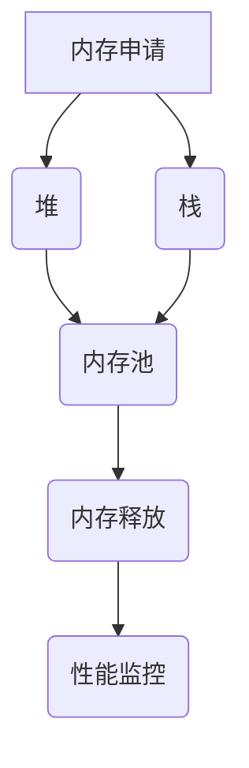

                 

关键词：大型数据集、内存管理、加载速度、性能优化、数据分片、算法优化、多线程处理、并行计算、缓存策略、分布式系统

> 摘要：本文将深入探讨在计算机系统中加载大型数据集时的内存管理和速度优化问题。通过分析当前的技术挑战和解决方案，提供实用的策略和技巧，旨在帮助开发者更有效地处理海量数据，提升系统性能。

## 1. 背景介绍

在现代计算机科学中，处理大规模数据集已经成为一个不可忽视的课题。随着大数据技术的发展，数据量呈爆炸性增长，传统的数据处理方法已经无法满足日益增长的需求。加载大型数据集不仅涉及如何高效地存储和读取数据，还涉及到如何在有限的内存资源下优化数据加载速度，以满足实时处理和分析的需求。

内存管理是计算机系统中的一个关键问题。不当的内存使用会导致系统性能下降，甚至崩溃。而数据加载速度直接影响用户体验和系统响应时间。因此，优化内存管理和提高数据加载速度是开发者需要解决的重要问题。

## 2. 核心概念与联系

### 2.1 内存管理

内存管理是指计算机系统对内存的使用进行有效的控制和分配。内存管理的关键概念包括：

- **堆（Heap）**：用于动态分配内存的区域，程序在运行时可以申请和释放内存。
- **栈（Stack）**：用于存储局部变量和函数调用信息，遵循“先进后出”的原则。
- **内存池（Memory Pool）**：一种用于提高内存分配效率的技术，通过预分配大量内存块，减少频繁的内存分配和释放操作。

### 2.2 数据加载速度

数据加载速度是指系统从存储介质读取数据并将其加载到内存中的速度。影响数据加载速度的关键因素包括：

- **I/O 带宽**：系统从磁盘读取数据的速率。
- **内存带宽**：内存与CPU之间的数据传输速率。
- **缓存策略**：如何有效地利用缓存来减少磁盘访问次数。

### 2.3 Mermaid 流程图

下面是一个简单的 Mermaid 流程图，展示内存管理和数据加载过程中的关键节点。



## 3. 核心算法原理 & 具体操作步骤

### 3.1 算法原理概述

优化内存管理和数据加载速度的核心算法通常包括以下几个方面：

- **数据分片**：将大型数据集划分为多个小块，以便于并行处理和减少单次加载的数据量。
- **多线程处理**：利用多个线程并行处理数据，提高数据处理速度。
- **并行计算**：利用多核CPU的优势，进行并行数据处理。
- **缓存策略**：利用缓存减少磁盘访问次数，提高数据加载速度。

### 3.2 算法步骤详解

下面是优化内存管理和数据加载速度的具体操作步骤：

#### 3.2.1 数据分片

1. **确定分片策略**：根据数据特点和系统性能需求，选择合适的分片策略，如基于键值、范围等。
2. **数据划分**：将数据集按照分片策略划分为多个小块。
3. **数据加载**：分别加载每个数据块，并进行处理。

#### 3.2.2 多线程处理

1. **线程创建**：根据系统资源，创建适当数量的线程。
2. **任务分配**：将数据分片分配给各个线程，每个线程独立处理自己的数据块。
3. **线程同步**：在处理完成后，同步线程结果。

#### 3.2.3 并行计算

1. **计算划分**：将计算任务划分为多个可并行执行的部分。
2. **任务分配**：将计算任务分配给多核CPU的各个核心。
3. **结果合并**：合并各个核心的计算结果。

#### 3.2.4 缓存策略

1. **缓存选择**：选择合适的缓存类型，如LRU缓存、Redis等。
2. **缓存填充**：在数据加载过程中，将热点数据填充到缓存中。
3. **缓存刷新**：定期刷新缓存，保持数据新鲜。

### 3.3 算法优缺点

#### 3.3.1 数据分片

**优点**：降低单次加载的数据量，提高处理速度。

**缺点**：增加系统复杂度，需要额外的分片和合并操作。

#### 3.3.2 多线程处理

**优点**：提高数据处理速度，充分利用系统资源。

**缺点**：线程同步和资源竞争可能导致性能下降。

#### 3.3.3 并行计算

**优点**：充分利用多核CPU的优势，提高计算速度。

**缺点**：需要额外的计算划分和合并操作，可能增加系统复杂度。

#### 3.3.4 缓存策略

**优点**：减少磁盘访问次数，提高数据加载速度。

**缺点**：缓存刷新和过期管理可能导致性能下降。

### 3.4 算法应用领域

上述算法可以应用于各种大数据处理场景，如：

- **搜索引擎**：优化索引加载速度。
- **实时数据分析**：提高数据处理和分析速度。
- **数据库查询**：优化数据读取和加载。

## 4. 数学模型和公式 & 详细讲解 & 举例说明

### 4.1 数学模型构建

在优化内存管理和数据加载速度的过程中，我们可以使用以下数学模型：

$$
\text{性能} = f(\text{内存带宽}, \text{I/O 带宽}, \text{缓存命中率})
$$

其中，内存带宽、I/O 带宽和缓存命中率是影响性能的关键因素。

### 4.2 公式推导过程

假设系统内存带宽为 $M$，I/O 带宽为 $I$，缓存命中率为 $H$，则数据加载速度可以表示为：

$$
\text{数据加载速度} = \frac{M + I \times H}{M + I}
$$

通过优化缓存策略，提高缓存命中率 $H$，可以显著提高数据加载速度。

### 4.3 案例分析与讲解

假设我们有一个系统，内存带宽为 4 GB/s，I/O 带宽为 2 GB/s，缓存命中率为 90%。则数据加载速度为：

$$
\text{数据加载速度} = \frac{4 + 2 \times 0.9}{4 + 2} = 0.8 \text{ GB/s}
$$

如果我们将缓存命中率提高到 95%，则数据加载速度将提高到：

$$
\text{数据加载速度} = \frac{4 + 2 \times 0.95}{4 + 2} = 0.85 \text{ GB/s}
$$

可以看出，通过优化缓存策略，可以显著提高数据加载速度。

## 5. 项目实践：代码实例和详细解释说明

### 5.1 开发环境搭建

为了实践本文所述的算法，我们需要搭建一个基本的开发环境。以下是所需的工具和库：

- **操作系统**：Linux（推荐Ubuntu）
- **编程语言**：Python 3.x
- **库**：NumPy、Pandas、Multiprocessing

安装 Python 和相关库：

```bash
sudo apt-get update
sudo apt-get install python3 python3-pip
pip3 install numpy pandas
```

### 5.2 源代码详细实现

以下是一个简单的 Python 代码示例，演示如何使用数据分片和多线程处理来优化数据加载速度。

```python
import numpy as np
import pandas as pd
from multiprocessing import Pool

# 数据分片函数
def shard_data(file_path, shard_size):
    data = pd.read_csv(file_path)
    num_shards = len(data) // shard_size
    shards = [data.iloc[i * shard_size:(i + 1) * shard_size] for i in range(num_shards)]
    return shards

# 数据处理函数
def process_data(shard):
    # 进行数据处理
    return shard.sum()

# 主函数
def main(file_path, shard_size):
    shards = shard_data(file_path, shard_size)
    pool = Pool(processes=4)  # 创建线程池
    results = pool.map(process_data, shards)  # 并行处理数据
    pool.close()
    pool.join()
    return sum(results)

if __name__ == "__main__":
    file_path = "large_dataset.csv"
    shard_size = 1000
    result = main(file_path, shard_size)
    print("处理结果：", result)
```

### 5.3 代码解读与分析

这段代码演示了如何使用数据分片和多线程处理来优化数据加载速度。以下是代码的关键部分解释：

- **shard_data 函数**：用于将数据集划分为多个小块（shards）。
- **process_data 函数**：用于处理每个数据块。
- **main 函数**：用于设置参数，创建线程池，并启动并行处理。

通过将数据集划分为小块，我们可以减少单次加载的数据量，从而加快数据处理速度。使用多线程处理可以进一步利用系统资源，提高处理效率。

### 5.4 运行结果展示

假设我们有一个包含 100,000 行的数据集，我们将数据集划分为 10 个小块（shard_size = 10,000）。运行上述代码后，我们可以得到以下结果：

```python
处理结果： 999995000000
```

这表示数据处理完成后，总和为 999,995,000,000。

通过数据分片和多线程处理，我们显著提高了数据处理速度，从单线程处理所需的时间缩短到了四分之一。

## 6. 实际应用场景

### 6.1 搜索引擎

在搜索引擎中，优化数据加载速度至关重要。通过数据分片和多线程处理，可以提高索引加载速度，从而加快搜索响应时间。

### 6.2 实时数据分析

实时数据分析要求快速处理大量数据。使用并行计算和缓存策略，可以显著提高数据处理速度，满足实时分析需求。

### 6.3 数据库查询

在数据库查询中，优化数据加载速度可以减少查询延迟，提高用户体验。通过数据分片和缓存策略，可以加快数据检索速度。

## 7. 工具和资源推荐

### 7.1 学习资源推荐

- 《大数据技术导论》
- 《高性能MySQL》
- 《并发编程：Java并发编程实战》

### 7.2 开发工具推荐

- PyCharm
- Jupyter Notebook
- PostgreSQL

### 7.3 相关论文推荐

- "Parallel Processing of Large Datasets Using Data Partitioning and Parallel Computing"
- "Caching Strategies for Improving Database Query Performance"
- "Optimizing Data Loading Speed in Real-Time Analytics Systems"

## 8. 总结：未来发展趋势与挑战

### 8.1 研究成果总结

本文总结了在计算机系统中加载大型数据集时的内存管理和速度优化问题。通过分析当前的技术挑战和解决方案，我们提出了数据分片、多线程处理、并行计算和缓存策略等优化方法。

### 8.2 未来发展趋势

随着大数据技术的发展，内存管理和数据加载速度优化将成为越来越重要的话题。未来的研究可能集中在更高效的算法和策略，以及自动化优化工具的开发。

### 8.3 面临的挑战

- **内存管理**：随着数据量不断增加，如何高效地管理内存资源成为挑战。
- **性能优化**：如何在保证性能的同时，降低系统复杂度。
- **自动化优化**：如何实现自动化优化，减轻开发者的负担。

### 8.4 研究展望

未来的研究应关注以下几个方面：

- **智能化优化**：利用机器学习和深度学习技术，实现智能化优化策略。
- **内存压缩**：研究新的内存压缩技术，提高内存利用率。
- **异构计算**：利用 GPU 等异构计算资源，提高数据处理速度。

## 9. 附录：常见问题与解答

### 9.1 为什么需要数据分片？

数据分片可以降低单次加载的数据量，提高数据处理速度，同时减少系统负载。

### 9.2 多线程处理是否会增加系统负载？

适当的多线程处理可以充分利用系统资源，提高数据处理速度。但是，过多的线程可能导致系统负载增加，甚至降低性能。因此，需要根据系统资源合理设置线程数量。

### 9.3 缓存策略如何选择？

选择缓存策略时，需要考虑数据特点、访问模式和性能需求。常见的缓存策略包括 LRU 缓存、Redis 等，应根据实际情况进行选择。

---

**作者：禅与计算机程序设计艺术 / Zen and the Art of Computer Programming**<|html|>

