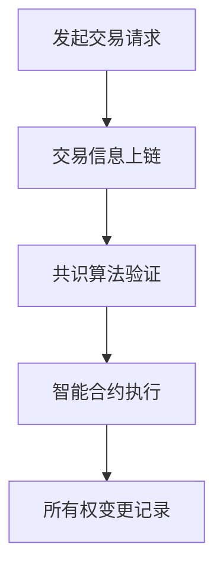

                 

### 关键词：区块链、数字艺术、NFT、加密货币、智能合约、去中心化、数字版权、透明性、安全性、可追溯性

### 摘要：

本文将探讨区块链技术在数字艺术和NFT（非同质化代币）领域的应用。区块链作为一种去中心化的分布式账本技术，通过其独特的加密和共识机制，为数字艺术作品的版权保护、交易流转、透明性及安全性提供了全新的解决方案。本文将首先介绍区块链和NFT的基础知识，随后深入分析区块链在数字艺术中的应用，最后讨论NFT市场的现状、未来趋势及面临的挑战。

## 1. 背景介绍

### 1.1 区块链技术的起源与发展

区块链技术最早由中本聪（Satoshi Nakamoto）在2008年提出，作为一种去中心化的分布式账本系统，旨在通过密码学确保数据的不可篡改性和匿名性。区块链的首次应用是在比特币（Bitcoin）的发行和交易中。随着比特币的成功，区块链技术逐渐受到广泛关注，并开始应用于更多的领域，如数字货币、供应链管理、医疗记录等。

### 1.2 数字艺术的定义与特性

数字艺术是指使用数字媒介创作的艺术作品，包括电子绘画、数字雕刻、虚拟现实艺术等。数字艺术的特性包括无限复制性、易于传播、高精度复制等，这些特性使得传统艺术品的版权保护和交易面临挑战。

### 1.3 NFT的定义与兴起

NFT（Non-Fungible Token，非同质化代币）是一种基于区块链的数字资产，其特性是唯一性和不可替代性。每个NFT都是独特的，无法与其他代币互换。NFT的兴起为数字艺术作品的认证、所有权证明和交易提供了新的途径。

## 2. 核心概念与联系

### 2.1 区块链技术核心概念

区块链技术主要包括以下核心概念：

- **块（Block）**：数据记录的集合，包含了交易信息、时间戳和哈希值等。
- **链（Chain）**：多个连续的块按照时间顺序排列，形成一个链式结构。
- **链式哈希（Chain Hash）**：每个块包含前一个块的哈希值，确保数据的完整性。
- **共识算法（Consensus Algorithm）**：网络中的节点通过共识算法达成数据的一致性。

### 2.2 NFT与区块链的关系

NFT是区块链技术的一种应用，其本质是区块链上的一个智能合约。智能合约是一段自动执行的代码，用于验证NFT的所有权和交易。NFT与区块链的关系可以用以下流程图表示：



### 2.3 数字艺术与区块链的联系

区块链技术在数字艺术领域的应用，主要是通过NFT实现对艺术作品的所有权、版权保护和交易记录的记录和验证。以下是数字艺术与区块链之间的联系：

- **数字作品上链**：艺术家将数字艺术作品上传到区块链上，生成对应的NFT。
- **版权保护**：区块链记录了数字艺术作品的创作信息、所有权和交易历史，确保版权的不可篡改性。
- **交易记录**：区块链记录了数字艺术作品的每一次交易，确保交易的透明性和可追溯性。

## 3. 核心算法原理 & 具体操作步骤

### 3.1 算法原理概述

区块链技术的核心算法是共识算法，用于确保区块链数据的完整性和一致性。常见的共识算法包括：

- **工作量证明（PoW）**：通过解决复杂的数学问题来证明节点的工作量，比特币采用的就是这种算法。
- **权益证明（PoS）**：通过持有代币的数量和时间来证明节点的权益，权益越大，参与共识的概率越高。
- **委托权益证明（DPoS）**：通过选举出代表节点来参与共识，代表节点根据持有代币的数量和持币时间来决定。

### 3.2 算法步骤详解

以下是区块链技术的基本操作步骤：

- **初始化**：创建一个新的区块链，包括一个初始区块。
- **交易创建**：用户创建交易，并将其广播到网络。
- **交易验证**：网络中的节点验证交易的有效性。
- **区块创建**：将验证后的交易添加到区块中，并生成新的区块。
- **区块验证**：网络中的节点对新区块进行验证。
- **链式链接**：将新区块链接到现有区块链上，形成完整的区块链。

### 3.3 算法优缺点

- **工作量证明（PoW）**：
  - **优点**：安全性高，去中心化，防止双花攻击。
  - **缺点**：计算资源消耗大，能源消耗高，效率低。

- **权益证明（PoS）**：
  - **优点**：能源消耗低，效率高，去中心化程度更高。
  - **缺点**：权益集中可能导致集中化，安全性相对较低。

- **委托权益证明（DPoS）**：
  - **优点**：去中心化程度较高，效率高，计算资源消耗小。
  - **缺点**：可能存在选举作弊风险。

### 3.4 算法应用领域

区块链技术的核心算法广泛应用于以下领域：

- **数字货币**：如比特币、以太坊等。
- **供应链管理**：确保供应链数据的真实性和透明性。
- **医疗记录**：保护患者隐私和医疗记录的安全。
- **数字版权**：确保数字作品的版权保护和交易记录。
- **身份验证**：提供去中心化的身份验证服务。

## 4. 数学模型和公式 & 详细讲解 & 举例说明

### 4.1 数学模型构建

区块链技术的数学模型主要包括以下方面：

- **加密算法**：用于保护区块链数据的加密机制，如RSA、SHA等。
- **共识算法**：用于确保区块链数据一致性的算法，如PoW、PoS等。
- **智能合约**：用于自动化执行交易和合约条款的代码，如Solidity。

### 4.2 公式推导过程

以下是区块链技术中的一些关键数学公式：

- **哈希函数**：$H = SHA_256(X)$，其中$H$是哈希值，$X$是输入数据。
- **工作量证明**：$PoW = X^{n^2}$，其中$PoW$是工作量证明，$X$是密码，$n$是迭代次数。
- **权益证明**：$PoS = P^T$，其中$PoS$是权益证明，$P$是权益比例，$T$是时间。

### 4.3 案例分析与讲解

以比特币的工作量证明（PoW）为例，其数学模型如下：

- **哈希碰撞**：找到满足$SHA_256(X) < T$的哈希值$X$，其中$T$是目标值。
- **挖矿**：节点使用计算资源寻找满足条件的哈希值，找到后即完成一次挖矿。
- **奖励**：成功挖矿的节点将获得比特币奖励。

## 5. 项目实践：代码实例和详细解释说明

### 5.1 开发环境搭建

为了演示区块链在数字艺术中的应用，我们将使用以太坊智能合约开发一个NFT交易平台。以下是开发环境搭建步骤：

1. 安装Node.js和npm。
2. 安装Truffle框架：`npm install -g truffle`。
3. 初始化Truffle项目：`truffle init`。
4. 安装Ganache：下载并安装Ganache。
5. 配置Truffle项目文件：`truffle-config.js`。

### 5.2 源代码详细实现

以下是NFT交易平台智能合约的示例代码：

```solidity
// SPDX-License-Identifier: MIT
pragma solidity ^0.8.0;

import "@openzeppelin/contracts/token/ERC721/ERC721.sol";
import "@openzeppelin/contracts/utils/Counters.sol";

contract NFTMarketplace is ERC721 {
    using Counters for Counters.Counter;
    Counters.Counter private _tokenIds;

    constructor() ERC721("NFTMarketplace", "NMP") {}

    function createToken(string memory tokenURI)
        public
        returns (uint256)
    {
        uint256 newItemId = _tokenIds.current();
        _tokenIds.increment();
        _mint(msg.sender, newItemId);
        _setTokenURI(newItemId, tokenURI);
        return newItemId;
    }

    function createMarketItem(uint256 tokenId, uint256 price) public {
        require(tokenId < _tokenIds.current(), "Token ID does not exist");
        require(price > 0, "Price must be at least 1 wei");
        _transfer(msg.sender, address(this), tokenId);
        marketItems[tokenId] = MarketItem({seller: msg.sender, price: price, sellerUndoTimeout: block.timestamp + 1 days});
        emit MarketItemCreated(tokenId, price);
    }

    function buyMarketItem(uint256 tokenId) public payable {
        require(marketItems[tokenId].seller != address(0), "Item does not exist");
        require(msg.value >= marketItems[tokenId].price, "Not enough wei sent");
        address seller = marketItems[tokenId].seller;
        _transfer(address(this), msg.sender, tokenId);
        payable(seller).transfer(msg.value);
        delete marketItems[tokenId];
        emit MarketItemBought(tokenId);
    }

    function renounceMarketItem(uint256 tokenId) public {
        require(marketItems[tokenId].seller == msg.sender, "You are not the seller");
        require(block.timestamp > marketItems[tokenId].sellerUndoTimeout, "Seller undo period still active");
        _transfer(address(this), msg.sender, tokenId);
        delete marketItems[tokenId];
        emit MarketItemRenounced(tokenId);
    }
}
```

### 5.3 代码解读与分析

- **ERC721继承**：智能合约继承自OpenZeppelin的ERC721标准，用于实现NFT的基本功能。
- **创建NFT**：`createToken`函数用于创建新的NFT，并设置其URI。
- **创建市场物品**：`createMarketItem`函数用于将NFT放入市场销售，设置价格。
- **购买市场物品**：`buyMarketItem`函数用于购买市场中的NFT，并将所有权转移给买家。
- **撤销市场物品**：`renounceMarketItem`函数允许卖家在指定时间内撤销已放入市场的NFT。

### 5.4 运行结果展示

以下是智能合约在以太坊测试网络上的运行结果：

```bash
$ truffle migrate --network localhost
```

运行结果将生成合约地址和ABI，用于与合约进行交互。

## 6. 实际应用场景

### 6.1 数字艺术作品版权保护

区块链技术为数字艺术作品的版权保护提供了新的解决方案。艺术家可以通过将作品上链并生成NFT，实现对作品的唯一性和所有权证明。这有助于防止未经授权的复制和分发，同时为艺术家提供了新的收益模式。

### 6.2 数字艺术品交易

区块链技术为数字艺术品交易提供了透明、可追溯的交易记录。艺术家可以通过区块链平台出售其数字艺术品，买家可以轻松验证作品的真实性和所有权。这为数字艺术市场带来了更多的流动性和信任。

### 6.3 数字藏品市场

随着NFT的兴起，数字藏品市场逐渐崭露头角。数字藏品包括虚拟土地、虚拟商品、游戏道具等，它们在区块链上具有唯一性和不可替代性。数字藏品市场为用户提供了全新的收藏和交易体验。

### 6.4 数字艺术展览

区块链技术还可以用于数字艺术展览。艺术家可以将作品上传到区块链，并在虚拟展览中展示。观众可以通过区块链验证作品的真实性，并在购买后获得唯一的所有权证明。

## 7. 工具和资源推荐

### 7.1 学习资源推荐

- **《区块链技术指南》**：一本全面介绍区块链技术的入门书籍，适合初学者阅读。
- **《智能合约编程指南》**：一本专门介绍智能合约编程的书籍，适合有编程基础的学习者。
- **区块链官网**：区块链官网提供了丰富的技术文档和教程，是学习区块链技术的优秀资源。

### 7.2 开发工具推荐

- **Truffle**：一个流行的以太坊开发框架，提供了智能合约的编写、部署和测试功能。
- **Ganache**：一个本地以太坊测试网络，用于测试智能合约。
- **Hardhat**：一个功能强大的以太坊开发框架，支持智能合约的编写、部署和测试。

### 7.3 相关论文推荐

- **《比特币：一种点对点的电子现金系统》**：中本聪的比特币白皮书，是区块链技术的经典之作。
- **《智能合约：设计与实现》**：介绍了智能合约的设计原则和实现方法，是学习智能合约编程的必读论文。
- **《以太坊黄皮书》**：详细介绍了以太坊的技术架构和智能合约实现。

## 8. 总结：未来发展趋势与挑战

### 8.1 研究成果总结

区块链技术在数字艺术和NFT领域的应用取得了显著成果，为数字艺术作品的版权保护、交易流转和透明性提供了有效解决方案。NFT市场的迅速发展，也为数字艺术品交易带来了新的机遇。

### 8.2 未来发展趋势

- **技术成熟**：随着区块链技术的不断成熟，NFT市场的规模将进一步扩大，应用领域将不断扩展。
- **生态构建**：越来越多的艺术家、画廊和平台将加入NFT市场，推动生态系统的完善和发展。
- **监管合规**：监管机构将加强对NFT市场的监管，确保市场的健康发展。

### 8.3 面临的挑战

- **技术难题**：区块链技术仍面临性能、可扩展性和安全性等挑战，需要进一步研究和优化。
- **法律合规**：NFT市场的法律地位和监管政策尚不明确，需要建立合适的法律框架。
- **用户教育**：普及区块链和NFT知识，提高用户的认知和参与度。

### 8.4 研究展望

未来，区块链技术在数字艺术和NFT领域的应用将更加广泛和深入。研究人员和开发人员应继续探索区块链技术的创新应用，为数字艺术市场带来更多的价值和机遇。

## 9. 附录：常见问题与解答

### 9.1 什么是区块链？

区块链是一种分布式数据库，通过加密和共识机制确保数据的不可篡改性和安全性。

### 9.2 什么是NFT？

NFT（Non-Fungible Token，非同质化代币）是一种基于区块链的数字资产，具有唯一性和不可替代性。

### 9.3 区块链技术在数字艺术领域有哪些应用？

区块链技术在数字艺术领域主要用于版权保护、交易流转、透明性和安全性。

### 9.4 NFT市场现状如何？

NFT市场近年来迅速崛起，吸引了大量艺术家、收藏家和投资者的关注。市场规模和交易量持续增长。

### 9.5 区块链技术在数字艺术和NFT领域的未来发展趋势？

随着技术的成熟和市场的不断完善，区块链技术在数字艺术和NFT领域的应用将更加广泛和深入。

### 9.6 如何创建NFT？

创建NFT通常需要使用区块链平台和智能合约，艺术家可以通过上传作品并生成NFT来实现。

