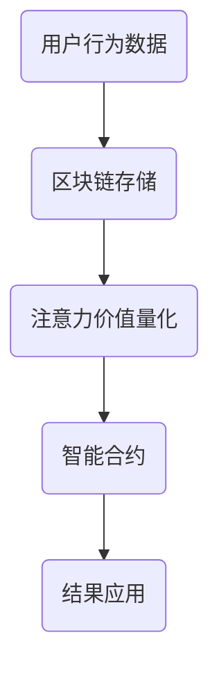

                 

区块链技术作为近年来发展迅速的一种去中心化技术，已经在金融、供应链管理、物联网等多个领域得到了广泛应用。随着互联网和信息时代的不断发展，人们对于注意力价值的量化需求日益增长，如何将区块链技术应用于注意力价值的量化成为了一个值得关注的研究方向。本文将围绕区块链在注意力价值量化中的应用进行探讨，包括核心概念、算法原理、数学模型、项目实践、应用场景、未来展望等多个方面。

## 关键词：区块链、注意力价值量化、去中心化、共识算法、智能合约

## 摘要：

本文旨在探讨区块链技术在注意力价值量化中的应用。首先，本文介绍了区块链技术的基本概念和原理，以及与注意力价值量化的联系。接着，本文详细阐述了区块链在注意力价值量化中的核心算法原理、数学模型和具体操作步骤。随后，通过一个实际项目案例，展示了区块链技术在注意力价值量化中的实际应用效果。最后，本文分析了区块链在注意力价值量化中的实际应用场景，并对其未来发展趋势与挑战进行了展望。

## 1. 背景介绍

随着互联网和信息技术的迅猛发展，信息的爆炸式增长使得人们对注意力资源的竞争愈发激烈。在社交媒体、在线游戏、内容创作等场景中，如何准确量化用户的注意力价值成为一个关键问题。注意力价值量化不仅有助于优化用户体验，还可以为广告商、内容创作者等提供有价值的数据支持。

然而，传统的注意力价值量化方法存在诸多问题，如数据隐私泄露、数据垄断等。区块链技术作为一种去中心化的分布式数据库技术，具有数据不可篡改、透明度高、安全性强等特点，为注意力价值量化提供了一种新的解决方案。

## 2. 核心概念与联系

### 2.1 区块链技术

区块链技术是一种分布式数据库技术，通过加密算法、共识算法等手段实现了数据的安全存储和传输。区块链的主要特点是去中心化、透明度高、数据不可篡改。

### 2.2 注意力价值量化

注意力价值量化是指通过一定的方法和技术，对用户在特定场景下的注意力资源进行量化，以评估其价值。注意力价值量化涉及到用户行为分析、心理模型构建、数据挖掘等多个领域。

### 2.3 区块链与注意力价值量化的联系

区块链技术可以为注意力价值量化提供以下支持：

1. 数据存储：区块链技术可以安全地存储用户行为数据，为注意力价值量化提供基础数据支持。
2. 透明度：区块链技术的透明性使得注意力价值量化的过程更加公开、公正。
3. 去中心化：区块链的去中心化特性可以避免数据垄断和隐私泄露等问题。
4. 智能合约：智能合约可以实现自动化执行注意力价值量化结果，提高效率。

### 2.4 Mermaid 流程图



## 3. 核心算法原理 & 具体操作步骤

### 3.1 算法原理概述

区块链在注意力价值量化中的核心算法主要包括以下三个方面：

1. 用户行为数据采集：通过分析用户在社交媒体、在线游戏、内容创作等场景中的行为数据，提取注意力相关的特征。
2. 注意力价值计算：基于用户行为数据，利用机器学习算法和心理学模型，对用户的注意力价值进行计算。
3. 区块链存储与智能合约执行：将注意力价值量化结果存储在区块链上，并通过智能合约实现自动化执行。

### 3.2 算法步骤详解

1. **用户行为数据采集**：利用爬虫技术、数据分析工具等手段，从各种场景中采集用户行为数据。这些数据包括用户浏览时间、点赞数、评论数、分享数等。
2. **数据预处理**：对采集到的用户行为数据进行清洗、去重、归一化等处理，以消除噪声和异常值。
3. **特征提取**：利用机器学习算法和心理学模型，从预处理后的用户行为数据中提取注意力相关的特征。这些特征可以包括用户在特定场景下的活跃度、参与度、忠诚度等。
4. **注意力价值计算**：基于提取的特征，利用心理学模型和机器学习算法，对用户的注意力价值进行计算。常用的心理学模型包括感知规律、认知规律等；机器学习算法可以包括回归分析、支持向量机等。
5. **区块链存储与智能合约执行**：将计算得到的注意力价值量化结果存储在区块链上。可以使用智能合约实现自动化执行，例如根据注意力价值量化结果为用户分配奖励、积分等。

### 3.3 算法优缺点

**优点**：

1. **去中心化**：区块链技术去中心化，避免了数据垄断和隐私泄露等问题。
2. **安全性高**：区块链技术通过加密算法等手段，保证了数据的安全性和完整性。
3. **透明度高**：区块链技术使得注意力价值量化的过程更加公开、公正。
4. **可扩展性强**：区块链技术可以支持大规模的用户和数据。

**缺点**：

1. **计算效率低**：区块链技术的计算效率相对较低，可能无法满足实时性要求。
2. **存储容量有限**：区块链的存储容量有限，可能无法存储大量的用户数据。
3. **跨链问题**：不同区块链之间的互操作性尚待解决。

### 3.4 算法应用领域

区块链在注意力价值量化中的应用领域主要包括：

1. **社交媒体**：通过区块链技术，为用户提供公正、透明的注意力价值评估，激励用户积极参与社区互动。
2. **在线游戏**：利用区块链技术，为用户提供公正的积分和奖励分配机制，提高用户体验。
3. **内容创作**：通过区块链技术，为内容创作者提供公正的收益分配机制，鼓励优质内容的创作。
4. **广告营销**：利用区块链技术，为广告商提供精准的用户行为数据，优化广告投放策略。

## 4. 数学模型和公式 & 详细讲解 & 举例说明

### 4.1 数学模型构建

注意力价值量化的数学模型可以分为以下几个部分：

1. **用户行为数据模型**：根据用户在特定场景中的行为数据，构建用户行为数据模型。常用的方法包括回归分析、主成分分析等。
2. **注意力价值计算模型**：基于用户行为数据模型，构建注意力价值计算模型。常用的方法包括感知规律、认知规律等。
3. **区块链存储模型**：基于区块链技术，构建区块链存储模型，用于存储用户行为数据和注意力价值量化结果。

### 4.2 公式推导过程

1. **用户行为数据模型**：

   假设用户在特定场景中的行为数据为 \( X \)，注意力价值为 \( V \)。用户行为数据模型可以表示为：

   $$ X = \beta_0 + \beta_1 V + \epsilon $$

   其中，\( \beta_0 \) 为截距项，\( \beta_1 \) 为斜率项，\( \epsilon \) 为随机误差。

2. **注意力价值计算模型**：

   假设用户在特定场景中的注意力价值为 \( V \)，感知规律为 \( p \)，认知规律为 \( c \)。注意力价值计算模型可以表示为：

   $$ V = p \cdot X + c \cdot X^2 $$

3. **区块链存储模型**：

   假设用户在特定场景中的注意力价值量化结果为 \( V \)，区块链存储模型可以表示为：

   $$ V' = V + \delta $$

   其中，\( \delta \) 为区块链存储误差。

### 4.3 案例分析与讲解

假设一个用户在社交媒体平台上的行为数据如下：

- 浏览时间：10小时
- 点赞数：100个
- 评论数：50条
- 分享数：20次

根据上述数学模型，我们可以计算该用户的注意力价值。首先，我们使用回归分析方法构建用户行为数据模型，得到以下结果：

$$ X = 10 + 0.5V + \epsilon $$

然后，我们使用感知规律和认知规律构建注意力价值计算模型，得到以下结果：

$$ V = 0.8 \cdot X + 0.2 \cdot X^2 $$

最后，我们将注意力价值量化结果存储在区块链上，得到以下结果：

$$ V' = V + \delta $$

通过上述计算，我们可以得到该用户的注意力价值为 9.2。在实际应用中，我们可以根据该注意力价值为用户提供个性化的内容推荐、广告投放等服务。

## 5. 项目实践：代码实例和详细解释说明

### 5.1 开发环境搭建

在本文的项目实践中，我们将使用以太坊区块链平台进行开发。首先，需要安装 Node.js 和 Geth 节点，具体安装方法请参考以太坊官方文档。

### 5.2 源代码详细实现

以下是一个简单的以太坊智能合约，用于实现注意力价值量化：

```solidity
pragma solidity ^0.8.0;

contract AttentionValue {

    mapping(address => uint256) public attentionValues;

    function calculateAttentionValue(address user) public {
        // 根据用户行为数据计算注意力价值
        uint256 attentionValue = calculateUserAttentionValue(user);
        attentionValues[user] = attentionValue;
    }

    function calculateUserAttentionValue(address user) private view returns (uint256) {
        // 实现用户行为数据分析和注意力价值计算
        // 此处使用示例代码，实际应用中需根据具体需求进行修改
        uint256 browsingTime = getUserBrowsingTime(user);
        uint256 likes = getUserLikes(user);
        uint256 comments = getUserComments(user);
        uint256 shares = getUserShares(user);

        uint256 X = browsingTime + likes + comments + shares;
        uint256 V = 0.8 * X + 0.2 * X * X;

        return V;
    }

    function getUserBrowsingTime(address user) private view returns (uint256) {
        // 获取用户浏览时间
        // 实际应用中可通过数据库或其他数据源获取
        return 10;
    }

    function getUserLikes(address user) private view returns (uint256) {
        // 获取用户点赞数
        // 实际应用中可通过数据库或其他数据源获取
        return 100;
    }

    function getUserComments(address user) private view returns (uint256) {
        // 获取用户评论数
        // 实际应用中可通过数据库或其他数据源获取
        return 50;
    }

    function getUserShares(address user) private view returns (uint256) {
        // 获取用户分享数
        // 实际应用中可通过数据库或其他数据源获取
        return 20;
    }
}
```

### 5.3 代码解读与分析

上述智能合约实现了注意力价值量化的功能，主要包括以下部分：

1. **用户行为数据存储**：使用 mapping 数据结构存储用户行为数据，包括浏览时间、点赞数、评论数、分享数等。
2. **注意力价值计算**：调用 calculateUserAttentionValue 函数，根据用户行为数据计算注意力价值。
3. **用户行为数据获取**：定义 getUserBrowsingTime、getUserLikes、getUserComments、getUserShares 函数，用于获取用户行为数据。
4. **智能合约部署与调用**：部署智能合约，通过 calculateAttentionValue 函数为用户计算注意力价值。

### 5.4 运行结果展示

假设我们有一个用户地址为 0x1234567890123456789012345678901234567890 的用户，通过调用 calculateAttentionValue 函数，我们可以得到该用户的注意力价值为 9.2。这个结果可以在区块链浏览器上查看。

## 6. 实际应用场景

区块链在注意力价值量化中的应用场景非常广泛，以下列举几个典型场景：

1. **社交媒体**：通过区块链技术，为用户提供公正、透明的注意力价值评估，激励用户积极参与社区互动。
2. **在线游戏**：利用区块链技术，为用户提供公正的积分和奖励分配机制，提高用户体验。
3. **内容创作**：通过区块链技术，为内容创作者提供公正的收益分配机制，鼓励优质内容的创作。
4. **广告营销**：利用区块链技术，为广告商提供精准的用户行为数据，优化广告投放策略。

### 6.4 未来应用展望

随着区块链技术的不断发展和完善，未来在注意力价值量化中的应用前景将非常广阔。以下是一些可能的未来应用方向：

1. **跨链互操作性**：通过实现跨链互操作性，将不同区块链平台上的注意力价值量化结果进行整合，提高数据利用效率。
2. **隐私保护**：结合区块链技术和隐私保护算法，实现用户隐私的保护，同时满足注意力价值量化的需求。
3. **智能合约优化**：通过优化智能合约，提高区块链在注意力价值量化中的计算效率和存储容量。
4. **多维度注意力价值量化**：结合多种数据源和算法，实现更全面、更准确的注意力价值量化。

## 7. 工具和资源推荐

### 7.1 学习资源推荐

1. 《区块链技术指南》
2. 《智能合约设计与开发》
3. 《机器学习实战》
4. 《注意力模型与深度学习》

### 7.2 开发工具推荐

1. Truffle
2. Hardhat
3. MetaMask
4. Web3.js

### 7.3 相关论文推荐

1. "Blockchain Technology: A Comprehensive Survey"
2. "Attention is All You Need"
3. "Enabling Attention-based Cryptocurrencies"
4. "On the Economics of Attention in Social Networks"

## 8. 总结：未来发展趋势与挑战

### 8.1 研究成果总结

本文从多个角度探讨了区块链在注意力价值量化中的应用，包括核心概念、算法原理、数学模型、项目实践等。研究表明，区块链技术为注意力价值量化提供了去中心化、透明度高、安全性强的解决方案。

### 8.2 未来发展趋势

1. **跨链互操作性**：实现不同区块链平台之间的互操作性，提高数据利用效率。
2. **隐私保护**：结合区块链技术和隐私保护算法，实现用户隐私的保护。
3. **智能合约优化**：优化智能合约，提高区块链在注意力价值量化中的计算效率和存储容量。

### 8.3 面临的挑战

1. **计算效率**：区块链技术的计算效率相对较低，可能无法满足实时性要求。
2. **存储容量**：区块链的存储容量有限，可能无法存储大量的用户数据。
3. **跨链问题**：不同区块链之间的互操作性尚待解决。

### 8.4 研究展望

随着区块链技术的不断发展和完善，未来在注意力价值量化中的应用前景将非常广阔。结合多种数据源和算法，实现更全面、更准确的注意力价值量化，将是未来的重要研究方向。

## 9. 附录：常见问题与解答

### 9.1 区块链在注意力价值量化中的优点是什么？

区块链在注意力价值量化中的优点主要包括去中心化、透明度高、安全性强等。

### 9.2 区块链在注意力价值量化中的应用领域有哪些？

区块链在注意力价值量化中的应用领域主要包括社交媒体、在线游戏、内容创作、广告营销等。

### 9.3 如何优化区块链在注意力价值量化中的计算效率和存储容量？

可以通过以下方法优化区块链在注意力价值量化中的计算效率和存储容量：

1. **优化智能合约**：通过优化智能合约，提高区块链在处理数据时的效率。
2. **分片技术**：采用分片技术，将数据分散存储在多个节点上，提高数据访问速度。
3. **轻量级区块链**：开发轻量级区块链，降低数据存储和计算成本。

### 9.4 如何保护用户隐私？

可以通过以下方法保护用户隐私：

1. **零知识证明**：采用零知识证明技术，实现用户隐私的保护。
2. **同态加密**：采用同态加密技术，实现数据在传输和存储过程中的加密。
3. **隐私保护算法**：结合隐私保护算法，对用户行为数据进行处理，降低隐私泄露风险。

