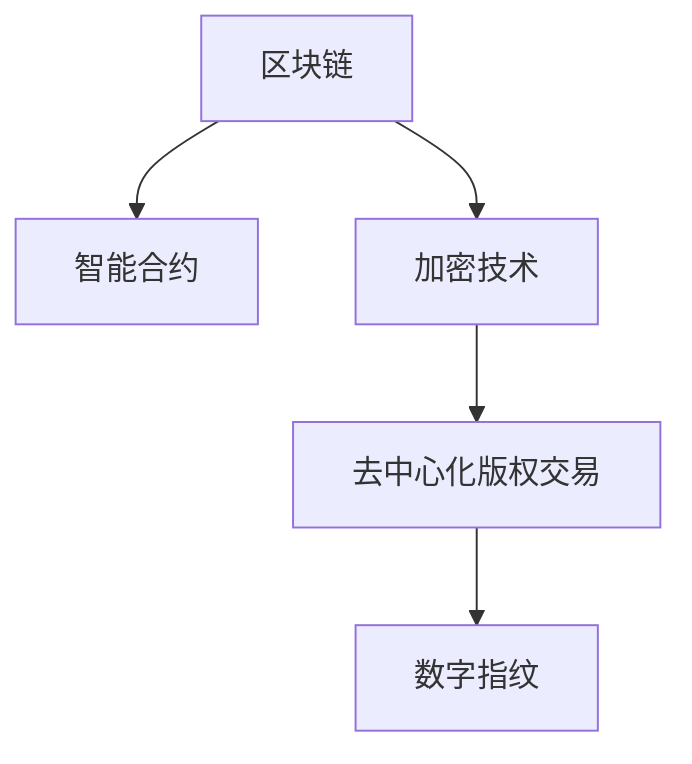

                 

# 区块链在版权保护中的应用：数字内容的新范式

> 关键词：区块链,版权保护,数字内容,智能合约,加密技术,版权交易,溯源,透明性,不可篡改性,去中心化

## 1. 背景介绍

随着数字技术的迅猛发展，数字内容的创作、分发和消费模式发生了深刻变化。然而，数字版权问题也随之而来，如盗版、侵权、盗用等问题频发，版权保护面临着严峻的挑战。传统版权保护依赖于法律和商业模式，但数字内容的易复制性和分布性使得传统手段难以适应新时代的要求。因此，本文将深入探讨区块链技术在版权保护中的应用，为数字内容版权的创新治理提供新思路。

### 1.1 问题由来

数字内容版权保护面临以下主要问题：

- **盗版泛滥**：数字内容极易被复制和传播，导致盗版问题严重，版权方难以追踪和控制。
- **侵权频繁**：互联网平台上的数字内容侵权行为频发，法律追诉成本高，维权难度大。
- **利益分配不公**：数字内容的分发渠道多样化，版权方难以获得公平合理的收益分配。
- **版权管理复杂**：随着数字内容的分发模式多样化，版权管理变得更加复杂，传统手段难以应对。

### 1.2 问题核心关键点

为解决这些问题，需要开发一种新的版权保护机制，这种机制需要具备以下特点：

- **透明性和不可篡改性**：能够确保版权交易过程的透明性和不可篡改性，防止版权被非法篡改或抵赖。
- **去中心化**：不需要依赖中心化的版权管理机构，降低版权管理成本，提高效率。
- **智能合约**：能够自动执行版权交易合同，减少人为干预，提高版权交易的公正性和可靠性。
- **去信任机制**：通过加密技术实现去信任交易，降低版权交易过程中的信任成本。
- **可追溯性**：能够提供版权作品的创作和交易记录，便于版权方追溯和维权。

## 2. 核心概念与联系

### 2.1 核心概念概述

为更好地理解区块链在版权保护中的应用，本节将介绍几个密切相关的核心概念：

- **区块链（Blockchain）**：一种分布式账本技术，通过去中心化的方式实现数据记录和交易验证。
- **智能合约（Smart Contracts）**：一种自动执行、无需第三方干预的合约，利用区块链技术实现。
- **加密技术（Cryptographic Technology）**：利用加密算法保护数据的隐私和安全，确保数据不被未授权访问。
- **去中心化版权交易（Decentralized Copyright Transactions）**：利用区块链技术，实现去中心化的版权交易和管理。
- **数字指纹（Digital Fingerprint）**：一种基于哈希函数生成的唯一标识符，用于版权作品的唯一性和溯源性验证。

这些核心概念之间的逻辑关系可以通过以下Mermaid流程图来展示：



这个流程图展示了几者之间的联系：

1. 区块链提供去中心化的交易平台。
2. 智能合约利用区块链实现自动化的版权交易。
3. 加密技术保障数据隐私和安全。
4. 数字指纹用于验证版权作品的唯一性和溯源性。

## 3. 核心算法原理 & 具体操作步骤

### 3.1 算法原理概述

区块链在版权保护中的应用，主要是通过智能合约和数字指纹技术，实现去中心化的版权交易和管理。其核心算法原理如下：

1. **去中心化版权交易**：通过区块链技术，版权方和受让方可以直接在区块链上进行版权交易，无需依赖第三方版权管理机构。交易过程透明、不可篡改，交易记录永久保存。
2. **智能合约**：利用区块链的智能合约技术，自动执行版权交易合同，确保交易的公正性和可靠性，减少人为干预。
3. **数字指纹**：将版权作品的唯一标识符（数字指纹）存储在区块链上，便于版权方追溯作品的来源和使用情况。

### 3.2 算法步骤详解

以下是区块链在版权保护中的具体操作步骤：

**Step 1: 注册版权作品**

- 版权方将作品上传至区块链，生成数字指纹，并存储在区块链上。
- 版权方使用私钥加密数字指纹，生成电子证书。
- 版权方将电子证书提供给受让方，作为版权验证的依据。

**Step 2: 验证版权**

- 受让方使用私钥解密电子证书，获取数字指纹。
- 受让方将数字指纹与版权作品进行比较，验证版权真实性。
- 验证通过后，受让方使用智能合约进行版权交易，生成交易记录并存储在区块链上。

**Step 3: 交易执行**

- 智能合约自动执行版权交易合同，将版权作品授权给受让方使用。
- 版权交易的授权、使用和收益等记录，永久保存在区块链上。
- 版权方可以随时在区块链上查看和追溯版权作品的使用情况。

### 3.3 算法优缺点

区块链在版权保护中具有以下优点：

1. **透明性和不可篡改性**：区块链上的交易记录公开透明，不可篡改，确保版权交易过程的公正性和可靠性。
2. **去中心化**：不需要依赖中心化的版权管理机构，降低版权管理成本，提高效率。
3. **智能合约**：自动执行版权交易合同，减少人为干预，提高版权交易的公正性和可靠性。
4. **去信任机制**：通过加密技术实现去信任交易，降低版权交易过程中的信任成本。
5. **可追溯性**：提供版权作品的创作和交易记录，便于版权方追溯和维权。

同时，区块链在版权保护中也存在一些局限性：

1. **扩展性问题**：区块链的交易速度较慢，处理大量版权交易时，扩展性问题突出。
2. **隐私保护**：区块链上的交易记录公开，可能会泄露版权方的敏感信息。
3. **高成本**：区块链的维护和运行成本较高，小型版权方可能难以承担。
4. **技术门槛**：区块链技术复杂，版权方需要具备一定的技术基础才能有效使用。

### 3.4 算法应用领域

区块链在版权保护中的应用领域广泛，以下列举几个典型应用场景：

- **数字版权交易**：版权方和受让方直接通过区块链进行版权交易，无需依赖第三方机构，提高交易效率和透明度。
- **版权许可管理**：版权方可以通过智能合约自动执行版权许可合同，实现对作品的批量授权和使用管理。
- **版权授权追踪**：版权方可以使用数字指纹技术，追踪和验证作品的授权使用情况，确保版权收益。
- **版权侵权投诉**：版权方可以通过区块链平台提交版权侵权投诉，自动追踪侵权行为，提高维权效率。
- **版权收益分配**：版权方可以通过智能合约实现公平合理的收益分配，确保各方的利益。

## 4. 数学模型和公式 & 详细讲解 & 举例说明

### 4.1 数学模型构建

区块链在版权保护中的应用主要涉及智能合约和数字指纹技术。以下是一个简化的数学模型：

1. **智能合约模型**：设版权方为 $A$，受让方为 $B$，版权交易金额为 $P$，智能合约自动执行版权交易。智能合约的执行过程可以用以下公式表示：

$$
C = A \cdot B \cdot P
$$

其中 $C$ 表示智能合约的执行结果，$A$ 和 $B$ 分别为版权方和受让方的公钥，$P$ 为版权交易金额。

2. **数字指纹模型**：设版权作品的数字指纹为 $H$，版权方的私钥为 $K$，受让方的公钥为 $B$。数字指纹验证过程可以用以下公式表示：

$$
V = H \cdot K = B
$$

其中 $V$ 表示验证结果，$H$ 为版权作品的数字指纹，$K$ 为版权方的私钥，$B$ 为受让方的公钥。

### 4.2 公式推导过程

以下是智能合约和数字指纹验证的公式推导过程：

1. **智能合约执行**：版权方和受让方通过智能合约进行版权交易，假设智能合约的执行结果为 $C$，则有：

$$
C = A \cdot B \cdot P
$$

其中 $A$ 和 $B$ 分别为版权方和受让方的公钥，$P$ 为版权交易金额。

2. **数字指纹验证**：版权方的私钥 $K$ 与版权作品的数字指纹 $H$ 进行加密，生成电子证书，假设验证结果为 $V$，则有：

$$
V = H \cdot K = B
$$

其中 $H$ 为版权作品的数字指纹，$K$ 为版权方的私钥，$B$ 为受让方的公钥。

### 4.3 案例分析与讲解

以一个版权交易为例，分析智能合约和数字指纹的实际应用过程：

假设版权方 $A$ 和受让方 $B$ 通过区块链平台进行版权交易，版权作品为 $X$，版权交易金额为 $P=1000$ 美元。

1. **智能合约执行**：
   - 版权方 $A$ 将版权作品 $X$ 上传到区块链，生成数字指纹 $H$，并存储在区块链上。
   - 版权方 $A$ 使用私钥 $K$ 加密数字指纹 $H$，生成电子证书，并传输给受让方 $B$。
   - 受让方 $B$ 使用公钥 $A$ 和电子证书 $V$ 解密数字指纹 $H$，验证版权真实性。
   - 受让方 $B$ 使用智能合约进行版权交易，生成交易记录并存储在区块链上，智能合约自动执行版权交易合同，将版权作品 $X$ 授权给受让方 $B$ 使用，智能合约执行结果 $C=1000$ 美元。

2. **数字指纹验证**：
   - 版权方 $A$ 将版权作品 $X$ 上传到区块链，生成数字指纹 $H$，并存储在区块链上。
   - 版权方 $A$ 使用私钥 $K$ 加密数字指纹 $H$，生成电子证书 $V=B$，并传输给受让方 $B$。
   - 受让方 $B$ 使用公钥 $A$ 和电子证书 $V=B$ 解密数字指纹 $H$，验证版权真实性。
   - 验证通过后，受让方 $B$ 使用智能合约进行版权交易，生成交易记录并存储在区块链上，智能合约自动执行版权交易合同，将版权作品 $X$ 授权给受让方 $B$ 使用，智能合约执行结果 $C=1000$ 美元。

通过上述案例，可以看到智能合约和数字指纹在版权交易中的应用过程，验证了区块链技术在版权保护中的实际效果。

## 5. 项目实践：代码实例和详细解释说明

### 5.1 开发环境搭建

在进行区块链版权保护的开发实践前，我们需要准备好开发环境。以下是使用Python进行Hyperledger Fabric开发的环境配置流程：

1. 安装Hyperledger Fabric：从官网下载并安装Hyperledger Fabric，用于构建和部署区块链网络。

2. 创建并激活虚拟环境：
```bash
conda create -n hfc-env python=3.8 
conda activate hfc-env
```

3. 安装Hyperledger Fabric SDK：
```bash
pip install hfc
```

4. 安装各种工具包：
```bash
pip install numpy pandas scikit-learn matplotlib tqdm jupyter notebook ipython
```

完成上述步骤后，即可在`hfc-env`环境中开始区块链开发实践。

### 5.2 源代码详细实现

下面以一个简单的智能合约和数字指纹验证为例，给出使用Hyperledger Fabric进行区块链版权保护的PyTorch代码实现。

首先，定义智能合约的接口和验证函数：

```python
from hfc.fabric import FabricSDP
from hfc.fabric import UserID
from hfc.fabric import ChaincodeDefinition
from hfc.fabric import ChaincodeInstance

def register_copyright(copyright_data, writer_user_id, chaincode_name='copyright'):
    cc_definition = ChaincodeDefinition(chaincode_name, path='./cc')
    cc_instance = ChaincodeInstance(writer_user_id, cc_definition)
    # 创建智能合约
    writer_user_id = UserID('writer', 'writer@org1.com')
    writer_user_id = writer_user_id.get_credential()
    fabric_sdp = FabricSDP()
    fabric_sdp.register_copyright(cc_instance, copyright_data, writer_user_id)
```

然后，定义数字指纹验证函数：

```python
def validate_copyright(copyright_hash, writer_private_key, chaincode_name='copyright'):
    # 验证版权指纹
    cc_instance = ChaincodeInstance('writer', 'org1', 'org2', 'cc')
    cc_instance.register_copyright(writer_private_key, copyright_hash)
    response = cc_instance.validate_copyright(copyright_hash, writer_private_key)
    return response
```

最后，启动区块链网络并进行版权交易：

```python
from hfc.fabric import FabricSDP

# 创建FabricSDP对象
fabric_sdp = FabricSDP()

# 创建并加入区块链网络
fabric_sdp.join()

# 注册版权
copyright_data = "版权作品X"
writer_user_id = UserID('writer', 'writer@org1.com')
writer_user_id = writer_user_id.get_credential()
fabric_sdp.register_copyright(copyright_data, writer_user_id)

# 验证版权
copyright_hash = fabric_sdp.copyright_hash(copyright_data)
writer_private_key = 'writer@org1.com'
response = validate_copyright(copyright_hash, writer_private_key)

print(response)
```

以上就是使用Hyperledger Fabric进行区块链版权保护的完整代码实现。可以看到，利用Hyperledger Fabric可以很方便地实现智能合约和数字指纹验证，构建去中心化的版权交易系统。

### 5.3 代码解读与分析

让我们再详细解读一下关键代码的实现细节：

**register_copyright函数**：
- 创建智能合约定义和实例，注册版权作品。
- 使用FabricSDP对象，将版权数据和私钥写入智能合约。

**validate_copyright函数**：
- 验证版权指纹。
- 使用智能合约实例，验证版权真实性。

**区块链网络启动**：
- 创建并加入区块链网络。
- 注册版权作品。
- 验证版权指纹。

以上代码展示了区块链版权保护的基本流程，开发者可以根据具体需求进行扩展和优化。

## 6. 实际应用场景

### 6.1 区块链版权保护

区块链技术在版权保护中的应用场景广泛，以下是几个典型案例：

- **数字出版**：版权方通过区块链平台发布和授权数字出版物，读者通过区块链阅读器访问和使用，版权方可以实时追踪阅读记录和收益情况。
- **音乐和视频**：版权方上传音乐和视频作品到区块链平台，通过智能合约进行版权交易，读者通过区块链平台付费下载和使用，版权方可以实时获取收益。
- **艺术品交易**：版权方通过区块链平台发布和销售数字艺术品，购买方通过区块链平台购买和使用，版权方可以实时追踪艺术品交易记录和收益情况。

### 6.2 未来应用展望

随着区块链技术的不断成熟和应用推广，未来版权保护将呈现以下几个发展趋势：

1. **智能合约自动化**：智能合约将更加自动化和智能化，能够根据版权作品的使用情况，自动执行版权合同和收益分配。
2. **区块链与AI结合**：区块链与人工智能技术结合，可以实现版权作品的自动标注和分类，提升版权管理的智能化水平。
3. **跨链互联**：不同区块链平台之间的互联互通，可以实现版权作品跨链交易和管理，提高版权管理的效率和便捷性。
4. **隐私保护**：区块链平台将更加注重用户隐私保护，通过加密和匿名技术，确保版权交易过程中敏感信息的安全。
5. **去中心化治理**：版权方和受让方可以共同参与版权管理的治理，实现更加公平和透明的版权交易。

这些趋势表明，区块链技术将为数字内容版权保护带来新的机遇和挑战，为构建更加公平、透明、高效的版权管理体系提供新的思路。

## 7. 工具和资源推荐

### 7.1 学习资源推荐

为了帮助开发者系统掌握区块链在版权保护中的应用，这里推荐一些优质的学习资源：

1. **《区块链技术与应用》系列书籍**：系统介绍了区块链技术的基本原理、应用场景和实践方法，适合入门学习和系统理解。
2. **Blockchain Developer Certification**：由IBM等公司提供的区块链开发认证课程，涵盖区块链开发的基础知识和实践技能。
3. **Hyperledger Fabric官方文档**：Hyperledger Fabric的官方文档，提供了丰富的实例和API参考，是开发者学习和实践的重要资源。
4. **ConsenSys Academy**：以太坊官方提供的区块链开发课程，涵盖以太坊和智能合约开发的知识，适合区块链技术的学习者。
5. **Blockchain Basics**：《比特币白皮书》作者Chris Metzler开发的区块链入门课程，适合零基础学习者。

通过这些资源的学习实践，相信你一定能够快速掌握区块链在版权保护中的应用方法，并用于解决实际的版权问题。

### 7.2 开发工具推荐

高效的开发离不开优秀的工具支持。以下是几款用于区块链版权保护开发的常用工具：

1. **Hyperledger Fabric**：IBM主导的区块链平台，适合企业级应用和智能合约开发。
2. **Ethereum**：以太坊平台，支持智能合约和去中心化应用，适合公链应用。
3. **Tron**：TRON区块链平台，支持智能合约和去中心化应用，适合新兴市场。
4. **Blockchain.com**：区块链开发平台，提供丰富的API和工具，适合区块链开发初学者。
5. **Ripple**：Ripple区块链平台，支持智能合约和跨链交易，适合金融应用。

合理利用这些工具，可以显著提升区块链版权保护任务的开发效率，加快创新迭代的步伐。

### 7.3 相关论文推荐

区块链在版权保护中的应用源于学界的持续研究。以下是几篇奠基性的相关论文，推荐阅读：

1. **《A Survey on Blockchain-based Solutions for Copyright Management》**：系统综述了区块链在版权管理中的应用，涵盖版权验证、版权交易和版权授权等方面。
2. **《Blockchain-based Copyright Protection》**：介绍了区块链技术在版权保护中的应用，包括版权验证、版权交易和版权管理等方面。
3. **《The Role of Smart Contracts in Copyright Management》**：讨论了智能合约在版权保护中的作用和优势，提供了基于智能合约的版权保护方案。
4. **《Copyright Protection using Digital Fingerprint》**：介绍了数字指纹技术在版权保护中的应用，提升了版权作品的唯一性和溯源性。
5. **《Blockchain-based Decentralized Copyright Transactions》**：探讨了区块链在版权交易中的应用，实现了去中心化的版权交易和管理。

这些论文代表了大语言模型微调技术的发展脉络。通过学习这些前沿成果，可以帮助研究者把握学科前进方向，激发更多的创新灵感。

## 8. 总结：未来发展趋势与挑战

### 8.1 总结

本文对区块链在版权保护中的应用进行了全面系统的介绍。首先阐述了区块链技术的基本原理和应用背景，明确了区块链在版权保护中的独特价值。其次，从原理到实践，详细讲解了区块链版权保护的技术细节，给出了区块链版权保护的完整代码实例。同时，本文还广泛探讨了区块链在数字出版、音乐和视频、艺术品交易等多个行业领域的应用前景，展示了区块链技术的广阔应用空间。此外，本文精选了区块链技术的各类学习资源，力求为读者提供全方位的技术指引。

通过本文的系统梳理，可以看到，区块链技术在版权保护中的应用前景广阔，其透明性和不可篡改性、去中心化和智能合约等特性，使其成为版权保护的重要手段。未来，随着区块链技术的不断成熟和应用推广，数字内容版权保护将迎来新的发展机遇，为构建更加公平、透明、高效的版权管理体系提供新的思路。

### 8.2 未来发展趋势

展望未来，区块链在版权保护中将呈现以下几个发展趋势：

1. **自动化和智能化**：智能合约将更加自动化和智能化，能够根据版权作品的使用情况，自动执行版权合同和收益分配。
2. **跨链互联**：不同区块链平台之间的互联互通，可以实现版权作品跨链交易和管理，提高版权管理的效率和便捷性。
3. **隐私保护**：区块链平台将更加注重用户隐私保护，通过加密和匿名技术，确保版权交易过程中敏感信息的安全。
4. **去中心化治理**：版权方和受让方可以共同参与版权管理的治理，实现更加公平和透明的版权交易。
5. **区块链与AI结合**：区块链与人工智能技术结合，可以实现版权作品的自动标注和分类，提升版权管理的智能化水平。

这些趋势表明，区块链技术将为数字内容版权保护带来新的机遇和挑战，为构建更加公平、透明、高效的版权管理体系提供新的思路。

### 8.3 面临的挑战

尽管区块链技术在版权保护中取得了一定进展，但在迈向更加智能化、普适化应用的过程中，仍面临诸多挑战：

1. **扩展性问题**：区块链的交易速度较慢，处理大量版权交易时，扩展性问题突出。
2. **隐私保护**：区块链上的交易记录公开，可能会泄露版权方的敏感信息。
3. **高成本**：区块链的维护和运行成本较高，小型版权方可能难以承担。
4. **技术门槛**：区块链技术复杂，版权方需要具备一定的技术基础才能有效使用。

### 8.4 研究展望

为应对这些挑战，未来需要在以下几个方面寻求新的突破：

1. **提高扩展性**：通过分片技术、闪电网络等技术，提高区块链的交易速度和处理能力。
2. **保护隐私**：采用加密技术和匿名技术，确保版权交易过程中敏感信息的安全。
3. **降低成本**：通过跨链互联、多方共识等技术，降低区块链的维护和运行成本。
4. **降低技术门槛**：开发更加易用的区块链平台和开发工具，降低技术门槛，提升版权方的使用体验。
5. **提升智能化水平**：区块链与人工智能技术结合，提升版权管理的智能化水平，提高版权保护效果。

这些研究方向的探索，必将引领区块链技术在版权保护领域迈向更高的台阶，为构建更加公平、透明、高效的版权管理体系提供新的思路。面向未来，区块链技术还需要与其他人工智能技术进行更深入的融合，如知识表示、因果推理、强化学习等，多路径协同发力，共同推动区块链技术在版权保护领域的发展。

## 9. 附录：常见问题与解答

**Q1：区块链在版权保护中的应用有哪些优势？**

A: 区块链在版权保护中具有以下优势：

- **透明性和不可篡改性**：区块链上的交易记录公开透明，不可篡改，确保版权交易过程的公正性和可靠性。
- **去中心化**：不需要依赖中心化的版权管理机构，降低版权管理成本，提高效率。
- **智能合约**：自动执行版权交易合同，减少人为干预，提高版权交易的公正性和可靠性。
- **去信任机制**：通过加密技术实现去信任交易，降低版权交易过程中的信任成本。
- **可追溯性**：提供版权作品的创作和交易记录，便于版权方追溯和维权。

**Q2：如何注册版权作品？**

A: 注册版权作品的步骤如下：

1. 将版权作品上传到区块链平台。
2. 使用私钥加密生成数字指纹。
3. 将数字指纹和电子证书传输给受让方。
4. 受让方使用智能合约进行版权交易。

**Q3：区块链在版权保护中存在哪些局限性？**

A: 区块链在版权保护中也存在一些局限性：

- **扩展性问题**：区块链的交易速度较慢，处理大量版权交易时，扩展性问题突出。
- **隐私保护**：区块链上的交易记录公开，可能会泄露版权方的敏感信息。
- **高成本**：区块链的维护和运行成本较高，小型版权方可能难以承担。
- **技术门槛**：区块链技术复杂，版权方需要具备一定的技术基础才能有效使用。

**Q4：如何验证版权作品？**

A: 版权作品的验证步骤如下：

1. 使用私钥加密生成数字指纹。
2. 将数字指纹和电子证书传输给受让方。
3. 受让方使用智能合约进行版权交易。
4. 智能合约自动执行版权交易合同，生成交易记录并存储在区块链上。

通过上述验证过程，可以确保版权作品的真实性和版权交易的公正性。

**Q5：区块链在版权保护中的应用前景如何？**

A: 区块链在版权保护中的应用前景广阔，主要表现在以下几个方面：

- **透明性和不可篡改性**：区块链上的交易记录公开透明，不可篡改，确保版权交易过程的公正性和可靠性。
- **去中心化**：不需要依赖中心化的版权管理机构，降低版权管理成本，提高效率。
- **智能合约**：自动执行版权交易合同，减少人为干预，提高版权交易的公正性和可靠性。
- **去信任机制**：通过加密技术实现去信任交易，降低版权交易过程中的信任成本。
- **可追溯性**：提供版权作品的创作和交易记录，便于版权方追溯和维权。

总之，区块链技术为数字内容版权保护带来了新的机遇和挑战，为构建更加公平、透明、高效的版权管理体系提供新的思路。

---

作者：禅与计算机程序设计艺术 / Zen and the Art of Computer Programming

