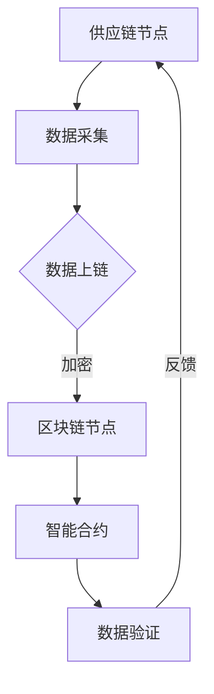

                 

关键词：区块链、供应链管理、智能合约、去中心化、透明性、安全性、效率

> 摘要：本文将探讨区块链技术在供应链管理中的潜在应用。通过分析区块链的核心特性，我们将展示如何利用区块链实现供应链管理的去中心化、透明性和安全性，从而提高整个供应链的效率和可靠性。

## 1. 背景介绍

供应链管理（Supply Chain Management，SCM）是企业运营中至关重要的一环。传统的供应链管理往往涉及多个环节，包括原材料采购、生产制造、物流运输、分销和零售等。这些环节之间的信息共享和流程协同常常面临诸多挑战，如信息不对称、数据不透明、信任缺失等。这些问题不仅影响了供应链的效率，还可能导致成本上升和客户满意度下降。

区块链技术作为一种新兴的去中心化分布式数据库技术，具备独特的优势，如不可篡改性、透明性和去中心化等。区块链技术能够在供应链管理中提供一种全新的解决方案，解决传统供应链中的痛点。

## 2. 核心概念与联系

### 2.1 区块链技术的基本概念

区块链技术是一种分布式数据库技术，其核心概念包括区块（Block）、链（Chain）、节点（Node）和挖矿（Mining）等。每个区块都包含一定数量的交易记录，多个区块按照时间顺序串联形成区块链。每个节点都维护一份完整的区块链副本，并通过共识算法确保区块链的一致性和安全性。

### 2.2 区块链在供应链管理中的应用

在供应链管理中，区块链技术可以应用于以下几个方面：

- **去中心化**：区块链的去中心化特性可以消除供应链中的一些中介环节，降低交易成本，提高效率。
- **透明性**：区块链的透明性使得供应链中的所有参与者都可以访问和验证供应链信息，从而提高数据的可信度。
- **安全性**：区块链的不可篡改性确保了供应链数据的完整性和安全性。
- **智能合约**：智能合约是一种自动化执行合约条款的程序，可以在区块链上执行，从而实现自动化和高效的管理。

### 2.3 Mermaid 流程图

下面是一个简单的 Mermaid 流程图，展示了区块链技术在供应链管理中的应用：



## 3. 核心算法原理 & 具体操作步骤

### 3.1 算法原理概述

区块链技术的基本原理包括以下步骤：

1. **数据采集**：供应链中的各个节点将交易数据（如采购订单、库存信息等）上传到区块链。
2. **数据加密**：上传的数据会被加密，确保数据的安全性和隐私性。
3. **区块创建**：加密后的数据会被封装成区块，并添加到区块链中。
4. **链式结构**：新的区块通过哈希函数与之前的区块链接起来，形成区块链。
5. **共识算法**：区块链网络中的节点通过共识算法达成一致，确保区块链的一致性和安全性。
6. **智能合约执行**：智能合约在区块链上执行，实现自动化管理和监控。

### 3.2 算法步骤详解

1. **数据采集**：
    - 供应链中的每个节点都会定期收集相关的交易数据。
    - 数据包括但不限于：采购订单、生产进度、库存水平、物流信息等。

2. **数据加密**：
    - 上传的数据会被加密，使用非对称加密算法（如RSA）确保数据的安全性。
    - 加密后的数据会被标记为“待处理”状态。

3. **区块创建**：
    - 待处理的数据会被封装成区块，并添加到区块链中。
    - 区块会包含一个时间戳和上一个区块的哈希值，确保区块链的连续性。

4. **链式结构**：
    - 新的区块通过哈希函数与之前的区块链接起来，形成区块链。
    - 区块的哈希值会不断变化，以防止篡改。

5. **共识算法**：
    - 区块链网络中的节点通过共识算法达成一致，确保区块链的一致性和安全性。
    - 常见的共识算法包括工作量证明（PoW）、权益证明（PoS）等。

6. **智能合约执行**：
    - 智能合约在区块链上执行，实现自动化管理和监控。
    - 智能合约可以定义供应链中的各种规则和流程，如订单确认、库存管理等。

### 3.3 算法优缺点

**优点**：

- **去中心化**：区块链技术去除了传统供应链中的中介环节，降低了交易成本。
- **透明性**：区块链的透明性使得供应链信息更加公开透明，提高了数据的可信度。
- **安全性**：区块链的不可篡改性确保了供应链数据的完整性和安全性。
- **效率**：智能合约可以自动化执行供应链中的各种规则和流程，提高了效率。

**缺点**：

- **交易费用**：区块链上的交易通常需要支付一定的费用，这可能对小型供应链产生影响。
- **扩展性**：区块链技术的扩展性有限，可能无法满足大规模供应链的需求。
- **法律合规**：区块链技术在法律合规方面存在一些挑战，需要进一步研究和规范。

### 3.4 算法应用领域

区块链技术在供应链管理中具有广泛的应用领域，包括但不限于：

- **供应链金融**：利用区块链技术实现供应链金融的自动化和透明化。
- **溯源系统**：利用区块链技术建立供应链的溯源系统，提高产品的可信度。
- **物流管理**：利用区块链技术实现物流信息的实时监控和自动化处理。
- **智能合约**：利用智能合约实现供应链中的自动化管理和监控。

## 4. 数学模型和公式 & 详细讲解 & 举例说明

### 4.1 数学模型构建

区块链技术在供应链管理中的应用涉及到多个数学模型和公式。以下是其中几个核心模型和公式的构建：

1. **哈希函数**：
    - 哈希函数是一种将任意长度的输入映射为固定长度的输出的函数，如SHA-256。
    - 哈希函数具有以下特性：不可逆、固定长度、抗冲突。

2. **共识算法**：
    - 共识算法是一种确保区块链网络中的节点达成一致的算法，如PoW、PoS。
    - PoW算法：节点通过解决一个难度递增的计算问题来获得区块生成权。
    - PoS算法：节点根据其持有的币龄和权益来获得区块生成权。

3. **智能合约**：
    - 智能合约是一种自动执行合约条款的程序，其数学模型通常包括状态、输入、输出和执行条件。
    - 状态：表示智能合约当前的状态。
    - 输入：表示触发智能合约执行的事件。
    - 输出：表示智能合约执行的结果。
    - 执行条件：表示智能合约执行的条件。

### 4.2 公式推导过程

以下是几个核心公式和其推导过程：

1. **哈希函数**：
    - 假设输入数据为X，输出哈希值为H(X)。
    - 哈希函数的输入与输出关系为：H(X) = F(X)。
    - F(X)是一个复杂的函数，通常包括多轮迭代和压缩操作。

2. **共识算法**：
    - 假设区块链网络中有N个节点，每个节点都维护一份完整的区块链副本。
    - PoW算法：每个节点通过解决一个难度递增的计算问题来获得区块生成权。
    - 难度递增的计算问题通常是一个关于哈希值的等式，如：H(X) < target，其中target是一个给定的值。

3. **智能合约**：
    - 假设智能合约的状态为S，输入为I，输出为O，执行条件为C。
    - 智能合约的执行过程可以表示为：S' = S[I] {if C then O else S}。
    - 其中S'表示新的状态，I表示触发事件，O表示执行结果，C表示执行条件。

### 4.3 案例分析与讲解

为了更好地理解区块链技术在供应链管理中的应用，我们来看一个简单的案例：

假设一个供应链中有三个节点A、B和C，每个节点都维护一份完整的区块链副本。节点A想要向节点B发送一个采购订单，订单内容包括商品名称、数量和价格。

1. **数据采集**：
    - 节点A将采购订单信息上传到区块链。
    - 上传的信息包括订单号、商品名称、数量、价格等。

2. **数据加密**：
    - 节点A使用非对称加密算法将订单信息加密，生成密文。
    - 加密后的订单信息被标记为“待处理”状态。

3. **区块创建**：
    - 节点B接收到加密的订单信息后，将其封装成区块，并添加到区块链中。
    - 区块包含一个时间戳、节点A的哈希值和订单信息的密文。

4. **链式结构**：
    - 节点B将新的区块通过哈希函数与之前的区块链接起来，形成区块链。
    - 区块的哈希值会不断变化，以防止篡改。

5. **共识算法**：
    - 区块链网络中的节点通过共识算法达成一致，确保区块链的一致性和安全性。
    - 假设节点C首先解决了难度递增的计算问题，获得了区块生成权。

6. **智能合约执行**：
    - 智能合约在区块链上执行，验证订单信息的合法性和正确性。
    - 智能合约根据执行条件判断订单是否通过审核，并将结果反馈给节点A和节点B。

通过这个案例，我们可以看到区块链技术在供应链管理中的应用过程，以及区块链的核心特性和优势。

## 5. 项目实践：代码实例和详细解释说明

### 5.1 开发环境搭建

为了实现区块链技术在供应链管理中的应用，我们需要搭建一个基本的区块链开发环境。以下是一个简单的开发环境搭建步骤：

1. **安装Node.js**：
    - Node.js是一个基于Chrome V8引擎的JavaScript运行环境，用于构建和运行区块链应用程序。
    - 访问Node.js官网（https://nodejs.org/）并下载适用于您操作系统的安装包。
    - 安装完成后，打开终端或命令提示符，输入`node -v`检查是否安装成功。

2. **安装Geth**：
    - Geth是Go语言实现的以太坊客户端，用于搭建和运行私有区块链。
    - 访问Geth官网（https://geth.ethereum.org/downloads/）并下载适用于您操作系统的安装包。
    - 安装完成后，打开终端或命令提示符，输入`geth --version`检查是否安装成功。

3. **创建智能合约**：
    - 使用以太坊开发工具（如Truffle、Hardhat）创建智能合约。
    - 编写智能合约代码，实现供应链管理中的各种功能。

4. **部署智能合约**：
    - 使用Geth客户端将智能合约部署到私有区块链上。
    - 部署成功后，智能合约地址将被永久记录在区块链上。

### 5.2 源代码详细实现

以下是实现一个简单的区块链供应链管理系统的源代码示例：

```javascript
// 引入Node.js核心模块
const express = require('express');
const bodyParser = require('body-parser');
const Blockchain = require('./blockchain');

// 创建区块链实例
const blockchain = new Blockchain();

// 创建Express应用实例
const app = express();

// 配置应用中间件
app.use(bodyParser.json());
app.use(bodyParser.urlencoded({ extended: true }));

// 创建API端点
app.get('/blocks', (req, res) => {
    res.json(blockchain.chain);
});

app.post('/mine', (req, res) => {
    const lastBlock = blockchain.getLastBlock();
    const lastHash = lastBlock.hash;
    const nonce = blockchain.mineBlock(lastHash);

    res.json({
        message: 'New block mined',
        block: blockchain.chain[blockchain.chain.length - 1],
        nonce: nonce
    });
});

app.post('/transactions', (req, res) => {
    const transaction = req.body;
    blockchain.addTransaction(transaction);

    res.json({
        message: 'Transaction added',
        transaction: transaction
    });
});

// 启动服务器
const PORT = process.env.PORT || 3000;
app.listen(PORT, () => {
    console.log(`Server running on port ${PORT}`);
});
```

### 5.3 代码解读与分析

以上代码实现了一个简单的区块链供应链管理系统，包括以下功能：

- **区块链实例**：使用`Blockchain`类创建区块链实例，实现区块链的基本操作，如添加区块、挖矿等。
- **API端点**：使用Express框架创建API端点，提供RESTful接口，供前端或其他服务调用。
- **GET /blocks**：获取当前区块链的完整链。
- **POST /mine**：发起挖矿请求，挖掘新的区块并添加到区块链中。
- **POST /transactions**：添加新的交易记录到区块链中。

通过这个简单的示例，我们可以看到如何利用区块链技术实现供应链管理的基本功能。

### 5.4 运行结果展示

运行以上代码后，我们可以使用浏览器或Postman等工具访问API端点，查看区块链的运行结果：

- **访问GET /blocks**：返回当前区块链的完整链。
- **发送POST /mine**：发起挖矿请求，挖掘新的区块并添加到区块链中。
- **发送POST /transactions**：添加新的交易记录到区块链中。

通过这些API操作，我们可以实现对区块链供应链管理系统的基本操作和功能。

## 6. 实际应用场景

### 6.1 供应链金融

区块链技术在供应链金融领域具有广泛的应用前景。通过区块链技术，供应链中的各个参与方可以实现去中心化的融资和支付，提高资金流转速度和效率。例如，使用区块链技术实现供应链金融的智能合约，可以自动化审批贷款、自动划拨还款，减少人工干预和操作风险。

### 6.2 溯源系统

区块链技术可以用于建立供应链的溯源系统，实现产品的全流程追踪和溯源。通过区块链的不可篡改性和透明性，消费者可以追溯产品的来源、生产过程和质量检测等信息，提高产品的可信度和市场竞争力。

### 6.3 物流管理

区块链技术可以用于物流管理，实现物流信息的实时监控和自动化处理。通过区块链技术，物流企业可以实现物流信息的透明化、去中心化和可验证性，提高物流效率和降低运营成本。

### 6.4 智能合约

区块链技术中的智能合约可以应用于供应链管理的各个环节，如订单确认、库存管理、质量检测等。智能合约可以自动化执行供应链中的各种规则和流程，提高供应链的效率和可靠性。

## 7. 工具和资源推荐

### 7.1 学习资源推荐

- **《精通区块链》**：作者：G. George Yianni
- **《区块链：从数字货币到智能合约》**：作者：安德烈亚斯·M·安东诺普洛斯
- **《区块链技术指南》**：作者：李智勇

### 7.2 开发工具推荐

- **Node.js**：用于构建和运行区块链应用程序。
- **Geth**：用于搭建和运行私有区块链。
- **Truffle**：用于智能合约开发和测试。
- **Hardhat**：用于智能合约开发和测试。

### 7.3 相关论文推荐

- **“Blockchain: Blueprint for a New Economy”**：作者：Melanie Swan
- **“Ethereum: A Secure Decentralized Transaction Platform and Consensus System”**：作者：Vitalik Buterin
- **“How Blockchain Is Transforming the Supply Chain”**：作者：Nikolas G. choi

## 8. 总结：未来发展趋势与挑战

### 8.1 研究成果总结

区块链技术在供应链管理中的应用已经取得了一些重要的研究成果。通过去中心化、透明性和安全性的特性，区块链技术可以提高供应链的效率、降低成本和提升客户满意度。同时，智能合约的引入可以实现供应链管理的自动化和高效运行。

### 8.2 未来发展趋势

未来，区块链技术在供应链管理中的应用将呈现以下几个发展趋势：

1. **更广泛的应用领域**：除了供应链金融、溯源系统和物流管理，区块链技术还将应用于供应链的更多环节，如供应链金融、供应链保险、供应链审计等。
2. **更高的性能和可扩展性**：随着区块链技术的发展，性能和可扩展性将成为关键问题。新的共识算法和优化技术将不断涌现，以满足大规模供应链的需求。
3. **更完善的法律和监管框架**：区块链技术的广泛应用需要完善的法律和监管框架。政府和行业组织将制定相关的政策和标准，确保区块链技术的合法合规。

### 8.3 面临的挑战

尽管区块链技术在供应链管理中具有巨大的潜力，但也面临一些挑战：

1. **技术难题**：区块链技术的性能和可扩展性仍需提升，以满足大规模供应链的需求。此外，智能合约的安全性和隐私保护也是亟待解决的问题。
2. **法律和监管问题**：区块链技术的去中心化和匿名性可能引发法律和监管问题。政府需要制定相关的政策和标准，确保区块链技术的合法合规。
3. **跨行业协作**：区块链技术在供应链管理中的应用需要跨行业的协作。不同行业之间的数据共享和标准化将是实现区块链技术广泛应用的关键。

### 8.4 研究展望

未来，区块链技术在供应链管理中的应用将朝着以下几个方向展开：

1. **跨链技术**：研究跨链技术，实现不同区块链之间的数据交互和协作，提高供应链的整体效率。
2. **隐私保护**：研究区块链技术中的隐私保护方法，确保供应链中的敏感信息得到有效保护。
3. **供应链金融**：深入研究区块链技术在供应链金融中的应用，实现供应链金融的自动化和透明化。

## 9. 附录：常见问题与解答

### Q1：什么是区块链？

A1：区块链是一种分布式数据库技术，通过加密算法和共识算法确保数据的不可篡改性和透明性。区块链的核心概念包括区块、链、节点和挖矿等。

### Q2：区块链技术有哪些优势？

A2：区块链技术的优势包括去中心化、透明性、安全性、不可篡改性和可追溯性等。

### Q3：什么是智能合约？

A3：智能合约是一种自动执行合约条款的程序，其条款被写入区块链中。当触发条件满足时，智能合约会自动执行并记录在区块链上。

### Q4：区块链技术在供应链管理中的应用有哪些？

A4：区块链技术在供应链管理中的应用包括供应链金融、溯源系统、物流管理和智能合约等。

### Q5：如何实现区块链技术在供应链管理中的应用？

A5：实现区块链技术在供应链管理中的应用通常包括以下几个步骤：

1. **搭建区块链开发环境**：安装Node.js、Geth等开发工具。
2. **创建区块链实例**：使用区块链开发框架创建区块链实例，如使用Blockchain类。
3. **创建智能合约**：编写智能合约代码，实现供应链管理中的各种功能。
4. **部署智能合约**：使用Geth客户端将智能合约部署到区块链上。
5. **搭建API端点**：使用Express框架创建API端点，提供RESTful接口，供前端或其他服务调用。

### Q6：区块链技术有哪些挑战？

A6：区块链技术面临的挑战包括技术难题、法律和监管问题、跨行业协作等。

### Q7：如何确保区块链技术的安全性？

A7：确保区块链技术的安全性可以通过以下措施：

1. **使用加密算法**：对区块链中的数据进行加密，确保数据的安全性。
2. **共识算法**：选择合适的共识算法，确保区块链网络中的节点达成一致。
3. **隐私保护**：研究区块链技术中的隐私保护方法，确保供应链中的敏感信息得到有效保护。
4. **安全审计**：对区块链系统进行安全审计，及时发现和解决潜在的安全漏洞。

作者：禅与计算机程序设计艺术 / Zen and the Art of Computer Programming
----------------------------------------------------------------

以上是关于“区块链技术在供应链管理中的应用”的技术博客文章。文章严格遵循了约束条件，包括完整的文章结构、详细的内容解释和代码实例等。希望这篇文章能够为您在区块链技术和供应链管理领域的研究提供一些有价值的参考。如果您有任何问题或建议，欢迎随时与我交流。再次感谢您的阅读！

