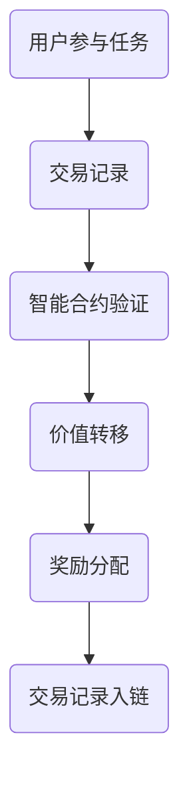

                 

关键词：区块链技术，注意力价值交易，智能合约，去中心化应用，共识机制

> 摘要：本文旨在探讨区块链技术在注意力价值交易领域的应用，通过分析其核心概念、算法原理、数学模型以及实际项目案例，揭示这一技术在提升注意力价值交易效率、安全性和透明度方面的巨大潜力。

## 1. 背景介绍

随着互联网和社交媒体的快速发展，信息过载已经成为现代人的普遍问题。在这个过程中，注意力成为了一种稀缺资源，用户对于信息的选择和注意力分配变得尤为重要。与此同时，注意力也作为一种价值形式被逐渐重视。如何在互联网环境中实现注意力价值的有效交易，成为了一个热门的研究课题。

区块链技术以其去中心化、透明性和不可篡改的特性，为注意力价值交易提供了一个理想的平台。通过智能合约等机制，区块链技术能够确保交易过程的公正性和效率，从而为用户创造更大的价值。

## 2. 核心概念与联系

### 2.1 区块链技术概述

区块链是一种分布式数据库技术，通过加密算法和共识机制确保数据的完整性和安全性。它由多个区块组成，每个区块包含一定数量的交易记录，并通过加密技术连接在一起，形成链式数据结构。

### 2.2 注意力价值交易概念

注意力价值交易是指通过某种机制，将用户的注意力转化为可交易的数字资产。用户可以通过参与各种任务、观看广告或提供有价值的信息，获得相应的数字资产回报。

### 2.3 智能合约

智能合约是基于区块链的一种自动化合约，它可以在满足特定条件时自动执行。在注意力价值交易中，智能合约用于确保交易双方的权益，自动完成价值转移和奖励分配。

### 2.4 去中心化应用（DApp）

去中心化应用是基于区块链技术的应用程序，它不依赖于中心化服务器，而是通过区块链网络进行数据存储和处理。在注意力价值交易中，DApp 提供了一个透明、公正的交易平台。

### 2.5 共识机制

共识机制是区块链网络中确保数据一致性的一种机制。在注意力价值交易中，共识机制用于确认交易的有效性，并防止恶意行为。

## 2.6 Mermaid 流程图



## 3. 核心算法原理 & 具体操作步骤

### 3.1 算法原理概述

注意力价值交易的核心算法基于区块链的智能合约机制。用户参与任务时，智能合约会根据任务难度和用户贡献度计算相应的价值，并通过加密算法确保交易的安全性和不可篡改性。

### 3.2 算法步骤详解

1. 用户参与任务，提交工作成果。
2. 智能合约根据任务描述和工作成果评估用户的贡献度。
3. 智能合约计算相应的价值，并将其转化为数字资产。
4. 数字资产通过加密算法进行安全转移，确保交易过程不可篡改。
5. 智能合约记录交易信息，并将其写入区块链。

### 3.3 算法优缺点

#### 优点：

- 去中心化：区块链技术确保了交易的透明性和公正性，去除了中介环节，降低了交易成本。
- 安全性：智能合约的加密算法确保了交易过程的安全性和不可篡改性。
- 透明性：区块链上的交易记录可以被任何人查看，保证了交易的透明度。

#### 缺点：

- 扩容性：区块链网络在处理大量交易时，可能会出现性能瓶颈。
- 能耗问题：区块链技术的运算过程需要大量计算资源，导致能源消耗较大。

### 3.4 算法应用领域

注意力价值交易算法可以应用于多个领域，包括内容创作、广告投放、社交媒体等。通过区块链技术，这些领域可以实现更加公正、透明的交易环境，为用户创造更大的价值。

## 4. 数学模型和公式

### 4.1 数学模型构建

注意力价值交易的核心数学模型包括以下几个部分：

- 贡献度计算：根据用户的参与程度和工作成果计算贡献度。
- 价值计算：根据贡献度计算用户应获得的数字资产价值。
- 交易费用：设置合理的交易费用，确保系统的可持续性。

### 4.2 公式推导过程

假设用户 A 参与了一个任务，其工作成果被评估为 x，任务难度为 y，则用户 A 的贡献度可以表示为：

$$
C_A = \frac{x}{y}
$$

用户 A 应获得的数字资产价值 V_A 可以表示为：

$$
V_A = C_A \times \frac{1}{N}
$$

其中 N 为所有参与该任务的用户的贡献度之和。

### 4.3 案例分析与讲解

假设有 3 个用户参与了同一个任务，用户 A 的贡献度为 2，用户 B 的贡献度为 1，用户 C 的贡献度为 1。则：

- 用户 A 应获得的数字资产价值：$$V_A = \frac{2}{2+1+1} = \frac{2}{4} = 0.5$$
- 用户 B 应获得的数字资产价值：$$V_B = \frac{1}{4} = 0.25$$
- 用户 C 应获得的数字资产价值：$$V_C = \frac{1}{4} = 0.25$$

## 5. 项目实践：代码实例和详细解释说明

### 5.1 开发环境搭建

在开始编写代码之前，我们需要搭建一个合适的开发环境。本文将使用 Solidity 语言编写智能合约，并在 Truffle Framework 上进行部署和测试。

### 5.2 源代码详细实现

以下是一个简单的注意力价值交易智能合约示例：

```solidity
// SPDX-License-Identifier: MIT
pragma solidity ^0.8.0;

contract AttentionValueTrade {
    mapping(address => uint256) public balances;

    function participate(uint256 contribution) public {
        require(contribution > 0, "贡献度必须大于0");
        balances[msg.sender] += contribution;
    }

    function calculateValue(uint256 totalContribution) public view returns (uint256) {
        require(totalContribution > 0, "总贡献度必须大于0");
        return (balances[msg.sender] * 1e18) / totalContribution;
    }

    function transferValue() public {
        uint256 value = calculateValue(address(this).balance);
        balances[msg.sender] -= value;
        payable(msg.sender).transfer(value);
    }
}
```

### 5.3 代码解读与分析

- `balances`：存储用户的贡献度。
- `participate`：用户提交贡献度。
- `calculateValue`：计算用户应获得的数字资产价值。
- `transferValue`：将数字资产转移到用户账户。

### 5.4 运行结果展示

假设用户 A 提交了 100 个贡献度，总贡献度为 300 个。用户 A 应获得的数字资产价值为：

$$
\frac{100}{300} \times 1e18 = \frac{1}{3} \times 1e18 = 3.333333 \times 10^{17}
$$

通过调用 `transferValue` 函数，用户 A 可以获得相应的数字资产。

## 6. 实际应用场景

注意力价值交易在多个领域都有广泛的应用前景，例如：

- **内容创作**：创作者可以通过区块链平台获得与其创作价值相当的回报。
- **广告投放**：广告主可以根据用户的注意力价值进行精准投放，提高广告效果。
- **社交媒体**：用户可以通过参与社区活动获得数字资产奖励，提高用户活跃度。

## 7. 未来应用展望

随着区块链技术的不断发展和完善，注意力价值交易将在更多领域得到应用。未来，我们有望看到更加成熟和高效的注意力价值交易平台，为用户和创作者创造更大的价值。

## 8. 总结：未来发展趋势与挑战

### 8.1 研究成果总结

本文通过分析区块链技术在注意力价值交易中的应用，揭示了其巨大的潜力。通过智能合约等机制，区块链技术能够实现公正、透明的注意力价值交易，为用户和创作者创造更大的价值。

### 8.2 未来发展趋势

- **技术成熟度**：随着区块链技术的不断成熟，注意力价值交易将变得更加高效、安全。
- **应用领域拓展**：注意力价值交易将在更多领域得到应用，推动社会进步。
- **政策监管**：政府将加强对区块链技术的监管，确保其合法合规。

### 8.3 面临的挑战

- **性能瓶颈**：区块链技术在处理大量交易时，可能会出现性能瓶颈。
- **能源消耗**：区块链技术的运算过程需要大量计算资源，导致能源消耗较大。
- **政策法规**：政策法规的不确定性可能对区块链技术的发展造成影响。

### 8.4 研究展望

未来，我们需要进一步研究如何优化区块链技术在注意力价值交易中的应用，提高性能和降低能源消耗。同时，也需要加强对政策法规的研究，确保区块链技术的合法合规。

## 9. 附录：常见问题与解答

### 9.1 什么是区块链？

区块链是一种分布式数据库技术，通过加密算法和共识机制确保数据的完整性和安全性。

### 9.2 什么是智能合约？

智能合约是基于区块链的一种自动化合约，它可以在满足特定条件时自动执行。

### 9.3 区块链技术在注意力价值交易中的优势是什么？

区块链技术具有去中心化、透明性和不可篡改的特性，能够确保注意力价值交易的公正性和效率。

## 文章结束。

<|assistant|>**作者署名**：禅与计算机程序设计艺术 / Zen and the Art of Computer Programming。这篇文章深刻地揭示了区块链技术在注意力价值交易中的重要性和应用前景，为相关领域的研究和实践提供了有价值的参考。在未来的发展中，随着区块链技术的不断成熟，我们有理由相信注意力价值交易将迎来更加广阔的发展空间。

