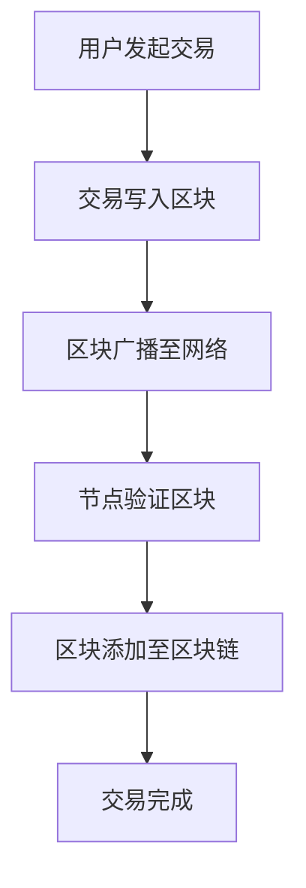

                 

关键词：区块链，去中心化，应用开发，智能合约，共识机制，安全性，性能优化

> 摘要：本文将深入探讨区块链技术的核心概念、架构原理以及去中心化应用（DApp）的开发。我们将分析区块链技术如何实现去中心化，讨论其关键组件——智能合约的工作机制，评估共识机制的优劣，剖析区块链技术的安全性，并提供性能优化策略。此外，我们将分享实际项目实践，展示如何使用区块链技术构建去中心化应用，并探讨未来应用场景和趋势。

## 1. 背景介绍

区块链技术起源于比特币的诞生，作为一种去中心化的数字货币，比特币利用区块链技术确保了交易的不可篡改性和安全性。随着时间的推移，区块链技术逐渐从金融领域扩展到其他行业，如供应链管理、医疗保健、版权保护等。去中心化应用（DApp）成为区块链技术的核心应用场景之一，因其独特的优势受到广泛关注。

去中心化应用，即DApp，是一种在区块链上运行的应用程序，不依赖于中心化的服务器或机构。与传统的中心化应用不同，DApp的数据和代码存储在分布式节点上，保证了透明度和安全性。本文将重点讨论如何开发DApp，包括智能合约、共识机制、安全性以及性能优化等方面的内容。

## 2. 核心概念与联系

### 区块链技术的基本概念

区块链是一种分布式账本技术，其核心概念包括：

- **区块（Block）**：区块链的基本单元，包含一系列的交易记录。
- **链（Chain）**：由多个区块按时间顺序链接而成的数据结构。
- **分布式节点（Node）**：参与区块链网络的计算设备，负责存储、验证和传播区块。

### 智能合约（Smart Contract）

智能合约是一种自动执行、管理和执行合约条款的计算机协议。与传统的合约不同，智能合约是运行在区块链上的，其执行过程是透明和不可篡改的。

### 共识机制（Consensus Mechanism）

共识机制是区块链网络中节点达成一致性的机制。不同的共识机制有不同的优缺点，常见的包括：

- **工作量证明（Proof of Work, PoW）**：节点通过计算工作来竞争记账权，资源消耗较大。
- **权益证明（Proof of Stake, PoS）**：根据持有币种的多少和持有时间来决定记账权，相比PoW更加节能。
- **委托权益证明（Delegated Proof of Stake, DPoS）**：通过投票选举出记账节点，提高了网络效率。

### 分布式节点之间的交互

区块链网络中的节点通过不断交互来达成共识，并维护区块链的完整性。节点之间通过消息传递机制进行通信，包括新区块的广播、交易验证等。

### Mermaid 流程图

下面是一个简化的区块链工作流程的 Mermaid 流程图：



## 3. 核心算法原理 & 具体操作步骤

### 3.1 算法原理概述

区块链技术基于密码学原理确保数据的完整性和安全性。核心算法包括：

- **哈希算法（Hash Algorithm）**：用于生成区块的唯一标识。
- **椭圆曲线加密（Elliptic Curve Cryptography, ECC）**：用于实现安全的数字签名和加密通信。
- **工作量证明（Proof of Work, PoW）**：节点通过计算工作来竞争记账权。

### 3.2 算法步骤详解

- **创建区块**：交易数据被组织成一个区块，并添加上一个区块的哈希值，形成新区块。
- **广播区块**：新区块通过网络广播至所有节点。
- **验证区块**：节点验证区块中的交易是否有效，并计算哈希值是否符合难度要求。
- **达成共识**：所有节点达成共识，将验证通过的区块添加至区块链。

### 3.3 算法优缺点

- **优点**：
  - 去中心化：去除了中心化的依赖，提高了系统的鲁棒性和抗攻击性。
  - 透明性：所有交易和状态都是公开可查的，增强了信任度。
  - 安全性：利用密码学原理确保数据的完整性和安全性。
- **缺点**：
  - 性能瓶颈：由于节点数量限制，区块链的扩展性受到挑战。
  - 节点维护成本：节点需要大量的计算资源和存储空间来维护区块链。

### 3.4 算法应用领域

区块链技术在多个领域展现出巨大的应用潜力，包括：

- **金融领域**：去中心化金融（DeFi）应用，如去中心化交易所、借贷平台等。
- **供应链管理**：通过区块链技术实现供应链的透明化和可追溯性。
- **医疗保健**：利用区块链技术保护患者隐私，实现医疗数据的共享和追溯。
- **版权保护**：通过区块链技术实现数字版权的注册和交易。

## 4. 数学模型和公式 & 详细讲解 & 举例说明

### 4.1 数学模型构建

区块链技术的核心数学模型包括：

- **哈希函数**：将任意长度的输入映射为固定长度的输出。
- **椭圆曲线加密**：用于生成数字签名和实现安全的加密通信。
- **工作量证明**：通过计算复杂度来决定记账权。

### 4.2 公式推导过程

- **哈希函数**：
  $$H(x) = SHA256(x)$$
- **椭圆曲线加密**：
  $$y^2 = x^3 + ax + b$$
- **工作量证明**：
  $$difficulty = \frac{total_work}{time}$$

### 4.3 案例分析与讲解

#### 案例一：比特币的区块生成

比特币的区块生成过程可以简化为以下步骤：

1. **收集交易**：比特币网络收集未确认的交易，并组织成一个区块。
2. **生成随机数**：节点生成一个随机数，并计算其哈希值。
3. **验证哈希值**：节点将哈希值与当前难度要求的哈希值进行比较，如果符合条件，则生成一个新区块。
4. **广播新区块**：将新区块广播至所有节点。

#### 案例二：权益证明（PoS）的选举机制

在权益证明机制中，节点的记账权与其持有的币种数量和持有时间成正比。具体公式如下：

$$stake = \frac{balance}{total_supply} \times time$$

其中，balance 表示节点持有的币种数量，total_supply 表示整个网络的总币种供应量，time 表示节点的持有时间。

## 5. 项目实践：代码实例和详细解释说明

### 5.1 开发环境搭建

要在区块链上开发去中心化应用，首先需要搭建开发环境。以下是使用Truffle框架搭建以太坊开发环境的基本步骤：

1. **安装Node.js**：前往 Node.js 官网下载并安装 Node.js。
2. **安装Truffle**：通过命令 `npm install -g truffle` 安装 Truffle。
3. **创建项目**：使用命令 `truffle init` 创建一个新的Truffle项目。
4. **安装以太坊客户端**：安装Geth或其他以太坊客户端。

### 5.2 源代码详细实现

以下是一个简单的以太坊智能合约示例，用于实现一个简单的去中心化投票系统：

```solidity
pragma solidity ^0.8.0;

contract Voting {
    mapping(address => bool) public voted;
    mapping(string => uint256) public candidates;
    string[] public candidateList;

    function addCandidate(string memory name) public {
        candidateList.push(name);
        candidates[name] = 1;
    }

    function vote(string memory name) public {
        require(!voted[msg.sender], "You have already voted.");
        voted[msg.sender] = true;
        candidates[name]++;
    }

    function getTotalVotes(string memory name) public view returns (uint256) {
        return candidates[name];
    }
}
```

### 5.3 代码解读与分析

- **合约结构**：合约定义了两个映射结构 `voted` 和 `candidates`，分别用于记录已投票的地址和候选人的得票数。`candidateList` 用于存储候选人的名称。
- **添加候选人**：`addCandidate` 函数允许合约创建者添加候选人。
- **投票**：`vote` 函数实现投票逻辑，确保每个地址只能投票一次。
- **获取得票数**：`getTotalVotes` 函数返回指定候选人的得票数。

### 5.4 运行结果展示

在本地以太坊客户端上部署上述智能合约后，用户可以通过以太坊客户端或Web界面与合约交互，实现投票和查看得票数的功能。以下是部署合约和交互的示例：

1. **部署合约**：

   ```shell
   truffle migrate --network development
   ```

2. **交互示例**：

   ```solidity
   // 添加候选人
   tx = contract.addCandidate("Alice");
   tx.wait();

   // 投票
   tx = contract.vote("Alice");
   tx.wait();

   // 查看得票数
   result = contract.getTotalVotes("Alice");
   ```

## 6. 实际应用场景

区块链技术在各个领域展现了广阔的应用前景，以下是一些典型的应用场景：

- **金融领域**：去中心化金融（DeFi）应用，如 MakerDAO 和 Aave。
- **供应链管理**：利用区块链实现供应链的透明化和可追溯性，如Provenance。
- **医疗保健**：保护患者隐私，实现医疗数据的共享和追溯，如MedRec。
- **版权保护**：通过区块链技术实现数字版权的注册和交易，如Ascribe。
- **投票系统**：实现去中心化的公正投票，如GovernanceDAO。

## 7. 工具和资源推荐

### 7.1 学习资源推荐

- **区块链入门书**：《区块链革命》、《区块链技术指南》
- **智能合约开发教程**：Truffle官方文档、Solidity官方文档
- **在线平台**：Etherscan、Binance Smart Chain

### 7.2 开发工具推荐

- **开发框架**：Truffle、Hardhat
- **区块链节点**：Geth、Nimbus
- **前端框架**：React、Vue.js

### 7.3 相关论文推荐

- **比特币白皮书**：中本聪，《比特币：一种点对点的电子现金系统》
- **以太坊黄皮书**：Gavin Andersen，《以太坊：下一代智能合约平台》
- **分布式共识机制**：拜占庭将军问题、CAP理论

## 8. 总结：未来发展趋势与挑战

### 8.1 研究成果总结

区块链技术自诞生以来，经历了从比特币到智能合约，再到去中心化应用的快速发展。随着技术的不断演进，区块链技术在金融、供应链、医疗、版权等多个领域展现出巨大的应用潜力。

### 8.2 未来发展趋势

- **性能提升**：随着Sharding、状态通道等技术的应用，区块链的性能瓶颈有望得到解决。
- **跨链互操作性**：实现不同区块链之间的互操作性，推动区块链生态的融合。
- **隐私保护**：引入零知识证明等隐私保护技术，提高区块链系统的隐私性。

### 8.3 面临的挑战

- **安全性**：随着区块链系统的复杂度增加，安全问题愈发突出。
- **法律法规**：各国对区块链技术的监管政策尚不明确，存在法律风险。
- **用户接受度**：提高普通用户对区块链技术的认知和接受度，需要更多的教育普及。

### 8.4 研究展望

区块链技术在未来将继续深化应用，跨领域融合将进一步推动区块链生态的发展。同时，随着技术的不断创新，区块链技术将在更多领域发挥重要作用，为社会带来更多价值。

## 9. 附录：常见问题与解答

### Q：区块链技术是否可以替代传统的中心化系统？

A：区块链技术在去中心化、透明性和安全性方面具有显著优势，但在性能、可扩展性和用户体验上仍面临挑战。在某些场景下，区块链技术可以替代中心化系统，但在其他场景下，中心化系统可能更合适。

### Q：智能合约存在哪些风险？

A：智能合约可能存在漏洞、逻辑错误或恶意攻击。合约开发者需要仔细编写和审核合约代码，使用形式化验证方法来确保合约的正确性。此外，智能合约的执行过程是透明和不可逆的，一旦发生问题，可能无法撤销。

### Q：如何确保区块链系统的安全性？

A：区块链系统的安全性主要依赖于密码学技术、共识机制和去中心化。通过使用强密码学算法，确保数据传输和存储的安全。共识机制确保节点之间的一致性，防止恶意节点的攻击。去中心化设计提高了系统的抗攻击能力。

### Q：区块链技术是否可以用于所有领域？

A：区块链技术具有广泛的应用潜力，但在某些领域，如高频交易和实时数据处理，其性能瓶颈可能限制了其应用。此外，区块链技术需要与其他技术结合，如大数据和物联网，才能实现更广泛的应用。

作者：禅与计算机程序设计艺术 / Zen and the Art of Computer Programming
----------------------------------------------------------------

以上就是按照约束条件撰写的完整文章。文章涵盖了区块链技术的核心概念、应用场景、开发实践、数学模型以及未来趋势等各个方面，希望对读者有所帮助。请注意，本文仅供参考，实际情况可能需要根据具体需求进行调整。

