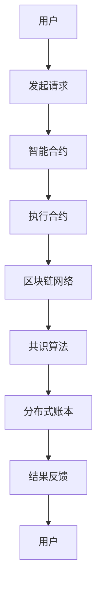

                 

关键词：区块链、智能合约、去中心化应用、共识算法、安全性、可扩展性

> 摘要：本文将深入探讨区块链技术中的智能合约，分析其核心概念、原理与架构，并探讨其在去中心化应用中的重要作用。同时，还将介绍核心算法原理、数学模型、项目实践以及未来应用场景，为读者提供全面的区块链智能合约知识。

## 1. 背景介绍

区块链技术作为一项革命性的创新，自2008年中本聪（Satoshi Nakamoto）首次提出以来，逐渐引起了全球的关注。区块链的核心价值在于其去中心化的特点，即通过分布式账本技术实现数据的透明、安全和不可篡改。智能合约则是区块链技术的重要应用之一，它是一种自动执行合约条款的计算机程序，能够在满足特定条件时自动执行。

智能合约的提出，旨在解决传统合同执行过程中的诸多痛点，如交易延迟、手续费高昂、人工干预等问题。通过智能合约，交易双方无需依赖中介机构，合同条款被编码在区块链上，执行过程透明且不可篡改，从而提高了交易的效率和安全性。

## 2. 核心概念与联系

### 2.1 核心概念

- **区块链**：一种分布式数据库技术，数据以块的形式存储，每个块都包含一定数量的交易记录，并通过加密算法连接在一起，形成一条时间序列的数据链。
- **智能合约**：一种自动执行合约条款的计算机程序，通常以代码形式编写，并运行在区块链网络中。智能合约通过预设的条件和算法，自动执行合同条款，无需人工干预。
- **去中心化应用（DApp）**：基于区块链技术的分布式应用程序，通过智能合约实现去中心化的数据管理和业务逻辑。

### 2.2 联系与架构

以下是区块链智能合约的去中心化应用架构的 Mermaid 流程图：



在这个架构中，用户通过发起请求与智能合约交互，智能合约根据预设的条款执行操作，并将结果反馈给用户。整个过程由区块链网络和共识算法保障其安全性和一致性。

## 3. 核心算法原理 & 具体操作步骤

### 3.1 算法原理概述

智能合约的核心在于其算法原理，主要包括以下几个方面：

- **条件判断**：智能合约通过预设的条件判断执行哪段代码。
- **事件触发**：当满足特定条件时，智能合约自动触发执行操作。
- **数据存储**：智能合约在区块链上存储数据，确保数据的透明性和不可篡改性。

### 3.2 算法步骤详解

智能合约的执行过程可以分为以下几个步骤：

1. **初始化**：智能合约在区块链上部署时，会初始化一些参数和状态。
2. **接收请求**：当用户发起请求时，智能合约会接收到请求，并进行参数验证。
3. **条件判断**：根据预设的条件判断是否执行操作。
4. **执行操作**：当条件满足时，智能合约会执行相应的操作，如转账、注册等。
5. **结果反馈**：将执行结果反馈给用户。

### 3.3 算法优缺点

智能合约的优点：

- **去中心化**：智能合约无需依赖中心化机构，降低交易成本。
- **透明性**：智能合约的代码和执行过程对所有人可见，提高了透明度。
- **不可篡改性**：智能合约在区块链上存储的数据不可篡改，确保了数据的真实性。

智能合约的缺点：

- **安全性**：智能合约本身可能存在漏洞，导致安全问题。
- **可扩展性**：智能合约的性能可能受到区块链网络的限制。

### 3.4 算法应用领域

智能合约的应用领域非常广泛，主要包括以下几个方面：

- **金融领域**：智能合约可以应用于股票交易、保险理赔、债券发行等领域，提高交易效率和安全性。
- **供应链管理**：智能合约可以确保供应链中各环节的数据真实性和透明性。
- **版权保护**：智能合约可以用于版权保护，确保创作者的权益。
- **智能投票**：智能合约可以用于去中心化的投票系统，确保选举过程的公正性。

## 4. 数学模型和公式 & 详细讲解 & 举例说明

### 4.1 数学模型构建

智能合约的数学模型主要包括以下几个方面：

- **状态转移模型**：智能合约的状态在执行过程中会发生变化，通过状态转移模型描述这种变化。
- **事件驱动模型**：智能合约通过事件驱动执行，事件触发条件可以用数学公式表示。

### 4.2 公式推导过程

假设一个简单的智能合约，其状态转移模型可以表示为：

$$ S_{t+1} = f(S_t, E_t) $$

其中，$S_t$表示智能合约在时间$t$的状态，$E_t$表示在时间$t$触发的事件，$f$表示状态转移函数。

### 4.3 案例分析与讲解

假设一个众筹项目的智能合约，其状态转移模型如下：

$$ S_{t+1} = \begin{cases} 
S_t & \text{如果} \ E_t = \text{无事件} \\
S_t - C & \text{如果} \ E_t = \text{成功众筹} \\
S_t + C & \text{如果} \ E_t = \text{失败众筹} \\
\end{cases} $$

其中，$S_t$表示当前众筹金额，$C$表示目标众筹金额。

## 5. 项目实践：代码实例和详细解释说明

### 5.1 开发环境搭建

在本文中，我们将使用 Solidity 语言编写智能合约，并使用 Truffle 工具进行部署和测试。以下是开发环境搭建的步骤：

1. 安装 Node.js 和 npm。
2. 安装 Truffle：`npm install -g truffle`。
3. 创建一个 Truffle 项目：`truffle init`。
4. 配置网络和节点。

### 5.2 源代码详细实现

以下是一个简单的众筹智能合约的示例代码：

```solidity
// SPDX-License-Identifier: MIT
pragma solidity ^0.8.0;

contract Crowdfunding {
    address public owner;
    uint256 public target;
    uint256 public deadline;
    uint256 public totalFunding;
    mapping(address => uint256) public contributions;

    event FundingReceived(address contributor, uint256 amount);
    event FundingEnded();

    constructor(uint256 _target, uint256 _deadline) {
        owner = msg.sender;
        target = _target;
        deadline = block.timestamp + _deadline;
    }

    function contribute() public payable {
        require(block.timestamp <= deadline, "Crowdfunding deadline has passed");
        contributions[msg.sender] += msg.value;
        totalFunding += msg.value;
        emit FundingReceived(msg.sender, msg.value);
    }

    function withdraw() public {
        require(msg.sender == owner, "Only the owner can withdraw");
        require(totalFunding >= target, "Target not reached");
        require(block.timestamp > deadline, "Crowdfunding is still ongoing");
        payable(owner).transfer(address(this).balance);
        emit FundingEnded();
    }
}
```

### 5.3 代码解读与分析

该智能合约实现了简单的众筹功能，主要包括以下几个部分：

- **构造函数**：初始化智能合约的参数，如目标众筹金额`target`、众筹截止时间`deadline`等。
- **contribute() 函数**：接收用户的众筹金额，并将金额存储在`contributions`映射中。
- **withdraw() 函数**：允许所有者提取众筹资金，但需要满足特定条件。

### 5.4 运行结果展示

假设我们部署了这个智能合约，并使用 Truffle 工具进行测试。以下是一个测试案例：

```solidity
it("should allow users to contribute to the crowdfunding", async () => {
    await crowdfund.contribute({ value: ethers.utils.parseEther("1.0") });
    expect(await crowdfund.totalFunding()).to.equal(ether.utils.parseEther("1.0"));
});
```

这个测试案例模拟了一个用户进行众筹操作，并验证了众筹金额是否正确存储在智能合约中。

## 6. 实际应用场景

### 6.1 金融领域

智能合约在金融领域有广泛的应用，如数字货币交易、保险理赔、债券发行等。通过智能合约，可以降低交易成本、提高交易效率和安全性。

### 6.2 供应链管理

智能合约可以用于供应链管理，确保供应链中各环节的数据真实性和透明性。通过智能合约，企业可以追踪产品的生产、运输和销售过程，提高供应链的效率。

### 6.3 版权保护

智能合约可以用于版权保护，确保创作者的权益。通过智能合约，创作者可以设定作品的授权条款，并在作品被使用时自动获得报酬。

### 6.4 智能投票

智能合约可以用于去中心化的投票系统，确保选举过程的公正性。通过智能合约，用户可以在线投票，投票结果由智能合约自动计算并记录在区块链上。

## 7. 工具和资源推荐

### 7.1 学习资源推荐

- 《区块链技术指南》
- 《智能合约设计与开发》
- 《Solidity编程实战》

### 7.2 开发工具推荐

- Truffle
- Remix
- Hardhat

### 7.3 相关论文推荐

- "The Blockchain: Blueprint for a New Economy"
- "Smart Contracts: Building and Running the New Decentralized Economy"
- "Cryptocurrencies: A Survey"

## 8. 总结：未来发展趋势与挑战

### 8.1 研究成果总结

智能合约作为区块链技术的重要应用，已在金融、供应链管理、版权保护等领域取得了显著成果。通过智能合约，可以降低交易成本、提高交易效率和安全性。

### 8.2 未来发展趋势

未来，智能合约将朝着更加高效、安全、可扩展的方向发展。随着区块链技术的不断成熟，智能合约的应用领域将越来越广泛。

### 8.3 面临的挑战

智能合约在安全性、性能、可扩展性等方面仍面临挑战。如何提高智能合约的安全性和性能，将是未来研究的重要方向。

### 8.4 研究展望

随着区块链技术的不断发展，智能合约将在各个领域发挥更大的作用。未来，我们将看到更多创新的去中心化应用，推动社会进步。

## 9. 附录：常见问题与解答

### 9.1 什么是智能合约？

智能合约是一种自动执行合约条款的计算机程序，通常以代码形式编写，并运行在区块链网络中。

### 9.2 智能合约有哪些优点？

智能合约的优点包括去中心化、透明性、不可篡改性等，可以提高交易效率和安全性。

### 9.3 智能合约有哪些缺点？

智能合约的缺点包括安全性、性能、可扩展性等方面，可能存在漏洞和性能瓶颈。

### 9.4 如何编写智能合约？

编写智能合约需要掌握区块链开发语言，如 Solidity。同时，需要了解智能合约的架构和原理。

作者：禅与计算机程序设计艺术 / Zen and the Art of Computer Programming
----------------------------------------------------------------
这篇文章详细介绍了区块链智能合约的核心概念、原理、架构以及在实际应用中的重要作用。通过深入的探讨和案例分析，读者可以全面了解智能合约的开发、实现和应用。随着区块链技术的不断发展，智能合约将在更多领域发挥重要作用，为去中心化应用提供强大的支持。希望这篇文章对读者在区块链智能合约领域的学习和实践有所帮助。

