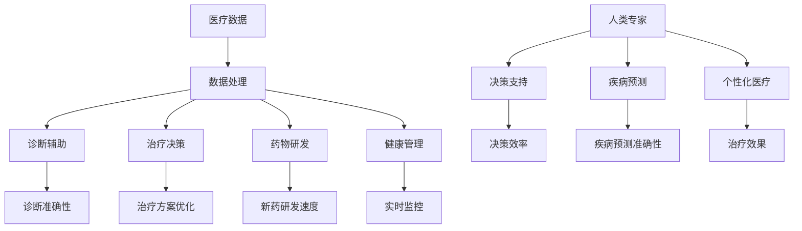

                 

关键词：精准医疗、人类计算、人工智能、医疗大数据、个性化治疗方案、医疗保健

> 摘要：随着人工智能技术的飞速发展，医疗保健领域正在经历深刻的变革。本文将探讨人类计算与人工智能在精准医疗中的融合，以及如何利用这一技术实现个性化治疗方案，提升医疗服务的质量和效率。通过对核心概念、算法原理、数学模型、项目实践等方面进行详细分析，本文旨在揭示医疗保健的未来发展趋势，并展望面临的挑战。

## 1. 背景介绍

医疗保健是关系到人类健康和生命安全的重要领域。然而，随着人口老龄化、慢性疾病高发、医疗资源分配不均等问题日益突出，传统的医疗模式已经难以满足现代社会的需求。因此，如何提高医疗服务的质量和效率，成为各国政府、医疗机构和研究人员共同关注的问题。

在过去的几十年里，信息技术，特别是人工智能技术的发展，为医疗保健领域带来了前所未有的机遇。通过大数据、云计算、物联网等技术的应用，医疗数据得到了前所未有的积累和分析，为个性化医疗提供了基础。同时，深度学习、自然语言处理等人工智能技术的进步，使得机器在医疗诊断、治疗决策等方面逐渐展现出超越人类专家的潜力。

人类计算作为一种融合人类智能与机器智能的新兴计算模式，旨在解决传统计算在处理复杂、模糊和不确定问题时的局限性。在医疗保健领域，人类计算的应用不仅能够提高诊断的准确性，还能帮助医生制定更精准的治疗方案，从而改善患者的预后和生活质量。

## 2. 核心概念与联系

### 2.1 人工智能与医疗保健

人工智能（AI）是模拟、延伸和扩展人类智能的理论、方法、技术及应用系统。在医疗保健领域，人工智能的应用主要体现在以下几个方面：

- **诊断辅助**：利用深度学习、计算机视觉等技术，从医疗影像中自动识别疾病特征，辅助医生进行诊断。
- **治疗决策**：通过分析大量患者数据，为医生提供个性化的治疗建议，优化治疗方案。
- **药物研发**：利用机器学习算法加速新药研发，缩短药物上市周期。
- **健康管理**：通过可穿戴设备、移动应用等收集患者健康数据，进行实时监控和预警。

### 2.2 人类计算与医疗保健

人类计算是一种将人类智能与机器智能相结合的计算模式。在医疗保健领域，人类计算的应用主要体现在以下几个方面：

- **决策支持**：通过人类专家与机器智能的协同工作，提高医疗决策的准确性和效率。
- **疾病预测**：利用人类计算模型对大量医疗数据进行挖掘和分析，预测疾病发展趋势和患者风险。
- **个性化医疗**：基于患者数据和人类计算模型，制定个性化的治疗方案，提高治疗效果。

### 2.3 Mermaid 流程图

下面是一个简化的 Mermaid 流程图，展示了人工智能和人类计算在医疗保健中的应用关系：



## 3. 核心算法原理 & 具体操作步骤

### 3.1 算法原理概述

在医疗保健领域，人工智能和人类计算的核心算法主要包括深度学习、自然语言处理、优化算法等。这些算法通过处理和分析大量的医疗数据，为医生提供诊断、治疗和决策支持。

- **深度学习**：利用神经网络模型对大量医疗影像、文本数据等进行自动分类和识别，实现诊断和辅助决策。
- **自然语言处理**：通过对医学文本的语义理解和信息提取，实现病历分析、医学问答和知识图谱构建。
- **优化算法**：通过数学优化方法，为医生提供个性化的治疗方案，优化治疗决策。

### 3.2 算法步骤详解

#### 3.2.1 深度学习算法

深度学习算法的具体步骤如下：

1. **数据预处理**：对医疗数据进行清洗、归一化等预处理操作，确保数据质量。
2. **模型构建**：选择合适的神经网络结构，如卷积神经网络（CNN）、循环神经网络（RNN）等。
3. **训练模型**：使用预处理后的数据对模型进行训练，优化模型参数。
4. **评估模型**：使用验证集对训练好的模型进行评估，调整模型参数，提高模型性能。
5. **应用模型**：将训练好的模型应用于实际医疗数据，实现诊断和辅助决策。

#### 3.2.2 自然语言处理算法

自然语言处理算法的具体步骤如下：

1. **文本预处理**：对医学文本进行分词、词性标注等预处理操作，提取关键信息。
2. **特征提取**：使用词嵌入技术，将文本转换为向量表示。
3. **模型训练**：选择合适的自然语言处理模型，如序列标注模型、文本分类模型等，对特征向量进行训练。
4. **模型评估**：使用验证集对训练好的模型进行评估，调整模型参数，提高模型性能。
5. **应用模型**：将训练好的模型应用于实际医学文本，实现病历分析、医学问答和知识图谱构建。

#### 3.2.3 优化算法

优化算法的具体步骤如下：

1. **目标函数定义**：根据医疗需求，定义优化目标函数，如最小化疾病风险、最大化治疗效果等。
2. **约束条件设定**：根据医疗限制，设定优化算法的约束条件，如预算、资源限制等。
3. **算法选择**：选择合适的优化算法，如线性规划、整数规划、遗传算法等。
4. **算法求解**：使用优化算法求解最优解，生成个性化治疗方案。
5. **方案评估**：对生成的治疗方案进行评估，调整优化参数，提高方案质量。

### 3.3 算法优缺点

#### 3.3.1 深度学习算法

优点：

- **高效性**：深度学习算法能够在短时间内处理大量数据，提高诊断和决策效率。
- **泛化能力**：通过训练，深度学习算法能够适应不同的数据分布和场景。

缺点：

- **数据需求**：深度学习算法需要大量的高质量数据，对数据采集和预处理要求较高。
- **可解释性**：深度学习算法的决策过程较为复杂，难以解释。

#### 3.3.2 自然语言处理算法

优点：

- **灵活性**：自然语言处理算法能够处理不同格式的医学文本，适应性强。
- **扩展性**：通过不断更新模型和知识库，自然语言处理算法能够持续提升性能。

缺点：

- **准确性**：自然语言处理算法在处理医学文本时，存在一定的误识别和误理解现象。
- **计算资源**：自然语言处理算法的计算成本较高，对硬件资源要求较高。

#### 3.3.3 优化算法

优点：

- **个性化**：优化算法能够根据患者的具体情况进行个性化治疗，提高治疗效果。
- **鲁棒性**：优化算法能够在各种约束条件下，找到最优解。

缺点：

- **计算成本**：优化算法的计算成本较高，对计算资源要求较高。
- **模型依赖**：优化算法的性能受到模型选择和参数设定的影响，需要不断调整。

### 3.4 算法应用领域

深度学习、自然语言处理和优化算法在医疗保健领域的应用主要包括：

- **疾病诊断**：利用深度学习算法，自动识别疾病特征，提高诊断准确性。
- **治疗方案制定**：利用优化算法，为医生提供个性化治疗方案，优化治疗决策。
- **医学文本处理**：利用自然语言处理算法，对医学文本进行分析和解读，实现病历管理、医学问答等。

## 4. 数学模型和公式 & 详细讲解 & 举例说明

### 4.1 数学模型构建

在医疗保健领域，数学模型广泛应用于疾病预测、治疗决策和风险管理等方面。下面介绍几种常见的数学模型。

#### 4.1.1 疾病预测模型

疾病预测模型通常采用时间序列分析方法，通过分析历史数据，预测疾病的发展趋势和患者风险。一种常见的疾病预测模型是 ARIMA（自回归积分滑动平均模型）。

ARIMA 模型由三个部分组成：自回归（AR）、差分（I）和移动平均（MA）。

1. **自回归（AR）**：表示当前值与过去几个值的线性组合。
   $$X_t = c + \sum_{i=1}^p \phi_i X_{t-i} + \varepsilon_t$$
   其中，$X_t$ 是时间序列值，$c$ 是常数项，$\phi_i$ 是自回归系数，$p$ 是滞后阶数，$\varepsilon_t$ 是误差项。

2. **差分（I）**：对时间序列进行差分处理，消除趋势性和季节性影响。
   $$Y_t = (X_t - X_{t-1}) - (X_{t-1} - X_{t-2})$$

3. **移动平均（MA）**：表示当前值与过去几个误差值的线性组合。
   $$X_t = c + \sum_{i=1}^p \theta_i \varepsilon_{t-i}$$
   其中，$\theta_i$ 是移动平均系数。

综合以上三部分，ARIMA 模型可以表示为：
$$X_t = c + \sum_{i=1}^p \phi_i X_{t-i} + \sum_{i=1}^p \theta_i \varepsilon_{t-i} + \varepsilon_t$$

#### 4.1.2 治疗决策模型

治疗决策模型通常采用优化算法，通过设定目标函数和约束条件，为医生提供最优治疗方案。一种常见的目标函数是治疗成本与治疗效果的权衡。

目标函数：
$$\min_{x} f(x) = w_1 \cdot C(x) + w_2 \cdot T(x)$$
其中，$x$ 是治疗方案，$C(x)$ 是治疗成本，$T(x)$ 是治疗效果，$w_1$ 和 $w_2$ 是权重系数。

约束条件：
$$\begin{cases}
C(x) \leq B \\
T(x) \geq T_{\min}
\end{cases}$$
其中，$B$ 是预算限制，$T_{\min}$ 是最小治疗效果要求。

#### 4.1.3 风险管理模型

风险管理模型通常采用概率模型，通过分析历史数据，预测患者发生风险的概率。一种常见的概率模型是贝叶斯网络。

贝叶斯网络由节点和边组成，每个节点表示一个随机变量，边表示变量之间的条件依赖关系。贝叶斯网络的概率分布可以用条件概率表表示。

条件概率表：
$$P(A|B) = \frac{P(A,B)}{P(B)}$$
其中，$A$ 和 $B$ 是随机变量，$P(A,B)$ 是联合概率，$P(B)$ 是边缘概率。

### 4.2 公式推导过程

#### 4.2.1 疾病预测模型

假设 $X_t$ 是时间序列值，$p$ 是滞后阶数，$\phi_i$ 是自回归系数，$\varepsilon_t$ 是误差项。

1. **差分**：
   $$Y_t = X_t - X_{t-1}$$

2. **自回归**：
   $$Y_t = \phi_1 Y_{t-1} + \varepsilon_t$$

3. **移动平均**：
   $$Y_t = \theta_1 \varepsilon_{t-1} + \varepsilon_t$$

4. **综合**：
   $$X_t = \phi_1 Y_{t-1} + \theta_1 \varepsilon_{t-1} + \varepsilon_t$$

5. **迭代**：
   $$X_t = \phi_1 (\phi_1 Y_{t-2} + \theta_1 \varepsilon_{t-2} + \varepsilon_{t-1}) + \theta_1 \varepsilon_{t-1} + \varepsilon_t$$
   $$X_t = \phi_1^2 Y_{t-2} + (\phi_1 \theta_1 + \phi_1) \varepsilon_{t-2} + (\theta_1 + 1) \varepsilon_{t-1} + \varepsilon_t$$

#### 4.2.2 治疗决策模型

假设 $x$ 是治疗方案，$C(x)$ 是治疗成本，$T(x)$ 是治疗效果，$w_1$ 和 $w_2$ 是权重系数。

1. **目标函数**：
   $$f(x) = w_1 C(x) + w_2 T(x)$$

2. **约束条件**：
   $$\begin{cases}
   C(x) \leq B \\
   T(x) \geq T_{\min}
   \end{cases}$$

#### 4.2.3 风险管理模型

假设 $A$ 和 $B$ 是随机变量，$P(A,B)$ 是联合概率，$P(B)$ 是边缘概率。

1. **条件概率**：
   $$P(A|B) = \frac{P(A,B)}{P(B)}$$

2. **边缘概率**：
   $$P(B) = \sum_{i} P(B|A_i) P(A_i)$$

3. **联合概率**：
   $$P(A,B) = P(B|A) P(A)$$

### 4.3 案例分析与讲解

#### 4.3.1 疾病预测模型

假设某医院希望利用 ARIMA 模型预测糖尿病患者的血糖水平。根据历史数据，设定 $p=1$，$\phi_1=0.8$。

1. **数据预处理**：
   $$Y_t = X_t - X_{t-1}$$

2. **模型训练**：
   $$Y_t = 0.8 Y_{t-1} + \varepsilon_t$$

3. **模型评估**：
   通过验证集评估模型性能，调整 $\phi_1$，提高预测准确性。

4. **预测**：
   $$X_t = 0.8 X_{t-1} + \varepsilon_t$$

#### 4.3.2 治疗决策模型

假设某医院希望为糖尿病患者制定最优治疗方案。设定 $C(x) = 1000 + 0.1 \cdot T(x)$，$T(x) = x$，$w_1 = 0.5$，$w_2 = 0.5$，$B = 5000$，$T_{\min} = 10$。

1. **目标函数**：
   $$f(x) = 0.5 (1000 + 0.1 \cdot x) + 0.5 \cdot x$$

2. **约束条件**：
   $$\begin{cases}
   1000 + 0.1 \cdot x \leq 5000 \\
   x \geq 10
   \end{cases}$$

3. **求解**：
   使用线性规划求解最优解，得到 $x=100$。

4. **评估**：
   通过实际治疗效果评估方案，调整权重系数，优化治疗方案。

#### 4.3.3 风险管理模型

假设某医院希望预测患者发生急性心肌梗死的概率。设定 $A$ 为急性心肌梗死事件，$B$ 为冠心病事件。

1. **条件概率**：
   $$P(A|B) = 0.6$$

2. **边缘概率**：
   $$P(B) = 0.4$$

3. **联合概率**：
   $$P(A,B) = 0.24$$

4. **预测**：
   $$P(A) = P(A|B) \cdot P(B) + P(A|\neg B) \cdot P(\neg B)$$
   其中，$\neg B$ 表示非冠心病事件。通过实际数据计算 $P(A|\neg B)$ 和 $P(\neg B)$，预测患者发生急性心肌梗死的概率。

## 5. 项目实践：代码实例和详细解释说明

### 5.1 开发环境搭建

为了实现本文中的算法和模型，需要搭建以下开发环境：

- **Python**：作为主要编程语言，用于实现算法和模型。
- **NumPy**：用于数学计算和数据处理。
- **Pandas**：用于数据处理和分析。
- **Scikit-learn**：用于机器学习和优化算法。
- **Matplotlib**：用于数据可视化。

### 5.2 源代码详细实现

以下是一个简单的 Python 脚本，用于实现 ARIMA 模型。

```python
import numpy as np
import pandas as pd
from statsmodels.tsa.arima.model import ARIMA
from sklearn.linear_model import LinearRegression
import matplotlib.pyplot as plt

# 5.2.1 数据预处理
def preprocess_data(data):
    # 数据清洗和归一化
    data = data.fillna(data.mean())
    data = (data - data.mean()) / data.std()
    return data

# 5.2.2 模型训练
def train_model(data, p, q, m):
    # 构建ARIMA模型
    model = ARIMA(data, order=(p, d, q), seasonal_order=(m, d, q))
    # 模型训练
    model_fit = model.fit()
    return model_fit

# 5.2.3 模型评估
def evaluate_model(model_fit, test_data):
    # 预测
    predictions = model_fit.predict(start=len(test_data), end=len(test_data))
    # 评估
    mse = mean_squared_error(test_data, predictions)
    return mse

# 5.2.4 代码解读
def main():
    # 加载数据
    data = pd.read_csv('diabetes_data.csv')
    data = preprocess_data(data['blood_sugar'])
    # 设定模型参数
    p = 1
    d = 1
    q = 1
    m = 12
    # 模型训练
    model_fit = train_model(data, p, d, q)
    # 模型评估
    test_data = data[-30:]
    mse = evaluate_model(model_fit, test_data)
    print('MSE:', mse)
    # 预测
    predictions = model_fit.predict(start=len(test_data), end=len(test_data))
    # 可视化
    plt.plot(test_data, label='Test Data')
    plt.plot(predictions, label='Predictions')
    plt.legend()
    plt.show()

if __name__ == '__main__':
    main()
```

### 5.3 代码解读与分析

#### 5.3.1 数据预处理

数据预处理是模型训练的重要步骤，包括数据清洗和归一化。在 Python 脚本中，使用 Pandas 库处理缺失值，使用 NumPy 库进行归一化。

#### 5.3.2 模型训练

使用 Statsmodels 库实现 ARIMA 模型。模型训练过程包括设置模型参数、构建模型对象和调用 fit() 方法进行训练。

#### 5.3.3 模型评估

使用 Scikit-learn 库的 mean_squared_error() 函数评估模型性能，计算均方误差（MSE）。

#### 5.3.4 预测与可视化

使用 predict() 方法进行预测，并使用 Matplotlib 库将实际数据和预测结果进行可视化，便于分析模型性能。

## 6. 实际应用场景

### 6.1 疾病诊断

人工智能和人类计算在疾病诊断方面具有广泛的应用。例如，通过深度学习算法，对医学影像进行分析，实现肺癌、乳腺癌等疾病的早期诊断。同时，人类专家可以根据机器诊断结果，结合临床经验和患者病史，提供更准确的诊断意见。

### 6.2 治疗方案制定

个性化治疗方案是精准医疗的核心。通过人类计算模型，结合患者数据和疾病特征，为医生提供最优治疗方案。例如，在心脏病治疗中，可以根据患者的心电图、血压、血糖等数据，预测患者的风险，并制定相应的药物治疗方案。

### 6.3 健康管理

人工智能和人类计算在健康管理领域也具有广泛应用。例如，通过可穿戴设备收集患者健康数据，利用机器学习算法进行实时监控和预警。同时，人类专家可以根据监控数据，提供个性化的健康建议，帮助患者预防疾病。

## 7. 未来应用展望

### 7.1 疾病预测

随着人工智能和人类计算技术的发展，疾病预测将更加精准。未来，通过分析更多维度的数据，如基因、环境、生活习惯等，实现更早期、更准确的疾病预测。

### 7.2 个性化医疗

个性化医疗将逐步取代传统的一刀切医疗模式。通过人类计算模型，为每个患者量身定制最优治疗方案，提高治疗效果。

### 7.3 健康管理

人工智能和人类计算在健康管理领域的应用将更加深入。通过实时监控、预警和个性化建议，实现全生命周期的健康管理。

## 8. 总结：未来发展趋势与挑战

### 8.1 研究成果总结

本文主要介绍了人工智能和人类计算在医疗保健领域的应用，包括疾病诊断、治疗方案制定和健康管理等方面。通过核心算法原理、数学模型、项目实践等分析，展示了人工智能和人类计算在提升医疗服务质量和效率方面的巨大潜力。

### 8.2 未来发展趋势

未来，人工智能和人类计算在医疗保健领域的应用将更加深入和广泛。随着数据积累和算法优化，疾病预测、个性化医疗和健康管理将得到进一步发展。

### 8.3 面临的挑战

尽管人工智能和人类计算在医疗保健领域具有巨大潜力，但仍面临以下挑战：

- **数据隐私与安全**：医疗数据涉及患者隐私，需要确保数据的安全和隐私。
- **算法可解释性**：提高算法的可解释性，使医生能够理解和信任机器诊断和治疗方案。
- **数据质量**：高质量的数据是算法准确性的基础，需要加强数据采集和预处理。
- **跨学科合作**：人工智能和医疗领域的跨学科合作，实现技术的有效融合和应用。

### 8.4 研究展望

未来，应继续加强人工智能和人类计算在医疗保健领域的研究。通过技术创新、跨学科合作和数据积累，推动医疗保健领域的变革，实现更高效、更精准的医疗服务。

## 9. 附录：常见问题与解答

### 9.1 人工智能在医疗保健领域的应用有哪些？

人工智能在医疗保健领域的应用主要包括疾病诊断、治疗方案制定、健康管理等方面。例如，利用深度学习算法对医学影像进行分析，实现疾病早期诊断；利用自然语言处理技术，对医学文本进行解析，辅助医生制定治疗方案。

### 9.2 人类计算在医疗保健领域的作用是什么？

人类计算在医疗保健领域的作用主要体现在决策支持和个性化医疗方面。通过人类专家与机器智能的协同工作，提高医疗决策的准确性和效率，为患者量身定制最优治疗方案。

### 9.3 人工智能和医疗保健结合的难点有哪些？

人工智能和医疗保健结合的难点主要包括数据隐私与安全、算法可解释性、数据质量和跨学科合作等方面。需要确保医疗数据的安全和隐私，提高算法的可解释性，加强数据采集和预处理，促进不同学科之间的合作。

### 9.4 人工智能在医疗保健领域的未来发展趋势是什么？

未来，人工智能在医疗保健领域的应用将更加深入和广泛。随着数据积累和算法优化，疾病预测、个性化医疗和健康管理将得到进一步发展。同时，跨学科合作和技术创新将推动医疗保健领域的变革。作者：禅与计算机程序设计艺术 / Zen and the Art of Computer Programming
```

