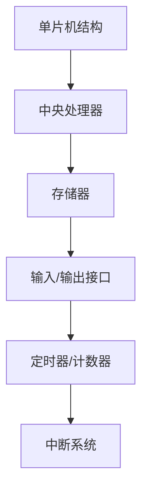

                 

关键词：单片机、微控制器、入门、应用、编程、硬件、软件开发

摘要：本文旨在为初学者提供一份全面且深入的单片机入门指南。我们将探讨单片机的基本概念、工作原理、应用场景，以及如何进行编程和应用。本文还包含了一些实用的代码实例和资源推荐，帮助读者更好地理解和掌握单片机技术。

## 1. 背景介绍

单片机，简称MCU（Microcontroller Unit），是一种集成度高、功能强大的微控制器。它通常包含一个中央处理器（CPU）、存储器、输入/输出接口以及其他外设，如定时器、中断控制器、串行通信接口等。由于其集成度高的特点，单片机在嵌入式系统中得到了广泛的应用。

### 1.1 单片机的发展历史

单片机的概念起源于20世纪60年代。当时，计算机系统通常由多个独立的组件组成，包括中央处理器、内存、输入/输出设备等。随着电子技术的发展，人们开始尝试将多个组件集成在一个芯片上，从而形成了单片机。1971年，英特尔推出了世界上第一款微处理器4004，标志着单片机时代的开始。

### 1.2 单片机在现代科技中的应用

如今，单片机已经广泛应用于各种领域，包括消费电子、工业控制、智能家居、医疗设备、汽车电子等。随着物联网（IoT）技术的发展，单片机的应用前景更加广阔。例如，智能家居中的智能插座、智能灯泡等设备，通常都使用单片机进行控制。

## 2. 核心概念与联系

### 2.1 单片机的基本结构

单片机的基本结构包括以下几个部分：

1. **中央处理器（CPU）**：负责执行指令和处理数据。
2. **存储器**：包括随机存取存储器（RAM）和只读存储器（ROM）。RAM用于临时存储数据和程序，ROM用于存储程序代码。
3. **输入/输出接口**：用于与外部设备进行通信，如LED灯、按键、传感器等。
4. **定时器/计数器**：用于实现定时功能或计数功能。
5. **中断系统**：用于处理外部事件，如按键按下、串口数据接收等。

### 2.2 单片机的工作原理

单片机的工作原理可以简单地概括为以下几个步骤：

1. **启动**：单片机上电后，从ROM中读取引导程序，初始化各个外设和寄存器。
2. **执行指令**：CPU从RAM中读取指令，并执行相应的操作。
3. **处理输入/输出**：根据指令的要求，与外部设备进行数据交换。
4. **中断处理**：当有外部事件发生时，CPU响应中断，执行中断服务程序。

### 2.3 单片机的架构图



## 3. 核心算法原理 & 具体操作步骤

### 3.1 算法原理概述

单片机的核心算法主要包括以下几个部分：

1. **指令集**：单片机的指令集决定了它能够执行的操作。常见的指令集包括数据传输指令、逻辑运算指令、算术运算指令等。
2. **汇编语言**：汇编语言是单片机的低级语言，直接对应单片机的指令集。通过汇编语言，程序员可以编写出高效的代码。
3. **C语言**：C语言是一种高级语言，具有良好的可读性和可维护性。许多单片机都支持C语言编译器，使得编程更加方便。

### 3.2 算法步骤详解

1. **环境搭建**：首先，需要搭建单片机的开发环境。包括选择合适的单片机型号、开发板、集成开发环境（IDE）等。
2. **编写代码**：根据单片机的功能和需求，编写相应的代码。可以使用汇编语言或C语言。
3. **编译与调试**：使用编译器将代码编译成机器码，并进行调试，确保代码的正确性。
4. **下载程序**：将编译后的程序下载到单片机中，运行程序。
5. **测试与优化**：在实际应用中测试程序，并根据测试结果进行优化。

### 3.3 算法优缺点

**优点**：

1. **高效性**：单片机执行指令的速度非常快，可以满足实时性要求。
2. **灵活性**：单片机具有丰富的外设接口，可以方便地与其他设备进行通信。
3. **低成本**：单片机的成本相对较低，适合大规模应用。

**缺点**：

1. **存储空间有限**：单片机的存储空间通常较小，可能无法满足复杂应用的需求。
2. **计算能力有限**：单片机的计算能力相对较弱，无法与高性能的通用计算机相比。

### 3.4 算法应用领域

单片机广泛应用于以下领域：

1. **消费电子**：如智能手表、智能家居设备等。
2. **工业控制**：如机床控制、生产线自动化等。
3. **汽车电子**：如车载仪表盘、行车记录仪等。
4. **医疗设备**：如心电图机、血压计等。

## 4. 数学模型和公式 & 详细讲解 & 举例说明

### 4.1 数学模型构建

单片机的数学模型主要涉及以下几个方面：

1. **模拟信号处理**：如滤波、放大、采样等。
2. **数字信号处理**：如FFT、DFT等。
3. **控制算法**：如PID控制、模糊控制等。

### 4.2 公式推导过程

以PID控制算法为例，其基本公式如下：

$$
u(t) = K_p e(t) + K_i \int_{0}^{t} e(\tau)d\tau + K_d \frac{de(t)}{dt}
$$

其中，$u(t)$ 为控制输出，$e(t)$ 为误差，$K_p$、$K_i$、$K_d$ 分别为比例、积分、微分系数。

### 4.3 案例分析与讲解

假设我们要控制一个温度系统，要求系统温度保持在某个设定值。可以使用PID控制算法来实现。

1. **确定控制目标**：设定温度为30℃。
2. **设计PID参数**：根据系统特性，选择合适的PID参数。
3. **编写控制程序**：使用C语言或汇编语言编写PID控制程序。
4. **测试与优化**：在实际应用中测试程序，并根据测试结果调整PID参数。

## 5. 项目实践：代码实例和详细解释说明

### 5.1 开发环境搭建

1. **选择单片机型号**：选择一个适合项目的单片机型号，如STM32。
2. **购买开发板**：选择一款支持STM32的开发板，如STM32F103C8。
3. **安装IDE**：下载并安装STM32的集成开发环境（如STM32CubeIDE）。

### 5.2 源代码详细实现

以下是一个简单的LED闪烁程序：

```c
#include "stm32f10x.h"

void LED_Init(void) {
    // 初始化LED引脚为输出模式
    GPIO_InitTypeDef GPIO_InitStructure;
    RCC_APB2PeriphClockCmd(RCC_APB2Periph_GPIOB, ENABLE);
    GPIO_InitStructure.GPIO_Pin = GPIO_Pin_0;
    GPIO_InitStructure.GPIO_Mode = GPIO_Mode_Out_PP;
    GPIO_InitStructure.GPIO_Speed = GPIO_Speed_50MHz;
    GPIO_Init(GPIOB, &GPIO_InitStructure);
}

void Delay(unsigned int n) {
    // 延时函数
    volatile unsigned int i, j;
    for (i = 0; i < n; i++)
        for (j = 0; j < 1000; j++);
}

int main(void) {
    LED_Init();
    while (1) {
        // LED闪烁
        GPIO_WriteBit(GPIOB, GPIO_Pin_0, Bit_SET);
        Delay(1000);
        GPIO_WriteBit(GPIOB, GPIO_Pin_0, Bit_RESET);
        Delay(1000);
    }
}
```

### 5.3 代码解读与分析

1. **头文件**：`stm32f10x.h` 是STM32的底层驱动头文件，提供了GPIO操作的函数。
2. **LED_Init函数**：初始化LED引脚为输出模式。
3. **Delay函数**：简单的延时函数。
4. **主函数**：实现LED的闪烁功能。

### 5.4 运行结果展示

编译并下载程序后，LED灯会按照设定的频率进行闪烁。

## 6. 实际应用场景

### 6.1 消费电子

在消费电子领域，单片机被广泛应用于各种智能设备中。例如，智能手表、智能手环等设备，通常使用单片机进行数据处理和显示控制。

### 6.2 工业控制

在工业控制领域，单片机常用于控制机床、生产线等设备。例如，数控机床通常使用单片机进行路径规划和运动控制。

### 6.3 汽车电子

在汽车电子领域，单片机被广泛应用于各种汽车电子设备中。例如，车载音响、行车记录仪等设备，通常使用单片机进行控制和数据处理。

### 6.4 未来应用展望

随着物联网和人工智能技术的发展，单片机的应用前景将更加广阔。未来，单片机将在智能家居、智能交通、智能医疗等领域发挥更大的作用。

## 7. 工具和资源推荐

### 7.1 学习资源推荐

1. **《单片机原理与应用》**：一本全面介绍单片机原理和应用的专业书籍。
2. **《STM32嵌入式系统开发实战》**：一本针对STM32单片机的实战教程。

### 7.2 开发工具推荐

1. **STM32CubeIDE**：一款由ST公司提供的集成开发环境，支持STM32系列单片机。
2. **Keil uVision**：一款广泛使用的单片机开发工具，支持多种单片机型号。

### 7.3 相关论文推荐

1. **“A Survey of Microcontroller Technology”**：一篇关于单片机技术的综述性论文。
2. **“Application of Microcontrollers in Industrial Automation”**：一篇关于单片机在工业控制领域应用的论文。

## 8. 总结：未来发展趋势与挑战

### 8.1 研究成果总结

随着电子技术的不断发展，单片机技术取得了显著的成果。性能不断提升，功耗不断降低，应用领域不断扩大。

### 8.2 未来发展趋势

未来，单片机技术将继续朝着高性能、低功耗、智能化方向迈进。物联网和人工智能技术的融合，将为单片机带来更多创新应用。

### 8.3 面临的挑战

单片机技术在未来将面临以下几个挑战：

1. **性能提升**：如何提高单片机的性能，满足更高要求的实时性。
2. **功耗降低**：如何在保证性能的同时，降低功耗，延长电池寿命。
3. **安全性**：如何提高单片机的安全性，防止恶意攻击。

### 8.4 研究展望

未来，单片机技术将在物联网、人工智能、智能制造等领域发挥更大的作用。通过不断创新和突破，单片机将为人类社会带来更多便利。

## 9. 附录：常见问题与解答

### 9.1 单片机与微处理器的区别是什么？

**单片机**：集成度高，包含CPU、存储器、外设等；适用于嵌入式系统。

**微处理器**：仅包含CPU，不包含存储器和外设；适用于通用计算机系统。

### 9.2 如何选择适合自己项目的单片机？

根据项目需求，考虑以下几个方面：

1. **性能**：处理能力、速度等。
2. **存储空间**：RAM、ROM等。
3. **外设接口**：如UART、SPI、I2C等。
4. **价格**：预算和成本控制。

### 9.3 单片机编程用什么语言？

单片机编程可以使用汇编语言或C语言。汇编语言运行效率高，但可读性差；C语言可读性好，但运行效率稍低。

----------------------------------------------------------------
作者：禅与计算机程序设计艺术 / Zen and the Art of Computer Programming


