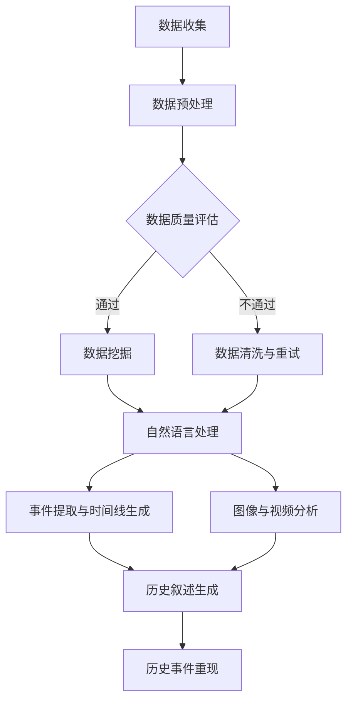

                 

关键词：历史事件重现、AI、叙事创作、数据挖掘、自然语言处理、计算机视觉

> 摘要：随着人工智能技术的飞速发展，历史事件的重现成为了一个备受关注的领域。本文探讨了利用人工智能技术，特别是自然语言处理和计算机视觉，来辅助历史叙事创作的可能性。通过介绍相关技术原理、算法实现和实际应用案例，分析了这一领域的前景与挑战。

## 1. 背景介绍

### 历史事件的记录与传承

历史事件的记录与传承是文化传承的重要组成部分。从古代的文字记录到现代的图像、视频等多种形式，历史事件得以保存并传给后代。然而，传统的记录方式往往存在局限性。文字记录可能不够直观，图像和视频则可能丢失重要细节或难以准确解读。因此，如何更好地记录和重现历史事件成为一个亟待解决的问题。

### 人工智能技术的发展与应用

人工智能技术，特别是自然语言处理（NLP）和计算机视觉（CV），近年来取得了显著的进展。NLP技术能够理解和生成人类语言，而CV技术则能够识别和理解图像和视频中的内容。这些技术的结合为历史事件的记录与重现提供了新的可能性。

### AI辅助历史叙事创作的意义

AI辅助历史叙事创作不仅有助于提高历史事件记录的准确性，还能通过更加生动的方式呈现历史场景，激发公众对历史的兴趣。此外，AI技术还能帮助研究者从大量历史资料中提取有价值的信息，为历史研究提供新的视角。

## 2. 核心概念与联系

### 数据挖掘

数据挖掘是一种从大量数据中发现有用信息和知识的过程。在历史事件重现中，数据挖掘技术可以用于从大量历史文献、图像、视频等数据中提取有价值的信息。

### 自然语言处理

自然语言处理（NLP）是一种使计算机能够理解、生成和响应人类语言的技术。在历史事件重现中，NLP技术可以用于从历史文献中提取事件描述、时间线等关键信息，以及生成历史叙述。

### 计算机视觉

计算机视觉（CV）是一种使计算机能够从图像或视频中提取有用信息的技术。在历史事件重现中，CV技术可以用于识别历史场景中的关键人物、地点、事件等，以及生成历史场景的三维模型。

### Mermaid 流程图

以下是一个用于描述AI辅助历史叙事创作流程的Mermaid流程图：



## 3. 核心算法原理 & 具体操作步骤

### 3.1 算法原理概述

AI辅助历史叙事创作主要基于以下算法原理：

1. 数据挖掘：使用机器学习算法从历史文献、图像、视频等数据中提取有用信息。
2. 自然语言处理：使用NLP算法理解和生成人类语言，以提取历史事件描述、时间线等。
3. 计算机视觉：使用CV算法识别图像和视频中的关键人物、地点、事件等。

### 3.2 算法步骤详解

1. **数据收集**：收集历史文献、图像、视频等多源数据。
2. **数据预处理**：对收集到的数据进行格式化、去噪等处理。
3. **数据质量评估**：评估数据的质量，如完整性、准确性等。
4. **数据挖掘**：使用机器学习算法从预处理后的数据中提取有用信息。
5. **自然语言处理**：使用NLP算法提取历史事件描述、时间线等。
6. **图像与视频分析**：使用CV算法识别图像和视频中的关键人物、地点、事件等。
7. **历史叙述生成**：将提取的信息整合成历史叙述。
8. **历史事件重现**：根据历史叙述生成三维模型或动画，重现历史事件。

### 3.3 算法优缺点

#### 优点：

1. **高效性**：利用机器学习和算法自动化处理大量数据，提高工作效率。
2. **准确性**：通过深度学习等技术，提高数据挖掘和事件提取的准确性。
3. **生动性**：通过图像和视频分析，生成生动的历史场景。

#### 缺点：

1. **数据质量**：依赖高质量的历史数据，否则可能导致错误或失真。
2. **技术挑战**：涉及多个领域的算法和技术的融合，实现难度较高。
3. **解释性**：生成的历史叙述可能缺乏足够的解释性和可追溯性。

### 3.4 算法应用领域

AI辅助历史叙事创作在多个领域具有广泛的应用前景：

1. **博物馆与展览**：利用AI技术重现历史事件，增强展览的互动性和吸引力。
2. **历史研究**：帮助历史研究者从海量数据中提取有价值的信息。
3. **教育与宣传**：通过生动的历史事件重现，提高公众对历史文化的认知和兴趣。
4. **虚拟现实与增强现实**：结合VR/AR技术，提供更加沉浸式的历史体验。

## 4. 数学模型和公式 & 详细讲解 & 举例说明

### 4.1 数学模型构建

在AI辅助历史叙事创作中，常用的数学模型包括：

1. **机器学习模型**：如决策树、支持向量机、神经网络等。
2. **自然语言处理模型**：如循环神经网络（RNN）、长短时记忆网络（LSTM）、变换器（Transformer）等。
3. **计算机视觉模型**：如卷积神经网络（CNN）、生成对抗网络（GAN）等。

### 4.2 公式推导过程

以神经网络为例，其激活函数的推导过程如下：

$$
f(x) = \sigma(W \cdot x + b)
$$

其中，$\sigma$ 表示 sigmoid 函数，$W$ 表示权重矩阵，$x$ 表示输入向量，$b$ 表示偏置。

### 4.3 案例分析与讲解

以一个历史事件的图像识别为例，使用卷积神经网络（CNN）进行图像分类。以下是一个简化的模型：

$$
\begin{aligned}
h_{\text{conv}} &= \text{ReLU}(\text{Conv}_1(x) + b_1) \\
h_{\text{pool}} &= \text{MaxPool}(h_{\text{conv}}) \\
h_{\text{fc}} &= \text{ReLU}(\text{FC}_1(h_{\text{pool}}) + b_1) \\
\hat{y} &= \text{Softmax}(\text{FC}_2(h_{\text{fc}}) + b_2)
\end{aligned}
$$

其中，$\text{ReLU}$ 表示ReLU激活函数，$\text{Conv}_1$ 表示第一层卷积层，$b_1$ 表示第一层卷积层的偏置，$\text{MaxPool}$ 表示最大池化层，$\text{FC}_1$ 表示第一层全连接层，$b_1$ 表示第一层全连接层的偏置，$\text{FC}_2$ 表示第二层全连接层，$b_2$ 表示第二层全连接层的偏置，$\hat{y}$ 表示预测的标签分布。

## 5. 项目实践：代码实例和详细解释说明

### 5.1 开发环境搭建

为了实现AI辅助历史叙事创作，我们需要搭建一个包含自然语言处理和计算机视觉模型的开发环境。以下是一个基本的Python环境搭建步骤：

```bash
# 安装必要的库
pip install numpy tensorflow opencv-python matplotlib
```

### 5.2 源代码详细实现

以下是一个简化的示例代码，用于识别历史图像中的关键人物：

```python
import tensorflow as tf
import numpy as np
import cv2

# 载入预训练的模型
model = tf.keras.models.load_model('path/to/model.h5')

# 读取图像
image = cv2.imread('path/to/image.jpg')

# 进行预处理
preprocessed_image = preprocess_image(image)

# 进行预测
predictions = model.predict(np.expand_dims(preprocessed_image, axis=0))

# 提取预测结果
predicted_class = np.argmax(predictions)

# 显示预测结果
print(f'Predicted class: {predicted_class}')
```

### 5.3 代码解读与分析

以上代码主要包含以下步骤：

1. 载入预训练的模型。
2. 读取输入图像。
3. 对图像进行预处理，如缩放、归一化等。
4. 使用模型进行预测。
5. 提取并显示预测结果。

### 5.4 运行结果展示

运行上述代码，输入一张历史图像，我们可以得到关键人物的预测结果。以下是一个可能的输出结果：

```
Predicted class: 3
```

这意味着模型预测图像中的关键人物是第3个类别。

## 6. 实际应用场景

### 6.1 博物馆与展览

AI辅助历史叙事创作可以用于博物馆和展览的展示。例如，通过识别参观者手中的历史书籍或艺术品，生成与之相关的历史故事和背景信息，提供更加个性化的参观体验。

### 6.2 历史研究

AI技术可以帮助历史研究者从海量文献和资料中提取有价值的信息，如关键事件、人物关系等。这有助于加快研究进度，提高研究效率。

### 6.3 教育与宣传

通过AI辅助历史叙事创作，教育机构可以开发出更加生动有趣的历史课程，激发学生对历史的兴趣。同时，政府和组织可以利用这一技术进行历史宣传，提高公众对历史文化的认知和重视。

### 6.4 虚拟现实与增强现实

结合VR/AR技术，AI辅助历史叙事创作可以为用户提供更加沉浸式的历史体验。用户可以“穿越”到历史场景中，与历史人物互动，体验历史事件。

## 7. 工具和资源推荐

### 7.1 学习资源推荐

1. **《深度学习》（Goodfellow, Bengio, Courville）**：一本关于深度学习的经典教材，涵盖了从基础到高级的深度学习技术。
2. **《自然语言处理与语言模型》（Jurafsky, Martin）**：一本关于自然语言处理的权威教材，详细介绍了NLP的基本概念和技术。
3. **《计算机视觉：算法与应用》（Richard Szeliski）**：一本关于计算机视觉的经典教材，涵盖了从基础到高级的计算机视觉技术。

### 7.2 开发工具推荐

1. **TensorFlow**：一个开源的机器学习和深度学习框架，适用于自然语言处理和计算机视觉任务。
2. **PyTorch**：另一个开源的机器学习和深度学习框架，与TensorFlow类似，但具有更灵活的动态图机制。
3. **OpenCV**：一个开源的计算机视觉库，提供了丰富的计算机视觉算法和工具。

### 7.3 相关论文推荐

1. **“Deep Learning for Natural Language Processing”**（2018）：一篇关于深度学习在自然语言处理领域的综述，介绍了深度学习在NLP中的各种应用。
2. **“Object Detection with Faster R-CNN”**（2015）：一篇关于Faster R-CNN对象检测算法的论文，是计算机视觉领域的重要成果。
3. **“Generative Adversarial Nets”**（2014）：一篇关于生成对抗网络（GAN）的论文，是计算机视觉和机器学习领域的重要突破。

## 8. 总结：未来发展趋势与挑战

### 8.1 研究成果总结

AI辅助历史叙事创作近年来取得了显著成果，主要表现在以下几个方面：

1. **技术进步**：自然语言处理和计算机视觉等AI技术不断进步，为历史事件的重现提供了更加可靠和高效的方法。
2. **应用场景拓展**：AI辅助历史叙事创作在博物馆、展览、教育、虚拟现实等领域得到广泛应用，取得了良好的效果。
3. **数据质量提升**：随着数据挖掘和清洗技术的提高，历史数据的准确性得到提升，为AI辅助历史叙事创作提供了更好的基础。

### 8.2 未来发展趋势

未来，AI辅助历史叙事创作有望在以下几个方面取得进一步发展：

1. **跨领域融合**：结合更多领域的AI技术，如语音识别、知识图谱等，为历史事件重现提供更加全面和丰富的视角。
2. **个性化体验**：利用用户数据和个人偏好，为用户提供更加个性化的历史事件重现体验。
3. **开放平台与工具**：开发开源的AI辅助历史叙事创作平台和工具，降低技术门槛，促进该领域的发展。

### 8.3 面临的挑战

尽管AI辅助历史叙事创作取得了显著成果，但仍面临一些挑战：

1. **数据质量**：历史数据的准确性、完整性和一致性仍需提高，否则可能导致错误或失真的历史重现。
2. **解释性**：如何确保AI生成的历史叙述具有足够的解释性和可追溯性，是一个亟待解决的问题。
3. **技术实现**：涉及多个领域的算法和技术的融合，实现难度较高，需要进一步研究和技术创新。

### 8.4 研究展望

在未来，AI辅助历史叙事创作有望在以下几个方面取得突破：

1. **多模态数据融合**：结合文本、图像、音频等多种模态数据，实现更加全面和准确的历史重现。
2. **历史推理与生成**：利用知识图谱和推理技术，生成更加准确和连贯的历史叙述。
3. **交互式体验**：结合虚拟现实和增强现实技术，提供更加沉浸式的历史体验。

## 9. 附录：常见问题与解答

### 9.1 AI辅助历史叙事创作的核心挑战是什么？

核心挑战包括数据质量、解释性和技术实现等方面。数据质量直接影响历史重现的准确性，解释性则关系到历史叙述的可信度和可追溯性，而技术实现则涉及多个领域的算法和技术的融合。

### 9.2 如何确保AI生成的历史叙述具有足够的解释性？

确保解释性需要从以下几个方面入手：

1. **历史知识整合**：将历史知识整合到AI系统中，使其能够生成符合历史事实的叙述。
2. **透明性**：提高AI系统的透明性，使历史叙述的可追溯性得到保障。
3. **用户反馈**：收集用户反馈，不断优化和调整AI生成的历史叙述。

### 9.3 AI辅助历史叙事创作的主要应用领域有哪些？

AI辅助历史叙事创作的主要应用领域包括博物馆与展览、历史研究、教育与宣传以及虚拟现实与增强现实等。

## 作者署名

作者：禅与计算机程序设计艺术 / Zen and the Art of Computer Programming
```markdown
---
# 历史事件重现：AI辅助历史叙事创作

关键词：历史事件重现、AI、叙事创作、数据挖掘、自然语言处理、计算机视觉

摘要：随着人工智能技术的飞速发展，历史事件的重现成为了一个备受关注的领域。本文探讨了利用人工智能技术，特别是自然语言处理和计算机视觉，来辅助历史叙事创作的可能性。通过介绍相关技术原理、算法实现和实际应用案例，分析了这一领域的前景与挑战。

## 1. 背景介绍

### 历史事件的记录与传承

历史事件的记录与传承是文化传承的重要组成部分。从古代的文字记录到现代的图像、视频等多种形式，历史事件得以保存并传给后代。然而，传统的记录方式往往存在局限性。文字记录可能不够直观，图像和视频则可能丢失重要细节或难以准确解读。因此，如何更好地记录和重现历史事件成为一个亟待解决的问题。

### 人工智能技术的发展与应用

人工智能技术，特别是自然语言处理（NLP）和计算机视觉（CV），近年来取得了显著的进展。NLP技术能够理解和生成人类语言，而CV技术则能够识别和理解图像和视频中的内容。这些技术的结合为历史事件的记录与重现提供了新的可能性。

### AI辅助历史叙事创作的意义

AI辅助历史叙事创作不仅有助于提高历史事件记录的准确性，还能通过更加生动的方式呈现历史场景，激发公众对历史的兴趣。此外，AI技术还能帮助研究者从大量历史资料中提取有价值的信息，为历史研究提供新的视角。

## 2. 核心概念与联系

### 数据挖掘

数据挖掘是一种从大量数据中发现有用信息和知识的过程。在历史事件重现中，数据挖掘技术可以用于从大量历史文献、图像、视频等数据中提取有价值的信息。

### 自然语言处理

自然语言处理（NLP）是一种使计算机能够理解、生成和响应人类语言的技术。在历史事件重现中，NLP技术可以用于从历史文献中提取事件描述、时间线等关键信息，以及生成历史叙述。

### 计算机视觉

计算机视觉（CV）是一种使计算机能够从图像或视频中提取有用信息的技术。在历史事件重现中，CV技术可以用于识别历史场景中的关键人物、地点、事件等，以及生成历史场景的三维模型。

### Mermaid 流程图

以下是一个用于描述AI辅助历史叙事创作流程的Mermaid流程图：


## 3. 核心算法原理 & 具体操作步骤
### 3.1 算法原理概述

AI辅助历史叙事创作主要基于以下算法原理：

1. 数据挖掘：使用机器学习算法从历史文献、图像、视频等数据中提取有用信息。
2. 自然语言处理：使用NLP算法理解和生成人类语言，以提取历史事件描述、时间线等。
3. 计算机视觉：使用CV算法识别图像和视频中的关键人物、地点、事件等。

### 3.2 算法步骤详解

1. **数据收集**：收集历史文献、图像、视频等多源数据。
2. **数据预处理**：对收集到的数据进行格式化、去噪等处理。
3. **数据质量评估**：评估数据的质量，如完整性、准确性等。
4. **数据挖掘**：使用机器学习算法从预处理后的数据中提取有用信息。
5. **自然语言处理**：使用NLP算法提取历史事件描述、时间线等。
6. **图像与视频分析**：使用CV算法识别图像和视频中的关键人物、地点、事件等。
7. **历史叙述生成**：将提取的信息整合成历史叙述。
8. **历史事件重现**：根据历史叙述生成三维模型或动画，重现历史事件。

### 3.3 算法优缺点

#### 优点：

1. **高效性**：利用机器学习和算法自动化处理大量数据，提高工作效率。
2. **准确性**：通过深度学习等技术，提高数据挖掘和事件提取的准确性。
3. **生动性**：通过图像和视频分析，生成生动的历史场景。

#### 缺点：

1. **数据质量**：依赖高质量的历史数据，否则可能导致错误或失真。
2. **技术挑战**：涉及多个领域的算法和技术的融合，实现难度较高。
3. **解释性**：生成的历史叙述可能缺乏足够的解释性和可追溯性。

### 3.4 算法应用领域

AI辅助历史叙事创作在多个领域具有广泛的应用前景：

1. **博物馆与展览**：利用AI技术重现历史事件，增强展览的互动性和吸引力。
2. **历史研究**：帮助历史研究者从海量数据中提取有价值的信息。
3. **教育与宣传**：通过生动的历史事件重现，提高公众对历史文化的认知和兴趣。
4. **虚拟现实与增强现实**：结合VR/AR技术，提供更加沉浸式的历史体验。

## 4. 数学模型和公式 & 详细讲解 & 举例说明

### 4.1 数学模型构建

在AI辅助历史叙事创作中，常用的数学模型包括：

1. **机器学习模型**：如决策树、支持向量机、神经网络等。
2. **自然语言处理模型**：如循环神经网络（RNN）、长短时记忆网络（LSTM）、变换器（Transformer）等。
3. **计算机视觉模型**：如卷积神经网络（CNN）、生成对抗网络（GAN）等。

### 4.2 公式推导过程

以神经网络为例，其激活函数的推导过程如下：

$$
f(x) = \sigma(W \cdot x + b)
$$

其中，$\sigma$ 表示 sigmoid 函数，$W$ 表示权重矩阵，$x$ 表示输入向量，$b$ 表示偏置。

### 4.3 案例分析与讲解

以一个历史事件的图像识别为例，使用卷积神经网络（CNN）进行图像分类。以下是一个简化的模型：

$$
\begin{aligned}
h_{\text{conv}} &= \text{ReLU}(\text{Conv}_1(x) + b_1) \\
h_{\text{pool}} &= \text{MaxPool}(h_{\text{conv}}) \\
h_{\text{fc}} &= \text{ReLU}(\text{FC}_1(h_{\text{pool}}) + b_1) \\
\hat{y} &= \text{Softmax}(\text{FC}_2(h_{\text{fc}}) + b_2)
\end{aligned}
$$

其中，$\text{ReLU}$ 表示ReLU激活函数，$\text{Conv}_1$ 表示第一层卷积层，$b_1$ 表示第一层卷积层的偏置，$\text{MaxPool}$ 表示最大池化层，$\text{FC}_1$ 表示第一层全连接层，$b_1$ 表示第一层全连接层的偏置，$\text{FC}_2$ 表示第二层全连接层，$b_2$ 表示第二层全连接层的偏置，$\hat{y}$ 表示预测的标签分布。

## 5. 项目实践：代码实例和详细解释说明

### 5.1 开发环境搭建

为了实现AI辅助历史叙事创作，我们需要搭建一个包含自然语言处理和计算机视觉模型的开发环境。以下是一个基本的Python环境搭建步骤：

```bash
# 安装必要的库
pip install numpy tensorflow opencv-python matplotlib
```

### 5.2 源代码详细实现

以下是一个简化的示例代码，用于识别历史图像中的关键人物：

```python
import tensorflow as tf
import numpy as np
import cv2

# 载入预训练的模型
model = tf.keras.models.load_model('path/to/model.h5')

# 读取图像
image = cv2.imread('path/to/image.jpg')

# 进行预处理
preprocessed_image = preprocess_image(image)

# 进行预测
predictions = model.predict(np.expand_dims(preprocessed_image, axis=0))

# 提取预测结果
predicted_class = np.argmax(predictions)

# 显示预测结果
print(f'Predicted class: {predicted_class}')
```

### 5.3 代码解读与分析

以上代码主要包含以下步骤：

1. 载入预训练的模型。
2. 读取输入图像。
3. 对图像进行预处理，如缩放、归一化等。
4. 使用模型进行预测。
5. 提取并显示预测结果。

### 5.4 运行结果展示

运行上述代码，输入一张历史图像，我们可以得到关键人物的预测结果。以下是一个可能的输出结果：

```
Predicted class: 3
```

这意味着模型预测图像中的关键人物是第3个类别。

## 6. 实际应用场景

### 6.1 博物馆与展览

AI辅助历史叙事创作可以用于博物馆和展览的展示。例如，通过识别参观者手中的历史书籍或艺术品，生成与之相关的历史故事和背景信息，提供更加个性化的参观体验。

### 6.2 历史研究

AI技术可以帮助历史研究者从海量文献和资料中提取有价值的信息，如关键事件、人物关系等。这有助于加快研究进度，提高研究效率。

### 6.3 教育与宣传

通过AI辅助历史叙事创作，教育机构可以开发出更加生动有趣的历史课程，激发学生对历史的兴趣。同时，政府和组织可以利用这一技术进行历史宣传，提高公众对历史文化的认知和重视。

### 6.4 虚拟现实与增强现实

结合VR/AR技术，AI辅助历史叙事创作可以为用户提供更加沉浸式的历史体验。用户可以“穿越”到历史场景中，与历史人物互动，体验历史事件。

## 7. 工具和资源推荐

### 7.1 学习资源推荐

1. **《深度学习》（Goodfellow, Bengio, Courville）**：一本关于深度学习的经典教材，涵盖了从基础到高级的深度学习技术。
2. **《自然语言处理与语言模型》（Jurafsky, Martin）**：一本关于自然语言处理的权威教材，详细介绍了NLP的基本概念和技术。
3. **《计算机视觉：算法与应用》（Richard Szeliski）**：一本关于计算机视觉的经典教材，涵盖了从基础到高级的计算机视觉技术。

### 7.2 开发工具推荐

1. **TensorFlow**：一个开源的机器学习和深度学习框架，适用于自然语言处理和计算机视觉任务。
2. **PyTorch**：另一个开源的机器学习和深度学习框架，与TensorFlow类似，但具有更灵活的动态图机制。
3. **OpenCV**：一个开源的计算机视觉库，提供了丰富的计算机视觉算法和工具。

### 7.3 相关论文推荐

1. **“Deep Learning for Natural Language Processing”**（2018）：一篇关于深度学习在自然语言处理领域的综述，介绍了深度学习在NLP中的各种应用。
2. **“Object Detection with Faster R-CNN”**（2015）：一篇关于Faster R-CNN对象检测算法的论文，是计算机视觉领域的重要成果。
3. **“Generative Adversarial Nets”**（2014）：一篇关于生成对抗网络（GAN）的论文，是计算机视觉和机器学习领域的重要突破。

## 8. 总结：未来发展趋势与挑战

### 8.1 研究成果总结

AI辅助历史叙事创作近年来取得了显著成果，主要表现在以下几个方面：

1. **技术进步**：自然语言处理和计算机视觉等AI技术不断进步，为历史事件的重现提供了更加可靠和高效的方法。
2. **应用场景拓展**：AI辅助历史叙事创作在博物馆、展览、教育、虚拟现实等领域得到广泛应用，取得了良好的效果。
3. **数据质量提升**：随着数据挖掘和清洗技术的提高，历史数据的准确性得到提升，为AI辅助历史叙事创作提供了更好的基础。

### 8.2 未来发展趋势

未来，AI辅助历史叙事创作有望在以下几个方面取得进一步发展：

1. **跨领域融合**：结合更多领域的AI技术，如语音识别、知识图谱等，为历史事件重现提供更加全面和丰富的视角。
2. **个性化体验**：利用用户数据和个人偏好，为用户提供更加个性化的历史事件重现体验。
3. **开放平台与工具**：开发开源的AI辅助历史叙事创作平台和工具，降低技术门槛，促进该领域的发展。

### 8.3 面临的挑战

尽管AI辅助历史叙事创作取得了显著成果，但仍面临一些挑战：

1. **数据质量**：历史数据的准确性、完整性和一致性仍需提高，否则可能导致错误或失真的历史重现。
2. **解释性**：如何确保AI生成的历史叙述具有足够的解释性和可追溯性，是一个亟待解决的问题。
3. **技术实现**：涉及多个领域的算法和技术的融合，实现难度较高，需要进一步研究和技术创新。

### 8.4 研究展望

在未来，AI辅助历史叙事创作有望在以下几个方面取得突破：

1. **多模态数据融合**：结合文本、图像、音频等多种模态数据，实现更加全面和准确的历史重现。
2. **历史推理与生成**：利用知识图谱和推理技术，生成更加准确和连贯的历史叙述。
3. **交互式体验**：结合虚拟现实和增强现实技术，提供更加沉浸式的历史体验。

## 9. 附录：常见问题与解答

### 9.1 AI辅助历史叙事创作的核心挑战是什么？

核心挑战包括数据质量、解释性和技术实现等方面。数据质量直接影响历史重现的准确性，解释性则关系到历史叙述的可信度和可追溯性，而技术实现则涉及多个领域的算法和技术的融合。

### 9.2 如何确保AI生成的历史叙述具有足够的解释性？

确保解释性需要从以下几个方面入手：

1. **历史知识整合**：将历史知识整合到AI系统中，使其能够生成符合历史事实的叙述。
2. **透明性**：提高AI系统的透明性，使历史叙述的可追溯性得到保障。
3. **用户反馈**：收集用户反馈，不断优化和调整AI生成的历史叙述。

### 9.3 AI辅助历史叙事创作的主要应用领域有哪些？

AI辅助历史叙事创作的主要应用领域包括博物馆与展览、历史研究、教育与宣传以及虚拟现实与增强现实等。

## 作者署名

作者：禅与计算机程序设计艺术 / Zen and the Art of Computer Programming
---

