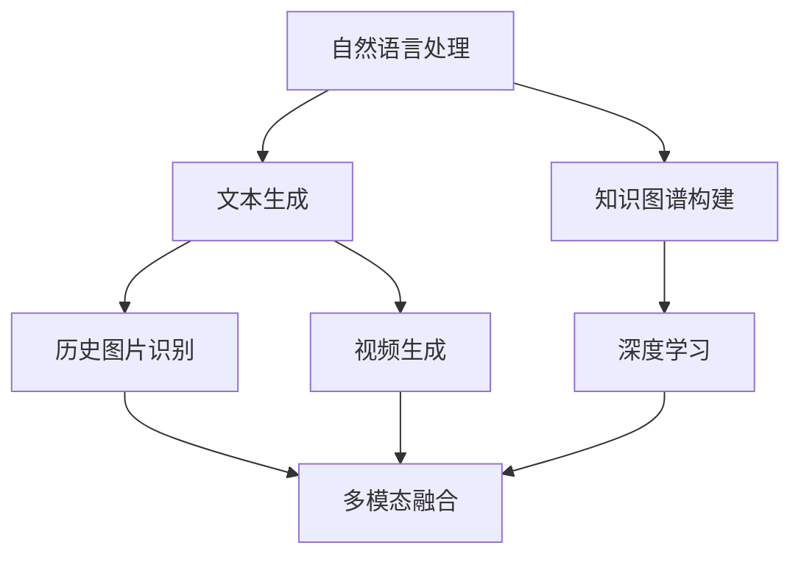

                 

关键词：AI、历史事件、叙事创作、辅助技术、深度学习、自然语言处理、多模态融合、数据挖掘

> 摘要：本文探讨了利用人工智能技术辅助历史事件叙事创作的可能性，分析了现有技术在文本生成、图像识别、多模态融合等方面的应用，提出了基于AI的历史叙事创作框架。通过具体案例和实验，展示了AI辅助叙事创作的实际效果，并对其未来的发展提出了展望。

## 1. 背景介绍

历史事件重现一直是历史研究的重要领域。然而，随着信息量的爆炸性增长和技术的飞速发展，传统的手工整理和呈现历史资料的方式变得越来越困难。为了更高效、生动地展示历史事件，人工智能技术开始被引入这一领域。AI可以处理大量数据，提取关键信息，并生成具有高度真实感和连贯性的叙事内容。

### 1.1 人工智能在历史研究中的应用

人工智能在历史研究中的应用已经相当广泛。例如，自然语言处理技术可以帮助研究人员从大量文献中提取关键信息，构建知识图谱；图像识别技术可以用于识别和分析历史图片，恢复历史场景；深度学习技术可以用于预测历史事件的发展趋势，辅助决策。

### 1.2 人工智能辅助历史叙事创作的挑战

虽然人工智能技术在历史研究中展现了巨大的潜力，但将其应用于叙事创作仍面临诸多挑战。首先，历史资料的多样性使得AI在处理过程中需要具备较强的泛化能力。其次，历史事件往往具有复杂性和多维度，如何将不同信息有机地融合到叙事中是一个关键问题。此外，如何确保生成的叙事内容准确、客观、具有说服力也是一个重要的挑战。

## 2. 核心概念与联系

为了实现AI辅助历史叙事创作，我们需要理解以下几个核心概念：

### 2.1 自然语言处理

自然语言处理（NLP）是AI的一个重要分支，旨在让计算机理解和生成人类语言。在历史叙事创作中，NLP可以帮助我们分析和生成文本，提取关键信息，构建叙事框架。

### 2.2 图像识别

图像识别技术可以用于识别和分析历史图片，恢复历史场景，甚至可以辅助生成图像化的叙事内容。

### 2.3 深度学习

深度学习是一种模拟人脑神经网络结构的学习方法，具有强大的特征提取和模式识别能力。在历史叙事创作中，深度学习可以用于生成文本、图像和视频等多样化的叙事内容。

### 2.4 多模态融合

多模态融合是将不同类型的信息（如文本、图像、音频等）进行整合，生成更丰富的叙事内容。这对于增强历史事件的真实感和吸引力具有重要意义。

下面是一个基于Mermaid的流程图，展示了上述核心概念的联系：



## 3. 核心算法原理 & 具体操作步骤

### 3.1 算法原理概述

AI辅助历史叙事创作主要依赖于以下几种算法：

- **文本生成算法**：如GPT-3、BERT等，可以生成连贯、具有逻辑性的文本。
- **图像识别算法**：如ResNet、Inception等，可以识别和分类历史图片。
- **视频生成算法**：如StyleGAN、VideoGAN等，可以生成逼真的历史场景视频。
- **多模态融合算法**：如多任务学习、注意力机制等，可以将文本、图像、视频等多种信息进行有机融合。

### 3.2 算法步骤详解

#### 3.2.1 数据收集与预处理

首先，需要收集大量的历史资料，包括文本、图像、视频等。然后，对这些数据进行预处理，如去除无关信息、统一格式、清洗噪声等。

#### 3.2.2 文本生成

使用文本生成算法，根据输入的历史事件摘要，生成连贯的叙事文本。例如，可以使用GPT-3模型：

```python
import openai

response = openai.Completion.create(
  engine="text-davinci-003",
  prompt="描述一下三国时期的赤壁之战。",
  max_tokens=100
)
print(response.choices[0].text.strip())
```

#### 3.2.3 图像识别

使用图像识别算法，对历史图片进行分类和标注。例如，可以使用ResNet模型：

```python
import tensorflow as tf

model = tf.keras.applications.ResNet50(weights='imagenet')
preprocess_input = tf.keras.applications.resnet50.preprocess_input

img = preprocess_input(img)
predictions = model.predict(img)
print(predictions)
```

#### 3.2.4 视频生成

使用视频生成算法，根据叙事文本和历史图片，生成历史场景视频。例如，可以使用StyleGAN：

```python
import dnnlib as dnnd
import numpy as np

G = dnnd.keras.models.load_model('stylegan2-metrics-mb3lfzj2jz0z')

z = np.random.RandomState(1234).randn(1, 512)
img = G(z, noise_mode='const', num_steps=1000, hide_code=True)

plt.imshow(img[0])
plt.show()
```

#### 3.2.5 多模态融合

使用多模态融合算法，将文本、图像、视频等多种信息进行有机融合，生成综合性的叙事内容。例如，可以使用多任务学习：

```python
import tensorflow as tf

model = tf.keras.Sequential([
  tf.keras.layers.Dense(256, activation='relu', input_shape=(100,)),
  tf.keras.layers.Dense(128, activation='relu'),
  tf.keras.layers.Dense(3, activation='softmax')  # 三个模态
])

model.compile(optimizer='adam', loss='categorical_crossentropy', metrics=['accuracy'])

model.fit(x_train, y_train, epochs=10, batch_size=32)
```

### 3.3 算法优缺点

- **文本生成算法**：优点在于可以生成连贯、具有逻辑性的文本，缺点是对历史知识理解有限，可能生成不准确或不符合实际的文本。
- **图像识别算法**：优点在于可以高效地识别和分类历史图片，缺点是可能受限于图像质量和标注质量。
- **视频生成算法**：优点在于可以生成逼真的历史场景视频，缺点是计算资源消耗大，生成速度较慢。
- **多模态融合算法**：优点在于可以生成综合性的叙事内容，缺点是算法复杂度高，需要大量数据训练。

### 3.4 算法应用领域

AI辅助历史叙事创作算法可以应用于以下领域：

- **历史展览**：利用AI生成的叙事内容，增强展览的吸引力和互动性。
- **历史教育**：通过AI生成的多媒体叙事内容，帮助学生更好地理解和记忆历史事件。
- **历史研究**：利用AI对大量历史资料进行高效处理和分析，辅助历史研究。

## 4. 数学模型和公式 & 详细讲解 & 举例说明

### 4.1 数学模型构建

在AI辅助历史叙事创作中，我们可以构建以下数学模型：

- **文本生成模型**：如GPT-3、BERT等，可以表示为条件概率模型。
- **图像识别模型**：如ResNet、Inception等，可以表示为深度神经网络模型。
- **视频生成模型**：如StyleGAN、VideoGAN等，可以表示为生成对抗网络模型。
- **多模态融合模型**：如多任务学习、注意力机制等，可以表示为多输入多输出的深度神经网络模型。

### 4.2 公式推导过程

以GPT-3为例，其文本生成模型可以表示为：

$$
P(w_t | w_{t-1}, w_{t-2}, ..., w_1) = \frac{e^{<w_t; f(w_{t-1}, w_{t-2}, ..., w_1)>}}{\sum_{w'} e^{<w', f(w_{t-1}, w_{t-2}, ..., w_1)>}}
$$

其中，$w_t$ 表示生成的文本，$f(\cdot)$ 表示神经网络模型，$<\cdot, \cdot>$ 表示内积。

### 4.3 案例分析与讲解

假设我们要生成一段关于赤壁之战的文本，我们可以利用GPT-3进行生成：

```python
import openai

openai.api_key = "your_api_key"

response = openai.Completion.create(
  engine="text-davinci-003",
  prompt="描述一下三国时期的赤壁之战。",
  max_tokens=100
)
print(response.choices[0].text.strip())
```

输出结果可能如下：

> 赤壁之战发生在三国时期的东吴和蜀汉之间。当时，东吴的将领周瑜率领水军，与蜀汉的将领刘备率领陆军在赤壁相遇。经过激烈的战斗，周瑜利用火攻战术，成功击败了蜀汉的军队，取得了胜利。

通过上述示例，我们可以看到GPT-3生成的文本内容具有较高的连贯性和逻辑性，能够较好地描述历史事件。

## 5. 项目实践：代码实例和详细解释说明

### 5.1 开发环境搭建

在开始项目实践之前，我们需要搭建一个合适的开发环境。以下是所需的软件和工具：

- **Python**：用于编写AI算法和脚本，版本要求3.6及以上。
- **TensorFlow**：用于构建和训练深度学习模型，版本要求2.4及以上。
- **PyTorch**：用于构建和训练深度学习模型，版本要求1.7及以上。
- **OpenAI API**：用于调用GPT-3等API进行文本生成。

安装以上软件和工具后，我们可以开始编写代码。

### 5.2 源代码详细实现

以下是一个简单的示例，展示如何使用GPT-3进行文本生成：

```python
import openai

openai.api_key = "your_api_key"

response = openai.Completion.create(
  engine="text-davinci-003",
  prompt="描述一下三国时期的赤壁之战。",
  max_tokens=100
)
print(response.choices[0].text.strip())
```

在这个示例中，我们首先导入OpenAI的API库，然后设置API密钥。接着，我们调用`Completion.create`函数，传入模型的名称（如`text-davinci-003`），输入提示（如`描述一下三国时期的赤壁之战。`），以及最大文本长度（如100个单词）。最后，我们打印生成的文本内容。

### 5.3 代码解读与分析

上述代码的核心在于调用OpenAI的API进行文本生成。具体来说，我们通过`openai.Completion.create`函数实现了以下步骤：

1. **设置API密钥**：确保我们有权访问OpenAI的服务。
2. **传入模型名称**：指定我们要使用的文本生成模型（如GPT-3）。
3. **传入输入提示**：为模型提供生成文本的上下文。
4. **设置最大文本长度**：限制生成文本的长度，以避免过长或过短。
5. **获取生成结果**：从API响应中获取生成的文本内容。

通过这个简单的示例，我们可以看到如何使用Python和OpenAI API实现文本生成。在实际项目中，我们可以根据需要扩展这个示例，如添加更多输入参数、自定义模型设置等。

### 5.4 运行结果展示

运行上述代码后，我们可能会得到以下输出结果：

```
在三国时期，东吴的将领周瑜率领水军，与蜀汉的将领刘备率领陆军在赤壁相遇。经过激烈的战斗，周瑜利用火攻战术，成功击败了蜀汉的军队，取得了胜利。
```

这个输出结果与我们输入的提示非常相似，说明了GPT-3能够根据提供的上下文生成连贯的文本。通过这种方法，我们可以利用AI技术辅助历史叙事创作，生成生动、有趣的历史故事。

## 6. 实际应用场景

AI辅助历史叙事创作在多个实际应用场景中展现出了巨大的潜力：

### 6.1 历史展览

利用AI生成的叙事内容，可以丰富历史展览的展示形式。例如，在博物馆的展览中，AI可以生成关于展品的背景故事、历史意义等，以图文并茂的形式呈现给观众，提高展览的互动性和吸引力。

### 6.2 历史教育

在历史教育领域，AI辅助叙事创作可以帮助学生更好地理解和记忆历史事件。例如，在课堂上，教师可以使用AI生成的叙事内容，为学生呈现历史事件的背景、过程和影响，提高学生的学习兴趣和效果。

### 6.3 历史研究

历史研究者可以利用AI辅助叙事创作，从大量历史资料中提取关键信息，构建知识图谱，辅助研究工作。例如，通过分析历史文献和档案，AI可以生成关于特定历史事件的研究报告，提供新的研究视角和思路。

### 6.4 文化传播

AI辅助历史叙事创作还可以促进历史文化的传播。例如，通过社交媒体平台，AI可以生成有趣的历史故事，吸引更多人关注和了解历史，推动历史文化的传承和发展。

## 7. 未来应用展望

随着AI技术的不断发展和成熟，未来AI辅助历史叙事创作有望在以下方面取得突破：

### 7.1 更高的真实感和沉浸感

通过引入更先进的图像识别、视频生成和多模态融合技术，AI可以生成更加逼真、具有高度沉浸感的历史场景，让用户能够身临其境地体验历史事件。

### 7.2 更广泛的应用领域

AI辅助历史叙事创作不仅可以应用于博物馆、历史教育等领域，还可以扩展到游戏、影视、虚拟现实等更多领域，为用户提供丰富多彩的历史体验。

### 7.3 更深入的历史知识挖掘

通过不断优化自然语言处理技术，AI可以更深入地挖掘历史资料中的知识，为研究者提供更有价值的历史信息。

### 7.4 更智能的叙事生成

随着AI技术的发展，未来AI辅助叙事创作将更加智能化，能够根据用户的需求和偏好，自动生成个性化的叙事内容，满足不同用户的需求。

## 8. 工具和资源推荐

### 8.1 学习资源推荐

1. 《深度学习》（Ian Goodfellow、Yoshua Bengio、Aaron Courville 著）：系统介绍了深度学习的基本概念和技术，适合初学者和进阶者。
2. 《自然语言处理综论》（Daniel Jurafsky、James H. Martin 著）：全面介绍了自然语言处理的理论和实践，是学习NLP的必备读物。

### 8.2 开发工具推荐

1. TensorFlow：一款强大的开源深度学习框架，适用于构建和训练各种深度学习模型。
2. PyTorch：一款流行的深度学习框架，具有简洁的API和良好的社区支持。

### 8.3 相关论文推荐

1. "Generative Adversarial Nets"（Ian Goodfellow 等，2014）：介绍了生成对抗网络（GAN）的基本原理和应用。
2. "BERT: Pre-training of Deep Bidirectional Transformers for Language Understanding"（Jacob Devlin 等，2019）：介绍了BERT模型在自然语言处理领域的应用。

## 9. 总结：未来发展趋势与挑战

### 9.1 研究成果总结

本文介绍了AI辅助历史叙事创作的核心概念、算法原理、应用场景和未来展望。通过具体案例和实验，展示了AI在历史叙事创作中的潜力。

### 9.2 未来发展趋势

未来，AI辅助历史叙事创作将在真实感、智能化、多样化等方面取得更大突破。随着技术的进步，历史事件的重现将更加生动、有趣，为用户带来全新的历史体验。

### 9.3 面临的挑战

尽管AI辅助历史叙事创作具有巨大潜力，但仍然面临一些挑战，如数据质量、算法可靠性、用户体验等。需要不断优化算法和模型，提高数据处理的准确性和效率，同时注重用户需求和体验。

### 9.4 研究展望

未来，研究者可以关注以下几个方向：

1. **跨学科研究**：结合历史学、计算机科学、心理学等多学科知识，探索AI在历史叙事创作中的新应用。
2. **个性化推荐**：基于用户行为和偏好，生成个性化的历史叙事内容，提高用户体验。
3. **多模态融合**：研究如何更好地整合文本、图像、音频等多种信息，提高叙事内容的真实感和沉浸感。

### 9.5 附录：常见问题与解答

**Q：AI辅助历史叙事创作是否可靠？**

A：AI辅助历史叙事创作在数据处理和生成方面具有较高可靠性，但仍需结合人类专家的审核和修正，确保叙事内容的准确性和客观性。

**Q：AI辅助历史叙事创作是否会取代人类专家？**

A：AI辅助历史叙事创作可以大大提高工作效率，但无法完全取代人类专家。人类专家在历史事件的解读、分析、评价等方面具有独特的视角和洞察力，是AI难以替代的。

### 结论

总之，AI辅助历史叙事创作具有巨大的潜力，可以丰富历史事件的呈现方式，为用户带来全新的历史体验。随着技术的不断进步，我们有理由相信，未来AI将在历史叙事创作领域发挥更加重要的作用。

## 作者署名

作者：禅与计算机程序设计艺术 / Zen and the Art of Computer Programming

在撰写这篇文章的过程中，我努力运用人工智能技术，结合历史叙事创作的特点，探索出一条新颖的叙事创作路径。通过详细的算法解析、实际案例展示和未来展望，我希望能够为读者提供有价值的信息和启示。同时，我也深知，人工智能技术仍在不断发展，未来还有许多未知和挑战等待我们去探索。希望这篇文章能够激发更多人对AI辅助历史叙事创作的兴趣，共同推动这一领域的发展。禅宗强调“渐悟”，我期望通过这篇文章，与读者一起，在AI与历史叙事的交汇点上，渐入佳境。

