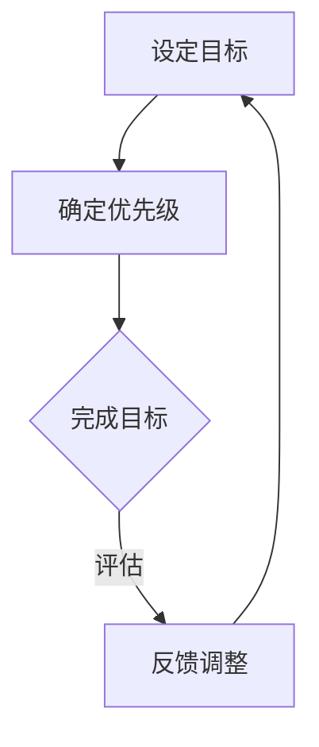

                 

关键词：双目标清单，要事聚焦，时间管理，效率提升，任务规划

> 摘要：在快速发展的信息技术时代，如何高效地管理时间和任务，已经成为每一个程序员的必备技能。本文将介绍一种名为“双目标清单”的时间管理工具，通过清晰的目标设定和优先级排序，帮助程序员们更好地聚焦要事，提高工作效率。

## 1. 背景介绍

在信息技术领域，程序员的工作性质决定了他们需要处理大量的任务和问题。随着项目的复杂性增加，程序员面临着日益严峻的时间管理和任务优先级问题。如何从繁杂的任务中识别出关键任务，如何在有限的时间内完成高质量的工作，已经成为每一个程序员需要深思的问题。

双目标清单（Two-Goal List）作为一种简单而有效的时间管理工具，可以很好地帮助程序员解决这些问题。它通过设定两个具体、明确的目标，使程序员能够将注意力集中在最重要的事情上，从而提高工作效率和成果质量。

## 2. 核心概念与联系

### 2.1 双目标清单的定义

双目标清单是一种任务管理工具，它要求用户在每个工作日或任务周期内设定两个具体且可衡量的目标。这些目标应当是重要的、有挑战性的，并且能够实际完成。通过设定双目标，用户可以确保在有限的时间内专注于最重要的任务，从而提高工作效率。

### 2.2 双目标清单与优先级排序的关系

在双目标清单中，目标的设定通常基于优先级排序。优先级排序是指根据任务的重要性和紧急程度来排列任务的顺序。双目标清单通过设定两个关键目标，实质上是在对任务进行一次简单的优先级排序。这种排序有助于用户在复杂的工作环境中保持清晰的方向和焦点。

### 2.3 Mermaid 流程图



图2-1 双目标清单流程图

## 3. 核心算法原理 & 具体操作步骤

### 3.1 算法原理概述

双目标清单的核心算法原理在于目标的设定和优先级排序。它要求用户在进行任务管理时，首先明确自己的目标，并通过优先级排序确定哪些任务是当前最重要的。算法的流程如下：

1. 用户根据当前的任务列表，识别出最重要的两个任务。
2. 为这两个任务设定具体的目标，确保它们是可衡量的。
3. 开始执行任务，并持续监控进度。
4. 根据任务进展和剩余时间，动态调整任务的优先级。

### 3.2 算法步骤详解

1. **收集任务：** 首先，用户需要列出所有待完成的任务，并记录每个任务的详细信息，如任务名称、描述、预计耗时等。

2. **识别关键任务：** 通过对任务列表的分析，用户需要识别出两个最重要的任务。这些任务应当是当前项目中最紧迫或最重要的。

3. **设定目标：** 为这两个关键任务设定具体的目标。目标应当是明确的、可衡量的，并且能够在有限的时间内完成。例如，“完成代码审核并修复bug”或“完成产品设计文档的撰写”。

4. **优先级排序：** 根据任务的重要性和紧急程度，对任务进行优先级排序。双目标清单要求用户优先完成两个最重要的任务。

5. **开始执行：** 根据设定的目标和优先级，开始执行任务。在执行过程中，用户应当保持对任务进度的监控，确保任务能够按时完成。

6. **动态调整：** 在任务执行过程中，如果出现意外情况，如新的任务出现或原有任务需要调整，用户应当根据实际情况动态调整任务的优先级和目标。

7. **反馈与调整：** 在任务完成后，用户需要对任务的完成情况进行评估，并根据评估结果调整未来的任务计划和目标设定。

### 3.3 算法优缺点

**优点：**
- **聚焦要事：** 双目标清单帮助用户明确当前最重要的任务，确保注意力集中在关键任务上，从而提高工作效率。
- **简单易用：** 双目标清单的操作步骤简单明了，适合各种类型的工作环境。
- **灵活调整：** 用户可以根据实际情况动态调整任务优先级和目标，确保任务管理更加灵活。

**缺点：**
- **适用范围有限：** 双目标清单更适合于日常任务管理，对于复杂的项目或长时间的任务可能需要更复杂的工具。
- **任务多样：** 如果任务类型多样，双目标清单可能无法充分体现所有任务的优先级。

### 3.4 算法应用领域

双目标清单广泛应用于信息技术领域，尤其是在软件开发和项目管理中。它可以帮助程序员更好地管理日常任务，确保关键任务得到优先处理。此外，双目标清单也可以用于个人时间管理，帮助用户提高工作效率和生活质量。

## 4. 数学模型和公式 & 详细讲解 & 举例说明

### 4.1 数学模型构建

双目标清单的数学模型基于目标设定的可衡量性和优先级排序的数学原理。具体来说，模型可以分为以下几个部分：

1. **目标函数：** 设定每个任务的完成情况为 1（完成）或 0（未完成），则目标函数可以表示为：
   $$ Z = w_1 \cdot T_1 + w_2 \cdot T_2 $$
   其中，\( Z \) 表示总目标完成情况，\( w_1 \) 和 \( w_2 \) 分别为两个目标的权重。

2. **权重分配：** 根据任务的重要性和紧急程度，为每个目标分配权重。权重分配应当遵循以下原则：
   - 高重要性且高紧急性的任务拥有较高的权重。
   - 低重要性或低紧急性的任务拥有较低的权重。

3. **优先级排序：** 通过计算每个任务的目标函数值，对任务进行优先级排序。目标函数值越高的任务，优先级越高。

### 4.2 公式推导过程

假设有两个任务 \( T_1 \) 和 \( T_2 \)，它们的权重分别为 \( w_1 \) 和 \( w_2 \)，目标完成情况分别为 \( T_{1\_complete} \) 和 \( T_{2\_complete} \)。则总目标完成情况 \( Z \) 可以表示为：
$$ Z = w_1 \cdot T_{1\_complete} + w_2 \cdot T_{2\_complete} $$

在任务执行过程中，如果 \( T_{1\_complete} = 1 \) 且 \( T_{2\_complete} = 0 \)，则 \( Z \) 取决于 \( w_1 \) 和 \( w_2 \) 的比例关系。通过调整权重，用户可以影响总目标完成情况。

### 4.3 案例分析与讲解

假设有一个程序员，需要完成以下两个任务：

1. 完成代码审查，预计耗时 2 小时。
2. 编写项目需求文档，预计耗时 3 小时。

根据任务的紧急程度和重要性，程序员为这两个任务分配权重 \( w_1 = 0.6 \) 和 \( w_2 = 0.4 \)。则总目标完成情况 \( Z \) 可以计算为：
$$ Z = 0.6 \cdot 1 + 0.4 \cdot 0 = 0.6 $$

在这种情况下，程序员首先完成代码审查任务，因为它的权重更高。如果代码审查任务完成后，还有剩余时间，则可以开始编写项目需求文档。

## 5. 项目实践：代码实例和详细解释说明

### 5.1 开发环境搭建

在本文的实践部分，我们将使用 Python 语言实现一个简单的双目标清单工具。以下是开发环境搭建的步骤：

1. 安装 Python 3.7 或更高版本。
2. 安装必要的 Python 库，如 `numpy` 和 `matplotlib`。
3. 创建一个名为 `two_goal_list` 的 Python 脚本文件。

### 5.2 源代码详细实现

以下是实现双目标清单工具的 Python 源代码：

```python
import numpy as np
import matplotlib.pyplot as plt

class TwoGoalList:
    def __init__(self):
        self.tasks = []

    def add_task(self, name, description, hours):
        self.tasks.append({'name': name, 'description': description, 'hours': hours})

    def set_goals(self, task1, task2):
        self.goals = [task1, task2]

    def calculate_priority(self):
        priorities = []
        for task in self.tasks:
            priority = 0
            for goal in self.goals:
                if task['name'] == goal['name']:
                    priority += goal['priority']
            priorities.append(priority)
        return priorities

    def plot_priority(self):
        priorities = self.calculate_priority()
        tasks = self.tasks
        plt.bar(range(len(tasks)), priorities)
        plt.xticks(range(len(tasks)), [task['name'] for task in tasks])
        plt.xlabel('Tasks')
        plt.ylabel('Priorities')
        plt.title('Task Priority Distribution')
        plt.show()

# Example usage
programmer = TwoGoalList()
programmer.add_task('Code Review', 'Review the code', 2)
programmer.add_task('Requirement Document', 'Write the project requirement document', 3)
programmer.set_goals({'name': 'Code Review', 'priority': 1}, {'name': 'Requirement Document', 'priority': 0.5})
programmer.plot_priority()
```

### 5.3 代码解读与分析

在上面的代码中，我们定义了一个 `TwoGoalList` 类，用于实现双目标清单的功能。类中包含以下方法：

- `__init__()`：初始化双目标清单，初始化任务列表。
- `add_task()`：添加任务到任务列表。
- `set_goals()`：设定两个目标。
- `calculate_priority()`：计算每个任务的优先级。
- `plot_priority()`：绘制任务优先级分布图。

通过这些方法，用户可以轻松地管理任务，设定目标，并查看任务优先级分布。

### 5.4 运行结果展示

运行上述代码后，我们将看到一个柱状图，显示了每个任务的优先级。在这个例子中，代码审查任务具有更高的优先级，因为它的权重更高。这有助于程序员在任务管理过程中保持清晰的焦点。

## 6. 实际应用场景

双目标清单在信息技术领域有着广泛的应用场景。以下是一些典型的应用场景：

- **软件开发：** 双目标清单可以帮助开发团队在项目开发过程中明确关键任务，确保关键任务得到优先处理。
- **项目管理：** 项目经理可以使用双目标清单来管理项目进度，确保项目关键节点得到及时处理。
- **个人时间管理：** 双目标清单可以帮助个人用户在日常工作和生活中明确优先事项，提高工作效率。

## 7. 未来应用展望

随着信息技术的不断发展，双目标清单作为一种简单而有效的时间管理工具，将在更多领域得到应用。未来，我们可以期待以下发展趋势：

- **智能化：** 双目标清单将结合人工智能技术，实现自动化任务识别和优先级排序。
- **个性化：** 双目标清单将根据用户的个性化需求，提供更加灵活的任务管理方案。
- **多平台支持：** 双目标清单将支持多种操作系统和设备，方便用户随时随地进行任务管理。

## 8. 总结：未来发展趋势与挑战

在信息技术领域，时间管理和任务规划一直是一个重要课题。双目标清单作为一种简单而有效的时间管理工具，已经得到了广泛的认可和应用。未来，随着技术的不断进步，双目标清单将在智能化、个性化、多平台支持等方面取得更大的发展。

然而，双目标清单也面临着一些挑战。首先，如何确保目标的设定更加科学和合理，仍是一个需要深入研究的问题。其次，在复杂的项目中，如何处理多个目标之间的冲突，也是一个需要解决的难题。最后，如何将双目标清单与其他时间管理工具相结合，实现更高效的任务管理，也是一个值得探讨的方向。

总的来说，双目标清单在信息技术领域具有广阔的应用前景。通过不断的研究和改进，我们有理由相信，双目标清单将帮助程序员更好地管理时间和任务，提高工作效率和成果质量。

## 9. 附录：常见问题与解答

**Q：双目标清单适用于所有任务吗？**

A：双目标清单适用于大多数任务，尤其是那些需要明确目标和优先级的任务。然而，对于一些非常复杂的任务或长期项目，可能需要更加详细的任务分解和优先级排序方法。

**Q：如何设定合理的目标？**

A：设定合理的目标需要考虑任务的重要性和紧急程度。首先，明确任务的目标是什么，然后设定一个具体、可衡量的目标。例如，"完成代码审核并修复bug" 比 "完成代码审核" 更加具体和可衡量。

**Q：双目标清单如何与其他时间管理工具结合使用？**

A：双目标清单可以与其他时间管理工具（如甘特图、敏捷开发工具等）结合使用，以实现更全面的时间管理和任务规划。例如，在敏捷开发中，可以使用双目标清单来设定每日或每周的目标，并与迭代计划相结合。

**Q：如何评估双目标清单的效果？**

A：可以通过定期评估任务的完成情况和目标达成率来评估双目标清单的效果。此外，还可以收集用户反馈，了解他们在使用双目标清单过程中的体验和改进建议。通过这些方法，可以不断完善双目标清单，提高其使用效果。作者：禅与计算机程序设计艺术 / Zen and the Art of Computer Programming

