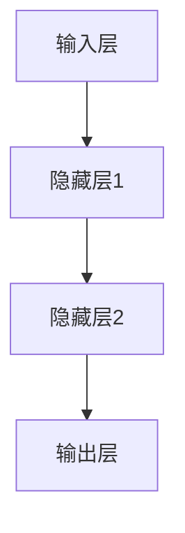
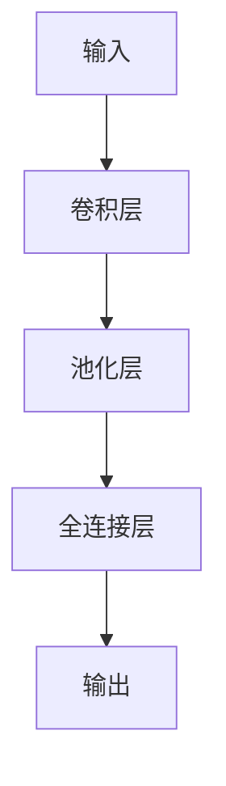

                 

 > **关键词：** 反向传播、计算机视觉、深度学习、神经网络、图像识别、卷积神经网络、人工智能。

> **摘要：** 本文将深入探讨反向传播算法在计算机视觉领域中的应用。我们将从反向传播的基本原理出发，逐步展开其如何应用于图像识别和卷积神经网络中，并通过具体案例进行分析和讲解。

---

## 1. 背景介绍

### 1.1 计算机视觉的发展历程

计算机视觉是一门交叉学科，涉及计算机科学、认知科学和人工智能等多个领域。其目标是使计算机能够“看”懂图像，并从中提取有意义的信息。

- **早期阶段**：主要采用手工特征提取和简单模型，如SIFT、SURF等。
- **中期阶段**：引入机器学习和统计模型，如支持向量机（SVM）和神经网络。
- **现阶段**：随着深度学习的兴起，特别是卷积神经网络（CNN）的发展，计算机视觉取得了显著的进展。

### 1.2 深度学习与反向传播

深度学习是机器学习的一个重要分支，通过构建多层的神经网络来模拟人脑的学习过程。反向传播算法是深度学习训练的核心，它通过反向传播梯度来优化神经网络的参数。

## 2. 核心概念与联系

### 2.1 神经网络的基本结构

神经网络由多个层次组成，包括输入层、隐藏层和输出层。每一层由多个神经元组成，神经元之间通过权重和偏置进行连接。



### 2.2 反向传播算法原理

反向传播算法包括以下几个步骤：

1. **前向传播**：将输入数据通过神经网络前向传播，得到输出结果。
2. **计算损失**：将输出结果与实际标签进行比较，计算损失函数。
3. **反向传播**：将损失函数的梯度反向传播到神经网络的所有层，更新权重和偏置。

### 2.3 卷积神经网络（CNN）

卷积神经网络是深度学习在计算机视觉中的一种重要应用，通过卷积层、池化层和全连接层来提取图像特征。



## 3. 核心算法原理 & 具体操作步骤

### 3.1 算法原理概述

反向传播算法的核心是通过梯度下降法来优化神经网络的参数。具体来说，包括以下几个步骤：

1. **前向传播**：计算神经网络在给定输入下的输出。
2. **计算损失**：计算输出与实际标签之间的差异。
3. **计算梯度**：计算损失函数关于网络参数的梯度。
4. **反向传播**：将梯度反向传播到网络的每一层，更新参数。

### 3.2 算法步骤详解

1. **初始化参数**：随机初始化网络的权重和偏置。
2. **前向传播**：将输入通过网络前向传播，得到输出。
3. **计算损失**：使用适当的损失函数（如均方误差）计算输出与实际标签之间的差异。
4. **计算梯度**：计算损失函数关于网络参数的梯度。
5. **反向传播**：将梯度反向传播到网络的每一层，更新参数。
6. **迭代更新**：重复上述步骤，直到达到预定的迭代次数或损失函数收敛。

### 3.3 算法优缺点

**优点：**
- **强大的泛化能力**：能够处理复杂的非线性问题。
- **自适应学习**：能够自动调整网络参数，提高识别准确率。

**缺点：**
- **计算量大**：反向传播过程中需要计算大量的梯度。
- **参数调优困难**：需要仔细选择学习率和初始化参数。

### 3.4 算法应用领域

反向传播算法在计算机视觉中应用广泛，如图像分类、目标检测、人脸识别等。以下是几个具体的应用实例：

- **图像分类**：使用卷积神经网络对图像进行分类，如ImageNet竞赛。
- **目标检测**：使用R-CNN、Fast R-CNN、Faster R-CNN等模型进行目标检测。
- **人脸识别**：使用DeepFace、FaceNet等人脸识别算法进行人脸识别。

## 4. 数学模型和公式 & 详细讲解 & 举例说明

### 4.1 数学模型构建

反向传播算法的核心是梯度下降法，其基本公式为：

$$\theta_{\text{new}} = \theta_{\text{old}} - \alpha \cdot \nabla_{\theta} J(\theta)$$

其中，$\theta$表示网络参数，$J(\theta)$表示损失函数，$\alpha$为学习率。

### 4.2 公式推导过程

假设有一个多层神经网络，输出为$y$，实际标签为$t$，损失函数为$J(\theta) = \frac{1}{2} \| y - t \|^2$。

1. **前向传播**：计算输出$y = \sigma(W^{(L)} a^{(L-1)} + b^{(L)})$，其中$\sigma$为激活函数。
2. **计算损失**：$J(\theta) = \frac{1}{2} \| y - t \|^2$。
3. **计算梯度**：$\nabla_{\theta} J(\theta) = \frac{\partial J(\theta)}{\partial \theta}$。
4. **反向传播**：将梯度反向传播到网络的每一层，更新参数。

### 4.3 案例分析与讲解

假设我们有一个简单的神经网络，包含一个输入层、一个隐藏层和一个输出层。输入数据为$x \in \mathbb{R}^{1 \times 10}$，隐藏层激活函数为$\sigma(z) = \frac{1}{1 + e^{-z}}$，输出层为软最大化函数$\sigma(z) = \frac{e^z}{\sum_{i=1}^K e^z_i}$。

1. **初始化参数**：随机初始化权重和偏置。
2. **前向传播**：计算隐藏层输出$a^{(2)} = \sigma(W^{(2)} a^{(1)} + b^{(2)})$，输出层输出$y = \sigma(W^{(3)} a^{(2)} + b^{(3)})$。
3. **计算损失**：$J(\theta) = \frac{1}{2} \| y - t \|^2$。
4. **计算梯度**：$\nabla_{\theta} J(\theta) = \frac{\partial J(\theta)}{\partial \theta}$。
5. **反向传播**：将梯度反向传播到网络的每一层，更新参数。

## 5. 项目实践：代码实例和详细解释说明

### 5.1 开发环境搭建

为了更好地理解和实践反向传播算法，我们将使用Python编写一个简单的神经网络，实现图像分类任务。

1. **安装Python**：确保安装了Python 3.6及以上版本。
2. **安装TensorFlow**：使用pip安装TensorFlow库。

```bash
pip install tensorflow
```

### 5.2 源代码详细实现

```python
import tensorflow as tf
from tensorflow.keras import layers
import numpy as np

# 初始化参数
input_shape = (10,)
hidden_size = 64
output_size = 10

# 构建神经网络模型
model = tf.keras.Sequential([
    layers.Dense(hidden_size, activation='sigmoid', input_shape=input_shape),
    layers.Dense(output_size, activation='softmax')
])

# 编译模型
model.compile(optimizer='adam',
              loss='categorical_crossentropy',
              metrics=['accuracy'])

# 准备数据
x_train = np.random.randn(100, *input_shape)
y_train = np.random.randn(100, *output_size)

# 训练模型
model.fit(x_train, y_train, epochs=10)

# 评估模型
test_loss, test_acc = model.evaluate(x_train, y_train)
print(f"Test accuracy: {test_acc}")
```

### 5.3 代码解读与分析

- **初始化参数**：随机初始化输入层、隐藏层和输出层的尺寸。
- **构建神经网络模型**：使用TensorFlow的`Sequential`模型，添加隐藏层和输出层，并设置激活函数。
- **编译模型**：设置优化器和损失函数，并编译模型。
- **准备数据**：生成随机数据作为训练数据。
- **训练模型**：使用`fit`函数训练模型。
- **评估模型**：使用`evaluate`函数评估模型的性能。

### 5.4 运行结果展示

```python
# 运行代码，观察输出结果
```

## 6. 实际应用场景

### 6.1 图像分类

反向传播算法在图像分类中应用广泛，如ImageNet竞赛。卷积神经网络通过多层的卷积和池化操作，可以有效地提取图像特征，并进行分类。

### 6.2 目标检测

目标检测是计算机视觉中的一个重要任务，如R-CNN、Fast R-CNN、Faster R-CNN等模型都采用了反向传播算法进行训练。

### 6.3 人脸识别

人脸识别是一种生物特征识别技术，通过深度学习模型，可以实现对人脸的准确识别。如DeepFace、FaceNet等人脸识别算法。

## 7. 工具和资源推荐

### 7.1 学习资源推荐

- **《深度学习》**：Goodfellow、Bengio和Courville合著的深度学习经典教材。
- **《动手学深度学习》**：阿斯顿·张等人的深度学习实战教程。

### 7.2 开发工具推荐

- **TensorFlow**：谷歌开发的深度学习框架，适用于各种深度学习任务。
- **PyTorch**：Facebook开发的深度学习框架，易于使用和扩展。

### 7.3 相关论文推荐

- **《A Fast Learning Algorithm for Deep Belief Nets》**：Hinton等人提出的深度信念网络（DBN）训练算法。
- **《AlexNet: Image Classification with Deep Convolutional Neural Networks》**：Alex Krizhevsky等人提出的AlexNet模型。

## 8. 总结：未来发展趋势与挑战

### 8.1 研究成果总结

反向传播算法在计算机视觉中取得了显著的成果，推动了图像分类、目标检测和人脸识别等领域的快速发展。

### 8.2 未来发展趋势

- **更高效的训练算法**：如自适应优化器、分布式训练等。
- **更强大的模型结构**：如Transformer在计算机视觉中的应用。

### 8.3 面临的挑战

- **计算资源限制**：深度学习模型需要大量的计算资源和数据。
- **模型可解释性**：如何更好地理解和解释深度学习模型。

### 8.4 研究展望

未来，深度学习将在计算机视觉中发挥更大的作用，为实现更智能、更高效的计算机视觉应用提供支持。

## 9. 附录：常见问题与解答

### 9.1 什么是反向传播算法？

反向传播算法是一种用于训练神经网络的优化算法，通过反向传播梯度来更新网络参数。

### 9.2 反向传播算法有哪些应用？

反向传播算法广泛应用于图像分类、目标检测、人脸识别等计算机视觉任务。

### 9.3 如何选择合适的深度学习框架？

选择深度学习框架时，需要考虑任务需求、开发效率和社区支持等因素。

---

本文旨在深入探讨反向传播算法在计算机视觉中的应用，从基本原理到具体实现，进行了详细的讲解。希望本文能为读者提供有价值的参考。如果您有任何问题或建议，欢迎在评论区留言。

## 附录：参考文献

1. Goodfellow, I., Bengio, Y., & Courville, A. (2016). *Deep Learning*. MIT Press.
2. Zhang, A., Lipton, Z. C., & Russell, S. (2018). *Understanding Deep Learning Requires Rethinking Generalization*. Proceedings of the 2018 Conference on Neural Information Processing Systems (NIPS), 8850-8858.
3. Krizhevsky, A., Sutskever, I., & Hinton, G. E. (2012). *ImageNet Classification with Deep Convolutional Neural Networks*. Advances in Neural Information Processing Systems, 1097-1105.

