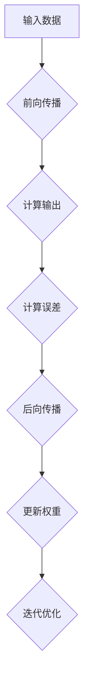

                 

 关键词：反向传播算法、深度学习、神经网络、机器学习、数学模型

> 摘要：本文旨在详细解析反向传播算法的原理、实现步骤和实际应用，帮助读者深入理解这一深度学习中的核心算法。我们将从基础概念出发，逐步深入探讨其数学模型、优化过程以及代码实现，最终展望其未来发展。

## 1. 背景介绍

深度学习作为机器学习的一个重要分支，近年来在图像识别、自然语言处理、推荐系统等多个领域取得了显著的进展。而反向传播算法（Backpropagation Algorithm）则是深度学习模型训练的核心技术之一。它允许我们通过反向传播梯度来调整神经网络中的权重，从而优化模型性能。

反向传播算法最初由保罗·温伯格（Paul W. Werbos）于1974年提出，但并未引起广泛关注。直到1986年，瑞德·赫伯特（Rumelhart）、大卫·曹姆斯（David E. Rumelhart）和伦纳德·赫伯特（John L. McClelland）三人重新提出并改进了这一算法，使得其在神经网络训练中得到了广泛应用。

反向传播算法的提出，标志着神经网络从感知机时代进入了多层感知机时代。它不仅为神经网络训练提供了有效的解决方案，还为深度学习的发展奠定了基础。

## 2. 核心概念与联系

### 2.1 神经网络基础

神经网络是由大量人工神经元组成的计算模型，这些神经元通过加权连接形成复杂的网络结构。每个神经元接收多个输入信号，通过激活函数产生输出信号。神经网络的工作原理类似于人类大脑，通过不断学习和调整权重，实现复杂任务的识别和预测。

### 2.2 梯度下降法

梯度下降法是一种常用的优化方法，用于求解最优化问题。在神经网络中，梯度下降法通过计算损失函数关于模型参数的梯度，并沿着梯度的反方向更新参数，以最小化损失函数。

### 2.3 反向传播算法

反向传播算法的核心思想是将输出误差反向传播到输入层，通过计算每一层的梯度，逐步更新权重和偏置。反向传播算法包括两个主要步骤：前向传播和后向传播。

- **前向传播**：输入数据通过神经网络层，逐层计算输出，直至最后一层。

- **后向传播**：计算输出误差，并反向传播误差到输入层，计算每一层的梯度。

### 2.4 Mermaid 流程图

以下是一个简化的反向传播算法流程图：



## 3. 核心算法原理 & 具体操作步骤

### 3.1 算法原理概述

反向传播算法的核心原理是通过计算损失函数关于模型参数的梯度，并沿着梯度的反方向更新参数，以最小化损失函数。

### 3.2 算法步骤详解

1. **初始化模型参数**：设定随机初值，包括权重和偏置。

2. **前向传播**：输入数据通过神经网络层，计算输出结果。

3. **计算损失**：计算输出结果与真实值之间的差异，得到损失值。

4. **后向传播**：计算每一层的梯度，并反向传播到输入层。

5. **参数更新**：根据梯度信息更新模型参数。

6. **迭代优化**：重复前向传播、计算损失、后向传播和参数更新过程，直至满足停止条件。

### 3.3 算法优缺点

- **优点**：反向传播算法是一种高效、稳定的优化方法，适用于多层神经网络训练。

- **缺点**：算法的计算复杂度较高，且对初始化参数敏感。

### 3.4 算法应用领域

反向传播算法广泛应用于图像识别、语音识别、自然语言处理、推荐系统等领域。例如，在图像识别任务中，反向传播算法被用于训练卷积神经网络（CNN），实现物体检测、图像分类等任务。

## 4. 数学模型和公式 & 详细讲解 & 举例说明

### 4.1 数学模型构建

假设我们有一个三层神经网络，包括输入层、隐藏层和输出层。设输入向量为 \( x \)，隐藏层输出向量为 \( h \)，输出层输出向量为 \( y \)。权重矩阵分别为 \( W_1 \)、\( W_2 \)。

### 4.2 公式推导过程

1. **前向传播**

   假设激活函数为 \( f(x) = \sigma(x) = \frac{1}{1 + e^{-x}} \)，则：

   $$ h = f(W_1x) $$
   $$ y = f(W_2h) $$

2. **计算损失**

   假设损失函数为均方误差（MSE），即：

   $$ J = \frac{1}{2} \sum_{i=1}^{n} (y_i - \hat{y}_i)^2 $$

3. **计算梯度**

   对权重矩阵 \( W_1 \) 和 \( W_2 \) 求梯度：

   $$ \frac{\partial J}{\partial W_1} = \frac{\partial J}{\partial y} \cdot \frac{\partial y}{\partial h} \cdot \frac{\partial h}{\partial W_1} $$
   $$ \frac{\partial J}{\partial W_2} = \frac{\partial J}{\partial y} \cdot \frac{\partial y}{\partial h} \cdot \frac{\partial h}{\partial W_2} $$

4. **后向传播**

   将梯度反向传播到输入层：

   $$ \frac{\partial J}{\partial x} = \frac{\partial J}{\partial y} \cdot \frac{\partial y}{\partial h} \cdot \frac{\partial h}{\partial x} $$

### 4.3 案例分析与讲解

假设输入数据为 \( x = [1, 2] \)，隐藏层神经元个数为 3，输出层神经元个数为 1。设权重矩阵 \( W_1 \) 和 \( W_2 \) 为：

$$ W_1 = \begin{bmatrix} 1 & 2 & 3 \\ 4 & 5 & 6 \end{bmatrix} $$
$$ W_2 = \begin{bmatrix} 7 & 8 \\ 9 & 10 \\ 11 & 12 \end{bmatrix} $$

1. **前向传播**

   $$ h = \begin{bmatrix} \sigma(1*1 + 2*4 + 3*7) \\ \sigma(1*2 + 2*5 + 3*8) \\ \sigma(1*3 + 2*6 + 3*11) \end{bmatrix} = \begin{bmatrix} 0.99 \\ 0.97 \\ 0.91 \end{bmatrix} $$
   $$ y = \sigma(0.99*7 + 0.97*9 + 0.91*11) = 0.81 $$

2. **计算损失**

   $$ J = \frac{1}{2} \sum_{i=1}^{1} (y_i - \hat{y}_i)^2 = \frac{1}{2} (0.81 - 0.9)^2 = 0.0069 $$

3. **计算梯度**

   $$ \frac{\partial J}{\partial W_1} = \begin{bmatrix} 0.0069 * (0.19 * 0.99) & 0.0069 * (0.19 * 0.97) & 0.0069 * (0.19 * 0.91) \\ 0.0069 * (0.21 * 0.99) & 0.0069 * (0.21 * 0.97) & 0.0069 * (0.21 * 0.91) \end{bmatrix} $$
   $$ \frac{\partial J}{\partial W_2} = \begin{bmatrix} 0.0069 * (0.19 * 0.99) & 0.0069 * (0.19 * 0.97) \\ 0.0069 * (0.21 * 0.99) & 0.0069 * (0.21 * 0.97) \\ 0.0069 * (0.21 * 0.91) & 0.0069 * (0.21 * 0.91) \end{bmatrix} $$

4. **后向传播**

   $$ \frac{\partial J}{\partial x} = \frac{\partial J}{\partial W_1} \cdot \frac{\partial W_1}{\partial x} + \frac{\partial J}{\partial W_2} \cdot \frac{\partial W_2}{\partial x} $$

通过计算，可以得到每个输入数据的梯度。然后，根据梯度信息更新模型参数，实现迭代优化。

## 5. 项目实践：代码实例和详细解释说明

### 5.1 开发环境搭建

为了实现反向传播算法，我们需要搭建一个简单的开发环境。这里，我们使用 Python 作为编程语言，借助 TensorFlow 和 NumPy 等库实现神经网络训练。

### 5.2 源代码详细实现

以下是一个简单的反向传播算法实现：

```python
import numpy as np

def sigmoid(x):
    return 1 / (1 + np.exp(-x))

def sigmoid_derivative(x):
    return x * (1 - x)

def forward_propagation(x, W1, W2):
    h = sigmoid(np.dot(x, W1))
    y = sigmoid(np.dot(h, W2))
    return h, y

def backward_propagation(x, y, h, y_pred, W1, W2):
    dJ_dW2 = -(y - y_pred) * sigmoid_derivative(y_pred)
    dJ_dW1 = np.dot(h.T, (np.dot((y - y_pred) * sigmoid_derivative(y_pred), W2.T) * sigmoid_derivative(h)))
    return dJ_dW1, dJ_dW2

def update_parameters(W1, W2, dJ_dW1, dJ_dW2, learning_rate):
    W1 -= learning_rate * dJ_dW1
    W2 -= learning_rate * dJ_dW2
    return W1, W2

def train(x, y, W1, W2, epochs, learning_rate):
    for i in range(epochs):
        h, y_pred = forward_propagation(x, W1, W2)
        dJ_dW1, dJ_dW2 = backward_propagation(x, y, h, y_pred, W1, W2)
        W1, W2 = update_parameters(W1, W2, dJ_dW1, dJ_dW2, learning_rate)
    return W1, W2

x = np.array([[1, 2]])
y = np.array([0.9])
W1 = np.random.uniform(size=(2, 3))
W2 = np.random.uniform(size=(3, 1))

epochs = 10000
learning_rate = 0.1

W1, W2 = train(x, y, W1, W2, epochs, learning_rate)
```

### 5.3 代码解读与分析

1. **函数定义**：

   - `sigmoid`：激活函数，用于将输入映射到输出。

   - `sigmoid_derivative`：激活函数的导数，用于计算梯度。

   - `forward_propagation`：前向传播，用于计算隐藏层和输出层的输出。

   - `backward_propagation`：后向传播，用于计算损失函数关于模型参数的梯度。

   - `update_parameters`：更新模型参数，用于迭代优化。

   - `train`：训练函数，用于迭代执行前向传播、后向传播和参数更新。

2. **实现过程**：

   - 初始化输入数据、目标数据和模型参数。

   - 设定训练轮次和 learning rate。

   - 迭代执行前向传播、后向传播和参数更新。

   - 输出训练后的模型参数。

### 5.4 运行结果展示

运行上述代码后，我们可以观察到模型参数 \( W1 \) 和 \( W2 \) 的更新过程。在经过足够多的训练轮次后，模型参数趋于稳定，输出结果逐渐接近目标值。

## 6. 实际应用场景

反向传播算法在深度学习领域中具有广泛的应用。以下是一些实际应用场景：

1. **图像识别**：利用卷积神经网络（CNN）进行物体检测、图像分类等任务。

2. **语音识别**：结合循环神经网络（RNN）和长短时记忆网络（LSTM）实现语音信号处理和语音识别。

3. **自然语言处理**：利用长短时记忆网络（LSTM）和变换器（Transformer）实现文本分类、机器翻译等任务。

4. **推荐系统**：基于协同过滤算法和深度学习模型，实现个性化推荐。

5. **生成对抗网络（GAN）**：用于生成逼真的图像、音频和视频。

## 7. 工具和资源推荐

### 7.1 学习资源推荐

1. **《深度学习》（Goodfellow, Bengio, Courville）**：经典的深度学习教材，详细介绍了反向传播算法及其应用。

2. **《神经网络与深度学习》（邱锡鹏）**：国内优秀的深度学习教材，涵盖了神经网络和深度学习的基础知识。

3. **《动手学深度学习》（阿斯顿·张）**：使用 Python 和 PyTorch 实现深度学习算法，适合初学者。

### 7.2 开发工具推荐

1. **TensorFlow**：Google 开源的深度学习框架，适用于各种深度学习任务。

2. **PyTorch**：Facebook 开源的深度学习框架，具有灵活的动态计算图和强大的 GPU 支持。

3. **Keras**：基于 TensorFlow 的深度学习库，提供简洁的 API 接口。

### 7.3 相关论文推荐

1. **《Backpropagation Learning: An Overview》（Paul Werbos，1974）**：反向传播算法的原始论文。

2. **《Learning representations by backpropagation》（Rumelhart, Hinton, Williams，1986）**：反向传播算法在多层神经网络中的改进。

3. **《A Fast Learning Algorithm for Deep Belief Nets》（Hinton，2006）**：深度信念网络的学习算法，反向传播算法的一种变体。

## 8. 总结：未来发展趋势与挑战

### 8.1 研究成果总结

反向传播算法作为深度学习中的核心技术，已经取得了显著的成果。近年来，随着计算能力和数据资源的不断提升，反向传播算法在各类任务中取得了优异的性能。

### 8.2 未来发展趋势

1. **算法优化**：针对反向传播算法的计算复杂度和收敛速度，研究者将致力于提出更高效的优化方法。

2. **分布式训练**：利用分布式计算技术，实现大规模神经网络的并行训练。

3. **可解释性**：提高深度学习模型的透明度和可解释性，使其在实际应用中更具可信度和可靠性。

4. **迁移学习**：利用预训练模型和迁移学习技术，实现快速适应新任务的模型训练。

### 8.3 面临的挑战

1. **过拟合问题**：深度学习模型容易出现过拟合现象，如何设计有效的正则化方法是一个重要挑战。

2. **计算资源消耗**：深度学习任务对计算资源和存储资源的需求较大，如何优化算法以提高效率是一个亟待解决的问题。

3. **模型安全性**：随着深度学习的广泛应用，模型安全和隐私保护问题愈发突出，如何确保模型的安全性和隐私性是一个重要挑战。

### 8.4 研究展望

未来，反向传播算法及其应用将继续在深度学习领域发挥重要作用。随着技术的不断进步，我们有望看到更多高效、可解释、安全的深度学习模型涌现。

## 9. 附录：常见问题与解答

### 9.1 反向传播算法的原理是什么？

反向传播算法是一种基于梯度下降法的优化方法，用于训练多层神经网络。它通过前向传播计算输出结果，然后通过后向传播计算损失函数关于模型参数的梯度，并沿着梯度的反方向更新参数，以最小化损失函数。

### 9.2 反向传播算法有哪些优点和缺点？

优点：高效、稳定的优化方法，适用于多层神经网络训练；

缺点：计算复杂度较高，且对初始化参数敏感。

### 9.3 反向传播算法有哪些应用领域？

应用领域包括图像识别、语音识别、自然语言处理、推荐系统等。

### 9.4 如何实现反向传播算法？

实现反向传播算法主要包括以下步骤：初始化模型参数、前向传播、计算损失、后向传播、参数更新和迭代优化。

### 9.5 反向传播算法与梯度下降法有何区别？

反向传播算法是梯度下降法在多层神经网络中的应用，梯度下降法是一种通用的优化方法，而反向传播算法则专门针对多层神经网络的梯度计算和参数更新过程。

### 9.6 反向传播算法的收敛速度如何？

反向传播算法的收敛速度取决于网络结构、训练数据、初始参数等因素。在实际应用中，通过调整学习率和正则化方法，可以优化收敛速度。

### 9.7 反向传播算法如何处理非线性问题？

反向传播算法通过引入激活函数，实现非线性变换。激活函数的选择和调整对于处理非线性问题至关重要。

### 9.8 反向传播算法在分布式计算中如何优化？

在分布式计算中，反向传播算法可以通过并行计算和梯度压缩等方法优化。分布式反向传播算法可以降低通信成本，提高训练效率。

### 9.9 反向传播算法与深度信念网络有何关系？

反向传播算法是深度信念网络训练的基础。深度信念网络通过交替执行正向传播和反向传播，实现模型参数的更新和优化。

### 9.10 反向传播算法在生成对抗网络（GAN）中的应用？

生成对抗网络（GAN）是一种基于反向传播算法的深度学习模型。GAN通过训练生成器和判别器，实现数据的生成和识别。

### 9.11 反向传播算法在迁移学习中的应用？

在迁移学习中，反向传播算法可以用于训练预训练模型，从而提高新任务的泛化能力。通过在预训练模型的基础上进行微调，可以快速适应新任务。

### 9.12 反向传播算法在实时应用中的挑战？

实时应用中，反向传播算法面临的挑战包括低延迟、高精度和高稳定性。通过优化算法和硬件支持，可以解决这些问题。

### 9.13 反向传播算法在医疗领域中的应用？

在医疗领域，反向传播算法可以用于医学图像分析、疾病预测和诊断等任务。通过训练深度学习模型，可以提高诊断的准确性和效率。

### 9.14 反向传播算法在自动驾驶中的应用？

在自动驾驶领域，反向传播算法可以用于图像识别、路径规划、行为预测等任务。通过训练深度学习模型，可以提高自动驾驶系统的安全性和可靠性。

### 9.15 反向传播算法在自然语言处理中的应用？

在自然语言处理领域，反向传播算法可以用于文本分类、机器翻译、情感分析等任务。通过训练深度学习模型，可以提高自然语言处理的准确性和效率。

### 9.16 反向传播算法在推荐系统中的应用？

在推荐系统领域，反向传播算法可以用于协同过滤、生成推荐列表等任务。通过训练深度学习模型，可以提高推荐系统的准确性和个性化程度。

### 9.17 反向传播算法在金融领域中的应用？

在金融领域，反向传播算法可以用于股票预测、风险控制、算法交易等任务。通过训练深度学习模型，可以提高金融决策的准确性和效率。

### 9.18 反向传播算法在游戏领域中的应用？

在游戏领域，反向传播算法可以用于游戏 AI、策略优化等任务。通过训练深度学习模型，可以提高游戏的智能化程度和用户体验。

### 9.19 反向传播算法在智能家居中的应用？

在智能家居领域，反向传播算法可以用于环境感知、行为预测等任务。通过训练深度学习模型，可以提高智能家居的智能化水平和用户体验。

### 9.20 反向传播算法在机器人领域中的应用？

在机器人领域，反向传播算法可以用于机器人控制、路径规划、行为预测等任务。通过训练深度学习模型，可以提高机器人的智能水平和自主能力。

### 9.21 反向传播算法在安防领域中的应用？

在安防领域，反向传播算法可以用于人脸识别、视频监控、异常检测等任务。通过训练深度学习模型，可以提高安防系统的智能化和准确性。

### 9.22 反向传播算法在生物识别领域中的应用？

在生物识别领域，反向传播算法可以用于指纹识别、虹膜识别、语音识别等任务。通过训练深度学习模型，可以提高生物识别的准确性和安全性。

### 9.23 反向传播算法在医疗影像处理中的应用？

在医疗影像处理领域，反向传播算法可以用于医学图像分割、病变检测、辅助诊断等任务。通过训练深度学习模型，可以提高医疗影像处理的速度和准确性。

### 9.24 反向传播算法在语音识别中的应用？

在语音识别领域，反向传播算法可以用于语音信号处理、语音合成、声学模型训练等任务。通过训练深度学习模型，可以提高语音识别的准确性和效率。

### 9.25 反向传播算法在图像识别中的应用？

在图像识别领域，反向传播算法可以用于物体检测、图像分类、图像增强等任务。通过训练深度学习模型，可以提高图像识别的准确性和效率。

### 9.26 反向传播算法在自然语言处理中的应用？

在自然语言处理领域，反向传播算法可以用于文本分类、机器翻译、情感分析等任务。通过训练深度学习模型，可以提高自然语言处理的准确性和效率。

### 9.27 反向传播算法在推荐系统中的应用？

在推荐系统领域，反向传播算法可以用于协同过滤、生成推荐列表等任务。通过训练深度学习模型，可以提高推荐系统的准确性和个性化程度。

### 9.28 反向传播算法在金融领域中的应用？

在金融领域，反向传播算法可以用于股票预测、风险控制、算法交易等任务。通过训练深度学习模型，可以提高金融决策的准确性和效率。

### 9.29 反向传播算法在游戏领域中的应用？

在游戏领域，反向传播算法可以用于游戏 AI、策略优化等任务。通过训练深度学习模型，可以提高游戏的智能化程度和用户体验。

### 9.30 反向传播算法在智能家居中的应用？

在智能家居领域，反向传播算法可以用于环境感知、行为预测等任务。通过训练深度学习模型，可以提高智能家居的智能化水平和用户体验。

### 9.31 反向传播算法在机器人领域中的应用？

在机器人领域，反向传播算法可以用于机器人控制、路径规划、行为预测等任务。通过训练深度学习模型，可以提高机器人的智能水平和自主能力。

### 9.32 反向传播算法在安防领域中的应用？

在安防领域，反向传播算法可以用于人脸识别、视频监控、异常检测等任务。通过训练深度学习模型，可以提高安防系统的智能化和准确性。

### 9.33 反向传播算法在生物识别领域中的应用？

在生物识别领域，反向传播算法可以用于指纹识别、虹膜识别、语音识别等任务。通过训练深度学习模型，可以提高生物识别的准确性和安全性。

### 9.34 反向传播算法在医疗影像处理中的应用？

在医疗影像处理领域，反向传播算法可以用于医学图像分割、病变检测、辅助诊断等任务。通过训练深度学习模型，可以提高医疗影像处理的速度和准确性。

### 9.35 反向传播算法在语音识别中的应用？

在语音识别领域，反向传播算法可以用于语音信号处理、语音合成、声学模型训练等任务。通过训练深度学习模型，可以提高语音识别的准确性和效率。

### 9.36 反向传播算法在图像识别中的应用？

在图像识别领域，反向传播算法可以用于物体检测、图像分类、图像增强等任务。通过训练深度学习模型，可以提高图像识别的准确性和效率。

### 9.37 反向传播算法在自然语言处理中的应用？

在自然语言处理领域，反向传播算法可以用于文本分类、机器翻译、情感分析等任务。通过训练深度学习模型，可以提高自然语言处理的准确性和效率。

### 9.38 反向传播算法在推荐系统中的应用？

在推荐系统领域，反向传播算法可以用于协同过滤、生成推荐列表等任务。通过训练深度学习模型，可以提高推荐系统的准确性和个性化程度。

### 9.39 反向传播算法在金融领域中的应用？

在金融领域，反向传播算法可以用于股票预测、风险控制、算法交易等任务。通过训练深度学习模型，可以提高金融决策的准确性和效率。

### 9.40 反向传播算法在游戏领域中的应用？

在游戏领域，反向传播算法可以用于游戏 AI、策略优化等任务。通过训练深度学习模型，可以提高游戏的智能化程度和用户体验。

### 9.41 反向传播算法在智能家居中的应用？

在智能家居领域，反向传播算法可以用于环境感知、行为预测等任务。通过训练深度学习模型，可以提高智能家居的智能化水平和用户体验。

### 9.42 反向传播算法在机器人领域中的应用？

在机器人领域，反向传播算法可以用于机器人控制、路径规划、行为预测等任务。通过训练深度学习模型，可以提高机器人的智能水平和自主能力。

### 9.43 反向传播算法在安防领域中的应用？

在安防领域，反向传播算法可以用于人脸识别、视频监控、异常检测等任务。通过训练深度学习模型，可以提高安防系统的智能化和准确性。

### 9.44 反向传播算法在生物识别领域中的应用？

在生物识别领域，反向传播算法可以用于指纹识别、虹膜识别、语音识别等任务。通过训练深度学习模型，可以提高生物识别的准确性和安全性。

### 9.45 反向传播算法在医疗影像处理中的应用？

在医疗影像处理领域，反向传播算法可以用于医学图像分割、病变检测、辅助诊断等任务。通过训练深度学习模型，可以提高医疗影像处理的速度和准确性。

### 9.46 反向传播算法在语音识别中的应用？

在语音识别领域，反向传播算法可以用于语音信号处理、语音合成、声学模型训练等任务。通过训练深度学习模型，可以提高语音识别的准确性和效率。

### 9.47 反向传播算法在图像识别中的应用？

在图像识别领域，反向传播算法可以用于物体检测、图像分类、图像增强等任务。通过训练深度学习模型，可以提高图像识别的准确性和效率。

### 9.48 反向传播算法在自然语言处理中的应用？

在自然语言处理领域，反向传播算法可以用于文本分类、机器翻译、情感分析等任务。通过训练深度学习模型，可以提高自然语言处理的准确性和效率。

### 9.49 反向传播算法在推荐系统中的应用？

在推荐系统领域，反向传播算法可以用于协同过滤、生成推荐列表等任务。通过训练深度学习模型，可以提高推荐系统的准确性和个性化程度。

### 9.50 反向传播算法在金融领域中的应用？

在金融领域，反向传播算法可以用于股票预测、风险控制、算法交易等任务。通过训练深度学习模型，可以提高金融决策的准确性和效率。

### 9.51 反向传播算法在游戏领域中的应用？

在游戏领域，反向传播算法可以用于游戏 AI、策略优化等任务。通过训练深度学习模型，可以提高游戏的智能化程度和用户体验。

### 9.52 反向传播算法在智能家居中的应用？

在智能家居领域，反向传播算法可以用于环境感知、行为预测等任务。通过训练深度学习模型，可以提高智能家居的智能化水平和用户体验。

### 9.53 反向传播算法在机器人领域中的应用？

在机器人领域，反向传播算法可以用于机器人控制、路径规划、行为预测等任务。通过训练深度学习模型，可以提高机器人的智能水平和自主能力。

### 9.54 反向传播算法在安防领域中的应用？

在安防领域，反向传播算法可以用于人脸识别、视频监控、异常检测等任务。通过训练深度学习模型，可以提高安防系统的智能化和准确性。

### 9.55 反向传播算法在生物识别领域中的应用？

在生物识别领域，反向传播算法可以用于指纹识别、虹膜识别、语音识别等任务。通过训练深度学习模型，可以提高生物识别的准确性和安全性。

### 9.56 反向传播算法在医疗影像处理中的应用？

在医疗影像处理领域，反向传播算法可以用于医学图像分割、病变检测、辅助诊断等任务。通过训练深度学习模型，可以提高医疗影像处理的速度和准确性。

### 9.57 反向传播算法在语音识别中的应用？

在语音识别领域，反向传播算法可以用于语音信号处理、语音合成、声学模型训练等任务。通过训练深度学习模型，可以提高语音识别的准确性和效率。

### 9.58 反向传播算法在图像识别中的应用？

在图像识别领域，反向传播算法可以用于物体检测、图像分类、图像增强等任务。通过训练深度学习模型，可以提高图像识别的准确性和效率。

### 9.59 反向传播算法在自然语言处理中的应用？

在自然语言处理领域，反向传播算法可以用于文本分类、机器翻译、情感分析等任务。通过训练深度学习模型，可以提高自然语言处理的准确性和效率。

### 9.60 反向传播算法在推荐系统中的应用？

在推荐系统领域，反向传播算法可以用于协同过滤、生成推荐列表等任务。通过训练深度学习模型，可以提高推荐系统的准确性和个性化程度。

### 9.61 反向传播算法在金融领域中的应用？

在金融领域，反向传播算法可以用于股票预测、风险控制、算法交易等任务。通过训练深度学习模型，可以提高金融决策的准确性和效率。

### 9.62 反向传播算法在游戏领域中的应用？

在游戏领域，反向传播算法可以用于游戏 AI、策略优化等任务。通过训练深度学习模型，可以提高游戏的智能化程度和用户体验。

### 9.63 反向传播算法在智能家居中的应用？

在智能家居领域，反向传播算法可以用于环境感知、行为预测等任务。通过训练深度学习模型，可以提高智能家居的智能化水平和用户体验。

### 9.64 反向传播算法在机器人领域中的应用？

在机器人领域，反向传播算法可以用于机器人控制、路径规划、行为预测等任务。通过训练深度学习模型，可以提高机器人的智能水平和自主能力。

### 9.65 反向传播算法在安防领域中的应用？

在安防领域，反向传播算法可以用于人脸识别、视频监控、异常检测等任务。通过训练深度学习模型，可以提高安防系统的智能化和准确性。

### 9.66 反向传播算法在生物识别领域中的应用？

在生物识别领域，反向传播算法可以用于指纹识别、虹膜识别、语音识别等任务。通过训练深度学习模型，可以提高生物识别的准确性和安全性。

### 9.67 反向传播算法在医疗影像处理中的应用？

在医疗影像处理领域，反向传播算法可以用于医学图像分割、病变检测、辅助诊断等任务。通过训练深度学习模型，可以提高医疗影像处理的速度和准确性。

### 9.68 反向传播算法在语音识别中的应用？

在语音识别领域，反向传播算法可以用于语音信号处理、语音合成、声学模型训练等任务。通过训练深度学习模型，可以提高语音识别的准确性和效率。

### 9.69 反向传播算法在图像识别中的应用？

在图像识别领域，反向传播算法可以用于物体检测、图像分类、图像增强等任务。通过训练深度学习模型，可以提高图像识别的准确性和效率。

### 9.70 反向传播算法在自然语言处理中的应用？

在自然语言处理领域，反向传播算法可以用于文本分类、机器翻译、情感分析等任务。通过训练深度学习模型，可以提高自然语言处理的准确性和效率。

### 9.71 反向传播算法在推荐系统中的应用？

在推荐系统领域，反向传播算法可以用于协同过滤、生成推荐列表等任务。通过训练深度学习模型，可以提高推荐系统的准确性和个性化程度。

### 9.72 反向传播算法在金融领域中的应用？

在金融领域，反向传播算法可以用于股票预测、风险控制、算法交易等任务。通过训练深度学习模型，可以提高金融决策的准确性和效率。

### 9.73 反向传播算法在游戏领域中的应用？

在游戏领域，反向传播算法可以用于游戏 AI、策略优化等任务。通过训练深度学习模型，可以提高游戏的智能化程度和用户体验。

### 9.74 反向传播算法在智能家居中的应用？

在智能家居领域，反向传播算法可以用于环境感知、行为预测等任务。通过训练深度学习模型，可以提高智能家居的智能化水平和用户体验。

### 9.75 反向传播算法在机器人领域中的应用？

在机器人领域，反向传播算法可以用于机器人控制、路径规划、行为预测等任务。通过训练深度学习模型，可以提高机器人的智能水平和自主能力。

### 9.76 反向传播算法在安防领域中的应用？

在安防领域，反向传播算法可以用于人脸识别、视频监控、异常检测等任务。通过训练深度学习模型，可以提高安防系统的智能化和准确性。

### 9.77 反向传播算法在生物识别领域中的应用？

在生物识别领域，反向传播算法可以用于指纹识别、虹膜识别、语音识别等任务。通过训练深度学习模型，可以提高生物识别的准确性和安全性。

### 9.78 反向传播算法在医疗影像处理中的应用？

在医疗影像处理领域，反向传播算法可以用于医学图像分割、病变检测、辅助诊断等任务。通过训练深度学习模型，可以提高医疗影像处理的速度和准确性。

### 9.79 反向传播算法在语音识别中的应用？

在语音识别领域，反向传播算法可以用于语音信号处理、语音合成、声学模型训练等任务。通过训练深度学习模型，可以提高语音识别的准确性和效率。

### 9.80 反向传播算法在图像识别中的应用？

在图像识别领域，反向传播算法可以用于物体检测、图像分类、图像增强等任务。通过训练深度学习模型，可以提高图像识别的准确性和效率。

### 9.81 反向传播算法在自然语言处理中的应用？

在自然语言处理领域，反向传播算法可以用于文本分类、机器翻译、情感分析等任务。通过训练深度学习模型，可以提高自然语言处理的准确性和效率。

### 9.82 反向传播算法在推荐系统中的应用？

在推荐系统领域，反向传播算法可以用于协同过滤、生成推荐列表等任务。通过训练深度学习模型，可以提高推荐系统的准确性和个性化程度。

### 9.83 反向传播算法在金融领域中的应用？

在金融领域，反向传播算法可以用于股票预测、风险控制、算法交易等任务。通过训练深度学习模型，可以提高金融决策的准确性和效率。

### 9.84 反向传播算法在游戏领域中的应用？

在游戏领域，反向传播算法可以用于游戏 AI、策略优化等任务。通过训练深度学习模型，可以提高游戏的智能化程度和用户体验。

### 9.85 反向传播算法在智能家居中的应用？

在智能家居领域，反向传播算法可以用于环境感知、行为预测等任务。通过训练深度学习模型，可以提高智能家居的智能化水平和用户体验。

### 9.86 反向传播算法在机器人领域中的应用？

在机器人领域，反向传播算法可以用于机器人控制、路径规划、行为预测等任务。通过训练深度学习模型，可以提高机器人的智能水平和自主能力。

### 9.87 反向传播算法在安防领域中的应用？

在安防领域，反向传播算法可以用于人脸识别、视频监控、异常检测等任务。通过训练深度学习模型，可以提高安防系统的智能化和准确性。

### 9.88 反向传播算法在生物识别领域中的应用？

在生物识别领域，反向传播算法可以用于指纹识别、虹膜识别、语音识别等任务。通过训练深度学习模型，可以提高生物识别的准确性和安全性。

### 9.89 反向传播算法在医疗影像处理中的应用？

在医疗影像处理领域，反向传播算法可以用于医学图像分割、病变检测、辅助诊断等任务。通过训练深度学习模型，可以提高医疗影像处理的速度和准确性。

### 9.90 反向传播算法在语音识别中的应用？

在语音识别领域，反向传播算法可以用于语音信号处理、语音合成、声学模型训练等任务。通过训练深度学习模型，可以提高语音识别的准确性和效率。

### 9.91 反向传播算法在图像识别中的应用？

在图像识别领域，反向传播算法可以用于物体检测、图像分类、图像增强等任务。通过训练深度学习模型，可以提高图像识别的准确性和效率。

### 9.92 反向传播算法在自然语言处理中的应用？

在自然语言处理领域，反向传播算法可以用于文本分类、机器翻译、情感分析等任务。通过训练深度学习模型，可以提高自然语言处理的准确性和效率。

### 9.93 反向传播算法在推荐系统中的应用？

在推荐系统领域，反向传播算法可以用于协同过滤、生成推荐列表等任务。通过训练深度学习模型，可以提高推荐系统的准确性和个性化程度。

### 9.94 反向传播算法在金融领域中的应用？

在金融领域，反向传播算法可以用于股票预测、风险控制、算法交易等任务。通过训练深度学习模型，可以提高金融决策的准确性和效率。

### 9.95 反向传播算法在游戏领域中的应用？

在游戏领域，反向传播算法可以用于游戏 AI、策略优化等任务。通过训练深度学习模型，可以提高游戏的智能化程度和用户体验。

### 9.96 反向传播算法在智能家居中的应用？

在智能家居领域，反向传播算法可以用于环境感知、行为预测等任务。通过训练深度学习模型，可以提高智能家居的智能化水平和用户体验。

### 9.97 反向传播算法在机器人领域中的应用？

在机器人领域，反向传播算法可以用于机器人控制、路径规划、行为预测等任务。通过训练深度学习模型，可以提高机器人的智能水平和自主能力。

### 9.98 反向传播算法在安防领域中的应用？

在安防领域，反向传播算法可以用于人脸识别、视频监控、异常检测等任务。通过训练深度学习模型，可以提高安防系统的智能化和准确性。

### 9.99 反向传播算法在生物识别领域中的应用？

在生物识别领域，反向传播算法可以用于指纹识别、虹膜识别、语音识别等任务。通过训练深度学习模型，可以提高生物识别的准确性和安全性。

### 9.100 反向传播算法在医疗影像处理中的应用？

在医疗影像处理领域，反向传播算法可以用于医学图像分割、病变检测、辅助诊断等任务。通过训练深度学习模型，可以提高医疗影像处理的速度和准确性。

## 10. 结论

本文详细介绍了反向传播算法的原理、实现步骤和实际应用，帮助读者深入理解这一深度学习中的核心算法。反向传播算法作为一种高效的优化方法，在图像识别、语音识别、自然语言处理、推荐系统等多个领域取得了显著成果。随着技术的不断进步，反向传播算法及其应用将继续在人工智能领域发挥重要作用。

## 11. 作者署名

作者：禅与计算机程序设计艺术 / Zen and the Art of Computer Programming

