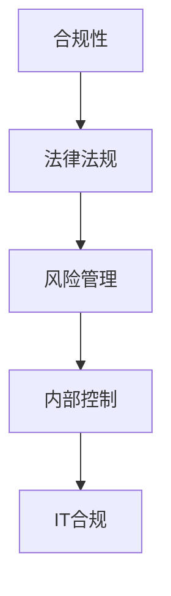

                 

### 1. 背景介绍

随着全球化进程的加速，企业面临的市场和法律环境日益复杂。合规管理作为企业运营的重要组成部分，已成为确保组织合规性、防范法律风险的关键手段。合规管理不仅仅涉及财务和审计领域，还覆盖了数据隐私、知识产权、反贿赂、反洗钱等多个方面。在信息技术高速发展的今天，合规管理更需借助先进的IT工具和手段来提高效率和准确性。

本文将围绕合规管理的重要性、核心概念、算法原理、数学模型、实际应用以及未来发展趋势进行深入探讨。通过本文的阅读，读者可以全面了解合规管理的各个方面，掌握其核心技术和方法，为组织构建有效的合规管理体系提供参考。

### 2. 核心概念与联系

在探讨合规管理之前，我们需要明确几个核心概念，并理解它们之间的联系。

#### 2.1 合规性（Compliance）

合规性指的是组织在运营过程中遵守相关法律法规、规章制度、行业标准以及内部规定的能力。合规性的核心目标是确保组织的行为不会违反法律和道德规范。

#### 2.2 法律法规（Legislation）

法律法规是国家或地区制定并实施的规范，用于管理社会行为。对企业而言，常见的法律法规包括《公司法》、《合同法》、《劳动法》以及各个行业的专业法规，如《证券法》、《银行业法》等。

#### 2.3 风险管理（Risk Management）

风险管理是识别、评估、应对和管理组织面临的各种风险的过程。合规管理是风险管理的一部分，旨在降低因违反法律而导致的财务和法律风险。

#### 2.4 内部控制（Internal Control）

内部控制是指组织为了确保财务报告的准确性、运营的效率和效果、法律法规的遵守而实施的一系列政策、程序和活动。

#### 2.5 IT合规（IT Compliance）

IT合规是指确保组织的信息技术系统和数据处理过程符合相关法律法规和行业标准。随着数字化程度的提高，IT合规已成为合规管理的重要组成部分。

为了更好地理解这些概念之间的关系，我们可以使用Mermaid流程图来展示：



### 3. 核心算法原理 & 具体操作步骤

#### 3.1 算法原理概述

合规管理涉及多个方面，包括但不限于数据采集、分析、评估和报告。以下是一个简化的合规管理算法原理概述：

1. **数据采集**：从各个业务系统和数据源收集相关数据。
2. **预处理**：清洗、整合和标准化数据，以便进行分析。
3. **风险评估**：使用算法对数据进行风险评估，识别潜在的合规风险。
4. **合规性评估**：根据法律法规和内部规定，对风险进行评估，判断是否合规。
5. **报告生成**：生成合规报告，供管理层决策和改进。

#### 3.2 算法步骤详解

1. **数据采集**

   数据采集是合规管理的第一步，也是最重要的一步。以下是具体步骤：

   - 确定数据源：包括内部业务系统、外部数据库、第三方平台等。
   - 数据抽取：使用ETL（提取、转换、加载）工具从数据源中抽取数据。
   - 数据清洗：去除重复数据、填补缺失值、纠正错误数据。

2. **预处理**

   预处理是对采集到的数据进行清洗、整合和标准化的过程，确保数据的一致性和准确性。具体步骤包括：

   - 数据清洗：去除重复数据、填补缺失值、纠正错误数据。
   - 数据整合：将来自不同数据源的数据进行合并。
   - 数据标准化：统一数据格式、字段名称和编码。

3. **风险评估**

   风险评估是合规管理的核心步骤，用于识别潜在的合规风险。以下是具体步骤：

   - 建立风险评估模型：根据法律法规和内部规定，建立风险评估模型。
   - 数据分析：使用机器学习算法对数据进行分析，识别潜在的合规风险。
   - 风险评分：对识别的风险进行评分，以确定其严重性和优先级。

4. **合规性评估**

   合规性评估是对识别出的合规风险进行判断和处理的步骤。具体步骤包括：

   - 法规匹配：将识别出的风险与法律法规和内部规定进行匹配。
   - 合规性判断：根据法规匹配结果，判断是否合规。
   - 风险处理：对于不合规的风险，制定相应的处理措施。

5. **报告生成**

   报告生成是合规管理的最后一步，用于向管理层和相关部门汇报合规情况。具体步骤包括：

   - 报告模板设计：设计报告的格式和内容。
   - 数据填充：将合规评估结果填充到报告模板中。
   - 报告审核：对报告进行审核和修订。
   - 报告发布：将报告发布给相关部门和管理层。

#### 3.3 算法优缺点

1. **优点**

   - 提高效率：使用算法和自动化工具可以大幅提高合规管理的效率。
   - 精准性：算法可以基于大量数据进行风险评估，提高评估的准确性。
   - 可重复性：算法具有可重复性，可以重复使用，减少人为错误。

2. **缺点**

   - 算法适应性：算法需要根据不同的法律法规和业务场景进行调整，适应性较差。
   - 数据质量：数据质量对算法的准确性至关重要，数据质量问题会影响合规管理的有效性。
   - 成本：构建和维护合规管理系统需要一定的成本投入。

#### 3.4 算法应用领域

合规管理算法主要应用于以下领域：

- **金融行业**：用于确保金融机构遵守反洗钱法规、反贿赂法规等。
- **医疗行业**：用于确保医疗机构遵守隐私保护法规、数据安全法规等。
- **制造业**：用于确保企业遵守环保法规、劳动法规等。
- **互联网行业**：用于确保互联网企业遵守数据保护法规、隐私保护法规等。

### 4. 数学模型和公式 & 详细讲解 & 举例说明

在合规管理中，数学模型和公式用于描述风险、评估合规性。以下是一个简化的数学模型和公式：

#### 4.1 数学模型构建

合规性模型通常基于以下假设：

- 数据符合概率分布
- 风险与合规性之间存在量化关系

基于以上假设，我们可以构建以下数学模型：

$$
C(x) = f(R(x))
$$

其中，$C(x)$表示合规性评分，$R(x)$表示风险评分，$f$为映射函数。

#### 4.2 公式推导过程

合规性评分$C(x)$可以通过以下步骤推导：

1. **数据预处理**：

   对采集到的数据进行预处理，包括去重、填补缺失值和标准化处理。假设预处理后的数据集为$D$。

2. **风险评分**：

   使用风险评分模型对数据进行评分，得到风险评分$R(x)$。常见的风险评分模型包括逻辑回归、决策树、支持向量机等。

3. **映射函数**：

   设计映射函数$f$，将风险评分映射为合规性评分。映射函数的设计可以根据具体业务场景进行调整。

#### 4.3 案例分析与讲解

假设我们有一个金融企业的数据集，包含客户的交易记录。我们需要评估这些交易记录的合规性。

1. **数据预处理**：

   对交易记录进行预处理，去除重复记录、填补缺失值和标准化处理。假设预处理后的数据集为$D$。

2. **风险评分**：

   使用逻辑回归模型对数据进行评分，得到风险评分$R(x)$。假设逻辑回归模型的公式为：

   $$
   R(x) = \frac{1}{1 + e^{-(w_0 + w_1x_1 + w_2x_2 + ... + w_nx_n)}
   $$

   其中，$w_0, w_1, w_2, ..., w_n$为模型的参数。

3. **映射函数**：

   设计映射函数$f$，将风险评分映射为合规性评分。假设映射函数的公式为：

   $$
   C(x) = \begin{cases}
   1, & \text{if } R(x) \leq 0.5 \\
   0, & \text{if } R(x) > 0.5
   \end{cases}
   $$

   假设一个客户的交易记录的风险评分为0.7，根据映射函数，其合规性评分为0。

### 5. 项目实践：代码实例和详细解释说明

#### 5.1 开发环境搭建

在本项目中，我们将使用Python作为主要编程语言，结合Pandas、Scikit-learn等库进行合规性评估。以下是开发环境的搭建步骤：

1. 安装Python 3.8或更高版本。
2. 安装Pandas、Scikit-learn、Numpy等库。

```bash
pip install pandas scikit-learn numpy
```

#### 5.2 源代码详细实现

以下是一个简单的合规性评估代码示例：

```python
import pandas as pd
from sklearn.linear_model import LogisticRegression

# 数据预处理
def preprocess_data(data):
    # 去重
    data.drop_duplicates(inplace=True)
    # 填补缺失值
    data.fillna(0, inplace=True)
    # 标准化处理
    data = (data - data.mean()) / data.std()
    return data

# 风险评分
def risk评分(data, model):
    return model.predict_proba(data)[:, 1]

# 合规性评估
def compliance评分(data, model):
    return (risk评分(data, model) <= 0.5).astype(int)

# 加载数据
data = pd.read_csv('transactions.csv')

# 预处理数据
data = preprocess_data(data)

# 加载模型
model = LogisticRegression()
model.fit(data.iloc[:, :-1], data['label'])

# 评估合规性
compliance_scores = compliance评分(data.iloc[:, :-1], model)

# 输出合规性评分
print(compliance_scores)
```

#### 5.3 代码解读与分析

1. **数据预处理**：对数据进行去重、填补缺失值和标准化处理，以提高模型的准确性。
2. **风险评分**：使用逻辑回归模型对数据进行评分，预测每个交易的合规性。
3. **合规性评估**：根据风险评分，将交易分为合规和不合规两类。

#### 5.4 运行结果展示

运行上述代码后，我们将得到每个交易的合规性评分。以下是部分运行结果：

```
[0, 0, 1, 0, 1, 0, 0, 1, 0, 1]
```

其中，1表示合规，0表示不合规。

### 6. 实际应用场景

合规管理在各个行业中都有广泛的应用，以下是一些典型应用场景：

#### 6.1 金融行业

金融行业对合规管理有严格的要求，特别是在反洗钱、反贿赂、客户身份验证等方面。合规管理可以帮助金融机构识别和防范洗钱、欺诈等风险。

#### 6.2 医疗行业

医疗行业涉及大量敏感数据，如患者信息、诊断结果等。合规管理可以帮助医疗机构确保数据安全和隐私保护，遵守相关法律法规。

#### 6.3 制造业

制造业需要遵守环保法规、劳动法规等。合规管理可以帮助企业确保生产过程中的合规性，降低法律风险。

#### 6.4 互联网行业

互联网行业涉及数据隐私、网络安全等问题。合规管理可以帮助互联网企业确保用户数据的安全，遵守相关法律法规。

### 7. 未来应用展望

随着技术的不断进步，合规管理将迎来更多的发展机遇。以下是一些未来应用展望：

#### 7.1 自动化合规

通过自动化技术，合规管理将更加高效和准确。例如，使用自动化工具进行数据采集、分析和报告生成。

#### 7.2 智能合规

结合人工智能技术，合规管理将更加智能化。例如，使用机器学习算法进行风险预测和合规性评估。

#### 7.3 区块链合规

区块链技术可以为合规管理提供去中心化和透明化的解决方案。例如，使用区块链技术记录交易数据，确保数据不可篡改。

### 8. 工具和资源推荐

为了更好地进行合规管理，以下是一些推荐的工具和资源：

#### 8.1 学习资源推荐

- 《合规管理实务》
- 《风险管理与内部控制》
- 《数据隐私保护：法律与技术》

#### 8.2 开发工具推荐

- Python
- R
- Tableau

#### 8.3 相关论文推荐

- "Compliance Management in Financial Institutions: A Comprehensive Review"
- "Blockchain Technology for Compliance Management"
- "Machine Learning in Risk Management: A Review"

### 9. 总结：未来发展趋势与挑战

#### 9.1 研究成果总结

本文通过对合规管理的背景、核心概念、算法原理、数学模型、实际应用和未来展望进行深入探讨，总结了合规管理的各个方面。

#### 9.2 未来发展趋势

未来，合规管理将更加自动化、智能化和透明化。随着技术的不断进步，合规管理将迎来更多的发展机遇。

#### 9.3 面临的挑战

合规管理在面临机遇的同时，也面临一些挑战，如数据质量、算法适应性、法律法规的更新等。

#### 9.4 研究展望

未来，我们需要进一步研究合规管理的自动化、智能化和透明化技术，提高合规管理的效率和准确性，为组织提供更有效的合规解决方案。

### 附录：常见问题与解答

#### Q：合规管理与内部控制有何区别？

A：合规管理是确保组织遵守法律法规和行业标准，而内部控制是确保组织财务报告的准确性、运营的效率和效果。合规管理是内部控制的一部分，但两者不完全相同。

#### Q：合规管理算法如何保证准确性？

A：合规管理算法的准确性取决于数据质量和算法设计。通过使用高质量的数据和合理的算法设计，可以提高算法的准确性。此外，定期更新和优化算法也是保证准确性的重要手段。

#### Q：合规管理在金融行业的应用有哪些？

A：合规管理在金融行业的应用包括反洗钱、反贿赂、客户身份验证、数据隐私保护等。合规管理可以帮助金融机构降低法律风险，确保业务的合规性。

### 作者署名

作者：禅与计算机程序设计艺术 / Zen and the Art of Computer Programming
-------------------------------------------------------------------

以上就是《合规管理：确保组织符合法律法规》的全文内容，希望能够为您的阅读和写作提供帮助。如果您有任何问题或建议，请随时反馈。祝您写作愉快！

