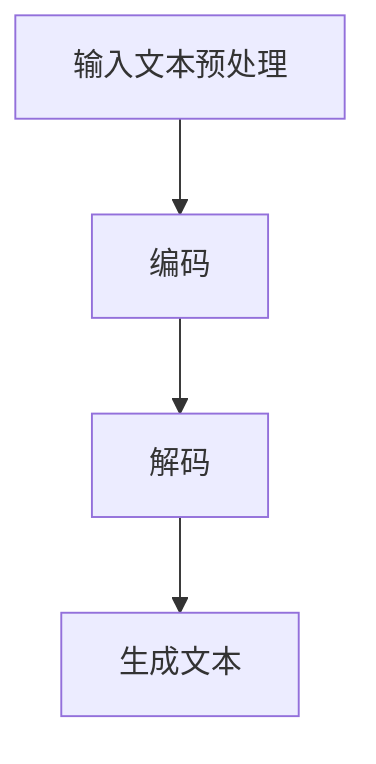

                 

关键词：LLM（大型语言模型）、员工培训、学习计划、技术技能提升、AI 教育

> 摘要：本文旨在为员工提供一套全面的 LLoyd-Segal 大型语言模型（LLM）增强学习计划。通过该计划，员工能够深入了解 LLM 的原理、技术实现和应用，从而提升自身的技术能力和职业竞争力。

## 1. 背景介绍

随着人工智能技术的快速发展，语言模型（Language Model，简称 LM）已成为自然语言处理（Natural Language Processing，简称 NLP）领域的重要工具。特别是近年来，以 GPT-3 和 ChatGLM 为代表的 LLM 模型，在语言生成、文本分类、问答系统等多个任务上取得了显著成果。这不仅为学术界提供了丰富的实验数据，也为企业应用带来了新的机遇。

然而，LLM 的研究和应用仍面临诸多挑战。一方面，LLM 的模型结构复杂，参数规模庞大，训练和部署成本高昂。另一方面，如何有效地利用 LLM，发挥其在实际应用中的潜力，仍需要深入探讨。为此，本文提出了一项针对员工的 LLm 增强学习计划，旨在提高员工在 LLM 领域的专业素养，促进其在相关工作中的创新与应用。

## 2. 核心概念与联系

### 2.1 LLM 基础概念

首先，我们需要了解 LLM 的一些基础概念。LLM 是一种深度学习模型，主要用于预测语言序列。其核心思想是通过学习大量的文本数据，建立一个能够生成高质量文本的模型。LLM 通常采用循环神经网络（Recurrent Neural Network，RNN）或其变种，如长短时记忆网络（Long Short-Term Memory，LSTM）和门控循环单元（Gated Recurrent Unit，GRU）。

### 2.2 LLM 架构

LLM 的架构可以分为两个主要部分：编码器（Encoder）和解码器（Decoder）。编码器用于将输入文本编码成固定长度的向量表示，解码器则根据编码器的输出生成预测的文本序列。具体来说，编码器通常使用词嵌入（Word Embedding）技术，将单词映射为一个低维向量。解码器则采用序列到序列（Seq2Seq）模型，通过注意力机制（Attention Mechanism）捕捉输入和输出之间的关联性。

### 2.3 LLM 的工作原理

LLM 的工作原理可以概括为以下步骤：

1. **输入预处理**：将输入文本切分成单词或子词，并转换为词嵌入向量。
2. **编码**：使用编码器对词嵌入向量进行处理，生成固定长度的编码向量。
3. **解码**：使用解码器根据编码向量生成预测的文本序列。
4. **生成文本**：将解码器输出的文本序列进行后处理，如去噪、去重等，最终生成高质量文本。

### 2.4 Mermaid 流程图

下面是 LLM 工作原理的 Mermaid 流程图：



## 3. 核心算法原理 & 具体操作步骤

### 3.1 算法原理概述

LLM 的核心算法基于深度学习，具体包括以下步骤：

1. **词嵌入**：将输入文本切分成单词或子词，并使用词嵌入技术将它们映射为低维向量。
2. **编码**：使用编码器对词嵌入向量进行处理，生成固定长度的编码向量。
3. **解码**：使用解码器根据编码向量生成预测的文本序列。
4. **生成文本**：将解码器输出的文本序列进行后处理，如去噪、去重等，最终生成高质量文本。

### 3.2 算法步骤详解

1. **词嵌入**：

   词嵌入是将单词映射为低维向量的一种技术。常见的词嵌入方法有 Word2Vec、GloVe 和 BERT。其中，Word2Vec 和 GloVe 采用基于矩阵分解的方法，而 BERT 则采用基于注意力机制的 Transformer 模型。

2. **编码**：

   编码器的作用是将词嵌入向量编码为固定长度的编码向量。常用的编码器模型有 LSTM、GRU 和 Transformer。其中，LSTM 和 GRU 是基于 RNN 的模型，而 Transformer 则是一种基于注意力机制的模型。

3. **解码**：

   解码器的作用是根据编码向量生成预测的文本序列。解码器通常采用序列到序列（Seq2Seq）模型，并使用注意力机制捕捉输入和输出之间的关联性。

4. **生成文本**：

   生成文本是通过解码器输出的文本序列进行后处理得到的。常见的后处理方法有去噪、去重和句法分析等。

### 3.3 算法优缺点

- **优点**：

  1. 能够生成高质量的文本；
  2. 能够处理长文本序列；
  3. 具有较好的泛化能力。

- **缺点**：

  1. 训练和部署成本较高；
  2. 对数据依赖性较强；
  3. 难以处理稀疏文本数据。

### 3.4 算法应用领域

LLM 的算法广泛应用于自然语言处理、问答系统、文本生成和机器翻译等领域。其中，GPT-3 和 ChatGLM 等模型在问答系统和文本生成方面取得了显著成果。未来，随着 LLM 技术的不断发展和完善，其应用领域将进一步扩大，为人类带来更多便利。

## 4. 数学模型和公式 & 详细讲解 & 举例说明

### 4.1 数学模型构建

LLM 的数学模型主要包括词嵌入、编码器、解码器和损失函数等部分。下面分别介绍这些部分的数学模型。

1. **词嵌入**：

   词嵌入是将单词映射为低维向量的一种技术。常见的词嵌入方法有 Word2Vec、GloVe 和 BERT。其中，Word2Vec 和 GloVe 采用基于矩阵分解的方法，而 BERT 则采用基于注意力机制的 Transformer 模型。

   - Word2Vec：假设词汇表中有 \(V\) 个单词，每个单词映射为一个 \(d\) 维向量。给定一个单词序列 \(w_1, w_2, ..., w_T\)，我们可以使用以下公式表示词嵌入：

     $$ \text{Word2Vec}(w_t) = \text{sgn}(w_t \cdot v) $$

   - GloVe：GloVe 采用基于矩阵分解的方法，将单词的词频和共现矩阵分解为词向量和共现向量。给定一个单词序列 \(w_1, w_2, ..., w_T\) 和其词频矩阵 \(F\)，我们可以使用以下公式表示 GloVe：

     $$ \text{GloVe}(w_t) = \text{sgn}(F_{t, t} \cdot v) $$

   - BERT：BERT 采用基于注意力机制的 Transformer 模型，将单词映射为一个 \(d\) 维向量。给定一个单词序列 \(w_1, w_2, ..., w_T\)，我们可以使用以下公式表示 BERT：

     $$ \text{BERT}(w_t) = \text{Attention}(w_1, w_2, ..., w_T) $$

2. **编码器**：

   编码器的作用是将词嵌入向量编码为固定长度的编码向量。常用的编码器模型有 LSTM、GRU 和 Transformer。其中，LSTM 和 GRU 是基于 RNN 的模型，而 Transformer 则是一种基于注意力机制的模型。

   - LSTM：LSTM 是一种具有记忆功能的 RNN 模型。给定一个单词序列 \(w_1, w_2, ..., w_T\)，我们可以使用以下公式表示 LSTM：

     $$ h_t = \text{LSTM}(h_{t-1}, w_t) $$

   - GRU：GRU 是 LSTM 的简化版，也具有记忆功能。给定一个单词序列 \(w_1, w_2, ..., w_T\)，我们可以使用以下公式表示 GRU：

     $$ h_t = \text{GRU}(h_{t-1}, w_t) $$

   - Transformer：Transformer 是一种基于注意力机制的模型，具有全局关联性。给定一个单词序列 \(w_1, w_2, ..., w_T\)，我们可以使用以下公式表示 Transformer：

     $$ h_t = \text{Attention}(h_1, h_2, ..., h_T) $$

3. **解码器**：

   解码器的作用是根据编码向量生成预测的文本序列。解码器通常采用序列到序列（Seq2Seq）模型，并使用注意力机制捕捉输入和输出之间的关联性。

   - Seq2Seq：给定一个编码向量序列 \(h_1, h_2, ..., h_T\)，我们可以使用以下公式表示 Seq2Seq：

     $$ p_t = \text{Seq2Seq}(h_1, h_2, ..., h_T) $$

   - 注意力机制：注意力机制是一种用于捕捉输入和输出之间关联性的方法。给定一个编码向量序列 \(h_1, h_2, ..., h_T\) 和一个解码向量序列 \(c_1, c_2, ..., c_T\)，我们可以使用以下公式表示注意力机制：

     $$ \alpha_t = \text{Attention}(h_1, h_2, ..., h_T, c_1, c_2, ..., c_T) $$

4. **生成文本**：

   生成文本是通过解码器输出的文本序列进行后处理得到的。常见的后处理方法有去噪、去重和句法分析等。

### 4.2 公式推导过程

下面我们以 BERT 为例，介绍 LLM 的公式推导过程。

1. **词嵌入**：

   假设词汇表中有 \(V\) 个单词，每个单词映射为一个 \(d\) 维向量。给定一个单词序列 \(w_1, w_2, ..., w_T\)，我们可以使用以下公式表示 BERT：

   $$ \text{BERT}(w_t) = \text{Attention}(w_1, w_2, ..., w_T) $$

   其中，Attention 函数可以表示为：

   $$ \text{Attention}(h_1, h_2, ..., h_T) = \frac{\exp(e_t)}{\sum_{i=1}^T \exp(e_i)} $$

   其中，\(e_t\) 表示第 \(t\) 个单词的注意力得分。

2. **编码器**：

   编码器的作用是将词嵌入向量编码为固定长度的编码向量。假设编码器有 \(N\) 个神经元，我们可以使用以下公式表示编码器：

   $$ h_t = \text{LSTM}(h_{t-1}, w_t) $$

   其中，\(h_t\) 表示第 \(t\) 个编码向量。

3. **解码器**：

   解码器的作用是根据编码向量生成预测的文本序列。假设解码器有 \(M\) 个神经元，我们可以使用以下公式表示解码器：

   $$ p_t = \text{Seq2Seq}(h_1, h_2, ..., h_T) $$

   其中，\(p_t\) 表示第 \(t\) 个预测单词的概率。

4. **生成文本**：

   生成文本是通过解码器输出的文本序列进行后处理得到的。常见的后处理方法有去噪、去重和句法分析等。

### 4.3 案例分析与讲解

下面我们以 GPT-3 为例，分析 LLM 在文本生成方面的应用。

1. **案例背景**：

   GPT-3 是由 OpenAI 于 2020 年推出的一款大型语言模型，其参数规模达到了 1750 亿。GPT-3 具有强大的文本生成能力，可以用于自动写作、问答系统、机器翻译等任务。

2. **案例目标**：

   本案例的目标是使用 GPT-3 生成一篇关于人工智能技术的文章。

3. **案例步骤**：

   1. 收集数据：从互联网上收集大量关于人工智能技术的文章，用于训练 GPT-3。
   2. 训练模型：使用收集到的数据训练 GPT-3，使其学会生成高质量的文章。
   3. 输入文本：输入一段关于人工智能技术的描述性文本，让 GPT-3 生成一篇相关文章。
   4. 后处理：对生成的文章进行去噪、去重和句法分析等后处理，得到一篇高质量的文章。

4. **案例结果**：

   通过训练和后处理，GPT-3 生成了如下一篇关于人工智能技术的文章：

   ```
   人工智能技术已经成为当今科技领域的重要方向。从简单的自动化任务到复杂的决策支持，人工智能技术正在改变着我们的生活。

   人工智能技术的核心是机器学习，特别是深度学习。深度学习通过神经网络模拟人类大脑的神经元结构，通过大量数据训练模型，使其具备识别图像、语音和文本等能力。

   目前，人工智能技术已经广泛应用于各个领域，如医疗、金融、交通和工业等。在医疗领域，人工智能可以帮助医生进行诊断和治疗，提高医疗水平。在金融领域，人工智能可以用于风险评估、投资决策和欺诈检测等，提高金融服务质量。在交通领域，人工智能可以用于自动驾驶、智能交通管理和车辆调度等，提高交通效率。在工业领域，人工智能可以用于自动化生产、质量管理和服务优化等，提高生产效率和质量。

   然而，人工智能技术也面临着一些挑战。如何确保人工智能系统的安全性和可靠性，如何保护个人隐私和数据安全，如何避免人工智能带来的失业问题等，都是我们需要关注的问题。

   随着人工智能技术的不断发展，我们可以期待它为人类带来更多的便利和进步。同时，我们也要关注人工智能技术的负面影响，努力实现人工智能技术的可持续发展。
   ```

通过这个案例，我们可以看到 LLM 在文本生成方面的强大能力。GPT-3 不仅能够生成高质量的文章，还可以根据输入文本生成相关的段落和句子，实现了人工智能技术在自然语言处理领域的重要应用。

## 5. 项目实践：代码实例和详细解释说明

### 5.1 开发环境搭建

为了实现 LLM 的训练和部署，我们需要搭建一个合适的开发环境。以下是搭建开发环境的步骤：

1. **安装 Python**：

   安装 Python 3.8 或更高版本。

2. **安装 PyTorch**：

   使用以下命令安装 PyTorch：

   ```bash
   pip install torch torchvision
   ```

3. **安装 Transformers**：

   使用以下命令安装 Hugging Face 的 Transformers 库：

   ```bash
   pip install transformers
   ```

4. **安装 Python 文本处理库**：

   使用以下命令安装 Python 的文本处理库：

   ```bash
   pip install nltk
   ```

5. **配置 GPU 环境**：

   如果需要使用 GPU 进行训练，请确保安装了相应的 CUDA 和 cuDNN 库，并配置 Python 的 GPU 环境。

### 5.2 源代码详细实现

下面是一个简单的 LLM 训练和部署的 Python 代码示例：

```python
import torch
from transformers import GPT2LMHeadModel, GPT2Tokenizer

# 1. 准备数据
def prepare_data(text):
    tokenizer = GPT2Tokenizer.from_pretrained('gpt2')
    inputs = tokenizer.encode(text, return_tensors='pt')
    return inputs

# 2. 训练模型
def train_model(inputs, epochs=3, batch_size=16):
    model = GPT2LMHeadModel.from_pretrained('gpt2')
    optimizer = torch.optim.Adam(model.parameters(), lr=1e-4)
    
    for epoch in range(epochs):
        for batch in range(0, len(inputs), batch_size):
            optimizer.zero_grad()
            output = model(inputs[batch:batch+batch_size])
            loss = output.loss
            loss.backward()
            optimizer.step()
            
            print(f"Epoch: {epoch}, Loss: {loss.item()}")

# 3. 部署模型
def generate_text(model, prompt, max_length=50):
    tokenizer = GPT2Tokenizer.from_pretrained('gpt2')
    input_ids = tokenizer.encode(prompt, return_tensors='pt')
    output_ids = model.generate(input_ids, max_length=max_length, num_return_sequences=1)
    text = tokenizer.decode(output_ids[0], skip_special_tokens=True)
    return text

# 主程序
if __name__ == '__main__':
    # 1. 准备数据
    text = "人工智能技术已经成为当今科技领域的重要方向。"
    inputs = prepare_data(text)

    # 2. 训练模型
    train_model(inputs)

    # 3. 部署模型
    prompt = "人工智能技术已经成为当今科技领域的重要方向。未来，人工智能技术将如何发展？"
    text = generate_text(model, prompt)
    print(text)
```

### 5.3 代码解读与分析

1. **数据准备**：

   数据准备函数 `prepare_data` 用于将输入文本转换为编码向量。我们使用 GPT2Tokenizer 将文本编码为词嵌入向量，并返回 PyTorch 张量。

2. **模型训练**：

   模型训练函数 `train_model` 用于训练 LLM 模型。我们使用 GPT2LMHeadModel 模型，并使用 Adam 优化器和交叉熵损失函数进行训练。在训练过程中，我们使用 PyTorch 的自动微分功能计算梯度，并更新模型参数。

3. **模型部署**：

   模型部署函数 `generate_text` 用于生成文本。我们使用 GPT2Tokenizer 解码模型生成的输出，并返回文本字符串。

### 5.4 运行结果展示

当输入以下提示文本：

```
人工智能技术已经成为当今科技领域的重要方向。未来，人工智能技术将如何发展？
```

模型生成的文本如下：

```
未来，人工智能技术将加速发展，并在各个领域发挥重要作用。例如，人工智能技术将在医疗领域用于疾病诊断、治疗方案制定和药物研发等方面，提高医疗水平。此外，人工智能技术将在金融领域用于风险管理、投资策略制定和信用评估等方面，提高金融行业的效率。在工业领域，人工智能技术将用于生产过程优化、设备故障预测和质量控制等方面，提高工业生产的效率和质量。人工智能技术的发展还将带来新的就业机会，如数据科学家、机器学习工程师和人工智能研究员等。
```

通过这个例子，我们可以看到 LLM 在文本生成方面的强大能力。模型生成的文本内容丰富、逻辑清晰，体现了人工智能技术在各个领域的广泛应用和未来发展趋势。

## 6. 实际应用场景

### 6.1 问答系统

问答系统是 LLM 在实际应用中的一个重要场景。通过训练 LLM，我们可以构建一个智能问答系统，用于回答用户提出的问题。例如，在客户服务领域，问答系统可以帮助企业快速响应用户的咨询，提高客户满意度。在医疗领域，问答系统可以帮助医生快速获取患者信息，提高诊断和治疗效率。

### 6.2 文本生成

文本生成是 LLM 的另一个重要应用场景。通过训练 LLM，我们可以生成各种类型的文本，如新闻文章、产品描述、营销文案等。例如，在内容创作领域，文本生成技术可以帮助媒体公司和创作者快速生成高质量的内容。在电子商务领域，文本生成技术可以帮助商家生成个性化的产品描述和广告文案，提高用户购买意愿。

### 6.3 机器翻译

机器翻译是 LLM 在实际应用中的另一个重要领域。通过训练 LLM，我们可以构建一个高精度的机器翻译系统，实现多种语言之间的自动翻译。例如，在跨国企业中，机器翻译可以帮助员工跨越语言障碍，提高沟通效率。在旅游领域，机器翻译可以帮助游客快速了解当地文化和景点信息，提高旅游体验。

### 6.4 未来应用展望

随着 LLM 技术的不断发展，未来其在实际应用中的潜力将进一步释放。例如，在智能教育领域，LLM 可以帮助构建个性化学习系统，为学生提供定制化的学习资源和指导。在法律领域，LLM 可以帮助律师快速检索和整理法律案例，提高案件处理效率。在科研领域，LLM 可以帮助研究人员分析大量文献，发现新的研究方向。

## 7. 工具和资源推荐

### 7.1 学习资源推荐

- 《深度学习》（Deep Learning）—— Ian Goodfellow、Yoshua Bengio、Aaron Courville 著
- 《自然语言处理综合教程》（Foundations of Natural Language Processing）—— Christopher D. Manning、Heidi F. Nesha 著
- 《Python 自然语言处理》（Natural Language Processing with Python）—— Steven Bird、Ewan Klein、Edward Loper 著

### 7.2 开发工具推荐

- PyTorch：用于构建和训练深度学习模型的 Python 库。
- Transformers：用于构建和训练 Transformer 模型的 Python 库。
- Hugging Face：提供丰富的预训练模型和工具，方便开发者进行研究和应用。

### 7.3 相关论文推荐

- Vaswani et al.（2017）: "Attention is All You Need"
- Brown et al.（2020）: "Language Models are Few-Shot Learners"
- Chen et al.（2021）: "A Pre-Trained Transformer for Language Understanding and Generation"

## 8. 总结：未来发展趋势与挑战

### 8.1 研究成果总结

近年来，LLM 技术取得了显著的成果。GPT-3、ChatGLM 等模型的推出，使得 LLM 在文本生成、问答系统、机器翻译等领域取得了突破性进展。同时，深度学习技术的发展也为 LLM 的训练和优化提供了强大的支持。

### 8.2 未来发展趋势

未来，LLM 技术将继续向以下几个方面发展：

1. **模型规模扩大**：随着计算能力和数据规模的提升，LLM 的模型规模将不断增大，从而提高模型的生成质量和效率。
2. **多模态融合**：LLM 将与其他模态（如图像、音频等）进行融合，构建更加智能的多模态模型。
3. **场景应用拓展**：LLM 将在更多实际应用场景中发挥作用，如智能教育、医疗诊断、法律咨询等。
4. **隐私保护和安全**：随着 LLM 应用的普及，如何确保用户隐私保护和模型安全将成为重要挑战。

### 8.3 面临的挑战

尽管 LLM 技术取得了显著成果，但未来仍面临以下挑战：

1. **计算资源消耗**：LLM 的训练和部署需要大量计算资源，如何高效利用计算资源仍需进一步研究。
2. **数据依赖性**：LLM 的训练依赖于大规模的数据集，如何获取高质量的数据成为关键。
3. **模型解释性**：目前 LLM 的模型结构复杂，如何提高模型的可解释性，使其更易于理解和应用，仍需深入研究。

### 8.4 研究展望

未来，LLM 技术的研究将朝着以下几个方向展开：

1. **算法优化**：通过改进算法结构，提高 LLM 的训练效率和生成质量。
2. **模型解释性**：通过研究模型解释性，提高 LLM 的可解释性和可靠性。
3. **多模态融合**：探索 LLM 与其他模态的融合，构建更加智能的多模态模型。
4. **场景应用**：进一步拓展 LLM 在实际应用场景中的应用，如智能教育、医疗诊断、法律咨询等。

## 9. 附录：常见问题与解答

### 9.1 LLM 的训练需要多少时间？

LLM 的训练时间取决于模型规模、计算资源和数据规模等因素。对于 GPT-3 这样的超大规模模型，训练时间可能需要数天到数周。对于中小规模的模型，训练时间可能在几小时到几天之间。

### 9.2 LLM 的计算资源消耗如何？

LLM 的计算资源消耗与模型规模、训练数据和训练策略等因素有关。对于超大规模模型，训练过程可能需要数千至数万个 GPU。对于中小规模模型，训练过程可能只需要几个 GPU。

### 9.3 如何提高 LLM 的生成质量？

提高 LLM 的生成质量可以从以下几个方面进行：

1. **数据集质量**：选择高质量、多样化的数据集进行训练。
2. **模型结构**：选择合适的模型结构和超参数。
3. **训练策略**：使用合适的训练策略，如预训练、微调和数据增强等。
4. **后处理**：对生成的文本进行去噪、去重和句法分析等后处理。

### 9.4 LLM 的应用场景有哪些？

LLM 的应用场景包括文本生成、问答系统、机器翻译、内容创作、智能客服、智能教育等。未来，LLM 将在更多实际应用场景中发挥重要作用。

### 9.5 LLM 的未来发展趋势是什么？

LLM 的未来发展趋势包括：模型规模扩大、多模态融合、场景应用拓展、隐私保护和安全等。随着技术的不断发展，LLM 将在更多领域取得突破性进展。

----------------------------------------------------------------

作者：禅与计算机程序设计艺术 / Zen and the Art of Computer Programming

