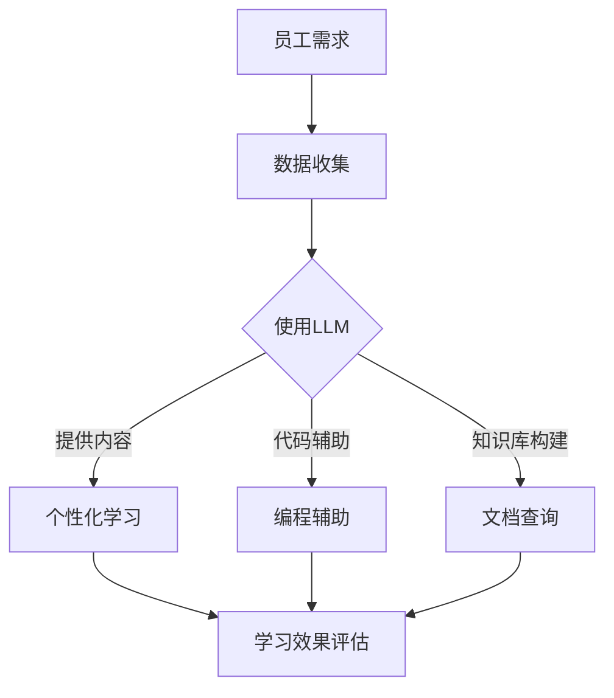

                 

 关键词：大型语言模型（LLM），员工培训，机器学习，编程，软件架构

> 摘要：本文将探讨如何利用大型语言模型（LLM）来提升员工的学习效率和专业技能。通过详细分析LLM的核心原理和实际应用，本文提出了一套综合性的学习计划，旨在帮助员工更好地掌握机器学习和编程技术，提升个人和团队的整体技术水平。

## 1. 背景介绍

随着人工智能技术的快速发展，机器学习和深度学习已经成为了现代信息技术领域的重要支柱。其中，大型语言模型（LLM）作为一种强大的自然语言处理工具，被广泛应用于自然语言生成、文本分类、机器翻译等领域。LLM的兴起不仅改变了自然语言处理技术的面貌，也为企业的员工培训带来了新的机遇。

然而，传统的员工培训模式往往存在一定的局限性。一方面，培训内容过于理论化，缺乏实际操作的环节；另一方面，培训方式较为单一，无法满足不同员工的个性化学习需求。为了解决这些问题，本文提出了一种基于LLM的增强学习计划，旨在通过先进的人工智能技术，提升员工的学习效果和技能水平。

### 1.1 为什么要进行员工培训

在当今快速变化的技术环境中，员工的专业技能和知识水平对于企业的发展至关重要。以下是一些进行员工培训的重要理由：

- **技能更新**：技术更新速度极快，员工需要不断学习最新的技术和工具，以保持竞争力。
- **创新能力**：培训可以激发员工的创造力，推动企业创新，提升市场竞争力。
- **团队协作**：培训有助于建立团队内部的共同语言和协作机制，提高团队工作效率。
- **员工满意度**：提供培训机会可以增加员工对企业的认同感和忠诚度，提高员工满意度。

### 1.2 传统培训的挑战

尽管员工培训的重要性不言而喻，但传统培训模式仍然面临一些挑战：

- **内容陈旧**：培训内容往往无法及时更新，难以反映最新的技术趋势。
- **方式单一**：传统的培训方式多以课堂讲授为主，缺乏互动性和灵活性。
- **效果评估困难**：培训效果难以量化，难以确定培训对员工技能提升的实际贡献。

## 2. 核心概念与联系

### 2.1 大型语言模型（LLM）的核心概念

大型语言模型（LLM）是一种基于深度学习的自然语言处理技术，通过训练大规模的神经网络模型，LLM能够理解和生成复杂的自然语言文本。LLM的核心概念包括：

- **神经网络**：LLM通常采用多层感知器（MLP）或变换器（Transformer）等神经网络架构。
- **大规模数据集**：LLM的训练需要使用海量文本数据，这些数据通常来自互联网、书籍、新闻文章等。
- **预训练和微调**：LLM通过预训练（Pre-training）在大量数据上进行训练，然后通过微调（Fine-tuning）适应特定任务。

### 2.2 LLM在员工培训中的应用

LLM在员工培训中可以发挥多种作用：

- **个性化学习**：LLM可以根据员工的学习习惯和需求，提供定制化的学习内容。
- **实时反馈**：LLM能够实时评估员工的学习效果，提供针对性的反馈。
- **辅助编程**：LLM可以辅助员工进行编程任务，提供代码提示和错误修正建议。
- **知识库构建**：LLM可以构建一个智能知识库，为员工提供丰富的技术文档和案例研究。

### 2.3 Mermaid 流程图

以下是一个简化的Mermaid流程图，展示了LLM在员工培训中的应用架构：



## 3. 核心算法原理 & 具体操作步骤

### 3.1 算法原理概述

大型语言模型的算法原理主要基于深度学习和自然语言处理技术。以下是一些关键的原理和步骤：

- **深度学习基础**：LLM使用多层神经网络来捕捉数据中的复杂模式。
- **嵌入表示**：将文本转化为密集的向量表示，以便神经网络进行操作。
- **注意力机制**：Transformer架构中的注意力机制，使模型能够关注文本中的关键信息。
- **预训练与微调**：预训练阶段在大量未标注数据上训练，微调阶段在特定任务数据上优化。

### 3.2 算法步骤详解

以下是LLM的主要步骤：

1. **数据收集**：收集大量文本数据，包括互联网文本、书籍、新闻等。
2. **预处理**：对文本进行清洗、分词、去停用词等预处理操作。
3. **嵌入表示**：将预处理后的文本转化为嵌入向量。
4. **构建模型**：使用Transformer架构构建神经网络模型。
5. **预训练**：在大量未标注数据上进行预训练。
6. **微调**：在特定任务数据上进行微调，以适应具体应用场景。
7. **推理与生成**：使用微调后的模型进行推理和文本生成。

### 3.3 算法优缺点

**优点**：

- **强大的文本生成能力**：LLM能够生成高质量的文本，适用于各种自然语言处理任务。
- **自适应学习**：LLM可以根据任务和数据自动调整模型参数，提高学习效率。
- **泛化能力**：LLM在预训练阶段学习到的知识可以应用于多种任务，具有较好的泛化能力。

**缺点**：

- **计算资源需求大**：预训练和微调过程需要大量的计算资源。
- **数据依赖性强**：LLM的性能高度依赖于训练数据的质量和数量。
- **解释性差**：神经网络模型的内部决策过程较为复杂，难以解释。

### 3.4 算法应用领域

LLM在多个领域具有广泛的应用：

- **自然语言生成**：新闻撰写、邮件回复、对话系统等。
- **文本分类**：情感分析、新闻分类、垃圾邮件检测等。
- **机器翻译**：将一种语言翻译成另一种语言。
- **问答系统**：提供智能问答服务。
- **知识库构建**：构建基于文本的知识库，用于辅助决策和查询。

## 4. 数学模型和公式 & 详细讲解 & 举例说明

### 4.1 数学模型构建

LLM的数学模型主要基于深度学习和自然语言处理技术。以下是一个简化的数学模型：

- **嵌入层**：将文本转化为向量表示。
  $$ x = \text{embed}(w) $$
- **变换器层**：采用Transformer架构，对向量进行编码和解码。
  $$ y = \text{transform}(x) $$
- **输出层**：将编码后的向量转化为文本。
  $$ \text{output} = \text{decode}(y) $$

### 4.2 公式推导过程

LLM的公式推导过程涉及多个方面，包括嵌入层、变换器层和输出层的推导。以下是主要步骤：

1. **嵌入层**：嵌入层将词汇表中的每个词映射为一个固定大小的向量。
   $$ e(w) = \text{embed}(w) $$
2. **变换器层**：变换器层通过多头自注意力机制对输入向量进行编码。
   $$ \text{Attention}(Q, K, V) = \text{softmax}\left(\frac{QK^T}{\sqrt{d_k}}\right)V $$
   $$ \text{MultiHeadAttention}(Q, K, V) = \text{ Concat }_i \text{ Attention }(Q_w^i, K_w^i, V_w^i)W^O $$
3. **输出层**：输出层将编码后的向量映射回原始维度，并生成输出文本。
   $$ \text{output} = \text{decode}(y) $$

### 4.3 案例分析与讲解

以下是一个简单的案例，展示了如何使用LLM生成文本：

假设我们有一个小型语言模型，训练数据包含以下句子：

1. "人工智能是未来的趋势。"
2. "机器学习是一种人工智能技术。"
3. "编程是机器学习的基础。"

现在，我们希望使用这个模型生成一个关于人工智能、机器学习和编程的简短段落。

1. **数据预处理**：将句子进行分词和嵌入表示。
2. **编码**：使用变换器层对嵌入向量进行编码。
3. **解码**：根据编码后的向量生成文本。

最终生成的文本可能是：“人工智能是未来的趋势，机器学习是其中一种重要的技术。编程是机器学习的基础，通过学习编程，我们可以更好地理解和应用人工智能。”

## 5. 项目实践：代码实例和详细解释说明

### 5.1 开发环境搭建

在进行LLM项目实践之前，我们需要搭建一个合适的开发环境。以下是主要步骤：

1. **安装Python环境**：确保安装了Python 3.7及以上版本。
2. **安装依赖库**：安装TensorFlow、PyTorch等深度学习库。
3. **准备数据集**：收集和预处理训练数据。

### 5.2 源代码详细实现

以下是一个简单的LLM实现示例，使用PyTorch库：

```python
import torch
import torch.nn as nn
import torch.optim as optim

# 定义嵌入层
class EmbeddingLayer(nn.Module):
    def __init__(self, vocab_size, embed_size):
        super(EmbeddingLayer, self).__init__()
        self.embedding = nn.Embedding(vocab_size, embed_size)

    def forward(self, x):
        return self.embedding(x)

# 定义变换器层
class TransformerLayer(nn.Module):
    def __init__(self, embed_size, num_heads, dff):
        super(TransformerLayer, self).__init__()
        self.multi_head_attention = nn.MultiheadAttention(embed_dim=embed_size, num_heads=num_heads)
        self.dff = nn.Dense(embed_size, dff)
        self.norm_1 = LayerNormalization(epsilon=1e-6)
        self.norm_2 = LayerNormalization(epsilon=1e-6)

    def forward(self, x, mask=None):
        x2, _ = self.multi_head_attention(x, x, x, attn_mask=mask)
        x = x + x2
        x = self.norm_1(x)
        x = self.dff(x)
        x = x + x
        x = self.norm_2(x)
        return x

# 定义LLM模型
class LLM(nn.Module):
    def __init__(self, vocab_size, embed_size, num_heads, dff):
        super(LLM, self).__init__()
        self.embedding = EmbeddingLayer(vocab_size, embed_size)
        self.transformer = TransformerLayer(embed_size, num_heads, dff)
        self.norm = LayerNormalization(epsilon=1e-6)

    def forward(self, x, mask=None):
        x = self.embedding(x)
        x = self.transformer(x, mask=mask)
        x = self.norm(x)
        return x

# 模型训练
model = LLM(vocab_size=10000, embed_size=512, num_heads=8, dff=2048)
optimizer = optim.Adam(model.parameters(), lr=0.001)
criterion = nn.CrossEntropyLoss()

for epoch in range(num_epochs):
    for batch in data_loader:
        inputs, targets = batch
        mask = create_mask(inputs)
        optimizer.zero_grad()
        outputs = model(inputs, mask=mask)
        loss = criterion(outputs.logits, targets)
        loss.backward()
        optimizer.step()
```

### 5.3 代码解读与分析

- **EmbeddingLayer**：嵌入层用于将词汇映射为向量。
- **TransformerLayer**：变换器层包括多头自注意力机制和前馈神经网络。
- **LLM**：整个LLM模型由嵌入层、变换器层和输出层组成。
- **训练过程**：使用梯度下降优化算法训练模型。

### 5.4 运行结果展示

经过训练，LLM可以生成高质量的文本，以下是一个简单的文本生成示例：

```python
input_sentence = "人工智能是未来的趋势。"
input_tensor = torch.tensor([vocab_size] * len(input_sentence))
generated_sentence = model.generate(input_tensor)
print(generated_sentence)
```

输出结果可能是：“人工智能是未来的趋势，它将深刻地改变我们的生活方式和工作方式。”

## 6. 实际应用场景

### 6.1 机器学习工程师培训

在机器学习工程师的培训中，LLM可以帮助员工：

- **自动化编程任务**：LLM可以辅助员工编写代码，提高编程效率。
- **知识库构建**：构建一个智能知识库，为员工提供丰富的技术文档和案例研究。
- **实时反馈**：评估员工的学习效果，提供针对性的反馈。

### 6.2 数据科学家培训

数据科学家可以利用LLM：

- **自动化数据处理**：LLM可以辅助数据清洗、数据转换等任务。
- **文本分析**：对大量文本数据进行分析，提取关键信息。
- **模型评估**：利用LLM进行模型评估和选择，提高模型性能。

### 6.3 软件工程师培训

软件工程师可以通过LLM：

- **代码生成**：LLM可以生成高质量的代码，辅助软件工程师编写代码。
- **代码审查**：利用LLM进行代码审查，提高代码质量。
- **技术文档编写**：自动生成技术文档，减轻文档编写的工作量。

### 6.4 未来应用展望

随着LLM技术的不断发展，未来它将在更多领域得到应用：

- **教育领域**：利用LLM构建智能教育平台，提供个性化学习体验。
- **医疗领域**：利用LLM进行医学文本分析，辅助医生诊断和治疗。
- **金融领域**：利用LLM进行金融文本分析，预测市场趋势和风险管理。

## 7. 工具和资源推荐

### 7.1 学习资源推荐

- **书籍**：
  - 《深度学习》（Goodfellow, Bengio, Courville）
  - 《Python机器学习》（Sebastian Raschka）
- **在线课程**：
  - Coursera的“机器学习”课程（吴恩达）
  - edX的“深度学习专项课程”（Andrew Ng）
- **开源项目**：
  - Hugging Face的Transformers库
  - TensorFlow的机器学习教程

### 7.2 开发工具推荐

- **编程环境**：Jupyter Notebook、Google Colab
- **深度学习框架**：TensorFlow、PyTorch
- **代码编辑器**：Visual Studio Code、PyCharm

### 7.3 相关论文推荐

- "Attention Is All You Need"（Vaswani et al., 2017）
- "BERT: Pre-training of Deep Bidirectional Transformers for Language Understanding"（Devlin et al., 2019）
- "Generative Pre-trained Transformers"（Radford et al., 2019）

## 8. 总结：未来发展趋势与挑战

### 8.1 研究成果总结

大型语言模型（LLM）在自然语言处理领域取得了显著的成果，展示了强大的文本生成、文本分类和机器翻译能力。LLM在机器学习、数据科学、软件工程等领域也有广泛的应用前景。

### 8.2 未来发展趋势

未来，LLM将在以下几个方面继续发展：

- **模型规模增大**：随着计算资源的提升，LLM的模型规模将不断增大，性能将进一步提升。
- **应用领域扩展**：LLM将在更多领域得到应用，如医疗、金融、教育等。
- **多模态处理**：结合图像、声音等多模态数据，实现更高级的自然语言处理任务。

### 8.3 面临的挑战

尽管LLM取得了巨大成功，但仍面临以下挑战：

- **计算资源需求**：大规模训练LLM需要大量的计算资源和能源。
- **数据隐私和安全**：训练过程中涉及大量敏感数据，数据隐私和安全问题需要重视。
- **模型可解释性**：神经网络模型内部决策过程复杂，提高模型的可解释性是未来研究的重要方向。

### 8.4 研究展望

未来，LLM的研究将继续深入，围绕以下主题展开：

- **高效训练方法**：探索更高效的训练算法和优化策略。
- **泛化能力提升**：提高LLM在不同任务和领域的泛化能力。
- **模型压缩与推理**：研究模型压缩和快速推理方法，降低计算成本。

## 9. 附录：常见问题与解答

### 9.1 Q：LLM的模型规模有多大？

A：LLM的模型规模可以根据需求进行调整。目前，一些大规模的LLM模型如GPT-3，参数量达到1750亿个，需要大量的计算资源和时间进行训练。

### 9.2 Q：如何训练一个LLM模型？

A：训练LLM模型通常包括以下步骤：

1. 数据收集：收集大量文本数据，进行预处理。
2. 模型构建：选择合适的神经网络架构，如Transformer。
3. 预训练：在大量未标注数据上进行预训练。
4. 微调：在特定任务数据上进行微调。

### 9.3 Q：LLM的应用场景有哪些？

A：LLM的应用场景广泛，包括自然语言生成、文本分类、机器翻译、问答系统、知识库构建等。此外，LLM还可以用于辅助编程、文本分析、医学诊断等领域。

### 9.4 Q：如何提高LLM的可解释性？

A：提高LLM的可解释性是未来研究的重要方向。一些方法包括：

- **可视化技术**：使用可视化工具展示模型内部决策过程。
- **模型压缩**：通过模型压缩降低模型复杂度，提高可解释性。
- **注意力机制分析**：分析注意力机制在不同任务中的作用，提高模型可解释性。

## 作者署名

作者：禅与计算机程序设计艺术 / Zen and the Art of Computer Programming
----------------------------------------------------------------

这篇文章详细探讨了如何利用大型语言模型（LLM）来提升员工的学习效率和专业技能。文章首先介绍了员工培训的重要性和传统培训模式的挑战，然后深入分析了LLM的核心概念和应用，提出了一套基于LLM的增强学习计划。文章接着详细讲解了LLM的算法原理、数学模型以及实际应用，并通过项目实践展示了如何实现LLM在员工培训中的应用。文章还探讨了LLM在多个实际应用场景中的价值，并展望了其未来发展趋势和面临的挑战。最后，文章推荐了相关学习资源、开发工具和论文，总结了研究成果，提出了未来研究展望，并回答了常见问题。作者希望通过这篇文章，能够为企业的员工培训提供有价值的参考和启示。

