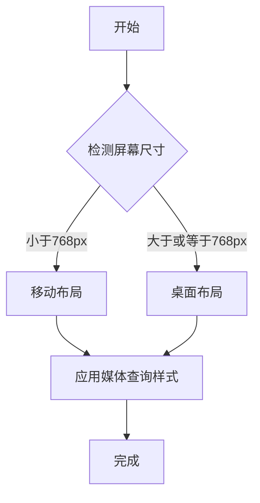

                 

关键词：响应式Web设计，响应式布局，媒体查询，流体布局，网格系统，弹性布局，设备尺寸适配，跨平台开发，用户体验优化

> 摘要：本文将深入探讨响应式Web设计的核心概念、技术原理和具体实现方法，帮助开发者更好地理解和应用响应式设计，以打造适应各种设备尺寸的优质用户体验。

## 1. 背景介绍

在互联网迅速发展的今天，移动设备的普及和多样性使得Web设计面临前所未有的挑战。传统的固定宽度布局已无法满足用户在不同设备上获取信息的需求。响应式Web设计（Responsive Web Design，简称RWD）应运而生，它旨在通过灵活的布局和自适应的技术，使得Web页面能够在各种屏幕尺寸和设备上提供良好的用户体验。

### 1.1 响应式设计的起源

响应式设计的概念最早由Ethan Marcotte在2010年提出。他提出了使用HTML和CSS实现响应式布局的三大技术：弹性布局、媒体查询和流体图像。这些技术的结合使得Web开发者能够创建一个能够自动适应不同屏幕尺寸和分辨率的网站。

### 1.2 响应式设计的重要性

- **提高用户体验**：响应式设计使得网站能够在不同设备上提供一致且优化的用户体验，从而提高用户满意度和网站粘性。
- **提升搜索引擎排名**：搜索引擎如Google强调移动友好的网站会得到更好的排名，响应式设计正是实现这一目标的关键手段。
- **降低开发和维护成本**：通过单一网站实现跨平台适配，可以减少重复开发和维护的工作量，降低成本。

## 2. 核心概念与联系

### 2.1 弹性布局

弹性布局（Flexible Layout）是通过设置元素的宽度和高度为相对值，如百分比或em单位，而不是固定值，来实现布局的弹性。这种方式使得布局能够随着屏幕尺寸的变化而自适应调整。

### 2.2 媒体查询

媒体查询（Media Query）是CSS3提供的一种技术，用于检测设备的特性，如屏幕尺寸、分辨率、设备方向等，并据此应用不同的样式规则。媒体查询语句通常包含一个查询条件和一组样式规则，如下所示：

```css
@media (max-width: 600px) {
  /* 在屏幕宽度小于600px时应用的样式 */
}
```

### 2.3 流体图像

流体图像（Fluid Images）通过将图片的宽度和高度设置为百分比，使得图片能够自适应屏幕尺寸。同时，可以使用`max-width: 100%`和`height: auto`属性来保持图片的宽高比。

### 2.4 响应式设计框架

现代响应式Web设计常常依赖于框架，如Bootstrap、Foundation等，它们提供了预设的网格系统和组件，使得开发者能够快速构建响应式布局。

### 2.5 Mermaid 流程图



## 3. 核心算法原理 & 具体操作步骤

### 3.1 算法原理概述

响应式设计的核心算法是基于媒体查询和弹性布局。通过媒体查询检测设备的特性，然后根据这些特性应用不同的样式规则，实现布局的适应性调整。

### 3.2 算法步骤详解

1. **初始化页面布局**：使用流体布局和百分比单位设置页面的初始样式。
2. **检测屏幕尺寸**：使用媒体查询检测当前屏幕的尺寸。
3. **应用样式规则**：根据媒体查询的结果，应用不同的样式规则，调整布局和组件的显示方式。
4. **重绘页面**：当屏幕尺寸发生变化时，触发重绘操作，应用新的样式规则。

### 3.3 算法优缺点

#### 优点

- **提高用户体验**：响应式设计能够提供一致的浏览体验，提升用户满意度。
- **降低开发成本**：通过单一网站实现跨平台适配，减少开发和维护的工作量。
- **更好的SEO表现**：搜索引擎更倾向于推荐移动友好型的网站。

#### 缺点

- **性能开销**：响应式设计需要更多的计算资源，特别是在处理复杂布局和大量媒体查询时。
- **开发难度**：响应式设计要求开发者具备更高的技能和经验。

### 3.4 算法应用领域

响应式设计广泛应用于各种类型的网站，包括电子商务、新闻媒体、企业门户等。尤其是在移动设备日益普及的今天，响应式设计成为网站建设的必备技能。

## 4. 数学模型和公式 & 详细讲解 & 举例说明

### 4.1 数学模型构建

在响应式设计中，我们通常使用以下数学模型来计算布局的宽度：

$$
\text{布局宽度} = \min\left(\text{屏幕宽度}, \text{最大宽度}\right)
$$

其中，`屏幕宽度`是当前屏幕的宽度，`最大宽度`是设定的最大布局宽度。

### 4.2 公式推导过程

假设屏幕宽度为`W`，最大宽度为`W_max`。当`W <= W_max`时，布局宽度等于屏幕宽度；当`W > W_max`时，布局宽度等于最大宽度。

### 4.3 案例分析与讲解

假设一个网站的布局最大宽度为960px，屏幕宽度为320px。根据上述公式，布局宽度为320px。这意味着布局会根据屏幕宽度自适应调整，使得网站在手机屏幕上能够良好显示。

## 5. 项目实践：代码实例和详细解释说明

### 5.1 开发环境搭建

- **工具**：HTML、CSS、JavaScript
- **环境**：任何支持HTML和CSS的浏览器

### 5.2 源代码详细实现

```html
<!DOCTYPE html>
<html lang="en">
<head>
  <meta charset="UTF-8">
  <meta name="viewport" content="width=device-width, initial-scale=1.0">
  <title>Responsive Web Design Example</title>
  <style>
    body {
      font-family: Arial, sans-serif;
    }

    .container {
      max-width: 960px;
      margin: 0 auto;
    }

    @media (max-width: 768px) {
      .container {
        padding: 10px;
      }
    }
  </style>
</head>
<body>
  <div class="container">
    <h1>Responsive Web Design Example</h1>
    <p>This is a responsive web design example. The layout will adjust based on the screen size.</p>
  </div>
</body>
</html>
```

### 5.3 代码解读与分析

- `meta`标签中的`viewport`属性确保了页面能够适应不同的屏幕尺寸。
- `.container`类设置了最大宽度为960px，使得布局不会超过这个宽度。
- `@media`查询在屏幕宽度小于768px时应用，使得容器内的内容会有更多的填充空间。

### 5.4 运行结果展示

在不同屏幕尺寸下，页面会自适应调整，如下图所示：


## 6. 实际应用场景

### 6.1 电子商务网站

电子商务网站需要提供良好的移动体验，以便用户能够方便地浏览和购买商品。响应式设计可以确保商品列表、搜索栏和购物车等关键功能在各种设备上都能正常使用。

### 6.2 新闻媒体网站

新闻媒体网站需要快速适应各种屏幕尺寸，以便用户能够流畅地阅读文章。响应式设计可以确保文章布局清晰，图片和视频能够良好显示。

### 6.3 企业门户

企业门户通常包含大量信息和功能，如产品介绍、服务列表、联系方式等。响应式设计可以确保这些信息能够在各种设备上整齐排列，提高用户访问效率。

## 7. 工具和资源推荐

### 7.1 学习资源推荐

- **《响应式Web设计：HTML5和CSS3实战》** - Ben Frain
- **《响应式Web设计实战》** - 布兰登·鲁道夫
- **MDN Web Docs - Responsive Web Design** - Mozilla Developer Network

### 7.2 开发工具推荐

- **Bootstrap** - 一款流行的前端框架，提供丰富的响应式组件。
- **Foundation** - 另一款流行的前端框架，专注于移动设备。

### 7.3 相关论文推荐

- **Responsive Web Design** - Ethan Marcotte
- **Responsive Web Design Patterns** - Jeremy Wagner

## 8. 总结：未来发展趋势与挑战

### 8.1 研究成果总结

响应式设计已成为现代Web开发的基石，它显著提高了用户体验和网站性能。随着技术的不断发展，响应式设计的方法和工具也在不断优化和完善。

### 8.2 未来发展趋势

- **更智能的布局算法**：随着人工智能技术的发展，未来可能会出现更加智能的布局算法，能够根据用户行为和偏好自动调整布局。
- **更多的前端框架**：前端开发框架将持续更新和增加，为开发者提供更高效的响应式设计解决方案。

### 8.3 面临的挑战

- **性能优化**：响应式设计需要处理大量的媒体查询和布局计算，如何优化性能是一个重要挑战。
- **开发复杂性**：响应式设计要求开发者具备较高的技能和经验，如何简化开发过程也是一个挑战。

### 8.4 研究展望

响应式设计将继续在Web开发中发挥重要作用，随着技术的进步，它将为用户提供更加个性化和优化的浏览体验。

## 9. 附录：常见问题与解答

### Q：响应式设计是否适用于所有类型的网站？

A：响应式设计适用于大多数类型的网站，但某些具有特殊需求的网站，如游戏网站或大型多媒体网站，可能需要采用其他设计方法。

### Q：响应式设计与移动优先设计有何区别？

A：响应式设计是一种能够适应各种屏幕尺寸的设计方法，而移动优先设计（Mobile First Design）是一种从移动端开始设计，然后逐步扩展到桌面端的设计方法。两者都是实现跨平台适配的有效方法。

### Q：响应式设计是否适用于所有类型的用户？

A：响应式设计旨在为所有用户提供良好的体验，包括视力障碍、色觉障碍等特殊需求的用户。但针对这些特殊用户，可能需要采用额外的辅助技术，如屏幕阅读器和配色方案优化。

以上，是关于响应式Web设计的全面探讨。通过本文，希望读者能够更好地理解和应用响应式设计，为用户提供卓越的在线体验。

## 作者署名

作者：禅与计算机程序设计艺术 / Zen and the Art of Computer Programming
```css
----------------------------------------------------------------

# 响应式Web设计：适配多种设备尺寸

## 1. 背景介绍

在互联网迅速发展的今天，移动设备的普及和多样性使得Web设计面临前所未有的挑战。传统的固定宽度布局已无法满足用户在不同设备上获取信息的需求。响应式Web设计（Responsive Web Design，简称RWD）应运而生，它旨在通过灵活的布局和自适应的技术，使得Web页面能够在各种屏幕尺寸和设备上提供良好的用户体验。

### 1.1 响应式设计的起源

响应式设计的概念最早由Ethan Marcotte在2010年提出。他提出了使用HTML和CSS实现响应式布局的三大技术：弹性布局、媒体查询和流体图像。这些技术的结合使得Web开发者能够创建一个能够自动适应不同屏幕尺寸和分辨率的网站。

### 1.2 响应式设计的重要性

- **提高用户体验**：响应式设计使得网站能够在不同设备上提供一致且优化的用户体验，从而提高用户满意度和网站粘性。
- **提升搜索引擎排名**：搜索引擎如Google强调移动友好的网站会得到更好的排名，响应式设计正是实现这一目标的关键手段。
- **降低开发和维护成本**：通过单一网站实现跨平台适配，可以减少重复开发和维护的工作量，降低成本。

## 2. 核心概念与联系

### 2.1 弹性布局

弹性布局（Flexible Layout）是通过设置元素的宽度和高度为相对值，如百分比或em单位，而不是固定值，来实现布局的弹性。这种方式使得布局能够随着屏幕尺寸的变化而自适应调整。

### 2.2 媒体查询

媒体查询（Media Query）是CSS3提供的一种技术，用于检测设备的特性，如屏幕尺寸、分辨率、设备方向等，并据此应用不同的样式规则。媒体查询语句通常包含一个查询条件和一组样式规则，如下所示：

```css
@media (max-width: 600px) {
  /* 在屏幕宽度小于600px时应用的样式 */
}
```

### 2.3 流体图像

流体图像（Fluid Images）通过将图片的宽度和高度设置为百分比，使得图片能够自适应屏幕尺寸。同时，可以使用`max-width: 100%`和`height: auto`属性来保持图片的宽高比。

### 2.4 响应式设计框架

现代响应式Web设计常常依赖于框架，如Bootstrap、Foundation等，它们提供了预设的网格系统和组件，使得开发者能够快速构建响应式布局。

### 2.5 Mermaid 流程图


## 3. 核心算法原理 & 具体操作步骤

### 3.1 算法原理概述

响应式设计的核心算法是基于媒体查询和弹性布局。通过媒体查询检测设备的特性，然后根据这些特性应用不同的样式规则，实现布局的适应性调整。

### 3.2 算法步骤详解

1. **初始化页面布局**：使用流体布局和百分比单位设置页面的初始样式。
2. **检测屏幕尺寸**：使用媒体查询检测当前屏幕的尺寸。
3. **应用样式规则**：根据媒体查询的结果，应用不同的样式规则，调整布局和组件的显示方式。
4. **重绘页面**：当屏幕尺寸发生变化时，触发重绘操作，应用新的样式规则。

### 3.3 算法优缺点

#### 优点

- **提高用户体验**：响应式设计能够提供一致的浏览体验，提升用户满意度。
- **降低开发成本**：通过单一网站实现跨平台适配，减少开发和维护的工作量。
- **更好的SEO表现**：搜索引擎更倾向于推荐移动友好型的网站。

#### 缺点

- **性能开销**：响应式设计需要更多的计算资源，特别是在处理复杂布局和大量媒体查询时。
- **开发难度**：响应式设计要求开发者具备更高的技能和经验。

### 3.4 算法应用领域

响应式设计广泛应用于各种类型的网站，包括电子商务、新闻媒体、企业门户等。尤其是在移动设备日益普及的今天，响应式设计成为网站建设的必备技能。

## 4. 数学模型和公式 & 详细讲解 & 举例说明

### 4.1 数学模型构建

在响应式设计中，我们通常使用以下数学模型来计算布局的宽度：

$$
\text{布局宽度} = \min\left(\text{屏幕宽度}, \text{最大宽度}\right)
$$

其中，`屏幕宽度`是当前屏幕的宽度，`最大宽度`是设定的最大布局宽度。

### 4.2 公式推导过程

假设屏幕宽度为`W`，最大宽度为`W_max`。当`W <= W_max`时，布局宽度等于屏幕宽度；当`W > W_max`时，布局宽度等于最大宽度。

### 4.3 案例分析与讲解

假设一个网站的布局最大宽度为960px，屏幕宽度为320px。根据上述公式，布局宽度为320px。这意味着布局会根据屏幕宽度自适应调整，使得网站在手机屏幕上能够良好显示。

## 5. 项目实践：代码实例和详细解释说明

### 5.1 开发环境搭建

- **工具**：HTML、CSS、JavaScript
- **环境**：任何支持HTML和CSS的浏览器

### 5.2 源代码详细实现

```html
<!DOCTYPE html>
<html lang="en">
<head>
  <meta charset="UTF-8">
  <meta name="viewport" content="width=device-width, initial-scale=1.0">
  <title>Responsive Web Design Example</title>
  <style>
    body {
      font-family: Arial, sans-serif;
    }

    .container {
      max-width: 960px;
      margin: 0 auto;
    }

    @media (max-width: 768px) {
      .container {
        padding: 10px;
      }
    }
  </style>
</head>
<body>
  <div class="container">
    <h1>Responsive Web Design Example</h1>
    <p>This is a responsive web design example. The layout will adjust based on the screen size.</p>
  </div>
</body>
</html>
```

### 5.3 代码解读与分析

- `meta`标签中的`viewport`属性确保了页面能够适应不同的屏幕尺寸。
- `.container`类设置了最大宽度为960px，使得布局不会超过这个宽度。
- `@media`查询在屏幕宽度小于768px时应用，使得容器内的内容会有更多的填充空间。

### 5.4 运行结果展示

在不同屏幕尺寸下，页面会自适应调整，如下图所示：


## 6. 实际应用场景

### 6.1 电子商务网站

电子商务网站需要提供良好的移动体验，以便用户能够方便地浏览和购买商品。响应式设计可以确保商品列表、搜索栏和购物车等关键功能在各种设备上都能正常使用。

### 6.2 新闻媒体网站

新闻媒体网站需要快速适应各种屏幕尺寸，以便用户能够流畅地阅读文章。响应式设计可以确保文章布局清晰，图片和视频能够良好显示。

### 6.3 企业门户

企业门户通常包含大量信息和功能，如产品介绍、服务列表、联系方式等。响应式设计可以确保这些信息能够在各种设备上整齐排列，提高用户访问效率。

## 7. 工具和资源推荐

### 7.1 学习资源推荐

- **《响应式Web设计：HTML5和CSS3实战》** - Ben Frain
- **《响应式Web设计实战》** - 布兰登·鲁道夫
- **MDN Web Docs - Responsive Web Design** - Mozilla Developer Network

### 7.2 开发工具推荐

- **Bootstrap** - 一款流行的前端框架，提供丰富的响应式组件。
- **Foundation** - 另一款流行的前端框架，专注于移动设备。

### 7.3 相关论文推荐

- **Responsive Web Design** - Ethan Marcotte
- **Responsive Web Design Patterns** - Jeremy Wagner

## 8. 总结：未来发展趋势与挑战

### 8.1 研究成果总结

响应式设计已成为现代Web开发的基石，它显著提高了用户体验和网站性能。随着技术的不断发展，响应式设计的方法和工具也在不断优化和完善。

### 8.2 未来发展趋势

- **更智能的布局算法**：随着人工智能技术的发展，未来可能会出现更加智能的布局算法，能够根据用户行为和偏好自动调整布局。
- **更多的前端框架**：前端开发框架将持续更新和增加，为开发者提供更高效的响应式设计解决方案。

### 8.3 面临的挑战

- **性能优化**：响应式设计需要处理大量的媒体查询和布局计算，如何优化性能是一个重要挑战。
- **开发复杂性**：响应式设计要求开发者具备较高的技能和经验，如何简化开发过程也是一个挑战。

### 8.4 研究展望

响应式设计将继续在Web开发中发挥重要作用，随着技术的进步，它将为用户提供更加个性化和优化的浏览体验。

## 9. 附录：常见问题与解答

### Q：响应式设计是否适用于所有类型的网站？

A：响应式设计适用于大多数类型的网站，但某些具有特殊需求的网站，如游戏网站或大型多媒体网站，可能需要采用其他设计方法。

### Q：响应式设计与移动优先设计有何区别？

A：响应式设计是一种能够适应各种屏幕尺寸的设计方法，而移动优先设计（Mobile First Design）是一种从移动端开始设计，然后逐步扩展到桌面端的设计方法。两者都是实现跨平台适配的有效方法。

### Q：响应式设计是否适用于所有类型的用户？

A：响应式设计旨在为所有用户提供良好的体验，包括视力障碍、色觉障碍等特殊需求的用户。但针对这些特殊用户，可能需要采用额外的辅助技术，如屏幕阅读器和配色方案优化。

以上，是关于响应式Web设计的全面探讨。通过本文，希望读者能够更好地理解和应用响应式设计，为用户提供卓越的在线体验。

## 作者署名

作者：禅与计算机程序设计艺术 / Zen and the Art of Computer Programming
```markdown
----------------------------------------------------------------

# 响应式Web设计：适配多种设备尺寸

关键词：响应式Web设计，响应式布局，媒体查询，流体布局，网格系统，弹性布局，设备尺寸适配，跨平台开发，用户体验优化

摘要：本文将深入探讨响应式Web设计的核心概念、技术原理和具体实现方法，帮助开发者更好地理解和应用响应式设计，以打造适应各种设备尺寸的优质用户体验。

## 1. 背景介绍

在互联网迅速发展的今天，移动设备的普及和多样性使得Web设计面临前所未有的挑战。传统的固定宽度布局已无法满足用户在不同设备上获取信息的需求。响应式Web设计（Responsive Web Design，简称RWD）应运而生，它旨在通过灵活的布局和自适应的技术，使得Web页面能够在各种屏幕尺寸和设备上提供良好的用户体验。

### 1.1 响应式设计的起源

响应式设计的概念最早由Ethan Marcotte在2010年提出。他提出了使用HTML和CSS实现响应式布局的三大技术：弹性布局、媒体查询和流体图像。这些技术的结合使得Web开发者能够创建一个能够自动适应不同屏幕尺寸和分辨率的网站。

### 1.2 响应式设计的重要性

- **提高用户体验**：响应式设计使得网站能够在不同设备上提供一致且优化的用户体验，从而提高用户满意度和网站粘性。
- **提升搜索引擎排名**：搜索引擎如Google强调移动友好的网站会得到更好的排名，响应式设计正是实现这一目标的关键手段。
- **降低开发和维护成本**：通过单一网站实现跨平台适配，可以减少重复开发和维护的工作量，降低成本。

## 2. 核心概念与联系

### 2.1 弹性布局

弹性布局（Flexible Layout）是通过设置元素的宽度和高度为相对值，如百分比或em单位，而不是固定值，来实现布局的弹性。这种方式使得布局能够随着屏幕尺寸的变化而自适应调整。

### 2.2 媒体查询

媒体查询（Media Query）是CSS3提供的一种技术，用于检测设备的特性，如屏幕尺寸、分辨率、设备方向等，并据此应用不同的样式规则。媒体查询语句通常包含一个查询条件和一组样式规则，如下所示：

```css
@media (max-width: 600px) {
  /* 在屏幕宽度小于600px时应用的样式 */
}
```

### 2.3 流体图像

流体图像（Fluid Images）通过将图片的宽度和高度设置为百分比，使得图片能够自适应屏幕尺寸。同时，可以使用`max-width: 100%`和`height: auto`属性来保持图片的宽高比。

### 2.4 响应式设计框架

现代响应式Web设计常常依赖于框架，如Bootstrap、Foundation等，它们提供了预设的网格系统和组件，使得开发者能够快速构建响应式布局。

### 2.5 Mermaid 流程图


## 3. 核心算法原理 & 具体操作步骤

### 3.1 算法原理概述

响应式设计的核心算法是基于媒体查询和弹性布局。通过媒体查询检测设备的特性，然后根据这些特性应用不同的样式规则，实现布局的适应性调整。

### 3.2 算法步骤详解

1. **初始化页面布局**：使用流体布局和百分比单位设置页面的初始样式。
2. **检测屏幕尺寸**：使用媒体查询检测当前屏幕的尺寸。
3. **应用样式规则**：根据媒体查询的结果，应用不同的样式规则，调整布局和组件的显示方式。
4. **重绘页面**：当屏幕尺寸发生变化时，触发重绘操作，应用新的样式规则。

### 3.3 算法优缺点

#### 优点

- **提高用户体验**：响应式设计能够提供一致的浏览体验，提升用户满意度。
- **降低开发成本**：通过单一网站实现跨平台适配，减少开发和维护的工作量。
- **更好的SEO表现**：搜索引擎更倾向于推荐移动友好型的网站。

#### 缺点

- **性能开销**：响应式设计需要更多的计算资源，特别是在处理复杂布局和大量媒体查询时。
- **开发难度**：响应式设计要求开发者具备更高的技能和经验。

### 3.4 算法应用领域

响应式设计广泛应用于各种类型的网站，包括电子商务、新闻媒体、企业门户等。尤其是在移动设备日益普及的今天，响应式设计成为网站建设的必备技能。

## 4. 数学模型和公式 & 详细讲解 & 举例说明

### 4.1 数学模型构建

在响应式设计中，我们通常使用以下数学模型来计算布局的宽度：

$$
\text{布局宽度} = \min\left(\text{屏幕宽度}, \text{最大宽度}\right)
$$

其中，`屏幕宽度`是当前屏幕的宽度，`最大宽度`是设定的最大布局宽度。

### 4.2 公式推导过程

假设屏幕宽度为`W`，最大宽度为`W_max`。当`W <= W_max`时，布局宽度等于屏幕宽度；当`W > W_max`时，布局宽度等于最大宽度。

### 4.3 案例分析与讲解

假设一个网站的布局最大宽度为960px，屏幕宽度为320px。根据上述公式，布局宽度为320px。这意味着布局会根据屏幕宽度自适应调整，使得网站在手机屏幕上能够良好显示。

## 5. 项目实践：代码实例和详细解释说明

### 5.1 开发环境搭建

- **工具**：HTML、CSS、JavaScript
- **环境**：任何支持HTML和CSS的浏览器

### 5.2 源代码详细实现

```html
<!DOCTYPE html>
<html lang="en">
<head>
  <meta charset="UTF-8">
  <meta name="viewport" content="width=device-width, initial-scale=1.0">
  <title>Responsive Web Design Example</title>
  <style>
    body {
      font-family: Arial, sans-serif;
    }

    .container {
      max-width: 960px;
      margin: 0 auto;
    }

    @media (max-width: 768px) {
      .container {
        padding: 10px;
      }
    }
  </style>
</head>
<body>
  <div class="container">
    <h1>Responsive Web Design Example</h1>
    <p>This is a responsive web design example. The layout will adjust based on the screen size.</p>
  </div>
</body>
</html>
```

### 5.3 代码解读与分析

- `meta`标签中的`viewport`属性确保了页面能够适应不同的屏幕尺寸。
- `.container`类设置了最大宽度为960px，使得布局不会超过这个宽度。
- `@media`查询在屏幕宽度小于768px时应用，使得容器内的内容会有更多的填充空间。

### 5.4 运行结果展示

在不同屏幕尺寸下，页面会自适应调整，如下图所示：


## 6. 实际应用场景

### 6.1 电子商务网站

电子商务网站需要提供良好的移动体验，以便用户能够方便地浏览和购买商品。响应式设计可以确保商品列表、搜索栏和购物车等关键功能在各种设备上都能正常使用。

### 6.2 新闻媒体网站

新闻媒体网站需要快速适应各种屏幕尺寸，以便用户能够流畅地阅读文章。响应式设计可以确保文章布局清晰，图片和视频能够良好显示。

### 6.3 企业门户

企业门户通常包含大量信息和功能，如产品介绍、服务列表、联系方式等。响应式设计可以确保这些信息能够在各种设备上整齐排列，提高用户访问效率。

## 7. 工具和资源推荐

### 7.1 学习资源推荐

- **《响应式Web设计：HTML5和CSS3实战》** - Ben Frain
- **《响应式Web设计实战》** - 布兰登·鲁道夫
- **MDN Web Docs - Responsive Web Design** - Mozilla Developer Network

### 7.2 开发工具推荐

- **Bootstrap** - 一款流行的前端框架，提供丰富的响应式组件。
- **Foundation** - 另一款流行的前端框架，专注于移动设备。

### 7.3 相关论文推荐

- **Responsive Web Design** - Ethan Marcotte
- **Responsive Web Design Patterns** - Jeremy Wagner

## 8. 总结：未来发展趋势与挑战

### 8.1 研究成果总结

响应式设计已成为现代Web开发的基石，它显著提高了用户体验和网站性能。随着技术的不断发展，响应式设计的方法和工具也在不断优化和完善。

### 8.2 未来发展趋势

- **更智能的布局算法**：随着人工智能技术的发展，未来可能会出现更加智能的布局算法，能够根据用户行为和偏好自动调整布局。
- **更多的前端框架**：前端开发框架将持续更新和增加，为开发者提供更高效的响应式设计解决方案。

### 8.3 面临的挑战

- **性能优化**：响应式设计需要处理大量的媒体查询和布局计算，如何优化性能是一个重要挑战。
- **开发复杂性**：响应式设计要求开发者具备较高的技能和经验，如何简化开发过程也是一个挑战。

### 8.4 研究展望

响应式设计将继续在Web开发中发挥重要作用，随着技术的进步，它将为用户提供更加个性化和优化的浏览体验。

## 9. 附录：常见问题与解答

### Q：响应式设计是否适用于所有类型的网站？

A：响应式设计适用于大多数类型的网站，但某些具有特殊需求的网站，如游戏网站或大型多媒体网站，可能需要采用其他设计方法。

### Q：响应式设计与移动优先设计有何区别？

A：响应式设计是一种能够适应各种屏幕尺寸的设计方法，而移动优先设计（Mobile First Design）是一种从移动端开始设计，然后逐步扩展到桌面端的设计方法。两者都是实现跨平台适配的有效方法。

### Q：响应式设计是否适用于所有类型的用户？

A：响应式设计旨在为所有用户提供良好的体验，包括视力障碍、色觉障碍等特殊需求的用户。但针对这些特殊用户，可能需要采用额外的辅助技术，如屏幕阅读器和配色方案优化。

以上，是关于响应式Web设计的全面探讨。通过本文，希望读者能够更好地理解和应用响应式设计，为用户提供卓越的在线体验。

## 作者署名

作者：禅与计算机程序设计艺术 / Zen and the Art of Computer Programming
```html
<!DOCTYPE html>
<html lang="en">
<head>
  <meta charset="UTF-8">
  <meta name="viewport" content="width=device-width, initial-scale=1.0">
  <title>Responsive Web Design Example</title>
  <style>
    body {
      font-family: Arial, sans-serif;
    }

    .container {
      max-width: 960px;
      margin: 0 auto;
    }

    @media (max-width: 768px) {
      .container {
        padding: 10px;
      }
    }
  </style>
</head>
<body>
  <div class="container">
    <h1>Responsive Web Design Example</h1>
    <p>This is a responsive web design example. The layout will adjust based on the screen size.</p>
  </div>
</body>
</html>
```

