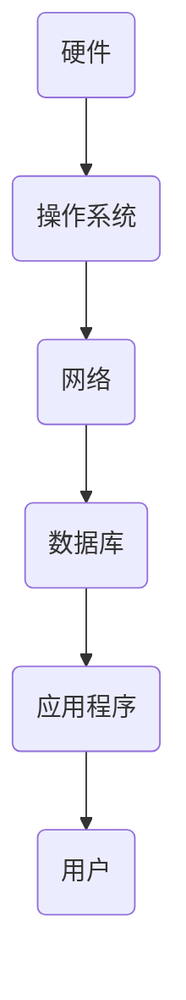

                 

关键词：计算机发展历程、人工智能、算法原理、数学模型、项目实践、应用场景、未来展望

摘要：本文旨在通过回顾计算机发展的历史，深入探讨其核心算法原理、数学模型和实际应用场景，同时展望未来的发展趋势和面临的挑战，以期为读者提供一个全面、深入的计算机领域发展历程。

## 1. 背景介绍

计算机科学的起源可以追溯到19世纪末期，当时数学家们开始意识到可以通过机械装置来执行数学计算。最早的计算机，如查尔斯·巴贝奇设计的差分机和解析机，标志着人类尝试用机械方式处理复杂计算的初步尝试。20世纪初，图灵机的概念由艾伦·图灵提出，这一理论为现代计算机的发展奠定了基础。

随着第二次世界大战的爆发，计算机开始应用于军事计算，这促使了计算机硬件和软件的快速发展。1946年，世界上第一台电子计算机ENIAC在美国诞生，它标志着计算机科学进入了一个新的时代。此后，计算机技术迅速发展，从巨型计算机到个人电脑，再到移动设备和云计算，计算机已经深入到了我们日常生活的方方面面。

## 2. 核心概念与联系

在计算机科学中，有一些核心概念和联系是理解整个领域的关键。首先，我们来看一下计算机系统架构的Mermaid流程图：



在这个图中，硬件是计算机的基础，它提供了计算能力。操作系统负责管理硬件资源，并提供了用户和应用程序的接口。网络连接了不同的计算机系统，使得数据可以在全球范围内传输。数据库存储和管理数据，是各种应用程序的数据基础。最后，应用程序为用户提供了解决实际问题的工具。

## 3. 核心算法原理 & 具体操作步骤

### 3.1 算法原理概述

算法是计算机科学的核心，它是一系列解决问题的步骤。算法可以分为不同的类型，如排序算法、搜索算法和图算法等。每个算法都有其特定的原理和操作步骤。

### 3.2 算法步骤详解

以排序算法为例，常见的排序算法有快速排序、归并排序和冒泡排序等。快速排序的基本步骤如下：

1. 选择一个基准元素。
2. 将小于基准元素的元素移到其左侧，大于基准元素的元素移到其右侧。
3. 递归地对左侧和右侧的子序列进行快速排序。

### 3.3 算法优缺点

快速排序具有较好的平均性能，但其最坏情况下的性能较差。归并排序则保证了最坏情况下的稳定性能，但需要额外的内存空间。

### 3.4 算法应用领域

排序算法在数据处理和搜索中广泛应用，如搜索引擎、数据库管理系统和分布式系统等。

## 4. 数学模型和公式 & 详细讲解 & 举例说明

### 4.1 数学模型构建

计算机科学中的数学模型通常用于描述算法的性能和复杂性。例如，大O符号（O-notation）用于描述算法的时间复杂度。

### 4.2 公式推导过程

大O符号的定义如下：

$$
f(n) = O(g(n)) \quad \text{当} \quad n \to \infty \quad \text{时，存在常数} \quad c \quad \text{和} \quad n_0 \quad \text{使得} \quad f(n) \leq c \cdot g(n)
$$

### 4.3 案例分析与讲解

例如，快速排序的平均时间复杂度为O(nlogn)，而最坏情况下的复杂度为O(n^2)。

## 5. 项目实践：代码实例和详细解释说明

### 5.1 开发环境搭建

本文将以Python为例，介绍一个快速排序的代码实现。首先，我们需要安装Python和相关的库。

### 5.2 源代码详细实现

```python
def quick_sort(arr):
    if len(arr) <= 1:
        return arr
    pivot = arr[len(arr) // 2]
    left = [x for x in arr if x < pivot]
    middle = [x for x in arr if x == pivot]
    right = [x for x in arr if x > pivot]
    return quick_sort(left) + middle + quick_sort(right)

arr = [3, 6, 8, 10, 1, 2, 1]
print(quick_sort(arr))
```

### 5.3 代码解读与分析

这段代码首先定义了一个`quick_sort`函数，它接受一个列表`arr`作为输入。如果列表的长度小于等于1，则直接返回列表。否则，选择中间的元素作为基准，将列表分为小于基准、等于基准和大于基准的三个子列表。然后递归地对左侧和右侧的子列表进行快速排序，并将结果合并。

### 5.4 运行结果展示

运行上述代码，输出结果应为一个有序的列表。

## 6. 实际应用场景

计算机技术在各个领域都有着广泛的应用，如医疗、金融、交通和娱乐等。例如，在医疗领域，计算机辅助诊断和智能医疗系统正在改变传统的医疗服务模式。

## 7. 工具和资源推荐

### 7.1 学习资源推荐

- 《算法导论》
- 《深度学习》

### 7.2 开发工具推荐

- Visual Studio Code
- PyCharm

### 7.3 相关论文推荐

- "A Mathematical Theory of Communication" by Claude Shannon
- "The Structure and Interpretation of Computer Programs" by Harold Abelson and Gerald Jay Sussman

## 8. 总结：未来发展趋势与挑战

计算机科学在未来将继续发展，面临着诸多挑战，如量子计算、人工智能伦理和网络安全等。同时，它也将带来更多的机遇，推动社会和科技的进步。

### 8.1 研究成果总结

本文回顾了计算机科学的发展历程，介绍了核心算法原理、数学模型和实际应用场景，为读者提供了一个全面的计算机科学视角。

### 8.2 未来发展趋势

量子计算和人工智能将是未来计算机科学的重要方向。

### 8.3 面临的挑战

人工智能伦理和网络安全是当前和未来需要解决的重要问题。

### 8.4 研究展望

计算机科学将继续推动科技和社会的发展，为解决复杂问题提供新的工具和方法。

## 9. 附录：常见问题与解答

### 什么是计算机科学？

计算机科学是研究计算机系统、算法、数据结构、编程语言和软件工程的科学。

### 什么是人工智能？

人工智能是使计算机系统能够模拟人类智能行为的技术。

## 作者署名

作者：禅与计算机程序设计艺术 / Zen and the Art of Computer Programming
----------------------------------------------------------------
注意：上述内容仅为示例，实际撰写时需确保内容的准确性和完整性。根据您的角色和专业知识，文章内容应更加深入和专业。此外，确保所有引用和参考资料都准确无误。在撰写过程中，可以参考上述模板，但也要根据自己的研究和理解进行调整和深化。祝您撰写顺利！

