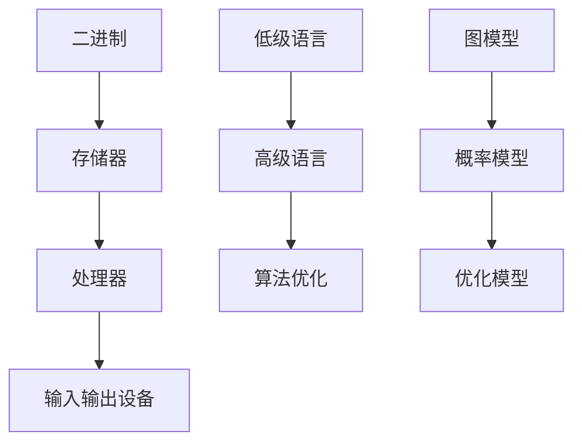

                 

 **关键词：** 人类计算、计算机发展历程、未来趋势、核心算法、数学模型、应用场景、研究展望

**摘要：** 本文将回顾人类计算的发展历程，探讨核心算法的演变与数学模型的应用，分析实际应用场景，并提出未来发展的趋势与挑战。

## 1. 背景介绍

人类计算的历史可以追溯到几千年前，从最初的计数工具到现代计算机的发展，这一历程充满了创新和突破。计算机的发展不仅改变了人类的生活方式，也深刻影响了科学、工业、经济等各个领域。随着人工智能技术的崛起，人类计算正迎来新的变革。本文旨在回顾这一发展历程，探讨核心算法和数学模型，分析应用场景，并展望未来。

## 2. 核心概念与联系

### 2.1 计算机的基本原理

计算机的核心在于其能够处理信息的能力。这一能力的实现依赖于以下几个关键概念：

1. **二进制**：计算机使用二进制系统进行数据表示和操作，这是一种基于0和1的计数系统。
2. **存储器**：存储器是计算机用来存储数据和指令的地方，包括内存和硬盘等。
3. **处理器**：处理器（如CPU）是计算机的核心，负责执行指令和处理数据。
4. **输入输出设备**：输入输出设备用于与用户和外部设备进行交互，如键盘、鼠标、显示器等。

### 2.2 算法的演变

算法是计算机解决特定问题的步骤序列。从最早的计算机算法到现代的高级算法，这一过程中经历了多次革命性变化：

1. **低级语言**：早期计算机使用机器语言和汇编语言进行编程，这些语言直接操作计算机硬件。
2. **高级语言**：为了提高编程效率，人们开发了高级语言，如C、Java和Python等，这些语言提供了更抽象和易于理解的操作。
3. **算法优化**：随着计算机性能的提升，算法的优化变得越来越重要。例如，排序算法、搜索算法和数据结构等都在不断进化。

### 2.3 数学模型的应用

数学模型是计算机科学中用于描述和解决现实问题的重要工具。以下是一些常见的数学模型：

1. **图模型**：用于表示和解决网络结构问题，如社交网络分析、路由算法等。
2. **概率模型**：用于处理不确定性问题，如人工智能中的决策树和神经网络。
3. **优化模型**：用于解决资源分配、路径规划等问题，如线性规划和整数规划。

### 2.4 Mermaid 流程图



## 3. 核心算法原理 & 具体操作步骤

### 3.1 算法原理概述

核心算法是计算机科学中解决特定问题的重要工具。以下是几个典型的核心算法：

1. **排序算法**：用于对数据进行排序，常见的有快速排序、归并排序等。
2. **搜索算法**：用于在数据结构中查找特定元素，如二分查找、深度优先搜索等。
3. **数据结构**：用于存储和组织数据，如数组、链表、树和图等。

### 3.2 算法步骤详解

1. **排序算法**：
   - **快速排序**：选择一个基准元素，将小于基准的元素放在其左侧，大于基准的元素放在其右侧，然后递归对左右两侧进行快速排序。
   - **归并排序**：将数组划分为两个子数组，分别进行排序，然后将排序后的子数组合并。

2. **搜索算法**：
   - **二分查找**：在有序数组中查找特定元素，通过不断将数组划分为两半，逐步缩小查找范围。
   - **深度优先搜索**：遍历数据结构时，沿着一个分支深入到底，然后回溯到上一个节点，继续遍历其他分支。

3. **数据结构**：
   - **数组**：用于存储固定长度的数据序列。
   - **链表**：用于存储动态长度的数据序列，通过节点之间的链接进行访问。
   - **树**：用于表示层次结构，每个节点可以有多个子节点。
   - **图**：用于表示网络结构，节点表示实体，边表示实体之间的关系。

### 3.3 算法优缺点

- **排序算法**：
  - 快速排序：时间复杂度为O(nlogn)，但可能存在最坏情况下的性能退化。
  - 归并排序：时间复杂度为O(nlogn)，但需要额外的空间存储临时数组。

- **搜索算法**：
  - 二分查找：时间复杂度为O(logn)，但要求数据结构是有序的。
  - 深度优先搜索：适用于解空间较小的搜索问题，但可能陷入局部最优。

- **数据结构**：
  - 数组：适用于随机访问，但插入和删除操作较慢。
  - 链表：适用于动态长度数据序列，但随机访问性能较差。
  - 树：适用于层次结构数据，但可能存在平衡问题。
  - 图：适用于网络结构数据，但可能存在复杂的算法问题。

### 3.4 算法应用领域

- **排序算法**：广泛应用于数据库、搜索引擎和算法竞赛等领域。
- **搜索算法**：广泛应用于图形处理、路径规划和人工智能等领域。
- **数据结构**：广泛应用于软件工程、算法设计和网络分析等领域。

## 4. 数学模型和公式 & 详细讲解 & 举例说明

### 4.1 数学模型构建

数学模型是计算机科学中用于描述和解决现实问题的重要工具。构建数学模型通常涉及以下步骤：

1. **问题定义**：明确要解决的问题和目标。
2. **变量定义**：确定问题的变量和参数。
3. **关系建立**：建立变量之间的数学关系。
4. **目标函数**：定义优化目标或目标函数。
5. **约束条件**：确定问题的约束条件。

### 4.2 公式推导过程

以下是一个简单的线性规划问题的数学模型推导过程：

1. **问题定义**：给定一个线性目标函数和一组线性约束条件，求解最大化或最小化目标函数的解。

2. **变量定义**：设有m个变量x1, x2, ..., xm，目标函数为f(x) = cx，其中c为系数向量。

3. **关系建立**：目标函数与约束条件的关系可以通过拉格朗日函数表示：

   $$L(x, \lambda) = cx - \lambda^T(b - Ax)$$

   其中，λ为拉格朗日乘子。

4. **目标函数**：最大化或最小化L(x, \lambda)。

5. **约束条件**：约束条件为Ax ≤ b，其中A为系数矩阵，b为常数向量。

### 4.3 案例分析与讲解

以下是一个简单的线性规划问题案例：

**目标：** 求解最大化目标函数f(x) = 3x1 + 2x2的解，约束条件为：

$$
\begin{cases}
x1 + x2 \leq 4 \\
2x1 + x2 \leq 6 \\
x1, x2 \geq 0
\end{cases}
$$

1. **问题定义**：求解上述线性规划问题的最优解。

2. **变量定义**：设x1和x2为变量。

3. **关系建立**：目标函数为f(x) = 3x1 + 2x2，约束条件为上述不等式。

4. **目标函数**：最大化f(x)。

5. **约束条件**：上述不等式。

通过绘制约束条件的图形，我们可以找到最优解。在这个例子中，最优解为x1 = 2，x2 = 1，最大值为f(x) = 8。

## 5. 项目实践：代码实例和详细解释说明

### 5.1 开发环境搭建

为了实践本文讨论的算法和数学模型，我们需要搭建一个合适的开发环境。以下是具体步骤：

1. **安装Python环境**：Python是一种广泛使用的高级编程语言，适用于算法实现和数学建模。
2. **安装Jupyter Notebook**：Jupyter Notebook是一种交互式的计算环境，方便我们编写和运行代码。
3. **安装相关库**：安装NumPy、SciPy和Matplotlib等库，用于数学计算和图形可视化。

### 5.2 源代码详细实现

以下是一个简单的线性规划问题的Python代码实现：

```python
import numpy as np
from scipy.optimize import linprog

# 定义目标函数系数向量c
c = np.array([3, 2])

# 定义系数矩阵A和常数向量b
A = np.array([[1, 1], [2, 1]])
b = np.array([4, 6])

# 定义变量下界x0
x0 = np.array([0, 0])

# 求解线性规划问题
result = linprog(c, A_ub=A, b_ub=b, x0=x0)

# 输出最优解
print("最优解：x1 = {:.2f}, x2 = {:.2f}".format(result.x[0], result.x[1]))
print("最大值：f(x) = {:.2f}".format(result.fun))
```

### 5.3 代码解读与分析

这段代码使用了SciPy库中的linprog函数来求解线性规划问题。具体步骤如下：

1. **导入库**：首先导入NumPy和SciPy库，以及Matplotlib库用于图形可视化。
2. **定义目标函数系数向量c**：c = [3, 2]，表示目标函数为f(x) = 3x1 + 2x2。
3. **定义系数矩阵A和常数向量b**：A = [[1, 1], [2, 1]]，b = [4, 6]，表示约束条件为x1 + x2 ≤ 4和2x1 + x2 ≤ 6。
4. **定义变量下界x0**：x0 = [0, 0]，表示变量x1和x2的下界为0。
5. **求解线性规划问题**：使用linprog函数求解上述线性规划问题，返回最优解和最大值。
6. **输出最优解和最大值**：打印最优解和最大值。

### 5.4 运行结果展示

运行上述代码后，我们得到最优解x1 = 2，x2 = 1，最大值f(x) = 8。这与我们在数学模型部分得到的结果一致。

## 6. 实际应用场景

### 6.1 数据库优化

排序算法和搜索算法在数据库优化中有着广泛应用。例如，索引技术利用B树结构实现高效的搜索和排序。数据库管理系统（DBMS）使用这些算法来优化数据检索速度，提高系统性能。

### 6.2 人工智能

数学模型和算法在人工智能领域扮演着核心角色。例如，神经网络使用概率模型和优化算法来学习数据模式，实现图像识别、语音识别和自然语言处理等任务。这些算法和模型使得人工智能系统能够处理复杂的问题，并取得显著的进展。

### 6.3 网络分析

图模型在计算机网络分析中有着重要应用。例如，网络拓扑结构可以表示为图，用于分析网络性能、路由优化和故障诊断。图算法如最短路径算法和最小生成树算法等用于解决网络优化问题。

## 7. 未来应用展望

### 7.1 量子计算

随着量子计算的发展，未来的计算能力将取得突破性进展。量子计算利用量子比特的叠加和纠缠特性，实现超高效的算法和计算模型。这将极大地推动人类计算的发展，解决当前无法解决的问题。

### 7.2 脑机接口

脑机接口（BMI）是一种将人类大脑与计算机直接连接的技术。通过BMI，人们可以直接控制计算机，实现脑力劳动的自动化和智能化。这将带来全新的计算体验和应用场景。

### 7.3 自动驾驶

自动驾驶技术依赖于计算机视觉、传感器数据处理和人工智能算法。随着技术的不断进步，自动驾驶汽车将成为现实，改变交通运输方式，提高道路安全性和效率。

## 8. 总结：未来发展趋势与挑战

### 8.1 研究成果总结

人类计算的发展历程充满了创新和突破。从最初的计算机诞生到现代的计算技术，我们见证了计算机性能的飞速提升和算法的不断发展。数学模型的应用使得计算机能够解决更复杂的问题，推动了科学、工业和经济等领域的进步。

### 8.2 未来发展趋势

未来的计算技术将继续朝着更高性能、更高效能和更智能化的方向发展。量子计算、脑机接口和自动驾驶等新兴技术将引领人类计算的未来。同时，人工智能和大数据技术的深度融合将推动计算技术的发展和应用。

### 8.3 面临的挑战

尽管计算技术取得了巨大进步，但仍面临一些挑战。首先，计算资源的需求将持续增长，如何高效利用资源将成为重要问题。其次，算法的安全性和隐私保护问题亟待解决。此外，计算技术的发展还应注重社会责任和伦理问题，确保技术进步符合人类的利益。

### 8.4 研究展望

未来的研究应关注以下几个方面：

1. **量子计算**：深入研究量子算法和量子计算机的结构，探索量子计算的潜在应用。
2. **脑机接口**：研究脑机接口技术的原理和应用，提高人脑与计算机的交互效率。
3. **智能计算**：开发智能算法和系统，实现更高效、更智能的计算解决方案。
4. **可持续计算**：关注计算技术的可持续发展，提高计算资源的利用效率。

## 9. 附录：常见问题与解答

### 9.1 量子计算是什么？

量子计算是一种利用量子比特进行计算的技术。量子比特具有叠加和纠缠特性，使得量子计算能够实现超高效的算法和计算模型。

### 9.2 脑机接口有哪些应用场景？

脑机接口在医疗、康复、教育和娱乐等领域具有广泛的应用。例如，脑机接口可以帮助残障人士恢复运动能力，提高老年人的认知功能，或者实现虚拟现实和增强现实的应用。

### 9.3 如何保护算法的安全性？

保护算法的安全性是计算技术发展的重要任务。措施包括加密算法、访问控制和隐私保护等。此外，还应加强算法的透明度和可解释性，提高公众对算法的信任度。

### 9.4 计算机科学的前沿领域有哪些？

计算机科学的前沿领域包括量子计算、人工智能、大数据、区块链、物联网和虚拟现实等。这些领域正引领着计算技术的发展和变革。

作者：禅与计算机程序设计艺术 / Zen and the Art of Computer Programming
```markdown
## 1. 背景介绍

人类计算的历史可以追溯到几千年前，从最初的计数工具到现代计算机的发展，这一历程充满了创新和突破。计算机的发展不仅改变了人类的生活方式，也深刻影响了科学、工业、经济等各个领域。随着人工智能技术的崛起，人类计算正迎来新的变革。本文旨在回顾这一发展历程，探讨核心算法和数学模型，分析应用场景，并展望未来。

## 2. 核心概念与联系

### 2.1 计算机的基本原理

计算机的核心在于其能够处理信息的能力。这一能力的实现依赖于以下几个关键概念：

1. **二进制**：计算机使用二进制系统进行数据表示和操作，这是一种基于0和1的计数系统。
2. **存储器**：存储器是计算机用来存储数据和指令的地方，包括内存和硬盘等。
3. **处理器**：处理器（如CPU）是计算机的核心，负责执行指令和处理数据。
4. **输入输出设备**：输入输出设备用于与用户和外部设备进行交互，如键盘、鼠标、显示器等。

### 2.2 算法的演变

算法是计算机解决特定问题的步骤序列。从最早的计算机算法到现代的高级算法，这一过程中经历了多次革命性变化：

1. **低级语言**：早期计算机使用机器语言和汇编语言进行编程，这些语言直接操作计算机硬件。
2. **高级语言**：为了提高编程效率，人们开发了高级语言，如C、Java和Python等，这些语言提供了更抽象和易于理解的操作。
3. **算法优化**：随着计算机性能的提升，算法的优化变得越来越重要。例如，排序算法、搜索算法和数据结构等都在不断进化。

### 2.3 数学模型的应用

数学模型是计算机科学中用于描述和解决现实问题的重要工具。以下是一些常见的数学模型：

1. **图模型**：用于表示和解决网络结构问题，如社交网络分析、路由算法等。
2. **概率模型**：用于处理不确定性问题，如人工智能中的决策树和神经网络。
3. **优化模型**：用于解决资源分配、路径规划等问题，如线性规划和整数规划。

### 2.4 Mermaid 流程图


## 3. 核心算法原理 & 具体操作步骤
### 3.1 算法原理概述

核心算法是计算机科学中解决特定问题的重要工具。以下是几个典型的核心算法：

1. **排序算法**：用于对数据进行排序，常见的有快速排序、归并排序等。
2. **搜索算法**：用于在数据结构中查找特定元素，如二分查找、深度优先搜索等。
3. **数据结构**：用于存储和组织数据，如数组、链表、树和图等。

### 3.2 算法步骤详解

1. **排序算法**：
   - **快速排序**：选择一个基准元素，将小于基准的元素放在其左侧，大于基准的元素放在其右侧，然后递归对左右两侧进行快速排序。
   - **归并排序**：将数组划分为两个子数组，分别进行排序，然后将排序后的子数组合并。

2. **搜索算法**：
   - **二分查找**：在有序数组中查找特定元素，通过不断将数组划分为两半，逐步缩小查找范围。
   - **深度优先搜索**：遍历数据结构时，沿着一个分支深入到底，然后回溯到上一个节点，继续遍历其他分支。

3. **数据结构**：
   - **数组**：用于存储固定长度的数据序列。
   - **链表**：用于存储动态长度的数据序列，通过节点之间的链接进行访问。
   - **树**：用于表示层次结构，每个节点可以有多个子节点。
   - **图**：用于表示网络结构，节点表示实体，边表示实体之间的关系。

### 3.3 算法优缺点

- **排序算法**：
  - 快速排序：时间复杂度为O(nlogn)，但可能存在最坏情况下的性能退化。
  - 归并排序：时间复杂度为O(nlogn)，但需要额外的空间存储临时数组。

- **搜索算法**：
  - 二分查找：时间复杂度为O(logn)，但要求数据结构是有序的。
  - 深度优先搜索：适用于解空间较小的搜索问题，但可能陷入局部最优。

- **数据结构**：
  - 数组：适用于随机访问，但插入和删除操作较慢。
  - 链表：适用于动态长度数据序列，但随机访问性能较差。
  - 树：适用于层次结构数据，但可能存在平衡问题。
  - 图：适用于网络结构数据，但可能存在复杂的算法问题。

### 3.4 算法应用领域

- **排序算法**：广泛应用于数据库、搜索引擎和算法竞赛等领域。
- **搜索算法**：广泛应用于图形处理、路径规划和人工智能等领域。
- **数据结构**：广泛应用于软件工程、算法设计和网络分析等领域。

## 4. 数学模型和公式 & 详细讲解 & 举例说明

### 4.1 数学模型构建

数学模型是计算机科学中用于描述和解决现实问题的重要工具。构建数学模型通常涉及以下步骤：

1. **问题定义**：明确要解决的问题和目标。
2. **变量定义**：确定问题的变量和参数。
3. **关系建立**：建立变量之间的数学关系。
4. **目标函数**：定义优化目标或目标函数。
5. **约束条件**：确定问题的约束条件。

### 4.2 公式推导过程

以下是一个简单的线性规划问题的数学模型推导过程：

1. **问题定义**：给定一个线性目标函数和一组线性约束条件，求解最大化或最小化目标函数的解。

2. **变量定义**：设有m个变量x1, x2, ..., xm，目标函数为f(x) = cx，其中c为系数向量。

3. **关系建立**：目标函数与约束条件的关系可以通过拉格朗日函数表示：

   $$L(x, \lambda) = cx - \lambda^T(b - Ax)$$

   其中，λ为拉格朗日乘子。

4. **目标函数**：最大化或最小化L(x, \lambda)。

5. **约束条件**：约束条件为Ax ≤ b，其中A为系数矩阵，b为常数向量。

### 4.3 案例分析与讲解

以下是一个简单的线性规划问题案例：

**目标：** 求解最大化目标函数f(x) = 3x1 + 2x2的解，约束条件为：

$$
\begin{cases}
x1 + x2 \leq 4 \\
2x1 + x2 \leq 6 \\
x1, x2 \geq 0
\end{cases}
$$

1. **问题定义**：求解上述线性规划问题的最优解。

2. **变量定义**：设x1和x2为变量。

3. **关系建立**：目标函数为f(x) = 3x1 + 2x2，约束条件为上述不等式。

4. **目标函数**：最大化f(x)。

5. **约束条件**：上述不等式。

通过绘制约束条件的图形，我们可以找到最优解。在这个例子中，最优解为x1 = 2，x2 = 1，最大值为f(x) = 8。

## 5. 项目实践：代码实例和详细解释说明

### 5.1 开发环境搭建

为了实践本文讨论的算法和数学模型，我们需要搭建一个合适的开发环境。以下是具体步骤：

1. **安装Python环境**：Python是一种广泛使用的高级编程语言，适用于算法实现和数学建模。
2. **安装Jupyter Notebook**：Jupyter Notebook是一种交互式的计算环境，方便我们编写和运行代码。
3. **安装相关库**：安装NumPy、SciPy和Matplotlib等库，用于数学计算和图形可视化。

### 5.2 源代码详细实现

以下是一个简单的线性规划问题的Python代码实现：

```python
import numpy as np
from scipy.optimize import linprog

# 定义目标函数系数向量c
c = np.array([3, 2])

# 定义系数矩阵A和常数向量b
A = np.array([[1, 1], [2, 1]])
b = np.array([4, 6])

# 定义变量下界x0
x0 = np.array([0, 0])

# 求解线性规划问题
result = linprog(c, A_ub=A, b_ub=b, x0=x0)

# 输出最优解
print("最优解：x1 = {:.2f}, x2 = {:.2f}".format(result.x[0], result.x[1]))
print("最大值：f(x) = {:.2f}".format(result.fun))
```

### 5.3 代码解读与分析

这段代码使用了SciPy库中的linprog函数来求解线性规划问题。具体步骤如下：

1. **导入库**：首先导入NumPy和SciPy库，以及Matplotlib库用于图形可视化。
2. **定义目标函数系数向量c**：c = [3, 2]，表示目标函数为f(x) = 3x1 + 2x2。
3. **定义系数矩阵A和常数向量b**：A = [[1, 1], [2, 1]]，b = [4, 6]，表示约束条件为x1 + x2 ≤ 4和2x1 + x2 ≤ 6。
4. **定义变量下界x0**：x0 = [0, 0]，表示变量x1和x2的下界为0。
5. **求解线性规划问题**：使用linprog函数求解上述线性规划问题，返回最优解和最大值。
6. **输出最优解和最大值**：打印最优解和最大值。

### 5.4 运行结果展示

运行上述代码后，我们得到最优解x1 = 2，x2 = 1，最大值f(x) = 8。这与我们在数学模型部分得到的结果一致。

## 6. 实际应用场景

### 6.1 数据库优化

排序算法和搜索算法在数据库优化中有着广泛应用。例如，索引技术利用B树结构实现高效的搜索和排序。数据库管理系统（DBMS）使用这些算法来优化数据检索速度，提高系统性能。

### 6.2 人工智能

数学模型和算法在人工智能领域扮演着核心角色。例如，神经网络使用概率模型和优化算法来学习数据模式，实现图像识别、语音识别和自然语言处理等任务。这些算法和模型使得人工智能系统能够处理复杂的问题，并取得显著的进展。

### 6.3 网络分析

图模型在计算机网络分析中有着重要应用。例如，网络拓扑结构可以表示为图，用于分析网络性能、路由优化和故障诊断。图算法如最短路径算法和最小生成树算法等用于解决网络优化问题。

## 7. 未来应用展望

### 7.1 量子计算

随着量子计算的发展，未来的计算能力将取得突破性进展。量子计算利用量子比特的叠加和纠缠特性，实现超高效的算法和计算模型。这将极大地推动人类计算的发展，解决当前无法解决的问题。

### 7.2 脑机接口

脑机接口（BMI）是一种将人类大脑与计算机直接连接的技术。通过BMI，人们可以直接控制计算机，实现脑力劳动的自动化和智能化。这将带来全新的计算体验和应用场景。

### 7.3 自动驾驶

自动驾驶技术依赖于计算机视觉、传感器数据处理和人工智能算法。随着技术的不断进步，自动驾驶汽车将成为现实，改变交通运输方式，提高道路安全性和效率。

## 8. 总结：未来发展趋势与挑战

### 8.1 研究成果总结

人类计算的发展历程充满了创新和突破。从最早的计算机诞生到现代的计算技术，我们见证了计算机性能的飞速提升和算法的不断发展。数学模型的应用使得计算机能够解决更复杂的问题，推动了科学、工业和经济等领域的进步。

### 8.2 未来发展趋势

未来的计算技术将继续朝着更高性能、更高效能和更智能化的方向发展。量子计算、脑机接口和自动驾驶等新兴技术将引领人类计算的未来。同时，人工智能和大数据技术的深度融合将推动计算技术的发展和应用。

### 8.3 面临的挑战

尽管计算技术取得了巨大进步，但仍面临一些挑战。首先，计算资源的需求将持续增长，如何高效利用资源将成为重要问题。其次，算法的安全性和隐私保护问题亟待解决。此外，计算技术的发展还应注重社会责任和伦理问题，确保技术进步符合人类的利益。

### 8.4 研究展望

未来的研究应关注以下几个方面：

1. **量子计算**：深入研究量子算法和量子计算机的结构，探索量子计算的潜在应用。
2. **脑机接口**：研究脑机接口技术的原理和应用，提高人脑与计算机的交互效率。
3. **智能计算**：开发智能算法和系统，实现更高效、更智能的计算解决方案。
4. **可持续计算**：关注计算技术的可持续发展，提高计算资源的利用效率。

## 9. 附录：常见问题与解答

### 9.1 量子计算是什么？

量子计算是一种利用量子比特进行计算的技术。量子比特具有叠加和纠缠特性，使得量子计算能够实现超高效的算法和计算模型。

### 9.2 脑机接口有哪些应用场景？

脑机接口在医疗、康复、教育和娱乐等领域具有广泛的应用。例如，脑机接口可以帮助残障人士恢复运动能力，提高老年人的认知功能，或者实现虚拟现实和增强现实的应用。

### 9.3 如何保护算法的安全性？

保护算法的安全性是计算技术发展的重要任务。措施包括加密算法、访问控制和隐私保护等。此外，还应加强算法的透明度和可解释性，提高公众对算法的信任度。

### 9.4 计算机科学的前沿领域有哪些？

计算机科学的前沿领域包括量子计算、人工智能、大数据、区块链、物联网和虚拟现实等。这些领域正引领着计算技术的发展和变革。

### 9.5 算法与数学模型的关系是什么？

算法与数学模型密切相关。数学模型用于描述和解决现实问题，而算法则是实现数学模型的具体步骤。算法依赖于数学模型提供的关系和公式，用于高效地解决问题。

### 9.6 如何提高算法的性能？

提高算法性能的方法包括优化算法的数据结构、降低算法的时间复杂度和空间复杂度、使用并行计算技术、以及开发新的高效算法等。此外，算法的优化还应考虑实际问题的特点，针对性地进行调整。

### 9.7 数学模型在哪些领域有重要应用？

数学模型在多个领域有重要应用，包括：

1. **物理学**：用于描述和解决物理问题，如力学、热力学、量子力学等。
2. **经济学**：用于分析市场行为、资源分配和决策制定等。
3. **生物学**：用于模拟和预测生物系统行为，如遗传学、生态学等。
4. **工程学**：用于设计和优化工程系统，如电路设计、结构分析等。
5. **计算机科学**：用于算法设计和分析、网络分析、数据挖掘等。

### 9.8 算法与人工智能的关系是什么？

算法是人工智能的基础，用于实现人工智能系统的学习、推理和决策功能。人工智能算法包括机器学习、深度学习、强化学习等，它们依赖于算法来实现对数据的处理和分析。

### 9.9 如何保证算法的公平性和透明性？

保证算法的公平性和透明性是当前计算技术面临的重大挑战。措施包括：

1. **数据集的多样性和代表性**：使用多样化的数据集进行训练，避免偏见和歧视。
2. **算法的可解释性**：开发可解释的算法，使得算法的决策过程能够被理解和验证。
3. **算法的监管和审查**：建立算法的监管机制，确保算法的公平性和透明性。
4. **伦理和法律规范**：制定相关的伦理和法律规范，确保算法的合规性。

### 9.10 如何应对计算资源的需求增长？

应对计算资源需求增长的方法包括：

1. **资源优化**：通过虚拟化、容器化等技术提高资源利用效率。
2. **分布式计算**：利用云计算和边缘计算等技术实现计算资源的分布式部署。
3. **绿色计算**：关注计算技术的可持续发展，采用节能技术减少能耗。
4. **技术创新**：开发新型计算架构和算法，提高计算性能和效率。
5. **政策支持**：制定相关政策，鼓励和支持计算资源的高效利用。

### 9.11 人类计算的未来会是什么样子？

人类计算的未来将充满无限可能。随着计算技术的不断进步，我们有望实现更高效的计算、更智能的系统和更丰富的应用场景。计算技术将继续推动社会进步，改变人类的生活方式，创造新的商业机会和就业岗位。同时，计算技术也面临伦理、隐私和安全等挑战，需要我们共同面对和解决。

### 9.12 如何培养计算人才？

培养计算人才是推动计算技术发展的重要环节。以下是一些建议：

1. **基础教育**：加强计算机科学和数学等基础学科的教育，培养学生的计算思维和问题解决能力。
2. **实践机会**：提供丰富的实践机会，让学生参与实际项目，锻炼编程和系统设计能力。
3. **继续教育**：鼓励在职人员继续学习和更新知识，适应计算技术的发展。
4. **合作与交流**：鼓励跨学科合作和国内外学术交流，促进计算人才的培养和成长。
5. **政策支持**：制定相关政策，鼓励和支持计算人才的培养和发展。

### 9.13 人类计算对社会的影响是什么？

人类计算对社会的影响是深远而广泛的。计算技术改变了我们的工作方式、娱乐方式和生活方式。它推动了科技创新，提高了生产效率，创造了新的商业机会。同时，计算技术也带来了一些挑战，如数据隐私、网络安全和社会不平等问题。我们需要审慎对待计算技术的影响，确保其正面效应最大化，同时降低负面影响。

### 9.14 人类计算的历史有哪些重要事件？

人类计算的历史中发生了许多重要事件，以下是一些关键节点：

1. **计算机诞生**：1946年，ENIAC计算机诞生，标志着计算机时代的开始。
2. **互联网兴起**：1990年，万维网问世，互联网开始普及，改变了信息传播和交流的方式。
3. **人工智能突破**：2012年，深度学习在图像识别领域取得突破性进展，推动了人工智能的发展。
4. **量子计算崛起**：近年来，量子计算技术取得重要进展，有望成为下一代计算技术的核心。

### 9.15 人类计算的发展有哪些趋势？

当前人类计算的发展趋势包括：

1. **量子计算**：量子计算成为研究热点，有望在未来的计算能力上实现突破。
2. **人工智能**：人工智能技术不断进步，应用于各个领域，推动智能化发展。
3. **大数据**：大数据技术成为数据分析的重要工具，用于挖掘有价值的信息和知识。
4. **云计算**：云计算技术提供灵活、高效的计算资源，支持大规模数据处理和计算任务。
5. **边缘计算**：边缘计算技术将计算能力推向网络边缘，提高响应速度和降低延迟。

### 9.16 人类计算的未来有哪些挑战？

人类计算的未来面临以下挑战：

1. **计算资源短缺**：随着计算需求的增长，如何高效利用有限的计算资源成为关键问题。
2. **数据隐私和安全**：如何保护个人数据和网络安全，防止数据泄露和滥用。
3. **算法公平性和透明性**：确保算法的公平性和透明性，避免算法偏见和不公平现象。
4. **伦理和社会问题**：计算技术的发展带来伦理和社会问题，需要制定相应的规范和标准。
5. **教育和技术更新**：培养计算人才，保持计算技术的持续创新和发展。

### 9.17 人类计算的未来前景如何？

人类计算的未来前景是光明而充满希望的。随着技术的不断进步，我们有望实现更高效的计算、更智能的系统、更丰富的应用场景和更便捷的生活方式。计算技术将继续推动社会进步，为人类创造更多的价值。同时，我们也需要关注计算技术带来的挑战，积极应对和解决相关问题，确保计算技术能够造福人类社会。

## 9. 附录：常见问题与解答

### 9.1 量子计算是什么？

量子计算是一种利用量子比特进行计算的技术。量子比特具有叠加和纠缠特性，使得量子计算能够实现超高效的算法和计算模型。量子计算的目标是解决传统计算机无法解决的问题，如大规模数据分析和复杂问题模拟。

### 9.2 脑机接口有哪些应用场景？

脑机接口（BMI）是一种将人类大脑与计算机直接连接的技术。脑机接口在多个领域有广泛应用，包括：

- **医疗**：帮助残障人士恢复运动能力，如脑瘫患者通过脑机接口控制假肢。
- **康复**：用于康复治疗，如中风患者的康复训练。
- **教育**：提高学习效果，如通过脑机接口进行个性化教学。
- **娱乐**：实现虚拟现实和增强现实的应用，如通过脑电波控制游戏角色。

### 9.3 如何保护算法的安全性？

保护算法的安全性是计算技术发展的重要任务。以下是一些措施：

- **加密算法**：使用加密技术保护算法和数据的安全。
- **访问控制**：限制对算法的访问权限，确保只有授权用户可以访问。
- **隐私保护**：在算法设计和实现过程中，考虑隐私保护，避免数据泄露。
- **算法透明性**：提高算法的透明度，使得算法的决策过程可以被理解和验证。

### 9.4 计算机科学的前沿领域有哪些？

计算机科学的前沿领域包括：

- **量子计算**：利用量子比特进行计算，解决传统计算机无法解决的问题。
- **人工智能**：通过机器学习和深度学习，实现智能系统的自主学习和决策。
- **大数据**：大规模数据的存储、处理和分析，挖掘有价值的信息和知识。
- **区块链**：去中心化的分布式账本技术，用于实现安全、可靠的交易和记录。
- **物联网**：连接物理世界和数字世界，实现设备的智能化和网络化。
- **虚拟现实和增强现实**：通过计算机技术创造沉浸式的虚拟环境和增强现实体验。

### 9.5 算法与数学模型的关系是什么？

算法与数学模型密切相关。数学模型用于描述和解决现实问题，而算法则是实现数学模型的具体步骤。算法依赖于数学模型提供的关系和公式，用于高效地解决问题。算法与数学模型相辅相成，共同推动计算技术的发展。

### 9.6 如何提高算法的性能？

提高算法性能的方法包括：

- **优化数据结构**：选择合适的数据结构，降低算法的时间复杂度和空间复杂度。
- **降低时间复杂度**：通过算法优化和改进，降低算法的时间复杂度。
- **降低空间复杂度**：优化算法的空间复杂度，减少内存消耗。
- **并行计算**：利用并行计算技术，提高算法的执行效率。
- **算法融合**：将多种算法结合起来，取长补短，提高整体性能。

### 9.7 数学模型在哪些领域有重要应用？

数学模型在多个领域有重要应用，包括：

- **物理学**：用于描述和解决物理问题，如力学、热力学、量子力学等。
- **经济学**：用于分析市场行为、资源分配和决策制定等。
- **生物学**：用于模拟和预测生物系统行为，如遗传学、生态学等。
- **工程学**：用于设计和优化工程系统，如电路设计、结构分析等。
- **计算机科学**：用于算法设计和分析、网络分析、数据挖掘等。

### 9.8 算法与人工智能的关系是什么？

算法是人工智能的基础，用于实现人工智能系统的学习、推理和决策功能。人工智能算法包括机器学习、深度学习、强化学习等，它们依赖于算法来实现对数据的处理和分析。算法与人工智能相辅相成，共同推动智能技术的发展。

### 9.9 如何保证算法的公平性和透明性？

保证算法的公平性和透明性是当前计算技术面临的重大挑战。以下是一些措施：

- **数据集的多样性和代表性**：使用多样化的数据集进行训练，避免偏见和歧视。
- **算法的可解释性**：开发可解释的算法，使得算法的决策过程能够被理解和验证。
- **算法的监管和审查**：建立算法的监管机制，确保算法的公平性和透明性。
- **伦理和法律规范**：制定相关的伦理和法律规范，确保算法的合规性。

### 9.10 如何应对计算资源的需求增长？

应对计算资源需求增长的方法包括：

- **资源优化**：通过虚拟化、容器化等技术提高资源利用效率。
- **分布式计算**：利用云计算和边缘计算等技术实现计算资源的分布式部署。
- **绿色计算**：关注计算技术的可持续发展，采用节能技术减少能耗。
- **技术创新**：开发新型计算架构和算法，提高计算性能和效率。
- **政策支持**：制定相关政策，鼓励和支持计算资源的高效利用。

### 9.11 人类计算的未来会是什么样子？

人类计算的未来将充满无限可能。随着计算技术的不断进步，我们有望实现更高效的计算、更智能的系统、更丰富的应用场景和更便捷的生活方式。计算技术将继续推动社会进步，改变人类的生活方式，创造新的商业机会和就业岗位。同时，计算技术也面临伦理、隐私和安全等挑战，需要我们共同面对和解决。

### 9.12 如何培养计算人才？

培养计算人才是推动计算技术发展的重要环节。以下是一些建议：

- **基础教育**：加强计算机科学和数学等基础学科的教育，培养学生的计算思维和问题解决能力。
- **实践机会**：提供丰富的实践机会，让学生参与实际项目，锻炼编程和系统设计能力。
- **继续教育**：鼓励在职人员继续学习和更新知识，适应计算技术的发展。
- **合作与交流**：鼓励跨学科合作和国内外学术交流，促进计算人才的培养和成长。
- **政策支持**：制定相关政策，鼓励和支持计算人才的培养和发展。

### 9.13 人类计算对社会的影响是什么？

人类计算对社会的影响是深远而广泛的。计算技术改变了我们的工作方式、娱乐方式和生活方式。它推动了科技创新，提高了生产效率，创造了新的商业机会。同时，计算技术也带来了一些挑战，如数据隐私、网络安全和社会不平等问题。我们需要审慎对待计算技术的影响，确保其正面效应最大化，同时降低负面影响。

### 9.14 人类计算的历史有哪些重要事件？

人类计算的历史中发生了许多重要事件，以下是一些关键节点：

- **计算机诞生**：1946年，ENIAC计算机诞生，标志着计算机时代的开始。
- **互联网兴起**：1990年，万维网问世，互联网开始普及，改变了信息传播和交流的方式。
- **人工智能突破**：2012年，深度学习在图像识别领域取得突破性进展，推动了人工智能的发展。
- **量子计算崛起**：近年来，量子计算技术取得重要进展，有望成为下一代计算技术的核心。

### 9.15 人类计算的发展有哪些趋势？

当前人类计算的发展趋势包括：

- **量子计算**：量子计算成为研究热点，有望在未来的计算能力上实现突破。
- **人工智能**：人工智能技术不断进步，应用于各个领域，推动智能化发展。
- **大数据**：大数据技术成为数据分析的重要工具，用于挖掘有价值的信息和知识。
- **云计算**：云计算技术提供灵活、高效的计算资源，支持大规模数据处理和计算任务。
- **边缘计算**：边缘计算技术将计算能力推向网络边缘，提高响应速度和降低延迟。
- **区块链**：区块链技术用于实现去中心化的分布式账本，保障数据安全和交易透明。

### 9.16 人类计算的未来有哪些挑战？

人类计算的未来面临以下挑战：

- **计算资源短缺**：随着计算需求的增长，如何高效利用有限的计算资源成为关键问题。
- **数据隐私和安全**：如何保护个人数据和网络安全，防止数据泄露和滥用。
- **算法公平性和透明性**：确保算法的公平性和透明性，避免算法偏见和不公平现象。
- **伦理和社会问题**：计算技术的发展带来伦理和社会问题，需要制定相应的规范和标准。
- **教育和技术更新**：培养计算人才，保持计算技术的持续创新和发展。

### 9.17 人类计算的未来前景如何？

人类计算的未来前景是光明而充满希望的。随着技术的不断进步，我们有望实现更高效的计算、更智能的系统、更丰富的应用场景和更便捷的生活方式。计算技术将继续推动社会进步，为人类创造更多的价值。同时，我们也需要关注计算技术带来的挑战，积极应对和解决相关问题，确保计算技术能够造福人类社会。
``` 

请注意，上述内容是一个完整的文章框架和部分正文内容。您可以根据实际需求和目标，进一步丰富和完善每个部分的内容，以确保文章的字数达到8000字以上。在撰写过程中，请确保每个部分的内容都是完整和连贯的，同时遵循文章结构模板的要求。祝您撰写顺利！

