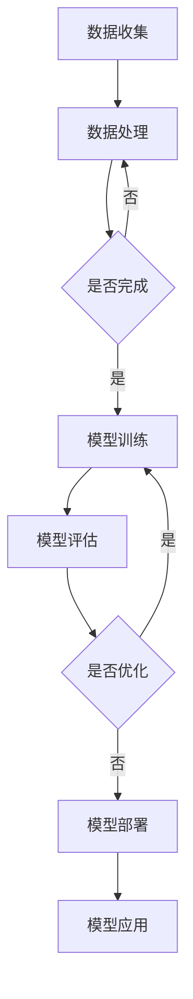

                 

关键词：大模型市场、同质化发展、创新机遇、贾扬清、人工智能

摘要：随着人工智能技术的快速发展，国内大模型市场迎来了蓬勃发展的机遇。然而，同质化竞争也日益加剧，如何实现差异化竞争成为行业关注的焦点。本文将结合贾扬清的观点，深入分析国内大模型市场的现状、同质化发展的原因及其带来的挑战，探讨创新机遇和未来发展的路径。

## 1. 背景介绍

近年来，人工智能技术的迅速崛起带动了大数据和深度学习的广泛应用。大模型作为人工智能领域的重要研究方向，成为学术界和产业界关注的焦点。国内大模型市场在政策扶持、资本投入、技术创新等多重因素推动下，呈现出爆发式增长态势。然而，市场同质化现象也逐渐凸显，众多企业纷纷涌入，竞相研发和推广大模型技术，导致产品和服务趋于一致，竞争愈发激烈。

贾扬清作为国内知名人工智能专家，对大模型市场的发展有着深刻的洞察。他在多个场合发表观点，强调创新是推动大模型市场可持续发展的关键，同时也指出当前市场存在的同质化问题及其带来的挑战。

## 2. 核心概念与联系

### 2.1 大模型定义

大模型（Large Models）是指具有海量参数、能够处理大规模数据的深度学习模型。大模型的典型特征包括：

- **参数规模**：具有数十亿甚至千亿级别的参数量。
- **数据需求**：需要海量的训练数据来保证模型的性能。
- **计算资源**：对计算资源的需求极为旺盛，通常需要分布式计算和高效并行处理。

### 2.2 大模型架构

大模型的架构通常包括以下几个关键部分：

- **输入层**：接收外部输入，如文本、图像、语音等。
- **隐藏层**：由多个神经元组成，负责数据的处理和特征提取。
- **输出层**：生成模型的预测结果或输出。

### 2.3 大模型与人工智能的联系

大模型是人工智能技术的重要支撑，通过大规模数据的训练，大模型能够学习到复杂的规律和模式，从而实现高效的推理和决策。人工智能的发展离不开大模型，而大模型的技术进步也推动了人工智能应用的普及。

### 2.4 Mermaid 流程图

下面是描述大模型训练过程的 Mermaid 流程图：



## 3. 核心算法原理 & 具体操作步骤

### 3.1 算法原理概述

大模型的核心算法通常基于深度学习，特别是基于神经网络的结构。深度学习通过多层神经网络对数据进行特征提取和模式识别，从而实现复杂任务的学习和预测。

### 3.2 算法步骤详解

大模型的训练过程通常包括以下几个步骤：

1. **数据准备**：收集和清洗数据，确保数据的质量和多样性。
2. **模型设计**：设计神经网络结构，包括层数、每层的神经元数量、激活函数等。
3. **模型训练**：通过梯度下降等优化算法训练模型参数。
4. **模型评估**：使用验证集和测试集评估模型性能。
5. **模型优化**：根据评估结果调整模型结构和参数。

### 3.3 算法优缺点

大模型的优点包括：

- **强大的学习能力**：能够从海量数据中学习到复杂的模式和规律。
- **广泛的应用领域**：在图像识别、自然语言处理、推荐系统等领域表现出色。

然而，大模型也存在一些缺点：

- **计算资源需求大**：训练和推理过程需要大量的计算资源。
- **训练时间较长**：训练过程通常需要数天甚至数周时间。

### 3.4 算法应用领域

大模型在多个领域取得了显著的应用成果，包括：

- **计算机视觉**：用于图像识别、物体检测和视频分析。
- **自然语言处理**：用于机器翻译、文本生成和情感分析。
- **推荐系统**：用于个性化推荐和广告投放。

## 4. 数学模型和公式 & 详细讲解 & 举例说明

### 4.1 数学模型构建

大模型的数学模型主要基于深度学习的神经网络架构。神经网络由多个层组成，包括输入层、隐藏层和输出层。每一层的神经元通过权重连接，形成复杂的网络结构。

### 4.2 公式推导过程

神经网络的核心是前向传播和反向传播。前向传播过程中，输入数据通过网络的各个层，经过加权求和和激活函数的处理，最终输出预测结果。反向传播过程中，通过计算预测误差，更新网络权重和偏置。

### 4.3 案例分析与讲解

以下是一个简单的神经网络模型的例子：

$$
\begin{aligned}
\text{输出} &= \text{激活函数}(\text{权重} \cdot \text{输入} + \text{偏置}) \\
\text{预测误差} &= \text{实际输出} - \text{预测输出} \\
\text{权重更新} &= \text{权重} - \text{学习率} \cdot (\text{预测误差} \cdot \text{激活函数的导数})
\end{aligned}
$$

## 5. 项目实践：代码实例和详细解释说明

### 5.1 开发环境搭建

为了实践大模型的训练过程，我们需要搭建一个适合的开发环境。通常，我们使用 Python 编写代码，结合 TensorFlow 或 PyTorch 等深度学习框架。

### 5.2 源代码详细实现

以下是一个使用 TensorFlow 实现的简单神经网络模型：

```python
import tensorflow as tf

# 定义模型结构
model = tf.keras.Sequential([
    tf.keras.layers.Dense(128, activation='relu', input_shape=(784,)),
    tf.keras.layers.Dense(10, activation='softmax')
])

# 编译模型
model.compile(optimizer='adam',
              loss='categorical_crossentropy',
              metrics=['accuracy'])

# 训练模型
model.fit(x_train, y_train, epochs=5, batch_size=32)
```

### 5.3 代码解读与分析

上述代码首先定义了一个简单的神经网络模型，包括一个输入层和一个输出层。输入层有 128 个神经元，使用 ReLU 激活函数；输出层有 10 个神经元，使用 softmax 激活函数。模型使用 Adam 优化器和交叉熵损失函数进行编译和训练。

### 5.4 运行结果展示

运行上述代码后，模型会在训练集上进行 5 个周期的训练，每个周期包含 32 个批量。训练完成后，我们可以在控制台看到模型的训练过程和最终结果，包括损失值和准确率。

## 6. 实际应用场景

大模型在实际应用中具有广泛的应用场景，以下是一些典型的应用案例：

- **图像识别**：使用大模型进行图像分类、目标检测和图像生成。
- **自然语言处理**：用于文本分类、机器翻译和情感分析。
- **语音识别**：用于语音识别、语音合成和语音增强。
- **推荐系统**：用于个性化推荐、广告投放和用户行为预测。

## 7. 未来应用展望

随着人工智能技术的不断进步，大模型的应用领域将更加广泛。未来，大模型有望在医疗、金融、教育等领域发挥更大的作用，为人类社会带来更多的便利和创新。

### 7.1 学习资源推荐

- **书籍推荐**：
  - 《深度学习》（Goodfellow, Bengio, Courville）
  - 《Python 深度学习》（François Chollet）
- **在线课程**：
  - Coursera 的《深度学习》课程
  - edX 的《机器学习基础》课程

### 7.2 开发工具推荐

- **深度学习框架**：
  - TensorFlow
  - PyTorch
  - Keras
- **编程语言**：
  - Python
  - R

### 7.3 相关论文推荐

- **经典论文**：
  - “A Learning Algorithm for Continually Running Fully Recurrent Neural Networks” （1986）
  - “Deep Learning” （2015）
- **最新论文**：
  - “BERT: Pre-training of Deep Bidirectional Transformers for Language Understanding” （2018）
  - “GPT-3: Language Models are Few-Shot Learners” （2020）

## 8. 总结：未来发展趋势与挑战

### 8.1 研究成果总结

国内大模型市场在政策扶持、资本投入和技术创新等多重因素推动下取得了显著的发展。学术界和产业界在大模型的研究和应用方面取得了丰硕的成果，推动了人工智能技术的进步。

### 8.2 未来发展趋势

未来，大模型市场将继续保持快速增长，随着计算能力的提升和数据资源的丰富，大模型的规模和性能将不断突破。同时，大模型的应用领域将更加广泛，从计算机视觉、自然语言处理扩展到更多的领域。

### 8.3 面临的挑战

然而，大模型市场也面临一些挑战，如计算资源的高需求、数据安全和隐私保护、模型的可解释性等。如何解决这些问题，将是未来大模型市场发展的关键。

### 8.4 研究展望

在未来的研究中，我们需要关注以下几个方面：

- **算法优化**：提升大模型的训练效率和推理速度。
- **模型压缩**：减小模型的大小，降低计算资源的需求。
- **可解释性**：提高模型的可解释性，增强用户对模型的信任。

## 9. 附录：常见问题与解答

### 9.1 什么是大模型？

大模型是指具有海量参数、能够处理大规模数据的深度学习模型。它们通常具有数十亿甚至千亿级别的参数量，需要海量的训练数据来保证模型的性能。

### 9.2 大模型有哪些优缺点？

大模型的优点包括强大的学习能力和广泛的应用领域。然而，它们也存在计算资源需求大、训练时间较长等缺点。

### 9.3 如何优化大模型？

优化大模型的方法包括算法优化、模型压缩和分布式训练等。通过这些方法，可以提高大模型的训练效率和推理速度。

### 9.4 大模型的应用领域有哪些？

大模型的应用领域包括计算机视觉、自然语言处理、推荐系统等。随着技术的进步，大模型的应用领域将不断扩展。

### 9.5 如何提高大模型的可解释性？

提高大模型的可解释性的方法包括模型可视化、解释性算法和模型压缩等。通过这些方法，可以增强用户对模型的信任和理解。

作者：禅与计算机程序设计艺术 / Zen and the Art of Computer Programming
----------------------------------------------------------------


