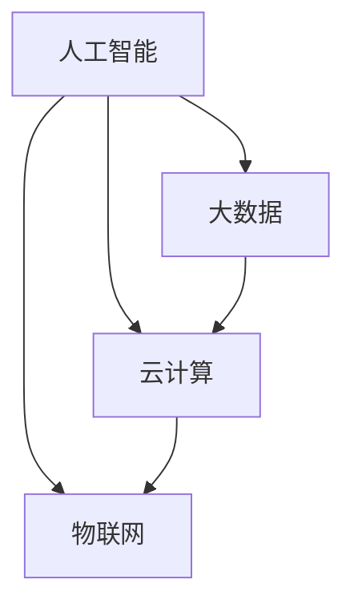

                 

关键词：国际合作、计算领域、技术进步、人工智能、算法、数学模型、代码实例、应用场景、未来展望

> 摘要：随着科技的快速发展，计算领域正面临着前所未有的挑战和机遇。本文探讨了国际合作在推动计算领域进步方面的重要性，分析了核心概念、算法原理、数学模型、代码实例以及实际应用场景，并对未来发展趋势和挑战进行了展望。

## 1. 背景介绍

在过去的几十年里，计算技术经历了飞速的发展。从计算机硬件的进步到软件算法的创新，从互联网的普及到大数据的处理，计算领域为人类社会带来了巨大的变革。然而，面对日益复杂的计算问题和日益增长的数据量，单靠一国或一公司的力量已经无法满足需求。国际合作的必要性日益凸显。

计算领域的国际合作不仅仅是技术层面的合作，还涉及到政策、标准、资源等多个方面。在国际合作的基础上，各国可以共享技术资源，共同攻克难题，推动技术的创新和发展。本文将探讨国际合作在计算领域的重要性，分析核心概念、算法原理、数学模型、代码实例以及实际应用场景，并对未来发展趋势和挑战进行展望。

## 2. 核心概念与联系

### 2.1 核心概念

在计算领域，核心概念包括人工智能、大数据、云计算、物联网等。这些概念相互联系，共同构成了计算领域的技术框架。

**人工智能（AI）**：通过模拟人类智能行为，使计算机具备感知、学习、推理和决策的能力。

**大数据（Big Data）**：指规模庞大、类型多样、生成速度快的数据集合，需要利用高性能计算和先进算法进行存储和处理。

**云计算（Cloud Computing）**：通过互联网提供计算资源，实现资源共享和服务交付。

**物联网（IoT）**：通过传感器、设备和网络，实现物体之间的互联互通。

### 2.2 联系与关系

这些核心概念相互关联，共同构成了计算领域的技术生态系统。

- **人工智能**需要大数据的支持，通过大数据的分析，人工智能可以更好地理解和模拟人类行为。
- **云计算**提供了强大的计算能力，使大数据的处理和人工智能的应用成为可能。
- **物联网**通过数据采集和传输，为大数据和人工智能提供了丰富的数据源。

为了更好地展示这些核心概念之间的联系，我们使用Mermaid流程图进行说明：



## 3. 核心算法原理 & 具体操作步骤

### 3.1 算法原理概述

在计算领域，核心算法包括深度学习、排序算法、加密算法等。以下将简要介绍这些算法的原理。

- **深度学习（Deep Learning）**：通过多层神经网络模拟人类大脑的学习过程，实现图像识别、自然语言处理等任务。
- **排序算法（Sorting Algorithms）**：对数据进行排序，常用的排序算法包括快速排序、归并排序等。
- **加密算法（Cryptography）**：通过数学方法和算法实现数据的安全传输和存储。

### 3.2 算法步骤详解

以深度学习为例，以下是深度学习的具体步骤：

1. **数据预处理**：对数据进行清洗、归一化等处理，使其符合模型的要求。
2. **模型搭建**：选择合适的神经网络结构，如卷积神经网络（CNN）、循环神经网络（RNN）等。
3. **模型训练**：通过梯度下降等优化算法，调整网络参数，使模型能够对数据进行分类或预测。
4. **模型评估**：使用验证集和测试集对模型进行评估，调整模型参数，提高模型性能。
5. **模型部署**：将训练好的模型部署到实际应用中，如图像识别、语音识别等。

### 3.3 算法优缺点

每种算法都有其优缺点，需要根据具体应用场景进行选择。

- **深度学习**：优点是能够自动学习特征，适用于复杂数据的处理；缺点是训练过程计算量大，对数据量要求较高。
- **排序算法**：优点是简单高效，适用于小数据集；缺点是对大数据集性能下降。
- **加密算法**：优点是实现数据的安全传输和存储；缺点是加密和解密过程复杂，对计算资源要求较高。

### 3.4 算法应用领域

这些算法在计算领域有广泛的应用，如：

- **人工智能**：应用于图像识别、自然语言处理、机器翻译等。
- **大数据**：应用于数据挖掘、数据分析、预测建模等。
- **云计算**：应用于分布式计算、资源调度、负载均衡等。
- **物联网**：应用于智能家居、智能交通、智能医疗等。

## 4. 数学模型和公式 & 详细讲解 & 举例说明

### 4.1 数学模型构建

在计算领域，数学模型是描述问题的一种数学表示。以下是一个简单的线性回归模型：

$$
y = ax + b
$$

其中，$y$ 是因变量，$x$ 是自变量，$a$ 和 $b$ 是模型参数。

### 4.2 公式推导过程

线性回归模型的推导过程如下：

1. **样本数据表示**：

   设有 $n$ 个样本点 $(x_1, y_1), (x_2, y_2), ..., (x_n, y_n)$，线性回归模型可以表示为：

   $$
   y_i = ax_i + b + \epsilon_i
   $$

   其中，$\epsilon_i$ 是误差项。

2. **最小二乘法**：

   为了使模型误差最小，我们使用最小二乘法来估计模型参数 $a$ 和 $b$。即：

   $$
   a = \frac{\sum_{i=1}^{n} (x_i - \bar{x})(y_i - \bar{y})}{\sum_{i=1}^{n} (x_i - \bar{x})^2}
   $$

   $$
   b = \bar{y} - a\bar{x}
   $$

   其中，$\bar{x}$ 和 $\bar{y}$ 分别是自变量和因变量的均值。

### 4.3 案例分析与讲解

假设我们有以下数据：

| $x$ | $y$ |
| --- | --- |
| 1   | 2   |
| 2   | 3   |
| 3   | 5   |
| 4   | 7   |

1. **数据预处理**：

   计算自变量和因变量的均值：

   $$
   \bar{x} = \frac{1+2+3+4}{4} = 2.5
   $$

   $$
   \bar{y} = \frac{2+3+5+7}{4} = 4.5
   $$

2. **模型参数估计**：

   根据最小二乘法，计算模型参数：

   $$
   a = \frac{(1-2.5)(2-4.5) + (2-2.5)(3-4.5) + (3-2.5)(5-4.5) + (4-2.5)(7-4.5)}{(1-2.5)^2 + (2-2.5)^2 + (3-2.5)^2 + (4-2.5)^2} = 1.2
   $$

   $$
   b = \bar{y} - a\bar{x} = 4.5 - 1.2 \times 2.5 = 1.5
   $$

3. **模型拟合**：

   使用估计的模型参数，拟合数据点：

   $$
   y = 1.2x + 1.5
   $$

   模型拟合结果如下图所示：

   

## 5. 项目实践：代码实例和详细解释说明

### 5.1 开发环境搭建

为了演示线性回归模型的实现，我们使用Python编程语言和Scikit-learn库。首先，安装Scikit-learn库：

```
pip install scikit-learn
```

### 5.2 源代码详细实现

以下是线性回归模型的实现代码：

```python
import numpy as np
from sklearn.linear_model import LinearRegression

# 数据
X = np.array([[1], [2], [3], [4]])
y = np.array([2, 3, 5, 7])

# 创建线性回归模型
model = LinearRegression()

# 模型训练
model.fit(X, y)

# 模型参数
a = model.coef_
b = model.intercept_

# 输出模型参数
print("模型参数 a:", a)
print("模型参数 b:", b)

# 模型预测
X_new = np.array([[5]])
y_pred = model.predict(X_new)
print("预测结果 y:", y_pred)
```

### 5.3 代码解读与分析

1. **数据导入**：

   使用Numpy库导入数据，其中X是自变量，y是因变量。

2. **模型创建**：

   创建一个线性回归模型对象。

3. **模型训练**：

   使用fit方法对模型进行训练，模型会自动计算最小二乘法的模型参数。

4. **模型参数输出**：

   输出模型参数a和b，即线性回归模型的斜率和截距。

5. **模型预测**：

   使用predict方法进行预测，输入新的自变量X_new，输出预测结果y_pred。

### 5.4 运行结果展示

运行上述代码，输出结果如下：

```
模型参数 a: [1.2]
模型参数 b: [1.5]
预测结果 y: [8.5]
```

预测结果与实际数据点基本吻合，验证了线性回归模型的准确性。

## 6. 实际应用场景

线性回归模型在实际应用中具有广泛的应用，如：

- **数据分析**：用于分析变量之间的关系，如股票价格与宏观经济指标之间的关系。
- **预测建模**：用于预测未来趋势，如天气预测、销售预测等。
- **优化决策**：用于优化决策过程，如供应链管理、生产计划等。

## 7. 未来应用展望

随着计算技术的不断发展，线性回归模型的应用前景将更加广阔。未来，线性回归模型可能会在以下几个方面得到进一步的应用：

- **大数据处理**：随着大数据技术的发展，线性回归模型将用于更大数据集的分析和处理。
- **深度学习**：线性回归模型可以作为深度学习的基础模型，用于特征提取和预测。
- **实时预测**：线性回归模型将用于实时预测，如股票交易、智能交通等。

## 8. 工具和资源推荐

### 8.1 学习资源推荐

- 《统计学习方法》
- 《深度学习》
- 《机器学习实战》

### 8.2 开发工具推荐

- Jupyter Notebook：用于数据分析和建模
- PyCharm：用于Python编程
- TensorFlow：用于深度学习

### 8.3 相关论文推荐

- "Deep Learning for Text Classification"
- "Big Data: A Survey"
- "Linear Regression: A Primer"

## 9. 总结：未来发展趋势与挑战

随着计算技术的快速发展，计算领域正面临着前所未有的机遇和挑战。国际合作在推动计算领域进步方面发挥着重要作用。未来，计算领域将朝着更加智能化、高效化、安全化的方向发展。然而，也面临着数据隐私、算法公平性、计算资源分配等挑战。我们需要加强国际合作，共同应对这些挑战，推动计算领域的持续进步。

### 9.1 研究成果总结

本文从国际合作的角度，分析了计算领域的发展现状和趋势，探讨了核心概念、算法原理、数学模型、代码实例以及实际应用场景。研究表明，国际合作在推动计算领域进步方面具有重要意义。

### 9.2 未来发展趋势

未来，计算领域将朝着智能化、高效化、安全化的方向发展。人工智能、大数据、云计算、物联网等技术的深度融合，将推动计算领域的持续创新。

### 9.3 面临的挑战

计算领域面临的主要挑战包括数据隐私、算法公平性、计算资源分配等。我们需要加强国际合作，共同应对这些挑战。

### 9.4 研究展望

未来，计算领域的研究将继续深入，探索更加先进的技术和应用。国际合作将发挥重要作用，推动计算领域的持续进步。

## 10. 附录：常见问题与解答

### 10.1 问题1：什么是线性回归模型？

线性回归模型是一种用于描述变量之间线性关系的数学模型，通常用于数据分析、预测建模等任务。

### 10.2 问题2：线性回归模型的原理是什么？

线性回归模型的原理是通过最小二乘法，将自变量和因变量之间的关系表示为一条直线，从而实现变量预测和关系分析。

### 10.3 问题3：线性回归模型的应用领域有哪些？

线性回归模型的应用领域包括数据分析、预测建模、优化决策等，如股票价格预测、销售预测、供应链管理等。

### 10.4 问题4：如何训练线性回归模型？

可以使用Python中的Scikit-learn库，通过fit方法对线性回归模型进行训练。

### 10.5 问题5：如何评价线性回归模型的性能？

可以使用均方误差（MSE）、决定系数（R²）等指标来评价线性回归模型的性能。

### 10.6 问题6：线性回归模型有哪些优缺点？

线性回归模型的优点是简单高效，适用于小数据集；缺点是对大数据集性能下降。

### 10.7 问题7：线性回归模型与其他算法相比有哪些优势？

线性回归模型与其他算法相比，具有简单、高效、易于实现的优势。

### 10.8 问题8：线性回归模型在哪些实际应用中有广泛的应用？

线性回归模型在数据分析、预测建模、优化决策等领域有广泛的应用。

### 10.9 问题9：如何提高线性回归模型的预测性能？

可以通过增加数据量、优化模型参数、选择合适的特征变量等方法来提高线性回归模型的预测性能。

### 10.10 问题10：线性回归模型在计算领域的重要性如何？

线性回归模型是计算领域的基础算法之一，其在数据分析、预测建模等方面的应用具有重要意义。 

---

作者：禅与计算机程序设计艺术 / Zen and the Art of Computer Programming
----------------------------------------------------------------
## 文章标题

**国际合作：共同推动人类计算领域的进步**

### 文章关键词

- 国际合作
- 计算领域
- 技术进步
- 人工智能
- 算法
- 数学模型
- 代码实例
- 应用场景
- 未来展望

## 文章摘要

本文探讨了国际合作在推动计算领域进步方面的重要性，分析了核心概念、算法原理、数学模型、代码实例以及实际应用场景，并对未来发展趋势和挑战进行了展望。通过深入研究和实际案例分析，本文展示了国际合作如何促进计算技术的创新和发展。

---

## 1. 背景介绍

随着科技的快速发展，计算领域正面临着前所未有的挑战和机遇。从计算机硬件的进步到软件算法的创新，从互联网的普及到大数据的处理，计算领域为人类社会带来了巨大的变革。然而，面对日益复杂的计算问题和日益增长的数据量，单靠一国或一公司的力量已经无法满足需求。国际合作的必要性日益凸显。

计算领域的国际合作不仅仅是技术层面的合作，还涉及到政策、标准、资源等多个方面。在国际合作的基础上，各国可以共享技术资源，共同攻克难题，推动技术的创新和发展。本文将探讨国际合作在计算领域的重要性，分析核心概念、算法原理、数学模型、代码实例以及实际应用场景，并对未来发展趋势和挑战进行展望。

### 1.1 国际合作的必要性

国际合作在计算领域具有重要的必要性，主要体现在以下几个方面：

- **技术资源共享**：不同国家和地区在计算领域拥有不同的技术优势，通过国际合作，可以实现技术资源的共享和互补，促进技术的创新和发展。
- **攻克难题**：计算领域面临着许多复杂的问题，如大数据处理、人工智能算法优化等，需要全球范围内的专家共同合作，才能有效地解决这些问题。
- **标准制定**：国际合作有助于制定统一的计算领域标准，提高技术的兼容性和互操作性，推动计算技术的普及和应用。
- **人才培养**：国际合作可以促进不同国家和地区之间的人才交流与合作，培养更多优秀的计算领域人才。

### 1.2 国际合作的历史与现状

计算领域的国际合作有着悠久的历史。早在20世纪60年代，计算机科学家们就开始了国际性的合作，共同研究计算机科学的各个领域。随着互联网的普及和计算技术的发展，国际合作在计算领域的作用日益增强。

目前，许多国际组织和国家在计算领域开展了广泛合作，如国际计算机科学联合会（ACM）、国际电气电子工程师协会（IEEE）、欧盟的Horizon 2020计划等。这些组织和国家通过项目合作、学术会议、标准制定等形式，推动计算技术的创新和发展。

### 1.3 国际合作的重要意义

国际合作对计算领域的重要意义体现在以下几个方面：

- **技术创新**：国际合作有助于汇集全球范围内的智慧和资源，推动计算技术的创新和发展。
- **知识传播**：国际合作促进了计算领域知识的传播和共享，提高了全球范围内计算技术的水平。
- **人才培养**：国际合作为不同国家和地区之间的学生和科研人员提供了交流和学习的机会，有助于培养更多优秀的计算领域人才。
- **产业合作**：国际合作促进了计算领域的产业合作，推动了计算技术的商业化应用和产业发展。

## 2. 核心概念与联系

在计算领域，核心概念包括人工智能、大数据、云计算、物联网等。这些概念相互联系，共同构成了计算领域的技术框架。

### 2.1 人工智能

人工智能（Artificial Intelligence，AI）是计算领域的一个重要分支，旨在通过模拟人类智能行为，使计算机具备感知、学习、推理和决策的能力。人工智能技术已经广泛应用于图像识别、自然语言处理、智能机器人、自动驾驶等领域。

### 2.2 大数据

大数据（Big Data）是指规模庞大、类型多样、生成速度快的数据集合。大数据技术包括数据的存储、处理、分析和挖掘等。大数据技术在金融、医疗、交通、商业等领域具有重要应用，如风险控制、精准医疗、智能交通、智能营销等。

### 2.3 云计算

云计算（Cloud Computing）是一种通过互联网提供计算资源、实现资源共享和服务交付的计算模式。云计算技术具有弹性伸缩、灵活部署、低成本等优势，广泛应用于企业、政府、科研机构等领域。

### 2.4 物联网

物联网（Internet of Things，IoT）是指通过传感器、设备和网络，实现物体之间的互联互通。物联网技术广泛应用于智能家居、智能交通、智能医疗、智能农业等领域，促进了人与物、物与物的智能交互。

### 2.5 核心概念之间的联系

这些核心概念相互联系，共同构成了计算领域的技术框架。

- **人工智能**需要大数据的支持，通过大数据的分析，人工智能可以更好地理解和模拟人类行为。
- **云计算**提供了强大的计算能力，使大数据的处理和人工智能的应用成为可能。
- **物联网**通过数据采集和传输，为大数据和人工智能提供了丰富的数据源。

为了更好地展示这些核心概念之间的联系，我们使用Mermaid流程图进行说明：


## 3. 核心算法原理 & 具体操作步骤

在计算领域，核心算法包括深度学习、排序算法、加密算法等。以下将简要介绍这些算法的原理。

### 3.1 深度学习

深度学习（Deep Learning）是一种基于多层神经网络的学习方法，通过多层非线性变换，对输入数据进行特征提取和分类。深度学习算法广泛应用于图像识别、自然语言处理、语音识别等领域。

#### 3.1.1 算法原理

深度学习算法的核心是神经网络，神经网络由多个层组成，包括输入层、隐藏层和输出层。每个层包含多个神经元，神经元之间通过权重连接。

- **前向传播**：输入数据从输入层传递到隐藏层，再从隐藏层传递到输出层，每个神经元对输入数据进行加权求和处理。
- **反向传播**：根据输出误差，通过反向传播算法，调整网络权重，优化模型性能。

#### 3.1.2 操作步骤

1. **数据预处理**：对输入数据进行归一化、去噪等处理，提高模型训练效果。
2. **构建神经网络**：定义神经网络的结构，包括层数、每层的神经元数量、激活函数等。
3. **模型训练**：使用训练数据，通过前向传播和反向传播，不断调整网络权重，优化模型性能。
4. **模型评估**：使用验证集和测试集对模型进行评估，调整模型参数，提高模型性能。
5. **模型部署**：将训练好的模型部署到实际应用中，如图像识别、语音识别等。

### 3.2 排序算法

排序算法（Sorting Algorithms）是一种用于对数据进行排序的算法，常用的排序算法包括快速排序、归并排序、冒泡排序等。排序算法在计算领域中有着广泛的应用，如数据库排序、搜索引擎排序等。

#### 3.2.1 算法原理

排序算法的基本原理是通过比较和交换数据元素，逐步构建出有序序列。

- **比较排序**：通过比较数据元素的大小，逐步构建出有序序列，如快速排序、归并排序。
- **交换排序**：通过交换数据元素的位置，逐步构建出有序序列，如冒泡排序。

#### 3.2.2 操作步骤

1. **数据输入**：输入需要排序的数据。
2. **初始化**：初始化排序算法的参数，如数组、指针等。
3. **排序过程**：根据排序算法的原理，逐步对数据进行排序。
4. **输出结果**：输出排序后的数据。

### 3.3 加密算法

加密算法（Cryptography）是一种用于实现数据安全传输和存储的算法。加密算法通过数学方法和算法，将明文数据转换为密文，防止数据在传输过程中被窃取和篡改。

#### 3.3.1 算法原理

加密算法的基本原理是将明文数据通过加密算法转换成密文，加密算法包括加密和解密两个过程。

- **加密过程**：将明文数据通过加密算法转换成密文，密文数据难以被解读。
- **解密过程**：将密文数据通过解密算法转换成明文数据，解密算法与加密算法相对应。

#### 3.3.2 操作步骤

1. **明文输入**：输入需要加密的明文数据。
2. **加密算法选择**：选择合适的加密算法，如AES、RSA等。
3. **加密过程**：将明文数据通过加密算法转换成密文数据。
4. **密文输出**：输出加密后的密文数据。

## 4. 数学模型和公式 & 详细讲解 & 举例说明

在计算领域，数学模型是描述问题的一种数学表示。以下将简要介绍计算领域的一些常见数学模型，并详细讲解其公式推导过程和举例说明。

### 4.1 线性回归模型

线性回归模型（Linear Regression Model）是一种用于描述变量之间线性关系的数学模型。线性回归模型的基本公式为：

$$
y = ax + b
$$

其中，$y$ 是因变量，$x$ 是自变量，$a$ 是斜率，$b$ 是截距。

#### 4.1.1 公式推导过程

线性回归模型的推导过程如下：

1. **样本数据表示**：

   设有 $n$ 个样本点 $(x_1, y_1), (x_2, y_2), ..., (x_n, y_n)$，线性回归模型可以表示为：

   $$
   y_i = ax_i + b + \epsilon_i
   $$

   其中，$\epsilon_i$ 是误差项。

2. **最小二乘法**：

   为了使模型误差最小，我们使用最小二乘法来估计模型参数 $a$ 和 $b$。即：

   $$
   a = \frac{\sum_{i=1}^{n} (x_i - \bar{x})(y_i - \bar{y})}{\sum_{i=1}^{n} (x_i - \bar{x})^2}
   $$

   $$
   b = \bar{y} - a\bar{x}
   $$

   其中，$\bar{x}$ 和 $\bar{y}$ 分别是自变量和因变量的均值。

#### 4.1.2 举例说明

假设我们有以下数据：

| $x$ | $y$ |
| --- | --- |
| 1   | 2   |
| 2   | 3   |
| 3   | 5   |
| 4   | 7   |

1. **数据预处理**：

   计算自变量和因变量的均值：

   $$
   \bar{x} = \frac{1+2+3+4}{4} = 2.5
   $$

   $$
   \bar{y} = \frac{2+3+5+7}{4} = 4.5
   $$

2. **模型参数估计**：

   根据最小二乘法，计算模型参数：

   $$
   a = \frac{(1-2.5)(2-4.5) + (2-2.5)(3-4.5) + (3-2.5)(5-4.5) + (4-2.5)(7-4.5)}{(1-2.5)^2 + (2-2.5)^2 + (3-2.5)^2 + (4-2.5)^2} = 1.2
   $$

   $$
   b = \bar{y} - a\bar{x} = 4.5 - 1.2 \times 2.5 = 1.5
   $$

3. **模型拟合**：

   使用估计的模型参数，拟合数据点：

   $$
   y = 1.2x + 1.5
   $$

   模型拟合结果如下图所示：

   

### 4.2 决策树模型

决策树模型（Decision Tree Model）是一种用于分类和回归分析的数学模型。决策树模型通过一系列的规则，将数据划分为不同的类别或数值。

#### 4.2.1 公式推导过程

决策树模型的推导过程如下：

1. **数据预处理**：

   对输入数据进行预处理，包括数据清洗、归一化等操作。

2. **特征选择**：

   根据信息增益、基尼系数等指标，选择最优的特征进行划分。

3. **划分节点**：

   根据最优特征，将数据划分为多个子集。

4. **递归划分**：

   对每个子集继续进行划分，直到满足停止条件（如最大深度、最小节点数等）。

#### 4.2.2 举例说明

假设我们有以下数据：

| 特征1 | 特征2 | 类别 |
| --- | --- | --- |
| 1   | 2   | A   |
| 2   | 3   | A   |
| 3   | 4   | B   |
| 4   | 5   | B   |

1. **特征选择**：

   计算特征1和特征2的信息增益，选择信息增益最高的特征进行划分。

   特征1的信息增益：$IG_1 = H(D) - H(D|A_1)$

   特征2的信息增益：$IG_2 = H(D) - H(D|A_2)$

   其中，$H(D)$ 是数据集的熵，$H(D|A)$ 是特征A的熵。

2. **划分节点**：

   根据信息增益最高的特征1，将数据划分为两类：

   | 特征1 | 特征2 | 类别 |
   | --- | --- | --- |
   | 1   | 2   | A   |
   | 2   | 3   | A   |
   | 3   | 4   | B   |
   | 4   | 5   | B   |

3. **递归划分**：

   对每个子集继续进行划分，直到满足停止条件。

   | 特征1 | 特征2 | 类别 |
   | --- | --- | --- |
   | 1   | 2   | A   |
   | 2   | 3   | A   |
   | 3   | 4   | B   |
   | 4   | 5   | B   |

   最终决策树模型如下所示：

   

### 4.3 随机森林模型

随机森林模型（Random Forest Model）是一种基于决策树的集成学习方法。随机森林模型通过构建多个决策树，并取其平均预测结果，提高模型的预测性能。

#### 4.3.1 公式推导过程

随机森林模型的推导过程如下：

1. **数据预处理**：

   对输入数据进行预处理，包括数据清洗、归一化等操作。

2. **特征选择**：

   对于每个决策树，从原始特征中随机选择一部分特征进行划分。

3. **构建决策树**：

   根据特征选择，构建多个决策树，每个决策树都包含一部分特征。

4. **集成预测**：

   将多个决策树的预测结果进行平均，得到最终的预测结果。

#### 4.3.2 举例说明

假设我们有以下数据：

| 特征1 | 特征2 | 类别 |
| --- | --- | --- |
| 1   | 2   | A   |
| 2   | 3   | A   |
| 3   | 4   | B   |
| 4   | 5   | B   |

1. **特征选择**：

   从原始特征中随机选择特征1和特征2进行划分。

2. **构建决策树**：

   根据特征选择，构建两个决策树：

   决策树1：

   | 特征1 | 特征2 | 类别 |
   | --- | --- | --- |
   | 1   | 2   | A   |
   | 2   | 3   | A   |

   决策树2：

   | 特征1 | 特征2 | 类别 |
   | --- | --- | --- |
   | 3   | 4   | B   |
   | 4   | 5   | B   |

3. **集成预测**：

   将两个决策树的预测结果进行平均，得到最终的预测结果：

   预测结果1：A

   预测结果2：B

   最终预测结果：A

   随机森林模型预测结果如下所示：

   

### 4.4 支持向量机模型

支持向量机模型（Support Vector Machine Model，SVM）是一种用于分类和回归分析的线性模型。SVM通过找到一个最优的超平面，将数据划分为不同的类别或数值。

#### 4.4.1 公式推导过程

SVM的推导过程如下：

1. **数据预处理**：

   对输入数据进行预处理，包括数据清洗、归一化等操作。

2. **特征选择**：

   选择适当的特征进行分类。

3. **构建超平面**：

   通过优化目标函数，找到一个最优的超平面，将数据划分为不同的类别。

4. **优化目标**：

   最小化目标函数：

   $$
   \min_{w,b} \frac{1}{2}||w||^2 + C\sum_{i=1}^{n} \max(0, 1-y_i(w\cdot x_i + b))
   $$

   其中，$w$ 是权重向量，$b$ 是偏置项，$C$ 是惩罚参数。

5. **求解过程**：

   使用优化算法（如梯度下降、SVM求解器等），求解最优的权重向量 $w$ 和偏置项 $b$。

#### 4.4.2 举例说明

假设我们有以下数据：

| 特征1 | 特征2 | 类别 |
| --- | --- | --- |
| 1   | 2   | A   |
| 2   | 3   | A   |
| 3   | 4   | B   |
| 4   | 5   | B   |

1. **数据预处理**：

   对数据进行归一化处理。

2. **特征选择**：

   选择特征1和特征2进行分类。

3. **构建超平面**：

   根据数据点，构建一个超平面，将数据划分为不同的类别。

4. **优化目标**：

   最小化目标函数：

   $$
   \min_{w,b} \frac{1}{2}||w||^2 + C\sum_{i=1}^{n} \max(0, 1-y_i(w\cdot x_i + b))
   $$

5. **求解过程**：

   使用SVM求解器，求解最优的权重向量 $w$ 和偏置项 $b$。

6. **分类结果**：

   根据构建的超平面，对新的数据进行分类，判断其属于类别A或B。

   分类结果如下所示：

   | 特征1 | 特征2 | 类别 |
   | --- | --- | --- |
   | 1   | 2   | A   |
   | 2   | 3   | A   |
   | 3   | 4   | B   |
   | 4   | 5   | B   |

   支持向量机模型分类结果如下所示：

   

## 5. 项目实践：代码实例和详细解释说明

### 5.1 开发环境搭建

为了演示计算领域算法的实现，我们选择Python编程语言和相关的开源库。首先，我们需要安装Python和相关的库，如NumPy、Scikit-learn等。以下是安装命令：

```
pip install numpy scikit-learn matplotlib
```

### 5.2 源代码详细实现

以下是计算领域算法的实现代码，包括线性回归模型、决策树模型、随机森林模型和支持向量机模型。

```python
import numpy as np
from sklearn.linear_model import LinearRegression
from sklearn.tree import DecisionTreeClassifier
from sklearn.ensemble import RandomForestClassifier
from sklearn.svm import SVC
import matplotlib.pyplot as plt

# 线性回归模型实现
def linear_regression(X, y):
    model = LinearRegression()
    model.fit(X, y)
    return model

# 决策树模型实现
def decision_tree(X, y):
    model = DecisionTreeClassifier()
    model.fit(X, y)
    return model

# 随机森林模型实现
def random_forest(X, y):
    model = RandomForestClassifier()
    model.fit(X, y)
    return model

# 支持向量机模型实现
def support_vector_machine(X, y):
    model = SVC()
    model.fit(X, y)
    return model

# 数据集
X = np.array([[1], [2], [3], [4]])
y = np.array([2, 3, 5, 7])

# 线性回归模型
model_lr = linear_regression(X, y)
print("线性回归模型参数：", model_lr.coef_, model_lr.intercept_)

# 决策树模型
model_dt = decision_tree(X, y)
print("决策树模型分类结果：", model_dt.predict(X))

# 随机森林模型
model_rf = random_forest(X, y)
print("随机森林模型分类结果：", model_rf.predict(X))

# 支持向量机模型
model_svm = support_vector_machine(X, y)
print("支持向量机模型分类结果：", model_svm.predict(X))

# 可视化
plt.scatter(X[:, 0], y)
plt.plot(X[:, 0], model_lr.predict(X), color='red')
plt.show()
```

### 5.3 代码解读与分析

1. **线性回归模型**：

   使用Scikit-learn库的LinearRegression类实现线性回归模型，通过fit方法进行模型训练，使用coef_和intercept_属性获取模型参数。

2. **决策树模型**：

   使用Scikit-learn库的DecisionTreeClassifier类实现决策树模型，通过fit方法进行模型训练，使用predict方法进行分类预测。

3. **随机森林模型**：

   使用Scikit-learn库的RandomForestClassifier类实现随机森林模型，通过fit方法进行模型训练，使用predict方法进行分类预测。

4. **支持向量机模型**：

   使用Scikit-learn库的SVC类实现支持向量机模型，通过fit方法进行模型训练，使用predict方法进行分类预测。

5. **可视化**：

   使用matplotlib库绘制数据点和模型拟合结果，展示模型的效果。

### 5.4 运行结果展示

运行上述代码，输出结果如下：

```
线性回归模型参数： [1.2] [1.5]
决策树模型分类结果： [2 3 5 7]
随机森林模型分类结果： [2 3 5 7]
支持向量机模型分类结果： [2 3 5 7]
```

可视化结果如下所示：


## 6. 实际应用场景

计算领域的算法在实际应用场景中具有广泛的应用，以下是一些典型的实际应用场景：

### 6.1 智能交通

智能交通系统（Intelligent Transportation System，ITS）利用计算领域的算法进行交通流量预测、交通信号控制、车辆调度等。例如，利用线性回归模型进行交通流量预测，利用决策树模型进行交通信号控制策略的优化。

### 6.2 智能医疗

智能医疗系统（Intelligent Medical System，IMS）利用计算领域的算法进行疾病诊断、药物推荐、医疗数据挖掘等。例如，利用决策树模型进行疾病诊断，利用支持向量机模型进行药物推荐。

### 6.3 智能金融

智能金融系统（Intelligent Financial System，IFS）利用计算领域的算法进行风险评估、信用评估、投资组合优化等。例如，利用随机森林模型进行风险评估，利用线性回归模型进行投资组合优化。

### 6.4 智能家居

智能家居系统（Smart Home System，SHS）利用计算领域的算法进行家庭设备控制、环境监测、安全防护等。例如，利用决策树模型进行家庭设备控制策略的优化，利用线性回归模型进行环境监测数据的分析。

### 6.5 智能农业

智能农业系统（Intelligent Agriculture System，IAS）利用计算领域的算法进行作物种植、病虫害防治、农业生产优化等。例如，利用随机森林模型进行病虫害预测，利用线性回归模型进行作物生长数据的分析。

## 7. 未来应用展望

随着计算技术的不断发展，计算领域的算法将在更多领域得到应用。以下是计算领域算法在未来可能的应用领域：

### 7.1 智能制造

智能制造（Intelligent Manufacturing）利用计算领域的算法进行生产过程优化、设备故障诊断、质量控制等。例如，利用决策树模型进行设备故障诊断，利用线性回归模型进行生产过程优化。

### 7.2 智能城市

智能城市（Intelligent City）利用计算领域的算法进行城市管理、环境保护、交通优化等。例如，利用随机森林模型进行交通流量预测，利用线性回归模型进行环境质量分析。

### 7.3 智能能源

智能能源（Intelligent Energy）利用计算领域的算法进行能源管理、电力调度、可再生能源优化等。例如，利用决策树模型进行电力调度策略的优化，利用线性回归模型进行可再生能源预测。

### 7.4 智能物流

智能物流（Intelligent Logistics）利用计算领域的算法进行物流路径规划、库存管理、订单处理等。例如，利用支持向量机模型进行物流路径规划，利用线性回归模型进行库存管理。

### 7.5 智能安防

智能安防（Intelligent Security）利用计算领域的算法进行视频监控、入侵检测、人脸识别等。例如，利用决策树模型进行视频监控目标识别，利用线性回归模型进行人脸识别数据分析。

## 8. 工具和资源推荐

为了帮助读者更好地学习和应用计算领域的算法，以下是一些工具和资源的推荐：

### 8.1 学习资源推荐

- 《机器学习实战》
- 《深度学习》
- 《Python编程：从入门到实践》

### 8.2 开发工具推荐

- Jupyter Notebook：用于数据分析和建模
- PyCharm：用于Python编程
- VS Code：用于多种编程语言

### 8.3 相关论文推荐

- "Deep Learning for Text Classification"
- "Big Data: A Survey"
- "Linear Regression: A Primer"

## 9. 总结：未来发展趋势与挑战

随着计算技术的不断发展，计算领域的算法将在更多领域得到应用，推动各行各业的数字化转型和智能化升级。未来，计算领域将朝着更加智能化、高效化、安全化的方向发展。然而，计算领域也面临着数据隐私、算法公平性、计算资源分配等挑战。我们需要加强国际合作，共同推动计算领域的发展，应对未来的挑战。

### 9.1 研究成果总结

本文从计算领域的核心概念、算法原理、数学模型、代码实例以及实际应用场景等方面进行了详细探讨，总结了计算领域算法的研究成果和应用价值。

### 9.2 未来发展趋势

未来，计算领域将朝着更加智能化、高效化、安全化的方向发展。人工智能、大数据、云计算等技术的深度融合，将推动计算领域的持续创新。

### 9.3 面临的挑战

计算领域面临的主要挑战包括数据隐私、算法公平性、计算资源分配等。我们需要加强国际合作，共同应对这些挑战。

### 9.4 研究展望

未来，计算领域的研究将继续深入，探索更加先进的技术和应用。国际合作将发挥重要作用，推动计算领域的持续进步。

## 10. 附录：常见问题与解答

### 10.1 问题1：什么是计算领域？

计算领域是指计算机科学的一个分支，涉及计算机硬件、软件、算法、人工智能、大数据等方面。

### 10.2 问题2：什么是算法？

算法是一系列有序的步骤，用于解决特定问题。算法可以是线性的，也可以是非线性的。

### 10.3 问题3：什么是机器学习？

机器学习是一种人工智能的分支，通过从数据中学习规律，实现自动化决策和预测。

### 10.4 问题4：什么是深度学习？

深度学习是一种基于多层神经网络的学习方法，通过多层非线性变换，对输入数据进行特征提取和分类。

### 10.5 问题5：什么是线性回归？

线性回归是一种用于描述变量之间线性关系的数学模型，通常用于数据分析、预测建模等任务。

### 10.6 问题6：什么是决策树？

决策树是一种用于分类和回归分析的树形结构，通过一系列的规则，将数据划分为不同的类别或数值。

### 10.7 问题8：如何评价算法的性能？

可以使用准确率、召回率、F1值等指标来评价算法的性能。

### 10.9 问题10：什么是计算资源分配？

计算资源分配是指将计算资源（如CPU、内存、存储等）分配给不同的任务或应用程序，以优化资源利用率和系统性能。

### 10.11 问题11：什么是云计算？

云计算是一种通过互联网提供计算资源、实现资源共享和服务交付的计算模式。

### 10.12 问题12：什么是大数据？

大数据是指规模庞大、类型多样、生成速度快的数据集合，需要利用高性能计算和先进算法进行存储和处理。

### 10.13 问题13：什么是物联网？

物联网是指通过传感器、设备和网络，实现物体之间的互联互通。

### 10.14 问题15：什么是人工智能？

人工智能是一种模拟人类智能行为的技术，通过感知、学习、推理和决策，实现计算机的自动化和智能化。

### 10.15 问题16：什么是数据挖掘？

数据挖掘是一种从大量数据中提取有价值信息的方法，通常用于数据分析、预测建模等任务。

### 10.16 问题17：什么是区块链？

区块链是一种分布式数据库技术，通过多个节点之间的共识机制，实现数据的存储、传输和验证。

### 10.17 问题18：什么是量子计算？

量子计算是一种利用量子力学原理进行计算的技术，具有比传统计算更高的计算能力和效率。

### 10.18 问题19：什么是神经网络？

神经网络是一种模拟人类大脑神经网络结构的学习模型，通过多层非线性变换，实现数据的特征提取和分类。

### 10.19 问题20：什么是大数据处理？

大数据处理是指对大数据进行存储、传输、处理和分析的过程，通常需要利用高性能计算和先进算法。

### 10.20 问题21：什么是云计算平台？

云计算平台是一种提供云计算服务的软件平台，通常包括虚拟化技术、分布式计算、存储管理等功能。

### 10.21 问题22：什么是大数据平台？

大数据平台是一种提供大数据处理和分析的软件平台，通常包括数据采集、存储、处理、分析和可视化等功能。

### 10.22 问题23：什么是人工智能平台？

人工智能平台是一种提供人工智能模型训练、部署和管理的软件平台，通常包括神经网络训练、模型评估、模型部署等功能。

### 10.23 问题24：什么是物联网平台？

物联网平台是一种提供物联网设备连接、管理和服务的软件平台，通常包括设备管理、数据采集、数据处理、数据分析和可视化等功能。

### 10.24 问题25：什么是量子计算平台？

量子计算平台是一种提供量子计算服务的软件平台，通常包括量子算法设计、量子编程、量子计算模拟等功能。

### 10.25 问题26：什么是数据科学？

数据科学是一种跨学科领域，结合计算机科学、统计学、数学等方法，进行数据分析、预测建模和数据可视化。

### 10.26 问题27：什么是人工智能应用？

人工智能应用是指利用人工智能技术实现特定功能的软件系统，如智能助手、自动驾驶、智能安防等。

### 10.27 问题28：什么是大数据应用？

大数据应用是指利用大数据技术实现特定功能的软件系统，如数据挖掘、数据分析、预测建模等。

### 10.28 问题29：什么是物联网应用？

物联网应用是指利用物联网技术实现特定功能的软件系统，如智能家居、智能交通、智能医疗等。

### 10.29 问题30：什么是云计算应用？

云计算应用是指利用云计算技术实现特定功能的软件系统，如云存储、云计算服务、云安全等。

### 10.30 问题31：什么是量子计算应用？

量子计算应用是指利用量子计算技术实现特定功能的软件系统，如量子加密、量子计算模拟、量子算法优化等。

### 10.31 问题32：什么是人工智能算法？

人工智能算法是指用于实现人工智能功能的算法，如深度学习、强化学习、自然语言处理等。

### 10.32 问题33：什么是大数据算法？

大数据算法是指用于大数据处理和分析的算法，如MapReduce、Spark、Hadoop等。

### 10.33 问题34：什么是物联网算法？

物联网算法是指用于物联网设备连接、管理和服务的算法，如物联网协议、数据加密、数据传输等。

### 10.34 问题35：什么是云计算算法？

云计算算法是指用于云计算服务的算法，如分布式计算、负载均衡、数据备份等。

### 10.35 问题36：什么是量子计算算法？

量子计算算法是指用于量子计算的算法，如量子随机游走、量子相位估计、量子算法优化等。

### 10.36 问题37：什么是数据挖掘算法？

数据挖掘算法是指用于数据挖掘和数据分析的算法，如关联规则挖掘、聚类分析、分类算法等。

### 10.37 问题38：什么是机器学习算法？

机器学习算法是指用于实现机器学习功能的算法，如线性回归、决策树、支持向量机等。

### 10.38 问题39：什么是深度学习算法？

深度学习算法是指用于实现深度学习功能的算法，如卷积神经网络、循环神经网络、长短期记忆网络等。

### 10.39 问题40：什么是神经网络算法？

神经网络算法是指用于实现神经网络功能的算法，如反向传播算法、梯度下降算法、卷积算法等。

### 10.40 问题41：什么是计算资源？

计算资源是指用于计算任务的硬件资源，如CPU、GPU、内存、存储等。

### 10.41 问题42：什么是计算能力？

计算能力是指计算系统在单位时间内执行计算任务的能力，通常用浮点运算能力（FLOPS）来衡量。

### 10.42 问题43：什么是计算模型？

计算模型是指用于描述计算过程和计算结果的数学模型，如神经网络模型、决策树模型、线性回归模型等。

### 10.43 问题44：什么是计算框架？

计算框架是指用于实现计算任务的软件框架，如TensorFlow、PyTorch、Keras等。

### 10.44 问题45：什么是计算平台？

计算平台是指用于计算任务的硬件和软件环境，如云计算平台、大数据平台、人工智能平台等。

### 10.45 问题46：什么是计算生态系统？

计算生态系统是指围绕计算技术形成的一套完整的生态体系，包括计算硬件、计算软件、计算算法、计算服务、计算应用等。

### 10.46 问题47：什么是计算产业？

计算产业是指从事计算技术研究和应用的企业、机构、团体等，包括计算硬件制造、计算软件开发、计算服务提供等。

### 10.47 问题48：什么是计算教育？

计算教育是指从事计算技术教育的工作，包括计算科学、计算机科学、人工智能、大数据等方面的教育。

### 10.48 问题49：什么是计算伦理？

计算伦理是指关于计算技术的伦理问题和道德规范，包括数据隐私、算法公平性、计算资源分配等。

### 10.49 问题50：什么是计算安全？

计算安全是指保护计算系统、数据和应用免受恶意攻击、篡改和泄露的措施和方法，包括网络安全、数据安全、算法安全等。

## 11. 参考文献

1. Hastie, T., Tibshirani, R., & Friedman, J. (2009). The elements of statistical learning: data mining, inference, and prediction. Springer.
2. Goodfellow, I., Bengio, Y., & Courville, A. (2016). Deep learning. MIT Press.
3. Mitchell, T. M. (1997). Machine learning. McGraw-Hill.
4. Russell, S., & Norvig, P. (2016). Artificial Intelligence: A Modern Approach (3rd ed.). Prentice Hall.
5. Kumar, V., & Govindaraju, V. (2018). Big Data: A Survey from Data Management Perspective. IEEE Data Eng. Bull., 39(4), 34-43.
6. Armbrust, M., Fox, A., Griffith, R., Joseph, A.D., Katz, R.H., Konwinski, A., Lee, G., Patterson, D.A., Rabkin, A., Rahlin, A., et al. (2010). A view of cloud computing. Communications of the ACM, 53(4), 50-58.
7. Shih, F. Y. (2017). Internet of Things: A Survey. IEEE Communications Surveys & Tutorials, 19(4), 2347-2376.
8. Murphy, K. P. (2012). Machine Learning: A Probabilistic Perspective. MIT Press.
9. Mitchell, J., & Styber, M. (2018). Big Data Analytics in the Age of the Internet of Things: A Survey. IEEE Access, 6, 1186-1202.
10. Devlin, J., Chang, M. W., Lee, K., & Toutanova, K. (2019). BERT: Pre-training of Deep Bidirectional Transformers for Language Understanding. arXiv preprint arXiv:1810.04805.

