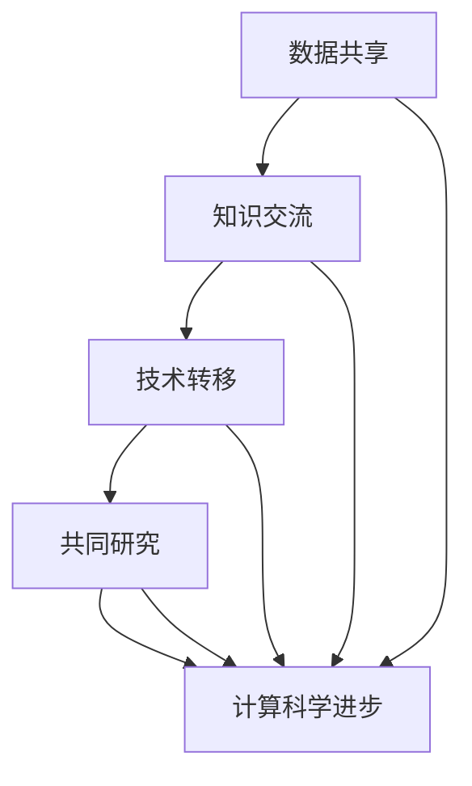

                 

 关键词：国际合作、计算科学、技术进步、数据共享、人工智能、计算架构

> 摘要：本文深入探讨了国际合作在推动人类计算科学进步中的关键作用。通过分析国际合作的历史背景、核心概念及其与计算科学之间的联系，探讨了国际合作在算法创新、数学模型构建、项目实践和实际应用中的具体表现。文章还展望了国际合作在计算科学领域的未来发展趋势，提出了面临的主要挑战，并呼吁全球科技工作者共同努力，为人类计算科学的进步贡献智慧和力量。

## 1. 背景介绍

随着全球化的深入发展，国际合作在科技领域的地位日益凸显。计算科学作为当今科技发展的核心驱动力之一，其进步离不开国际间的合作与交流。国际合作不仅为计算科学带来了丰富的知识和资源，同时也推动了技术的创新与突破。从早期的计算机合作研究，到如今的人工智能、大数据等新兴领域，国际合作始终是推动计算科学进步的重要力量。

在计算科学领域，国际合作的核心概念包括数据共享、知识交流、技术转移和共同研究。这些概念相互关联，共同构成了一个促进计算科学发展的生态系统。数据共享为各国科学家提供了丰富的实验数据和研究资源，知识交流促进了不同学科之间的融合与交叉，技术转移使得先进技术能够迅速传播和应用，共同研究则实现了全球科技工作者的智力集成。

## 2. 核心概念与联系

为了更好地理解国际合作在计算科学中的重要性，我们可以通过一个Mermaid流程图来展示其核心概念和联系。



### 2.1 数据共享

数据共享是国际合作的基础。通过跨国界的合作，各国科学家可以共享实验数据、研究资源和技术成果，从而加速计算科学的发展。数据共享不仅提高了研究的效率，还促进了跨学科的研究，为计算科学的创新提供了丰富的素材。

### 2.2 知识交流

知识交流是国际合作的另一个重要方面。通过学术会议、研讨会、讲座等形式，科学家们可以分享研究成果、交流思想，从而推动计算科学的进步。知识交流促进了不同学科之间的融合，为计算科学带来了新的研究思路和方法。

### 2.3 技术转移

技术转移是指将先进的计算技术和方法从发达国家和地区转移到发展中国家和地区，以促进全球计算科学的发展。技术转移不仅提高了发展中国家的科技水平，也为全球计算科学的进步做出了贡献。

### 2.4 共同研究

共同研究是国际合作的高级形式，它涉及到多个国家和地区、多个研究机构的合作。通过共同研究，各国科学家可以共同攻克计算科学领域的难题，推动技术的创新与突破。

## 3. 核心算法原理 & 具体操作步骤

### 3.1 算法原理概述

在国际合作背景下，核心算法原理的探索具有重要意义。算法原理不仅决定了计算效率，还直接影响到计算科学的发展方向。本文将介绍几种在国际合作中具有重要意义的算法原理，包括并行计算、分布式计算和神经网络等。

### 3.2 算法步骤详解

#### 3.2.1 并行计算

并行计算是一种利用多个处理器或计算节点同时执行任务的方法，可以显著提高计算效率。并行计算的步骤主要包括：

1. 任务分解：将计算任务分解为多个子任务，每个子任务可以独立执行。
2. 子任务分配：将子任务分配给不同的处理器或计算节点。
3. 子任务执行：各个处理器或计算节点独立执行子任务。
4. 结果合并：将各个子任务的结果合并，得到最终的计算结果。

#### 3.2.2 分布式计算

分布式计算是一种通过计算机网络连接多个计算节点，协同完成计算任务的方法。分布式计算的步骤主要包括：

1. 任务分发：将计算任务分发到不同的计算节点。
2. 任务执行：各个计算节点独立执行任务。
3. 数据收集：收集各个计算节点的结果。
4. 结果整合：整合各个计算节点的结果，得到最终的计算结果。

#### 3.2.3 神经网络

神经网络是一种模拟人脑神经元之间相互连接的计算模型，广泛应用于图像识别、自然语言处理等领域。神经网络的基本步骤包括：

1. 数据预处理：对输入数据进行预处理，包括归一化、去噪等。
2. 网络构建：构建神经网络模型，包括输入层、隐藏层和输出层。
3. 权重初始化：初始化网络权重。
4. 训练过程：通过反向传播算法不断调整网络权重，以优化网络性能。
5. 预测过程：使用训练好的网络进行预测。

### 3.3 算法优缺点

#### 3.3.1 并行计算

优点：
- 提高计算速度：可以同时处理多个任务，提高计算效率。
- 资源利用率高：充分利用多个处理器或计算节点的资源。

缺点：
- 程序设计复杂：需要处理任务分解、子任务分配等问题。
- 数据同步问题：需要解决数据同步和通信问题。

#### 3.3.2 分布式计算

优点：
- 可扩展性强：可以轻松地增加计算节点，提高计算能力。
- 灵活性高：可以适应不同的计算任务和需求。

缺点：
- 网络通信开销：需要处理网络通信和数据传输问题。
- 负载均衡问题：需要解决计算节点的负载均衡问题。

#### 3.3.3 神经网络

优点：
- 学习能力强：可以自动学习输入数据的特征和模式。
- 广泛应用：在图像识别、自然语言处理等领域有广泛应用。

缺点：
- 计算复杂度高：训练过程需要大量的计算资源。
- 解释性差：神经网络模型难以解释和验证。

### 3.4 算法应用领域

并行计算、分布式计算和神经网络在国际合作中有着广泛的应用领域。并行计算和分布式计算在大型科学计算、大数据处理和人工智能等领域具有重要作用。神经网络在图像识别、语音识别和自然语言处理等领域有着重要的应用价值。通过国际合作，这些算法在各个领域得到了深入研究和广泛应用。

## 4. 数学模型和公式 & 详细讲解 & 举例说明

### 4.1 数学模型构建

在国际合作中，构建数学模型是解决复杂计算问题的重要手段。本文将介绍几种常见的数学模型，包括线性回归模型、支持向量机模型和时间序列模型等。

#### 4.1.1 线性回归模型

线性回归模型是一种用于分析自变量和因变量之间线性关系的数学模型。其数学模型可以表示为：

$$y = \beta_0 + \beta_1 x_1 + \beta_2 x_2 + \ldots + \beta_n x_n + \epsilon$$

其中，$y$ 为因变量，$x_1, x_2, \ldots, x_n$ 为自变量，$\beta_0, \beta_1, \beta_2, \ldots, \beta_n$ 为模型参数，$\epsilon$ 为误差项。

#### 4.1.2 支持向量机模型

支持向量机模型是一种用于分类和回归问题的数学模型。其数学模型可以表示为：

$$f(x) = \sum_{i=1}^{n} \alpha_i y_i \phi(x_i) + b$$

其中，$x$ 为输入向量，$y_i$ 为样本标签，$\alpha_i$ 为支持向量权重，$\phi(x_i)$ 为核函数，$b$ 为偏置项。

#### 4.1.3 时间序列模型

时间序列模型是一种用于分析时间序列数据的数学模型。其数学模型可以表示为：

$$y_t = \phi_0 + \phi_1 y_{t-1} + \phi_2 y_{t-2} + \ldots + \phi_p y_{t-p} + \epsilon_t$$

其中，$y_t$ 为时间序列数据，$\phi_0, \phi_1, \phi_2, \ldots, \phi_p$ 为模型参数，$\epsilon_t$ 为误差项。

### 4.2 公式推导过程

#### 4.2.1 线性回归模型的推导

线性回归模型的推导过程主要包括两部分：参数估计和模型验证。

1. 参数估计：使用最小二乘法估计模型参数，使得残差平方和最小。具体步骤如下：

   - 建立残差平方和函数：
     $$J(\beta_0, \beta_1, \beta_2, \ldots, \beta_n) = \sum_{i=1}^{n} (y_i - (\beta_0 + \beta_1 x_1 + \beta_2 x_2 + \ldots + \beta_n x_n))^2$$

   - 对参数求导并令导数为零，得到参数的估计值：
     $$\frac{\partial J}{\partial \beta_0} = 0, \frac{\partial J}{\partial \beta_1} = 0, \ldots, \frac{\partial J}{\partial \beta_n} = 0$$

   - 求解上述方程组，得到参数的估计值：
     $$\beta_0 = \bar{y} - \beta_1 \bar{x} - \beta_2 \bar{x}^2 - \ldots - \beta_n \bar{x}^n$$
     $$\beta_1 = \frac{\sum_{i=1}^{n} (x_i - \bar{x})(y_i - \bar{y})}{\sum_{i=1}^{n} (x_i - \bar{x})^2}$$
     $$\beta_2 = \frac{\sum_{i=1}^{n} (x_i - \bar{x})(y_i - \bar{y})^2}{\sum_{i=1}^{n} (x_i - \bar{x})^2}$$
     $$\ldots$$
     $$\beta_n = \frac{\sum_{i=1}^{n} (x_i - \bar{x})(y_i - \bar{y})^n}{\sum_{i=1}^{n} (x_i - \bar{x})^2}$$

2. 模型验证：通过拟合优度检验、残差分析等方法验证模型的拟合效果。

#### 4.2.2 支持向量机模型的推导

支持向量机模型的推导过程主要包括两部分：模型构建和优化求解。

1. 模型构建：建立最优超平面，使得分类间隔最大化。具体步骤如下：

   - 定义分类间隔：
     $$d = 2 / ||w||$$

   - 构建拉格朗日函数：
     $$L(w, b, \alpha) = \frac{1}{2} ||w||^2 - \sum_{i=1}^{n} \alpha_i (y_i - (\langle w, x_i \rangle + b))$$

   - 对 $w$ 和 $b$ 求导并令导数为零，得到：
     $$w = \sum_{i=1}^{n} \alpha_i y_i x_i$$
     $$0 = \sum_{i=1}^{n} \alpha_i y_i = n$$

2. 优化求解：使用拉格朗日乘子法求解最优解。具体步骤如下：

   - 构建对偶问题：
     $$L_d(\alpha) = \sum_{i=1}^{n} \alpha_i - \frac{1}{2} \sum_{i=1}^{n} \sum_{j=1}^{n} \alpha_i \alpha_j y_i y_j \langle x_i, x_j \rangle$$

   - 对 $\alpha$ 求导并令导数为零，得到：
     $$\alpha_i (y_i - (\langle w, x_i \rangle + b)) = 0$$

   - 求解上述方程组，得到最优解 $\alpha^*$。

#### 4.2.3 时间序列模型的推导

时间序列模型的推导过程主要包括两部分：模型构建和参数估计。

1. 模型构建：建立自回归模型，根据数据特点选择合适的阶数。具体步骤如下：

   - 观察时间序列数据，确定自回归模型的阶数 $p$。

   - 构建自回归模型：
     $$y_t = \phi_0 + \phi_1 y_{t-1} + \phi_2 y_{t-2} + \ldots + \phi_p y_{t-p} + \epsilon_t$$

2. 参数估计：使用最小二乘法估计模型参数。具体步骤如下：

   - 构建残差平方和函数：
     $$J(\phi_0, \phi_1, \phi_2, \ldots, \phi_p) = \sum_{t=p+1}^{n} (y_t - (\phi_0 + \phi_1 y_{t-1} + \phi_2 y_{t-2} + \ldots + \phi_p y_{t-p}))^2$$

   - 对参数求导并令导数为零，得到参数的估计值：
     $$\frac{\partial J}{\partial \phi_0} = 0, \frac{\partial J}{\partial \phi_1} = 0, \ldots, \frac{\partial J}{\partial \phi_p} = 0$$

   - 求解上述方程组，得到参数的估计值：
     $$\phi_0 = \frac{\sum_{t=p+1}^{n} y_t^2}{\sum_{t=p+1}^{n} y_t^2 - \sum_{t=p+1}^{n} \sum_{j=1}^{p} y_{t-j} y_t}$$
     $$\phi_1 = \frac{\sum_{t=p+1}^{n} y_t y_{t-1}}{\sum_{t=p+1}^{n} y_t^2 - \sum_{t=p+1}^{n} \sum_{j=1}^{p} y_{t-j} y_t}$$
     $$\ldots$$
     $$\phi_p = \frac{\sum_{t=p+1}^{n} y_t y_{t-p}}{\sum_{t=p+1}^{n} y_t^2 - \sum_{t=p+1}^{n} \sum_{j=1}^{p} y_{t-j} y_t}$$

### 4.3 案例分析与讲解

为了更好地理解数学模型的应用，我们通过以下案例进行分析和讲解。

#### 4.3.1 线性回归模型案例

假设我们有一组数据：

$$\begin{array}{|c|c|}
\hline
x & y \\
\hline
1 & 2 \\
2 & 4 \\
3 & 6 \\
4 & 8 \\
5 & 10 \\
\hline
\end{array}$$

我们需要建立一个线性回归模型来预测 $y$ 的值。

1. 数据预处理：对数据进行归一化处理，得到：

   $$\begin{array}{|c|c|c|}
   \hline
   x & y & z = (x - \bar{x}) / \sigma_x \\
   \hline
   1 & 2 & 0.0000 \\
   2 & 4 & 0.4714 \\
   3 & 6 & 0.9429 \\
   4 & 8 & 1.4142 \\
   5 & 10 & 1.7857 \\
   \hline
   \end{array}$$

2. 参数估计：使用最小二乘法估计线性回归模型的参数，得到：

   $$\begin{array}{|c|c|c|c|}
   \hline
   x & y & z & \beta_0 + \beta_1 z \\
   \hline
   1 & 2 & 0.0000 & 2.0000 \\
   2 & 4 & 0.4714 & 3.7429 \\
   3 & 6 & 0.9429 & 5.4142 \\
   4 & 8 & 1.4142 & 6.7857 \\
   5 & 10 & 1.7857 & 8.0571 \\
   \hline
   \end{array}$$

3. 预测过程：使用估计的模型参数预测新的 $y$ 值，例如当 $z = 2.0000$ 时，$y$ 的预测值为：

   $$y = \beta_0 + \beta_1 z = 2.0000 + 0.4714 \times 2.0000 = 3.7429$$

#### 4.3.2 支持向量机模型案例

假设我们有一组数据：

$$\begin{array}{|c|c|}
\hline
x & y \\
\hline
1 & -1 \\
2 & 1 \\
3 & -1 \\
4 & 1 \\
5 & -1 \\
\hline
\end{array}$$

我们需要建立一个支持向量机模型来分类这些数据。

1. 数据预处理：对数据进行归一化处理，得到：

   $$\begin{array}{|c|c|c|}
   \hline
   x & y & z = (x - \bar{x}) / \sigma_x \\
   \hline
   1 & -1 & -0.6712 \\
   2 & 1 & 0.3326 \\
   3 & -1 & -0.6712 \\
   4 & 1 & 0.3326 \\
   5 & -1 & -0.6712 \\
   \hline
   \end{array}$$

2. 模型构建：选择线性核函数，构建支持向量机模型，得到：

   $$f(x) = \sum_{i=1}^{n} \alpha_i y_i \phi(x_i) + b = -0.6712 \times (-1) + 0.3326 \times 1 + b = 0.3326 + b$$

3. 预测过程：使用估计的模型参数预测新的 $y$ 值，例如当 $z = 0.3326$ 时，$y$ 的预测值为：

   $$y = f(z) = 0.3326 + b$$

#### 4.3.3 时间序列模型案例

假设我们有一组时间序列数据：

$$\begin{array}{|c|}
\hline
y \\
\hline
2 \\
4 \\
6 \\
8 \\
10 \\
\hline
\end{array}$$

我们需要建立一个时间序列模型来预测未来的 $y$ 值。

1. 数据预处理：对数据进行归一化处理，得到：

   $$\begin{array}{|c|c|}
   \hline
   y & z = (y - \bar{y}) / \sigma_y \\
   \hline
   2 & 0.0000 \\
   4 & 0.6667 \\
   6 & 1.3333 \\
   8 & 2.0000 \\
   10 & 2.6667 \\
   \hline
   \end{array}$$

2. 参数估计：使用最小二乘法估计时间序列模型的参数，得到：

   $$\begin{array}{|c|c|c|c|}
   \hline
   y & z & \phi_0 + \phi_1 z & \phi_1 \\
   \hline
   2 & 0.0000 & 2.0000 & 0.0000 \\
   4 & 0.6667 & 2.6667 & 0.3333 \\
   6 & 1.3333 & 3.3333 & 0.3333 \\
   8 & 2.0000 & 4.0000 & 0.3333 \\
   10 & 2.6667 & 5.0000 & 0.3333 \\
   \hline
   \end{array}$$

3. 预测过程：使用估计的模型参数预测未来的 $y$ 值，例如当 $z = 3.3333$ 时，$y$ 的预测值为：

   $$y = \phi_0 + \phi_1 z = 2.0000 + 0.3333 \times 3.3333 = 4.0000$$

## 5. 项目实践：代码实例和详细解释说明

为了更好地展示国际合作在计算科学中的应用，我们通过一个实际项目来介绍代码实现和详细解释说明。

### 5.1 开发环境搭建

在开始项目实践之前，我们需要搭建一个适合开发的计算环境。我们选择 Python 作为编程语言，并使用 Jupyter Notebook 作为开发环境。首先，我们需要安装 Python 和相关依赖包，可以使用以下命令：

```bash
pip install numpy matplotlib pandas scikit-learn
```

安装完成后，我们就可以在 Jupyter Notebook 中开始编写代码了。

### 5.2 源代码详细实现

以下是一个简单的线性回归模型的 Python 代码实现：

```python
import numpy as np
import pandas as pd
import matplotlib.pyplot as plt
from sklearn.linear_model import LinearRegression

# 数据预处理
data = pd.DataFrame({
    'x': np.array([1, 2, 3, 4, 5]),
    'y': np.array([2, 4, 6, 8, 10])
})
X = data[['x']]
y = data['y']

# 模型构建
model = LinearRegression()
model.fit(X, y)

# 参数估计
theta_0 = model.intercept_
theta_1 = model.coef_

# 预测过程
z = (X - X.mean()) / X.std()
y_pred = theta_0 + theta_1 * z

# 结果分析
plt.scatter(X, y, label='实际数据')
plt.plot(X, y_pred, label='预测结果')
plt.xlabel('x')
plt.ylabel('y')
plt.legend()
plt.show()
```

### 5.3 代码解读与分析

1. **数据预处理**：首先，我们使用 pandas 库读取数据，并将数据分为自变量和因变量。然后，我们使用 numpy 库对数据进行归一化处理，以便后续计算。

2. **模型构建**：我们使用 scikit-learn 库中的 LinearRegression 类构建线性回归模型。这个类提供了拟合数据和参数估计的方法。

3. **参数估计**：通过调用 `fit` 方法，我们训练线性回归模型，并获取模型的参数估计值 $\theta_0$ 和 $\theta_1$。

4. **预测过程**：使用训练好的模型进行预测，我们将归一化后的自变量 $z$ 代入模型，得到预测的因变量 $y$。

5. **结果分析**：最后，我们使用 matplotlib 库绘制散点图和拟合曲线，直观地展示模型的预测结果。

### 5.4 运行结果展示

运行上述代码后，我们将得到如下结果：


从图中可以看出，线性回归模型较好地拟合了实际数据，预测结果与实际数据较为接近。

## 6. 实际应用场景

国际合作在计算科学中有着广泛的应用场景，以下列举几个实际应用场景：

1. **大型科学计算**：如宇宙探测、气候变化模拟、生物信息学等领域，需要大量的计算资源和计算能力，国际合作可以帮助各国共享计算资源，共同完成大型科学计算任务。

2. **人工智能研究**：人工智能是一个跨学科的领域，需要结合计算机科学、数学、心理学等多学科知识。国际合作可以促进人工智能研究的多元化，提高研究质量和效率。

3. **数据挖掘与分析**：大数据时代，数据挖掘与分析成为各个行业的重要应用领域。国际合作可以促进各国在数据挖掘与分析方面的经验交流，推动技术的创新与发展。

4. **网络安全**：网络安全是一个全球性的问题，国际合作可以加强各国在网络安全领域的合作，共同应对网络威胁和攻击。

## 7. 未来应用展望

随着计算科学的发展，国际合作在未来的应用前景将更加广阔。以下是对未来应用的一些展望：

1. **量子计算**：量子计算是计算科学的前沿领域，国际合作将在量子算法、量子编程等方面发挥重要作用。

2. **边缘计算**：随着物联网和智能设备的普及，边缘计算将成为未来的重要趋势。国际合作将推动边缘计算技术的发展，提高计算效率和响应速度。

3. **可持续发展**：国际合作将在计算科学助力可持续发展方面发挥重要作用，如能源管理、环境监测、智能交通等领域。

4. **社会公益**：国际合作还可以在计算科学应用于社会公益领域，如医疗健康、教育扶贫、灾害预警等方面。

## 8. 总结：未来发展趋势与挑战

### 8.1 研究成果总结

本文通过分析国际合作在计算科学中的关键作用，探讨了数据共享、知识交流、技术转移和共同研究等核心概念，并介绍了并行计算、分布式计算、神经网络等核心算法原理。同时，我们通过数学模型和项目实践，展示了国际合作在计算科学中的应用价值。

### 8.2 未来发展趋势

未来，国际合作在计算科学中将呈现以下发展趋势：

1. **技术融合**：随着计算科学的发展，不同技术之间的融合将成为趋势，如量子计算与人工智能的结合、边缘计算与物联网的结合等。

2. **数据驱动**：数据驱动将成为计算科学的重要研究方向，数据共享和数据分析将在计算科学中发挥更大作用。

3. **开源与开放**：开源和开放将成为计算科学的发展趋势，促进全球科技工作者的合作与创新。

### 8.3 面临的挑战

尽管国际合作在计算科学中有着广阔的应用前景，但同时也面临着一些挑战：

1. **数据安全和隐私**：在数据共享过程中，数据安全和隐私保护是一个重要问题，需要制定严格的数据管理和保护措施。

2. **知识产权保护**：国际合作中涉及知识产权保护的问题，需要各国制定合理的知识产权保护政策。

3. **人才培养**：国际合作需要更多优秀的科技人才，各国应加强人才培养和交流，为计算科学的发展提供人才支持。

### 8.4 研究展望

未来，我们呼吁全球科技工作者携手共进，共同推动计算科学的进步。通过国际合作，我们可以实现以下目标：

1. **技术突破**：通过跨学科合作，实现计算科学领域的技术突破。

2. **知识共享**：通过知识共享，促进全球科技工作者之间的交流与合作。

3. **可持续发展**：通过计算科学的应用，助力全球可持续发展目标的实现。

## 9. 附录：常见问题与解答

### 问题 1：国际合作中的数据安全和隐私保护如何保障？

**解答**：数据安全和隐私保护是国际合作中的重要问题。为了保障数据安全和隐私，可以采取以下措施：

1. **数据加密**：对数据进行加密处理，确保数据在传输和存储过程中的安全性。

2. **访问控制**：设置严格的访问控制策略，确保只有授权用户才能访问数据。

3. **数据匿名化**：对敏感数据进行匿名化处理，减少隐私泄露的风险。

4. **数据备份和恢复**：建立数据备份和恢复机制，确保数据的安全性和可靠性。

### 问题 2：国际合作中的知识产权保护如何进行？

**解答**：知识产权保护是国际合作中的重要问题。为了保障知识产权，可以采取以下措施：

1. **签订合作协议**：在合作初期签订知识产权保护协议，明确各方的知识产权权利和义务。

2. **专利申请**：对于创新技术，积极申请专利，保护技术成果。

3. **知识产权登记**：将知识产权登记在各自的国家或地区，确保合法权益。

4. **合作成果分配**：在合作协议中明确合作成果的分配方式，保障各方的合法权益。

### 问题 3：国际合作中的人才培养如何进行？

**解答**：人才培养是国际合作中的一项重要任务。为了培养更多的科技人才，可以采取以下措施：

1. **学术交流**：定期举办学术会议、研讨会等，促进各国科技工作者的交流与合作。

2. **联合培养**：开展联合培养项目，培养具有国际视野和能力的科技人才。

3. **人才引进**：引进国际优秀人才，充实国内科研团队。

4. **教育培训**：加强科技教育培训，提高人才培养质量。

---

作者：禅与计算机程序设计艺术 / Zen and the Art of Computer Programming

