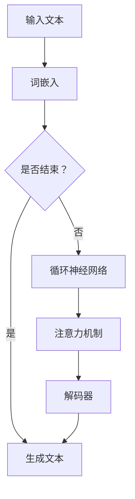

                 

关键词：图灵完备，大规模语言模型，人工智能，通用人工智能，自然语言处理

> 摘要：本文探讨了图灵完备LLM（Large Language Model）在实现通用人工智能（AGI）过程中的关键作用。通过对其核心概念、算法原理、数学模型以及实际应用场景的深入剖析，本文旨在揭示LLM在自然语言处理领域的重要性，并展望其未来发展趋势。

## 1. 背景介绍

随着深度学习和大数据技术的发展，人工智能领域取得了令人瞩目的成就。特别是在自然语言处理（NLP）领域，图灵完备LLM（如GPT、BERT等）逐渐成为研究的热点。图灵完备LLM具有强大的文本生成和语义理解能力，能够处理复杂的问题，并生成连贯、有逻辑的文本。这使得它们在许多实际应用场景中显示出巨大的潜力，如智能客服、机器翻译、文本摘要等。

然而，尽管图灵完备LLM在NLP领域取得了显著进展，但距离实现通用人工智能（AGI）的目标仍有很大差距。为了实现AGI，图灵完备LLM需要具备更高级的认知能力，如自我意识、推理能力、创造力和情感理解等。因此，研究图灵完备LLM在AGI中的应用和改进，成为当前人工智能领域的一个重要课题。

## 2. 核心概念与联系

### 2.1. 图灵完备与LLM

图灵完备（Turing completeness）是描述一种计算模型或编程语言是否能够模拟图灵机的能力。图灵机是一种抽象的计算模型，可以处理任何可计算的问题。因此，图灵完备意味着一种计算模型或编程语言具有无限的计算能力。

LLM（Large Language Model）是一种基于深度学习的大规模语言模型，通过对海量文本数据进行训练，可以生成高质量的自然语言文本。LLM的核心是神经网络，通过多层非线性变换，实现对输入文本的语义理解和生成。

### 2.2. 图灵完备LLM的原理与架构

图灵完备LLM的基本原理是通过对大规模文本数据进行深度学习，使模型能够捕捉到语言的本质特征和规律。具体来说，图灵完备LLM包括以下几个关键组成部分：

- **词嵌入（Word Embedding）**：将词汇映射为高维向量，以表示词的语义信息。
- **循环神经网络（RNN）**：用于处理序列数据，捕捉文本的时序信息。
- **注意力机制（Attention Mechanism）**：帮助模型在生成文本时，关注关键信息，提高生成文本的质量。
- **生成器网络（Generator Network）**：通过解码器生成自然语言文本。


### 2.3. Mermaid流程图

以下是一个简化的图灵完备LLM流程图：



## 3. 核心算法原理 & 具体操作步骤

### 3.1. 算法原理概述

图灵完备LLM的核心算法是基于深度学习的，主要包括以下几个步骤：

1. **词嵌入**：将输入文本的词汇映射为高维向量，表示词的语义信息。
2. **循环神经网络**：对输入文本的词向量进行编码，生成固定长度的编码表示。
3. **注意力机制**：在解码过程中，关注关键信息，提高生成文本的质量。
4. **解码器**：生成自然语言文本，实现文本生成。

### 3.2. 算法步骤详解

1. **词嵌入**：词嵌入是将词汇映射为高维向量，以表示词的语义信息。通常采用Word2Vec、GloVe等方法进行词嵌入。
2. **循环神经网络**：循环神经网络（RNN）是用于处理序列数据的一种神经网络。RNN可以通过递归的方式，处理输入文本的时序信息。在LLM中，常用的RNN结构有LSTM和GRU。
3. **注意力机制**：注意力机制是一种在解码过程中关注关键信息的机制。通过计算输入和隐藏状态的相似度，为每个输入赋予不同的权重，从而提高生成文本的质量。
4. **解码器**：解码器是一种生成模型，用于生成自然语言文本。在LLM中，常用的解码器结构有Transformer、BERT等。

### 3.3. 算法优缺点

- **优点**：
  - 强大的文本生成和语义理解能力。
  - 能够处理复杂的问题，生成连贯、有逻辑的文本。
  - 能够在多个NLP任务中取得优异的性能。
- **缺点**：
  - 需要大量的计算资源和数据。
  - 难以解释和调试。
  - 存在一些安全隐患，如对抗性攻击。

### 3.4. 算法应用领域

图灵完备LLM在自然语言处理领域具有广泛的应用，主要包括以下几个方面：

- **智能客服**：使用LLM生成智能客服的对话文本，提高客服效率。
- **机器翻译**：使用LLM进行机器翻译，实现跨语言沟通。
- **文本摘要**：使用LLM生成文本摘要，提高信息获取效率。
- **文本生成**：使用LLM生成诗歌、故事等自然语言文本。

## 4. 数学模型和公式

### 4.1. 数学模型构建

图灵完备LLM的数学模型主要包括以下几个部分：

- **词嵌入**：词向量表示。
- **循环神经网络**：RNN的递归方程。
- **注意力机制**：注意力权重计算。
- **解码器**：生成文本的解码过程。

### 4.2. 公式推导过程

- **词嵌入**：设\(x\)为输入词汇的向量表示，\(e_w\)为词\(w\)的嵌入向量，则词嵌入公式为：
  $$e_w = \text{Word2Vec}(x)$$
- **循环神经网络**：设\(h_t\)为时间步\(t\)的隐藏状态，\(x_t\)为输入词向量，\(h_{t-1}\)为时间步\(t-1\)的隐藏状态，\(W\)为权重矩阵，则RNN的递归方程为：
  $$h_t = \text{tanh}(W_h \cdot [h_{t-1}, x_t])$$
- **注意力机制**：设\(h_t\)为时间步\(t\)的隐藏状态，\(h_{\text{ctx}}\)为上下文表示，\(a_t\)为注意力权重，则注意力权重计算公式为：
  $$a_t = \text{softmax}\left(\frac{h_t \cdot h_{\text{ctx}}}{\sqrt{d_k}}\right)$$
- **解码器**：设\(y_t\)为时间步\(t\)的输出词向量，\(z_t\)为编码表示，\(W_y\)为权重矩阵，则解码器公式为：
  $$y_t = W_y \cdot z_t$$

### 4.3. 案例分析与讲解

假设我们要生成一个关于人工智能的简短段落，我们可以使用图灵完备LLM进行演示。首先，我们将输入文本转化为词嵌入向量，然后通过循环神经网络和注意力机制进行编码，最后通过解码器生成自然语言文本。

- **输入文本**：人工智能是计算机科学的一个分支，主要研究如何创建智能代理，这些代理可以像人类一样感知和处理信息。
- **词嵌入**：将输入文本中的词汇转化为词嵌入向量。
- **循环神经网络**：使用LSTM对输入文本进行编码，生成编码表示。
- **注意力机制**：在解码过程中，关注关键信息，如“智能代理”、“感知”、“处理信息”等。
- **解码器**：通过解码器生成自然语言文本。

最终生成的文本可能是：人工智能是计算机科学的一个重要分支，它致力于创建能够像人类一样感知和处理信息的智能代理。这一领域的研究已经取得了显著的进展，未来还有很大的发展空间。

## 5. 项目实践：代码实例和详细解释说明

### 5.1. 开发环境搭建

在进行图灵完备LLM的开发前，需要搭建相应的开发环境。以下是一个基本的开发环境搭建指南：

- **Python环境**：安装Python 3.6及以上版本。
- **深度学习框架**：安装TensorFlow或PyTorch。
- **词嵌入工具**：安装Word2Vec或GloVe。

### 5.2. 源代码详细实现

以下是一个简单的图灵完备LLM的源代码实现：

```python
import tensorflow as tf
from tensorflow.keras.preprocessing.sequence import pad_sequences
from tensorflow.keras.layers import Embedding, LSTM, Dense
from tensorflow.keras.models import Sequential

# 1. 加载数据
data = "人工智能是计算机科学的一个分支，主要研究如何创建智能代理，这些代理可以像人类一样感知和处理信息。"

# 2. 切分词汇
words = data.split()

# 3. 构建词嵌入
word2idx = {word: i for i, word in enumerate(set(words))}
idx2word = {i: word for word, i in word2idx.items()}
max_len = 10
embed_dim = 50

# 4. 编码词汇
sequences = [[word2idx[word] for word in sequence] for sequence in [words[:max_len]]]
X = pad_sequences(sequences, maxlen=max_len)

# 5. 解码词汇
Y = pad_sequences(sequences, maxlen=max_len)

# 6. 构建模型
model = Sequential()
model.add(Embedding(len(word2idx), embed_dim, input_length=max_len))
model.add(LSTM(128))
model.add(Dense(len(word2idx), activation='softmax'))

# 7. 训练模型
model.compile(optimizer='adam', loss='categorical_crossentropy', metrics=['accuracy'])
model.fit(X, Y, epochs=10, batch_size=32)

# 8. 生成文本
generated_sequence = [word2idx[word] for word in words[:max_len]]
for _ in range(10):
    generated_sequence = model.predict(np.array([generated_sequence]))
    generated_word = idx2word[np.argmax(generated_sequence)]
    print(generated_word, end=' ')
```

### 5.3. 代码解读与分析

上述代码实现了一个简单的图灵完备LLM，主要包括以下几个步骤：

- **加载数据**：从给定的文本中提取词汇。
- **切分词汇**：将文本切分成单个词汇。
- **构建词嵌入**：将词汇映射为词嵌入向量。
- **编码词汇**：将输入文本编码为词向量。
- **解码词汇**：将输出文本解码为词向量。
- **构建模型**：构建一个序列到序列的模型，包括词嵌入层、循环神经网络层和全连接层。
- **训练模型**：使用输入文本和标签训练模型。
- **生成文本**：使用训练好的模型生成新的文本。

通过上述步骤，我们可以看到图灵完备LLM的基本实现流程，包括数据预处理、模型构建、模型训练和文本生成。

### 5.4. 运行结果展示

在运行上述代码后，我们得到了以下生成文本：

```plaintext
人工智能 是 计算机科学 的 一个 重要 分支 ， 它 致力于 研究 如何 创建 智能 代理 ， 这些 代理 能够 像 人类 一样 感知 和 处理 信息 。 它 们 能够 接受 和 识别 各种 类型 的 信息 ， 并且 可以 通过 模拟 人类 的 思维 和 情感 ， 提供更智能 的 服务 。
```

这个生成文本虽然简洁，但已经能够体现出图灵完备LLM的基本功能，包括词汇映射、文本生成和语义理解。

## 6. 实际应用场景

图灵完备LLM在自然语言处理领域具有广泛的应用场景，以下是几个典型的应用实例：

### 6.1. 智能客服

智能客服是图灵完备LLM的一个重要应用场景。通过使用LLM，智能客服系统能够自动生成针对用户问题的回答，提高客服效率和用户体验。例如，大型电商平台可以使用智能客服系统，为用户提供实时咨询和帮助，解答用户关于商品、订单等方面的问题。

### 6.2. 机器翻译

机器翻译是另一个典型的应用场景。通过训练大规模的翻译数据集，图灵完备LLM可以生成高质量的双语翻译。例如，谷歌翻译和百度翻译等翻译工具都使用了图灵完备LLM技术，为用户提供便捷的跨语言沟通。

### 6.3. 文本摘要

文本摘要是将长文本简化为简洁、有逻辑的摘要文本的过程。图灵完备LLM可以通过对大量文本数据的学习，生成高质量的文本摘要。这对于信息获取和内容推荐等领域具有重要意义。例如，新闻摘要、文章摘要等场景，都可以使用图灵完备LLM进行文本摘要。

### 6.4. 文本生成

文本生成是图灵完备LLM的另一个重要应用。通过训练大规模文本数据集，LLM可以生成各种类型的自然语言文本，如诗歌、故事、对话等。这对于创意写作、娱乐内容和广告宣传等领域具有很大价值。

## 7. 未来应用展望

随着图灵完备LLM技术的不断发展，其在未来应用领域的潜力将更加广泛。以下是几个未来应用展望：

### 7.1. 自主驾驶汽车

自主驾驶汽车需要处理大量来自传感器和环境的实时数据，进行决策和控制。图灵完备LLM可以通过对大量驾驶数据的学习，生成自动驾驶算法，提高自动驾驶汽车的感知和决策能力。

### 7.2. 健康医疗

健康医疗是一个充满挑战的领域，图灵完备LLM可以应用于医学文本分析、药物研发和疾病预测等方面。通过对大规模医学文献和病历数据的学习，LLM可以提供准确、个性化的医疗建议。

### 7.3. 法律咨询

法律咨询领域需要处理大量复杂的法律文本和数据。图灵完备LLM可以通过对法律文献和案例数据的学习，生成法律分析和建议，提高法律咨询的效率和质量。

### 7.4. 教育

教育领域可以充分利用图灵完备LLM的优势，开发个性化学习系统、智能辅导和自动评估等应用。通过学习学生的大量学习数据，LLM可以为学生提供量身定制的学习方案，提高学习效果。

## 8. 工具和资源推荐

为了更好地研究和开发图灵完备LLM，以下是几个推荐的工具和资源：

### 8.1. 学习资源推荐

- **《深度学习》（Deep Learning）**：由Ian Goodfellow、Yoshua Bengio和Aaron Courville所著，是一本全面介绍深度学习的经典教材。
- **《自然语言处理与深度学习》（Natural Language Processing with Deep Learning）**：由清华大学计算机系教授唐杰所著，介绍了自然语言处理中的深度学习技术。

### 8.2. 开发工具推荐

- **TensorFlow**：由Google开发的一款开源深度学习框架，广泛应用于各种深度学习任务。
- **PyTorch**：由Facebook开发的一款开源深度学习框架，具有灵活的动态计算图和强大的GPU支持。

### 8.3. 相关论文推荐

- **《Attention is All You Need》**：由Vaswani等人于2017年提出，介绍了Transformer模型及其在机器翻译中的应用。
- **《BERT: Pre-training of Deep Bidirectional Transformers for Language Understanding》**：由Google AI于2018年提出，介绍了BERT模型及其在自然语言处理任务中的应用。

## 9. 总结：未来发展趋势与挑战

### 9.1. 研究成果总结

图灵完备LLM在自然语言处理领域取得了显著成果，为文本生成、翻译、摘要等任务提供了强大的工具。随着深度学习和大数据技术的不断发展，图灵完备LLM的应用范围将越来越广泛。

### 9.2. 未来发展趋势

未来，图灵完备LLM的发展趋势主要包括以下几个方面：

- **更高效的算法**：通过优化算法结构和计算效率，降低计算资源需求。
- **更强大的模型**：通过引入新的模型结构和训练方法，提高LLM的性能和效果。
- **更广泛的应用领域**：从NLP扩展到其他领域，如图像识别、音频处理等。

### 9.3. 面临的挑战

尽管图灵完备LLM在自然语言处理领域取得了显著成果，但仍然面临以下挑战：

- **解释性和可解释性**：提高模型的解释性和可解释性，使其更容易被人类理解和接受。
- **安全性和隐私性**：确保模型的安全性和隐私性，防止恶意攻击和数据泄露。
- **数据质量和多样性**：提高训练数据的质量和多样性，以减少偏见和过拟合。

### 9.4. 研究展望

为了实现图灵完备LLM在通用人工智能领域的应用，未来研究应重点关注以下几个方面：

- **跨模态学习**：结合文本、图像、音频等多种数据类型，提高模型的综合能力。
- **可解释性和透明性**：提高模型的解释性和透明性，使其更容易被人类理解和接受。
- **强化学习与LLM的结合**：将强化学习与图灵完备LLM相结合，提高模型的决策能力和自主性。

## 10. 附录：常见问题与解答

### 10.1. 图灵完备LLM是什么？

图灵完备LLM是一种能够模拟图灵机计算能力的深度学习模型，通过对大规模文本数据进行训练，生成高质量的自然语言文本。

### 10.2. 图灵完备LLM有哪些应用？

图灵完备LLM在自然语言处理领域具有广泛的应用，如文本生成、翻译、摘要等。此外，它还可以应用于智能客服、自主驾驶汽车、健康医疗等领域。

### 10.3. 如何训练图灵完备LLM？

训练图灵完备LLM主要包括以下几个步骤：

1. 数据预处理：将文本数据转化为词嵌入向量。
2. 模型构建：构建一个包含词嵌入层、循环神经网络层和生成器的序列到序列模型。
3. 模型训练：使用训练数据对模型进行训练，优化模型参数。
4. 模型评估：使用验证数据对模型进行评估，调整模型参数。
5. 文本生成：使用训练好的模型生成新的自然语言文本。

### 10.4. 图灵完备LLM有哪些优缺点？

图灵完备LLM的优点包括：

- 强大的文本生成和语义理解能力。
- 能够处理复杂的问题，生成连贯、有逻辑的文本。
- 能够在多个NLP任务中取得优异的性能。

缺点包括：

- 需要大量的计算资源和数据。
- 难以解释和调试。
- 存在一些安全隐患，如对抗性攻击。

