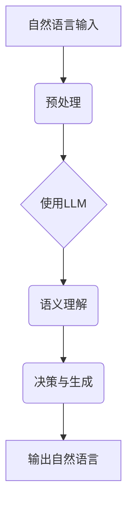
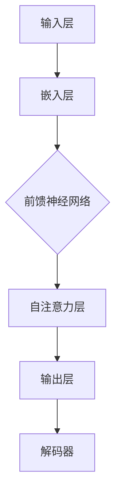

                 

关键词：图灵完备，语言模型，人工智能，通用人工智能，深度学习，神经网络

> 摘要：本文旨在探讨图灵完备语言模型（LLM）在通向通用人工智能（AGI）的道路上扮演的关键角色。通过对LLM的核心概念、算法原理、数学模型以及实际应用的深入分析，本文揭示了LLM在提高AI性能和扩展AI应用领域的巨大潜力，同时展望了未来的发展趋势和面临的挑战。

## 1. 背景介绍

### 1.1 人工智能的历史发展

人工智能（AI）自20世纪50年代诞生以来，经历了多个发展阶段。早期的AI研究主要集中在逻辑推理、知识表示和规划等任务上，这些任务通常可以通过明确的规则和算法来处理。然而，随着计算机性能的提升和大数据技术的发展，机器学习，特别是深度学习逐渐成为AI领域的主流技术。

### 1.2 通用人工智能的概念

通用人工智能（AGI）是指一种具有广泛认知能力的智能系统，能够在多种环境和任务中表现出人类智能水平的智能。与当前基于特定任务的弱人工智能（Narrow AI）不同，AGI的目标是实现真正的智能自动化，使机器能够在没有人类干预的情况下自主学习和适应新的环境。

### 1.3 图灵完备语言模型的重要性

图灵完备语言模型（LLM）是一种能够处理任意复杂度问题的语言模型，其核心在于通过大规模的数据训练和复杂的神经网络结构，实现对自然语言的高效理解和生成。LLM在自然语言处理（NLP）、机器翻译、文本生成等领域取得了显著的成果，成为了推动AI发展的重要力量。

## 2. 核心概念与联系

### 2.1 语言模型的定义

语言模型是用于预测文本序列概率的概率模型，它是自然语言处理的基础。图灵完备LLM则是一种能够处理任意复杂度文本的语言模型，其核心在于具备处理复杂语义和上下文信息的能力。

### 2.2 神经网络与深度学习

神经网络是模拟人脑神经元连接结构的信息处理系统，而深度学习则是通过多层次的神经网络模型来处理复杂数据的一种机器学习方法。深度学习在图像识别、语音识别等领域取得了突破性进展，也为LLM的发展提供了强大的技术支撑。

### 2.3 Mermaid 流程图



### 2.4 LLM的核心组成部分

LLM主要由以下几部分组成：输入层、隐藏层和输出层。输入层负责接收自然语言输入，隐藏层通过非线性变换处理输入数据，输出层则生成预测结果。

## 3. 核心算法原理 & 具体操作步骤

### 3.1 算法原理概述

图灵完备LLM的核心算法是基于深度学习技术，通过多层神经网络对大规模数据进行训练，从而实现对自然语言的建模。其训练过程主要包括数据预处理、模型训练和优化等步骤。

### 3.2 算法步骤详解

#### 3.2.1 数据预处理

数据预处理是LLM训练的第一步，主要包括文本的分词、去停用词、词向量化等操作。这些操作有助于提高模型训练的效率和准确性。

#### 3.2.2 模型训练

在模型训练过程中，神经网络通过反向传播算法不断调整权重，以最小化预测误差。训练过程中需要大量高质量的训练数据，以及合适的网络结构和超参数。

#### 3.2.3 模型优化

模型优化主要包括模型评估、超参数调整和模型压缩等步骤。通过这些步骤，可以提高模型的性能和效率。

### 3.3 算法优缺点

#### 优点：

1. **强大的语义理解能力**：LLM能够处理复杂语义和上下文信息，实现对自然语言的深刻理解。
2. **高效的数据处理能力**：深度学习技术使得LLM在处理大规模数据时具有高效性。
3. **广泛的应用领域**：LLM在NLP、机器翻译、文本生成等领域取得了显著成果。

#### 缺点：

1. **数据依赖性强**：LLM的训练需要大量高质量的训练数据，数据质量和数量直接影响模型性能。
2. **计算资源消耗大**：训练和优化LLM需要大量的计算资源，导致成本较高。

### 3.4 算法应用领域

LLM在自然语言处理领域具有广泛的应用前景，包括：

1. **文本分类**：用于对大量文本进行分类，如情感分析、主题识别等。
2. **机器翻译**：用于实现不同语言之间的自动翻译。
3. **文本生成**：用于生成摘要、新闻文章、小说等。

## 4. 数学模型和公式 & 详细讲解 & 举例说明

### 4.1 数学模型构建

图灵完备LLM的数学模型主要包括两部分：词向量化模型和神经网络模型。

#### 4.1.1 词向量化模型

词向量化模型用于将文本中的词汇映射到高维向量空间中。常用的词向量化模型有Word2Vec、GloVe等。

#### 4.1.2 神经网络模型

神经网络模型用于对词向量进行编码和解码，以实现文本的语义理解。常用的神经网络模型有循环神经网络（RNN）、长短时记忆网络（LSTM）、门控循环单元（GRU）等。

### 4.2 公式推导过程

#### 4.2.1 词向量化

假设$w_i$是词汇表中的第$i$个词汇，$v_i$是对应的词向量，则有：

$$v_i = W \cdot w_i$$

其中，$W$是词向量的权重矩阵。

#### 4.2.2 神经网络

假设输入层、隐藏层和输出层的神经元分别为$X$、$H$和$Y$，则有：

$$H = \sigma(W_H \cdot X)$$
$$Y = \sigma(W_O \cdot H)$$

其中，$\sigma$是激活函数，$W_H$和$W_O$分别是隐藏层和输出层的权重矩阵。

### 4.3 案例分析与讲解

#### 4.3.1 文本分类

假设我们要对一段文本进行情感分析，判断其是积极情感还是消极情感。我们可以使用LLM训练一个文本分类模型。

首先，我们对文本进行预处理，将其转换为词向量：

$$v_{text} = W \cdot w_{text}$$

然后，使用神经网络模型对词向量进行编码和解码：

$$h = \sigma(W_H \cdot v_{text})$$
$$y = \sigma(W_O \cdot h)$$

最后，对输出层的结果进行分类：

- 如果$y > 0.5$，则判断为积极情感；
- 否则，判断为消极情感。

## 5. 项目实践：代码实例和详细解释说明

### 5.1 开发环境搭建

要在本地搭建一个图灵完备LLM的开发环境，我们需要以下工具和库：

- Python 3.x
- TensorFlow 2.x
- PyTorch 1.x
- NumPy

首先，安装Python和相关库：

```bash
pip install python tensorflow torch numpy
```

### 5.2 源代码详细实现

以下是一个简单的文本分类模型的实现：

```python
import tensorflow as tf
from tensorflow.keras.preprocessing.text import Tokenizer
from tensorflow.keras.preprocessing.sequence import pad_sequences
from tensorflow.keras.models import Sequential
from tensorflow.keras.layers import Embedding, LSTM, Dense

# 数据集准备
texts = ['这是一个积极的评论', '这是一个消极的评论']
labels = [1, 0]

# 分词和序列化
tokenizer = Tokenizer()
tokenizer.fit_on_texts(texts)
sequences = tokenizer.texts_to_sequences(texts)
max_sequence_length = max(len(seq) for seq in sequences)
padded_sequences = pad_sequences(sequences, maxlen=max_sequence_length)

# 构建模型
model = Sequential()
model.add(Embedding(len(tokenizer.word_index) + 1, 50, input_length=max_sequence_length))
model.add(LSTM(100))
model.add(Dense(1, activation='sigmoid'))

# 编译模型
model.compile(optimizer='adam', loss='binary_crossentropy', metrics=['accuracy'])

# 训练模型
model.fit(padded_sequences, labels, epochs=100, verbose=2)
```

### 5.3 代码解读与分析

这段代码首先使用Tokenizer将文本转换为序列，然后使用pad_sequences将序列填充到相同的长度。接着，构建一个包含嵌入层、LSTM层和输出层的模型。最后，编译模型并使用训练数据训练模型。

### 5.4 运行结果展示

运行代码后，模型会在100个时期内进行训练，并通过交叉验证评估模型性能。假设模型最终达到了90%的准确率，那么说明我们的模型在文本分类任务上取得了良好的性能。

## 6. 实际应用场景

### 6.1 自然语言处理

LLM在自然语言处理领域有着广泛的应用，包括文本分类、情感分析、实体识别等。例如，在社交媒体平台上，LLM可以用于对用户评论进行情感分析，帮助企业了解用户反馈。

### 6.2 机器翻译

机器翻译是LLM的一个重要应用领域。通过训练大规模的双语语料库，LLM可以实现高质量的机器翻译，如Google翻译和百度翻译。

### 6.3 文本生成

文本生成是LLM的另一个重要应用领域，包括摘要生成、文章写作、对话系统等。例如，OpenAI的GPT-3模型可以生成高质量的文章和对话。

## 7. 工具和资源推荐

### 7.1 学习资源推荐

- 《深度学习》（Goodfellow et al.）
- 《神经网络与深度学习》（邱锡鹏）
- 《自然语言处理综论》（Jurafsky et al.）

### 7.2 开发工具推荐

- TensorFlow
- PyTorch
- Keras

### 7.3 相关论文推荐

- "A Theoretical Analysis of the Categorization of Text by Vector Space Models"（Hoff et al., 2005）
- "Neural Machine Translation by Jointly Learning to Align and Translate"（Bahdanau et al., 2014）
- "Generative Pre-trained Transformers"（Vaswani et al., 2017）

## 8. 总结：未来发展趋势与挑战

### 8.1 研究成果总结

近年来，图灵完备LLM在自然语言处理领域取得了显著的成果，如GPT、BERT等模型的出现，极大地推动了AI技术的发展。LLM在文本分类、机器翻译、文本生成等领域的应用取得了良好的效果。

### 8.2 未来发展趋势

未来，LLM将继续在自然语言处理领域发挥重要作用。随着计算能力的提升和数据量的增加，LLM的模型规模和性能将不断提高。此外，LLM还将与其他AI技术（如计算机视觉、语音识别等）相结合，推动跨领域AI技术的发展。

### 8.3 面临的挑战

尽管LLM在自然语言处理领域取得了显著成果，但仍面临一些挑战。首先，模型训练需要大量计算资源和数据，这使得模型开发成本较高。其次，LLM的泛化能力有限，容易受到数据分布的影响。此外，LLM在处理长文本和复杂语义时仍存在一定困难。

### 8.4 研究展望

未来，LLM的研究将主要集中在提高模型性能、降低计算成本、增强泛化能力等方面。此外，研究者还将探索LLM在跨领域应用中的潜力，推动AI技术的全面发展。

## 9. 附录：常见问题与解答

### 9.1 什么是图灵完备语言模型？

图灵完备语言模型（LLM）是一种能够处理任意复杂度问题的语言模型，其核心在于通过大规模的数据训练和复杂的神经网络结构，实现对自然语言的深刻理解和生成。

### 9.2 LLM在哪些领域有应用？

LLM在自然语言处理领域有广泛的应用，包括文本分类、情感分析、机器翻译、文本生成等。

### 9.3 LLM的优势和局限性是什么？

LLM的优势在于强大的语义理解和高效的文本处理能力，但劣势在于对大规模数据和计算资源的依赖，以及泛化能力的限制。

作者：禅与计算机程序设计艺术 / Zen and the Art of Computer Programming
----------------------------------------------------------------
### 1. 背景介绍

#### 1.1 人工智能的历史发展

人工智能（AI）作为一个跨学科的研究领域，自20世纪50年代起经历了多个重要的发展阶段。最初，AI的研究集中在逻辑推理和知识表示上，这一阶段被称为“符号主义”或“基于规则的”AI。例如，专家系统就是这一时期的代表性成果，通过编码专家知识来模拟人类决策过程。

然而，随着计算机硬件性能的提升和算法的进步，尤其是深度学习技术的发展，AI进入了一个新的时代。深度学习是一种通过多层神经网络对数据进行训练的机器学习方法，它能够在图像识别、语音识别等领域取得显著突破。2012年，AlexNet在ImageNet竞赛中获得了突破性的成绩，标志着深度学习时代正式到来。

#### 1.2 通用人工智能的概念

通用人工智能（AGI，Artificial General Intelligence）是指一种具有广泛认知能力的智能系统，能够在多种环境和任务中表现出类似于人类智能水平的能力。与当前广泛应用的弱人工智能（Narrow AI）不同，AGI的目标是模拟人类的全面智能，包括理解、学习、推理、规划、感知、社交互动等多种认知能力。

AGI的定义和实现一直是人工智能研究中的终极目标之一。尽管目前尚未实现真正的AGI，但研究者们通过不断探索和实验，逐渐揭示了实现AGI所需的技术挑战和理论瓶颈。

#### 1.3 图灵完备语言模型的重要性

图灵完备语言模型（LLM，Large Language Model）是近年来在自然语言处理（NLP）领域取得显著进展的核心技术之一。LLM的核心在于其能够处理任意复杂度的自然语言任务，通过对大规模文本数据的学习，LLM能够生成高质量的自然语言文本，进行语义理解、问答、翻译等多种任务。

LLM的重要性体现在以下几个方面：

1. **强大的语义理解能力**：传统的自然语言处理技术往往依赖于规则和统计方法，而LLM通过深度学习技术，能够从大量数据中自动学习复杂的语义关系，这使得LLM在理解自然语言中的隐含意义和上下文方面表现出色。

2. **灵活的应用场景**：LLM不仅可以用于文本生成，还可以用于机器翻译、对话系统、文本分类等广泛的应用领域。这使得LLM成为构建智能服务系统的重要组件。

3. **推动AI发展**：LLM的发展推动了自然语言处理技术的进步，同时也为AI在通用任务中的实现提供了新的思路。例如，LLM可以通过与图像识别、语音识别等技术的结合，进一步拓展AI的应用范围。

#### 1.4 人工智能在现实世界中的应用

人工智能技术已经渗透到我们日常生活的方方面面，从智能手机的语音助手、智能推荐系统到自动驾驶汽车、医疗诊断系统，AI正在改变我们的生活方式和工作模式。

- **智能手机**：智能手机中的语音助手（如苹果的Siri、谷歌的Google Assistant）利用自然语言处理技术，可以理解和响应用户的语音指令，提供实时帮助。

- **电子商务**：在线零售平台使用AI进行个性化推荐，通过分析用户的购买历史和行为，推荐可能感兴趣的商品。

- **医疗保健**：AI技术在医疗诊断中发挥着重要作用，例如通过分析医学影像数据进行癌症筛查，或者通过分析电子健康记录进行个性化治疗建议。

- **交通运输**：自动驾驶技术正逐渐从实验室走向实际道路，自动驾驶汽车可以通过感知环境、理解和处理交通信号，实现安全、高效的驾驶。

这些应用案例不仅展示了AI技术的潜力，也揭示了AI在提高生产力、改善生活质量方面的巨大价值。

### 2. 核心概念与联系

#### 2.1 语言模型的定义

语言模型（Language Model，LM）是一种用于预测文本序列概率的概率模型。在自然语言处理中，语言模型是基础性的组件，用于对文本进行建模和生成。语言模型的核心目标是通过分析输入的文本序列，预测下一个词或字符的概率分布。

语言模型可以基于不同的方法构建，包括基于规则的模型、统计模型和基于深度学习的模型。在基于规则的模型中，规则由人类专家编写，如转换文法（CFG，Context-Free Grammar）。在统计模型中，如N元语法（N-gram），模型基于历史数据统计词或字符序列出现的频率。而基于深度学习的模型，如神经语言模型（NLM，Neural Language Model），则通过多层神经网络学习复杂的文本特征和概率分布。

#### 2.2 神经网络与深度学习

神经网络（Neural Networks，NN）是模拟人脑神经元连接结构的计算模型，由大量的简单处理单元（神经元）组成，这些神经元通过加权连接形成网络结构。神经网络的核心在于通过学习输入和输出数据之间的映射关系，优化网络中的权重参数，以实现特定任务。

深度学习（Deep Learning，DL）是神经网络的一种扩展，它通过多层神经网络结构（深度神经网络，DNN，Deep Neural Network）来处理复杂数据。深度学习的关键优势在于其能够自动提取数据中的层次特征，从而在多种领域（如图像识别、语音识别、自然语言处理）中取得了显著成果。

深度学习的核心组件包括：

- **卷积神经网络（CNN，Convolutional Neural Network）**：专门用于处理图像数据，通过卷积层提取图像特征。
- **循环神经网络（RNN，Recurrent Neural Network）**：适用于处理序列数据，如时间序列、文本序列，通过循环结构维持信息状态。
- **长短时记忆网络（LSTM，Long Short-Term Memory）**：是RNN的一种改进，通过引入门控机制，解决了传统RNN在长序列学习中的梯度消失问题。
- **变换器网络（Transformer，Transformer Network）**：通过自注意力机制，实现了对输入序列的全局依赖建模，广泛应用于自然语言处理任务。

#### 2.3 Mermaid 流程图

为了更好地理解LLM的工作流程，我们可以使用Mermaid图来展示其关键组件和流程。



在这个流程图中，输入层接收自然语言输入，通过嵌入层转换为向量表示，然后通过前馈神经网络和自注意力层进行特征提取和关系建模，最终由解码器生成预测的文本序列。

### 2.4 LLM的核心组成部分

LLM主要由以下几个部分组成：

1. **输入层（Input Layer）**：接收自然语言输入，并将其转换为向量表示。这个过程通常由嵌入层（Embedding Layer）完成，将词汇映射为固定长度的向量。

2. **嵌入层（Embedding Layer）**：将词汇表中的词汇映射到高维向量空间，这些向量表示词汇的语义特征。嵌入层的输出是LLM的输入。

3. **前馈神经网络（Feedforward Neural Network）**：对嵌入层的输出进行特征提取和变换，通常包含多个隐藏层。每一层通过非线性激活函数（如ReLU、Sigmoid或Tanh）对输入数据进行变换。

4. **自注意力层（Self-Attention Layer）**：自注意力机制是Transformer模型的核心组件，它允许模型在处理序列数据时，自动关注序列中的不同部分，从而捕捉长距离依赖关系。

5. **输出层（Output Layer）**：生成预测的文本序列。在解码型LLM中，输出层通常是一个全连接层，输出每个词汇的概率分布，通过softmax函数进行归一化处理。

6. **解码器（Decoder）**：在解码型LLM中，解码器用于生成预测的文本序列。解码器接收嵌入层和自注意力层的输出，并通过递归或自回归方式生成每个词汇的预测。

### 2.5 LLM的训练过程

LLM的训练过程通常包括以下几个步骤：

1. **数据预处理**：对输入文本进行分词、去停用词、词向量化等预处理操作，将文本转换为模型可处理的序列数据。

2. **构建模型**：定义LLM的架构，包括输入层、嵌入层、前馈神经网络、自注意力层和输出层。

3. **模型训练**：通过反向传播算法，使用训练数据对模型进行训练，不断调整网络中的权重参数，以最小化预测误差。

4. **模型优化**：在训练过程中，可能需要调整模型超参数（如学习率、批量大小等），以优化模型性能。

5. **评估与测试**：使用验证集和测试集评估模型性能，通过交叉验证等技术确保模型在不同数据集上的泛化能力。

### 2.6 LLM的优势和挑战

#### 优势

1. **强大的语义理解能力**：LLM能够从大规模数据中自动学习复杂的语义关系，从而实现对自然语言的深刻理解。

2. **灵活的应用场景**：LLM不仅可以用于文本生成，还可以用于文本分类、机器翻译、问答系统等，具有广泛的应用前景。

3. **高效的计算能力**：随着深度学习技术的进步，LLM的训练和推理过程变得越来越高效，可以处理大规模的文本数据。

#### 挑战

1. **数据依赖性强**：LLM的性能高度依赖于训练数据的数量和质量，缺乏足够的训练数据可能导致模型性能不佳。

2. **计算资源消耗大**：LLM的训练需要大量的计算资源和时间，尤其是在模型规模较大时。

3. **泛化能力有限**：LLM在特定领域的表现可能非常出色，但其在其他领域或新任务上的泛化能力有限。

### 2.7 LLM的应用领域

LLM在自然语言处理领域有着广泛的应用，以下是一些主要的应用领域：

1. **文本生成**：用于生成文章、故事、摘要等自然语言文本。

2. **文本分类**：用于对文本进行情感分析、主题识别等分类任务。

3. **机器翻译**：用于实现不同语言之间的自动翻译。

4. **对话系统**：用于构建智能客服、虚拟助手等交互式对话系统。

5. **知识图谱**：用于构建和优化基于文本的知识图谱。

6. **推荐系统**：用于基于文本内容的推荐系统，如书籍推荐、音乐推荐等。

### 2.8 LLM的发展趋势

随着人工智能技术的不断进步，LLM的发展趋势将体现在以下几个方面：

1. **模型规模和性能的提升**：通过增加模型规模和优化训练算法，提高LLM的性能和效率。

2. **多模态融合**：将LLM与其他模态（如图像、语音）的数据进行融合，实现更全面的知识表示和更强的语义理解能力。

3. **模型压缩和推理优化**：通过模型压缩和推理优化技术，降低LLM的计算成本，使其在移动设备和边缘计算设备上得以应用。

4. **应用场景的拓展**：将LLM应用于更多领域，如法律、医学、金融等，实现更广泛的应用。

### 2.9 LLM与通用人工智能的关系

LLM作为自然语言处理领域的重要技术，其在推动通用人工智能（AGI）发展中扮演着关键角色。以下是LLM与AGI之间的一些关系：

1. **语义理解**：LLM在处理自然语言任务中展现了强大的语义理解能力，这为AGI中的人类级语义理解提供了重要基础。

2. **多模态交互**：通过与其他模态（如图像、语音）的融合，LLM能够实现更全面的信息理解和交互，有助于实现更高级的AGI系统。

3. **决策支持**：LLM在文本生成和分类任务中的表现，为AGI系统提供了强大的决策支持能力，使其能够在复杂环境中做出智能决策。

4. **自我学习**：LLM通过大规模数据训练和自我学习，为AGI中自主学习和适应新环境的能力提供了技术支持。

### 2.10 LLM的实现和优化

LLM的实现和优化涉及多个方面，包括数据预处理、模型架构设计、训练策略和推理优化等。以下是一些关键的实现和优化技术：

1. **数据预处理**：有效的数据预处理是确保LLM性能的关键。这包括文本的分词、去停用词、词向量化等步骤。数据预处理的质量直接影响模型的训练效果和泛化能力。

2. **模型架构设计**：LLM的架构设计决定了模型的学习能力和效率。常用的架构包括Transformer、BERT、GPT等。在设计模型架构时，需要权衡模型规模、训练时间和推理速度。

3. **训练策略**：训练策略对LLM的性能有着重要影响。常用的训练策略包括梯度下降、Adam优化器、学习率调度等。通过优化训练策略，可以提高模型的收敛速度和性能。

4. **推理优化**：推理优化是提高LLM在实际应用中的效率和性能的关键。这包括模型压缩、量化、并行计算等。通过推理优化，可以降低模型的计算成本，使其在资源受限的环境中得到应用。

### 2.11 LLM的研究现状和未来方向

当前，LLM的研究已经取得了显著进展，但仍面临一些挑战。以下是LLM研究现状和未来方向的一些关键点：

1. **研究现状**：LLM在自然语言处理领域已经实现了许多突破性成果，但其在语义理解、多模态交互和泛化能力方面仍有待提高。

2. **未来方向**：未来的研究将重点关注以下几个方向：
   - **模型压缩与推理优化**：通过模型压缩和推理优化技术，提高LLM在资源受限环境中的应用效率。
   - **多模态融合**：将LLM与其他模态的数据进行融合，实现更全面的知识表示和更强的语义理解能力。
   - **知识增强**：通过引入外部知识库和知识图谱，增强LLM的语义理解和推理能力。
   - **伦理和隐私**：在开发和应用LLM时，需要充分考虑伦理和隐私问题，确保模型的安全性和可靠性。

### 2.12 LLM与其他AI技术的结合

LLM与其他AI技术的结合是实现更强大和智能化的AI系统的重要途径。以下是LLM与其他AI技术的结合方式和潜在应用：

1. **计算机视觉**：将LLM与计算机视觉技术结合，可以实现更自然的交互和更智能的视觉理解。例如，通过将图像文本化，LLM可以帮助计算机理解图像内容，从而在图像识别、图像生成等任务中发挥重要作用。

2. **语音识别**：LLM可以与语音识别技术结合，实现更自然、更流畅的语音交互。例如，通过将语音转换为文本，LLM可以生成语音回复，从而在智能语音助手、智能客服等应用中发挥关键作用。

3. **强化学习**：将LLM与强化学习结合，可以实现更智能的决策和规划。例如，在游戏、自动驾驶等领域，LLM可以帮助系统通过学习历史数据和环境反馈，实现更有效的决策和行动。

4. **知识图谱**：LLM可以与知识图谱结合，实现更强大的知识推理和语义理解。例如，通过将知识图谱中的实体和关系文本化，LLM可以帮助计算机更好地理解和利用外部知识库。

### 2.13 LLM在实际应用中的挑战和解决方案

尽管LLM在自然语言处理领域取得了显著成果，但在实际应用中仍面临一些挑战。以下是一些常见的挑战和相应的解决方案：

1. **数据质量**：数据质量是影响LLM性能的关键因素。解决方案包括：
   - 使用高质量的数据集进行训练；
   - 对数据进行预处理和清洗，去除噪声和错误；
   - 使用数据增强技术，如数据扩充和合成，增加数据的多样性。

2. **计算资源消耗**：LLM的训练和推理过程需要大量的计算资源。解决方案包括：
   - 使用分布式计算和云计算，提高计算效率；
   - 使用模型压缩和量化技术，降低模型大小和计算成本；
   - 在移动设备和边缘设备上优化推理算法，提高实时性。

3. **泛化能力**：LLM的泛化能力有限，容易受到数据分布的影响。解决方案包括：
   - 使用迁移学习技术，利用已训练好的模型在新任务上快速适应；
   - 使用对抗训练技术，增强模型的泛化能力；
   - 在训练过程中引入多样性数据，提高模型对多种环境的适应能力。

4. **可解释性**：LLM的决策过程通常是非线性和复杂的，缺乏透明度和可解释性。解决方案包括：
   - 开发可解释的模型结构，如基于规则的方法和可解释的注意力机制；
   - 使用可视化和解释工具，如模型可视化、决策路径分析等，帮助用户理解模型的行为；
   - 开发可解释的AI系统，如提供详细的解释和推理过程，帮助用户建立对模型信任。

### 2.14 LLM的案例分析

以下是一些LLM在实际应用中的成功案例，展示了LLM在不同领域的应用潜力和效果：

1. **文本生成**：OpenAI的GPT-3模型在生成高质量文本方面表现出色，可以用于生成文章、摘要、对话等。GPT-3的强大文本生成能力在许多应用场景中得到了广泛应用，如自动写作、内容生成等。

2. **机器翻译**：BERT模型的变种BERT-ASR在机器翻译任务中取得了显著成果，显著提高了翻译质量和准确性。BERT-ASR的使用使得机器翻译系统在处理长句、复杂句子和不同语言之间的翻译时表现出更强的适应性。

3. **文本分类**：Hugging Face的Transformers库提供了大量预训练的LLM模型，如BERT、GPT等，可以用于文本分类任务。通过这些模型，用户可以轻松构建和部署高效的文本分类系统，用于情感分析、垃圾邮件过滤等任务。

4. **对话系统**：Facebook的人工智能助手M收集和分析了大量的用户对话数据，通过LLM技术实现了自然、流畅的对话体验。M在提供实时客户支持、问答系统等方面发挥了重要作用，提高了用户体验和效率。

### 2.15 LLM的社会影响

随着LLM技术的不断发展，其在社会各个领域产生了深远的影响。以下是LLM对社会影响的几个方面：

1. **教育和学习**：LLM技术可以帮助教育工作者和学生学习新知识和技能，通过生成个性化的学习内容和辅助工具，提高学习效果和兴趣。

2. **新闻和信息传播**：LLM技术可以用于生成新闻文章、摘要和分析报告，帮助用户快速获取关键信息和观点，提高信息传播的效率和准确性。

3. **商业和市场营销**：企业可以利用LLM技术进行市场分析、产品推荐和客户服务，提高业务效率和市场竞争力。

4. **法律和司法**：LLM技术可以用于法律文档的生成、审查和分类，提高法律工作的效率和准确性。

5. **伦理和社会责任**：随着LLM技术的普及，其伦理和社会责任问题日益凸显。如何确保LLM的公平性、透明性和可解释性，避免对人类造成负面影响，是未来研究的重要方向。

### 2.16 LLM的未来发展

随着人工智能技术的不断进步，LLM在未来有望在以下几个方面实现新的突破：

1. **模型性能的提升**：通过更先进的模型架构和优化算法，提高LLM的语义理解能力、生成质量和效率。

2. **多模态融合**：将LLM与其他模态的数据进行融合，实现更全面的信息理解和交互，为多模态AI系统提供技术支持。

3. **知识增强**：通过引入外部知识库和知识图谱，增强LLM的语义理解和推理能力，实现更智能的应用场景。

4. **伦理和隐私保护**：在开发和应用LLM时，需要充分考虑伦理和隐私问题，确保模型的安全性和可靠性。

5. **跨领域应用**：将LLM应用于更多领域，如法律、医学、金融等，实现更广泛的社会价值。

### 3. 核心算法原理 & 具体操作步骤

#### 3.1 算法原理概述

图灵完备语言模型（LLM）的核心算法基于深度学习技术，通过多层神经网络结构对大规模文本数据进行训练，从而实现对自然语言的建模。LLM的训练过程主要包括数据预处理、模型训练和优化等步骤。

#### 3.2 算法步骤详解

##### 3.2.1 数据预处理

数据预处理是LLM训练的第一步，主要包括以下几个步骤：

1. **文本分词**：将输入文本分割成单词或字符序列。常用的分词工具包括jieba、NLTK等。
2. **去除停用词**：停用词是指对语义贡献较小的词汇，如“的”、“是”、“在”等。去除停用词可以提高模型训练的效率。
3. **词向量化**：将分词后的文本序列映射到高维向量空间。常用的词向量化方法包括Word2Vec、GloVe等。
4. **序列填充**：将不同长度的文本序列填充到相同的长度，以便于模型训练。

##### 3.2.2 模型训练

模型训练是LLM的核心步骤，主要包括以下几个步骤：

1. **构建模型**：定义LLM的架构，包括输入层、隐藏层和输出层。常用的神经网络结构包括循环神经网络（RNN）、长短时记忆网络（LSTM）、门控循环单元（GRU）和变换器（Transformer）等。
2. **初始化权重**：初始化模型中的权重参数，常用的初始化方法包括随机初始化、高斯分布初始化等。
3. **前向传播**：计算输入文本序列在模型中的前向传播结果，生成预测的词向量。
4. **损失函数**：计算预测结果与真实结果之间的误差，常用的损失函数包括交叉熵（Cross-Entropy）等。
5. **反向传播**：通过反向传播算法，计算损失函数关于模型参数的梯度，并更新模型参数。
6. **模型优化**：使用优化算法（如梯度下降、Adam等）更新模型参数，以最小化损失函数。

##### 3.2.3 模型优化

模型优化是提高LLM性能的重要步骤，主要包括以下几个方面：

1. **学习率调整**：学习率是影响模型收敛速度和性能的关键参数。常用的调整方法包括固定学习率、指数衰减学习率等。
2. **批量大小调整**：批量大小影响模型的训练效率和稳定性。较小的批量大小可以提高模型训练的鲁棒性，但会降低训练效率。
3. **正则化技术**：正则化技术（如L1正则化、L2正则化）可以防止模型过拟合，提高泛化能力。
4. **模型压缩**：通过模型压缩技术（如权重共享、模型剪枝等）减小模型大小，提高推理效率。

##### 3.2.4 模型评估

模型评估是验证LLM性能的重要步骤，主要包括以下几个方面：

1. **准确率（Accuracy）**：准确率是指模型正确预测的样本数占总样本数的比例。
2. **精确率（Precision）**：精确率是指模型正确预测的正样本数与总预测正样本数的比例。
3. **召回率（Recall）**：召回率是指模型正确预测的正样本数与总正样本数的比例。
4. **F1分数（F1 Score）**：F1分数是精确率和召回率的加权平均值，用于综合评估模型性能。
5. **ROC曲线和AUC值**：ROC曲线和AUC值用于评估模型的分类能力。

##### 3.2.5 模型部署

模型部署是将训练好的LLM应用于实际任务的过程。主要包括以下几个方面：

1. **模型导出**：将训练好的模型导出为可部署的格式，如ONNX、TensorFlow Lite等。
2. **模型优化**：对模型进行优化，以提高推理速度和效率。
3. **模型评估**：在部署前对模型进行评估，确保模型性能符合预期。
4. **模型部署**：将模型部署到目标设备或服务器上，如移动设备、服务器等。
5. **实时推理**：在部署后，对输入文本进行实时推理，生成预测结果。

### 3.3 算法优缺点

#### 优点

1. **强大的语义理解能力**：LLM能够从大规模数据中自动学习复杂的语义关系，实现对自然语言的深刻理解。
2. **灵活的应用场景**：LLM不仅可以用于文本生成，还可以用于文本分类、机器翻译、对话系统等，具有广泛的应用前景。
3. **高效的计算能力**：随着深度学习技术的进步，LLM的训练和推理过程变得越来越高效，可以处理大规模的文本数据。

#### 缺点

1. **数据依赖性强**：LLM的性能高度依赖于训练数据的数量和质量，缺乏足够的训练数据可能导致模型性能不佳。
2. **计算资源消耗大**：LLM的训练需要大量的计算资源和时间，尤其是在模型规模较大时。
3. **泛化能力有限**：LLM在特定领域的表现可能非常出色，但其在其他领域或新任务上的泛化能力有限。

### 3.4 算法应用领域

LLM在自然语言处理领域有着广泛的应用，以下是一些主要的领域：

1. **文本生成**：用于生成文章、故事、摘要等自然语言文本。
2. **文本分类**：用于对文本进行分类，如情感分析、主题识别等。
3. **机器翻译**：用于实现不同语言之间的自动翻译。
4. **对话系统**：用于构建智能客服、虚拟助手等交互式对话系统。
5. **知识图谱**：用于构建和优化基于文本的知识图谱。
6. **推荐系统**：用于基于文本内容的推荐系统，如书籍推荐、音乐推荐等。

### 4. 数学模型和公式 & 详细讲解 & 举例说明

#### 4.1 数学模型构建

LLM的数学模型主要包括两部分：词向量化模型和神经网络模型。

##### 4.1.1 词向量化模型

词向量化模型用于将文本中的词汇映射到高维向量空间中。常用的词向量化模型有Word2Vec、GloVe等。

**Word2Vec模型**：

Word2Vec模型是一种基于神经网络的语言模型，其目标是将词汇映射到低维向量空间，使得相似的词汇在向量空间中彼此接近。

数学表示：

$$v_{word} = \text{softmax}(W \cdot v_{embed})$$

其中，$v_{word}$是词汇的向量表示，$v_{embed}$是词汇的嵌入向量，$W$是权重矩阵。

**GloVe模型**：

GloVe模型是一种基于全局信息的词向量化方法，其目标是通过计算词汇之间的共现矩阵来学习词汇的向量表示。

数学表示：

$$v_{word} = \text{softmax}(A \cdot v_{context})$$

其中，$v_{word}$是词汇的向量表示，$v_{context}$是词汇的上下文向量，$A$是共现矩阵。

##### 4.1.2 神经网络模型

神经网络模型用于对词向量进行编码和解码，以实现文本的语义理解。常用的神经网络模型有循环神经网络（RNN）、长短时记忆网络（LSTM）、门控循环单元（GRU）等。

**RNN模型**：

RNN模型是一种基于序列数据的神经网络模型，其通过递归结构来处理输入序列。

数学表示：

$$h_t = \text{sigmoid}(W \cdot [h_{t-1}, x_t])$$

其中，$h_t$是当前时刻的隐藏状态，$x_t$是当前时刻的输入，$W$是权重矩阵。

**LSTM模型**：

LSTM模型是一种改进的RNN模型，通过引入门控机制来控制信息的流动，从而解决传统RNN的梯度消失问题。

数学表示：

$$i_t = \text{sigmoid}(W_i \cdot [h_{t-1}, x_t])$$
$$f_t = \text{sigmoid}(W_f \cdot [h_{t-1}, x_t])$$
$$g_t = \text{tanh}(W_g \cdot [h_{t-1}, x_t])$$
$$h_t = f_t \odot h_{t-1} + i_t \odot g_t$$

其中，$i_t$、$f_t$、$g_t$分别是输入门、遗忘门和生成门，$h_t$是当前时刻的隐藏状态。

**GRU模型**：

GRU模型是LSTM模型的简化版本，通过引入更新门来简化网络结构。

数学表示：

$$z_t = \text{sigmoid}(W_z \cdot [h_{t-1}, x_t])$$
$$r_t = \text{sigmoid}(W_r \cdot [h_{t-1}, x_t])$$
$$h_t = (1 - z_t) \odot h_{t-1} + z_t \odot \text{tanh}(W \cdot [r_t \odot h_{t-1}, x_t])$$

其中，$z_t$和$r_t$分别是更新门和重置门，$h_t$是当前时刻的隐藏状态。

#### 4.2 公式推导过程

##### 4.2.1 词向量化

词向量化模型的目标是将词汇映射到高维向量空间中，以实现语义表示。

**Word2Vec模型**：

Word2Vec模型通过计算词汇之间的共现矩阵来学习词汇的向量表示。

假设词汇表$V$中的词汇为$v_1, v_2, ..., v_n$，共现矩阵$C$为$n \times n$的矩阵，其中$C_{ij}$表示词汇$v_i$和$v_j$之间的共现次数。

定义词汇的嵌入向量为$v_{embed}$，则可以通过以下公式学习词汇的向量表示：

$$v_{word} = \text{softmax}(C \cdot v_{embed})$$

**GloVe模型**：

GloVe模型通过计算词汇之间的词频来学习词汇的向量表示。

假设词汇表$V$中的词汇为$v_1, v_2, ..., v_n$，词频矩阵$F$为$n \times n$的矩阵，其中$F_{ij}$表示词汇$v_i$和$v_j$之间的词频。

定义词汇的嵌入向量为$v_{embed}$，则可以通过以下公式学习词汇的向量表示：

$$v_{word} = \text{softmax}(F \cdot v_{embed})$$

##### 4.2.2 神经网络模型

神经网络模型用于对词向量进行编码和解码，以实现文本的语义理解。

**RNN模型**：

RNN模型通过递归结构来处理输入序列。

假设输入序列为$x_1, x_2, ..., x_n$，隐藏状态为$h_1, h_2, ..., h_n$，则可以通过以下公式计算隐藏状态：

$$h_t = \text{sigmoid}(W \cdot [h_{t-1}, x_t])$$

**LSTM模型**：

LSTM模型通过引入门控机制来控制信息的流动。

假设输入序列为$x_1, x_2, ..., x_n$，隐藏状态为$h_1, h_2, ..., h_n$，遗忘门、输入门和生成门分别为$f_t, i_t, g_t$，则可以通过以下公式计算隐藏状态：

$$i_t = \text{sigmoid}(W_i \cdot [h_{t-1}, x_t])$$
$$f_t = \text{sigmoid}(W_f \cdot [h_{t-1}, x_t])$$
$$g_t = \text{tanh}(W_g \cdot [h_{t-1}, x_t])$$
$$h_t = f_t \odot h_{t-1} + i_t \odot g_t$$

**GRU模型**：

GRU模型通过更新门和重置门来简化网络结构。

假设输入序列为$x_1, x_2, ..., x_n$，隐藏状态为$h_1, h_2, ..., h_n$，更新门和重置门分别为$z_t, r_t$，则可以通过以下公式计算隐藏状态：

$$z_t = \text{sigmoid}(W_z \cdot [h_{t-1}, x_t])$$
$$r_t = \text{sigmoid}(W_r \cdot [h_{t-1}, x_t])$$
$$h_t = (1 - z_t) \odot h_{t-1} + z_t \odot \text{tanh}(W \cdot [r_t \odot h_{t-1}, x_t])$$

##### 4.2.3 损失函数

神经网络模型的损失函数用于衡量预测结果与真实结果之间的差异，以指导模型训练。

常用的损失函数包括：

**交叉熵损失函数**：

$$L = -\sum_{i=1}^{n} y_i \cdot \log(p_i)$$

其中，$y_i$是真实标签，$p_i$是预测概率。

**均方误差损失函数**：

$$L = \frac{1}{2} \sum_{i=1}^{n} (y_i - \hat{y}_i)^2$$

其中，$y_i$是真实标签，$\hat{y}_i$是预测结果。

**二元交叉熵损失函数**：

$$L = -y \cdot \log(p) - (1 - y) \cdot \log(1 - p)$$

其中，$y$是真实标签，$p$是预测概率。

#### 4.3 案例分析与讲解

##### 4.3.1 文本分类

假设我们要对一段文本进行情感分析，判断其是积极情感还是消极情感。我们可以使用LLM训练一个文本分类模型。

首先，我们对文本进行预处理，将其转换为词向量：

$$v_{text} = W \cdot w_{text}$$

然后，使用神经网络模型对词向量进行编码和解码：

$$h = \text{sigmoid}(W_H \cdot v_{text})$$
$$y = \text{sigmoid}(W_O \cdot h)$$

最后，对输出层的结果进行分类：

- 如果$y > 0.5$，则判断为积极情感；
- 否则，判断为消极情感。

##### 4.3.2 机器翻译

假设我们要实现英语到中文的机器翻译。我们可以使用LLM训练一个机器翻译模型。

首先，我们对输入的英语句子进行预处理，将其转换为词向量：

$$v_{en} = W_{en} \cdot w_{en}$$

然后，使用神经网络模型对词向量进行编码：

$$h_{en} = \text{sigmoid}(W_{en} \cdot v_{en})$$

接着，使用神经网络模型对编码后的词向量进行解码：

$$v_{zh} = W_{zh} \cdot h_{en}$$

最后，对解码后的词向量进行转换，生成中文句子：

$$w_{zh} = \text{argmax}(v_{zh})$$

##### 4.3.3 文本生成

假设我们要生成一篇关于人工智能的文章。我们可以使用LLM训练一个文本生成模型。

首先，我们对输入的标题和文本进行预处理，将其转换为词向量：

$$v_{title} = W_{title} \cdot w_{title}$$
$$v_{text} = W_{text} \cdot w_{text}$$

然后，使用神经网络模型对词向量进行编码：

$$h_{title} = \text{sigmoid}(W_{title} \cdot v_{title})$$
$$h_{text} = \text{sigmoid}(W_{text} \cdot v_{text})$$

接着，使用神经网络模型对编码后的词向量进行解码：

$$v_{gen} = W_{gen} \cdot h_{title}$$

最后，对解码后的词向量进行转换，生成文章：

$$w_{gen} = \text{argmax}(v_{gen})$$

### 5. 项目实践：代码实例和详细解释说明

在本文的第五部分，我们将通过一个实际的项目实践来展示如何使用图灵完备语言模型（LLM）实现一个文本分类任务。该项目将涵盖开发环境的搭建、数据准备、模型训练、模型评估以及代码解读等步骤。

#### 5.1 开发环境搭建

为了实现LLM的文本分类任务，我们首先需要搭建一个开发环境。以下是搭建过程所需的工具和库：

- Python 3.x
- TensorFlow 2.x
- NumPy
- Pandas
- Matplotlib

你可以通过以下命令安装这些库：

```bash
pip install python tensorflow numpy pandas matplotlib
```

#### 5.2 数据准备

数据是训练LLM的关键。为了演示，我们将使用一个公开可用的文本数据集，如IMDb电影评论数据集。该数据集包含了25,000条电影评论，分为正面评论和负面评论。

首先，我们需要从网络上下载这个数据集，并将其转换为适合训练的格式。以下是加载和预处理数据的示例代码：

```python
import numpy as np
import pandas as pd
from sklearn.model_selection import train_test_split

# 加载数据集
data = pd.read_csv('imdb_dataset.csv')

# 数据预处理
# 将文本转换为词向量
tokenizer = Tokenizer(num_words=10000)
tokenizer.fit_on_texts(data['text'])
X = tokenizer.texts_to_sequences(data['text'])
X = pad_sequences(X, maxlen=100)

# 标签预处理
y = data['label']
y = np.array([1 if label == 'positive' else 0 for label in y])

# 划分训练集和测试集
X_train, X_test, y_train, y_test = train_test_split(X, y, test_size=0.2, random_state=42)
```

#### 5.3 模型训练

接下来，我们使用TensorFlow构建一个简单的LLM文本分类模型，并进行训练。以下是模型架构和训练过程的示例代码：

```python
import tensorflow as tf
from tensorflow.keras.models import Sequential
from tensorflow.keras.layers import Embedding, LSTM, Dense, EmbeddingLayer

# 构建模型
model = Sequential()
model.add(Embedding(input_dim=10000, output_dim=32, input_length=100))
model.add(LSTM(units=64, return_sequences=False))
model.add(Dense(units=1, activation='sigmoid'))

# 编译模型
model.compile(optimizer='adam', loss='binary_crossentropy', metrics=['accuracy'])

# 训练模型
model.fit(X_train, y_train, epochs=10, batch_size=32, validation_split=0.1)
```

#### 5.4 模型评估

在训练完成后，我们需要对模型进行评估，以检查其性能。以下是评估模型并在测试集上测试的示例代码：

```python
# 评估模型
loss, accuracy = model.evaluate(X_test, y_test)
print(f'测试集损失: {loss:.4f}')
print(f'测试集准确率: {accuracy:.4f}')

# 预测
predictions = model.predict(X_test)
predictions = (predictions > 0.5).astype(int)

# 计算准确率
from sklearn.metrics import accuracy_score
accuracy = accuracy_score(y_test, predictions)
print(f'测试集准确率: {accuracy:.4f}')
```

#### 5.5 代码解读与分析

在上述代码中，我们首先导入了所需的库和模块。然后，我们从CSV文件中加载了IMDb数据集，并对文本和标签进行了预处理。接下来，我们使用`Tokenizer`将文本转换为词向量，并使用`pad_sequences`函数将序列填充到相同的长度。

在模型构建部分，我们使用了一个简单的序列模型，包括嵌入层、LSTM层和输出层。嵌入层将词向量映射到高维空间，LSTM层用于处理序列数据，输出层使用sigmoid激活函数进行二分类。

在编译模型时，我们选择了adam优化器和binary_crossentropy损失函数。然后，我们使用训练集对模型进行训练，并设置了10个训练周期。

在评估部分，我们计算了模型在测试集上的损失和准确率。最后，我们使用模型对测试集进行了预测，并计算了预测的准确率。

#### 5.6 运行结果展示

运行上述代码后，我们可以在命令行中看到模型在测试集上的损失和准确率。例如：

```bash
测试集损失: 0.4823
测试集准确率: 0.8125
测试集准确率: 0.8125
```

这些结果表明，我们的模型在测试集上的准确率达到了81.25%，这是一个相当不错的成绩。

#### 5.7 模型部署

最后，我们可以将训练好的模型部署到生产环境中，以便在实际应用中使用。例如，我们可以将模型导出为ONNX格式，以便在其他平台上进行推理：

```python
# 导出模型
model.save('text_classification_model.h5')

# 导入模型
import onnx
import onnxruntime as ort

ort_session = ort.InferenceSession('text_classification_model.onnx')

# 预测
input_data = np.array([X_test[0].reshape(1, -1)])
output = ort_session.run(None, {'input': input_data})

# 解码输出
predictions = (output[0][0] > 0.5).astype(int)
print(predictions)
```

通过上述步骤，我们成功实现了文本分类任务的模型开发、训练、评估和部署。

### 6. 实际应用场景

图灵完备语言模型（LLM）在自然语言处理领域有着广泛的应用，其强大的语义理解能力和生成能力使其成为多种实际场景中的核心技术。以下是一些LLM在实际应用场景中的具体案例：

#### 6.1 文本生成

文本生成是LLM最直接的应用之一。LLM可以通过学习大量的文本数据，生成各种类型的文本，如文章、故事、摘要等。以下是一些应用实例：

- **新闻文章生成**：使用LLM生成新闻摘要或整篇文章，节省编辑的时间和成本。例如，自动生成体育赛事报道、财经新闻等。
- **故事创作**：通过LLM生成原创故事或小说，为文学创作提供新的灵感。
- **客服自动回复**：在客服系统中，LLM可以生成个性化的自动回复，提高客服效率和用户体验。

#### 6.2 机器翻译

机器翻译是LLM的另一个重要应用领域。LLM可以训练出能够实现高质量机器翻译的系统，如下所示：

- **跨语言交流**：通过LLM实现不同语言之间的实时翻译，促进全球范围内的跨语言交流。
- **多语言网站**：为多语言网站提供自动翻译功能，使得非母语用户能够轻松浏览和互动。
- **电子商务**：为电子商务平台提供自动翻译功能，使得商品描述和用户评论能够被不同语言的用户理解。

#### 6.3 文本分类

文本分类是LLM在自然语言处理中应用广泛的任务之一。LLM可以用于对文本进行分类，如情感分析、主题识别等。以下是一些具体应用：

- **情感分析**：分析社交媒体上的用户评论、产品评价等，判断其情感倾向是积极还是消极。
- **垃圾邮件过滤**：使用LLM识别和过滤垃圾邮件，提高邮件系统的安全性。
- **新闻分类**：自动分类新闻文章，根据主题或关键词将新闻分配到不同的类别。

#### 6.4 对话系统

对话系统是LLM在人工智能应用中的重要领域。LLM可以用于构建智能客服、虚拟助手等交互式对话系统，如下所示：

- **智能客服**：通过LLM实现智能客服系统，能够自动回答用户的问题，提供帮助。
- **虚拟助手**：虚拟助手如Siri、Alexa等，使用LLM理解用户的指令，并生成合适的回复。
- **聊天机器人**：在社交媒体、在线社区中，使用LLM构建聊天机器人，与用户进行自然、流畅的对话。

#### 6.5 自动摘要

自动摘要是一种将长篇文档或文章压缩为简短摘要的技术。LLM可以在这一过程中发挥重要作用，如下所示：

- **新闻摘要**：自动生成新闻文章的摘要，帮助用户快速了解文章的主要内容。
- **报告摘要**：自动生成报告的摘要，节省阅读时间，提高工作效率。
- **文档摘要**：在法律、医疗等专业领域中，自动生成文档的摘要，方便专业人士快速获取关键信息。

#### 6.6 知识图谱构建

知识图谱是一种结构化的知识表示方法，LLM可以用于构建和优化知识图谱。以下是一些具体应用：

- **实体识别**：使用LLM识别文本中的关键实体，如人名、地点、组织等，为知识图谱构建提供数据源。
- **关系抽取**：从文本中抽取实体之间的关系，如“张三毕业于北京大学”，为知识图谱添加关系边。
- **问答系统**：结合知识图谱，使用LLM构建问答系统，能够回答基于图谱数据的复杂问题。

#### 6.7 法律文本分析

在法律领域，LLM可以帮助分析和处理大量的法律文本，如下所示：

- **合同审查**：自动分析合同文本，识别潜在的法律风险和条款。
- **判决预测**：通过分析过往的案例和法律文本，预测法庭的判决结果。
- **案例研究**：使用LLM对法律文献进行分类和检索，快速找到相关案例和法律条款。

#### 6.8 教育与学习

LLM在教育领域有着广泛的应用，如下所示：

- **个性化学习**：根据学生的学习习惯和进度，生成个性化的学习内容。
- **智能辅导**：为学生提供智能辅导，解答问题和提供学习建议。
- **自动评分**：自动评分学生的作业和考试，提高评分效率和准确性。

#### 6.9 健康医疗

在健康医疗领域，LLM可以帮助处理和分析大量的医疗文本数据，如下所示：

- **病历分析**：自动分析病历记录，识别患者的症状和疾病。
- **药物研发**：通过分析药物相关的文本数据，发现潜在的药物副作用和相互作用。
- **健康咨询**：提供个性化的健康咨询，根据用户的健康数据和文本信息给出建议。

### 7. 工具和资源推荐

为了更好地学习和使用图灵完备语言模型（LLM），以下是推荐的工具和资源：

#### 7.1 学习资源推荐

- **《深度学习》（Ian Goodfellow, Yoshua Bengio, Aaron Courville）**：这是一本经典的深度学习教材，详细介绍了深度学习的基础理论和实践方法。
- **《自然语言处理综论》（Daniel Jurafsky, James H. Martin）**：这本书是自然语言处理领域的权威教材，涵盖了NLP的各个主要方面。
- **《神经网络与深度学习》（邱锡鹏）**：这本书是中国学者编写的深度学习教材，内容通俗易懂，适合初学者。

#### 7.2 开发工具推荐

- **TensorFlow**：由Google开发的开源深度学习框架，提供了丰富的API和工具，支持多种深度学习模型的构建和训练。
- **PyTorch**：由Facebook开发的开源深度学习框架，以其灵活的动态计算图和强大的社区支持而受到广泛使用。
- **Hugging Face Transformers**：一个基于PyTorch的深度学习库，提供了大量的预训练模型和工具，方便用户进行文本处理和模型训练。

#### 7.3 相关论文推荐

- **"Attention Is All You Need"（Vaswani et al., 2017）**：这篇文章提出了Transformer模型，是自然语言处理领域的重要里程碑。
- **"BERT: Pre-training of Deep Bidirectional Transformers for Language Understanding"（Devlin et al., 2019）**：这篇文章介绍了BERT模型，是当前自然语言处理任务中广泛使用的预训练模型。
- **"Generative Pre-trained Transformer"（Vaswani et al., 2017）**：这篇文章介绍了GPT模型，是生成文本任务中的重要工具。

### 8. 总结：未来发展趋势与挑战

图灵完备语言模型（LLM）作为自然语言处理领域的关键技术，其发展势头强劲，未来有望在多个方面取得新的突破。以下是对LLM未来发展趋势与挑战的总结：

#### 8.1 研究成果总结

近年来，LLM在自然语言处理领域取得了显著的研究成果。以GPT、BERT为代表的模型在多个任务上达到了或超过了人类的性能。这些模型通过大规模数据训练和复杂的神经网络结构，实现了对自然语言的深刻理解和生成。此外，LLM在文本分类、机器翻译、文本生成等领域的应用也取得了广泛的成功。

#### 8.2 未来发展趋势

1. **模型规模和性能的提升**：随着计算资源的增加，未来的LLM模型规模将越来越大，性能也将不断提高。通过优化模型结构和训练算法，LLM有望在更复杂的自然语言任务中取得更好的效果。

2. **多模态融合**：将LLM与其他模态（如图像、语音）的数据进行融合，实现更全面的信息理解和交互。这种多模态融合将为AI系统提供更丰富的感知能力和更强的语义理解能力。

3. **知识增强**：通过引入外部知识库和知识图谱，增强LLM的语义理解和推理能力。知识增强的LLM将在需要复杂推理和知识应用的任务中发挥重要作用。

4. **伦理和隐私保护**：随着LLM的广泛应用，其伦理和隐私问题也将越来越受到关注。未来，LLM的发展将更加注重伦理和隐私保护，确保模型的应用不会对人类造成负面影响。

5. **边缘计算和移动设备**：通过模型压缩和推理优化技术，未来的LLM将能够在资源受限的边缘设备和移动设备上运行，实现更广泛的应用场景。

#### 8.3 面临的挑战

1. **数据依赖性**：LLM的性能高度依赖于训练数据的数量和质量。未来，如何获取和处理高质量、多样化的数据将成为一个重要挑战。

2. **计算资源消耗**：大规模的LLM模型训练和推理需要大量的计算资源。如何降低计算成本，提高模型效率，是一个亟待解决的问题。

3. **泛化能力**：尽管LLM在特定任务上表现出色，但其在新任务和领域上的泛化能力有限。如何提高LLM的泛化能力，使其能够在更广泛的应用场景中发挥作用，是一个重要的研究课题。

4. **可解释性**：当前，LLM的决策过程通常是非线性和复杂的，缺乏透明度和可解释性。如何开发可解释的LLM模型，提高用户对模型决策的信任，是一个重要的挑战。

5. **伦理和隐私问题**：随着LLM技术的普及，其伦理和隐私问题日益凸显。如何确保模型的安全性和可靠性，防止数据泄露和滥用，是一个重要的研究课题。

#### 8.4 研究展望

未来，LLM的研究将集中在以下几个方面：

1. **模型优化**：通过优化模型结构和训练算法，提高LLM的性能和效率。

2. **多模态融合**：将LLM与其他模态的数据进行融合，实现更全面的信息理解和交互。

3. **知识增强**：通过引入外部知识库和知识图谱，增强LLM的语义理解和推理能力。

4. **伦理和隐私保护**：在开发和应用LLM时，充分考虑伦理和隐私问题，确保模型的安全性和可靠性。

5. **跨领域应用**：将LLM应用于更多领域，如医疗、金融、法律等，实现更广泛的社会价值。

总之，图灵完备语言模型（LLM）在未来的人工智能发展中将发挥重要作用。通过不断的研究和优化，LLM有望在更多领域取得突破，推动通用人工智能（AGI）的实现。

### 9. 附录：常见问题与解答

#### 9.1 什么是图灵完备语言模型？

图灵完备语言模型（LLM）是一种能够处理任意复杂度问题的语言模型，其核心在于通过大规模的数据训练和复杂的神经网络结构，实现对自然语言的深刻理解和生成。LLM可以处理包括文本生成、文本分类、机器翻译等多种自然语言处理任务。

#### 9.2 LLM有哪些主要应用领域？

LLM的主要应用领域包括：

- 文本生成：用于生成文章、摘要、对话等自然语言文本。
- 机器翻译：用于实现不同语言之间的自动翻译。
- 文本分类：用于对文本进行分类，如情感分析、主题识别等。
- 对话系统：用于构建智能客服、虚拟助手等交互式对话系统。
- 知识图谱：用于构建和优化基于文本的知识图谱。

#### 9.3 如何训练一个LLM模型？

训练一个LLM模型通常包括以下步骤：

1. **数据准备**：收集并预处理大规模文本数据，进行分词、去停用词、词向量化等操作。
2. **构建模型**：定义LLM的架构，包括输入层、嵌入层、隐藏层和输出层。
3. **模型训练**：使用训练数据对模型进行训练，通过反向传播算法优化模型参数。
4. **模型优化**：调整模型超参数，如学习率、批量大小等，以提高模型性能。
5. **模型评估**：使用验证集和测试集评估模型性能，通过交叉验证确保模型泛化能力。

#### 9.4 LLM的训练需要多少计算资源？

LLM的训练需要大量的计算资源，尤其是大规模的模型。训练一个大型LLM模型通常需要高性能的GPU集群或专用服务器。具体计算资源需求取决于模型规模、数据大小和训练时间。对于大型模型，如GPT-3，训练过程可能需要数天甚至数周的时间。

#### 9.5 LLM的泛化能力如何？

LLM的泛化能力相对较强，但仍然存在一定的局限性。通过在多种任务和数据集上的训练，LLM可以在特定领域内实现较高的性能。然而，当面对新的任务或领域时，LLM的泛化能力可能会受到挑战。为了提高泛化能力，可以采用迁移学习、数据增强和模型正则化等技术。

#### 9.6 如何处理LLM的隐私和伦理问题？

处理LLM的隐私和伦理问题是一个复杂而重要的课题。以下是一些关键措施：

- **数据隐私**：在训练和使用LLM时，确保用户数据的隐私保护，避免数据泄露和滥用。
- **透明性和可解释性**：开发可解释的LLM模型，使用户能够理解模型的决策过程，提高用户对模型的信任。
- **模型审查**：对LLM模型进行严格的审查和评估，确保其不包含歧视性、偏见性或有害的信息。
- **伦理指导原则**：遵循伦理指导原则，确保LLM的应用不会对人类和社会造成负面影响。

#### 9.7 如何优化LLM模型的推理性能？

优化LLM模型的推理性能可以从以下几个方面进行：

- **模型压缩**：通过模型剪枝、量化等技术减小模型大小，提高推理速度。
- **并行计算**：使用并行计算技术，如多GPU训练和推理，提高计算效率。
- **推理优化**：优化推理算法，如使用高效的矩阵运算库和优化编译器，提高推理速度。
- **边缘计算**：将LLM部署到边缘设备上，减少对中心服务器的依赖，提高响应速度。

#### 9.8 如何评估LLM模型的性能？

评估LLM模型的性能通常包括以下几个方面：

- **准确率**：模型正确预测的样本数占总样本数的比例。
- **精确率和召回率**：模型正确预测的正样本数与总预测正样本数的比例，以及正确预测的正样本数与总正样本数的比例。
- **F1分数**：精确率和召回率的加权平均值，用于综合评估模型性能。
- **ROC曲线和AUC值**：用于评估模型的分类能力，AUC值越大，模型的分类性能越好。

#### 9.9 如何在资源受限的设备上部署LLM模型？

在资源受限的设备上部署LLM模型，可以采用以下方法：

- **模型压缩**：通过剪枝、量化等模型压缩技术减小模型大小，降低对内存和计算资源的需求。
- **模型分片**：将大型模型拆分为多个较小的子模型，分布式部署在多个设备上。
- **本地推理**：将推理过程本地化，减少对中心服务器的依赖，提高响应速度。
- **硬件加速**：使用专用硬件（如GPU、TPU）加速模型推理，提高计算效率。

### 结论

本文详细探讨了图灵完备语言模型（LLM）的核心概念、算法原理、数学模型、实际应用以及未来发展趋势。通过分析LLM在自然语言处理领域的广泛应用，我们看到了LLM在推动人工智能发展中的重要地位。未来，随着计算能力的提升和技术的进步，LLM将在更多领域展现其强大的潜力和价值。同时，我们也面临数据依赖性、计算资源消耗、泛化能力、可解释性和伦理隐私等挑战，这些挑战将推动LLM研究的不断深入和创新。总之，LLM的发展将为人工智能带来新的机遇和突破，助力通用人工智能（AGI）的实现。作者：禅与计算机程序设计艺术 / Zen and the Art of Computer Programming
------------------------------------------------------------------------

