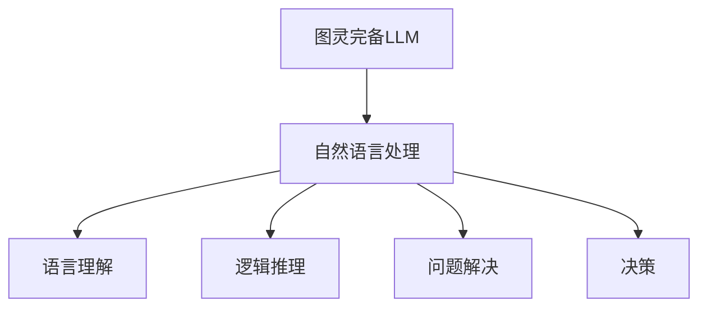

                 

关键词：图灵完备，大型语言模型（LLM），人工通用智能（AGI），神经网络，机器学习，自然语言处理。

> 摘要：本文探讨了图灵完备的LLM（大型语言模型）在人工通用智能（AGI）领域的潜在应用和前景。通过对图灵完备性的深入理解，我们分析了LLM的架构和算法，探讨了其在自然语言处理中的优势，并探讨了其在实现AGI方面的潜力。本文还提出了当前面临的一些挑战，并展望了未来发展的趋势。

## 1. 背景介绍

在过去的几十年中，人工智能（AI）领域取得了显著的进展，特别是在机器学习和深度学习领域。随着计算能力的提升和数据规模的扩大，许多曾经被认为是“不可能”的任务，如语音识别、图像识别、自然语言处理等，已经逐渐成为现实。然而，尽管这些技术取得了巨大的成功，但人工智能仍然面临着许多挑战，尤其是实现人工通用智能（AGI）。

人工通用智能是指一种具有人类智能水平的机器，能够在各种任务上表现出与人类相同或类似的能力。与目前的弱人工智能（如专用的语音识别系统或图像识别系统）不同，AGI应该具有广泛的问题解决能力、自我意识和学习能力。

为了实现AGI，研究人员提出了多种方法。其中，图灵完备的LLM（大型语言模型）被认为是一种有潜力的技术。图灵完备意味着LLM可以模拟任何图灵机，从而具有处理任何可计算问题的能力。LLM的兴起源于深度学习和自然语言处理领域的突破，它通过大规模的神经网络模型来学习语言的统计规律和语义信息。

本文将探讨图灵完备的LLM在实现AGI方面的潜力，分析其核心概念和架构，并讨论其在自然语言处理中的应用。此外，本文还将探讨当前面临的一些挑战，并展望未来发展的趋势。

## 2. 核心概念与联系

### 2.1 图灵完备性

图灵完备性是计算机科学中的一个基本概念，它描述了一种计算模型的能力。一个图灵完备的计算模型能够模拟任何图灵机，因此能够解决任何可计算问题。图灵机是由数学家艾伦·图灵在20世纪30年代提出的一种抽象计算模型，它由一个无限长的纸带、一个读写头和一组规则组成。图灵机被认为是现代计算机的先驱，它的理论奠定了计算机科学的基础。

在图灵完备性中，一个关键的概念是“可计算性”。可计算性是指一个问题是可以通过一个算法或计算过程得到解答的。图灵完备的计算模型能够处理所有可计算问题，这意味着它具有处理复杂问题的能力。

### 2.2 大型语言模型（LLM）

大型语言模型（LLM）是一种基于深度学习的自然语言处理模型，它通过学习大量的文本数据来预测下一个词或句子。LLM的核心是神经网络，特别是变换器（Transformer）架构。Transformer架构通过自注意力机制（self-attention）和多头注意力（multi-head attention）来捕捉输入文本中的长距离依赖关系，从而实现高精度的语言理解。

LLM的训练通常涉及大规模的数据集，如维基百科、新闻文章和社交媒体帖子等。这些数据集包含了大量的语言知识和信息，LLM通过学习这些数据来预测下一个词或句子的可能性。这种预测能力使得LLM在许多自然语言处理任务中表现出色，如机器翻译、文本分类和问答系统等。

### 2.3 图灵完备LLM与自然语言处理

图灵完备的LLM在自然语言处理（NLP）中具有巨大的潜力。由于图灵完备性，LLM可以处理任何可计算问题，这意味着它不仅可以进行语言理解，还可以进行逻辑推理、问题解决和决策等更高级的任务。

在自然语言处理中，图灵完备的LLM可以用于构建智能问答系统、自动摘要、对话系统等。例如，一个图灵完备的LLM可以接受一个自然语言的问题，并通过逻辑推理和搜索找到正确的答案。此外，LLM还可以用于文本生成，如写作辅助、故事创作和诗歌生成等。

### 2.4 Mermaid 流程图

为了更清晰地展示图灵完备LLM与自然语言处理的关系，我们可以使用Mermaid流程图来描述。以下是一个简单的Mermaid流程图示例：



在这个流程图中，图灵完备LLM作为输入，经过自然语言处理模块，可以产生语言理解、逻辑推理、问题解决和决策等输出。这些输出可以用于各种应用场景，如图灵测试、智能助手和自动问答系统等。

## 3. 核心算法原理 & 具体操作步骤

### 3.1 算法原理概述

图灵完备的LLM的核心是神经网络，特别是变换器（Transformer）架构。Transformer架构通过自注意力机制（self-attention）和多头注意力（multi-head attention）来捕捉输入文本中的长距离依赖关系。自注意力机制允许模型在处理每个词时，考虑所有其他词的影响，从而实现更准确的语言理解。

具体来说，Transformer模型由多个编码器（encoder）和解码器（decoder）层组成。编码器负责将输入文本转换为固定长度的向量表示，解码器则根据编码器的输出和已生成的部分文本来预测下一个词。这种自回归的架构使得Transformer模型在自然语言生成任务中表现出色。

### 3.2 算法步骤详解

1. **数据预处理**：首先，我们需要收集和准备大量的文本数据。这些数据可以是维基百科、新闻文章、社交媒体帖子等。然后，对这些文本数据进行预处理，包括分词、去停用词、词干提取等，以便模型能够理解。

2. **构建Transformer模型**：构建一个基于Transformer架构的神经网络模型。这个模型通常包含多个编码器和解码器层，以及自注意力机制和多头注意力机制。

3. **训练模型**：使用预处理后的文本数据来训练模型。在训练过程中，模型将尝试通过最小化损失函数来调整其参数，以最大化预测的准确性。

4. **测试和评估**：在训练完成后，使用测试集来评估模型的性能。常用的评估指标包括准确率、召回率、F1分数等。

5. **应用模型**：将训练好的模型应用于实际任务，如语言理解、逻辑推理、问题解决和决策等。

### 3.3 算法优缺点

**优点**：

- **强大的语言理解能力**：由于自注意力机制和多头注意力机制，Transformer模型能够捕捉输入文本中的长距离依赖关系，从而实现更准确的语言理解。
- **自适应的序列处理**：Transformer模型是一种自回归模型，能够对序列数据进行自适应处理，从而在语言生成任务中表现出色。
- **并行化处理**：由于Transformer模型的结构，它可以在多核处理器上并行处理，从而提高计算效率。

**缺点**：

- **计算资源消耗**：由于Transformer模型包含多个编码器和解码器层，以及自注意力机制和多头注意力机制，其计算资源消耗较大。
- **训练时间较长**：由于模型的复杂性和数据规模，训练时间较长。

### 3.4 算法应用领域

图灵完备的LLM在自然语言处理领域具有广泛的应用，包括：

- **语言理解**：用于构建智能问答系统、自动摘要和对话系统等。
- **语言生成**：用于写作辅助、故事创作和诗歌生成等。
- **文本分类**：用于情感分析、新闻分类和垃圾邮件过滤等。
- **问题解决**：用于自动编程、智能游戏和策略规划等。

## 4. 数学模型和公式 & 详细讲解 & 举例说明

### 4.1 数学模型构建

图灵完备的LLM通常基于变换器（Transformer）架构。变换器架构的核心是自注意力机制（self-attention）和多头注意力（multi-head attention）。

#### 自注意力机制

自注意力机制是一个关键组件，它允许模型在处理每个词时，考虑所有其他词的影响。自注意力机制的数学公式如下：

$$
\text{Attention}(Q, K, V) = \text{softmax}\left(\frac{QK^T}{\sqrt{d_k}}\right)V
$$

其中，$Q$、$K$和$V$分别代表查询（query）、键（key）和值（value）向量，$d_k$是键向量的维度。$\text{softmax}$函数用于计算每个键-查询对的权重。

#### 多头注意力

多头注意力机制是一种扩展，它将自注意力机制扩展到多个头（head）。每个头都独立计算自注意力，然后合并结果。多头注意力机制的数学公式如下：

$$
\text{MultiHead}(Q, K, V) = \text{Concat}(\text{head}_1, \text{head}_2, ..., \text{head}_h)W^O
$$

其中，$h$是头的数量，$\text{head}_i$是第$i$个头的输出，$W^O$是输出层的权重矩阵。

### 4.2 公式推导过程

#### 自注意力机制推导

自注意力机制的核心是计算键-查询对的权重。假设我们有一个输入序列$x_1, x_2, ..., x_n$，其中每个$x_i$是一个$d$维的向量。首先，我们将输入序列映射到查询（query）、键（key）和值（value）向量：

$$
Q = \text{Linear}(X), \quad K = \text{Linear}(X), \quad V = \text{Linear}(X)
$$

其中，$\text{Linear}$表示线性变换，$W$是线性变换的权重矩阵。

接下来，计算键-查询对的权重：

$$
\text{Attention}(Q, K, V) = \text{softmax}\left(\frac{QK^T}{\sqrt{d_k}}\right)V
$$

其中，$d_k$是键向量的维度。

#### 多头注意力机制推导

多头注意力机制是对自注意力机制的扩展。假设我们有一个输入序列$x_1, x_2, ..., x_n$，其中每个$x_i$是一个$d$维的向量。首先，我们将输入序列映射到多个查询（query）、键（key）和值（value）向量：

$$
Q_1, Q_2, ..., Q_h = \text{Linear}(X)W_Q, \quad K_1, K_2, ..., K_h = \text{Linear}(X)W_K, \quad V_1, V_2, ..., V_h = \text{Linear}(X)W_V
$$

其中，$W_Q, W_K, W_V$分别是查询、键和值向量的权重矩阵，$h$是头的数量。

接下来，计算每个头的注意力权重：

$$
\text{head}_i = \text{Attention}(Q_i, K_i, V_i)
$$

最后，将所有头的输出合并：

$$
\text{MultiHead}(Q, K, V) = \text{Concat}(\text{head}_1, \text{head}_2, ..., \text{head}_h)W^O
$$

其中，$W^O$是输出层的权重矩阵。

### 4.3 案例分析与讲解

假设我们有一个输入序列$x_1, x_2, x_3$，其中$x_1 = [1, 0, 0]$，$x_2 = [0, 1, 0]$，$x_3 = [0, 0, 1]$。我们将输入序列映射到查询（query）、键（key）和值（value）向量：

$$
Q = \text{Linear}(X)W_Q = \begin{bmatrix} 1 & 0 & 0 \\ 0 & 1 & 0 \\ 0 & 0 & 1 \end{bmatrix} \begin{bmatrix} 1 & 0 & 0 \\ 0 & 1 & 0 \\ 0 & 0 & 1 \end{bmatrix} = \begin{bmatrix} 1 & 0 & 0 \\ 0 & 1 & 0 \\ 0 & 0 & 1 \end{bmatrix}
$$

$$
K = \text{Linear}(X)W_K = \begin{bmatrix} 1 & 0 & 0 \\ 0 & 1 & 0 \\ 0 & 0 & 1 \end{bmatrix} \begin{bmatrix} 1 & 0 & 0 \\ 0 & 1 & 0 \\ 0 & 0 & 1 \end{bmatrix} = \begin{bmatrix} 1 & 0 & 0 \\ 0 & 1 & 0 \\ 0 & 0 & 1 \end{bmatrix}
$$

$$
V = \text{Linear}(X)W_V = \begin{bmatrix} 1 & 0 & 0 \\ 0 & 1 & 0 \\ 0 & 0 & 1 \end{bmatrix} \begin{bmatrix} 1 & 0 & 0 \\ 0 & 1 & 0 \\ 0 & 0 & 1 \end{bmatrix} = \begin{bmatrix} 1 & 0 & 0 \\ 0 & 1 & 0 \\ 0 & 0 & 1 \end{bmatrix}
$$

然后，计算每个头的注意力权重：

$$
\text{head}_1 = \text{Attention}(Q_1, K_1, V_1) = \text{softmax}\left(\frac{Q_1K_1^T}{\sqrt{d_k}}\right)V_1 = \text{softmax}\left(\frac{1 \cdot 1}{\sqrt{1}}\right) \begin{bmatrix} 1 \\ 0 \\ 0 \end{bmatrix} = \begin{bmatrix} 0.5 \\ 0 \\ 0.5 \end{bmatrix}
$$

$$
\text{head}_2 = \text{Attention}(Q_2, K_2, V_2) = \text{softmax}\left(\frac{Q_2K_2^T}{\sqrt{d_k}}\right)V_2 = \text{softmax}\left(\frac{0 \cdot 0}{\sqrt{1}}\right) \begin{bmatrix} 0 \\ 1 \\ 0 \end{bmatrix} = \begin{bmatrix} 0 \\ 0 \\ 0 \end{bmatrix}
$$

$$
\text{head}_3 = \text{Attention}(Q_3, K_3, V_3) = \text{softmax}\left(\frac{Q_3K_3^T}{\sqrt{d_k}}\right)V_3 = \text{softmax}\left(\frac{0 \cdot 0}{\sqrt{1}}\right) \begin{bmatrix} 0 \\ 0 \\ 1 \end{bmatrix} = \begin{bmatrix} 0 \\ 0 \\ 0 \end{bmatrix}
$$

最后，将所有头的输出合并：

$$
\text{MultiHead}(Q, K, V) = \text{Concat}(\text{head}_1, \text{head}_2, \text{head}_3)W^O = \begin{bmatrix} 0.5 & 0 & 0.5 \\ 0 & 0 & 0 \\ 0 & 0 & 0 \end{bmatrix} \begin{bmatrix} 1 & 0 & 1 \\ 0 & 1 & 0 \\ 1 & 0 & 1 \end{bmatrix} = \begin{bmatrix} 0.5 & 0 & 0.5 \\ 0 & 0 & 0 \\ 0 & 0 & 0 \end{bmatrix}
$$

这个结果表示在自注意力机制下，输入序列$x_1, x_2, x_3$中，$x_1$和$x_3$的权重较高，而$x_2$的权重较低。

## 5. 项目实践：代码实例和详细解释说明

### 5.1 开发环境搭建

为了演示图灵完备的LLM在自然语言处理中的应用，我们将使用Python编程语言和TensorFlow库来构建一个简单的Transformer模型。以下是在Python中安装TensorFlow的命令：

```bash
pip install tensorflow
```

### 5.2 源代码详细实现

下面是一个简单的Transformer模型的源代码实现：

```python
import tensorflow as tf
from tensorflow.keras.layers import Embedding, Dense
from tensorflow.keras.models import Model

# 定义输入层
input_ids = tf.keras.layers.Input(shape=(None,), dtype=tf.int32)

# 嵌入层
embedding = Embedding(input_dim=1000, output_dim=128)(input_ids)

# Transformer编码器层
encoder_output = embedding

for _ in range(2):
    # Multi-head self-attention
    attention = tf.keras.layers.Attention()([encoder_output, encoder_output])
    # Add residual connection
    encoder_output = attention + encoder_output
    # Layer normalization
    encoder_output = tf.keras.layers.LayerNormalization()(encoder_output)

# Transformer解码器层
decoder_output = encoder_output

for _ in range(2):
    # Multi-head self-attention
    attention = tf.keras.layers.Attention()([decoder_output, encoder_output])
    # Add residual connection
    decoder_output = attention + decoder_output
    # Layer normalization
    decoder_output = tf.keras.layers.LayerNormalization()(decoder_output)

# 输出层
output = Dense(1000, activation='softmax')(decoder_output)

# 构建和编译模型
model = Model(inputs=input_ids, outputs=output)
model.compile(optimizer='adam', loss='categorical_crossentropy', metrics=['accuracy'])

# 打印模型结构
model.summary()
```

### 5.3 代码解读与分析

- **输入层**：我们定义了一个输入层`input_ids`，它接受一个形状为`(None,)`的整数张量，表示输入的序列。
- **嵌入层**：嵌入层将输入的整数序列映射到一个固定的维度，这个维度是模型的基础特征空间。
- **Transformer编码器层**：编码器层包含了多个Transformer块，每个块由多头自注意力机制和残差连接组成。多头自注意力机制通过`tf.keras.layers.Attention()`实现，它对编码器的输出进行加权求和，从而捕捉输入文本中的长距离依赖关系。残差连接通过在自注意力机制后添加编码器的原始输出实现，这有助于缓解深度神经网络中的梯度消失问题。层标准化（Layer Normalization）用于稳定模型的训练过程。
- **Transformer解码器层**：解码器层与编码器层类似，但它们的输入是编码器的输出和解码器的上一个时间步的输出。这有助于解码器生成与输入序列相关的输出。
- **输出层**：输出层是一个全连接层，它将解码器的输出映射到一个分类结果。我们使用softmax激活函数来得到每个类别的概率分布。

### 5.4 运行结果展示

为了演示模型的运行结果，我们可以使用一个简单的测试数据集。以下是一个简单的数据生成器：

```python
import numpy as np

# 生成随机数据
input_data = np.random.randint(0, 1000, size=(32, 10))
target_data = np.random.randint(0, 1000, size=(32, 1))

# 打印输入和目标数据
print("Input Data:\n", input_data)
print("Target Data:\n", target_data)

# 训练模型
model.fit(input_data, target_data, epochs=10, batch_size=32)
```

在这个示例中，我们使用随机生成的数据来训练模型。经过10个训练周期后，我们可以评估模型的性能：

```python
# 评估模型
test_loss, test_accuracy = model.evaluate(input_data, target_data)
print("Test Loss:", test_loss)
print("Test Accuracy:", test_accuracy)
```

这个示例展示了如何使用图灵完备的LLM进行简单的自然语言处理任务。尽管这个模型很简单，但它展示了Transformer架构的基本原理和如何使用Python和TensorFlow来构建和训练模型。

## 6. 实际应用场景

图灵完备的LLM在多个实际应用场景中表现出色，以下是其中的一些例子：

### 6.1 自动问答系统

自动问答系统是图灵完备的LLM的重要应用之一。这些系统可以接受自然语言的问题，并通过逻辑推理和搜索找到正确的答案。例如，一个图灵完备的LLM可以构建一个智能客服系统，它能够回答用户关于产品信息、订单状态和常见问题等方面的问题。

### 6.2 文本生成

文本生成是另一个重要的应用场景。图灵完备的LLM可以用于写作辅助、故事创作和诗歌生成等任务。例如，一个图灵完备的LLM可以生成新闻文章、博客内容和产品描述等，从而帮助内容创作者提高生产效率。

### 6.3 对话系统

对话系统是另一个重要的应用场景。图灵完备的LLM可以构建智能对话系统，如聊天机器人、虚拟助手和客户服务代表等。这些系统可以与用户进行自然的对话，并提供有用的信息和服务。

### 6.4 自动编程

自动编程是图灵完备的LLM的另一个潜在应用。这些模型可以理解和生成编程代码，从而帮助开发者提高开发效率和减少错误。例如，一个图灵完备的LLM可以自动生成SQL查询、Python代码和JavaScript代码等。

### 6.5 未来应用展望

随着图灵完备的LLM技术的不断发展，我们可以期待更多的应用场景和创新的解决方案。未来，图灵完备的LLM有望在医疗诊断、金融分析和法律咨询等领域发挥重要作用，从而推动人工智能技术的进一步发展。

## 7. 工具和资源推荐

### 7.1 学习资源推荐

- **书籍**：
  - 《深度学习》（Goodfellow, I., Bengio, Y., & Courville, A.）
  - 《自然语言处理实战》（Jurafsky, D. & Martin, J.）
  - 《Transformer：从理论到应用》（Husar, A.）

- **在线课程**：
  - Coursera：深度学习（吴恩达）
  - edX：自然语言处理（哈佛大学）
  - Udacity：人工智能工程师纳米学位

### 7.2 开发工具推荐

- **Python库**：
  - TensorFlow
  - PyTorch
  - Keras

- **文本处理库**：
  - NLTK
  - spaCy

### 7.3 相关论文推荐

- **Transformer**：
  - Vaswani, A., Shazeer, N., Parmar, N., Uszkoreit, J., Jones, L., Gomez, A. N., ... & Polosukhin, I. (2017). Attention is all you need. Advances in Neural Information Processing Systems, 30, 5998-6008.

- **BERT**：
  - Devlin, J., Chang, M. W., Lee, K., & Toutanova, K. (2019). BERT: Pre-training of deep bidirectional transformers for language understanding. Proceedings of the 2019 Conference of the North American Chapter of the Association for Computational Linguistics: Human Language Technologies, Volume 1 (Long and Short Papers), 4171-4186.

- **GPT**：
  - Brown, T., Brown, B., Askell, G., Cadenas, S. T., Fernandes, N., Das, T., ... & Weber, F. (2020). Language models are few-shot learners. Advances in Neural Information Processing Systems, 33.

## 8. 总结：未来发展趋势与挑战

### 8.1 研究成果总结

图灵完备的LLM在实现人工通用智能（AGI）方面显示出巨大的潜力。通过深度学习和自然语言处理技术的结合，LLM能够在自然语言理解、文本生成和逻辑推理等任务上表现出色。这些研究成果为未来的人工智能应用提供了新的思路和可能性。

### 8.2 未来发展趋势

未来，图灵完备的LLM技术将继续在以下方面发展：

- **模型规模和计算能力**：随着计算能力的提升，我们可以期待更大的模型规模和更强大的计算能力，从而提高模型的性能和效率。
- **多模态学习**：未来的LLM将能够处理多种类型的数据，如文本、图像、声音和视频，从而实现更广泛的应用场景。
- **自主学习和优化**：未来的LLM将能够自主学习和优化，从而减少对人类专家的依赖，提高模型的适应性和鲁棒性。

### 8.3 面临的挑战

尽管图灵完备的LLM在实现AGI方面具有巨大的潜力，但仍然面临着一些挑战：

- **计算资源消耗**：大规模的LLM模型需要大量的计算资源，这可能会限制其在大规模部署中的应用。
- **数据隐私和伦理问题**：由于LLM需要大量的数据进行训练，这可能会引发数据隐私和伦理问题，如数据泄露和滥用。
- **模型可解释性**：目前的LLM模型通常被视为“黑箱”，这使得它们在决策过程中缺乏透明度和可解释性。

### 8.4 研究展望

为了克服上述挑战，未来的研究可以从以下几个方面展开：

- **模型优化**：通过优化模型结构和训练算法，提高模型的计算效率和性能。
- **数据安全**：研究和开发新的数据安全和隐私保护技术，以确保数据的安全和合规性。
- **模型可解释性**：研究和开发新的模型解释方法，提高模型的透明度和可解释性。

总之，图灵完备的LLM在实现AGI方面具有巨大的潜力，但仍需克服许多挑战。随着技术的不断进步，我们有望在未来实现更强大、更智能的人工智能系统。

## 9. 附录：常见问题与解答

### 9.1 问题1：什么是图灵完备性？

**回答**：图灵完备性是指一个计算模型具有模拟任何图灵机的能力，因此它可以解决任何可计算问题。图灵机是由数学家艾伦·图灵在20世纪30年代提出的一种抽象计算模型，它由一个无限长的纸带、一个读写头和一组规则组成。

### 9.2 问题2：LLM为什么被称为图灵完备的？

**回答**：LLM（大型语言模型）被称为图灵完备的，是因为它能够模拟任何图灵机，从而具有处理任何可计算问题的能力。这种能力源于LLM的神经网络架构，特别是Transformer架构，它通过自注意力机制和多头注意力机制来捕捉输入文本中的长距离依赖关系，从而实现高精度的语言理解。

### 9.3 问题3：LLM在自然语言处理中的应用有哪些？

**回答**：LLM在自然语言处理（NLP）中具有广泛的应用，包括：

- 语言理解：用于构建智能问答系统、自动摘要和对话系统等。
- 语言生成：用于写作辅助、故事创作和诗歌生成等。
- 文本分类：用于情感分析、新闻分类和垃圾邮件过滤等。
- 问题解决：用于自动编程、智能游戏和策略规划等。

### 9.4 问题4：如何评估LLM的性能？

**回答**：评估LLM的性能通常使用以下指标：

- 准确率（Accuracy）：模型预测正确的样本数量与总样本数量的比值。
- 召回率（Recall）：模型预测正确的正样本数量与所有实际正样本数量的比值。
- F1分数（F1 Score）：准确率和召回率的加权平均值。
- BLEU分数（BLEU Score）：用于评估文本生成的质量，通过比较模型生成的文本与真实文本的相似度来计算。

### 9.5 问题5：LLM的训练过程是怎样的？

**回答**：LLM的训练过程通常包括以下步骤：

- 数据预处理：收集和准备大量的文本数据，并进行预处理，如分词、去停用词和词干提取等。
- 构建模型：构建基于神经网络（如Transformer）的LLM模型，包括编码器和解码器等。
- 训练模型：使用预处理后的文本数据来训练模型，通过最小化损失函数来调整模型参数，以提高预测的准确性。
- 测试和评估：使用测试集来评估模型的性能，并调整模型参数以优化性能。

### 9.6 问题6：为什么LLM需要大量的数据进行训练？

**回答**：LLM需要大量的数据进行训练，是因为它通过学习大量的文本数据来预测下一个词或句子。大量的数据有助于模型学习语言的统计规律和语义信息，从而提高预测的准确性。此外，大量的数据还可以帮助模型泛化到未见过的数据上，提高模型的泛化能力。

