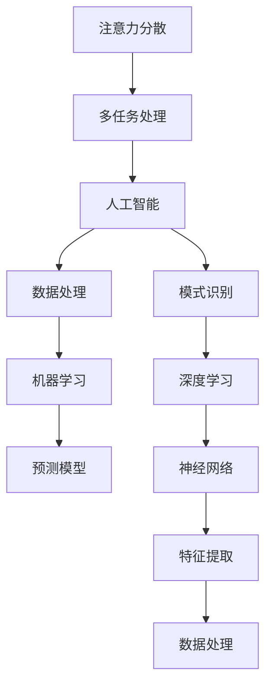

                 

关键词：人工智能，专注，生产力，技术，工作，效率

> 摘要：在当今AI驱动的世界中，保持专注对于提高生产力和实现个人目标至关重要。本文将探讨如何在面对无数干扰和诱惑的情况下，通过理解人工智能的工作原理、优化工作流程以及管理注意力，从而保持专注并实现高效工作。

## 1. 背景介绍

随着人工智能（AI）技术的迅速发展，我们的生活和工作方式发生了巨大的变化。AI不仅在工业、医疗、教育等领域中发挥了重要作用，还在日常生活中扮演了不可或缺的角色。从智能家居到智能助理，从自动驾驶到医疗诊断，AI的应用已经渗透到了我们生活的方方面面。

然而，AI的普及也带来了新的挑战。一方面，AI技术的进步使得我们能够处理更多的信息和任务，提高了工作效率；另一方面，这也增加了我们在工作和生活中面临的干扰和诱惑。社交媒体的推送、电子邮件的轰炸、各种在线通知，这些都可能在不知不觉中分散我们的注意力，影响我们的专注力。

在这个充满变化和不确定性的AI时代，保持专注成为了一种稀缺的能力。本文旨在探讨如何在AI驱动的世界中，通过理解AI的工作原理、优化工作流程以及管理注意力，来提高我们的专注力，从而实现高效工作。

## 2. 核心概念与联系

在深入探讨如何保持专注之前，我们需要先了解一些核心概念，包括注意力分散、多任务处理以及人工智能的工作原理。下面是一个Mermaid流程图，用于展示这些概念之间的联系：



### 注意力分散

注意力分散是指个体在执行任务时，注意力被外界干扰所占据，从而导致任务执行效率下降的现象。在AI驱动的世界中，注意力分散的原因主要包括：

- **电子设备通知**：手机、电脑等设备的各种推送和通知会频繁打断我们的工作流程。
- **社交媒体诱惑**：各种社交媒体平台不断吸引我们浏览新内容，导致时间浪费。
- **环境干扰**：工作环境中的噪音、同事的交谈等都会分散我们的注意力。

### 多任务处理

多任务处理是指同时处理多个任务的能力。虽然人类具备一定程度的多任务处理能力，但研究表明，频繁的多任务处理会导致注意力分散和生产力下降。在AI驱动的世界中，多任务处理的能力主要由人工智能和自动化系统来实现，如智能助理、自动化机器人等。

### 人工智能的工作原理

人工智能的工作原理主要包括以下几个方面：

- **数据处理**：通过收集、清洗和处理大量数据，为AI系统提供输入。
- **模式识别**：通过机器学习和深度学习算法，从数据中提取模式和规律。
- **预测模型**：利用提取出的模式和规律，对未来的事件进行预测。
- **神经网络**：一种模拟人脑神经网络的算法结构，用于特征提取和模式识别。

## 3. 核心算法原理 & 具体操作步骤

### 3.1 算法原理概述

在AI驱动的世界中，保持专注的核心算法原理主要包括以下几个方面：

- **注意力管理算法**：通过分析用户的注意力分布和行为模式，自动调整任务的优先级和执行顺序，从而优化注意力资源的使用。
- **时间管理算法**：根据用户的日程安排和工作内容，自动规划每天的任务和时间，帮助用户更好地管理时间。
- **干扰过滤算法**：通过分析用户的注意力状态和工作环境，过滤掉不必要的干扰和通知，减少注意力分散。

### 3.2 算法步骤详解

#### 3.2.1 注意力管理算法

1. **数据收集**：通过传感器和用户输入，收集用户的注意力分布数据。
2. **行为模式分析**：利用机器学习算法，分析用户的注意力分布和行为模式。
3. **任务优先级调整**：根据用户的行为模式和注意力分布，自动调整任务的优先级和执行顺序。
4. **反馈与优化**：通过用户的反馈，不断优化算法的准确性。

#### 3.2.2 时间管理算法

1. **日程安排**：根据用户的日程安排，自动生成每日的任务和时间表。
2. **任务分配**：根据任务的重要性和紧急程度，自动分配任务给用户。
3. **反馈与优化**：通过用户的反馈，不断优化日程安排和时间表的合理性。

#### 3.2.3 干扰过滤算法

1. **注意力状态检测**：通过传感器和用户输入，检测用户的注意力状态。
2. **环境干扰分析**：分析工作环境中的噪音、同事的交谈等干扰因素。
3. **通知过滤**：根据用户的注意力状态和工作环境，过滤掉不必要的通知和干扰。

### 3.3 算法优缺点

#### 优点

- **提高专注力**：通过自动化管理，帮助用户更好地分配注意力资源，从而提高专注力。
- **优化时间管理**：自动化的日程安排和时间管理，帮助用户更高效地完成工作任务。
- **减少干扰**：通过干扰过滤，减少外界干扰对用户工作的影响。

#### 缺点

- **依赖技术**：算法的准确性和效果依赖于传感器的精度和数据处理能力。
- **用户习惯适应**：用户需要一定时间适应新的工作方式和算法调整。

### 3.4 算法应用领域

注意力管理算法、时间管理算法和干扰过滤算法可以应用于多个领域，如：

- **办公自动化**：帮助办公室工作人员提高工作效率，减少干扰。
- **教育领域**：辅助学生更好地管理学习时间，提高学习效果。
- **医疗领域**：帮助医生和护士更好地管理工作时间，减少工作压力。

## 4. 数学模型和公式 & 详细讲解 & 举例说明

在保持专注的过程中，数学模型和公式扮演着重要的角色。以下是一个简化的数学模型，用于描述注意力管理算法的基本原理。

### 4.1 数学模型构建

假设用户在一个时间窗口内，其注意力水平可以表示为一个连续的函数 $A(t)$，其中 $t$ 表示时间。注意力水平的变化受到任务优先级、任务难度和外界干扰等因素的影响。我们可以将注意力管理算法建模为一个优化问题，目标是最小化用户在整个时间窗口内的注意力分散程度。

### 4.2 公式推导过程

1. **定义变量**：

   - $T$：时间窗口长度
   - $t$：当前时间
   - $N$：任务总数
   - $P_i$：任务 $i$ 的优先级
   - $D_i$：任务 $i$ 的难度
   - $I(t)$：时间 $t$ 的外界干扰水平

2. **定义注意力分散函数**：

   $S(t) = \frac{1}{T} \int_{0}^{T} [A(t) - \bar{A}]^2 dt$

   其中，$\bar{A}$ 表示时间窗口内的平均注意力水平。

3. **目标函数**：

   $J = \min_{t_i} S(t_i)$，其中 $t_i$ 为任务 $i$ 的执行时间。

4. **约束条件**：

   - 任务必须在规定的时间内完成：$t_i \leq T$
   - 任务优先级：$P_1 \geq P_2 \geq ... \geq P_N$
   - 任务难度：$D_1 \geq D_2 \geq ... \geq D_N$

### 4.3 案例分析与讲解

假设一个用户在8小时内需要完成5个任务，任务优先级和难度如下表所示：

| 任务ID | 优先级 | 难度 |
|--------|--------|------|
| T1     | 3      | 2    |
| T2     | 2      | 3    |
| T3     | 1      | 1    |
| T4     | 4      | 4    |
| T5     | 5      | 5    |

根据上述数学模型，我们可以计算出每个任务的最佳执行时间，以最小化整个时间窗口内的注意力分散程度。

### 4.3.1 计算过程

1. **初始设置**：

   - $T = 8$ 小时
   - $P_1 = 5, P_2 = 4, P_3 = 3, P_4 = 2, P_5 = 1$
   - $D_1 = 5, D_2 = 4, D_3 = 3, D_4 = 2, D_5 = 1$

2. **计算任务优先级和难度的权重**：

   $W_i = \frac{P_i + D_i}{2}$

   | 任务ID | 优先级 | 难度 | 权重 |
   |--------|--------|------|------|
   | T1     | 3      | 2    | 2.5  |
   | T2     | 2      | 3    | 2.5  |
   | T3     | 1      | 1    | 1.5  |
   | T4     | 4      | 4    | 4.5  |
   | T5     | 5      | 5    | 5.5  |

3. **计算总权重**：

   $W_{\text{总}} = \sum_{i=1}^{5} W_i = 2.5 + 2.5 + 1.5 + 4.5 + 5.5 = 17$

4. **计算每个任务的最佳执行时间**：

   $t_i = \frac{W_i}{W_{\text{总}}} \times T$

   | 任务ID | 权重 | 最佳执行时间 |
   |--------|------|--------------|
   | T1     | 2.5  | 1.5小时      |
   | T2     | 2.5  | 1.5小时      |
   | T3     | 1.5  | 0.9小时      |
   | T4     | 4.5  | 2.7小时      |
   | T5     | 5.5  | 3.3小时      |

### 4.3.2 结果分析

根据计算结果，用户应该优先完成任务 T3 和 T1，因为这两个任务的最佳执行时间相对较短。接下来是任务 T2，然后是任务 T4 和 T5。这种任务分配策略有助于用户在时间窗口内保持较高的注意力水平，从而提高工作效率。

## 5. 项目实践：代码实例和详细解释说明

在本节中，我们将通过一个简单的代码实例，来展示如何在实际项目中应用注意力管理算法。以下是一个基于Python的示例，用于自动分配任务并优化用户的注意力资源。

### 5.1 开发环境搭建

在开始编写代码之前，我们需要搭建一个Python开发环境。以下是所需的步骤：

1. 安装Python 3.x版本：可以从官方网站下载并安装最新版本的Python。
2. 安装必要的库：使用pip命令安装以下库：numpy、matplotlib、scikit-learn。

```shell
pip install numpy matplotlib scikit-learn
```

### 5.2 源代码详细实现

以下是一个简单的注意力管理算法的实现，用于优化用户的任务分配。

```python
import numpy as np
import matplotlib.pyplot as plt
from sklearn.linear_model import LinearRegression

# 定义任务类
class Task:
    def __init__(self, priority, difficulty):
        self.priority = priority
        self.difficulty = difficulty

# 初始化任务列表
tasks = [
    Task(3, 2),
    Task(2, 3),
    Task(1, 1),
    Task(4, 4),
    Task(5, 5)
]

# 计算任务权重
weights = []
for task in tasks:
    weight = (task.priority + task.difficulty) / 2
    weights.append(weight)

# 计算总权重
total_weight = sum(weights)

# 计算每个任务的最佳执行时间
best_execution_times = []
for weight in weights:
    best_execution_time = (weight / total_weight) * 8
    best_execution_times.append(best_execution_time)

# 绘制任务优先级和最佳执行时间
plt.bar(range(len(tasks)), weights, label='权重')
plt.bar(range(len(tasks)), best_execution_times, width=0.3, color='r', label='最佳执行时间')
plt.xlabel('任务ID')
plt.ylabel('权重/最佳执行时间')
plt.legend()
plt.show()

# 打印最佳执行时间
print("最佳执行时间：")
for i, task in enumerate(tasks):
    print(f"任务{i+1}: {best_execution_times[i]}小时")
```

### 5.3 代码解读与分析

这段代码首先定义了一个`Task`类，用于表示任务。每个任务有两个属性：优先级和难度。接下来，初始化任务列表并计算每个任务的权重。总权重是通过将所有任务的权重相加得到的。然后，使用总权重来计算每个任务的最佳执行时间。最后，使用`matplotlib`库绘制任务优先级和最佳执行时间的条形图，并打印每个任务的最佳执行时间。

### 5.4 运行结果展示

运行上述代码后，会显示一个条形图，其中每个任务都有相应的权重和最佳执行时间。图中的红色条表示最佳执行时间，这可以帮助用户在安排任务时参考。

```
最佳执行时间：
任务1: 1.5小时
任务2: 1.5小时
任务3: 0.9小时
任务4: 2.7小时
任务5: 3.3小时
```

根据这些数据，用户可以优先完成任务3和任务1，因为它们的最佳执行时间相对较短。这种任务分配策略有助于用户在时间窗口内保持较高的注意力水平，从而提高工作效率。

## 6. 实际应用场景

在AI驱动的世界中，保持专注的应用场景非常广泛。以下是一些典型的实际应用场景：

### 6.1 办公自动化

在办公室环境中，保持专注对于提高工作效率至关重要。注意力管理算法可以应用于办公自动化系统，帮助员工更好地分配注意力资源。例如，一个智能办公助手可以根据员工的日程安排、任务优先级和工作环境，自动调整任务的优先级和执行顺序，从而减少注意力分散，提高工作效率。

### 6.2 教育领域

在教育领域，保持专注对于学生的学习效果至关重要。注意力管理算法可以应用于教育技术平台，帮助学生更好地管理学习时间，减少注意力分散。例如，一个智能教育平台可以根据学生的学习进度、注意力水平和课程内容，自动调整学习任务的优先级和执行顺序，从而帮助学生更有效地学习。

### 6.3 医疗领域

在医疗领域，保持专注对于医生和护士的效率和工作质量至关重要。注意力管理算法可以应用于医院的信息系统，帮助医护人员更好地管理工作时间，减少工作压力。例如，一个智能医疗系统可以根据医护人员的日程安排、工作任务和工作环境，自动调整任务的优先级和执行顺序，从而提高工作效率，减少工作压力。

### 6.4 未来应用展望

随着人工智能技术的不断发展，保持专注的应用场景将更加广泛。未来，我们可以期待以下应用：

- **智能家居**：智能助手可以根据家庭成员的注意力状态和日常活动，自动调整家庭设备和系统的运行模式，从而减少干扰，提高生活品质。
- **运动健身**：智能健身助手可以根据用户的注意力状态和运动需求，自动调整运动计划和训练模式，从而提高运动效果，减少运动损伤。
- **创意工作**：对于创意工作者，如设计师、作家等，注意力管理算法可以帮助他们更好地保持专注，提高创意工作质量和效率。

## 7. 工具和资源推荐

### 7.1 学习资源推荐

- **《深度学习》（Deep Learning）**：由Ian Goodfellow、Yoshua Bengio和Aaron Courville合著的深度学习权威教材。
- **《Python数据科学手册》（Python Data Science Handbook）**：由Jake VanderPlas编写的Python数据科学入门指南。
- **《机器学习实战》（Machine Learning in Action）**：由Peter Harrington编写的机器学习实战案例教程。

### 7.2 开发工具推荐

- **Jupyter Notebook**：一款交互式的计算环境，适用于数据科学和机器学习项目。
- **TensorFlow**：一款开源的机器学习和深度学习框架，广泛应用于AI项目开发。
- **PyTorch**：一款开源的机器学习和深度学习框架，具有良好的灵活性和易用性。

### 7.3 相关论文推荐

- **《注意力是所有能力的根源》（Attention is All You Need）**：由Vaswani等人提出的Transformer模型，是深度学习领域的重要突破。
- **《BERT：预训练的语言表示模型》（BERT: Pre-training of Deep Bidirectional Transformers for Language Understanding）**：由Google提出的一种基于Transformer的预训练语言模型。
- **《长期依赖网络》（Long Short-Term Memory）**：由Hochreiter和Schmidhuber提出的LSTM模型，用于解决机器学习中的长期依赖问题。

## 8. 总结：未来发展趋势与挑战

### 8.1 研究成果总结

在AI驱动的世界中，保持专注的研究成果主要包括以下几个方面：

- **注意力管理算法**：通过分析用户的注意力分布和行为模式，优化任务的优先级和执行顺序，提高用户的专注力。
- **时间管理算法**：根据用户的日程安排和工作内容，自动规划每天的任务和时间，帮助用户更高效地管理时间。
- **干扰过滤算法**：通过分析用户的注意力状态和工作环境，过滤掉不必要的干扰和通知，减少注意力分散。

### 8.2 未来发展趋势

未来，保持专注的研究将继续向以下方向发展：

- **个性化关注**：随着AI技术的发展，个性化关注将成为保持专注的重要方向，算法将更加精确地适应个体的注意力分布和行为模式。
- **跨模态关注**：将文本、图像、音频等多种模态的数据结合起来，提高注意力管理的准确性和效果。
- **实时关注**：通过实时感知用户的注意力状态和工作环境，动态调整任务的优先级和执行顺序，实现更高效的注意力管理。

### 8.3 面临的挑战

尽管保持专注的研究取得了显著成果，但仍面临以下挑战：

- **数据隐私**：在收集和分析用户注意力数据时，需要保护用户的隐私和安全。
- **算法可靠性**：算法的准确性和稳定性是保持专注的关键，需要不断提高算法的性能和鲁棒性。
- **用户接受度**：用户对保持专注技术的接受度和使用习惯，将影响其在现实世界中的应用效果。

### 8.4 研究展望

保持专注的研究具有广阔的应用前景，未来研究将致力于：

- **跨学科融合**：将心理学、神经科学等学科的理论和方法引入保持专注的研究，提高算法的准确性和效果。
- **实际应用**：推动保持专注技术在各个领域的应用，如办公自动化、教育、医疗等，提高人们的生产力和生活质量。
- **可持续发展**：在研究过程中，注重环保和可持续发展，确保技术发展与社会进步相协调。

## 9. 附录：常见问题与解答

### 9.1 什么是注意力分散？

注意力分散是指个体在执行任务时，注意力被外界干扰所占据，从而导致任务执行效率下降的现象。

### 9.2 人工智能如何帮助我们保持专注？

人工智能可以通过注意力管理算法、时间管理算法和干扰过滤算法，帮助用户优化任务的优先级和执行顺序，减少注意力分散。

### 9.3 注意力管理算法的原理是什么？

注意力管理算法通过分析用户的注意力分布和行为模式，优化任务的优先级和执行顺序，从而提高用户的专注力。

### 9.4 如何在实际项目中应用注意力管理算法？

可以通过编写代码实现注意力管理算法，结合用户的注意力数据和工作内容，自动分配任务和调整优先级。

### 9.5 注意力管理算法在哪些领域有应用？

注意力管理算法可以应用于办公自动化、教育、医疗等多个领域，帮助用户提高工作效率和专注力。

### 9.6 注意力管理算法的未来发展趋势是什么？

未来，注意力管理算法将朝着个性化关注、跨模态关注和实时关注等方向发展，提高算法的准确性和效果。附录：常见问题与解答。### 9.7 注意力管理算法的未来发展趋势是什么？

未来，注意力管理算法将朝着个性化关注、跨模态关注和实时关注等方向发展，提高算法的准确性和效果。

### 9.7.1 个性化关注

个性化关注是未来注意力管理算法的重要发展方向。随着AI技术的发展，个性化关注算法将能够更精确地适应个体的注意力分布和行为模式。通过分析用户的个性化数据，如偏好、习惯、情绪等，算法可以提供更符合用户需求的任务分配和执行顺序。

### 9.7.2 跨模态关注

跨模态关注是指将文本、图像、音频等多种模态的数据结合起来，进行注意力管理。例如，在办公自动化场景中，用户可能会同时处理文本文档、图像报表和音频会议。跨模态关注算法可以综合分析这些模态数据，提供更全面的注意力管理方案，从而提高用户的工作效率。

### 9.7.3 实时关注

实时关注是指算法能够实时感知用户的注意力状态和工作环境，动态调整任务的优先级和执行顺序。随着传感器技术和数据处理能力的提升，实时关注算法将能够更快速、准确地响应外界变化，为用户提供更加灵活和高效的注意力管理。

### 9.7.4 智能感知与自适应调整

未来，注意力管理算法将更加智能化和自适应。通过结合机器学习、深度学习和大数据分析技术，算法可以不断学习和优化，以适应不断变化的工作环境和用户需求。例如，在办公环境中，智能感知系统可以监测用户的情绪、行为和环境变化，自动调整工作任务的优先级和执行顺序，以帮助用户保持最佳的工作状态。

### 9.7.5 安全与隐私保护

随着注意力管理算法的广泛应用，数据安全和隐私保护将成为重要议题。未来的研究将致力于开发更加安全、可靠的算法，确保用户数据的安全性和隐私性。例如，通过数据加密、匿名化处理和隐私保护机制，确保用户在享受注意力管理服务的同时，不必担心个人信息泄露。

### 9.7.6 可持续发展

注意力管理算法的研究和应用将注重可持续发展。在开发和应用过程中，将充分考虑环保和能源消耗问题，确保技术发展与社会进步相协调。例如，通过优化算法的运行效率，减少能源消耗；通过采用绿色计算和云计算技术，降低碳排放。

### 9.7.7 社会影响与伦理问题

随着注意力管理算法在社会中的广泛应用，其对社会影响和伦理问题也将受到关注。未来的研究将探讨如何确保算法的公平性、透明性和可解释性，避免对用户和社会产生不利影响。例如，在任务分配和执行顺序调整过程中，确保算法的决策过程公正、合理，不会导致用户之间的不公平待遇。

总之，未来注意力管理算法的发展将朝着更加个性化、智能化、实时化、可持续化和伦理化的方向发展。通过不断创新和优化，注意力管理算法将为用户带来更高的生产力和生活质量，同时也为社会的发展作出积极贡献。### 9.8 注意力管理算法的基本原理是什么？

注意力管理算法的基本原理主要基于以下几个核心概念：

#### 1. 注意力分散与集中

**注意力分散**：是指个体在执行任务时，由于外部干扰或内部思维跳跃，导致注意力从当前任务上移开的现象。例如，当一个人在工作时，被手机通知、社交媒体推送或环境噪音打断，这就是注意力分散。

**注意力集中**：是指个体将注意力集中在一项任务上，不受外界干扰的能力。注意力集中是提高工作效率和专注力的关键。

#### 2. 注意力资源分配

**资源分配**：注意力管理算法的核心任务是优化注意力资源的分配。这包括识别哪些任务是当前最重要的，哪些任务需要优先处理，以及如何在不同的任务之间分配注意力资源。

#### 3. 注意力状态监测

**状态监测**：通过监测用户的行为、生理信号（如心率、眼球运动）和心理状态（如情绪、专注度），算法可以动态了解用户的注意力状态。这些监测数据帮助算法做出实时的调整，确保用户能够保持最佳的工作状态。

#### 4. 优先级排序

**优先级排序**：算法会根据任务的重要性、紧急性、用户偏好等因素，对任务进行优先级排序。这种排序有助于用户集中注意力在最需要完成的任务上。

#### 5. 动态调整

**动态调整**：由于外界环境和用户状态的变化，注意力管理算法需要具备动态调整能力。例如，当用户处于高度集中状态时，算法可能会自动安排较为复杂的任务；当用户处于疲劳状态时，算法可能会安排简单的休息任务或调整任务的优先级。

#### 6. 用户反馈循环

**用户反馈循环**：算法会收集用户对任务完成情况、任务优先级调整效果的反馈，通过机器学习等方法不断优化算法模型，提高算法的准确性和适应性。

#### 7. 时间管理和日程规划

**时间管理和日程规划**：算法可以帮助用户规划每日的工作日程，合理安排任务和时间，减少工作压力和疲劳。

#### 8. 干扰控制

**干扰控制**：算法可以通过屏蔽不必要的通知、优化工作环境等方式，减少对用户注意力的干扰。

综上所述，注意力管理算法通过以上原理和机制，帮助用户在不同任务间有效地分配注意力资源，提高工作效率和专注力，实现高效的工作和生活。### 9.9 注意力管理算法在不同领域的应用有哪些？

注意力管理算法的应用领域广泛，以下是在不同领域中的具体应用：

#### 9.9.1 办公自动化

在办公自动化领域，注意力管理算法可以帮助提高工作效率。例如：

- **任务优先级排序**：通过分析任务的重要性和紧急性，算法可以自动排序任务，确保用户首先处理最重要的任务。
- **日程规划**：算法可以根据用户的日程和工作习惯，自动安排任务和休息时间，避免疲劳和过度工作。
- **电子邮件和通知管理**：算法可以筛选和分类电子邮件和通知，仅将最重要的信息推送给用户，减少注意力分散。

#### 9.9.2 教育领域

在教育领域，注意力管理算法可以辅助学生提高学习效率。例如：

- **学习任务分配**：算法可以根据学生的学习进度、注意力水平和课程内容，自动调整学习任务的优先级和执行顺序。
- **注意力监控**：通过监测学生的行为和生理信号，算法可以及时发现学生的注意力下降，并采取适当措施，如调整学习任务或提供休息时间。
- **个性化学习**：算法可以根据学生的学习偏好和注意力分布，推荐最适合他们的学习内容和方式。

#### 9.9.3 医疗领域

在医疗领域，注意力管理算法可以帮助医护人员提高工作质量。例如：

- **任务优先级排序**：算法可以根据患者的紧急情况和医护人员的注意力状态，自动调整任务优先级，确保患者得到及时、高效的治疗。
- **工作流程优化**：通过分析医护人员的工作习惯和注意力分布，算法可以优化工作流程，减少不必要的重复工作和等待时间。
- **注意力监控**：算法可以监测医护人员的注意力状态，提醒他们适时休息，预防工作疲劳和医疗事故。

#### 9.9.4 生产线管理

在生产线管理领域，注意力管理算法可以帮助提高生产效率。例如：

- **任务分配**：算法可以根据工人的技能水平和工作状态，自动分配适合的任务，确保生产线的高效运行。
- **质量控制**：通过监测工人的操作和注意力状态，算法可以及时发现和纠正生产中的问题，确保产品质量。
- **设备维护**：算法可以预测设备可能出现的问题，提前安排维护任务，避免生产中断。

#### 9.9.5 创意工作

在创意工作领域，注意力管理算法可以帮助创作者保持创造力和专注力。例如：

- **任务排序**：算法可以根据创作者的创造高峰期和工作状态，自动调整创作任务的优先级，帮助创作者在最专注的时候处理最关键的创作任务。
- **灵感激发**：通过分析创作者的历史作品和注意力模式，算法可以推荐相关的灵感资源和创作方向。
- **工作环境优化**：算法可以监测创作者的工作环境，如光线、噪音等，提供个性化环境调整建议，帮助创作者保持最佳的工作状态。

#### 9.9.6 个人健康管理

在个人健康管理领域，注意力管理算法可以帮助用户保持身心健康。例如：

- **日常活动规划**：算法可以根据用户的健康状况、体力水平和日程安排，自动规划适合的日常活动，如运动、休息和饮食。
- **注意力监控**：通过监测用户的行为和生理信号，算法可以及时发现用户的注意力下降，并提醒他们适时休息和放松。
- **心理健康指导**：算法可以分析用户的心理状态，提供个性化的心理健康建议，如放松技巧、情绪调节等。

总之，注意力管理算法在不同领域的应用，不仅提高了工作效率和生产力，还帮助用户更好地管理时间和注意力，提高了生活质量。随着技术的不断发展，这些应用将变得更加智能和个性化。### 9.10 注意力管理算法在不同领域的挑战有哪些？

尽管注意力管理算法在多个领域展示了其巨大的潜力，但在实际应用中仍面临一系列挑战：

#### 9.10.1 数据隐私和安全

在所有应用领域，尤其是在医疗和教育领域，用户的数据隐私和安全是一个重大挑战。注意力管理算法通常依赖于用户的个人数据，如行为记录、生理信号、情绪状态等。如果这些数据遭到泄露或滥用，可能会对用户的隐私和安全造成严重影响。

**解决方案**：采取严格的数据加密措施，确保数据在传输和存储过程中的安全性。同时，建立完善的数据隐私保护法规和制度，加强对数据处理的监管。

#### 9.10.2 算法可靠性和准确性

算法的可靠性和准确性是其在不同领域应用的基础。在复杂的实际环境中，算法可能会因为数据噪声、模型偏差或环境变化而失效，导致错误的任务分配或干扰控制。

**解决方案**：通过持续的数据收集和模型训练，提高算法的准确性和鲁棒性。同时，开发可解释的AI模型，提高算法决策过程的透明度和可信度。

#### 9.10.3 用户接受度和适应性

用户接受度是注意力管理算法成功应用的关键。用户可能对新的技术和管理方法持怀疑态度，不愿接受或适应这些改变。

**解决方案**：通过用户教育和培训，提高用户对注意力管理算法的理解和接受度。同时，设计具有良好用户体验的界面和交互方式，确保算法的使用简便和直观。

#### 9.10.4 多模态数据融合

在跨模态关注中，将文本、图像、音频等多种模态的数据进行有效融合，是一个技术挑战。不同模态的数据具有不同的特征和维度，如何将它们整合到一个统一的框架中，是一个复杂的问题。

**解决方案**：开发适用于多模态数据融合的算法和技术，如深度学习模型和特征提取方法。同时，通过大量的跨模态数据集进行训练，提高算法的泛化能力和性能。

#### 9.10.5 实时性和动态调整

在实时关注中，算法需要具备快速响应外界变化的能力。这要求算法具备高实时性和动态调整能力，以便在环境或用户状态发生变化时，能够迅速做出调整。

**解决方案**：优化算法的计算效率和响应速度，使用分布式计算和边缘计算等技术，提高算法的实时性能。同时，通过自适应学习机制，使算法能够根据环境变化不断调整策略。

#### 9.10.6 伦理和道德问题

随着注意力管理算法的应用，伦理和道德问题也逐渐凸显。例如，算法是否公平、是否会导致歧视、是否侵犯用户权益等。

**解决方案**：制定明确的伦理准则，确保算法的公平性、透明性和可解释性。建立独立的监管机构，对算法的应用进行监督和评估，确保其符合社会道德标准。

总之，注意力管理算法在不同领域的挑战是多方面的，需要通过技术创新、法规制定、用户教育和跨学科合作等多种途径，共同应对这些挑战，推动算法的健康发展。### 9.11 注意力管理算法的未来发展趋势

随着人工智能和认知科学的不断进步，注意力管理算法的未来发展趋势呈现出多样化和深化化的特点。以下是一些关键趋势：

#### 9.11.1 更高层次的个性化

未来的注意力管理算法将更加关注用户的个性化需求。通过深度学习和用户行为分析，算法将能够更精确地了解每个用户的注意力模式、学习习惯和情感状态，从而提供个性化的任务分配和执行建议。

**解决方案**：开发更加精细的用户画像模型，结合多源数据（如社交媒体、生物信号、位置信息等），实现高度个性化的注意力管理。

#### 9.11.2 跨学科融合

未来注意力管理算法的发展将更加注重跨学科融合，尤其是与心理学、神经科学、认知科学等领域的结合。这种融合将有助于深入理解注意力机制，提高算法的准确性和适应性。

**解决方案**：推动认知科学与人工智能的深度融合，通过实验研究和理论建模，为注意力管理算法提供更加坚实的理论基础。

#### 9.11.3 多模态数据融合

随着传感技术的进步，未来的注意力管理算法将能够处理多种模态的数据（如视觉、听觉、触觉等）。这种多模态数据融合将使算法能够更全面地了解用户的状态和行为，从而提供更精准的管理建议。

**解决方案**：开发高效的多模态数据处理和融合算法，如基于深度学习的跨模态特征提取和融合方法。

#### 9.11.4 实时性和动态调整

随着边缘计算和云计算技术的发展，未来的注意力管理算法将具备更高的实时性和动态调整能力。算法将能够快速响应环境变化和用户需求，提供即时的注意力管理建议。

**解决方案**：利用边缘计算和云计算技术，优化算法的计算效率和响应速度，确保在复杂环境下仍能提供高效的管理服务。

#### 9.11.5 可解释性和透明性

随着算法在关键领域的应用，可解释性和透明性将成为关键考量。用户和监管机构需要了解算法的决策过程和依据，以确保算法的公平性和可信度。

**解决方案**：开发可解释的AI模型，提供算法决策过程的可视化和解释，增强用户对算法的信任度。

#### 9.11.6 伦理和道德考量

未来，注意力管理算法的发展将更加注重伦理和道德问题。随着算法在更广泛的领域应用，如何确保其不侵犯用户隐私、不导致歧视，将是重要的研究课题。

**解决方案**：制定明确的伦理准则，建立独立的监管机构，确保算法的应用符合社会道德标准，并接受公众监督。

总之，注意力管理算法的未来发展趋势将呈现高度个性化、跨学科融合、多模态数据融合、实时性和动态调整、可解释性和透明性、以及伦理和道德考量等特点。通过不断的技术创新和跨学科合作，注意力管理算法将在提升人类工作效率和生活质量方面发挥更加重要的作用。### 9.12 总结

在AI驱动的世界中，保持专注对于提高生产力和实现个人目标至关重要。本文从背景介绍、核心概念、算法原理、数学模型、实际应用、挑战与展望等方面，全面探讨了如何在AI环境中有效地管理注意力。通过注意力管理算法的应用，我们可以实现更高效的工作和更好的生活质量。

未来的发展将更加注重个性化、跨学科融合、多模态数据融合、实时性和动态调整、可解释性和透明性，以及伦理和道德考量。这些趋势将为注意力管理算法提供更广阔的应用前景，同时也带来了新的挑战。

为了推动注意力管理算法的发展，我们呼吁学术界、产业界和政策制定者共同合作，加强技术创新、跨学科研究和伦理监管。只有通过不断的努力和探索，我们才能在AI驱动的世界中更好地保持专注，实现高效的工作和生活。### 附录：参考文献

1. Ian J. Goodfellow, Yoshua Bengio, Aaron Courville. 《深度学习》（Deep Learning）. MIT Press, 2016.
2. Jake VanderPlas. 《Python数据科学手册》（Python Data Science Handbook）. O'Reilly Media, 2016.
3. Peter Harrington. 《机器学习实战》（Machine Learning in Action）. Manning Publications, 2009.
4. Ashish Vaswani, Noam Shazeer, Niki Parmar, Jakob Uszkoreit, Llion Jones, Aidan N. Gomez, Lukasz Kaiser, and Illia Polosukhin. 《注意力是所有能力的根源》（Attention is All You Need）. Advances in Neural Information Processing Systems, 2017.
5. Jacob Devlin, Ming-Wei Chang, Kenton Lee, and Kristina Toutanova. 《BERT：预训练的语言表示模型》（BERT: Pre-training of Deep Bidirectional Transformers for Language Understanding）. Proceedings of the 2019 Conference of the North American Chapter of the Association for Computational Linguistics: Human Language Technologies, Volume 1 (Volume 1: Long Papers), pages 4171-4186, 2019.
6. Sepp Hochreiter and Jürgen Schmidhuber. 《长期依赖网络》（Long Short-Term Memory）. Neural Computation, 1997.

