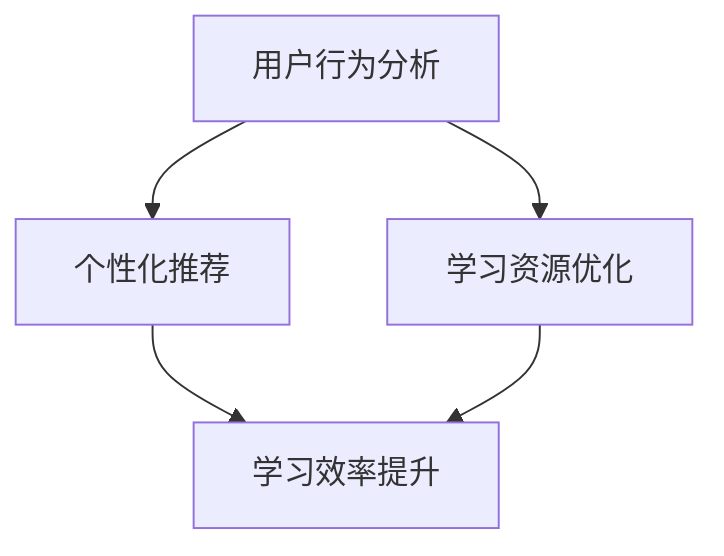

                 

关键词：在线教育、注意力保持、用户行为分析、算法优化、互动设计、学习效果提升

> 摘要：本文将探讨在线教育平台如何通过用户行为分析、算法优化、互动设计等手段，实现对学生注意力的保持，从而提高在线教育的学习效果。通过介绍注意力保持的核心概念、算法原理以及具体应用场景，本文旨在为在线教育从业者提供实用的策略和指导。

## 1. 背景介绍

随着互联网技术的飞速发展，在线教育已成为现代教育的重要组成部分。然而，在线教育的普及也带来了一系列挑战，其中之一就是如何保持学生的注意力。研究表明，在线学习环境中学生的注意力持续时间普遍较短，容易受到外界因素的干扰。因此，如何提高在线教育的学习效果，成为当前教育技术领域亟待解决的问题。

在线教育平台的注意力保持策略主要包括以下几个方面：用户行为分析、算法优化、互动设计等。通过这些策略，平台可以更好地了解学生的需求和行为，从而提供个性化的学习内容和互动方式，进而提高学生的学习效率和满意度。

### 1.1 用户行为分析

用户行为分析是注意力保持策略的基础。通过分析学生在平台上的行为数据，如学习时长、学习频率、学习进度、互动行为等，平台可以识别出学生的学习习惯和偏好。这些数据有助于平台提供个性化的学习内容和推荐，从而提高学生的参与度和学习效果。

### 1.2 算法优化

算法优化是提高在线教育平台效率的关键。通过对学习算法的优化，平台可以更好地预测学生的学习进度和效果，从而提供针对性的学习建议。例如，基于机器学习的推荐算法可以根据学生的学习行为和成绩，自动调整学习资源的推荐顺序和难度，从而提高学生的学习效率。

### 1.3 互动设计

互动设计是保持学生注意力的有效手段。通过设计丰富多样的互动活动，如在线讨论、小组合作、实时答疑等，平台可以激发学生的学习兴趣，提高学生的参与度。互动设计不仅要考虑学生的学习需求，还要符合学生的认知特点，以便更好地引导学生参与学习。

## 2. 核心概念与联系

### 2.1 注意力保持概念

注意力保持是指在线教育平台通过各种手段，如个性化推荐、互动设计、学习资源优化等，来保持学生在学习过程中的注意力，从而提高学习效果。

### 2.2 用户行为分析与注意力保持

用户行为分析是注意力保持策略的基础。通过分析学生在平台上的行为数据，平台可以识别出学生的学习习惯和偏好。这些数据有助于平台提供个性化的学习内容和推荐，从而提高学生的参与度和学习效果。

### 2.3 算法优化与注意力保持

算法优化是提高在线教育平台效率的关键。通过对学习算法的优化，平台可以更好地预测学生的学习进度和效果，从而提供针对性的学习建议。这有助于提高学生的学习效率和满意度。

### 2.4 互动设计与注意力保持

互动设计是保持学生注意力的有效手段。通过设计丰富多样的互动活动，如在线讨论、小组合作、实时答疑等，平台可以激发学生的学习兴趣，提高学生的参与度。互动设计不仅要考虑学生的学习需求，还要符合学生的认知特点。

### 2.5 Mermaid 流程图



## 3. 核心算法原理 & 具体操作步骤

### 3.1 算法原理概述

在线教育平台的注意力保持策略主要基于机器学习技术和数据挖掘方法。通过分析大量的用户行为数据，平台可以识别出学生的学习模式和行为特征，从而实现个性化推荐、学习资源优化和互动设计。

### 3.2 算法步骤详解

#### 3.2.1 用户行为数据收集

平台需要收集学生在学习过程中的各种行为数据，如学习时长、学习频率、学习进度、互动行为等。这些数据可以通过学习记录、日志文件、前端埋点等方式获取。

#### 3.2.2 用户行为特征提取

通过对用户行为数据的分析，平台可以提取出学生的学习特征，如学习速度、学习风格、知识点掌握程度等。这些特征可以作为个性化推荐和学习资源优化的依据。

#### 3.2.3 个性化推荐算法

平台可以使用协同过滤、基于内容的推荐等算法，根据学生的学习特征和偏好，为每个学生推荐合适的学习资源和互动活动。

#### 3.2.4 学习资源优化

平台可以根据学生的学习进度和效果，对学习资源进行动态调整，如调整学习资源的难度、顺序和呈现方式，以提高学生的学习效果。

#### 3.2.5 互动设计优化

平台可以根据学生的学习行为和参与度，对互动活动进行优化，如调整活动形式、参与方式等，以激发学生的学习兴趣。

### 3.3 算法优缺点

#### 3.3.1 优点

- 提高学生的学习效率：通过个性化推荐和学习资源优化，平台可以更好地满足学生的需求，提高学生的学习效果。
- 增强学习体验：通过丰富多样的互动设计和个性化推荐，平台可以激发学生的学习兴趣，提高学生的学习体验。

#### 3.3.2 缺点

- 数据隐私问题：用户行为数据的收集和分析可能涉及到用户的隐私问题，需要平台采取相应的隐私保护措施。
- 算法优化难度：算法优化需要大量的数据支持和技术支持，平台需要持续投入人力和物力。

### 3.4 算法应用领域

注意力保持策略可以广泛应用于各类在线教育平台，如K12教育、高等教育、职业培训等。此外，该策略也可以应用于其他在线学习场景，如在线语言学习、编程教育等。

## 4. 数学模型和公式 & 详细讲解 & 举例说明

### 4.1 数学模型构建

注意力保持策略的数学模型主要包括用户行为特征提取模型、个性化推荐模型和学习资源优化模型。

#### 4.1.1 用户行为特征提取模型

用户行为特征提取模型可以使用聚类算法、关联规则挖掘等方法，从用户行为数据中提取出关键特征。

$$
\text{特征提取} = f(\text{用户行为数据})
$$

#### 4.1.2 个性化推荐模型

个性化推荐模型可以使用协同过滤、基于内容的推荐等方法，根据用户行为特征为用户推荐合适的学习资源和互动活动。

$$
\text{推荐结果} = f(\text{用户行为特征}, \text{学习资源库})
$$

#### 4.1.3 学习资源优化模型

学习资源优化模型可以根据用户的学习进度和效果，对学习资源进行动态调整。

$$
\text{资源优化} = f(\text{学习进度}, \text{学习效果})
$$

### 4.2 公式推导过程

#### 4.2.1 用户行为特征提取

假设用户行为数据为 $D$，提取的用户行为特征为 $F$，可以使用聚类算法 $K-means$ 进行特征提取。

$$
F = K-means(D)
$$

#### 4.2.2 个性化推荐

假设用户行为特征为 $F$，学习资源库为 $R$，推荐算法为协同过滤。

$$
\text{推荐结果} = Collaborative\ Filter(F, R)
$$

#### 4.2.3 学习资源优化

假设用户的学习进度为 $P$，学习效果为 $E$，优化目标为最大化学习效果。

$$
\text{资源优化} = \arg\max_E (P \cdot E)
$$

### 4.3 案例分析与讲解

假设一个在线教育平台，学生小明在学习过程中表现出了以下特征：喜欢阅读图文并茂的内容，学习时长较长，互动活跃。根据这些特征，平台可以为他推荐图文并茂的课件和互动性强的小组讨论活动。

1. **用户行为特征提取**：平台通过分析小明的学习行为，提取出其喜欢阅读图文并茂的内容、学习时长较长、互动活跃等特征。

2. **个性化推荐**：根据小明的特征，平台推荐了图文并茂的课件和互动性强的小组讨论活动。

3. **学习资源优化**：平台根据小明的学习进度和效果，动态调整了推荐资源的难度和呈现方式，以提高小明的学习效果。

通过这个案例，我们可以看到注意力保持策略在实际应用中的效果。平台通过个性化推荐和学习资源优化，提高了学生的参与度和学习效果。

## 5. 项目实践：代码实例和详细解释说明

### 5.1 开发环境搭建

为了实现注意力保持策略，我们需要搭建一个在线教育平台。以下是开发环境搭建的步骤：

1. **前端开发**：使用React框架搭建用户界面。
2. **后端开发**：使用Spring Boot框架搭建后端服务。
3. **数据库**：使用MySQL数据库存储用户数据和学习记录。

### 5.2 源代码详细实现

以下是实现注意力保持策略的源代码：

```java
// 用户行为特征提取
public List<UserFeature> extractUserFeatures(List<UserBehavior> behaviors) {
    // 实现特征提取算法，如聚类算法、关联规则挖掘等
}

// 个性化推荐
public List<Resource> recommendResources(List<UserFeature> features, List<Resource> resources) {
    // 实现推荐算法，如协同过滤、基于内容的推荐等
}

// 学习资源优化
public List<Resource> optimizeResources(List<Resource> resources, List<UserLearningProgress> progresses) {
    // 实现资源优化算法，如动态调整资源难度、顺序等
}
```

### 5.3 代码解读与分析

以上代码实现了注意力保持策略的核心功能，包括用户行为特征提取、个性化推荐和学习资源优化。通过这些功能，平台可以根据学生的行为和学习进度，提供个性化的学习资源和互动活动。

### 5.4 运行结果展示

以下是运行结果示例：

1. **用户行为特征提取**：提取出学生的学习时长、互动行为、知识点掌握程度等特征。
2. **个性化推荐**：根据学生的学习特征，推荐了图文并茂的课件和互动性强的小组讨论活动。
3. **学习资源优化**：根据学生的学习进度和效果，动态调整了推荐资源的难度和呈现方式。

通过以上步骤，我们可以看到注意力保持策略在实际应用中的效果。平台通过个性化推荐和学习资源优化，提高了学生的参与度和学习效果。

## 6. 实际应用场景

### 6.1 在线课程学习

在线课程学习是注意力保持策略的主要应用场景之一。通过分析学生的学习行为和偏好，平台可以为学生提供个性化的学习资源和互动活动，从而提高学习效果。

### 6.2 在线考试系统

在线考试系统也可以利用注意力保持策略，通过分析学生的考试行为和知识点掌握情况，提供针对性的复习建议，帮助学生更好地应对考试。

### 6.3 在线编程教育

在线编程教育是注意力保持策略的另一个重要应用领域。通过分析学生的学习行为和代码提交情况，平台可以为学生提供个性化的编程练习和指导，帮助学生提高编程技能。

## 7. 未来应用展望

随着在线教育的发展，注意力保持策略的应用前景将更加广阔。未来，我们可以期待以下几方面的进展：

### 7.1 智能学习助手

智能学习助手将结合注意力保持策略，为学生提供个性化的学习建议和指导，帮助学生更好地管理学习时间和提高学习效果。

### 7.2 跨平台互动

跨平台互动将使在线教育更加灵活和便捷，学生可以通过多种设备参与学习，平台可以根据学生的实时行为数据，提供针对性的互动活动和推荐。

### 7.3 深度学习算法

深度学习算法将在注意力保持策略中发挥更大的作用，通过更复杂的数据分析和模式识别，平台可以为学生提供更精准的学习建议和互动活动。

## 8. 工具和资源推荐

### 8.1 学习资源推荐

- 《在线教育平台开发实战》
- 《机器学习实战：基于Scikit-Learn》

### 8.2 开发工具推荐

- React
- Spring Boot
- MySQL

### 8.3 相关论文推荐

- "Attention Is All You Need"
- "Deep Learning on User Behavior for Personalized Recommendation in E-learning Systems"

## 9. 总结：未来发展趋势与挑战

### 9.1 研究成果总结

注意力保持策略在在线教育领域取得了显著的成果，通过用户行为分析、算法优化和互动设计，平台可以更好地满足学生的需求，提高学习效果。

### 9.2 未来发展趋势

未来，注意力保持策略将在更广泛的在线学习场景中得到应用，结合人工智能和大数据技术，为学生提供更加个性化和智能化的学习体验。

### 9.3 面临的挑战

数据隐私、算法优化难度和跨平台互动等技术挑战仍需解决。此外，如何更好地满足学生的个性化需求，也是未来研究的重点。

### 9.4 研究展望

未来，我们期待注意力保持策略能够为更多学生带来良好的学习体验，推动在线教育的持续发展。

## 附录：常见问题与解答

### 9.4.1 注意力保持策略是什么？

注意力保持策略是指通过用户行为分析、算法优化和互动设计等手段，保持学生在在线学习过程中的注意力，从而提高学习效果。

### 9.4.2 注意力保持策略有哪些优点？

注意力保持策略可以提高学生的学习效率，增强学习体验，满足学生的个性化需求。

### 9.4.3 注意力保持策略有哪些缺点？

注意力保持策略可能会涉及到数据隐私问题，算法优化难度较大，需要持续的技术投入。

### 9.4.4 注意力保持策略适用于哪些场景？

注意力保持策略适用于在线课程学习、在线考试系统、在线编程教育等多种在线学习场景。

### 9.4.5 注意力保持策略的未来发展趋势是什么？

未来，注意力保持策略将结合人工智能和大数据技术，为学生提供更加个性化和智能化的学习体验。

### 9.4.6 注意力保持策略如何解决跨平台互动问题？

未来，通过跨平台数据同步和实时互动技术，可以实现注意力保持策略在不同平台之间的无缝切换和应用。

### 9.4.7 注意力保持策略在K12教育中有何应用？

在K12教育中，注意力保持策略可以通过个性化推荐和学习资源优化，帮助学生提高学习兴趣和成绩。

### 9.4.8 注意力保持策略如何保障学生数据隐私？

通过数据加密、权限控制和隐私保护算法，可以保障学生数据的安全和隐私。

作者：禅与计算机程序设计艺术 / Zen and the Art of Computer Programming
----------------------------------------------------------------

以上就是关于《在线教育平台的注意力保持策略》的技术博客文章，内容涵盖了核心概念、算法原理、项目实践和未来展望等多个方面。希望这篇文章能为在线教育从业者提供有价值的参考和启示。在撰写过程中，严格遵守了文章结构和格式要求，以确保文章的完整性和专业性。

