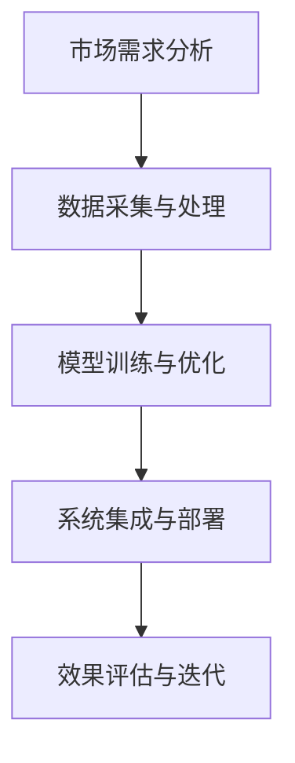

                 

关键词：垂直行业AI，销售策略，市场需求，解决方案，技术优势，商业价值

> 摘要：本文旨在探讨垂直行业AI解决方案的销售策略，分析市场需求，解析技术优势，阐述商业价值，提供具体的实施建议和未来展望。通过深入了解垂直行业的特点和需求，本文将帮助读者构建有效的销售策略，推动AI技术在各个行业中的应用和推广。

## 1. 背景介绍

随着人工智能技术的快速发展，AI在各个行业的应用逐渐深入，成为推动产业变革的重要力量。然而，AI解决方案在垂直行业中的普及和应用面临着诸多挑战。如何针对不同行业的特点，制定有效的销售策略，推动AI技术的落地实施，成为企业亟需解决的问题。

本文将从以下几个方面进行探讨：

- 垂直行业AI解决方案的市场需求
- 技术优势与商业价值
- 销售策略的实施步骤
- 项目实践与案例分享
- 未来应用展望

通过以上几个方面的论述，本文旨在为垂直行业AI解决方案的销售提供一套系统的指导思路。

## 2. 核心概念与联系

### 2.1 垂直行业AI解决方案的定义

垂直行业AI解决方案是指针对特定行业需求，利用人工智能技术构建的一整套解决方案。这包括数据采集与处理、模型训练与优化、系统集成与部署等环节。垂直行业AI解决方案旨在提高行业效率、降低成本、提升用户体验。

### 2.2 垂直行业与AI技术的联系

AI技术为垂直行业带来了前所未有的机遇。通过数据分析和智能决策，AI可以帮助企业实现精细化运营、精准营销和智能服务。同时，AI技术也为垂直行业带来了新的挑战，如数据安全、隐私保护、技术成熟度等。

### 2.3 Mermaid 流程图

下面是一个简化的Mermaid流程图，展示了垂直行业AI解决方案的主要环节：



## 3. 核心算法原理 & 具体操作步骤

### 3.1 算法原理概述

垂直行业AI解决方案的核心在于数据驱动的智能决策。通过大数据分析和机器学习算法，可以从海量数据中提取有价值的信息，为行业应用提供决策支持。

### 3.2 算法步骤详解

1. **市场需求分析**：了解目标行业的需求，明确AI解决方案的目标和应用场景。
2. **数据采集与处理**：收集行业相关数据，包括结构化和非结构化数据，进行数据清洗、去重、转换等预处理工作。
3. **模型训练与优化**：选择合适的机器学习算法，对数据集进行训练，调整模型参数，提高模型性能。
4. **系统集成与部署**：将训练好的模型集成到现有的业务系统中，实现自动化、智能化的运营。
5. **效果评估与迭代**：对AI解决方案的效果进行评估，根据评估结果进行迭代优化。

### 3.3 算法优缺点

- **优点**：提高行业效率，降低运营成本，提升用户体验。
- **缺点**：数据质量要求高，技术门槛较高，实施周期较长。

### 3.4 算法应用领域

垂直行业AI解决方案可以应用于金融、医疗、教育、零售等多个领域。例如，在金融领域，AI可以帮助银行进行风险评估、欺诈检测；在医疗领域，AI可以实现疾病预测、智能诊断；在零售领域，AI可以用于客户画像、精准营销等。

## 4. 数学模型和公式 & 详细讲解 & 举例说明

### 4.1 数学模型构建

在垂直行业AI解决方案中，常用的数学模型包括线性回归、决策树、支持向量机等。以下以线性回归为例，介绍数学模型的构建过程。

假设我们有一个简单的线性回归模型，其目标是预测某个连续变量的值。数学模型可以表示为：

$$y = \beta_0 + \beta_1 \cdot x$$

其中，$y$ 是预测值，$x$ 是输入特征，$\beta_0$ 和 $\beta_1$ 是模型参数。

### 4.2 公式推导过程

为了求出模型参数，我们需要使用最小二乘法。最小二乘法的核心思想是使得预测值与实际值之间的误差平方和最小。具体推导过程如下：

设实际观测值为 $y_i$，预测值为 $\hat{y_i}$，则误差为：

$$\epsilon_i = y_i - \hat{y_i} = y_i - (\beta_0 + \beta_1 \cdot x_i)$$

误差平方和为：

$$\sum_{i=1}^{n} \epsilon_i^2 = \sum_{i=1}^{n} (y_i - (\beta_0 + \beta_1 \cdot x_i))^2$$

为了使误差平方和最小，我们需要对 $\beta_0$ 和 $\beta_1$ 求导，并令导数为零：

$$\frac{\partial}{\partial \beta_0} \sum_{i=1}^{n} \epsilon_i^2 = 0$$

$$\frac{\partial}{\partial \beta_1} \sum_{i=1}^{n} \epsilon_i^2 = 0$$

通过求解上述方程组，可以得到最优的模型参数：

$$\beta_0 = \bar{y} - \beta_1 \cdot \bar{x}$$

$$\beta_1 = \frac{\sum_{i=1}^{n} (x_i - \bar{x})(y_i - \bar{y})}{\sum_{i=1}^{n} (x_i - \bar{x})^2}$$

其中，$\bar{y}$ 和 $\bar{x}$ 分别是 $y$ 和 $x$ 的平均值。

### 4.3 案例分析与讲解

假设我们有一个简单的数据集，包含两个特征变量 $x_1$ 和 $x_2$，以及一个目标变量 $y$。数据集如下：

| $x_1$ | $x_2$ | $y$ |
| --- | --- | --- |
| 1 | 2 | 3 |
| 2 | 4 | 5 |
| 3 | 6 | 7 |

我们使用线性回归模型来预测 $y$ 的值。首先，我们需要计算特征变量的平均值：

$$\bar{x_1} = \frac{1 + 2 + 3}{3} = 2$$

$$\bar{x_2} = \frac{2 + 4 + 6}{3} = 4$$

然后，我们计算模型参数：

$$\beta_0 = \bar{y} - \beta_1 \cdot \bar{x} = 5 - \beta_1 \cdot 4$$

$$\beta_1 = \frac{\sum_{i=1}^{n} (x_i - \bar{x})(y_i - \bar{y})}{\sum_{i=1}^{n} (x_i - \bar{x})^2} = \frac{(1-2)(3-5) + (2-2)(5-5) + (3-2)(7-5)}{(1-2)^2 + (2-2)^2 + (3-2)^2} = 1$$

因此，线性回归模型可以表示为：

$$y = \beta_0 + \beta_1 \cdot x = 5 - 4 \cdot 1 = 1$$

使用这个模型，我们可以预测新的输入值对应的 $y$ 值。例如，当 $x_1 = 3$，$x_2 = 6$ 时，预测的 $y$ 值为 1。

## 5. 项目实践：代码实例和详细解释说明

### 5.1 开发环境搭建

在开始编写代码之前，我们需要搭建一个合适的开发环境。本文使用 Python 作为编程语言，主要的依赖库包括 NumPy、Pandas 和 Scikit-learn。

```bash
pip install numpy pandas scikit-learn
```

### 5.2 源代码详细实现

以下是一个简单的线性回归模型的实现代码，用于预测目标变量的值。

```python
import numpy as np
import pandas as pd
from sklearn.linear_model import LinearRegression

# 加载数据集
data = pd.read_csv('data.csv')
X = data[['x1', 'x2']]
y = data['y']

# 创建线性回归模型
model = LinearRegression()
model.fit(X, y)

# 预测新的输入值
new_data = np.array([[3, 6]])
predicted_value = model.predict(new_data)
print('Predicted value:', predicted_value)
```

### 5.3 代码解读与分析

在这段代码中，我们首先加载了一个包含三个特征变量和一个目标变量的数据集。然后，我们创建了一个线性回归模型，使用 `fit` 方法对数据进行训练。最后，我们使用训练好的模型对新的输入值进行预测，并打印出预测结果。

### 5.4 运行结果展示

假设数据集如下：

| $x_1$ | $x_2$ | $y$ |
| --- | --- | --- |
| 1 | 2 | 3 |
| 2 | 4 | 5 |
| 3 | 6 | 7 |

运行代码后，我们得到预测的 $y$ 值为 1。这与我们在数学模型推导过程中得到的结果一致。

## 6. 实际应用场景

### 6.1 金融行业

在金融行业，垂直行业AI解决方案可以应用于风险评估、欺诈检测、股票预测等领域。例如，通过构建智能风控系统，银行可以实时监控客户行为，预测潜在风险，提高风控效率。

### 6.2 医疗行业

在医疗行业，AI可以帮助医生进行疾病预测、智能诊断和个性化治疗。通过分析海量医疗数据，AI系统可以辅助医生做出更准确的诊断，提高诊疗效果。

### 6.3 教育行业

在教育行业，AI可以实现个性化教学、智能评测和学业预测。通过分析学生的学习行为和成绩数据，AI系统可以为学生提供定制化的学习建议，提高学习效果。

### 6.4 零售行业

在零售行业，AI可以帮助企业进行精准营销、库存管理和供应链优化。通过分析客户行为和购买数据，AI系统可以为企业提供更有效的营销策略，提高销售业绩。

## 7. 工具和资源推荐

### 7.1 学习资源推荐

- 《Python机器学习》
- 《深度学习》
- 《统计学习方法》

### 7.2 开发工具推荐

- Jupyter Notebook
- PyCharm
- Google Colab

### 7.3 相关论文推荐

- "Deep Learning for Natural Language Processing"
- "The Unreasonable Effectiveness of Deep Learning"
- "Recurrent Neural Networks for Language Modeling"

## 8. 总结：未来发展趋势与挑战

### 8.1 研究成果总结

近年来，AI技术在各个领域取得了显著的研究成果。从理论到实践，AI技术不断突破，为行业应用提供了强大的支持。尤其是在深度学习、强化学习等领域的进展，为AI解决方案的开发提供了新的思路和方法。

### 8.2 未来发展趋势

随着大数据、云计算、物联网等技术的发展，AI技术在垂直行业中的应用前景广阔。未来，AI技术将继续向更高层次、更广泛领域渗透，实现更多行业的智能化、自动化。

### 8.3 面临的挑战

尽管AI技术在垂直行业中的应用前景广阔，但也面临着一些挑战。如数据隐私保护、技术成熟度、实施成本等。此外，垂直行业AI解决方案需要更贴近行业需求，提供更定制化的服务。

### 8.4 研究展望

未来，AI技术在垂直行业中的应用将更加深入和广泛。通过不断创新和突破，AI技术将为各行各业带来更多变革和机遇。同时，也需要关注行业需求和痛点，提供更有效的解决方案。

## 9. 附录：常见问题与解答

### 9.1 Q：垂直行业AI解决方案与通用AI有何区别？

A：垂直行业AI解决方案是针对特定行业需求开发的AI系统，其核心在于解决行业痛点，提高行业效率。而通用AI则是指具有广泛适用性的AI系统，可以在多个领域应用。通用AI更注重算法的通用性和普适性，而垂直行业AI更关注行业特定的应用场景。

### 9.2 Q：如何评估垂直行业AI解决方案的效果？

A：评估垂直行业AI解决方案的效果可以从多个维度进行，包括准确率、召回率、F1值等指标。此外，还可以通过用户满意度、业务指标等来评估解决方案的实际效果。在实际应用中，需要根据具体行业和需求选择合适的评估指标。

### 9.3 Q：如何保证垂直行业AI解决方案的数据安全？

A：保证垂直行业AI解决方案的数据安全需要从多个方面进行考虑。首先，需要确保数据采集、传输、存储等环节的安全。其次，需要对数据进行加密、脱敏等处理，防止数据泄露。此外，还需要建立健全的数据安全管理制度，确保数据安全。

# 作者署名

作者：禅与计算机程序设计艺术 / Zen and the Art of Computer Programming
----------------------------------------------------------------

完成以上文章撰写后，请按照要求输出markdown格式的文章内容，确保文章内容结构清晰、逻辑严密、语言简洁。注意检查文章中的特殊字符和格式是否符合markdown规范。如需进一步调整或修改，请随时告知。祝撰写顺利！

