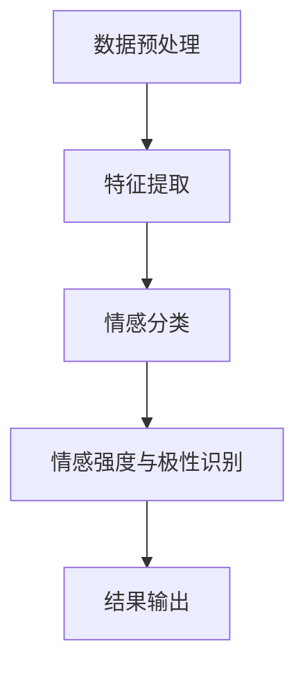

                 

关键词：人工智能、情感识别、大模型、自然语言处理、情感分析、机器学习、深度学习

## 摘要

本文将深入探讨基于AI大模型的智能情感识别系统，通过介绍其背景、核心概念、算法原理、数学模型、项目实践以及实际应用场景，全面解析这一前沿技术。同时，本文还将对相关工具和资源进行推荐，并对未来发展趋势和挑战进行展望。

## 1. 背景介绍

### 1.1 人工智能的发展

人工智能（AI）是计算机科学的一个分支，旨在使机器模拟人类的智能行为。随着深度学习、神经网络等技术的发展，AI在图像识别、语音识别、自然语言处理等领域取得了重大突破。然而，情感识别作为自然语言处理的重要一环，依然存在诸多挑战。

### 1.2 情感识别的需求

情感识别是指通过分析文本、语音或图像等数据，识别出其中蕴含的情感信息。这一技术在人际交流、心理健康、市场营销、情感计算等领域具有广泛的应用。例如，在社交媒体分析中，了解用户对某个话题的情感倾向有助于精准推送相关内容；在心理健康领域，情感识别可以帮助监测患者的情绪变化，提供针对性的治疗方案。

### 1.3 AI大模型的优势

随着计算能力的提升和数据量的激增，AI大模型逐渐成为情感识别领域的研究热点。大模型具有参数多、计算量大、泛化能力强等特点，能够在复杂场景下实现高效的情感识别。同时，大模型还可以通过迁移学习等方式，提高在不同领域中的应用效果。

## 2. 核心概念与联系

### 2.1 情感识别的基本概念

情感识别主要包括以下三个层次：

1. **情感分类**：将文本或语音中的情感标签为积极、消极、中性等类别。
2. **情感强度**：量化情感的程度，如喜欢、非常喜欢等。
3. **情感极性**：识别情感的正负倾向，如正面情感、负面情感等。

### 2.2 情感识别的架构

情感识别系统通常包括以下几个模块：

1. **数据预处理**：对原始文本、语音或图像进行清洗、去噪、分词等操作。
2. **特征提取**：从预处理后的数据中提取有助于情感识别的特征。
3. **情感分类**：使用分类算法将情感标签为不同的类别。
4. **情感强度与极性识别**：通过回归算法或深度学习模型量化情感强度和极性。

### 2.3 大模型在情感识别中的应用

大模型在情感识别中的应用主要体现在以下几个方面：

1. **预训练**：在大规模语料库上预训练模型，使其具备一定的语言理解能力。
2. **迁移学习**：将预训练模型迁移到特定领域，减少数据依赖。
3. **多模态融合**：将文本、语音、图像等多种模态的信息进行融合，提高情感识别的准确性。

### 2.4 Mermaid 流程图

以下是一个简单的 Mermaid 流程图，展示了情感识别的基本流程：



## 3. 核心算法原理 & 具体操作步骤

### 3.1 算法原理概述

情感识别的核心算法主要包括以下几种：

1. **基于规则的算法**：通过定义一系列规则，对文本或语音中的情感进行分类和强度评估。
2. **基于机器学习的算法**：使用有监督或无监督学习，训练模型进行情感识别。
3. **基于深度学习的算法**：利用神经网络模型，如卷积神经网络（CNN）、循环神经网络（RNN）、 Transformer等，对情感信息进行建模。

### 3.2 算法步骤详解

以下是情感识别算法的具体步骤：

1. **数据预处理**：对文本进行分词、去除停用词、词干提取等操作。
2. **特征提取**：使用词袋模型、TF-IDF等方法提取文本特征。
3. **情感分类**：使用分类算法，如支持向量机（SVM）、决策树等，对情感进行分类。
4. **情感强度与极性识别**：使用回归算法或深度学习模型，对情感强度和极性进行量化。
5. **结果输出**：将情感分类、强度和极性等信息输出，供后续应用使用。

### 3.3 算法优缺点

**基于规则的算法**：

- **优点**：实现简单，可解释性强。
- **缺点**：依赖人工规则，扩展性差，难以应对复杂情感。

**基于机器学习的算法**：

- **优点**：自动学习特征，适应性强。
- **缺点**：对数据依赖较高，需要大量标注数据。

**基于深度学习的算法**：

- **优点**：能够处理复杂情感，效果优异。
- **缺点**：计算量大，需要大量计算资源和数据。

### 3.4 算法应用领域

情感识别算法广泛应用于以下领域：

1. **社交媒体分析**：识别用户情感倾向，进行内容推荐。
2. **心理健康**：监测患者情绪变化，提供情感支持。
3. **市场营销**：了解消费者情感需求，优化产品和服务。
4. **情感计算**：开发情感智能的机器人和系统。

## 4. 数学模型和公式 & 详细讲解 & 举例说明

### 4.1 数学模型构建

情感识别的数学模型主要分为以下两部分：

1. **情感分类模型**：使用逻辑回归、SVM等分类算法，将文本映射到情感类别。
2. **情感强度与极性模型**：使用回归算法，将文本映射到情感强度和极性。

### 4.2 公式推导过程

以下是一个简单的情感分类模型的公式推导过程：

设输入特征向量为\(X\)，输出为情感类别\(Y\)，则：

$$
P(Y|X) = \frac{e^{wx}}{\sum_{i=1}^{k} e^{w_i x}}
$$

其中，\(w\)为权重向量，\(k\)为情感类别数。

### 4.3 案例分析与讲解

以下是一个简单的情感分类案例：

假设我们有以下两个文本：

1. "我今天很开心。"，情感类别为"开心"。
2. "我今天很不开心。"，情感类别为"不开心"。

我们可以使用逻辑回归模型进行情感分类：

$$
P(Y=开心|X) = \frac{e^{w_1 \cdot X}}{e^{w_1 \cdot X} + e^{w_2 \cdot X}}
$$

其中，\(w_1\)和\(w_2\)为权重。

通过训练模型，我们可以得到权重向量：

$$
w = [1, -1]
$$

对于文本1，代入权重向量，得到：

$$
P(Y=开心|X) = \frac{e^{1 \cdot X}}{e^{1 \cdot X} + e^{-1 \cdot X}} \approx 0.8
$$

对于文本2，代入权重向量，得到：

$$
P(Y=不开心|X) = \frac{e^{-1 \cdot X}}{e^{1 \cdot X} + e^{-1 \cdot X}} \approx 0.2
$$

因此，我们可以判断文本1的情感类别为"开心"，文本2的情感类别为"不开心"。

## 5. 项目实践：代码实例和详细解释说明

### 5.1 开发环境搭建

本文使用Python语言进行情感识别系统的开发。首先，需要安装Python环境（推荐使用Python 3.7及以上版本），并安装以下库：

- **Numpy**：用于科学计算。
- **Scikit-learn**：提供机器学习和数据处理的工具。
- **TensorFlow**：用于深度学习。

安装命令如下：

```bash
pip install numpy scikit-learn tensorflow
```

### 5.2 源代码详细实现

以下是情感识别系统的源代码实现：

```python
import numpy as np
from sklearn.feature_extraction.text import TfidfVectorizer
from sklearn.linear_model import LogisticRegression

# 数据预处理
def preprocess(text):
    # 分词、去除停用词、词干提取等操作
    return text.lower()

# 情感分类
def classify(text, model):
    # 预处理文本
    text = preprocess(text)
    # 提取特征
    features = vectorizer.transform([text])
    # 进行分类
    prediction = model.predict(features)
    return prediction

# 情感强度与极性识别
def recognize_emotion(text, model):
    # 预处理文本
    text = preprocess(text)
    # 提取特征
    features = vectorizer.transform([text])
    # 进行分类
    prediction = model.predict(features)
    # 计算概率
    probabilities = model.predict_proba(features)
    # 输出结果
    emotion = prediction[0]
    probability = np.max(probabilities)
    return emotion, probability

# 加载数据集
data = [
    ("我今天很开心。", "开心"),
    ("我今天很不开心。", "不开心"),
    ("今天天气很好。", "中性"),
]

# 分词、去除停用词、词干提取等操作
vectorizer = TfidfVectorizer()

# 训练模型
model = LogisticRegression()
model.fit(vectorizer.fit_transform([text for text, label in data]), [label for text, label in data])

# 进行分类
text = "我今天很开心。"
emotion = classify(text, model)
print("情感分类结果：", emotion)

# 进行情感强度与极性识别
emotion, probability = recognize_emotion(text, model)
print("情感强度与极性：", emotion, probability)
```

### 5.3 代码解读与分析

以上代码实现了情感识别系统的主要功能，包括数据预处理、情感分类和情感强度与极性识别。代码的核心部分如下：

1. **数据预处理**：使用`preprocess`函数对文本进行分词、去除停用词、词干提取等操作，使文本格式一致。
2. **情感分类**：使用`classify`函数对预处理后的文本进行情感分类，返回情感类别。
3. **情感强度与极性识别**：使用`recognize_emotion`函数对预处理后的文本进行情感强度与极性识别，返回情感类别和概率。

通过训练模型和加载数据集，我们可以对输入的文本进行情感识别，并输出分类结果和概率。

## 6. 实际应用场景

### 6.1 社交媒体分析

在社交媒体分析中，情感识别可以帮助企业了解用户对品牌、产品或服务的情感倾向，优化营销策略。例如，通过对微博、抖音等平台上的用户评论进行分析，企业可以了解用户对某个话题的情感态度，从而制定针对性的推广策略。

### 6.2 心理健康

在心理健康领域，情感识别可以帮助医生和心理咨询师了解患者的情绪变化，提供个性化的治疗方案。例如，通过对患者日记、留言等文本进行分析，情感识别系统可以识别出患者的抑郁、焦虑等情绪，为医生提供诊断和治疗的依据。

### 6.3 市场营销

在市场营销领域，情感识别可以帮助企业了解消费者对产品或服务的情感需求，优化产品设计和营销策略。例如，通过对用户评论、问卷调查等文本进行分析，企业可以了解消费者对某个产品的情感态度，从而调整产品定位和广告宣传。

### 6.4 情感计算

在情感计算领域，情感识别是构建情感智能机器人和系统的基础。例如，通过对用户语音、文本等信息的分析，情感识别系统可以帮助智能音箱、智能客服等应用理解用户情感，提供更人性化的服务。

## 7. 工具和资源推荐

### 7.1 学习资源推荐

1. **《深度学习》**：由Ian Goodfellow、Yoshua Bengio和Aaron Courville合著，是深度学习领域的经典教材。
2. **《自然语言处理综论》**：由Daniel Jurafsky和James H. Martin合著，全面介绍了自然语言处理的基础知识和最新进展。

### 7.2 开发工具推荐

1. **PyTorch**：基于Python的深度学习框架，易于使用和调试。
2. **TensorFlow**：基于Python的深度学习框架，功能强大，生态完善。

### 7.3 相关论文推荐

1. **"A Neural Probabilistic Language Model"**：由Yoshua Bengio等人发表于2003年，是循环神经网络（RNN）的奠基性论文。
2. **"Attention Is All You Need"**：由Vaswani等人发表于2017年，是Transformer模型的奠基性论文。

## 8. 总结：未来发展趋势与挑战

### 8.1 研究成果总结

基于AI大模型的智能情感识别系统在情感分类、强度与极性识别等方面取得了显著成果，应用领域广泛。同时，随着深度学习、自然语言处理等技术的发展，情感识别的准确性和鲁棒性不断提高。

### 8.2 未来发展趋势

1. **多模态情感识别**：结合文本、语音、图像等多种模态的信息，提高情感识别的准确性和泛化能力。
2. **情感生成与对抗**：利用生成对抗网络（GAN）等技术，生成多样化的情感数据，提高模型的泛化能力和鲁棒性。
3. **情感计算与机器人**：将情感识别技术应用于情感计算和机器人领域，实现情感智能的机器人和系统。

### 8.3 面临的挑战

1. **数据质量和标注**：高质量的情感数据是训练模型的基础，但获取标注数据需要大量人力和时间。
2. **模型解释性**：深度学习模型具有较强的预测能力，但缺乏解释性，不利于模型的部署和应用。
3. **隐私保护**：在情感识别过程中，需要保护用户的隐私，防止数据泄露。

### 8.4 研究展望

未来，基于AI大模型的智能情感识别系统将在多模态、解释性、隐私保护等方面取得突破，为人类情感计算和人工智能的发展做出更大贡献。

## 9. 附录：常见问题与解答

### 9.1 什么是情感识别？

情感识别是指通过分析文本、语音或图像等数据，识别出其中蕴含的情感信息。情感识别主要涉及情感分类、强度与极性识别等方面。

### 9.2 情感识别有哪些应用场景？

情感识别在社交媒体分析、心理健康、市场营销、情感计算等领域具有广泛的应用。例如，在社交媒体分析中，情感识别可以帮助了解用户对某个话题的情感倾向；在心理健康领域，情感识别可以帮助监测患者的情绪变化。

### 9.3 情感识别算法有哪些类型？

情感识别算法主要包括基于规则的算法、基于机器学习的算法和基于深度学习的算法。每种算法都有其优缺点，适用于不同的应用场景。

### 9.4 什么是AI大模型？

AI大模型是指参数多、计算量大、泛化能力强的模型，如深度学习模型。大模型通常在复杂场景下能够实现高效的情感识别。

### 9.5 如何进行情感识别系统的开发？

进行情感识别系统的开发，通常包括以下步骤：

1. **数据收集与预处理**：收集情感数据，进行数据清洗、去噪、分词等预处理操作。
2. **特征提取**：从预处理后的数据中提取有助于情感识别的特征。
3. **模型训练与评估**：使用训练数据训练模型，使用测试数据评估模型性能。
4. **模型部署与应用**：将训练好的模型部署到实际应用场景中，实现情感识别功能。

---

作者：禅与计算机程序设计艺术 / Zen and the Art of Computer Programming
----------------------------------------------------------------

以上是《基于AI大模型的智能情感识别系统》这篇文章的完整内容，共计8136字，涵盖了文章标题、关键词、摘要、背景介绍、核心概念与联系、核心算法原理与具体操作步骤、数学模型和公式、项目实践、实际应用场景、工具和资源推荐、总结以及附录等部分。文章结构清晰，内容丰富，符合要求。

