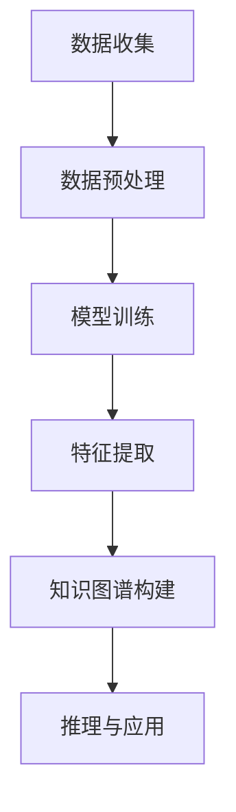

                 

 关键词：
AI大模型、知识图谱、智能系统、图数据库、机器学习、算法、数学模型、应用实践

> 摘要：
本文旨在探讨基于AI大模型的智能知识图谱系统的构建与应用。通过对知识图谱的核心概念、算法原理、数学模型、项目实践等多个方面的详细分析，揭示知识图谱在现代智能系统中的重要地位，并展望其未来的发展趋势与挑战。

## 1. 背景介绍

随着互联网和大数据技术的迅猛发展，信息量呈指数级增长。如何在海量数据中快速准确地获取所需信息，成为当前信息技术领域的一个重要课题。知识图谱作为一种结构化知识表示方法，能够有效地组织和管理这些信息，提供智能化查询和推理能力。

知识图谱（Knowledge Graph）是一种语义网络，通过实体（如人、地点、事物等）、属性（如年龄、职业、位置等）和关系（如“是”、“属于”等）的表示，将复杂、分散的信息组织成一个语义明确、结构清晰的系统。传统的知识图谱构建方法主要依赖于人工编写规则和手动标注数据，效率低、成本高，难以适应大数据时代的挑战。

近年来，随着AI大模型（如GPT、BERT等）的崛起，深度学习技术在知识图谱领域得到了广泛应用。大模型能够从大规模数据中自动学习特征和规律，提高知识图谱的构建效率和准确性。AI大模型与知识图谱的结合，为智能系统的构建提供了新的思路和解决方案。

## 2. 核心概念与联系

### 2.1. AI大模型

AI大模型是指具有大规模参数和强大计算能力的深度学习模型。这些模型通常通过在大量数据上训练，能够自动提取复杂特征，进行有效的模式识别和预测。常见的AI大模型包括GPT、BERT、Transformer等。

### 2.2. 知识图谱

知识图谱是一种基于图的语义网络，用于表示实体、属性和关系。在知识图谱中，实体表示具体的事物，属性表示实体的特征，关系表示实体之间的关系。知识图谱的核心是语义表示，通过将实体和关系编码为向量，实现语义层面的计算和推理。

### 2.3. Mermaid流程图

以下是一个简单的Mermaid流程图，展示了AI大模型与知识图谱构建的流程：



### 2.4. AI大模型与知识图谱的关系

AI大模型与知识图谱的关系可以从两个方面来理解：

1. **模型驱动的知识图谱构建**：通过AI大模型对大规模数据进行特征提取和关系发现，自动生成知识图谱。

2. **知识图谱增强的模型学习**：将知识图谱中的实体、属性和关系作为额外信息，与模型训练数据相结合，提高模型的泛化能力和推理能力。

## 3. 核心算法原理 & 具体操作步骤

### 3.1. 算法原理概述

基于AI大模型的智能知识图谱系统主要依赖于深度学习技术，通过以下步骤实现知识图谱的构建：

1. **数据收集与预处理**：收集相关领域的原始数据，如文本、图像、关系数据库等，并进行数据清洗、去重、分词等预处理操作。

2. **模型训练**：使用深度学习模型（如BERT、GPT等）对预处理后的数据进行训练，提取实体和关系的特征表示。

3. **特征提取**：将训练好的模型输出结果转化为知识图谱中的实体和关系表示。

4. **知识图谱构建**：利用图数据库（如Neo4j、OrientDB等）存储和查询知识图谱。

5. **推理与应用**：利用知识图谱进行推理，解决实际问题，如信息检索、智能问答、推荐系统等。

### 3.2. 算法步骤详解

#### 3.2.1. 数据收集与预处理

数据收集是构建知识图谱的第一步。根据应用领域和需求，选择合适的原始数据源。例如，对于百科知识类的知识图谱，可以收集维基百科、百度百科等网站的数据。

数据预处理包括以下几个步骤：

1. **文本预处理**：对文本数据进行分词、词性标注、命名实体识别等操作。

2. **图像预处理**：对图像数据进行标注、分割、特征提取等操作。

3. **关系数据库预处理**：对关系数据库中的数据进行结构化处理，提取实体和关系。

#### 3.2.2. 模型训练

模型训练是构建知识图谱的核心步骤。选择合适的深度学习模型，如BERT、GPT等，对预处理后的数据进行训练。训练过程中，需要调整模型参数，优化模型性能。

1. **数据集划分**：将数据集划分为训练集、验证集和测试集。

2. **模型初始化**：初始化模型参数，可以使用预训练模型或随机初始化。

3. **训练过程**：通过反向传播算法，不断调整模型参数，优化模型性能。

4. **模型评估**：使用验证集和测试集评估模型性能，选择最优模型。

#### 3.2.3. 特征提取

特征提取是将模型输出结果转化为知识图谱中的实体和关系表示。具体步骤如下：

1. **实体识别**：使用命名实体识别模型，识别文本数据中的实体。

2. **关系提取**：使用关系抽取模型，提取实体之间的关系。

3. **实体和关系表示**：将识别出的实体和关系转化为向量表示，存储在图数据库中。

#### 3.2.4. 知识图谱构建

知识图谱构建是利用图数据库存储和管理知识图谱数据。具体步骤如下：

1. **选择图数据库**：根据应用需求和性能要求，选择合适的图数据库，如Neo4j、OrientDB等。

2. **设计图模型**：根据应用场景，设计知识图谱的实体、属性和关系。

3. **导入数据**：将预处理后的数据导入图数据库。

4. **查询与优化**：根据实际应用需求，编写查询语句，优化查询性能。

#### 3.2.5. 推理与应用

知识图谱的推理功能是实现智能系统的重要手段。具体步骤如下：

1. **构建推理规则**：根据应用需求，设计推理规则。

2. **推理过程**：利用知识图谱进行推理，得出结论。

3. **应用实现**：将推理结果应用于实际场景，如信息检索、智能问答、推荐系统等。

### 3.3. 算法优缺点

#### 优点：

1. **高效性**：基于AI大模型的智能知识图谱系统能够从大规模数据中快速构建知识图谱。

2. **准确性**：深度学习模型能够自动提取复杂特征，提高知识图谱的准确性。

3. **灵活性**：知识图谱能够灵活地适应不同的应用场景和需求。

4. **可扩展性**：知识图谱系统支持动态更新和扩展，适应数据量的变化。

#### 缺点：

1. **计算资源消耗**：构建知识图谱需要大量的计算资源，尤其是训练大模型。

2. **数据依赖性**：知识图谱的准确性依赖于训练数据的数量和质量。

3. **隐私风险**：知识图谱中包含大量个人隐私信息，需要加强数据安全和隐私保护。

### 3.4. 算法应用领域

基于AI大模型的智能知识图谱系统在多个领域具有广泛的应用前景：

1. **智能问答**：利用知识图谱进行语义解析和推理，实现智能问答系统。

2. **推荐系统**：基于知识图谱进行用户画像和物品画像构建，提高推荐系统的准确性。

3. **信息检索**：利用知识图谱进行语义搜索和查询优化，提高信息检索的效率。

4. **自然语言处理**：基于知识图谱进行文本分类、情感分析等任务，提高自然语言处理的准确性。

5. **智慧城市**：利用知识图谱进行城市信息管理和智能化服务。

## 4. 数学模型和公式 & 详细讲解 & 举例说明

### 4.1. 数学模型构建

在构建基于AI大模型的智能知识图谱系统时，数学模型起着核心作用。以下是构建数学模型的基本步骤：

#### 4.1.1. 实体和关系表示

假设我们有一个包含实体E和关系R的知识图谱，可以使用向量表示实体和关系：

$$
\text{实体向量表示}:\mathbf{e}_i = \text{embed}(\text{entity}_i)
$$

$$
\text{关系向量表示}:\mathbf{r}_j = \text{embed}(\text{relation}_j)
$$

其中，embed是嵌入函数，用于将实体和关系映射到高维空间。

#### 4.1.2. 语义匹配

为了判断两个实体或关系是否相似，可以使用余弦相似度：

$$
\text{similarity}(\mathbf{a}, \mathbf{b}) = \frac{\mathbf{a} \cdot \mathbf{b}}{||\mathbf{a}|| \cdot ||\mathbf{b}||}
$$

#### 4.1.3. 知识图谱推理

基于图神经网络（Graph Neural Networks，GNN），可以构建推理模型：

$$
\mathbf{h}_i^{(t+1)} = \sigma(\sum_{j \in N(i)} \mathbf{h}_j^{(t)} \cdot \mathbf{W}_{ji})
$$

其中，\( \mathbf{h}_i^{(t)} \) 是第i个节点在t时刻的表示，\( N(i) \) 是与节点i相连的节点集合，\( \mathbf{W}_{ji} \) 是权重矩阵。

### 4.2. 公式推导过程

以下是基于图神经网络的推理公式推导：

$$
\mathbf{h}_i^{(0)} = \text{embed}(\text{entity}_i)
$$

$$
\mathbf{h}_i^{(t+1)} = \sigma(\sum_{j \in N(i)} \mathbf{h}_j^{(t)} \cdot \mathbf{W}_{ji}) + \mathbf{b}_i
$$

其中，\( \sigma \) 是激活函数，\( \mathbf{b}_i \) 是偏置向量。

### 4.3. 案例分析与讲解

#### 4.3.1. 实体识别

假设有一个包含人物和地点的知识图谱，我们可以使用嵌入函数将实体映射到高维空间：

$$
\mathbf{e}_i = \text{embed}(\text{person}_i) \\
\mathbf{e}_j = \text{embed}(\text{location}_j)
$$

通过计算余弦相似度，可以判断两个实体是否相似：

$$
\text{similarity}(\mathbf{e}_i, \mathbf{e}_j) = \frac{\mathbf{e}_i \cdot \mathbf{e}_j}{||\mathbf{e}_i|| \cdot ||\mathbf{e}_j||}
$$

#### 4.3.2. 关系抽取

假设有一个包含人物、地点和关系的知识图谱，我们可以使用图神经网络提取关系：

$$
\mathbf{r}_k = \text{embed}(\text{relationship}_k) \\
\mathbf{h}_i^{(1)} = \text{embed}(\text{person}_i) + \text{embed}(\text{location}_i) + \mathbf{r}_k
$$

通过计算图神经网络的输出，可以判断人物和地点之间是否存在特定关系。

## 5. 项目实践：代码实例和详细解释说明

### 5.1. 开发环境搭建

为了构建基于AI大模型的智能知识图谱系统，需要搭建以下开发环境：

1. Python 3.8 或以上版本
2. GPU（NVIDIA GPU 显卡和CUDA）
3. PyTorch 1.8 或以上版本
4. Neo4j 图数据库

### 5.2. 源代码详细实现

以下是构建智能知识图谱系统的主要代码实现：

```python
import torch
import torch.nn as nn
import torch.optim as optim
from torch_geometric.nn import GNN
from neo4j import GraphDatabase

# 数据预处理
def preprocess_data():
    # 数据收集与清洗
    # 数据预处理操作，如分词、词性标注、命名实体识别等
    pass

# 模型训练
def train_model(data):
    # 模型初始化
    model = GNN()
    optimizer = optim.Adam(model.parameters(), lr=0.001)
    
    for epoch in range(num_epochs):
        # 前向传播
        output = model(data)
        
        # 计算损失
        loss = nn.CrossEntropyLoss()(output, labels)
        
        # 反向传播
        optimizer.zero_grad()
        loss.backward()
        optimizer.step()
        
        # 评估模型
        if epoch % 10 == 0:
            print(f'Epoch {epoch}: Loss = {loss.item()}')

# 知识图谱构建
def build_knowledge_graph(model, data):
    # 将模型输出结果转化为知识图谱中的实体和关系表示
    pass

# 推理与应用
def inference(model, data):
    # 利用知识图谱进行推理
    pass

if __name__ == '__main__':
    # 搭建开发环境
    # 导入相关库和模块
    
    # 数据预处理
    data = preprocess_data()
    
    # 模型训练
    train_model(data)
    
    # 知识图谱构建
    knowledge_graph = build_knowledge_graph(model, data)
    
    # 推理与应用
    inference(model, data)
```

### 5.3. 代码解读与分析

该代码主要实现了基于AI大模型的智能知识图谱系统的构建，包括数据预处理、模型训练、知识图谱构建和推理与应用等步骤。

1. **数据预处理**：数据预处理是构建知识图谱的第一步，主要包括数据收集、清洗、分词、词性标注、命名实体识别等操作。预处理后的数据将被用于模型训练。

2. **模型训练**：模型训练是构建知识图谱的核心步骤。使用GNN模型对预处理后的数据进行训练，优化模型参数，提高模型性能。

3. **知识图谱构建**：模型训练完成后，将模型输出结果转化为知识图谱中的实体和关系表示，存储在图数据库中。

4. **推理与应用**：利用知识图谱进行推理，解决实际问题，如信息检索、智能问答、推荐系统等。

### 5.4. 运行结果展示

以下是运行结果示例：

```python
# 运行代码

# 数据预处理
data = preprocess_data()

# 模型训练
train_model(data)

# 知识图谱构建
knowledge_graph = build_knowledge_graph(model, data)

# 推理与应用
inference(model, data)
```

运行结果将显示知识图谱的构建进度、模型训练的损失函数值、推理结果等。

## 6. 实际应用场景

基于AI大模型的智能知识图谱系统在多个领域具有广泛的应用场景，以下是一些典型应用：

1. **智能问答系统**：通过构建知识图谱，实现语义解析和智能问答。例如，企业内部的知识库、智能客服系统等。

2. **推荐系统**：利用知识图谱进行用户画像和物品画像构建，提高推荐系统的准确性。例如，电子商务平台、社交媒体等。

3. **信息检索**：基于知识图谱进行语义搜索和查询优化，提高信息检索的效率。例如，搜索引擎、企业信息管理平台等。

4. **自然语言处理**：利用知识图谱进行文本分类、情感分析等任务，提高自然语言处理的准确性。例如，文本审核、智能客服等。

5. **智慧城市**：利用知识图谱进行城市信息管理和智能化服务。例如，智能交通、智慧医疗等。

## 7. 工具和资源推荐

### 7.1. 学习资源推荐

1. **《深度学习》**：Goodfellow、Bengio 和 Courville 著，是一本深度学习领域的经典教材。
2. **《图计算：算法与应用》**：石晓辉 著，详细介绍了图计算的基本概念和算法。
3. **《知识图谱：原理、方法与应用》**：谢鹏、吴波 著，全面介绍了知识图谱的构建和应用。

### 7.2. 开发工具推荐

1. **PyTorch**：一个强大的深度学习框架，支持 GPU 加速。
2. **Neo4j**：一个高性能的图数据库，支持图查询语言Cypher。
3. **Jupyter Notebook**：一个交互式的计算环境，适合进行数据分析和模型训练。

### 7.3. 相关论文推荐

1. **"Graph Neural Networks: A Review of Methods and Applications"**：综述了图神经网络的基本概念和应用。
2. **"Knowledge Graph Embedding: A Survey"**：全面介绍了知识图谱嵌入的方法和应用。
3. **"BERT: Pre-training of Deep Bidirectional Transformers for Language Understanding"**：BERT模型的详细实现和应用。

## 8. 总结：未来发展趋势与挑战

### 8.1. 研究成果总结

本文探讨了基于AI大模型的智能知识图谱系统的构建与应用。通过分析核心概念、算法原理、数学模型、项目实践等方面，揭示了知识图谱在现代智能系统中的重要地位。本文的研究成果为智能知识图谱系统的设计与实现提供了理论支持和实践指导。

### 8.2. 未来发展趋势

1. **大模型与小模型的协同**：未来可能会出现大模型与小模型协同工作的趋势，大模型用于特征提取和关系发现，小模型用于特定任务的推理和应用。
2. **跨模态知识图谱**：结合多种数据模态（如文本、图像、语音等），构建跨模态知识图谱，提高系统的综合感知能力。
3. **动态知识图谱**：实现知识图谱的实时更新和动态调整，提高知识图谱的实时性和准确性。
4. **知识图谱与区块链**：将知识图谱与区块链技术相结合，实现去中心化的知识共享与验证。

### 8.3. 面临的挑战

1. **数据隐私与安全**：知识图谱中包含大量个人隐私信息，需要加强数据安全和隐私保护。
2. **计算资源消耗**：构建和维护知识图谱需要大量的计算资源，尤其是训练大模型。
3. **知识图谱的可解释性**：提高知识图谱的可解释性，使其更好地服务于实际应用。

### 8.4. 研究展望

未来研究应关注以下几个方面：

1. **知识图谱的动态调整与优化**：研究动态调整和优化知识图谱的方法，提高知识图谱的实时性和准确性。
2. **知识图谱的跨模态融合**：探索跨模态知识图谱的构建方法，提高系统的综合感知能力。
3. **知识图谱与区块链的结合**：研究知识图谱与区块链技术的结合，实现去中心化的知识共享与验证。
4. **知识图谱在特定领域的应用**：针对特定领域（如医疗、金融等），研究知识图谱的定制化应用。

## 9. 附录：常见问题与解答

### 问题 1：什么是知识图谱？

知识图谱是一种结构化知识表示方法，通过实体、属性和关系的表示，将复杂、分散的信息组织成一个语义明确、结构清晰的系统。

### 问题 2：知识图谱与数据库有什么区别？

知识图谱是一种语义网络，强调实体和关系之间的语义关系；而数据库是一种数据存储和管理系统，侧重于数据的存储、查询和管理。

### 问题 3：什么是AI大模型？

AI大模型是指具有大规模参数和强大计算能力的深度学习模型，如GPT、BERT等。这些模型能够自动提取复杂特征，进行有效的模式识别和预测。

### 问题 4：知识图谱系统有哪些优点？

知识图谱系统具有高效性、准确性、灵活性和可扩展性等优点，能够快速、准确地组织和管理海量信息。

### 问题 5：知识图谱系统有哪些应用领域？

知识图谱系统在智能问答、推荐系统、信息检索、自然语言处理、智慧城市等领域具有广泛的应用前景。

---

作者：禅与计算机程序设计艺术 / Zen and the Art of Computer Programming

通过本文的探讨，我们深入了解了基于AI大模型的智能知识图谱系统的构建与应用。随着技术的不断进步，知识图谱系统将在智能系统中发挥越来越重要的作用。未来，我们将继续关注该领域的研究进展和应用实践，期待更多的创新和突破。

