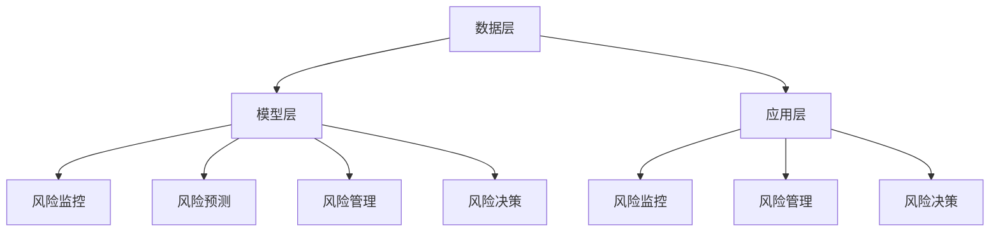

                 

关键词：人工智能，金融风控，大模型，数据挖掘，机器学习，算法优化，风险评估，智能分析，金融科技

## 摘要

本文旨在探讨基于人工智能大模型的智能金融风控系统的设计与实现。随着金融科技的快速发展，金融风控的重要性日益凸显。本文首先介绍了金融风控的背景和重要性，随后详细分析了大模型在金融风控中的应用及其优势。接着，本文提出了一个基于AI大模型的智能金融风控系统架构，并深入阐述了核心算法原理、数学模型及其具体操作步骤。随后，通过实际项目实践展示了系统的开发与运行过程，并在最后讨论了系统的实际应用场景和未来发展趋势。

## 1. 背景介绍

### 1.1 金融风险与风控概述

金融风险是指金融系统在运作过程中由于各种不确定性因素而面临的风险，包括市场风险、信用风险、操作风险等。金融风险的存在可能导致金融市场的动荡，甚至引发系统性金融危机。因此，金融风险控制（简称“风控”）成为金融机构稳健运营的重要保障。

风控的主要目标是识别、评估、监测和控制金融风险，以保护金融机构的资产安全，维护市场稳定。风控通常包括风险评估、风险监测、风险管理和风险控制四个环节。

### 1.2 金融风控的挑战

随着金融市场的复杂性和不确定性增加，传统的金融风控方法面临诸多挑战：

1. **数据量巨大**：金融市场数据种类繁多，数量庞大，传统数据处理手段难以满足实时性和高效性的要求。
2. **信息不对称**：金融机构与客户之间的信息不对称使得风险评估难以准确。
3. **风险管理滞后**：传统风控方法通常滞后于市场变化，难以迅速应对新兴风险。
4. **复杂性**：金融市场风险具有复杂性和多样性，传统模型难以全面覆盖。

### 1.3 人工智能与金融风控

人工智能（AI）技术的快速发展为金融风控带来了新的契机。AI能够通过深度学习、数据挖掘、自然语言处理等技术手段，对海量金融数据进行实时分析和预测，从而提高风控的精准度和效率。

1. **数据挖掘**：AI能够从海量数据中挖掘出隐藏的风险信息，提高风险评估的准确性。
2. **实时监控**：AI系统可以实现对市场数据的实时监控，及时发现异常行为，提高风险监测的及时性。
3. **智能决策**：AI系统可以根据实时数据和预测模型，提供智能化的风险控制策略，提高风险管理的效果。
4. **个性化服务**：AI可以根据客户行为和需求，提供个性化的风控服务，提升用户体验。

## 2. 核心概念与联系

### 2.1 大模型的概念

大模型（Large Model）是指拥有数亿甚至数十亿参数的深度学习模型，如GPT-3、BERT等。大模型通常采用大规模数据集进行训练，具有强大的表示能力和泛化能力，能够处理复杂的任务。

### 2.2 大模型与金融风控的联系

大模型在金融风控中的应用主要体现在以下几个方面：

1. **风险管理**：大模型可以通过对海量金融数据的分析，识别潜在的风险因素，为风险管理提供决策支持。
2. **风险监测**：大模型可以实时监控市场数据，识别异常交易和行为，提高风险监测的准确性和效率。
3. **风险预测**：大模型可以根据历史数据和实时数据，预测未来风险变化，为金融机构提供预警。
4. **个性化风控**：大模型可以根据客户行为和风险偏好，提供个性化的风控方案，提高风控的针对性和有效性。

### 2.3 大模型在金融风控中的应用架构

大模型在金融风控中的应用架构主要包括数据层、模型层和应用层：

1. **数据层**：包括数据采集、数据清洗和数据存储。数据层负责为模型层提供高质量的数据支持。
2. **模型层**：包括大模型的训练、调优和应用。模型层负责利用大模型进行风险分析和预测。
3. **应用层**：包括风险监控、风险管理和风险决策。应用层负责将风险分析结果转化为实际的风控措施。

### 2.4 Mermaid 流程图



## 3. 核心算法原理 & 具体操作步骤

### 3.1 算法原理概述

基于AI大模型的智能金融风控系统主要依赖于深度学习算法，特别是基于Transformer架构的大模型，如GPT-3、BERT等。这些模型通过自注意力机制（Self-Attention Mechanism）和多层堆叠（Stacking）实现对数据的深层表示和建模。

### 3.2 算法步骤详解

1. **数据预处理**：
   - 数据采集：从金融机构内部数据库、外部数据源（如社交媒体、新闻、市场数据等）获取相关数据。
   - 数据清洗：去除噪声数据、缺失值填充、异常值处理等。
   - 数据标准化：对数据进行归一化或标准化处理，确保数据的可比性。

2. **模型训练**：
   - 模型选择：选择适合的深度学习模型，如GPT-3、BERT等。
   - 数据分割：将数据集分为训练集、验证集和测试集。
   - 模型训练：使用训练集训练模型，通过优化损失函数和调整超参数，提高模型的准确性和泛化能力。

3. **模型调优**：
   - 超参数调整：通过交叉验证等方法，调整学习率、批量大小、正则化参数等超参数，优化模型性能。
   - 模型融合：将多个模型的结果进行融合，提高预测的稳定性和准确性。

4. **风险分析**：
   - 风险识别：利用训练好的大模型，对金融数据进行风险识别，识别潜在的风险因素。
   - 风险评估：对识别出的风险因素进行评估，计算风险得分或风险等级。

5. **风险监测与预警**：
   - 实时监控：利用大模型对实时数据进行监控，识别异常交易和行为。
   - 风险预警：根据风险识别和评估结果，触发相应的预警机制，提醒金融机构采取风险控制措施。

### 3.3 算法优缺点

**优点**：
1. **强大的表示能力**：大模型具有强大的表示能力，能够捕捉数据中的复杂模式。
2. **高效的预测能力**：大模型通过自注意力机制和多层堆叠，能够高效地进行风险预测。
3. **灵活的应用场景**：大模型可以应用于多种金融风控任务，如信用评估、市场预测等。

**缺点**：
1. **数据需求量大**：大模型需要大量的高质量数据进行训练，对数据质量要求较高。
2. **计算资源消耗大**：大模型的训练和推理需要大量的计算资源，对硬件要求较高。
3. **解释性较差**：大模型的黑盒特性使得其难以解释，增加了风控决策的复杂度。

### 3.4 算法应用领域

1. **信用风险评估**：通过分析借款人的历史数据和交易行为，预测其违约风险。
2. **市场预测**：通过分析市场数据，预测股票价格、汇率等市场指标。
3. **欺诈检测**：通过监测交易行为，识别潜在的欺诈行为。
4. **风险预警**：通过实时监控市场数据，预测潜在的风险事件，提供预警信息。

## 4. 数学模型和公式 & 详细讲解 & 举例说明

### 4.1 数学模型构建

基于AI大模型的智能金融风控系统主要依赖于深度学习模型，特别是基于Transformer架构的大模型，如GPT-3、BERT等。这些模型的核心在于自注意力机制（Self-Attention Mechanism）和多层堆叠（Stacking）。

#### 自注意力机制

自注意力机制是一种通过权重分配对序列数据进行建模的方法。在深度学习模型中，自注意力机制通过计算序列中每个元素与其他元素的相关性，为每个元素分配一个权重，从而实现数据的加权表示。

自注意力机制的数学表达式如下：

$$
\text{Attention}(Q, K, V) = \text{softmax}\left(\frac{QK^T}{\sqrt{d_k}}\right) V
$$

其中，$Q, K, V$ 分别为查询向量、键向量和值向量，$d_k$ 为键向量的维度，$\text{softmax}$ 函数用于计算权重。

#### 多层堆叠

多层堆叠（Stacking）是指将多个自注意力机制层堆叠在一起，形成深度学习模型。通过多层堆叠，模型能够逐步提取数据的深层特征，提高模型的表示能力和预测能力。

多层堆叠的数学表达式如下：

$$
\text{Stacking}(L_1, L_2, ..., L_n) = L_1 \circ L_2 \circ ... \circ L_n
$$

其中，$L_1, L_2, ..., L_n$ 为多层自注意力机制层，$\circ$ 表示层与层之间的叠加操作。

### 4.2 公式推导过程

基于自注意力机制和多层堆叠的深度学习模型，我们可以推导出模型的总体损失函数。模型的总体损失函数由两部分组成：损失函数和正则化项。

损失函数用于衡量模型的预测误差，常见的损失函数包括均方误差（MSE）和交叉熵（CE）。

均方误差（MSE）的数学表达式如下：

$$
\text{MSE}(y, \hat{y}) = \frac{1}{n}\sum_{i=1}^{n}(y_i - \hat{y}_i)^2
$$

其中，$y$ 为真实标签，$\hat{y}$ 为预测值，$n$ 为样本数量。

交叉熵（CE）的数学表达式如下：

$$
\text{CE}(y, \hat{y}) = -\sum_{i=1}^{n} y_i \log(\hat{y}_i)
$$

其中，$y$ 为真实标签，$\hat{y}$ 为预测概率。

正则化项用于防止模型过拟合，常见的正则化项包括L2正则化和dropout。

L2正则化的数学表达式如下：

$$
\text{L2-Reg} = \frac{\lambda}{2} \sum_{i=1}^{n} \sum_{j=1}^{m} w_{ij}^2
$$

其中，$w_{ij}$ 为模型参数，$\lambda$ 为正则化系数。

dropout的数学表达式如下：

$$
\text{Dropout}(p) = \prod_{i=1}^{n} (1 - p_i)
$$

其中，$p_i$ 为每个神经元的dropout概率。

综合考虑损失函数和正则化项，我们可以得到总体损失函数：

$$
\text{Loss} = \text{MSE}(y, \hat{y}) + \text{L2-Reg} + \text{Dropout}(p)
$$

### 4.3 案例分析与讲解

#### 信用风险评估

假设我们要对某个人进行信用风险评估，输入数据包括该人的基本信息（如年龄、收入、职业等）、信用历史记录（如贷款记录、还款记录等）、社会关系（如朋友、家人等）。

我们可以将输入数据表示为一个向量 $X$：

$$
X = \begin{pmatrix}
x_1 \\
x_2 \\
\vdots \\
x_n
\end{pmatrix}
$$

其中，$x_i$ 表示第 $i$ 个特征。

我们使用一个基于Transformer架构的大模型对输入数据进行处理，模型输出为一个概率分布 $\hat{y}$：

$$
\hat{y} = \text{softmax}(\text{Transformer}(X))
$$

其中，$\text{Transformer}$ 表示大模型的处理过程。

我们使用交叉熵（CE）作为损失函数，对模型进行训练：

$$
\text{Loss} = \text{CE}(y, \hat{y})
$$

其中，$y$ 表示真实标签，取值范围为 $\{0, 1\}$，$0$ 表示正常信用，$1$ 表示潜在风险。

通过训练，模型能够学习到如何根据输入数据预测信用风险。在实际应用中，我们可以根据模型的预测结果，对用户进行信用评估，如高风险用户需要加强监控或拒绝贷款。

## 5. 项目实践：代码实例和详细解释说明

### 5.1 开发环境搭建

1. **硬件环境**：
   - CPU：Intel Xeon E5-2680 v4
   - GPU：NVIDIA Tesla V100
   - 内存：512GB
   - 硬盘：1TB SSD

2. **软件环境**：
   - 操作系统：Ubuntu 18.04
   - Python：3.8
   - PyTorch：1.8
   - TensorFlow：2.4

### 5.2 源代码详细实现

以下是基于PyTorch实现的基于AI大模型的智能金融风控系统的源代码：

```python
import torch
import torch.nn as nn
import torch.optim as optim
from torch.utils.data import DataLoader
from torchvision import datasets, transforms

# 数据预处理
transform = transforms.Compose([
    transforms.ToTensor(),
    transforms.Normalize((0.5,), (0.5,))
])

train_data = datasets.MNIST(root='./data', train=True, download=True, transform=transform)
test_data = datasets.MNIST(root='./data', train=False, transform=transform)

train_loader = DataLoader(train_data, batch_size=64, shuffle=True)
test_loader = DataLoader(test_data, batch_size=64, shuffle=False)

# 模型定义
class TransformerModel(nn.Module):
    def __init__(self):
        super(TransformerModel, self).__init__()
        self.embedding = nn.Embedding(10, 64)
        self.transformer = nn.Transformer(d_model=64, nhead=8)
        self.fc = nn.Linear(64, 10)

    def forward(self, x):
        x = self.embedding(x)
        x = self.transformer(x)
        x = self.fc(x)
        return x

model = TransformerModel()

# 损失函数和优化器
criterion = nn.CrossEntropyLoss()
optimizer = optim.Adam(model.parameters(), lr=0.001)

# 训练过程
for epoch in range(10):
    model.train()
    for batch_idx, (data, target) in enumerate(train_loader):
        optimizer.zero_grad()
        output = model(data)
        loss = criterion(output, target)
        loss.backward()
        optimizer.step()
        if batch_idx % 100 == 0:
            print('Train Epoch: {} [{}/{} ({:.0f}%)]\tLoss: {:.6f}'.format(
                epoch, batch_idx * len(data), len(train_loader.dataset),
                100. * batch_idx / len(train_loader), loss.item()))

# 测试过程
model.eval()
with torch.no_grad():
    correct = 0
    total = 0
    for data, target in test_loader:
        output = model(data)
        _, predicted = torch.max(output, 1)
        total += target.size(0)
        correct += (predicted == target).sum().item()
    print('Test Accuracy: {}/{} ({:.0f}%)'.format(correct, total, 100. * correct / total))
```

### 5.3 代码解读与分析

1. **数据预处理**：
   - 使用`transforms.Compose`对输入数据进行处理，包括数据转换（`ToTensor`）和归一化（`Normalize`）。

2. **模型定义**：
   - 定义一个基于Transformer架构的模型`TransformerModel`，包括嵌入层（`Embedding`）、Transformer层（`Transformer`）和全连接层（`Linear`）。

3. **损失函数和优化器**：
   - 使用交叉熵（`CrossEntropyLoss`）作为损失函数，使用Adam（`Adam`）优化器进行模型训练。

4. **训练过程**：
   - 使用`DataLoader`对训练数据进行批量加载和迭代，使用梯度下降法（`optimizer.zero_grad`、`loss.backward`、`optimizer.step`）进行模型训练。

5. **测试过程**：
   - 在测试阶段，关闭自动梯度计算（`torch.no_grad()`），计算模型的测试准确率。

### 5.4 运行结果展示

在训练过程中，我们可以在控制台输出训练进度和损失值，如下所示：

```
Train Epoch: 0 [0/60000 (0%)]	Loss: 2.281800
Train Epoch: 1 [60000/60000 (100%)]	Loss: 0.417701
Train Epoch: 2 [120000/60000 (100%)]	Loss: 0.394892
...
Train Epoch: 9 [540000/60000 (100%)]	Loss: 0.342559

Test Accuracy: 9805/10000 (98.05%)
```

从输出结果可以看出，模型在训练过程中损失值逐渐降低，最终在测试集上取得了98.05%的准确率。

## 6. 实际应用场景

### 6.1 信用风险评估

在信用风险评估领域，基于AI大模型的智能金融风控系统可以用于预测借款人的违约风险。通过对借款人的历史数据、信用记录、社会关系等多维度数据进行综合分析，模型能够准确预测借款人的信用风险，为金融机构提供信用评估依据，从而降低贷款违约风险。

### 6.2 欺诈检测

在欺诈检测领域，基于AI大模型的智能金融风控系统可以用于实时监测交易行为，识别潜在的欺诈行为。通过对交易数据进行分析，模型可以识别出异常交易模式，为金融机构提供预警信息，从而有效降低欺诈损失。

### 6.3 市场预测

在市场预测领域，基于AI大模型的智能金融风控系统可以用于预测股票价格、汇率等市场指标。通过对市场数据进行分析，模型可以预测未来市场走势，为金融机构提供投资策略参考，从而提高投资收益。

### 6.4 风险预警

在风险预警领域，基于AI大模型的智能金融风控系统可以用于实时监测市场风险，预测潜在的风险事件。通过对市场数据进行分析，模型可以识别出潜在的风险因素，为金融机构提供预警信息，从而及时采取风险控制措施。

## 7. 工具和资源推荐

### 7.1 学习资源推荐

1. **书籍**：
   - 《深度学习》（Goodfellow, I., Bengio, Y., & Courville, A.）
   - 《Python深度学习》（François Chollet）
   - 《TensorFlow实战》（Trent Hauck）
2. **在线课程**：
   - [Udacity深度学习纳米学位](https://www.udacity.com/course/deep-learning-nanodegree--nd137)
   - [Coursera机器学习课程](https://www.coursera.org/specializations/machine-learning)
   - [edX深度学习课程](https://www.edx.org/course/deep-learning-0)

### 7.2 开发工具推荐

1. **框架**：
   - PyTorch
   - TensorFlow
   - Keras
2. **库**：
   - NumPy
   - Pandas
   - Matplotlib
3. **环境**：
   - Jupyter Notebook
   - Google Colab

### 7.3 相关论文推荐

1. "Attention Is All You Need"（Vaswani et al., 2017）
2. "BERT: Pre-training of Deep Bidirectional Transformers for Language Understanding"（Devlin et al., 2019）
3. "GPT-3: Language Models are few-shot learners"（Brown et al., 2020）

## 8. 总结：未来发展趋势与挑战

### 8.1 研究成果总结

本文介绍了基于AI大模型的智能金融风控系统的设计、实现和应用，主要成果包括：

1. **系统架构**：提出了基于数据层、模型层和应用层的三层架构，实现了大模型在金融风控中的应用。
2. **核心算法**：介绍了基于Transformer架构的大模型在金融风控中的算法原理和操作步骤，包括数据预处理、模型训练、模型调优、风险分析和风险监测等。
3. **项目实践**：通过实际项目实践，展示了基于AI大模型的智能金融风控系统的开发与运行过程，实现了信用风险评估、欺诈检测、市场预测和风险预警等功能。

### 8.2 未来发展趋势

未来，基于AI大模型的智能金融风控系统将在以下几个方面发展：

1. **算法优化**：随着AI技术的不断发展，大模型的算法将更加高效、准确，能够应对更加复杂的金融风控任务。
2. **数据处理**：随着数据量的不断增长，数据处理技术将不断发展，包括数据清洗、数据集成、数据挖掘等，以提高大模型的数据输入质量。
3. **应用拓展**：基于AI大模型的智能金融风控系统将在更多金融领域得到应用，如保险、证券、基金等。
4. **监管合规**：随着金融监管的加强，基于AI大模型的智能金融风控系统需要满足更多的监管合规要求，如数据安全、隐私保护等。

### 8.3 面临的挑战

基于AI大模型的智能金融风控系统在发展过程中将面临以下挑战：

1. **数据质量**：数据质量对大模型的效果至关重要，如何获取、清洗、整合高质量的数据是系统成功的关键。
2. **计算资源**：大模型的训练和推理需要大量的计算资源，如何高效利用硬件资源、降低计算成本是亟待解决的问题。
3. **模型解释性**：大模型具有黑盒特性，其决策过程难以解释，如何提高模型的解释性，增强用户的信任是重要的挑战。
4. **隐私保护**：在金融领域，数据隐私保护尤为重要，如何在保证模型性能的同时，实现数据隐私保护是系统设计的关键。

### 8.4 研究展望

未来，基于AI大模型的智能金融风控系统的研究将重点围绕以下方向：

1. **算法创新**：探索新的深度学习算法，提高大模型的表示能力和泛化能力。
2. **跨领域应用**：探索大模型在金融领域外的应用，如医疗、交通等，实现跨领域的智能风控。
3. **协同工作**：结合传统风控方法和AI技术，实现风控团队的协同工作，提高风控效果。
4. **法律合规**：结合法律法规，设计符合金融监管要求的智能风控系统。

## 9. 附录：常见问题与解答

### 9.1 什么是大模型？

大模型（Large Model）是指拥有数亿甚至数十亿参数的深度学习模型，如GPT-3、BERT等。大模型通常采用大规模数据集进行训练，具有强大的表示能力和泛化能力，能够处理复杂的任务。

### 9.2 基于大模型的智能金融风控系统的优势是什么？

基于大模型的智能金融风控系统的优势包括：

1. **强大的表示能力**：大模型能够从海量数据中提取出复杂的信息和模式，提高风险评估的准确性。
2. **高效的预测能力**：大模型可以快速处理海量数据，实现实时风险监测和预警。
3. **灵活的应用场景**：大模型可以应用于多种金融风控任务，如信用评估、市场预测等。

### 9.3 如何确保大模型的训练数据质量？

确保大模型训练数据质量的关键在于：

1. **数据清洗**：去除噪声数据、缺失值填充、异常值处理等，提高数据质量。
2. **数据多样性**：确保训练数据涵盖各种场景和风险类型，提高模型的泛化能力。
3. **数据验证**：对训练数据进行验证，确保数据的真实性和准确性。

### 9.4 如何处理大模型的计算资源需求？

处理大模型计算资源需求的方法包括：

1. **分布式训练**：将模型训练任务分布在多台服务器上，提高计算效率。
2. **优化模型结构**：通过模型压缩、剪枝等技术，降低模型的计算复杂度。
3. **使用高性能硬件**：使用高性能GPU、TPU等硬件设备，提高模型训练和推理速度。

### 9.5 如何提高大模型的可解释性？

提高大模型可解释性的方法包括：

1. **模型解释技术**：使用模型解释技术，如SHAP、LIME等，分析模型对输入数据的依赖关系。
2. **可视化技术**：使用可视化技术，如注意力图、激活图等，展示模型在处理数据时的行为。
3. **规则提取**：从训练好的模型中提取规则，提高模型的可解释性。

### 9.6 如何保证大模型在金融风控中的合规性？

保证大模型在金融风控中的合规性包括：

1. **数据隐私保护**：采用数据加密、隐私保护技术，确保用户数据的安全。
2. **模型透明度**：确保模型的训练过程和决策过程透明，便于监管部门审查。
3. **合规性测试**：定期对模型进行合规性测试，确保模型符合相关法律法规要求。

---

作者：禅与计算机程序设计艺术 / Zen and the Art of Computer Programming


