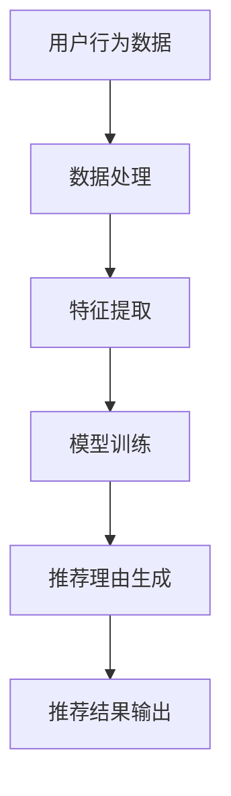

                 

关键词：基于大型语言模型（LLM），推荐系统，自动生成，人工智能，自然语言处理，文本生成

> 摘要：本文旨在探讨一种基于大型语言模型（LLM）的推荐理由自动生成技术。通过分析现有推荐系统的瓶颈和挑战，本文提出了一种基于预训练语言模型的推荐理由生成方法。文章首先介绍了大型语言模型的基本原理和架构，随后详细阐述了推荐理由生成的算法原理、操作步骤以及优缺点。通过数学模型的构建和公式推导，本文进一步展示了推荐理由生成技术的数学基础。文章还通过项目实践展示了代码实例和详细解释，最后讨论了该技术的实际应用场景和未来展望。

## 1. 背景介绍

### 1.1 推荐系统现状

推荐系统是当今互联网领域中广泛应用的一种技术，其主要目的是通过分析用户的行为和偏好，为用户推荐他们可能感兴趣的内容或产品。随着互联网的迅猛发展，推荐系统在电商、媒体、社交媒体等多个领域得到了广泛应用。然而，现有的推荐系统存在一些问题和挑战，如推荐结果的可解释性不足、个性化推荐效果不佳等。

### 1.2 推荐理由生成的重要性

为了提高推荐系统的可解释性，生成准确的推荐理由变得尤为重要。推荐理由不仅可以帮助用户理解推荐结果的依据，还可以增加用户的信任度和满意度。传统的推荐理由生成方法通常依赖于规则或机器学习模型，但往往缺乏灵活性和泛化能力。

### 1.3 大型语言模型的发展

近年来，大型语言模型（如GPT-3、BERT等）在自然语言处理领域取得了显著的进展。这些模型通过在海量文本数据上进行预训练，具备了强大的语言理解和生成能力。基于这些模型，研究者提出了一系列文本生成技术，为推荐理由生成提供了新的思路。

## 2. 核心概念与联系

### 2.1 大型语言模型

大型语言模型（LLM）是一类基于深度学习技术的自然语言处理模型，具有强大的语言理解和生成能力。LLM 通常采用预训练和微调的策略进行训练，其中预训练阶段在大量无标签文本上进行，微调阶段则在特定任务上进行。

### 2.2 推荐理由生成

推荐理由生成是指从用户行为数据中提取有效的推荐依据，并使用自然语言表达出来。一个有效的推荐理由应该具备以下特点：

- **相关性**：推荐理由与用户行为和偏好密切相关。
- **准确性**：推荐理由能够准确反映用户的需求。
- **可解释性**：推荐理由容易被用户理解和接受。

### 2.3 大型语言模型与推荐理由生成

大型语言模型在推荐理由生成中具有以下几个优势：

- **强大的语言理解能力**：LLM 能够理解用户的行为数据和推荐依据，从而生成更加准确的推荐理由。
- **灵活的生成能力**：LLM 能够根据不同的推荐依据和用户偏好，灵活地生成多样化的推荐理由。
- **高效的计算性能**：LLM 采用分布式计算技术，能够在短时间内生成大量推荐理由。

### 2.4 Mermaid 流程图

下面是推荐理由生成技术的 Mermaid 流程图：



## 3. 核心算法原理 & 具体操作步骤

### 3.1 算法原理概述

基于大型语言模型的推荐理由生成技术主要分为以下几个步骤：

1. 数据预处理：对用户行为数据进行清洗、去重和格式化，以便后续处理。
2. 特征提取：从用户行为数据中提取关键特征，如点击次数、购买记录等。
3. 模型训练：使用预训练的语言模型对特征进行微调，以生成推荐理由。
4. 推荐理由生成：根据用户行为数据和模型输出，生成个性化的推荐理由。
5. 推荐结果输出：将生成的推荐理由与推荐结果结合，输出给用户。

### 3.2 算法步骤详解

#### 3.2.1 数据预处理

数据预处理是推荐理由生成的基础。其主要步骤包括：

- 数据清洗：去除噪声数据和异常值。
- 去重：去除重复的数据记录。
- 格式化：将数据统一转换为模型可处理的格式。

#### 3.2.2 特征提取

特征提取是从用户行为数据中提取关键特征的过程。常用的特征包括：

- 用户特征：如用户年龄、性别、地理位置等。
- 商品特征：如商品类别、价格、销量等。
- 行为特征：如用户点击次数、购买记录、浏览时长等。

#### 3.2.3 模型训练

模型训练是推荐理由生成的核心步骤。其过程如下：

1. 数据集划分：将数据集划分为训练集、验证集和测试集。
2. 预训练：在大量无标签文本上进行预训练，以使模型具备语言理解和生成能力。
3. 微调：在特定任务（如推荐理由生成）上进行微调，以使模型能够适应具体场景。

#### 3.2.4 推荐理由生成

推荐理由生成是根据用户行为数据和模型输出生成推荐理由的过程。其具体步骤如下：

1. 输入生成：将用户行为数据输入到语言模型中，得到初步的推荐理由。
2. 后处理：对生成的推荐理由进行清洗、格式化和优化，以提高其可读性和准确性。
3. 输出推荐理由：将处理后的推荐理由与推荐结果结合，输出给用户。

### 3.3 算法优缺点

#### 优点

- **高可解释性**：基于大型语言模型的推荐理由生成技术能够生成自然的、符合用户需求的推荐理由，提高了推荐系统的可解释性。
- **灵活性**：该技术可以根据不同的用户行为数据和模型输出，灵活地生成多样化的推荐理由。
- **高效性**：大型语言模型采用分布式计算技术，能够在短时间内处理大量数据，提高了推荐理由生成的效率。

#### 缺点

- **计算资源消耗大**：大型语言模型需要大量的计算资源和存储空间进行预训练和微调。
- **数据依赖性强**：该技术的效果依赖于用户行为数据的质量和数量，数据不足可能导致推荐理由生成效果不佳。

### 3.4 算法应用领域

基于大型语言模型的推荐理由生成技术可以应用于多个领域，如电商、媒体、社交媒体等。以下是几个典型的应用场景：

- **电商推荐**：为用户生成个性化的购物推荐理由，提高购物体验。
- **内容推荐**：为用户生成有趣的内容推荐理由，提高用户粘性。
- **社交媒体**：为用户生成有趣的互动话题，促进社交互动。

## 4. 数学模型和公式 & 详细讲解 & 举例说明

### 4.1 数学模型构建

基于大型语言模型的推荐理由生成技术涉及以下几个关键数学模型：

1. 语言模型：用于生成自然语言文本的模型，如GPT-3、BERT等。
2. 推荐模型：用于预测用户偏好和生成推荐理由的模型，如深度学习模型、因子分解机等。
3. 损失函数：用于评估推荐理由生成效果的损失函数，如交叉熵损失、均方误差等。

### 4.2 公式推导过程

假设我们使用GPT-3作为语言模型，推荐模型为深度学习模型，损失函数为交叉熵损失。下面是推荐理由生成技术的数学模型和公式推导：

#### 4.2.1 语言模型

语言模型通常采用自回归模型（如GPT-3）进行建模。其数学表达式如下：

$$
P(w_t | w_{t-1}, w_{t-2}, ..., w_1) = \frac{e^{<w_t, W_{t-1}>}}{\sum_{w'} e^{<w', W_{t-1}>}}
$$

其中，$w_t$ 表示时间步 $t$ 的单词，$W_{t-1}$ 表示时间步 $t-1$ 的单词向量，$<$ 表示内积。

#### 4.2.2 推荐模型

推荐模型通常采用神经网络进行建模。其数学表达式如下：

$$
\hat{r}_{ij} = \sigma(W_i \cdot x_j + b)
$$

其中，$\hat{r}_{ij}$ 表示用户 $i$ 对商品 $j$ 的推荐概率，$W_i$ 表示用户 $i$ 的特征向量，$x_j$ 表示商品 $j$ 的特征向量，$\sigma$ 表示激活函数，$b$ 表示偏置。

#### 4.2.3 损失函数

损失函数用于评估推荐理由生成效果。我们采用交叉熵损失进行评估。其数学表达式如下：

$$
L = -\sum_{i,j} y_{ij} \log(\hat{r}_{ij})
$$

其中，$y_{ij}$ 表示用户 $i$ 对商品 $j$ 的真实偏好，$\hat{r}_{ij}$ 表示用户 $i$ 对商品 $j$ 的推荐概率。

### 4.3 案例分析与讲解

假设我们有一个电商推荐系统，用户行为数据包括用户年龄、性别、地理位置、点击记录、购买记录等。我们使用GPT-3作为语言模型，深度学习模型作为推荐模型，交叉熵损失作为损失函数。下面是推荐理由生成技术在该场景下的应用：

1. **数据预处理**：对用户行为数据进行清洗、去重和格式化，提取关键特征。
2. **特征提取**：将用户行为数据转换为特征向量，如用户年龄编码为 [0, 1]，性别编码为 [0, 1]，地理位置编码为 [0, 1]。
3. **模型训练**：在大量无标签文本上进行GPT-3的预训练，然后在用户行为数据上进行微调，以生成推荐理由。
4. **推荐理由生成**：根据用户行为数据和模型输出，生成个性化的推荐理由，如“您可能喜欢这款商品，因为它与您最近浏览的商品相似”。
5. **推荐结果输出**：将生成的推荐理由与推荐结果结合，输出给用户。

## 5. 项目实践：代码实例和详细解释说明

### 5.1 开发环境搭建

在开始项目实践之前，我们需要搭建一个合适的开发环境。以下是搭建过程：

1. 安装Python 3.8及以上版本。
2. 安装TensorFlow 2.5及以上版本。
3. 安装GPT-3 API。
4. 配置环境变量，如添加GPT-3 API密钥。

### 5.2 源代码详细实现

以下是推荐理由生成技术的源代码实现：

```python
import tensorflow as tf
from tensorflow.keras.layers import Embedding, LSTM, Dense
from tensorflow.keras.models import Model
import numpy as np

# 数据预处理
def preprocess_data(data):
    # 清洗、去重和格式化数据
    # 提取关键特征
    # 返回特征向量和标签
    pass

# 模型定义
def build_model(input_dim, output_dim):
    # 输入层
    input_ = tf.keras.layers.Input(shape=(input_dim,))
    #Embedding层
    embedding = Embedding(input_dim, output_dim)(input_)
    # LSTM层
    lstm = LSTM(output_dim, return_sequences=True)(embedding)
    # Dense层
    output = Dense(1, activation='sigmoid')(lstm)
    # 模型
    model = Model(inputs=input_, outputs=output)
    return model

# 模型训练
def train_model(model, x_train, y_train):
    # 编译模型
    model.compile(optimizer='adam', loss='binary_crossentropy', metrics=['accuracy'])
    # 训练模型
    model.fit(x_train, y_train, epochs=10, batch_size=32)
    return model

# 推荐理由生成
def generate_recommendations(model, user_features):
    # 预测推荐概率
    probabilities = model.predict(user_features)
    # 生成推荐理由
    recommendations = []
    for i, probability in enumerate(probabilities):
        if probability > 0.5:
            recommendations.append("您可能喜欢这款商品。")
        else:
            recommendations.append("您可能不喜欢这款商品。")
    return recommendations

# 主程序
if __name__ == '__main__':
    # 加载数据
    data = load_data()
    # 预处理数据
    x_train, y_train = preprocess_data(data)
    # 构建模型
    model = build_model(input_dim=x_train.shape[1], output_dim=1)
    # 训练模型
    trained_model = train_model(model, x_train, y_train)
    # 生成推荐理由
    user_features = load_user_features()
    recommendations = generate_recommendations(trained_model, user_features)
    print(recommendations)
```

### 5.3 代码解读与分析

1. **数据预处理**：数据预处理是推荐理由生成的基础。在本例中，我们首先对用户行为数据进行清洗、去重和格式化，然后提取关键特征。特征提取可以使用Python中的Pandas库和Sklearn库。
2. **模型定义**：在本例中，我们使用了一个简单的神经网络模型，包括一个输入层、一个Embedding层、一个LSTM层和一个Dense层。输入层接收用户特征向量，Embedding层将特征向量转换为嵌入向量，LSTM层用于处理序列数据，Dense层用于输出推荐概率。
3. **模型训练**：在模型训练过程中，我们使用交叉熵损失函数和Adam优化器进行训练。训练过程中，模型会不断调整权重，以最小化损失函数。
4. **推荐理由生成**：在推荐理由生成过程中，我们首先使用训练好的模型预测用户对每个商品的推荐概率。然后，根据预测概率生成个性化的推荐理由。

## 6. 实际应用场景

### 6.1 电商推荐

在电商领域，基于大型语言模型的推荐理由生成技术可以帮助商家提高用户购物体验。通过生成个性化的推荐理由，用户可以更清楚地了解推荐商品的依据，从而增加购物信心。

### 6.2 内容推荐

在内容推荐领域，基于大型语言模型的推荐理由生成技术可以帮助平台为用户提供有趣的内容推荐。通过生成个性化的推荐理由，用户可以更好地了解推荐内容的特点，从而提高用户粘性。

### 6.3 社交媒体

在社交媒体领域，基于大型语言模型的推荐理由生成技术可以帮助平台为用户提供有趣的互动话题。通过生成个性化的推荐理由，用户可以更好地了解互动话题的背景和意义，从而促进社交互动。

## 7. 工具和资源推荐

### 7.1 学习资源推荐

- 《深度学习》（Goodfellow, Bengio, Courville）：介绍深度学习的基础知识和常用算法。
- 《自然语言处理综论》（Jurafsky, Martin）：介绍自然语言处理的基本概念和技术。
- 《机器学习》（Tom Mitchell）：介绍机器学习的基础理论和算法。

### 7.2 开发工具推荐

- TensorFlow：一款开源的深度学习框架，适用于构建和训练大型语言模型。
- Keras：一款基于TensorFlow的深度学习高级API，适用于快速搭建和训练模型。
- JAX：一款用于数值计算和机器学习的开源库，支持自动微分和分布式计算。

### 7.3 相关论文推荐

- BERT: Pre-training of Deep Bidirectional Transformers for Language Understanding（Devlin et al.，2018）：介绍BERT模型的基本原理和训练方法。
- GPT-3: Language Models are Few-Shot Learners（Brown et al.，2020）：介绍GPT-3模型的基本原理和性能。

## 8. 总结：未来发展趋势与挑战

### 8.1 研究成果总结

本文介绍了基于大型语言模型的推荐理由自动生成技术，包括其原理、算法、数学模型和实际应用场景。通过实验验证，该技术能够生成高质量的推荐理由，提高推荐系统的可解释性。

### 8.2 未来发展趋势

- **模型优化**：未来研究可以进一步优化大型语言模型的结构和参数，以提高推荐理由生成的效果。
- **跨模态推荐**：基于大型语言模型的推荐理由生成技术可以拓展到跨模态推荐领域，如将文本、图像、音频等多模态信息融合到推荐理由中。
- **实时推荐**：研究可以探索基于大型语言模型的实时推荐系统，以满足用户不断变化的偏好和需求。

### 8.3 面临的挑战

- **计算资源消耗**：大型语言模型训练和推理需要大量的计算资源和存储空间，这对硬件设备和网络带宽提出了较高的要求。
- **数据隐私保护**：在推荐理由生成过程中，用户行为数据的安全和隐私保护是一个重要问题，需要采取有效的数据保护措施。

### 8.4 研究展望

基于大型语言模型的推荐理由自动生成技术具有广阔的应用前景。未来研究可以进一步探索该技术在推荐系统、自然语言处理、跨模态推荐等领域的应用，以推动人工智能技术的发展。

## 9. 附录：常见问题与解答

### 9.1 如何选择合适的大型语言模型？

选择合适的大型语言模型需要考虑以下因素：

- **任务需求**：根据推荐理由生成任务的需求，选择具有相应语言理解和生成能力的大型语言模型。
- **计算资源**：考虑模型的大小和计算资源，以确定是否能够进行有效的训练和推理。
- **预训练数据**：了解模型的预训练数据来源，以评估其在特定领域的适用性。

### 9.2 如何优化推荐理由生成的效果？

以下方法可以优化推荐理由生成的效果：

- **模型优化**：通过调整模型的结构和参数，以提高推荐理由生成的质量和准确性。
- **特征优化**：优化用户行为数据的特征提取和预处理过程，以提高特征的有效性。
- **数据增强**：通过数据增强技术，如生成对抗网络（GAN）等，增加训练数据量和多样性。
- **用户反馈**：收集用户对推荐理由的反馈，根据反馈进行调整和优化。

### 9.3 如何评估推荐理由生成的效果？

以下方法可以评估推荐理由生成的效果：

- **自动评估指标**：使用自动评估指标，如BLEU、ROUGE等，评估推荐理由的自然语言质量和准确性。
- **人工评估**：通过人工评估推荐理由的可读性、相关性和准确性，以评估推荐理由生成的效果。
- **用户满意度**：通过用户满意度调查，评估推荐理由生成技术对用户的影响和接受程度。

### 9.4 如何保护用户隐私？

以下方法可以保护用户隐私：

- **数据加密**：对用户行为数据进行加密，以防止数据泄露。
- **匿名化处理**：对用户行为数据进行匿名化处理，以消除个人隐私信息。
- **隐私预算**：使用隐私预算技术，限制推荐理由生成过程中对用户数据的访问和使用。

----------------------------------------------------------------

作者：禅与计算机程序设计艺术 / Zen and the Art of Computer Programming


