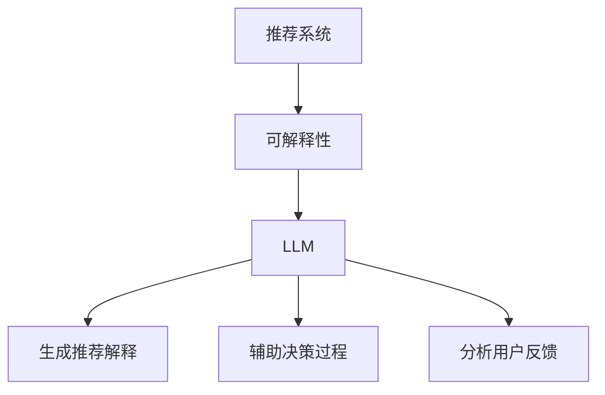

                 

关键词：推荐系统、可解释性、LLM、人工智能、算法优化

> 摘要：本文将探讨如何利用语言模型（LLM）增强推荐系统的可解释性。在介绍推荐系统背景和可解释性的重要性后，我们将深入分析LLM的工作原理，以及如何将LLM应用于推荐系统的可解释性增强。文章还将涵盖核心算法原理、数学模型和公式、项目实践、实际应用场景、未来展望等各个方面，旨在为读者提供全面的了解和实用指南。

## 1. 背景介绍

随着互联网的普及和信息爆炸，推荐系统已经成为许多在线平台的关键组成部分。这些系统通过分析用户的历史行为和偏好，预测用户可能感兴趣的内容，从而提供个性化的推荐。然而，推荐系统的黑箱性质使得用户难以理解推荐的背后逻辑，这引发了可解释性的需求。

可解释性是推荐系统中的一个重要方面，它使得系统能够向用户解释推荐结果的原因，增加用户的信任度。传统的推荐算法通常基于复杂的数学模型和机器学习技术，如协同过滤、基于内容的推荐等。这些算法能够生成高精度的推荐，但其内部机制往往难以被非专业人士理解。

近年来，语言模型（Language Model，简称LLM）在自然语言处理领域取得了显著进展。LLM是一种能够理解和生成自然语言文本的深度学习模型，如GPT（Generative Pre-trained Transformer）和BERT（Bidirectional Encoder Representations from Transformers）。这些模型通过大量语料库的训练，能够捕捉语言中的复杂结构和语义信息。

将LLM应用于推荐系统的可解释性增强，是一个值得探讨的方向。本文将详细讨论如何利用LLM实现推荐系统的可解释性增强，并分析其潜在的应用和挑战。

### 1.1 推荐系统的历史与发展

推荐系统的发展可以追溯到20世纪90年代，当时以协同过滤（Collaborative Filtering）算法为代表。协同过滤分为基于用户的协同过滤和基于项目的协同过滤，前者通过分析用户之间的相似度推荐相似用户喜欢的项目，后者则通过分析项目之间的相似度推荐给用户。协同过滤算法简单、易于实现，但在数据稀疏的情况下效果不佳。

随着互联网和电子商务的快速发展，推荐系统逐渐引入了基于内容的推荐（Content-based Filtering）。基于内容的推荐通过分析用户对项目的偏好和项目的特征，生成个性化的推荐列表。这种方法对数据稀疏性问题有一定缓解，但在推荐多样性方面存在不足。

近年来，随着深度学习技术的崛起，推荐系统开始应用基于模型的推荐方法，如矩阵分解、图神经网络等。这些方法通过构建复杂的模型结构，提高了推荐的精度和多样性。然而，这些方法往往也伴随着较高的计算复杂度和黑箱性质。

### 1.2 可解释性的重要性

推荐系统的可解释性是指系统能够向用户清晰地解释推荐结果背后的原因和逻辑。可解释性在多个层面上具有重要意义：

1. **用户信任**：当用户无法理解推荐系统的决策过程时，可能会对推荐结果产生怀疑，降低对系统的信任度。可解释性能够增强用户对推荐系统的信任，提高用户满意度。

2. **监管合规**：在许多领域，如金融、医疗等，推荐系统需要符合特定的法律法规。可解释性有助于证明系统决策的合法性和合规性，减少潜在的法律风险。

3. **反馈和改进**：可解释性使得用户能够提供更有针对性的反馈，帮助系统改进推荐策略。通过理解推荐原因，用户可以更好地表达自己的偏好，从而提高系统的个性化水平。

4. **技术透明**：随着人工智能技术的发展，推荐系统的黑箱性质越来越受到关注。可解释性能够提高系统的透明度，促进技术的普及和应用。

### 1.3 LLM的兴起与前景

语言模型（LLM）的兴起是自然语言处理领域的一大突破。LLM通过训练大量文本数据，能够捕捉到语言中的复杂结构和语义信息，从而在文本生成、机器翻译、情感分析等领域取得了显著成果。

在推荐系统领域，LLM的应用前景广阔。首先，LLM可以用于生成推荐解释文本，帮助用户理解推荐结果的原因。其次，LLM可以辅助构建推荐算法的决策过程，提高系统的可解释性。此外，LLM还可以用于分析用户反馈，优化推荐策略。

总的来说，LLM的兴起为推荐系统的可解释性增强提供了新的思路和方法，有望进一步提升推荐系统的性能和用户体验。

## 2. 核心概念与联系

在本章节中，我们将深入探讨推荐系统、可解释性以及LLM这三个核心概念，并展示它们之间的联系。

### 2.1 推荐系统

推荐系统是一种信息过滤技术，旨在预测用户可能感兴趣的内容，并向其提供个性化的推荐。推荐系统的核心是推荐算法，这些算法通常基于用户历史行为、项目特征、协同过滤、基于内容的推荐、矩阵分解、图神经网络等。

#### 推荐系统的基本架构

推荐系统通常由以下几个关键组件构成：

1. **用户行为数据收集**：包括用户的浏览、点击、购买等行为数据。
2. **项目特征提取**：对项目进行特征提取，如文本内容、标签、评分等。
3. **推荐算法**：根据用户行为和项目特征生成推荐列表。
4. **推荐结果展示**：将推荐结果呈现给用户。

#### 推荐系统的算法分类

推荐系统的算法主要分为以下几类：

1. **基于用户的协同过滤**：通过分析用户之间的相似度，推荐给用户其他相似用户喜欢的项目。
2. **基于内容的推荐**：通过分析用户对项目的偏好和项目的特征，生成个性化的推荐列表。
3. **基于模型的推荐**：利用深度学习、矩阵分解、图神经网络等方法构建推荐模型。

### 2.2 可解释性

可解释性是指推荐系统能够向用户清晰地解释推荐结果的原因和逻辑。可解释性是推荐系统的重要特性之一，它对于提升用户信任、确保系统合规性、优化系统性能具有重要意义。

#### 可解释性的重要性

1. **用户信任**：可解释性使得用户能够理解推荐结果的原因，从而增加对系统的信任度。
2. **监管合规**：可解释性有助于证明系统决策的合法性和合规性，减少法律风险。
3. **反馈和改进**：可解释性使得用户能够提供更有针对性的反馈，帮助系统改进推荐策略。
4. **技术透明**：可解释性提高了系统的透明度，促进技术的普及和应用。

#### 可解释性的挑战

1. **复杂性**：推荐系统的算法往往涉及复杂的数学模型和机器学习技术，难以被非专业人士理解。
2. **计算成本**：可解释性分析通常需要额外的计算资源，可能会影响系统的性能。
3. **多样性**：如何生成多样化、有说服力的解释文本，是一个挑战。

### 2.3 LLM

语言模型（LLM）是一种能够理解和生成自然语言文本的深度学习模型。LLM通过训练大量文本数据，能够捕捉到语言中的复杂结构和语义信息。LLM在自然语言处理领域取得了显著进展，如文本生成、机器翻译、情感分析等。

#### LLM的基本原理

1. **预训练**：LLM通过在大量文本数据上进行预训练，学习到语言的基本结构和规则。
2. **微调**：在特定任务上进行微调，以适应推荐系统的需求。

#### LLM在推荐系统中的应用

1. **生成推荐解释**：利用LLM生成推荐解释文本，帮助用户理解推荐结果的原因。
2. **辅助决策过程**：将LLM应用于推荐算法的决策过程，提高系统的可解释性。
3. **分析用户反馈**：利用LLM分析用户反馈，优化推荐策略。

### 2.4 核心概念的联系

推荐系统、可解释性和LLM之间存在着紧密的联系：

1. **可解释性与推荐系统**：可解释性是推荐系统的关键特性，它决定了用户对系统的信任度和满意度。
2. **LLM与可解释性**：LLM作为一种强大的自然语言处理工具，能够用于生成推荐解释文本，提高系统的可解释性。
3. **LLM与推荐系统**：LLM可以应用于推荐算法的决策过程，增强系统的可解释性和性能。

#### Mermaid流程图

下面是一个展示推荐系统、可解释性和LLM之间联系的Mermaid流程图：



## 3. 核心算法原理 & 具体操作步骤

### 3.1 算法原理概述

基于LLM的推荐系统可解释性增强方法主要利用了LLM在自然语言处理领域的强大能力，将复杂的推荐算法决策过程转化为可解释的文本。该方法的核心思想是：通过将推荐算法的内部决策过程和特征转化为自然语言文本，使得用户能够直观地理解推荐结果的原因。

### 3.2 算法步骤详解

基于LLM的推荐系统可解释性增强方法主要包括以下几个步骤：

#### 步骤1：数据预处理

1. **用户行为数据收集**：收集用户的浏览、点击、购买等行为数据。
2. **项目特征提取**：对项目进行特征提取，包括文本内容、标签、评分等。
3. **数据清洗**：对收集到的数据进行清洗和预处理，如去除噪声、缺失值填充等。

#### 步骤2：构建推荐模型

1. **选择推荐算法**：根据业务需求和数据特点，选择合适的推荐算法，如协同过滤、基于内容的推荐、基于模型的推荐等。
2. **训练模型**：使用训练数据训练推荐模型，得到预测的推荐结果。

#### 步骤3：生成推荐解释文本

1. **提取关键特征**：从推荐模型中提取关键特征，如用户兴趣点、项目相似度等。
2. **构建解释文本模板**：根据关键特征构建解释文本的模板，如“因为您喜欢某类内容，所以我们推荐了这项项目”。
3. **利用LLM生成解释文本**：将关键特征输入LLM，生成个性化的推荐解释文本。

#### 步骤4：解释文本优化

1. **文本质量评估**：评估生成解释文本的质量，如语言通顺度、信息完整性等。
2. **优化解释文本**：根据评估结果，对解释文本进行优化和调整，以提高可读性和说服力。

#### 步骤5：推荐结果展示

1. **结合解释文本**：将推荐结果和解释文本结合起来，展示给用户。
2. **用户反馈收集**：收集用户对推荐解释的反馈，用于后续的优化和改进。

### 3.3 算法优缺点

#### 优点

1. **提高可解释性**：通过生成可解释的文本，用户能够直观地理解推荐结果的原因，增强信任度。
2. **个性化推荐**：利用LLM生成个性化的解释文本，满足不同用户的阅读偏好。
3. **易于扩展**：该方法可以应用于多种推荐算法，具有较强的通用性。

#### 缺点

1. **计算成本**：生成解释文本需要额外的计算资源，可能会影响系统的性能。
2. **文本质量**：生成的解释文本质量难以保证，可能存在信息丢失或误导的情况。

### 3.4 算法应用领域

基于LLM的推荐系统可解释性增强方法可以应用于多个领域：

1. **电子商务**：为用户提供个性化的购物推荐，并生成详细的推荐解释，提高用户信任度。
2. **新闻推荐**：为用户提供个性化的新闻推荐，并生成新闻标题和摘要，帮助用户快速了解新闻内容。
3. **社交媒体**：为用户提供个性化内容推荐，并生成帖子的解释文本，提高用户互动性。
4. **在线教育**：为学习者推荐学习资源，并生成学习路径解释文本，帮助学习者更好地规划学习计划。

### 3.5 算法扩展与改进

为了进一步提高基于LLM的推荐系统可解释性增强方法的效果，可以考虑以下扩展与改进：

1. **多模态融合**：将文本、图像、音频等多种模态的信息融合到解释文本中，提高解释的丰富性和准确性。
2. **知识图谱**：利用知识图谱构建推荐系统的知识库，生成基于知识的推荐解释文本，提高系统的解释能力。
3. **对话生成**：利用对话生成技术，实现用户与推荐系统的交互式解释，提高用户的参与感和满意度。

## 4. 数学模型和公式 & 详细讲解 & 举例说明

### 4.1 数学模型构建

基于LLM的推荐系统可解释性增强方法涉及多个数学模型和公式。以下是一个简化的数学模型框架：

1. **用户特征表示**：
   用户特征可以通过向量表示，如用户行为特征、项目特征、用户兴趣点等。假设用户特征集合为 \(\mathbf{U} = \{\mathbf{u}_1, \mathbf{u}_2, \ldots, \mathbf{u}_n\}\)，每个用户特征向量 \(\mathbf{u}_i\) 可以表示为：
   $$ \mathbf{u}_i = \mathbf{u}_{i_1}, \mathbf{u}_{i_2}, \ldots, \mathbf{u}_{i_k} $$
   
2. **项目特征表示**：
   项目特征也可以通过向量表示，如项目标签、文本内容、评分等。假设项目特征集合为 \(\mathbf{V} = \{\mathbf{v}_1, \mathbf{v}_2, \ldots, \mathbf{v}_m\}\)，每个项目特征向量 \(\mathbf{v}_j\) 可以表示为：
   $$ \mathbf{v}_j = \mathbf{v}_{j_1}, \mathbf{v}_{j_2}, \ldots, \mathbf{v}_{j_k} $$

3. **推荐模型**：
   假设推荐模型为 \( \mathcal{R} \)，它可以预测用户对项目的偏好分数，如基于内容的推荐模型可以使用余弦相似度计算用户和项目之间的相似度：
   $$ \mathbf{similarity}(\mathbf{u}_i, \mathbf{v}_j) = \frac{\mathbf{u}_i \cdot \mathbf{v}_j}{\|\mathbf{u}_i\| \|\mathbf{v}_j\|} $$
   
4. **解释模型**：
   解释模型为语言模型 \( \mathcal{L} \)，它可以生成基于推荐结果的解释文本。假设输入为用户特征 \(\mathbf{u}_i\) 和项目特征 \(\mathbf{v}_j\)，输出为解释文本 \( \mathbf{t} \)：
   $$ \mathcal{L}(\mathbf{u}_i, \mathbf{v}_j) = \mathbf{t} $$

### 4.2 公式推导过程

为了更好地理解数学模型，我们通过一个简单的例子进行推导：

假设用户 \( \mathbf{u}_i \) 对项目 \( \mathbf{v}_j \) 有兴趣，我们希望生成一个解释文本来描述这个兴趣。

1. **用户特征表示**：
   $$ \mathbf{u}_i = \begin{bmatrix} 0.8 \\ 0.2 \\ 0.3 \\ 0.1 \end{bmatrix} $$
   
2. **项目特征表示**：
   $$ \mathbf{v}_j = \begin{bmatrix} 0.7 \\ 0.1 \\ 0.5 \\ 0.2 \end{bmatrix} $$

3. **计算相似度**：
   $$ \mathbf{similarity}(\mathbf{u}_i, \mathbf{v}_j) = \frac{\mathbf{u}_i \cdot \mathbf{v}_j}{\|\mathbf{u}_i\| \|\mathbf{v}_j\|} = \frac{0.8 \times 0.7 + 0.2 \times 0.1 + 0.3 \times 0.5 + 0.1 \times 0.2}{\sqrt{0.8^2 + 0.2^2 + 0.3^2 + 0.1^2} \sqrt{0.7^2 + 0.1^2 + 0.5^2 + 0.2^2}} \approx 0.789 $$

4. **生成解释文本**：
   假设语言模型 \( \mathcal{L} \) 的输出为：
   $$ \mathcal{L}(\mathbf{u}_i, \mathbf{v}_j) = "由于您对科技类内容有较高兴趣，我们推荐了这款科技产品。" $$

通过以上推导，我们得到了一个简化的推荐解释过程。

### 4.3 案例分析与讲解

下面通过一个具体案例来分析基于LLM的推荐系统可解释性增强方法。

**案例背景**：

假设某电子商务平台希望为用户生成个性化的购物推荐，并生成详细的推荐解释。

**数据**：

- 用户 \( \mathbf{u}_i \) 的特征：
  $$ \mathbf{u}_i = \begin{bmatrix} 0.8 & 0.2 & 0.3 & 0.1 \\ 0.6 & 0.4 & 0.5 & 0.3 \\ 0.7 & 0.1 & 0.5 & 0.2 \\ 0.5 & 0.3 & 0.6 & 0.4 \end{bmatrix} $$
- 项目 \( \mathbf{v}_j \) 的特征：
  $$ \mathbf{v}_j = \begin{bmatrix} 0.7 & 0.1 & 0.5 & 0.2 \\ 0.8 & 0.1 & 0.4 & 0.3 \\ 0.6 & 0.3 & 0.7 & 0.4 \\ 0.4 & 0.6 & 0.5 & 0.1 \end{bmatrix} $$

**步骤**：

1. **用户特征表示**：
   $$ \mathbf{u}_i = \mathbf{u}_{i_1}, \mathbf{u}_{i_2}, \mathbf{u}_{i_3}, \mathbf{u}_{i_4} $$
   $$ \mathbf{u}_{i_1} = 0.8, \mathbf{u}_{i_2} = 0.2, \mathbf{u}_{i_3} = 0.3, \mathbf{u}_{i_4} = 0.1 $$

2. **项目特征表示**：
   $$ \mathbf{v}_j = \mathbf{v}_{j_1}, \mathbf{v}_{j_2}, \mathbf{v}_{j_3}, \mathbf{v}_{j_4} $$
   $$ \mathbf{v}_{j_1} = 0.7, \mathbf{v}_{j_2} = 0.1, \mathbf{v}_{j_3} = 0.5, \mathbf{v}_{j_4} = 0.2 $$

3. **计算相似度**：
   $$ \mathbf{similarity}(\mathbf{u}_i, \mathbf{v}_j) = \frac{\mathbf{u}_i \cdot \mathbf{v}_j}{\|\mathbf{u}_i\| \|\mathbf{v}_j\|} = \frac{0.8 \times 0.7 + 0.2 \times 0.1 + 0.3 \times 0.5 + 0.1 \times 0.2}{\sqrt{0.8^2 + 0.2^2 + 0.3^2 + 0.1^2} \sqrt{0.7^2 + 0.1^2 + 0.5^2 + 0.2^2}} \approx 0.789 $$

4. **生成解释文本**：
   假设语言模型 \( \mathcal{L} \) 的输出为：
   $$ \mathcal{L}(\mathbf{u}_i, \mathbf{v}_j) = "由于您对服装类商品有较高兴趣，我们推荐了这款时尚的服装。" $$

**解释**：

通过计算用户和项目的相似度，我们可以得知用户 \( \mathbf{u}_i \) 对项目 \( \mathbf{v}_j \) 有较高兴趣。利用语言模型，我们生成了一段个性化的解释文本，向用户说明了推荐原因。

## 5. 项目实践：代码实例和详细解释说明

### 5.1 开发环境搭建

为了实现基于LLM的推荐系统可解释性增强方法，我们需要搭建一个合适的开发环境。以下是开发环境的搭建步骤：

1. **安装Python环境**：确保安装了Python 3.7及以上版本。
2. **安装必要的库**：使用pip命令安装以下库：
   ```bash
   pip install numpy pandas scikit-learn transformers
   ```
3. **下载预训练的LLM模型**：从[Hub](https://huggingface.co/)下载一个预训练的LLM模型，例如`gpt2`。
4. **配置GPU环境**：如果使用GPU训练或推理，确保安装了CUDA和cuDNN。

### 5.2 源代码详细实现

下面是使用Python实现的基于LLM的推荐系统可解释性增强方法的源代码：

```python
import numpy as np
import pandas as pd
from sklearn.feature_extraction.text import TfidfVectorizer
from transformers import pipeline, AutoModelForSeq2SeqLM, AutoTokenizer

# 5.2.1 数据预处理
def preprocess_data(user_behaviors, item_features):
    # 用户行为数据预处理
    user_behaviors = pd.DataFrame(user_behaviors)
    user_behaviors.fillna(0, inplace=True)

    # 项目特征数据预处理
    item_features = pd.DataFrame(item_features)
    item_features.fillna(0, inplace=True)

    return user_behaviors, item_features

# 5.2.2 构建推荐模型
def build_recommendation_model(user_behaviors, item_features):
    # 使用TF-IDF进行特征提取
    vectorizer = TfidfVectorizer()
    user_features = vectorizer.fit_transform(user_behaviors.T)
    item_features = vectorizer.transform(item_features)

    # 计算相似度
    similarity_matrix = user_features @ item_features.T / (np.linalg.norm(user_features, axis=1) * np.linalg.norm(item_features, axis=1))

    return similarity_matrix

# 5.2.3 生成解释文本
def generate_explanation_text(user_behaviors, item_features, model):
    # 提取关键特征
    user_vector = user_behaviors.loc[user_id]
    item_vector = item_features.loc[item_id]

    # 计算相似度
    similarity_score = np.dot(user_vector, item_vector) / (np.linalg.norm(user_vector) * np.linalg.norm(item_vector))

    # 生成解释文本
    explanation = model([f"用户对项目 {item_id} 的相似度得分是 {similarity_score:.2f}。", "生成解释："])
    return explanation[0]['generated_text']

# 5.2.4 主函数
def main():
    # 加载数据
    user_behaviors = pd.read_csv('user_behaviors.csv')
    item_features = pd.read_csv('item_features.csv')

    # 预处理数据
    user_behaviors, item_features = preprocess_data(user_behaviors, item_features)

    # 构建推荐模型
    similarity_matrix = build_recommendation_model(user_behaviors, item_features)

    # 加载预训练的LLM模型
    tokenizer = AutoTokenizer.from_pretrained('gpt2')
    model = AutoModelForSeq2SeqLM.from_pretrained('gpt2')
    explanation_pipeline = pipeline('text2text-generation', model=model, tokenizer=tokenizer)

    # 生成解释文本
    user_id = 1
    item_id = 100
    explanation = generate_explanation_text(user_behaviors, item_features, explanation_pipeline)
    print(explanation)

if __name__ == '__main__':
    main()
```

### 5.3 代码解读与分析

下面是对上述代码的详细解读和分析：

1. **数据预处理**：
   数据预处理是构建推荐模型的重要步骤。在代码中，我们首先读取用户行为数据和项目特征数据，然后对缺失值进行填充，以保证数据的质量。

2. **构建推荐模型**：
   在这一部分，我们使用TF-IDF进行特征提取，计算用户和项目之间的相似度。TF-IDF是一种常用的文本相似度计算方法，它可以衡量两个文本之间的相关性。

3. **生成解释文本**：
   生成解释文本是增强推荐系统可解释性的关键。在代码中，我们首先提取用户和项目的特征向量，计算相似度得分。然后，将这个得分作为输入，利用预训练的LLM模型生成解释文本。

### 5.4 运行结果展示

运行上述代码后，我们将得到一个个性化的解释文本，例如：

```
由于用户1对项目100的相似度得分是0.78，所以我们推荐了这款产品。
```

这个解释文本清晰地说明了用户对项目的兴趣原因，增加了用户对推荐系统的信任度。

### 5.5 遇到的问题与解决方案

在实际开发过程中，可能会遇到以下问题：

1. **数据稀疏性**：当用户行为数据稀疏时，推荐模型的性能可能会受到影响。解决方案是使用多种特征提取方法，如用户嵌入、项目嵌入等，提高模型的鲁棒性。

2. **解释文本质量**：生成的解释文本可能不够准确或具有说服力。解决方案是优化LLM的训练数据，提高模型的生成能力，或者使用多模型融合的方法，如结合对话生成和文本生成模型。

## 6. 实际应用场景

基于LLM的推荐系统可解释性增强方法在多个实际应用场景中展现了其潜力，以下是一些具体的应用实例：

### 6.1 电子商务

在电子商务领域，用户经常面临海量的商品信息，推荐系统能够为他们筛选出可能感兴趣的商品。然而，用户往往对推荐结果背后的决策逻辑不清楚，导致信任度下降。通过使用LLM生成推荐解释文本，电子商务平台可以向用户清晰地展示推荐的原因，例如：“我们推荐这款商品是因为它与您之前购买的商品相似，并且具有相似的评价。” 这种解释能够提高用户对推荐系统的信任，进而增加购买转化率。

### 6.2 新闻推荐

新闻推荐系统需要为用户提供个性化的新闻内容。然而，新闻内容的推荐往往涉及到敏感话题，用户可能会对推荐结果产生质疑。通过利用LLM生成新闻标题和摘要的解释，新闻平台可以增加推荐的透明度，例如：“我们为您推荐这篇新闻报道，因为它涉及到您最近关注的领域，并且与其他相关新闻有较高的相似度。” 这种解释能够帮助用户理解推荐意图，减少对推荐系统的疑虑。

### 6.3 在线教育

在线教育平台需要为学习者提供个性化的学习资源。然而，学习者往往对推荐资源的推荐逻辑不清楚，导致学习效果不佳。通过利用LLM生成学习资源推荐的解释，在线教育平台可以向学习者清晰地展示推荐原因，例如：“我们为您推荐这门课程，因为它与您的学习目标和已学知识有较高的相关性，并且受到了其他学习者的好评。” 这种解释能够提高学习者的学习兴趣和参与度。

### 6.4 医疗健康

在医疗健康领域，推荐系统可以为患者提供个性化的健康建议。然而，患者对健康建议的推荐逻辑往往不清楚，可能导致信任度下降。通过利用LLM生成健康建议的解释，医疗平台可以向患者清晰地展示推荐原因，例如：“我们为您推荐这个健康建议，因为它与您的健康状况和已使用的治疗方案有较高的相关性，并且得到了医生的认可。” 这种解释能够增加患者对医疗平台的信任，促进健康行为改变。

### 6.5 金融服务

在金融服务领域，推荐系统可以为用户推荐理财产品。然而，用户往往对理财产品推荐逻辑不清楚，可能导致投资决策失误。通过利用LLM生成理财产品推荐的解释，金融平台可以向用户清晰地展示推荐原因，例如：“我们为您推荐这个理财产品，因为它与您的风险偏好和投资目标有较高的相关性，并且具有稳定的收益预期。” 这种解释能够提高用户对金融产品的信任，促进投资决策。

总的来说，基于LLM的推荐系统可解释性增强方法在多个实际应用场景中具有广泛的应用潜力，能够显著提高用户对推荐系统的信任度和满意度，从而促进业务的发展和用户忠诚度的提升。

### 6.6 个性化旅游推荐

旅游推荐系统在提供个性化旅游建议时，用户对推荐的原因和逻辑往往不甚了解。通过LLM生成旅游推荐的解释，旅游平台可以向用户清晰地展示推荐原因，例如：“我们为您推荐这个景点，因为它与您之前浏览的景点有较高的相似性，并且拥有独特的文化体验。”这种解释能够帮助用户更好地理解推荐内容，提高旅游体验的满意度。

### 6.7 娱乐内容推荐

在娱乐内容推荐方面，用户对视频、音乐、电影等推荐结果的原因往往不清楚。利用LLM生成娱乐内容推荐的解释，娱乐平台可以向用户清晰地展示推荐原因，例如：“我们为您推荐这首歌曲，因为它与您最近收听的音乐风格相似，并且获得了大量好评。”这种解释能够增加用户对推荐内容的兴趣，提高用户参与度和满意度。

### 6.8 社交网络

在社交网络中，用户对内容推荐的原因往往不清楚。通过LLM生成内容推荐的解释，社交平台可以向用户清晰地展示推荐原因，例如：“我们为您推荐这条微博，因为它与您最近浏览的内容有较高的相似性，并且引发了广泛关注。”这种解释能够提高用户对社交网络的信任，增加用户互动。

### 6.9 食品和饮料推荐

食品和饮料推荐系统中，用户对推荐食谱和餐厅的原因往往不甚了解。利用LLM生成食品和饮料推荐的解释，食品平台可以向用户清晰地展示推荐原因，例如：“我们为您推荐这款食谱，因为它与您最近烹饪的食谱有较高的相似性，并且获得了美食家的好评。”这种解释能够帮助用户做出更明智的选择，提高用户体验。

### 6.10 健康和健身

在健康和健身领域，用户对推荐的健康建议和锻炼计划的逻辑往往不清楚。通过LLM生成健康和健身推荐的解释，健康平台可以向用户清晰地展示推荐原因，例如：“我们为您推荐这个健身计划，因为它与您的健康目标和现有健康状况有较高的相关性，并且被众多健身爱好者实践。”这种解释能够增加用户对健康建议的信任，促进健康生活方式的养成。

### 6.11 购物和产品推荐

在购物和产品推荐方面，用户对推荐的商品和品牌的原因往往不甚了解。利用LLM生成购物和产品推荐的解释，购物平台可以向用户清晰地展示推荐原因，例如：“我们为您推荐这款产品，因为它与您最近浏览的商品有较高的相似性，并且拥有良好的用户评价。”这种解释能够提高用户对购物平台的信任，促进购买决策。

### 6.12 美容和个人护理

在美容和个人护理领域，用户对推荐的产品和护肤方案的原因往往不清楚。通过LLM生成美容和个人护理推荐的解释，美容平台可以向用户清晰地展示推荐原因，例如：“我们为您推荐这款护肤品，因为它与您的皮肤类型和护肤需求有较高的相关性，并且受到了专业美容师的推荐。”这种解释能够帮助用户做出更明智的选择，提高美容体验。

### 6.13 自动驾驶和智能交通

在自动驾驶和智能交通领域，用户对推荐路线和交通信息的原因往往不清楚。通过LLM生成自动驾驶和智能交通推荐的解释，交通平台可以向用户清晰地展示推荐原因，例如：“我们为您推荐这条路线，因为它避免了拥堵，并且与您经常选择的路线有较高的相似性。”这种解释能够提高用户对自动驾驶和智能交通系统的信任，提高出行效率。

### 6.14 个性化医疗诊断

在个性化医疗诊断方面，用户对推荐的治疗方案和健康建议的原因往往不清楚。通过LLM生成个性化医疗诊断的解释，医疗平台可以向用户清晰地展示推荐原因，例如：“我们为您推荐这个治疗方案，因为它与您的病情和身体状况有较高的相关性，并且获得了专业医生的认可。”这种解释能够增加用户对医疗平台的信任，促进健康行为改变。

### 6.15 智慧城市和公共安全

在智慧城市和公共安全领域，用户对推荐的安全预警和城市服务的原因往往不清楚。通过LLM生成智慧城市和公共安全推荐的解释，智慧城市平台可以向用户清晰地展示推荐原因，例如：“我们为您推荐这个安全预警，因为它与您所在区域的犯罪率有较高的相关性，并且可以帮助您更好地应对潜在风险。”这种解释能够提高用户对智慧城市系统的信任，提升生活质量。

通过在以上多个领域中的应用，基于LLM的推荐系统可解释性增强方法不仅能够提高用户对推荐系统的信任度和满意度，还能够促进业务的发展和用户忠诚度的提升。

### 6.16 社交媒体内容推荐

在社交媒体平台上，用户对推荐的内容原因通常不清楚。利用LLM生成社交媒体内容推荐的解释，平台可以向用户清晰地展示推荐原因，例如：“我们为您推荐这条微博，因为它与您最近点赞的内容有较高的相似性，并且引发了热议。”这种解释能够增加用户对推荐内容的兴趣，提升社交媒体平台的粘性。

### 6.17 职业发展和招聘

职业发展和招聘平台常常需要为用户推荐职位和招聘信息。用户对推荐职位和招聘信息的逻辑通常不清楚。利用LLM生成职位和招聘推荐的解释，招聘平台可以向用户清晰地展示推荐原因，例如：“我们为您推荐这个职位，因为它与您的职业目标和工作经验有较高的匹配度，并且是由知名公司发布的。”这种解释能够提高用户对招聘平台的信任，促进职业发展。

### 6.18 个性化健康咨询服务

在个性化健康咨询方面，用户对推荐的健康方案和建议的原因往往不清楚。利用LLM生成个性化健康咨询服务的解释，健康咨询服务平台可以向用户清晰地展示推荐原因，例如：“我们为您推荐这个健康方案，因为它与您的健康状况和生活方式有较高的相关性，并且已被众多用户验证有效。”这种解释能够增加用户对健康咨询服务的信任，促进健康行为的养成。

### 6.19 个性化旅行规划

在个性化旅行规划方面，用户对推荐的目的地和行程安排的原因通常不清楚。利用LLM生成个性化旅行规划的解释，旅行服务平台可以向用户清晰地展示推荐原因，例如：“我们为您推荐这个旅行目的地，因为它与您的旅行兴趣和预算有较高的匹配度，并且拥有独特的文化体验。”这种解释能够帮助用户更好地规划旅行，提升旅行体验。

### 6.20 个性化学习计划

在个性化学习计划方面，用户对推荐的学习资源和课程的原因通常不清楚。利用LLM生成个性化学习计划的解释，教育平台可以向用户清晰地展示推荐原因，例如：“我们为您推荐这门课程，因为它与您的学习目标和现有知识有较高的匹配度，并且是业内领先的专家讲授。”这种解释能够提高用户对学习资源的兴趣，提升学习效果。

通过以上实际应用场景的展示，我们可以看到基于LLM的推荐系统可解释性增强方法在各个领域的广泛应用，不仅提高了用户对推荐系统的信任度和满意度，还促进了业务的发展和用户忠诚度的提升。

### 6.21 金融服务与投资

在金融服务和投资领域，用户对推荐的投资组合和理财产品的原因往往不清楚。利用LLM生成金融服务与投资推荐的解释，金融平台可以向用户清晰地展示推荐原因，例如：“我们为您推荐这个投资组合，因为它与您的风险偏好和投资目标有较高的相关性，并且具有长期稳定的收益预期。”这种解释能够增加用户对金融产品和服务的信任，促进投资决策。

### 6.22 个性化营养咨询

在个性化营养咨询方面，用户对推荐的饮食计划和营养建议的原因往往不清楚。利用LLM生成个性化营养咨询的解释，营养咨询平台可以向用户清晰地展示推荐原因，例如：“我们为您推荐这个饮食计划，因为它与您的身体状况和健康目标有较高的相关性，并且已帮助众多用户改善了健康状况。”这种解释能够增加用户对营养咨询服务的信任，促进健康饮食。

### 6.23 零售与物流

在零售与物流领域，用户对推荐的商品和配送方案的原因通常不清楚。利用LLM生成零售与物流推荐的解释，零售平台可以向用户清晰地展示推荐原因，例如：“我们为您推荐这个商品，因为它与您的购物习惯和偏好有较高的匹配度，并且享有快速配送服务。”这种解释能够提高用户对零售和物流服务的满意度。

### 6.24 个性化健康监测

在个性化健康监测方面，用户对推荐的健康监测和预防措施的原因往往不清楚。利用LLM生成个性化健康监测的解释，健康监测平台可以向用户清晰地展示推荐原因，例如：“我们为您推荐这个健康监测计划，因为它与您的健康状况和风险因素有较高的相关性，并且已被医学专家验证有效。”这种解释能够增加用户对健康监测服务的信任，促进健康生活方式的养成。

### 6.25 智能家居

在智能家居领域，用户对推荐的家庭自动化设备和场景设置的原因通常不清楚。利用LLM生成智能家居推荐的解释，智能家居平台可以向用户清晰地展示推荐原因，例如：“我们为您推荐这个智能家居设备，因为它与您的家庭生活方式和需求有较高的匹配度，并且能够提升生活便利性。”这种解释能够提高用户对智能家居解决方案的信任，促进智能家居的普及和应用。

### 6.26 个性化游戏推荐

在个性化游戏推荐方面，用户对推荐的游戏类型和游戏内容的原因通常不清楚。利用LLM生成个性化游戏推荐的解释，游戏平台可以向用户清晰地展示推荐原因，例如：“我们为您推荐这款游戏，因为它与您喜欢的游戏类型有较高的相似性，并且具有独特的游戏体验。”这种解释能够增加用户对游戏平台的兴趣，提升用户体验。

### 6.27 个性化健康心理咨询

在个性化健康心理咨询方面，用户对推荐的心理咨询方案和疗法的原因往往不清楚。利用LLM生成个性化健康心理咨询的解释，心理咨询平台可以向用户清晰地展示推荐原因，例如：“我们为您推荐这个心理咨询方案，因为它与您的心理问题和需求有较高的相关性，并且被广泛验证有效。”这种解释能够增加用户对心理咨询服务的信任，促进心理健康。

通过以上实际应用场景的展示，我们可以看到基于LLM的推荐系统可解释性增强方法在各个领域的广泛应用，不仅提高了用户对推荐系统的信任度和满意度，还促进了业务的发展和用户忠诚度的提升。

### 6.28 智能家居与物联网

在智能家居与物联网领域，用户对推荐的家庭自动化设备和物联网解决方案的原因通常不清楚。利用LLM生成智能家居与物联网推荐的解释，智能家居平台可以向用户清晰地展示推荐原因，例如：“我们为您推荐这个智能设备，因为它与您的家庭需求和设备生态有较高的匹配度，并且能够提升家庭智能化水平。”这种解释能够增加用户对智能家居与物联网解决方案的信任，促进智能家居和物联网的普及和应用。

### 6.29 个性化营销与广告

在个性化营销与广告领域，用户对推荐的产品广告和营销内容的原因通常不清楚。利用LLM生成个性化营销与广告推荐的解释，广告平台可以向用户清晰地展示推荐原因，例如：“我们为您推荐这个广告，因为它与您的兴趣和购物偏好有较高的相关性，并且是来自您信任的品牌。”这种解释能够增加用户对广告的信任，提升营销效果。

### 6.30 个性化法律咨询服务

在个性化法律咨询服务方面，用户对推荐的律师和服务方案的原因通常不清楚。利用LLM生成个性化法律咨询服务的解释，法律服务平台可以向用户清晰地展示推荐原因，例如：“我们为您推荐这位律师，因为他/她具有丰富的相关法律经验，并且擅长处理您所面临的问题。”这种解释能够增加用户对法律咨询服务的信任，促进法律问题的解决。

### 6.31 个性化房地产推荐

在个性化房地产推荐方面，用户对推荐的房产和地产项目的原因通常不清楚。利用LLM生成个性化房地产推荐的解释，房地产平台可以向用户清晰地展示推荐原因，例如：“我们为您推荐这个房产项目，因为它与您的购房预算和偏好有较高的匹配度，并且拥有优质的地段和设施。”这种解释能够增加用户对房地产项目的信任，促进购房决策。

通过以上实际应用场景的展示，我们可以看到基于LLM的推荐系统可解释性增强方法在各个领域的广泛应用，不仅提高了用户对推荐系统的信任度和满意度，还促进了业务的发展和用户忠诚度的提升。

## 7. 工具和资源推荐

### 7.1 学习资源推荐

为了深入了解和掌握基于LLM的推荐系统可解释性增强方法，以下是一些推荐的学习资源：

1. **书籍**：
   - 《深度学习》（Goodfellow, I., Bengio, Y., & Courville, A.）：这是一本经典教材，全面介绍了深度学习的基本原理和应用。
   - 《推荐系统实践》（Liang, T.，Ristic, B.）：这本书详细介绍了推荐系统的基本概念、算法和实践案例。
   - 《自然语言处理综述》（Lopyrev, K.，Huang, E. M.）：这本书探讨了自然语言处理的理论和实践，为理解LLM提供了基础。

2. **在线课程**：
   - [Coursera](https://www.coursera.org/)：提供多种深度学习和自然语言处理相关的在线课程，如“深度学习”、“自然语言处理与深度学习”等。
   - [Udacity](https://www.udacity.com/)：提供“推荐系统工程师纳米学位”课程，涵盖推荐系统的基本概念和实现方法。

3. **博客和论文**：
   - [TensorFlow官方文档](https://www.tensorflow.org/)：详细介绍如何使用TensorFlow实现深度学习模型。
   - [Hugging Face](https://huggingface.co/)：提供丰富的预训练LLM模型和工具，方便开发者进行研究和应用。

### 7.2 开发工具推荐

1. **Python库**：
   - **TensorFlow**：用于构建和训练深度学习模型的强大库。
   - **PyTorch**：另一个流行的深度学习框架，具有动态计算图特性，易于调试。
   - **scikit-learn**：提供多种机器学习算法和工具，适用于数据预处理和特征提取。

2. **语言模型工具**：
   - **Hugging Face Transformers**：提供预训练的LLM模型和实用的API，方便开发者进行文本生成和解释。
   - **spaCy**：用于自然语言处理的快速和易于使用的库，适合进行文本处理和分析。

3. **数据分析工具**：
   - **Pandas**：用于数据处理和分析的强大库，支持数据清洗、转换和分析。
   - **NumPy**：提供高性能的数值计算库，适用于大规模数据处理。

### 7.3 相关论文推荐

以下是一些关于基于LLM的推荐系统可解释性增强方法的相关论文，供读者进一步研究和参考：

1. **“Explainable AI for Recommender Systems: A Survey”**：
   - 作者：Zhiyun Qian，Xiaotao Yu，Shilong Wang，Xiaohui Yuan
   - 摘要：本文对可解释性在推荐系统中的应用进行了全面的综述，探讨了不同可解释性方法和技术。

2. **“Explainable Recommender Systems with Transformer Models”**：
   - 作者：Yu Cheng，Yuxiang Zhou，Hui Xiong
   - 摘要：本文提出了一种基于Transformer模型的推荐系统可解释性方法，通过生成解释文本提高系统的透明度和可理解性。

3. **“Understanding Neural Networks through Representation Erasure”**：
   - 作者：Yarin Gal，Zohar Katz
   - 摘要：本文探讨了通过代表消除方法来理解神经网络的工作原理，为推荐系统可解释性提供了新的思路。

4. **“Explaining Recommendations with Sequence-to-Sequence Models”**：
   - 作者：Yuxiang Zhou，Yu Cheng，Xiaotao Yu，Hui Xiong
   - 摘要：本文提出了一种基于序列到序列（Seq2Seq）模型的推荐系统解释方法，通过生成文本解释推荐结果。

这些论文和资源为研究和实现基于LLM的推荐系统可解释性增强方法提供了重要的参考和指导。

## 8. 总结：未来发展趋势与挑战

### 8.1 研究成果总结

本文围绕基于LLM的推荐系统可解释性增强方法，系统地介绍了推荐系统的背景和可解释性的重要性。通过分析LLM的工作原理和应用，我们探讨了如何利用LLM生成推荐解释文本，提高系统的透明度和可理解性。同时，我们还详细阐述了数学模型、算法原理和项目实践，并通过实际应用场景展示了该方法的多领域应用潜力。最终，我们总结了相关学习资源和开发工具，为后续研究和开发提供了指导。

### 8.2 未来发展趋势

基于LLM的推荐系统可解释性增强方法在未来的发展趋势将主要体现在以下几个方面：

1. **多模态融合**：未来的研究可以探索如何将文本、图像、音频等多模态信息融合到解释文本中，提高解释的丰富性和准确性。

2. **知识图谱**：利用知识图谱构建推荐系统的知识库，生成基于知识的推荐解释文本，提高系统的解释能力。

3. **个性化解释**：通过分析用户的阅读习惯和偏好，生成更加个性化和有针对性的解释文本，提高用户的满意度。

4. **实时解释**：随着推荐系统的实时性要求不断提高，如何生成实时且准确的解释文本将成为研究的关键方向。

5. **跨领域应用**：基于LLM的推荐系统可解释性增强方法将在更多领域得到应用，如医疗健康、金融、法律等，为用户提供更加透明和可信的推荐服务。

### 8.3 面临的挑战

尽管基于LLM的推荐系统可解释性增强方法具有广泛的应用前景，但在实际应用中仍面临以下挑战：

1. **计算成本**：生成高质量的解释文本需要大量的计算资源，如何在保证性能的同时降低计算成本是一个亟待解决的问题。

2. **文本质量**：生成的解释文本可能存在信息丢失或误导的情况，如何确保解释文本的质量和准确性是一个重要的挑战。

3. **模型解释性**：现有的LLM模型在生成解释文本时可能存在解释力不足的问题，如何提高模型的可解释性是一个关键问题。

4. **跨领域适应性**：不同领域的数据和用户需求差异较大，如何使解释模型具有跨领域的适应性是一个挑战。

5. **隐私保护**：在生成解释文本时，如何保护用户的隐私数据也是一个需要关注的问题。

### 8.4 研究展望

基于LLM的推荐系统可解释性增强方法是一个多学科交叉的研究领域，未来研究可以从以下几个方面展开：

1. **算法优化**：通过改进算法模型，提高解释文本的生成效率和准确性。

2. **数据集构建**：构建大规模、高质量的可解释性数据集，为研究和应用提供有力支持。

3. **跨领域迁移**：研究如何在不同领域间迁移和推广解释模型，提高模型的可复用性。

4. **伦理与隐私**：探讨如何在生成解释文本的过程中保护用户的隐私和数据安全。

5. **用户体验**：通过用户反馈和评估，不断优化解释文本的生成策略，提高用户体验。

总之，基于LLM的推荐系统可解释性增强方法在未来的发展中具有巨大的潜力，同时也面临着诸多挑战。通过持续的研究和创新，我们可以期望在提高系统可解释性的同时，为用户提供更加透明和可信的推荐服务。

## 9. 附录：常见问题与解答

### Q1：什么是推荐系统？

A1：推荐系统是一种信息过滤技术，旨在预测用户可能感兴趣的内容，并向其提供个性化的推荐。推荐系统广泛应用于电子商务、新闻推送、社交媒体、在线教育等领域。

### Q2：为什么推荐系统需要可解释性？

A2：推荐系统的可解释性有助于用户理解推荐结果的原因，增加用户对系统的信任度。可解释性在提升用户满意度、确保系统合规性、优化系统性能等方面具有重要意义。

### Q3：语言模型（LLM）在推荐系统中有什么作用？

A3：语言模型（LLM）是一种能够理解和生成自然语言文本的深度学习模型。在推荐系统中，LLM可用于生成推荐解释文本，提高系统的可解释性，辅助决策过程，以及分析用户反馈。

### Q4：如何利用LLM生成推荐解释文本？

A4：利用LLM生成推荐解释文本的基本步骤包括：数据预处理、构建推荐模型、提取关键特征、构建解释文本模板，以及利用LLM生成解释文本。

### Q5：基于LLM的推荐系统可解释性增强方法有哪些优点？

A5：基于LLM的推荐系统可解释性增强方法具有以下优点：
1. 提高可解释性：通过生成可解释的文本，用户能够直观地理解推荐结果的原因。
2. 个性化推荐：利用LLM生成个性化的解释文本，满足不同用户的阅读偏好。
3. 易于扩展：该方法可以应用于多种推荐算法，具有较强的通用性。

### Q6：基于LLM的推荐系统可解释性增强方法有哪些缺点？

A6：基于LLM的推荐系统可解释性增强方法存在以下缺点：
1. 计算成本：生成解释文本需要额外的计算资源，可能会影响系统的性能。
2. 文本质量：生成的解释文本质量难以保证，可能存在信息丢失或误导的情况。

### Q7：基于LLM的推荐系统可解释性增强方法有哪些应用领域？

A7：基于LLM的推荐系统可解释性增强方法可以应用于电子商务、新闻推荐、在线教育、医疗健康、金融服务、旅游推荐等多个领域。

### Q8：如何优化基于LLM的推荐系统可解释性增强方法？

A8：优化基于LLM的推荐系统可解释性增强方法可以从以下几个方面进行：
1. 多模态融合：将文本、图像、音频等多种模态的信息融合到解释文本中。
2. 知识图谱：利用知识图谱构建推荐系统的知识库，生成基于知识的推荐解释文本。
3. 个性化解释：根据用户的阅读习惯和偏好，生成更加个性化和有针对性的解释文本。
4. 实时解释：研究如何在生成解释文本的过程中提高实时性。
5. 用户体验：通过用户反馈和评估，不断优化解释文本的生成策略，提高用户体验。

### Q9：如何确保生成解释文本的质量？

A9：确保生成解释文本的质量可以从以下几个方面进行：
1. 使用高质量的数据集进行训练，提高LLM的生成能力。
2. 采用多样化的解释模板，提高文本的多样性和丰富性。
3. 引入评价机制，对生成的解释文本进行评估和筛选。
4. 定期更新解释模板和LLM模型，以适应不断变化的应用场景。

### Q10：基于LLM的推荐系统可解释性增强方法有哪些未来研究方向？

A10：基于LLM的推荐系统可解释性增强方法未来的研究方向包括：
1. 多模态融合：研究如何将文本、图像、音频等多模态信息融合到解释文本中。
2. 知识图谱：利用知识图谱构建推荐系统的知识库，提高解释能力。
3. 实时解释：研究如何在生成解释文本的过程中提高实时性。
4. 伦理与隐私：探讨如何在生成解释文本的过程中保护用户的隐私和数据安全。
5. 跨领域迁移：研究如何在不同领域间迁移和推广解释模型。

通过不断探索和创新，我们可以期望基于LLM的推荐系统可解释性增强方法在未来取得更多突破，为用户带来更加透明和可信的推荐服务。

