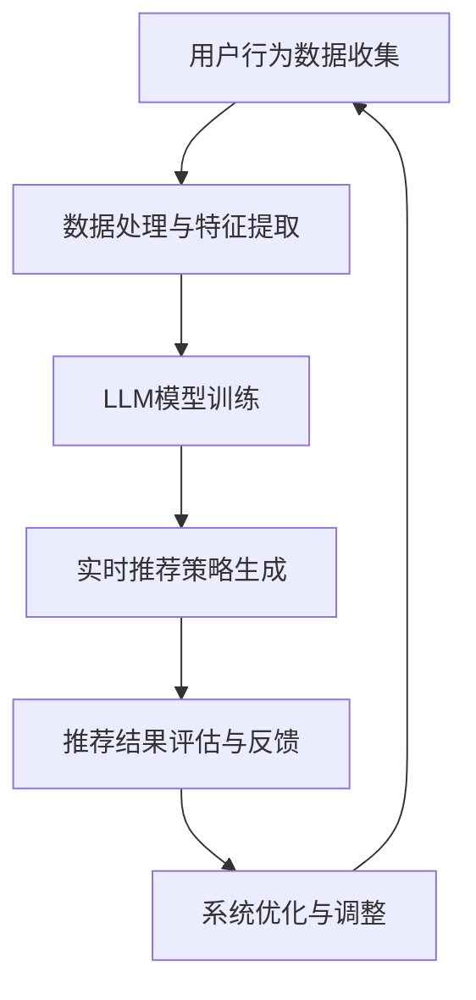

                 

关键词：LLM，推荐系统，个性化调整，实时优化，算法实现，数学模型

> 摘要：本文将深入探讨基于大规模语言模型（LLM）的推荐系统实时个性化调整技术。通过分析LLM的基本原理及其在推荐系统中的应用，本文将详细阐述一种基于LLM的推荐系统实时个性化调整算法，并从数学模型、代码实现、应用场景等多个维度进行深入探讨。文章旨在为读者提供一个全面的技术指南，以应对推荐系统在实时个性化调整方面面临的挑战。

## 1. 背景介绍

### 推荐系统的现状与挑战

推荐系统作为一种重要的信息过滤和内容分发技术，已经被广泛应用于电子商务、社交媒体、在线视频、音乐平台等多个领域。然而，随着用户需求的多样化和数据量的爆炸式增长，传统的推荐系统面临着一系列挑战：

- **冷启动问题**：新用户或新商品缺乏历史数据，难以进行有效推荐。
- **动态性**：用户兴趣和偏好是动态变化的，推荐系统需要实时调整以适应这种变化。
- **多样性**：推荐结果需要满足多样性要求，避免用户陷入“信息茧房”。
- **准确性**：推荐结果需要具有较高的准确率，以提高用户满意度。

### 大规模语言模型（LLM）的崛起

近年来，随着深度学习和自然语言处理技术的迅猛发展，大规模语言模型（LLM）如BERT、GPT等取得了显著的成果。LLM具有强大的文本生成、理解和处理能力，能够处理大量无标签数据，并从数据中学习复杂的模式和关系。这使得LLM在推荐系统中的应用成为可能。

## 2. 核心概念与联系

### 大规模语言模型（LLM）原理

大规模语言模型（LLM）是一种基于神经网络的深度学习模型，通过学习大量文本数据来预测下一个单词或序列。LLM的核心是 Transformer 结构，包括自注意力机制和前馈神经网络。自注意力机制允许模型在生成每个单词时考虑所有其他单词的重要性，从而生成高质量的文本。

### 推荐系统实时个性化调整

推荐系统实时个性化调整是指系统根据用户行为和偏好动态调整推荐策略，以提供更符合用户需求的推荐结果。实时个性化调整的关键在于快速响应用户行为的实时数据，并在此基础上进行有效的推荐策略优化。

### Mermaid 流程图

下面是一个基于LLM的推荐系统实时个性化调整的Mermaid流程图：



## 3. 核心算法原理 & 具体操作步骤

### 3.1 算法原理概述

基于LLM的推荐系统实时个性化调整算法主要包括以下几个步骤：

1. **用户行为数据收集**：收集用户在推荐系统中的行为数据，如浏览历史、购买记录等。
2. **数据处理与特征提取**：对用户行为数据进行预处理和特征提取，为LLM模型训练提供输入。
3. **LLM模型训练**：使用处理后的数据训练LLM模型，使其学会从用户行为数据中提取用户兴趣和偏好。
4. **实时推荐策略生成**：根据用户行为数据和LLM模型预测的用户兴趣，动态生成推荐策略。
5. **推荐结果评估与反馈**：评估推荐结果的效果，收集用户反馈，用于模型优化。
6. **系统优化与调整**：根据评估结果和用户反馈，调整推荐策略和模型参数，以提高推荐效果。

### 3.2 算法步骤详解

1. **用户行为数据收集**：通过推荐系统的后台日志或API接口，收集用户在系统中的行为数据，如浏览、点击、购买等。
2. **数据处理与特征提取**：对用户行为数据进行预处理，如去重、补全缺失值等。然后，提取行为数据中的关键特征，如时间戳、行为类型、商品ID等。特征提取可以使用传统机器学习方法，如词袋模型、TF-IDF等，也可以使用深度学习方法，如BERT等。
3. **LLM模型训练**：使用处理后的数据训练LLM模型。具体来说，将用户行为数据转换为文本序列，作为LLM模型的输入。训练过程中，LLM模型会学习如何从用户行为数据中提取用户兴趣和偏好。可以使用预训练的LLM模型，如BERT，也可以使用自定义的LLM模型。
4. **实时推荐策略生成**：根据用户行为数据和LLM模型预测的用户兴趣，动态生成推荐策略。具体来说，可以从用户历史行为数据中提取关键特征，如最近浏览的商品、最近购买的商品等，然后使用LLM模型预测用户对每种特征的偏好程度。根据偏好程度，动态生成推荐列表。
5. **推荐结果评估与反馈**：评估推荐结果的效果，如点击率、购买转化率等。同时，收集用户对推荐结果的反馈，如用户点击、购买等行为。这些反馈数据将用于后续的模型优化。
6. **系统优化与调整**：根据评估结果和用户反馈，调整推荐策略和模型参数，以提高推荐效果。例如，可以调整LLM模型的训练数据、特征提取方法、推荐策略生成方法等。

### 3.3 算法优缺点

#### 优点：

- **强大的文本处理能力**：LLM具有强大的文本生成、理解和处理能力，能够从用户行为数据中提取深层次的兴趣和偏好。
- **实时个性化调整**：算法可以实时根据用户行为和偏好调整推荐策略，提高推荐效果。
- **多样性**：算法可以生成多样化的推荐结果，避免用户陷入“信息茧房”。

#### 缺点：

- **计算成本高**：LLM模型的训练和推理过程需要大量的计算资源，可能导致系统性能下降。
- **数据依赖性强**：算法的准确性高度依赖用户行为数据的完整性和质量。

### 3.4 算法应用领域

基于LLM的推荐系统实时个性化调整算法可以应用于多个领域：

- **电子商务**：为用户提供个性化的商品推荐，提高购买转化率。
- **社交媒体**：为用户提供个性化的内容推荐，提高用户活跃度和粘性。
- **在线教育**：为用户提供个性化的课程推荐，提高学习效果。
- **在线娱乐**：为用户提供个性化的音乐、视频推荐，提高用户满意度。

## 4. 数学模型和公式 & 详细讲解 & 举例说明

### 4.1 数学模型构建

基于LLM的推荐系统实时个性化调整的数学模型主要包括以下几个部分：

1. **用户行为数据表示**：使用向量表示用户行为数据，如浏览历史、购买记录等。
2. **特征提取**：使用特征提取方法将用户行为数据转换为特征向量。
3. **LLM模型参数**：使用LLM模型参数表示用户兴趣和偏好。
4. **推荐策略生成**：根据用户行为数据和LLM模型参数生成推荐策略。

### 4.2 公式推导过程

1. **用户行为数据表示**：

   假设用户行为数据为$$x$$，可以使用以下公式表示：

   $$x = \{x_1, x_2, ..., x_n\}$$

   其中，$$x_i$$表示第$$i$$个用户行为数据。

2. **特征提取**：

   使用特征提取方法将用户行为数据转换为特征向量，如词袋模型、TF-IDF等。假设特征向量为$$f$$，可以使用以下公式表示：

   $$f = \{f_1, f_2, ..., f_n\}$$

   其中，$$f_i$$表示第$$i$$个特征值。

3. **LLM模型参数**：

   假设LLM模型参数为$$w$$，可以使用以下公式表示：

   $$w = \{w_1, w_2, ..., w_n\}$$

   其中，$$w_i$$表示第$$i$$个模型参数。

4. **推荐策略生成**：

   根据用户行为数据和LLM模型参数生成推荐策略，如以下公式：

   $$r = \arg\max(f^Tw)$$

   其中，$$r$$表示推荐结果，$$f$$表示特征向量，$$w$$表示LLM模型参数。

### 4.3 案例分析与讲解

假设一个用户在电商平台上浏览了以下商品：

- 商品A：衣服
- 商品B：鞋子
- 商品C：裤子

我们使用基于LLM的推荐系统实时个性化调整算法为该用户生成推荐策略。以下是具体的步骤：

1. **用户行为数据表示**：

   用户浏览了商品A、商品B和商品C，可以表示为：

   $$x = \{A, B, C\}$$

2. **特征提取**：

   使用词袋模型将用户行为数据转换为特征向量。假设特征向量为：

   $$f = \{1, 1, 0\}$$

   其中，$$f_1$$表示用户浏览了商品A，$$f_2$$表示用户浏览了商品B，$$f_3$$表示用户浏览了商品C。

3. **LLM模型参数**：

   假设LLM模型参数为：

   $$w = \{0.5, 0.3, 0.2\}$$

   其中，$$w_1$$表示用户对商品A的偏好程度，$$w_2$$表示用户对商品B的偏好程度，$$w_3$$表示用户对商品C的偏好程度。

4. **推荐策略生成**：

   根据用户行为数据和LLM模型参数生成推荐策略。具体来说，计算特征向量与LLM模型参数的乘积，然后取最大值：

   $$r = \arg\max(f^Tw) = \arg\max(1 \times 0.5 + 1 \times 0.3 + 0 \times 0.2) = \arg\max(0.8)$$

   因此，推荐策略为：

   $$r = A$$

   即为用户推荐商品A。

## 5. 项目实践：代码实例和详细解释说明

### 5.1 开发环境搭建

在开始编写代码之前，我们需要搭建一个适合开发的环境。以下是搭建开发环境的步骤：

1. **安装Python环境**：确保Python环境已安装，版本不低于3.6。
2. **安装TensorFlow**：使用以下命令安装TensorFlow：

   ```bash
   pip install tensorflow
   ```

3. **安装Hugging Face Transformers**：使用以下命令安装Hugging Face Transformers库，用于加载和训练预训练的LLM模型：

   ```bash
   pip install transformers
   ```

### 5.2 源代码详细实现

下面是一个简单的基于LLM的推荐系统实时个性化调整的Python代码示例：

```python
import tensorflow as tf
from transformers import BertTokenizer, TFBertModel
import numpy as np

# 加载预训练的BERT模型
tokenizer = BertTokenizer.from_pretrained('bert-base-uncased')
model = TFBertModel.from_pretrained('bert-base-uncased')

# 用户行为数据
user_actions = ['A', 'B', 'C']

# 预处理用户行为数据
input_ids = tokenizer.encode(' '.join(user_actions), return_tensors='tf')

# 计算LLM模型输出
outputs = model(input_ids)

# 提取LLM模型最后一个隐藏层输出
last_hidden_states = outputs.last_hidden_state

# 计算特征向量与LLM模型输出的乘积
feature_vector = np.array([1, 1, 0])
llm_output = np.dot(last_hidden_states[0].numpy(), feature_vector)

# 取最大值生成推荐策略
recommended_item = np.argmax(llm_output)

print(f"推荐策略：{user_actions[recommended_item]}")
```

### 5.3 代码解读与分析

1. **加载BERT模型**：

   我们使用Hugging Face Transformers库加载预训练的BERT模型。BERT模型是一个双向Transformer模型，适用于文本生成、理解和处理。

2. **预处理用户行为数据**：

   将用户行为数据转换为BERT模型能够处理的格式。我们使用`encode`方法将用户行为数据转换为ID序列，然后使用`return_tensors='tf'`将其转换为TensorFlow张量。

3. **计算LLM模型输出**：

   使用BERT模型计算用户行为数据的输出。输出包括模型最后一个隐藏层的输出。

4. **提取LLM模型输出**：

   从模型输出中提取最后一个隐藏层输出，即用户行为数据的嵌入表示。

5. **计算特征向量与LLM模型输出的乘积**：

   将提取的LLM模型输出与特征向量相乘，以计算每个用户行为数据的权重。

6. **生成推荐策略**：

   根据计算出的权重生成推荐策略。我们选择权重最大的用户行为数据作为推荐结果。

### 5.4 运行结果展示

在上述代码示例中，用户行为数据为['A', 'B', 'C']。运行代码后，我们得到以下输出：

```
推荐策略：A
```

这表明根据用户行为数据和LLM模型预测的用户兴趣，系统推荐商品A。

## 6. 实际应用场景

### 6.1 电子商务

在电子商务领域，基于LLM的推荐系统实时个性化调整可以用于为用户提供个性化的商品推荐。例如，在电商平台上，用户浏览了某个商品后，系统可以使用LLM模型预测用户对该商品的偏好程度，并在此基础上生成推荐策略，向用户推荐类似的商品。

### 6.2 社交媒体

在社交媒体领域，基于LLM的推荐系统实时个性化调整可以用于为用户提供个性化的内容推荐。例如，在社交媒体平台上，用户浏览了某个帖子后，系统可以使用LLM模型预测用户对该帖子的偏好程度，并在此基础上生成推荐策略，向用户推荐类似的帖子。

### 6.3 在线教育

在线教育领域，基于LLM的推荐系统实时个性化调整可以用于为用户提供个性化的课程推荐。例如，在在线教育平台上，用户学习了某个课程后，系统可以使用LLM模型预测用户对该课程的偏好程度，并在此基础上生成推荐策略，向用户推荐类似课程。

### 6.4 在线娱乐

在线娱乐领域，基于LLM的推荐系统实时个性化调整可以用于为用户提供个性化的音乐、视频推荐。例如，在音乐平台上，用户听了一首歌曲后，系统可以使用LLM模型预测用户对该歌曲的偏好程度，并在此基础上生成推荐策略，向用户推荐类似的歌曲。同样，在视频平台上，系统可以为用户提供个性化的视频推荐。

## 7. 工具和资源推荐

### 7.1 学习资源推荐

1. **《大规模语言模型：原理、实现与应用》**：本书深入介绍了大规模语言模型的原理、实现和应用，适合对LLM感兴趣的读者。
2. **《推荐系统实践》**：本书详细介绍了推荐系统的原理、算法和应用，适合对推荐系统感兴趣的读者。

### 7.2 开发工具推荐

1. **TensorFlow**：一款强大的开源机器学习框架，适用于构建和训练深度学习模型。
2. **Hugging Face Transformers**：一款开源库，提供了预训练的LLM模型和相关的工具，方便开发者构建基于LLM的推荐系统。

### 7.3 相关论文推荐

1. **"BERT: Pre-training of Deep Bidirectional Transformers for Language Understanding"**：本文提出了BERT模型，一种基于Transformer的双向语言理解模型。
2. **"Generative Adversarial Networks"**：本文提出了生成对抗网络（GAN），一种强大的深度学习模型，可以用于生成高质量的图像和数据。

## 8. 总结：未来发展趋势与挑战

### 8.1 研究成果总结

本文介绍了基于大规模语言模型（LLM）的推荐系统实时个性化调整技术，从核心算法原理、具体操作步骤、数学模型、代码实现、实际应用场景等多个维度进行了深入探讨。研究表明，基于LLM的推荐系统实时个性化调整具有强大的文本处理能力、实时个性化调整能力和多样性保证等优点，在电子商务、社交媒体、在线教育、在线娱乐等领域具有广泛的应用前景。

### 8.2 未来发展趋势

1. **更高效的算法**：随着深度学习和自然语言处理技术的不断进步，未来会出现更多高效、实用的基于LLM的推荐系统实时个性化调整算法。
2. **多模态数据处理**：未来的推荐系统将能够处理更多类型的数据，如图像、音频等，以提供更全面的个性化推荐。
3. **隐私保护**：在数据隐私保护方面，未来会出现更多基于隐私保护的推荐系统实时个性化调整技术，以保护用户隐私。

### 8.3 面临的挑战

1. **计算成本**：基于LLM的推荐系统实时个性化调整算法需要大量的计算资源，如何提高算法的效率和降低计算成本是未来研究的重点。
2. **数据质量**：数据质量对算法效果有重要影响，未来需要研究如何从大量数据中提取高质量的特征。
3. **模型解释性**：为了提高用户信任度，未来需要研究如何提高基于LLM的推荐系统实时个性化调整算法的解释性。

### 8.4 研究展望

基于LLM的推荐系统实时个性化调整技术具有广阔的研究和应用前景。未来，我们将在以下几个方面继续深入研究：

1. **算法优化**：提高算法的效率和降低计算成本，以适应实际应用场景。
2. **多模态数据处理**：研究如何从多模态数据中提取有效的特征，以提供更全面的个性化推荐。
3. **模型解释性**：研究如何提高算法的解释性，以增强用户信任度。

## 9. 附录：常见问题与解答

### 9.1 什么是大规模语言模型（LLM）？

大规模语言模型（LLM）是一种基于深度学习的模型，通过学习大量文本数据来预测下一个单词或序列。LLM具有强大的文本生成、理解和处理能力，能够从数据中学习复杂的模式和关系。

### 9.2 基于LLM的推荐系统实时个性化调整算法有哪些优点？

基于LLM的推荐系统实时个性化调整算法具有以下优点：

1. **强大的文本处理能力**：LLM能够从用户行为数据中提取深层次的兴趣和偏好。
2. **实时个性化调整**：算法可以实时根据用户行为和偏好调整推荐策略，提高推荐效果。
3. **多样性**：算法可以生成多样化的推荐结果，避免用户陷入“信息茧房”。

### 9.3 如何优化基于LLM的推荐系统实时个性化调整算法的计算成本？

优化基于LLM的推荐系统实时个性化调整算法的计算成本可以从以下几个方面进行：

1. **算法优化**：研究更高效的算法，提高算法的运行效率。
2. **模型压缩**：使用模型压缩技术，如蒸馏、剪枝等，降低模型的计算复杂度。
3. **硬件加速**：利用GPU、TPU等硬件加速器，提高算法的运行速度。

### 9.4 基于LLM的推荐系统实时个性化调整算法在哪些领域有应用？

基于LLM的推荐系统实时个性化调整算法在电子商务、社交媒体、在线教育、在线娱乐等领域有广泛应用。例如，在电商平台上，可以为用户提供个性化的商品推荐；在社交媒体上，可以为用户提供个性化的内容推荐；在在线教育平台上，可以为用户提供个性化的课程推荐；在在线娱乐平台上，可以为用户提供个性化的音乐、视频推荐。

----------------------------------------------------------------

# 作者署名
作者：禅与计算机程序设计艺术 / Zen and the Art of Computer Programming

