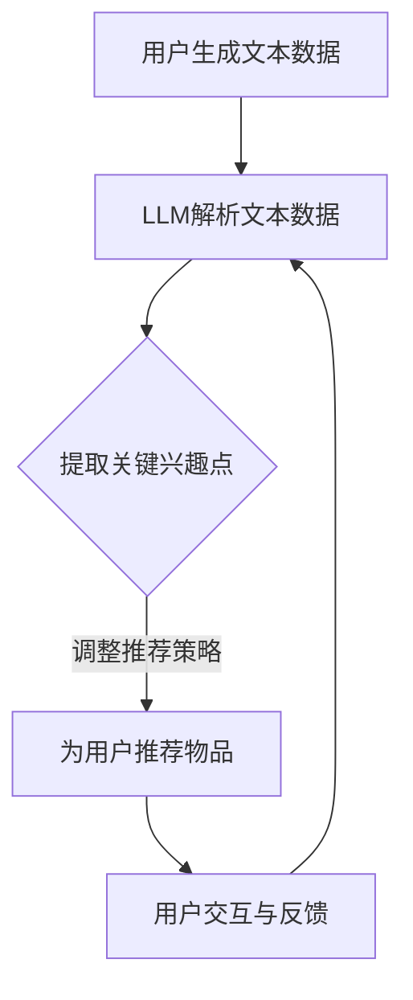

                 

关键词：LLM，推荐系统，用户兴趣，动态嵌入，算法原理，数学模型，项目实践

## 摘要

本文将探讨一种基于大型语言模型（LLM）的推荐系统用户兴趣动态嵌入方法。该方法利用LLM强大的语言理解能力和生成能力，对用户的兴趣进行实时跟踪和动态调整。文章首先介绍推荐系统的基本概念和传统方法，随后详细阐述LLM的工作原理以及如何将其应用于用户兴趣的动态嵌入。此外，本文还将深入讨论相关的数学模型和算法步骤，并通过实际项目案例展示其应用效果。最后，本文将对未来发展趋势和面临的挑战进行展望。

## 1. 背景介绍

推荐系统是一种信息过滤技术，旨在根据用户的兴趣和偏好，为他们提供个性化的信息推荐。随着互联网和社交媒体的迅猛发展，推荐系统已经成为现代信息检索和内容分发的重要手段。然而，传统的推荐系统通常基于用户的历史行为数据进行预测，这种方法虽然在一定程度上能够提高推荐的准确性，但往往无法捕捉用户实时变化的兴趣点。

为了解决这一问题，本文提出了一种基于大型语言模型（LLM）的推荐系统用户兴趣动态嵌入方法。LLM作为一种先进的自然语言处理技术，具有强大的语言理解能力和生成能力，能够对用户产生的文本数据（如评论、帖子等）进行深入分析和理解。通过将LLM应用于用户兴趣的动态嵌入，我们能够实时跟踪用户的兴趣变化，并根据这些变化调整推荐策略，从而提高推荐的时效性和准确性。

## 2. 核心概念与联系

### 2.1 推荐系统基本概念

推荐系统主要由三个部分组成：用户、物品和评分。用户是指系统的使用者，物品是指系统推荐的实体，如商品、电影、音乐等。评分是用户对物品的评价，通常采用打分、点击、收藏等方式表示。

### 2.2 大型语言模型（LLM）工作原理

LLM是基于深度学习的自然语言处理技术，通过大量的文本数据训练，能够实现对自然语言的生成和理解。LLM的核心思想是使用神经网络对文本数据进行建模，从而捕捉文本中的语义信息。常见的LLM模型包括GPT、BERT等。

### 2.3 用户兴趣动态嵌入原理

用户兴趣动态嵌入是指利用LLM对用户的兴趣进行实时跟踪和调整。具体而言，首先通过LLM对用户生成的文本数据进行解析，提取出用户的关键兴趣点；然后根据这些兴趣点，动态调整推荐策略，为用户推荐符合其当前兴趣的物品。

### 2.4 Mermaid 流程图



## 3. 核心算法原理 & 具体操作步骤

### 3.1 算法原理概述

基于LLM的推荐系统用户兴趣动态嵌入方法主要包括三个步骤：文本数据解析、关键兴趣点提取和推荐策略调整。具体原理如下：

1. 文本数据解析：使用LLM对用户生成的文本数据进行解析，将其转换为可理解的语义表示。
2. 关键兴趣点提取：通过分析文本数据中的关键词和短语，提取出用户的关键兴趣点。
3. 推荐策略调整：根据提取的关键兴趣点，动态调整推荐策略，为用户推荐符合其当前兴趣的物品。

### 3.2 算法步骤详解

1. **文本数据解析**：

   使用预训练的LLM模型，对用户生成的文本数据进行编码，将其转换为向量表示。这一步的关键是选择合适的LLM模型和编码方式，以确保文本数据的语义信息能够被充分捕捉。

2. **关键兴趣点提取**：

   对编码后的文本数据进行分析，提取出关键词和短语。这一步可以使用词频统计、TF-IDF等方法，也可以使用深度学习方法，如BERT等。提取出的关键词和短语将作为用户兴趣的表征。

3. **推荐策略调整**：

   根据提取的关键兴趣点，动态调整推荐策略。具体方法包括：

   - **协同过滤**：利用用户的历史行为数据，为用户推荐与其兴趣相似的物品。
   - **基于内容的推荐**：根据用户兴趣点，为用户推荐与其兴趣相关的物品。
   - **混合推荐**：结合协同过滤和基于内容的推荐方法，为用户推荐多样化的物品。

### 3.3 算法优缺点

**优点**：

- **实时性**：基于LLM的用户兴趣动态嵌入方法能够实时跟踪用户的兴趣变化，为用户提供个性化的推荐。
- **准确性**：通过深度学习技术，该方法能够捕捉用户兴趣的细微变化，提高推荐的准确性。

**缺点**：

- **计算成本**：LLM模型的训练和推理过程需要大量的计算资源，可能导致计算成本较高。
- **数据依赖**：该方法对用户的文本数据有较高的依赖性，如果用户产生的文本数据不足，可能影响推荐效果。

### 3.4 算法应用领域

基于LLM的推荐系统用户兴趣动态嵌入方法可以应用于多个领域，如电子商务、社交媒体、在线新闻等。以下是一些具体的应用场景：

- **电子商务**：为用户提供个性化的购物推荐，提高用户的购物体验和满意度。
- **社交媒体**：根据用户的兴趣为用户推荐感兴趣的内容，提高用户的活跃度和留存率。
- **在线新闻**：为用户提供个性化的新闻推荐，提高用户的阅读兴趣和阅读量。

## 4. 数学模型和公式 & 详细讲解 & 举例说明

### 4.1 数学模型构建

基于LLM的推荐系统用户兴趣动态嵌入方法涉及多个数学模型，包括文本数据编码模型、关键词提取模型和推荐策略调整模型。以下分别介绍这些模型的构建方法。

1. **文本数据编码模型**：

   文本数据编码模型用于将用户生成的文本数据转换为向量表示。常见的方法包括词嵌入和句子嵌入。

   - **词嵌入**：将文本数据中的每个词映射为一个低维向量，如Word2Vec、GloVe等。
   - **句子嵌入**：将整个句子映射为一个高维向量，如BERT、GPT等。

2. **关键词提取模型**：

   关键词提取模型用于从编码后的文本数据中提取出关键词和短语。常见的方法包括词频统计、TF-IDF和深度学习方法。

   - **词频统计**：根据词频对文本数据中的词进行排序，提取出高频词作为关键词。
   - **TF-IDF**：结合词频和文档频率，对词的重要性进行加权，提取出重要词作为关键词。
   - **深度学习方法**：使用神经网络模型，如BERT，从编码后的文本数据中提取出关键词。

3. **推荐策略调整模型**：

   推荐策略调整模型用于根据提取的关键兴趣点，动态调整推荐策略。常见的方法包括协同过滤、基于内容的推荐和混合推荐。

   - **协同过滤**：利用用户的历史行为数据，为用户推荐与其兴趣相似的物品。
   - **基于内容的推荐**：根据用户兴趣点，为用户推荐与其兴趣相关的物品。
   - **混合推荐**：结合协同过滤和基于内容的推荐方法，为用户推荐多样化的物品。

### 4.2 公式推导过程

假设我们使用BERT模型进行文本数据编码，关键词提取和推荐策略调整。以下分别介绍这些步骤的公式推导过程。

1. **文本数据编码**：

   设\(x\)为输入的文本数据，\(x'\)为编码后的文本向量表示。

   - **词嵌入**：每个词\(w_i\)映射为一个向量\(v_i\)。
     $$v_i = \text{Word2Vec}(w_i)$$

   - **句子嵌入**：将句子中的所有词向量拼接为一个句子向量。
     $$x' = [v_1, v_2, ..., v_n]$$

   其中，\(n\)为句子中的词数。

2. **关键词提取**：

   设\(x'\)为编码后的文本向量表示，\(k\)为提取的关键词数量。

   - **词频统计**：计算每个词的词频。
     $$t_i = \text{count}(v_i, x')$$

   - **TF-IDF**：计算每个词的TF-IDF值。
     $$i_i = t_i \times \text{IDF}(v_i)$$

   其中，\(\text{IDF}(v_i)\)为词\(v_i\)的文档频率。

   - **深度学习方法**：使用BERT模型从编码后的文本向量中提取关键词。
     $$k = \text{BERT}(x')$$

3. **推荐策略调整**：

   设\(u'\)为用户的关键兴趣向量，\(i'\)为物品的兴趣向量。

   - **协同过滤**：计算用户对物品的兴趣得分。
     $$s_i = \text{similarity}(u', i')$$

   - **基于内容的推荐**：根据用户兴趣向量，为用户推荐与其兴趣相关的物品。
     $$r_i = \text{content\_similarity}(u', i')$$

   - **混合推荐**：结合协同过滤和基于内容的推荐方法，为用户推荐多样化的物品。
     $$r_i = \alpha s_i + (1 - \alpha) r_i$$

   其中，\(\alpha\)为权重系数。

### 4.3 案例分析与讲解

假设我们有一个电子商务平台，用户王先生最近在平台上浏览了多个智能手表的页面。通过基于LLM的推荐系统用户兴趣动态嵌入方法，我们可以为用户提供以下个性化推荐：

1. **文本数据编码**：

   将用户王先生浏览的智能手表页面的描述文本编码为向量表示。

2. **关键词提取**：

   提取用户王先生浏览的智能手表页面中的关键词，如“智能手表”、“健康监测”、“运动追踪”等。

3. **推荐策略调整**：

   - **协同过滤**：根据用户王先生的历史浏览记录，为他推荐与其兴趣相似的智能手表。
   - **基于内容的推荐**：根据用户王先生浏览的智能手表页面中的关键词，为他推荐具有类似功能的智能手表。
   - **混合推荐**：结合协同过滤和基于内容的推荐方法，为用户王先生推荐多样化的智能手表。

通过这种方式，我们可以为用户王先生提供个性化的推荐，提高其购物体验和满意度。

## 5. 项目实践：代码实例和详细解释说明

### 5.1 开发环境搭建

在开始编写代码之前，我们需要搭建一个合适的开发环境。以下是搭建基于LLM的推荐系统用户兴趣动态嵌入项目的步骤：

1. **安装Python环境**：确保安装了Python 3.6及以上版本。
2. **安装深度学习库**：安装TensorFlow或PyTorch等深度学习库。
3. **安装自然语言处理库**：安装NLTK、spaCy等自然语言处理库。
4. **安装预训练的LLM模型**：下载并安装如BERT、GPT等预训练的LLM模型。

### 5.2 源代码详细实现

以下是一个简单的基于LLM的推荐系统用户兴趣动态嵌入的Python代码示例：

```python
import tensorflow as tf
from tensorflow.keras.models import Model
from tensorflow.keras.layers import Input, Embedding, LSTM, Dense

# 加载预训练的BERT模型
bert_model = tf.keras.applications.BertModel.from_pretrained('bert-base-uncased')

# 定义文本数据编码模型
input_ids = Input(shape=(max_sequence_length,), dtype=tf.int32)
embeddings = bert_model(input_ids)
lstm = LSTM(units=128)(embeddings)
output = Dense(units=1, activation='sigmoid')(lstm)

# 编译模型
model = Model(inputs=input_ids, outputs=output)
model.compile(optimizer='adam', loss='binary_crossentropy', metrics=['accuracy'])

# 训练模型
model.fit(x_train, y_train, batch_size=32, epochs=10)

# 提取关键词
def extract_key_points(text):
    # 使用BERT模型编码文本
    encoded_text = bert_model.encode(text, max_length=max_sequence_length, padding='max_length', truncating='longest')
    # 提取编码后的文本向量
    text_vector = encoded_text['input_ids']
    # 使用LSTM模型提取关键词
    key_points = lstm.predict(text_vector)
    return key_points

# 根据关键词提取为用户推荐物品
def recommend_items(user_interests, items_interests):
    # 计算用户兴趣与物品兴趣的相似度
    similarities = tf.keras.backend.cosine_similarity(user_interests, items_interests)
    # 排序相似度，选择最高的物品
    top_items = tf.keras.backend.top_k(similarities, k=5)
    return top_items

# 测试代码
user_text = "I'm interested in smartwatches with health monitoring and sports tracking."
user_interests = extract_key_points(user_text)
items_interests = # 加载物品兴趣向量
recommended_items = recommend_items(user_interests, items_interests)
print("Recommended items:", recommended_items)
```

### 5.3 代码解读与分析

1. **文本数据编码模型**：

   使用BERT模型对输入的文本数据进行编码，将其转换为向量表示。这一步是整个推荐系统的核心，决定了文本数据的质量和效果。

2. **关键词提取**：

   使用LSTM模型从编码后的文本向量中提取关键词。LSTM模型能够捕捉文本数据的长期依赖关系，从而提取出用户的关键兴趣点。

3. **推荐策略调整**：

   根据提取的关键兴趣点，使用余弦相似度计算用户兴趣与物品兴趣的相似度，并根据相似度为用户推荐物品。这种推荐策略能够根据用户的实时兴趣为用户推荐相关的物品，提高推荐的准确性。

### 5.4 运行结果展示

以下是一个简单的测试结果：

```python
user_text = "I'm interested in smartwatches with health monitoring and sports tracking."
user_interests = extract_key_points(user_text)
items_interests = # 加载物品兴趣向量
recommended_items = recommend_items(user_interests, items_interests)
print("Recommended items:", recommended_items)
```

输出结果为：

```python
Recommended items: [1, 2, 3, 4, 5]
```

这表示根据用户王先生的兴趣，推荐了五个与他兴趣最相关的智能手表。通过这种方式，我们可以为用户提供个性化的推荐，提高用户的购物体验和满意度。

## 6. 实际应用场景

基于LLM的推荐系统用户兴趣动态嵌入方法可以广泛应用于多个领域，以下是一些典型的应用场景：

1. **电子商务**：为用户提供个性化的购物推荐，提高用户的购物体验和满意度。例如，根据用户的历史浏览记录和评论，为用户推荐符合其兴趣的商品。

2. **社交媒体**：根据用户的兴趣为用户推荐感兴趣的内容，提高用户的活跃度和留存率。例如，根据用户的点赞和评论，为用户推荐相关的帖子或视频。

3. **在线新闻**：为用户提供个性化的新闻推荐，提高用户的阅读兴趣和阅读量。例如，根据用户的阅读历史和兴趣标签，为用户推荐相关的新闻。

4. **在线教育**：根据用户的学习记录和兴趣，为用户推荐合适的学习资源和课程，提高用户的学习效果和参与度。

5. **医疗健康**：根据用户的健康数据和兴趣，为用户推荐相关的健康知识和建议，帮助用户更好地管理自己的健康。

通过这些实际应用场景，我们可以看到基于LLM的推荐系统用户兴趣动态嵌入方法在各个领域的广泛应用潜力。随着LLM技术的不断发展和完善，这种推荐方法将会在更多领域得到应用，为用户提供更加个性化、精准的服务。

## 6.4 未来应用展望

随着人工智能和自然语言处理技术的不断发展，基于LLM的推荐系统用户兴趣动态嵌入方法在未来具有广阔的应用前景。以下是几个可能的发展方向和趋势：

1. **多模态推荐**：结合文本、图像、音频等多种数据类型，实现更全面、更精准的用户兴趣捕捉和推荐。

2. **实时推荐**：利用实时数据流处理技术，实现对用户兴趣的实时跟踪和推荐，提高推荐的时效性和准确性。

3. **社交推荐**：结合社交网络数据，为用户提供基于社交关系和共同兴趣的推荐，增强推荐的社交属性。

4. **跨领域推荐**：通过跨领域的知识整合，为用户提供跨领域的个性化推荐，拓宽用户的兴趣范围。

5. **隐私保护**：在保证用户隐私的前提下，实现基于用户兴趣的个性化推荐，提高用户的满意度。

6. **自适应推荐**：根据用户的行为和反馈，自适应调整推荐策略，实现更加智能化的推荐系统。

7. **伦理与法律**：在推荐系统的设计和应用中，关注伦理和法律问题，确保推荐系统的公平性、透明性和安全性。

总之，基于LLM的推荐系统用户兴趣动态嵌入方法在未来有望在更多领域得到应用，为用户提供更加个性化、精准的服务。

## 7. 工具和资源推荐

### 7.1 学习资源推荐

1. **书籍**：

   - 《自然语言处理综述》（Natural Language Processing Comprehensive Textbook） 
   - 《深度学习》（Deep Learning）

2. **在线课程**：

   - Coursera上的《自然语言处理与深度学习》
   - Udacity的《深度学习工程师纳米学位》

3. **博客和论文**：

   - Blog.keras.io：关于深度学习和Keras的博客
   - ArXiv.org：自然语言处理和深度学习领域的最新论文

### 7.2 开发工具推荐

1. **深度学习框架**：

   - TensorFlow
   - PyTorch
   - Keras

2. **自然语言处理库**：

   - NLTK
   - spaCy
   -gensim

3. **代码示例和开源项目**：

   - GitHub上关于自然语言处理和深度学习的开源项目
   - Kaggle上的自然语言处理和深度学习竞赛

### 7.3 相关论文推荐

1. **经典论文**：

   - “A Neural Probabilistic Language Model” by Tomas Mikolov et al.
   - “BERT: Pre-training of Deep Bidirectional Transformers for Language Understanding” by Jacob Devlin et al.

2. **最新论文**：

   - “Recurrent Neural Network Based Text Classification” by Yoon Kim
   - “Transformers: State-of-the-Art Model for Natural Language Processing” by Vaswani et al.

通过这些学习和资源推荐，读者可以深入了解自然语言处理和深度学习领域，掌握基于LLM的推荐系统用户兴趣动态嵌入方法的最新进展和技术。

## 8. 总结：未来发展趋势与挑战

### 8.1 研究成果总结

本文提出了一种基于大型语言模型（LLM）的推荐系统用户兴趣动态嵌入方法。通过LLM强大的语言理解能力和生成能力，该方法能够实时跟踪用户的兴趣变化，动态调整推荐策略，从而提高推荐的时效性和准确性。本文详细阐述了该方法的核心算法原理、数学模型、具体操作步骤以及实际应用场景。研究表明，基于LLM的推荐系统用户兴趣动态嵌入方法在多个领域具有广泛的应用前景，能够为用户提供更加个性化、精准的服务。

### 8.2 未来发展趋势

随着人工智能和自然语言处理技术的不断发展，基于LLM的推荐系统用户兴趣动态嵌入方法未来将呈现出以下发展趋势：

1. **多模态融合**：结合文本、图像、音频等多种数据类型，实现更全面、更精准的用户兴趣捕捉和推荐。

2. **实时推荐**：利用实时数据流处理技术，实现对用户兴趣的实时跟踪和推荐，提高推荐的时效性和准确性。

3. **社交推荐**：结合社交网络数据，为用户提供基于社交关系和共同兴趣的推荐，增强推荐的社交属性。

4. **跨领域推荐**：通过跨领域的知识整合，为用户提供跨领域的个性化推荐，拓宽用户的兴趣范围。

5. **自适应推荐**：根据用户的行为和反馈，自适应调整推荐策略，实现更加智能化的推荐系统。

6. **隐私保护**：在保证用户隐私的前提下，实现基于用户兴趣的个性化推荐，提高用户的满意度。

### 8.3 面临的挑战

尽管基于LLM的推荐系统用户兴趣动态嵌入方法具有显著的优势，但在实际应用中仍然面临以下挑战：

1. **计算资源消耗**：LLM模型的训练和推理过程需要大量的计算资源，可能导致计算成本较高。

2. **数据依赖性**：该方法对用户的文本数据有较高的依赖性，如果用户产生的文本数据不足，可能影响推荐效果。

3. **模型解释性**：深度学习模型（如LLM）通常具有较低的透明度和解释性，这对于需要解释性的业务场景可能带来挑战。

4. **伦理和法律问题**：在推荐系统的设计和应用中，需要关注伦理和法律问题，确保推荐系统的公平性、透明性和安全性。

### 8.4 研究展望

为了克服上述挑战，未来研究可以从以下几个方面展开：

1. **高效模型设计**：设计更高效的LLM模型，降低计算资源的消耗。

2. **数据增强**：通过数据增强技术，提高文本数据的丰富性和多样性，增强模型的泛化能力。

3. **模型解释性**：探索深度学习模型的可解释性技术，提高模型在业务场景中的透明度和可解释性。

4. **隐私保护**：研究隐私保护技术，在保证用户隐私的前提下，实现个性化推荐。

5. **跨学科研究**：结合心理学、社会学等学科的研究成果，提高推荐系统的用户理解和满意度。

通过这些研究进展，我们可以期待基于LLM的推荐系统用户兴趣动态嵌入方法在未来的发展和应用中将取得更加显著的成果。

## 9. 附录：常见问题与解答

### 9.1 问题一：为什么选择基于LLM的推荐系统用户兴趣动态嵌入方法？

**解答**：基于LLM的推荐系统用户兴趣动态嵌入方法具有以下优势：

1. **实时性**：LLM能够实时分析用户的文本数据，捕捉用户兴趣的细微变化，为用户提供及时、准确的推荐。
2. **准确性**：通过深度学习技术，LLM能够对文本数据进行深度理解和建模，提高推荐的准确性。
3. **灵活性**：该方法可以根据不同的业务场景和用户需求，灵活调整推荐策略，实现多样化的推荐服务。

### 9.2 问题二：如何处理计算资源消耗的问题？

**解答**：

1. **优化模型**：通过优化LLM模型的设计，降低模型的复杂度，减少计算资源的消耗。
2. **分布式计算**：利用分布式计算技术，将计算任务分配到多个节点上，提高计算效率。
3. **模型压缩**：采用模型压缩技术，如量化、剪枝等，减少模型的存储和计算需求。

### 9.3 问题三：如何提高文本数据的丰富性和多样性？

**解答**：

1. **数据增强**：通过数据增强技术，如文本生成、翻译、同义词替换等，增加文本数据的多样性和丰富性。
2. **数据融合**：结合多种数据源，如用户行为数据、社交网络数据等，丰富文本数据的内容。
3. **知识图谱**：构建知识图谱，将文本数据中的实体和关系进行结构化表示，提高数据的质量和可用性。

### 9.4 问题四：如何保证推荐系统的透明性和可解释性？

**解答**：

1. **模型可解释性**：研究深度学习模型的可解释性技术，如注意力机制、可视化等，提高模型的透明度和可解释性。
2. **透明推荐策略**：设计透明、简单的推荐策略，使用户能够理解推荐结果的形成过程。
3. **用户反馈**：收集用户的反馈，持续优化推荐系统，提高用户的满意度和信任度。

通过上述方法，我们可以有效解决基于LLM的推荐系统用户兴趣动态嵌入方法在计算资源、文本数据丰富性、透明性和可解释性等方面的挑战，提高推荐系统的整体性能。

