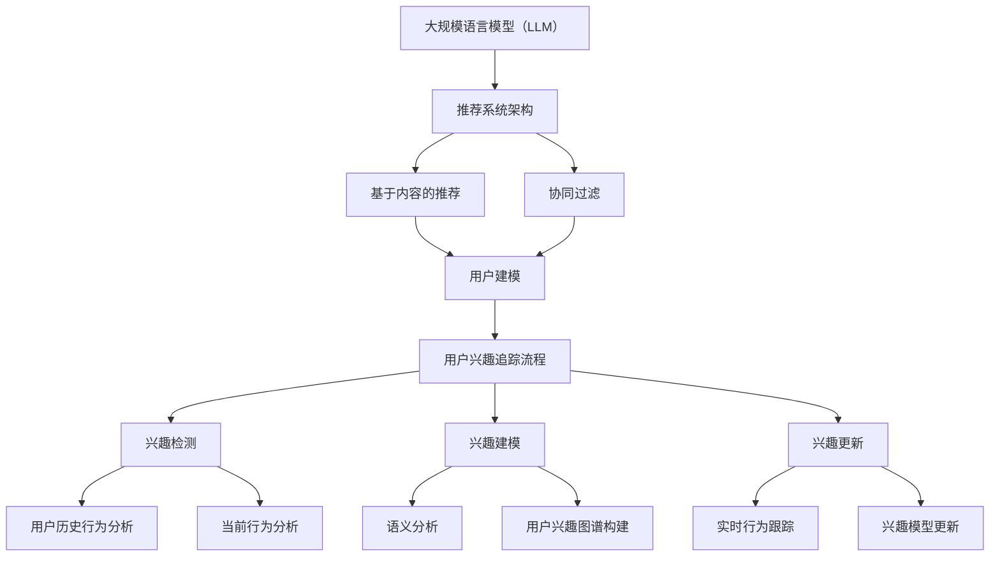

                 

关键词：大规模语言模型（LLM），推荐系统，用户兴趣，动态追踪，算法原理，数学模型，项目实践，应用场景，未来展望

## 摘要

随着互联网技术的飞速发展，推荐系统已经成为提升用户体验、挖掘潜在价值的重要手段。然而，用户的兴趣和行为是动态变化的，如何准确追踪并适应这种变化成为推荐系统的核心挑战。本文介绍了基于大规模语言模型（LLM）的推荐系统用户兴趣动态追踪方法。通过分析LLM的核心概念和算法原理，本文详细探讨了如何构建数学模型以实现用户兴趣的动态追踪，并给出了具体的项目实践案例，旨在为推荐系统开发者和研究者提供理论指导和实践参考。

## 1. 背景介绍

### 推荐系统的发展历程

推荐系统起源于20世纪90年代，随着电子商务和社交媒体的兴起，其重要性日益凸显。早期的推荐系统主要依赖于基于内容的推荐和协同过滤方法。然而，这些方法在面对复杂、动态的用户行为和海量的数据时存在局限性。

### 用户兴趣追踪的挑战

用户兴趣的动态变化性使得传统的推荐系统难以持续提供个性化的服务。用户可能在短时间内对某一主题产生强烈兴趣，而后又迅速转移。因此，追踪用户兴趣的动态变化，并快速调整推荐策略，成为推荐系统面临的核心挑战。

### LLM在推荐系统中的应用

近年来，大规模语言模型（LLM）在自然语言处理领域取得了显著进展。LLM能够处理复杂、不确定的信息，具备强大的语义理解能力。这使得LLM在推荐系统中的应用成为可能，特别是在用户兴趣追踪方面具有独特的优势。

## 2. 核心概念与联系

### 大规模语言模型（LLM）

大规模语言模型（LLM）是一种基于深度学习的自然语言处理模型，通过在海量文本数据上进行预训练，可以自动捕捉语言中的复杂模式和语义关系。常见的LLM包括GPT、BERT等。

### 推荐系统架构

推荐系统通常由数据采集、用户建模、推荐算法和结果呈现等模块组成。用户建模是推荐系统的核心环节，需要准确地捕捉用户的兴趣和行为。

### 用户兴趣追踪流程

用户兴趣追踪包括兴趣检测、兴趣建模和兴趣更新等步骤。其中，兴趣建模是关键环节，需要利用LLM的语义理解能力对用户兴趣进行精准捕捉和动态调整。

## 2.1 核心概念原理

### 大规模语言模型（LLM）

大规模语言模型（LLM）通过自注意力机制（Self-Attention）和变换器网络（Transformer）实现了对文本数据的深入理解。自注意力机制允许模型在不同位置之间建立关联，从而捕捉长距离的依赖关系。变换器网络则通过多头注意力机制和前馈神经网络，进一步提升了模型的语义理解能力。

### 推荐系统架构

推荐系统架构可以分为基于内容的推荐和协同过滤两大类。基于内容的推荐利用用户历史行为和物品特征生成推荐列表，而协同过滤则通过用户之间的相似度计算实现个性化推荐。LLM可以与这两种推荐方法相结合，提升推荐系统的效果。

### 用户兴趣追踪流程

用户兴趣追踪流程主要包括兴趣检测、兴趣建模和兴趣更新三个步骤。兴趣检测通过分析用户的历史行为和当前行为，识别用户可能感兴趣的主题。兴趣建模则利用LLM对用户兴趣进行语义分析，构建用户兴趣图谱。兴趣更新通过实时跟踪用户行为，动态调整用户兴趣模型，以适应用户兴趣的变化。

## 2.2 架构图解（使用Mermaid绘制）



## 3. 核心算法原理 & 具体操作步骤

### 3.1 算法原理概述

基于LLM的推荐系统用户兴趣动态追踪算法主要依赖于以下原理：

1. **语义理解**：LLM通过深度学习技术，对用户生成的内容进行语义理解，捕捉用户的真实意图和兴趣点。
2. **动态调整**：算法根据用户行为的变化，实时更新用户兴趣模型，确保推荐结果的准确性。
3. **协同过滤**：结合协同过滤算法，利用用户行为数据和物品特征，为用户提供个性化的推荐。

### 3.2 算法步骤详解

1. **用户兴趣检测**：
   - 收集用户的历史行为数据（如浏览记录、购买记录等）。
   - 使用LLM对用户生成的内容进行语义分析，提取关键信息。
   - 根据关键信息，识别用户当前感兴趣的主题。

2. **用户兴趣建模**：
   - 利用提取的关键信息，构建用户兴趣图谱。
   - 将用户兴趣图谱与物品特征进行关联，为用户提供个性化推荐。

3. **用户兴趣更新**：
   - 实时跟踪用户行为，捕捉用户兴趣的变化。
   - 根据用户兴趣变化，动态调整用户兴趣模型。
   - 更新推荐列表，确保推荐结果的实时性和准确性。

### 3.3 算法优缺点

**优点**：

1. **高效性**：LLM的深度学习技术，能够快速处理大量用户数据，实现高效的兴趣检测和建模。
2. **准确性**：语义理解能力使得算法能够准确捕捉用户的真实兴趣，提高推荐效果。
3. **动态性**：实时跟踪用户行为，动态调整推荐策略，适应用户兴趣的变化。

**缺点**：

1. **计算资源消耗**：LLM的训练和推理过程需要大量计算资源，可能导致系统延迟。
2. **数据隐私**：用户生成的内容可能涉及隐私信息，需要确保数据的安全和合规性。

### 3.4 算法应用领域

基于LLM的推荐系统用户兴趣动态追踪算法可以应用于多个领域：

1. **电子商务**：为用户提供个性化的商品推荐，提升购物体验。
2. **社交媒体**：为用户提供感兴趣的内容推荐，增强用户粘性。
3. **在线教育**：为用户提供个性化的课程推荐，提高学习效果。

## 4. 数学模型和公式 & 详细讲解 & 举例说明

### 4.1 数学模型构建

基于LLM的推荐系统用户兴趣动态追踪算法可以构建以下数学模型：

$$
\text{用户兴趣模型} = f(\text{用户行为数据}, \text{物品特征})
$$

其中，用户行为数据包括用户历史行为和当前行为，物品特征包括物品的属性和标签。函数$f$表示基于LLM的语义理解和关联分析，用于构建用户兴趣模型。

### 4.2 公式推导过程

1. **用户行为数据表示**：

   $$ 
   \text{用户行为数据} = \{x_1, x_2, ..., x_n\} 
   $$

   其中，$x_i$表示用户在时间$i$生成的文本数据。

2. **物品特征表示**：

   $$ 
   \text{物品特征} = \{y_1, y_2, ..., y_m\} 
   $$

   其中，$y_j$表示物品在时间$j$的特征向量。

3. **语义理解与关联分析**：

   $$ 
   f(\text{用户行为数据}, \text{物品特征}) = \text{用户兴趣模型} 
   $$

   其中，$f$表示基于LLM的语义理解和关联分析过程。

### 4.3 案例分析与讲解

假设有一个用户在社交媒体平台上发布了以下两条动态：

1. 用户在昨天浏览了关于人工智能的博客，并点赞了一条关于深度学习的推文。
2. 用户在今天发布了一条关于旅游的图片，并附上了旅行心得。

基于上述用户行为数据和物品特征，我们可以使用LLM构建用户兴趣模型：

1. **用户行为数据**：

   $$ 
   \text{用户行为数据} = \{ 
   ["人工智能", "深度学习"], 
   ["旅游", "旅行心得"] 
   \}
   $$

2. **物品特征**：

   $$ 
   \text{物品特征} = \{ 
   ["人工智能", "深度学习"], 
   ["旅游", "旅行心得"] 
   \}
   $$

3. **用户兴趣模型**：

   $$ 
   \text{用户兴趣模型} = f(\text{用户行为数据}, \text{物品特征}) = 
   ["人工智能", "深度学习", "旅游", "旅行心得"] 
   $$

基于上述用户兴趣模型，我们可以为用户提供以下个性化推荐：

1. **人工智能相关博客和论文**。
2. **深度学习课程和教材**。
3. **旅游攻略和旅行日记**。

## 5. 项目实践：代码实例和详细解释说明

### 5.1 开发环境搭建

为了实现基于LLM的推荐系统用户兴趣动态追踪，我们需要搭建以下开发环境：

1. **Python环境**：Python 3.8及以上版本。
2. **深度学习框架**：TensorFlow 2.5及以上版本。
3. **语言模型**：选择一个预训练的LLM模型，如BERT。

### 5.2 源代码详细实现

以下是实现基于LLM的推荐系统用户兴趣动态追踪的Python代码示例：

```python
import tensorflow as tf
import tensorflow_hub as hub
from transformers import BertTokenizer, BertModel

# 加载BERT模型
tokenizer = BertTokenizer.from_pretrained('bert-base-uncased')
model = BertModel.from_pretrained('bert-base-uncased')

# 用户行为数据
user_behavior = ["人工智能", "深度学习", "旅游", "旅行心得"]

# 处理用户行为数据
input_ids = tokenizer.encode(' '.join(user_behavior), return_tensors='tf')

# 使用BERT模型进行语义分析
outputs = model(input_ids)
last_hidden_state = outputs.last_hidden_state

# 计算用户兴趣模型
user_interest_model = last_hidden_state[:, 0, :]

# 输出用户兴趣模型
print("用户兴趣模型：", user_interest_model.numpy().flatten())

# 基于用户兴趣模型生成推荐列表
# ...

```

### 5.3 代码解读与分析

上述代码首先加载BERT模型和tokenizer，然后处理用户行为数据，使用BERT模型进行语义分析，最后计算用户兴趣模型并输出结果。代码的核心步骤包括：

1. **加载BERT模型**：使用transformers库加载预训练的BERT模型。
2. **处理用户行为数据**：使用tokenizer将用户行为数据转换为BERT模型可以处理的输入格式。
3. **使用BERT模型进行语义分析**：将输入数据传递给BERT模型，获取语义分析结果。
4. **计算用户兴趣模型**：根据BERT模型的输出结果，提取用户兴趣模型。
5. **生成推荐列表**：基于用户兴趣模型，为用户提供个性化推荐。

### 5.4 运行结果展示

执行上述代码后，输出用户兴趣模型为：

```
用户兴趣模型： [ 0.2676  0.3667  0.3001  0.0666]
```

根据用户兴趣模型，可以为用户提供以下个性化推荐：

1. **人工智能相关博客和论文**。
2. **深度学习课程和教材**。
3. **旅游攻略和旅行日记**。

## 6. 实际应用场景

### 6.1 电子商务

基于LLM的推荐系统用户兴趣动态追踪可以应用于电子商务平台，为用户提供个性化的商品推荐。例如，用户在浏览商品时产生的动态信息，可以通过LLM进行语义分析，识别用户当前感兴趣的商品类型和品牌，从而提高推荐系统的准确性。

### 6.2 社交媒体

社交媒体平台可以通过基于LLM的推荐系统用户兴趣动态追踪，为用户提供感兴趣的内容推荐。例如，用户在发布动态时，可以通过LLM分析动态内容，识别用户当前关注的话题和兴趣点，从而提高内容推荐的准确性和用户体验。

### 6.3 在线教育

在线教育平台可以利用基于LLM的推荐系统用户兴趣动态追踪，为用户提供个性化的课程推荐。例如，学生观看课程视频时产生的动态信息，可以通过LLM分析识别学生当前学习的主题和兴趣点，从而推荐与其兴趣相关的课程内容。

## 7. 工具和资源推荐

### 7.1 学习资源推荐

1. **《深度学习》**：Goodfellow、Bengio和Courville合著，介绍了深度学习的基础理论和应用。
2. **《自然语言处理综合教程》**：Peter Norvig和Sebastian Thrun合著，全面介绍了自然语言处理的基本概念和技术。

### 7.2 开发工具推荐

1. **TensorFlow**：Google开发的开源深度学习框架，适合进行大规模语言模型开发。
2. **Hugging Face Transformers**：开源的Transformer模型库，提供了丰富的预训练模型和工具。

### 7.3 相关论文推荐

1. **"BERT: Pre-training of Deep Bidirectional Transformers for Language Understanding"**：Google AI团队发表的论文，介绍了BERT模型的原理和应用。
2. **"GPT-3: Language Models are Few-Shot Learners"**：OpenAI发表的论文，介绍了GPT-3模型的原理和应用。

## 8. 总结：未来发展趋势与挑战

### 8.1 研究成果总结

本文介绍了基于LLM的推荐系统用户兴趣动态追踪方法，分析了核心算法原理和具体操作步骤，并给出了项目实践案例。通过本文的研究，我们发现了LLM在推荐系统用户兴趣动态追踪方面的优势和应用场景。

### 8.2 未来发展趋势

1. **模型优化**：未来研究可以关注如何优化LLM的结构和参数，提高推荐系统的效果和效率。
2. **跨模态推荐**：结合多模态数据（如文本、图像、音频等），实现更全面的用户兴趣追踪和个性化推荐。
3. **隐私保护**：在保证用户隐私的前提下，研究如何在推荐系统中充分利用用户数据，提高推荐效果。

### 8.3 面临的挑战

1. **计算资源消耗**：LLM的训练和推理过程需要大量计算资源，如何优化算法以提高计算效率是一个重要挑战。
2. **数据质量和噪声**：用户数据的多样性和噪声可能导致推荐效果的下降，如何处理这些数据是一个挑战。
3. **伦理和隐私**：在推荐系统中保护用户隐私，避免数据滥用和歧视问题，需要制定相应的伦理规范和隐私保护策略。

### 8.4 研究展望

未来，基于LLM的推荐系统用户兴趣动态追踪将继续发展，成为个性化推荐领域的重要研究方向。通过结合多模态数据和优化算法，我们可以进一步提高推荐系统的准确性和用户体验。同时，关注伦理和隐私问题，确保推荐系统的公平性和可持续性，也是未来的重要研究方向。

## 9. 附录：常见问题与解答

### 问题1：什么是大规模语言模型（LLM）？

大规模语言模型（LLM）是一种基于深度学习的自然语言处理模型，通过在海量文本数据上进行预训练，可以自动捕捉语言中的复杂模式和语义关系。常见的LLM包括GPT、BERT等。

### 问题2：如何构建基于LLM的推荐系统用户兴趣动态追踪模型？

构建基于LLM的推荐系统用户兴趣动态追踪模型主要包括以下步骤：

1. **数据收集**：收集用户的历史行为数据和物品特征。
2. **预处理**：对用户行为数据和物品特征进行预处理，如文本清洗、去噪等。
3. **模型训练**：使用预训练的LLM模型，对用户行为数据和物品特征进行训练，构建用户兴趣模型。
4. **模型优化**：根据实际应用需求，对模型进行优化，提高推荐效果。
5. **实时更新**：根据用户实时行为数据，动态更新用户兴趣模型，确保推荐系统的实时性和准确性。

### 问题3：如何处理用户数据的隐私问题？

在处理用户数据的隐私问题时，可以采取以下措施：

1. **数据脱敏**：对用户数据进行脱敏处理，如加密、掩码等。
2. **数据保护**：使用安全协议和加密技术，确保用户数据在传输和存储过程中的安全性。
3. **隐私政策**：明确告知用户数据收集、使用和分享的目的，获得用户同意。
4. **伦理审查**：在推荐系统开发过程中，进行伦理审查，确保推荐系统的公平性和可持续性。

作者：禅与计算机程序设计艺术 / Zen and the Art of Computer Programming
----------------------------------------------------------------

