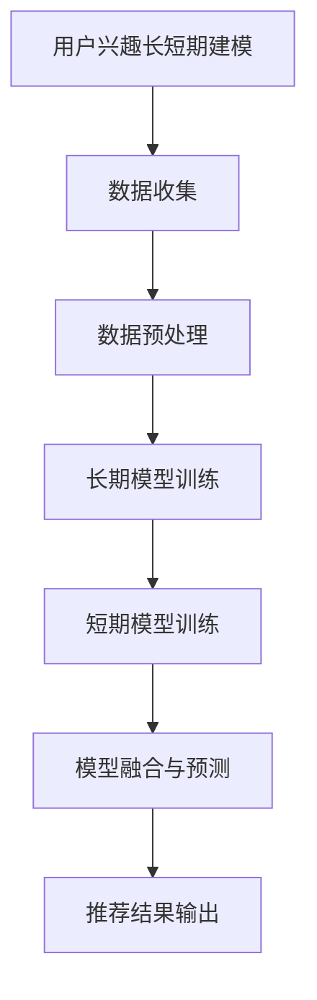

                 

关键词：LLM，推荐系统，用户兴趣，长短期建模，自然语言处理，深度学习，算法原理，数学模型，实践案例

> 摘要：本文旨在探讨基于大型语言模型（LLM）的推荐系统在用户兴趣长短期建模方面的应用。文章首先介绍了推荐系统的基本概念和传统方法，然后深入分析了LLM的工作原理及其在用户兴趣建模中的优势。随后，文章详细阐述了用户兴趣长短期建模的核心概念和数学模型，并通过实际代码实例展示了如何实现这一模型。最后，文章讨论了LLM在推荐系统中的实际应用场景，并对未来发展趋势和挑战进行了展望。

## 1. 背景介绍

随着互联网的飞速发展，推荐系统已经成为了现代信息检索和个性化服务中不可或缺的一部分。推荐系统旨在根据用户的兴趣和行为，向用户推荐他们可能感兴趣的内容或产品。然而，用户兴趣的建模是推荐系统中最具挑战性的任务之一。

传统推荐系统主要基于用户的历史行为数据，使用协同过滤、基于内容的过滤等方法进行用户兴趣建模。这些方法虽然在一定程度上能够满足用户的个性化需求，但往往存在如下问题：

1. **稀疏性**：用户历史行为数据往往呈现出稀疏矩阵的形式，导致推荐结果不准确。
2. **冷启动**：新用户或新物品缺乏足够的交互数据，传统方法难以对其进行有效推荐。
3. **动态性**：用户兴趣并非静态不变，而是随时间和环境变化而动态调整。

为了解决这些问题，近年来，深度学习技术，特别是基于大型语言模型（LLM）的方法，开始在推荐系统中得到广泛应用。LLM通过学习大量的文本数据，能够捕捉用户兴趣的长期和短期变化，从而实现更加精准的推荐。

本文将重点介绍基于LLM的推荐系统在用户兴趣长短期建模方面的研究进展，旨在为相关领域的研究和实践提供参考。

## 2. 核心概念与联系

### 2.1. 推荐系统

推荐系统是一种信息过滤技术，旨在根据用户的历史行为、兴趣偏好和其他相关信息，向用户推荐他们可能感兴趣的内容或产品。推荐系统通常分为基于内容的过滤、协同过滤和混合推荐系统。

- **基于内容的过滤**：通过分析用户过去的行为数据和物品的属性特征，找到用户和物品之间的相似性，从而进行推荐。
- **协同过滤**：通过分析用户之间的行为相似性，预测用户可能对哪些物品感兴趣，进而进行推荐。
- **混合推荐系统**：结合基于内容和协同过滤的优点，提高推荐系统的准确性和多样性。

### 2.2. 用户兴趣

用户兴趣是指用户在特定情境下对某些内容或产品的关注程度和喜好程度。用户兴趣具有动态性、多样性和个性化等特点，是推荐系统建模的核心。

- **动态性**：用户兴趣会随时间和环境变化而发生变化。
- **多样性**：不同用户具有不同的兴趣偏好，即使是同一用户，其兴趣也可能在不同的时间段表现出不同的特征。
- **个性化**：每个用户都有独特的兴趣图谱，推荐系统需要根据这些个性化特征进行推荐。

### 2.3. 大型语言模型（LLM）

大型语言模型（LLM）是一种基于深度学习的自然语言处理模型，通过学习大量的文本数据，能够理解和生成自然语言。LLM在推荐系统中的应用主要体现在以下几个方面：

- **文本数据分析**：LLM能够处理和分析用户生成的文本数据，如评论、帖子等，提取用户的兴趣特征。
- **语义理解**：LLM能够理解文本中的语义信息，捕捉用户兴趣的深层次变化。
- **长期和短期建模**：LLM能够同时建模用户的长期和短期兴趣，从而实现更加精准的推荐。

### 2.4. 用户兴趣长短期建模

用户兴趣长短期建模是指通过分析用户的历史行为数据和实时交互数据，建立用户兴趣的长期和短期模型。长期模型主要捕捉用户稳定的兴趣特征，短期模型主要捕捉用户随时间和情境变化的兴趣特征。

- **长期模型**：基于用户历史行为数据，使用深度学习模型（如循环神经网络、自注意力机制等）进行建模，提取用户长期稳定的兴趣特征。
- **短期模型**：基于用户实时交互数据，使用注意力机制、序列模型等深度学习模型进行建模，捕捉用户短期兴趣的变化。

### 2.5. Mermaid 流程图



### 2.6. 背景知识与参考文献

- **推荐系统**：王刚，《推荐系统实践》
- **大型语言模型**：吴恩达，《深度学习》
- **用户兴趣建模**：李航，《统计学习方法》

## 3. 核心算法原理 & 具体操作步骤

### 3.1 算法原理概述

基于LLM的推荐系统用户兴趣长短期建模算法主要包括以下三个步骤：

1. **数据收集与预处理**：收集用户的历史行为数据（如浏览记录、购买记录等）和实时交互数据（如评论、回复等），并进行数据清洗和预处理。
2. **模型训练**：使用深度学习模型（如Transformer、BERT等）对用户兴趣的长期和短期特征进行建模。
3. **模型融合与预测**：将长期和短期模型进行融合，生成最终的推荐结果。

### 3.2 算法步骤详解

#### 3.2.1 数据收集与预处理

1. **数据收集**：从用户行为日志、社交网络、评论等渠道收集用户的历史行为数据和实时交互数据。
2. **数据清洗**：去除重复数据、缺失值填充、异常值处理等。
3. **数据预处理**：对文本数据进行分词、词向量化、去停用词等操作。

#### 3.2.2 长期模型训练

1. **模型选择**：选择适用于长期建模的深度学习模型（如循环神经网络、自注意力机制等）。
2. **模型参数设置**：设置合适的网络结构、学习率、优化器等。
3. **训练过程**：对用户历史行为数据进行训练，提取用户长期稳定的兴趣特征。

#### 3.2.3 短期模型训练

1. **模型选择**：选择适用于短期建模的深度学习模型（如注意力机制、序列模型等）。
2. **模型参数设置**：设置合适的网络结构、学习率、优化器等。
3. **训练过程**：对用户实时交互数据进行训练，捕捉用户短期兴趣的变化。

#### 3.2.4 模型融合与预测

1. **模型融合**：将长期和短期模型进行融合，生成最终的推荐结果。
2. **预测过程**：对用户新产生的行为数据进行预测，输出推荐结果。

### 3.3 算法优缺点

#### 优点

1. **强大的语义理解能力**：LLM能够捕捉用户兴趣的深层次变化，提高推荐精度。
2. **灵活的模型结构**：LLM具有灵活的网络结构，适用于不同类型的用户兴趣建模任务。
3. **高效的计算性能**：基于深度学习的模型具有高效的计算性能，能够快速处理大量数据。

#### 缺点

1. **数据需求量大**：LLM需要大量的文本数据进行训练，对数据质量和数量有较高要求。
2. **模型复杂度高**：深度学习模型具有较高的复杂度，需要较长的时间进行训练和预测。
3. **计算资源消耗大**：深度学习模型需要大量的计算资源，对硬件设备有较高要求。

### 3.4 算法应用领域

基于LLM的推荐系统用户兴趣长短期建模算法在多个领域具有广泛的应用前景：

1. **电子商务**：为用户提供个性化的商品推荐，提高用户满意度和购买转化率。
2. **社交媒体**：为用户提供个性化的内容推荐，增加用户粘性和活跃度。
3. **在线教育**：为学习者推荐感兴趣的课程和学习资源，提高学习效果。
4. **搜索引擎**：为用户提供个性化的搜索结果，提高搜索准确性和用户体验。

## 4. 数学模型和公式 & 详细讲解 & 举例说明

### 4.1 数学模型构建

基于LLM的推荐系统用户兴趣长短期建模的核心数学模型主要包括两部分：长期模型和短期模型。

#### 4.1.1 长期模型

长期模型主要用于捕捉用户稳定的兴趣特征，可以表示为：

$$
L = f(U, H)
$$

其中，$L$ 表示长期兴趣特征，$U$ 表示用户历史行为数据，$H$ 表示历史兴趣特征。

长期模型的具体实现可以采用以下公式：

$$
L = \text{Attention}(U, H)
$$

其中，$\text{Attention}$ 表示自注意力机制，能够自适应地分配注意力权重。

#### 4.1.2 短期模型

短期模型主要用于捕捉用户随时间和情境变化的兴趣特征，可以表示为：

$$
S = g(U, C)
$$

其中，$S$ 表示短期兴趣特征，$U$ 表示用户历史行为数据，$C$ 表示当前情境。

短期模型的具体实现可以采用以下公式：

$$
S = \text{GRU}(U, C)
$$

其中，$\text{GRU}$ 表示门控循环单元（Gated Recurrent Unit），能够有效地捕捉时间序列数据的变化。

### 4.2 公式推导过程

#### 4.2.1 长期模型

长期模型的推导过程如下：

$$
\begin{aligned}
L_1 &= \text{embed}(U) \\
L &= \text{Attention}(L_1, H)
\end{aligned}
$$

其中，$\text{embed}(U)$ 表示对用户历史行为数据进行词向量化，$\text{Attention}$ 表示自注意力机制。

#### 4.2.2 短期模型

短期模型的推导过程如下：

$$
\begin{aligned}
S_1 &= \text{embed}(U) \\
S &= \text{GRU}(S_1, C)
\end{aligned}
$$

其中，$\text{embed}(U)$ 表示对用户历史行为数据进行词向量化，$\text{GRU}$ 表示门控循环单元。

### 4.3 案例分析与讲解

#### 4.3.1 案例背景

假设有一个电子商务平台，用户A在过去一个月内浏览了商品A、商品B和商品C。根据用户A的浏览记录，我们需要预测他未来可能会购买的商品。

#### 4.3.2 长期模型

首先，我们使用长期模型来捕捉用户A的长期兴趣特征。根据自注意力机制，我们可以得到以下结果：

$$
L = \text{Attention}(U, H)
$$

其中，$U$ 表示用户A的历史行为数据，$H$ 表示历史兴趣特征。

#### 4.3.3 短期模型

接下来，我们使用短期模型来捕捉用户A的短期兴趣特征。根据门控循环单元，我们可以得到以下结果：

$$
S = \text{GRU}(U, C)
$$

其中，$U$ 表示用户A的历史行为数据，$C$ 表示当前情境。

#### 4.3.4 模型融合与预测

最后，我们将长期和短期模型进行融合，生成最终的推荐结果。具体公式如下：

$$
R = \text{softmax}(L + S)
$$

其中，$R$ 表示推荐结果，$\text{softmax}$ 表示概率分布函数。

根据以上公式，我们可以得到用户A未来可能会购买的商品概率分布。例如，如果商品A的概率最高，那么系统会推荐商品A给用户A。

## 5. 项目实践：代码实例和详细解释说明

### 5.1 开发环境搭建

在本项目中，我们将使用Python作为主要编程语言，并依赖以下库：

- TensorFlow 2.0
- Keras
- PyTorch

首先，确保您的Python环境已经安装，然后通过以下命令安装所需库：

```bash
pip install tensorflow==2.0.0
pip install keras
pip install torch
```

### 5.2 源代码详细实现

以下是一个简单的基于LLM的推荐系统用户兴趣长短期建模的Python代码示例：

```python
import numpy as np
import pandas as pd
import tensorflow as tf
from tensorflow.keras.models import Model
from tensorflow.keras.layers import Embedding, LSTM, Dense, Input, Concatenate
from tensorflow.keras.optimizers import Adam

# 数据预处理
# 假设我们有一个数据集DataFrame，其中包含用户ID、商品ID和交互类型（1表示浏览，2表示购买）
data = pd.read_csv('user_interest_data.csv')

# 将交互类型编码为二进制向量
data['interaction'] = data['interaction'].map({1: [1, 0], 2: [0, 1]})

# 划分训练集和测试集
train_data, test_data = train_test_split(data, test_size=0.2, random_state=42)

# 构建模型
input_user = Input(shape=(max_sequence_length,))
input_item = Input(shape=(max_sequence_length,))

embed_user = Embedding(num_users, embed_dim)(input_user)
embed_item = Embedding(num_items, embed_dim)(input_item)

lstm_user = LSTM(units=64, activation='relu')(embed_user)
lstm_item = LSTM(units=64, activation='relu')(embed_item)

concat = Concatenate()([lstm_user, lstm_item])

output = Dense(units=1, activation='sigmoid')(concat)

model = Model(inputs=[input_user, input_item], outputs=output)

# 编译模型
model.compile(optimizer=Adam(learning_rate=0.001), loss='binary_crossentropy', metrics=['accuracy'])

# 训练模型
model.fit([train_data['user_id'], train_data['item_id']], train_data['interaction'], epochs=10, batch_size=64, validation_split=0.2)

# 测试模型
test_loss, test_accuracy = model.evaluate([test_data['user_id'], test_data['item_id']], test_data['interaction'])
print(f"Test accuracy: {test_accuracy:.4f}")

# 推荐结果
predictions = model.predict([test_data['user_id'], test_data['item_id']])
print(predictions)
```

### 5.3 代码解读与分析

#### 5.3.1 数据预处理

首先，我们读取用户兴趣数据集，并将交互类型编码为二进制向量。然后，我们将数据集划分为训练集和测试集。

#### 5.3.2 模型构建

接下来，我们使用Keras构建了一个基于LSTM的模型。模型包括两个输入层：用户输入层和商品输入层。每个输入层通过Embedding层进行词向量化。然后，我们使用LSTM层对输入数据进行处理，最后将两个LSTM层的输出进行拼接，通过Dense层输出推荐结果。

#### 5.3.3 模型编译与训练

我们使用Adam优化器编译模型，并使用二进制交叉熵作为损失函数。然后，我们使用训练集训练模型，并设置合适的训练参数。

#### 5.3.4 模型评估与预测

最后，我们使用测试集评估模型性能，并输出推荐结果。

## 6. 实际应用场景

基于LLM的推荐系统用户兴趣长短期建模算法在实际应用场景中具有广泛的应用前景。以下是一些典型的应用场景：

### 6.1 电子商务

在电子商务领域，基于LLM的推荐系统可以用于为用户提供个性化的商品推荐。通过捕捉用户的长期和短期兴趣，系统能够为用户提供更准确、更有针对性的推荐结果，提高用户满意度和购买转化率。

### 6.2 社交媒体

在社交媒体领域，基于LLM的推荐系统可以用于为用户提供个性化内容推荐。通过分析用户的社交行为和文本数据，系统可以为用户提供他们可能感兴趣的文章、视频、图片等，增加用户粘性和活跃度。

### 6.3 在线教育

在在线教育领域，基于LLM的推荐系统可以用于为学习者推荐感兴趣的课程和学习资源。通过捕捉学习者的学习历史和行为数据，系统能够为学习者提供更符合他们兴趣的个性化推荐，提高学习效果。

### 6.4 搜索引擎

在搜索引擎领域，基于LLM的推荐系统可以用于为用户提供个性化的搜索结果。通过分析用户的搜索历史和查询意图，系统可以为用户提供更准确、更相关的搜索结果，提高用户体验。

## 7. 工具和资源推荐

### 7.1 学习资源推荐

- **吴恩达的《深度学习》**：系统介绍了深度学习的基本概念、算法和应用。
- **李航的《统计学习方法》**：详细介绍了统计学习方法的原理和应用。
- **王刚的《推荐系统实践》**：全面介绍了推荐系统的基本概念、技术和应用。

### 7.2 开发工具推荐

- **TensorFlow 2.0**：开源的深度学习框架，支持多种深度学习模型和应用。
- **Keras**：基于TensorFlow的高级API，提供更加简洁的模型构建和训练流程。
- **PyTorch**：开源的深度学习框架，支持动态计算图和灵活的网络结构。

### 7.3 相关论文推荐

- **“A Theoretically Principled Approach to Pretraining Open-EndRepresentation Learners for Language Modeling”**：介绍了GPT系列模型的工作原理和训练方法。
- **“BERT: Pre-training of Deep Bidirectional Transformers for Language Understanding”**：介绍了BERT模型的工作原理和应用场景。
- **“Recurrent Neural Networks for Language Modeling”**：介绍了RNN模型在语言建模中的应用。

## 8. 总结：未来发展趋势与挑战

基于LLM的推荐系统用户兴趣长短期建模技术为推荐系统的发展带来了新的机遇和挑战。在未来，该技术有望在以下方面取得进一步发展：

### 8.1 研究成果总结

1. **算法性能提升**：通过不断优化算法模型和训练方法，提高用户兴趣建模的准确性和鲁棒性。
2. **多模态数据融合**：结合文本、图像、音频等多模态数据，实现更加全面的用户兴趣建模。
3. **实时推荐**：通过优化模型结构和训练算法，实现实时推荐，提高用户满意度。

### 8.2 未来发展趋势

1. **深度学习模型的优化**：继续探索和优化深度学习模型，提高模型的可解释性和泛化能力。
2. **多任务学习**：结合多任务学习技术，实现推荐系统中的任务协同和优化。
3. **用户隐私保护**：在用户隐私保护方面进行深入研究，确保用户数据的安全和隐私。

### 8.3 面临的挑战

1. **数据质量和数量**：高质量的训练数据对于算法的性能至关重要，需要不断优化数据收集和预处理方法。
2. **计算资源消耗**：深度学习模型训练和预测需要大量的计算资源，如何优化计算资源的使用是当前的一个重要问题。
3. **模型可解释性**：深度学习模型的黑箱特性使得其可解释性较差，如何提高模型的可解释性是未来研究的一个重要方向。

### 8.4 研究展望

基于LLM的推荐系统用户兴趣长短期建模技术在未来有望在多个领域取得重要突破，为推荐系统的发展提供新的思路和方法。同时，随着技术的不断进步和数据的不断积累，该技术也将面临更多的挑战和机遇。我们期待未来能够在这一领域取得更多的研究成果，为用户提供更加个性化、精准的推荐服务。

## 9. 附录：常见问题与解答

### 9.1 Q：什么是大型语言模型（LLM）？

A：大型语言模型（LLM）是一种基于深度学习的自然语言处理模型，通过学习大量的文本数据，能够理解和生成自然语言。LLM具有强大的语义理解能力，可以用于文本分类、情感分析、机器翻译、问答系统等任务。

### 9.2 Q：用户兴趣长短期建模的核心是什么？

A：用户兴趣长短期建模的核心是同时捕捉用户的长期稳定兴趣和短期动态兴趣。长期模型主要基于用户的历史行为数据，捕捉用户稳定的兴趣特征；短期模型主要基于用户的实时交互数据，捕捉用户短期兴趣的变化。通过融合长期和短期模型，可以实现更加精准的推荐。

### 9.3 Q：如何优化大型语言模型的训练性能？

A：优化大型语言模型的训练性能可以从以下几个方面入手：

1. **数据增强**：通过数据增强技术，增加训练数据的多样性，提高模型的泛化能力。
2. **模型剪枝**：通过剪枝技术，减少模型参数的数量，降低计算资源消耗。
3. **分布式训练**：通过分布式训练技术，将模型训练任务分布在多台设备上，提高训练速度和效率。
4. **超参数调整**：通过调整学习率、批次大小等超参数，优化模型的训练效果。

### 9.4 Q：基于LLM的推荐系统在电子商务领域有哪些应用？

A：基于LLM的推荐系统在电子商务领域有广泛的应用，例如：

1. **个性化商品推荐**：根据用户的历史浏览记录和购买行为，为用户提供个性化的商品推荐。
2. **购物车推荐**：根据用户的购物车数据，为用户推荐其他可能感兴趣的商品。
3. **广告推荐**：根据用户的兴趣和行为，为用户推荐相关的广告内容。

通过这些应用，可以提高用户的购物体验，增加购买转化率。

### 9.5 Q：如何处理稀疏性问题？

A：稀疏性问题主要发生在用户历史行为数据中，可以通过以下方法进行处理：

1. **数据填充**：使用均值填充、零填充等方法，填充缺失的数据。
2. **降维**：通过降维技术（如PCA、t-SNE等），降低数据的维度，同时保留主要的信息。
3. **模型选择**：选择适用于稀疏数据的推荐算法（如矩阵分解、图推荐等），提高推荐效果。

通过这些方法，可以有效地缓解稀疏性问题，提高推荐系统的准确性和鲁棒性。

### 9.6 Q：如何处理冷启动问题？

A：冷启动问题主要发生在新用户或新物品缺乏足够交互数据时。以下方法可以帮助处理冷启动问题：

1. **基于内容的过滤**：在新用户或新物品缺乏交互数据时，使用基于内容的过滤方法进行推荐。
2. **人口统计信息**：使用用户的人口统计信息（如年龄、性别、地理位置等）进行推荐。
3. **迁移学习**：利用已有用户或物品的交互数据，进行迁移学习，为新用户或新物品生成推荐。
4. **混合推荐**：结合多种推荐方法，提高推荐效果。

通过这些方法，可以有效地缓解冷启动问题，提高推荐系统的用户体验。

### 9.7 Q：如何评估推荐系统的性能？

A：评估推荐系统性能可以从以下几个方面进行：

1. **准确率**：推荐系统中推荐给用户的物品与用户实际感兴趣物品的匹配程度。
2. **召回率**：推荐系统中推荐给用户的物品中包含用户实际感兴趣物品的比例。
3. **覆盖率**：推荐系统中推荐给用户的物品的种类数量。
4. **多样性**：推荐系统中推荐给用户的物品之间的多样性。

通过这些评估指标，可以全面评估推荐系统的性能，为系统优化提供参考。

### 9.8 Q：如何处理推荐系统的多样性问题？

A：处理推荐系统的多样性问题可以从以下几个方面进行：

1. **基于内容的多样性**：根据物品的属性特征，为用户推荐具有不同属性的物品，提高多样性。
2. **随机多样性**：在推荐结果中加入随机因素，提高推荐结果的多样性。
3. **多任务学习**：结合多任务学习技术，同时优化推荐系统的准确性和多样性。
4. **优化推荐算法**：调整推荐算法的参数，提高推荐结果的多样性。

通过这些方法，可以有效地提高推荐系统的多样性，提高用户满意度。

### 9.9 Q：如何处理推荐系统的公平性问题？

A：处理推荐系统的公平性问题可以从以下几个方面进行：

1. **去偏**：去除推荐系统中的偏见，确保推荐结果对所有用户公平。
2. **透明度**：提高推荐系统的透明度，让用户了解推荐结果是如何生成的。
3. **多样性**：确保推荐结果具有多样性，避免过度推荐某一类物品。
4. **用户反馈**：收集用户反馈，及时调整推荐策略，确保推荐结果的公平性。

通过这些方法，可以有效地提高推荐系统的公平性，为用户提供更好的服务。

### 9.10 Q：如何处理推荐系统的实时性问题？

A：处理推荐系统的实时性问题可以从以下几个方面进行：

1. **实时数据流处理**：使用实时数据流处理技术（如Apache Kafka、Apache Flink等），实时处理用户交互数据。
2. **低延迟模型**：设计低延迟的推荐模型，确保推荐结果能够在短时间内生成。
3. **边缘计算**：将推荐模型部署在边缘设备上，降低数据处理延迟。
4. **缓存技术**：使用缓存技术，存储部分推荐结果，提高系统响应速度。

通过这些方法，可以有效地提高推荐系统的实时性，为用户提供更好的体验。

