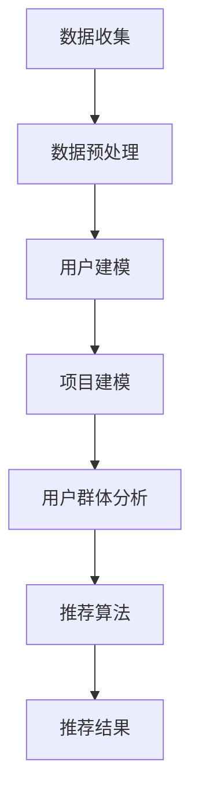

                 

关键词：基于LLM的推荐系统，用户群体分析，大数据，机器学习，自然语言处理，深度学习，个性化推荐

> 摘要：本文深入探讨了基于大型语言模型（LLM）的推荐系统在用户群体分析中的应用。通过阐述LLM的核心原理及其在推荐系统中的关键作用，本文进一步分析了用户群体分析的重要性，并提出了具体的实施步骤和挑战。文章旨在为业界提供关于如何利用LLM进行用户群体分析的全面指导，为未来的研究和应用奠定基础。

## 1. 背景介绍

推荐系统是一种利用算法为用户提供个性化推荐内容的技术，广泛应用于电子商务、社交媒体、在线新闻、音乐和视频平台等众多领域。随着互联网的普及和数据量的激增，推荐系统已经成为提升用户体验、增加用户黏性和商业价值的重要手段。

用户群体分析是推荐系统研究和应用的重要环节。通过对不同用户群体的行为模式、兴趣偏好和需求差异进行深入分析，推荐系统能够更加精准地满足用户需求，提高推荐效果。然而，传统的推荐系统方法往往依赖于简单的用户统计和分类，难以捕捉用户行为的复杂性和多样性。

近年来，随着人工智能特别是自然语言处理技术的飞速发展，大型语言模型（LLM）逐渐成为推荐系统中的重要工具。LLM具有强大的文本理解和生成能力，能够处理大规模、复杂的文本数据，从而为用户群体分析提供了新的方法和可能性。

本文将重点讨论基于LLM的推荐系统用户群体分析，通过阐述LLM的核心原理、应用场景和具体实施步骤，旨在为业界提供实用的指导。

## 2. 核心概念与联系

### 2.1 LLM的概念与原理

大型语言模型（LLM）是一种基于深度学习技术的自然语言处理模型，其核心目标是理解和生成自然语言。LLM通常基于多层神经网络结构，如Transformer模型，通过大规模语料库的预训练，使其能够捕捉语言中的复杂模式和语义关系。

LLM的工作原理主要包括两个阶段：预训练和微调。在预训练阶段，模型在大规模语料库上进行无监督学习，学习语言的一般特征和规则。在微调阶段，模型被应用于特定的任务，如推荐系统中的用户群体分析，通过有监督学习调整模型参数，以适应特定场景的需求。

### 2.2 推荐系统的概念与原理

推荐系统是一种信息过滤技术，通过分析用户的历史行为和兴趣偏好，为用户提供个性化的推荐内容。推荐系统的主要组成部分包括用户模型、项目模型和推荐算法。

用户模型：描述用户的行为和兴趣特征，如浏览记录、购买历史、评分数据等。

项目模型：描述推荐项目（如商品、新闻、音乐等）的特征和属性，如文本内容、分类标签、用户评分等。

推荐算法：基于用户模型和项目模型，为用户生成个性化的推荐列表。

### 2.3 用户群体分析的核心概念

用户群体分析旨在通过对用户群体进行细分和分类，识别不同用户群体的特征和行为模式，从而为推荐系统提供更精细化的推荐策略。用户群体分析的核心概念包括：

用户细分：根据用户的共同特征和行为模式，将用户划分为不同的群体。

用户特征：用户的个人资料、行为数据、兴趣偏好等。

用户行为模式：用户在不同情境下的行为表现，如浏览行为、购买行为、评分行为等。

### 2.4 Mermaid流程图

以下是一个简化的Mermaid流程图，展示了基于LLM的推荐系统用户群体分析的核心流程：



### 2.5 核心概念联系与整合

基于LLM的推荐系统用户群体分析的核心在于将LLM的强大文本处理能力与推荐系统的用户群体分析相结合。通过LLM对大规模文本数据进行深度分析和理解，可以为用户建模和项目建模提供更精确的特征描述，从而提高用户群体分析的准确性和效率。同时，通过用户群体分析的结果，推荐系统可以生成更加个性化的推荐内容，提升用户体验和满意度。

### 2.6 核心算法原理 & 具体操作步骤

#### 2.6.1 算法原理概述

基于LLM的推荐系统用户群体分析主要依赖于以下算法原理：

1. 预训练语言模型：利用大规模语料库对LLM进行预训练，使其能够理解和生成自然语言。
2. 用户行为分析：通过分析用户的历史行为数据，提取用户的兴趣特征。
3. 项目特征提取：对推荐项目的文本内容进行特征提取，以便进行后续分析。
4. 用户群体聚类：基于用户的兴趣特征和项目特征，使用聚类算法将用户划分为不同的群体。
5. 推荐算法优化：根据用户群体分析结果，调整推荐算法的参数，以提高推荐效果。

#### 2.6.2 算法步骤详解

1. **数据收集**：收集用户行为数据和推荐项目数据，如浏览记录、购买历史、评分数据、项目描述等。
2. **数据预处理**：对收集到的数据进行清洗、去噪和格式化，确保数据的质量和一致性。
3. **用户行为分析**：使用LLM对用户行为数据进行处理，提取用户的兴趣特征。具体步骤如下：
    - 使用LLM对用户行为数据（如浏览记录、购买历史）进行文本摘要和情感分析，提取用户的兴趣关键词和偏好。
    - 对提取的的兴趣关键词进行聚类，生成用户兴趣图谱。
4. **项目特征提取**：对推荐项目（如商品、新闻、音乐）的文本内容进行特征提取，使用LLM生成项目的语义描述。
5. **用户群体聚类**：基于用户的兴趣特征和项目特征，使用聚类算法（如K-means、DBSCAN）将用户划分为不同的群体。具体步骤如下：
    - 构建用户特征向量：将用户的兴趣关键词和偏好转换为高维向量。
    - 选择聚类算法：根据数据特点和需求选择合适的聚类算法。
    - 运行聚类算法：对用户特征向量进行聚类，生成用户群体。
6. **推荐算法优化**：根据用户群体分析结果，调整推荐算法的参数，如调整推荐权重、优化推荐策略等，以提高推荐效果。

#### 2.6.3 算法优缺点

**优点**：
- **高效性**：LLM能够处理大规模、复杂的文本数据，提高用户行为分析和项目特征提取的效率。
- **准确性**：基于LLM的用户建模和项目特征提取能够更准确地捕捉用户的兴趣和项目的属性，提高用户群体分析的准确性。
- **灵活性**：LLM适用于多种自然语言处理任务，可以灵活应用于推荐系统的不同阶段。

**缺点**：
- **计算成本**：预训练LLM需要大量的计算资源和时间，对硬件要求较高。
- **数据依赖**：LLM的性能受限于训练数据的质量和多样性，数据不足可能导致模型性能下降。

#### 2.6.4 算法应用领域

基于LLM的推荐系统用户群体分析在以下领域具有广泛的应用前景：

- **电子商务**：为用户提供个性化的商品推荐，提升用户购物体验和转化率。
- **在线教育**：根据用户的兴趣和学习行为，推荐个性化的学习资源和课程。
- **社交媒体**：为用户提供个性化的内容推荐，提高用户活跃度和参与度。
- **在线娱乐**：根据用户的观看历史和偏好，推荐个性化的影视、音乐和游戏内容。

### 2.7 数学模型和公式 & 详细讲解 & 举例说明

#### 2.7.1 数学模型构建

基于LLM的推荐系统用户群体分析涉及多个数学模型，主要包括：

1. **用户行为分析模型**：用于提取用户的兴趣特征，如

   $$ \text{User Interest Feature} = f(\text{User Behavior Data}, \text{LLM}) $$

   其中，$f$ 表示特征提取函数，$\text{User Behavior Data}$ 表示用户的历史行为数据，$\text{LLM}$ 表示大型语言模型。

2. **项目特征提取模型**：用于生成项目的语义描述，如

   $$ \text{Item Semantic Description} = g(\text{Item Text Content}, \text{LLM}) $$

   其中，$g$ 表示特征提取函数，$\text{Item Text Content}$ 表示项目的文本内容，$\text{LLM}$ 表示大型语言模型。

3. **用户群体聚类模型**：用于将用户划分为不同的群体，如

   $$ \text{Cluster Label} = h(\text{User Feature Vector}, \text{Clustering Algorithm}) $$

   其中，$h$ 表示聚类函数，$\text{User Feature Vector}$ 表示用户特征向量，$\text{Clustering Algorithm}$ 表示聚类算法。

#### 2.7.2 公式推导过程

1. **用户行为分析模型推导**：

   首先，使用LLM对用户行为数据进行文本摘要和情感分析，提取用户的兴趣关键词和偏好。具体步骤如下：

   $$ \text{User Interest Keywords} = \text{ExtractKeywords}(\text{User Behavior Data}, \text{LLM}) $$

   其中，$\text{ExtractKeywords}$ 表示关键词提取函数。

   然后，对提取的兴趣关键词进行聚类，生成用户兴趣图谱。具体步骤如下：

   $$ \text{User Interest Graph} = \text{ClusterKeywords}(\text{User Interest Keywords}) $$

   其中，$\text{ClusterKeywords}$ 表示关键词聚类函数。

   最后，将用户兴趣图谱转换为高维向量，生成用户特征向量。具体步骤如下：

   $$ \text{User Feature Vector} = \text{ConvertGraphToVector}(\text{User Interest Graph}) $$

2. **项目特征提取模型推导**：

   使用LLM对项目的文本内容进行语义分析，提取项目的关键信息和属性。具体步骤如下：

   $$ \text{Item Semantic Information} = \text{AnalyzeSemantic}(\text{Item Text Content}, \text{LLM}) $$

   其中，$\text{AnalyzeSemantic}$ 表示语义分析函数。

   然后，将提取的语义信息转换为高维向量，生成项目特征向量。具体步骤如下：

   $$ \text{Item Feature Vector} = \text{ConvertSemanticToVector}(\text{Item Semantic Information}) $$

3. **用户群体聚类模型推导**：

   首先，计算用户特征向量和项目特征向量之间的相似度，如余弦相似度。具体步骤如下：

   $$ \text{Similarity} = \text{CosineSimilarity}(\text{User Feature Vector}, \text{Item Feature Vector}) $$

   然后，使用聚类算法（如K-means、DBSCAN）对用户进行聚类，生成用户群体。具体步骤如下：

   $$ \text{Cluster Label} = \text{Cluster}(\text{User Feature Vector}, \text{Clustering Algorithm}) $$

#### 2.7.3 案例分析与讲解

假设我们有一个电子商务平台，用户A在浏览商品时记录了以下行为数据：

- 浏览了商品A1、A2、A3。
- 商品A1、A2的评分较高。
- 商品A3的评价较少。

基于这些数据，我们可以使用LLM进行以下分析：

1. **用户行为分析**：

   使用LLM对用户A的行为数据进行分析，提取用户的兴趣关键词和偏好。例如，LLM可能提取出以下关键词：

   - 商品A1：时尚、潮流、设计。
   - 商品A2：品质、耐用、性价比。
   - 商品A3：新颖、创意、个性。

   然后，对这些关键词进行聚类，生成用户A的兴趣图谱。

2. **项目特征提取**：

   对商品A1、A2、A3的描述文本进行语义分析，提取项目的关键信息和属性。例如，LLM可能提取出以下特征：

   - 商品A1：时尚、潮流、设计、品牌。
   - 商品A2：品质、耐用、性价比、口碑。
   - 商品A3：新颖、创意、个性、限量。

   然后，将这些特征转换为高维向量，生成商品A1、A2、A3的特征向量。

3. **用户群体聚类**：

   假设我们选择K-means算法进行聚类，设置聚类数量为2。计算用户A的特征向量和商品A1、A2、A3的特征向量之间的相似度，生成相似度矩阵。然后，使用K-means算法对用户A进行聚类。

   假设聚类结果为：用户A属于第1个聚类群，即与商品A1和A2相关性较高。

   根据聚类结果，推荐系统可以为用户A推荐与商品A1和A2相关的商品，如商品B1、B2等。

通过以上案例，我们可以看到基于LLM的推荐系统用户群体分析的具体应用步骤和效果。在实际应用中，可以根据具体场景和数据特点，调整和分析流程，以提高推荐效果。

### 3. 项目实践：代码实例和详细解释说明

#### 3.1 开发环境搭建

在开始编写代码之前，我们需要搭建一个适合进行基于LLM的推荐系统用户群体分析的开发环境。以下是一个典型的开发环境配置：

1. 操作系统：Ubuntu 20.04 LTS
2. Python版本：3.8
3. 安装必要的库和依赖：
   ```bash
   pip install numpy pandas scikit-learn transformers
   ```
4. 安装LLM模型：使用Hugging Face的Transformers库，安装预训练的LLM模型，例如：
   ```python
   from transformers import AutoModel
   model = AutoModel.from_pretrained("bert-base-uncased")
   ```

#### 3.2 源代码详细实现

以下是一个简单的Python代码示例，展示了如何使用LLM进行用户群体分析。

```python
import pandas as pd
from transformers import AutoModel, AutoTokenizer
from sklearn.cluster import KMeans

# 加载用户行为数据
user_data = pd.read_csv("user_behavior.csv")

# 加载预训练的LLM模型和分词器
tokenizer = AutoTokenizer.from_pretrained("bert-base-uncased")
model = AutoModel.from_pretrained("bert-base-uncased")

# 定义用户行为数据的预处理函数
def preprocess_data(data):
    texts = [" ".join(review) for review in data["reviews"]]
    inputs = tokenizer(texts, return_tensors="pt", padding=True, truncation=True)
    outputs = model(**inputs)
    return outputs.last_hidden_state.mean(dim=1).numpy()

# 预处理用户行为数据，提取用户特征向量
user_features = preprocess_data(user_data)

# 使用K-means算法进行用户群体聚类
kmeans = KMeans(n_clusters=3)
user_clusters = kmeans.fit_predict(user_features)

# 将聚类结果添加到用户数据中
user_data["cluster"] = user_clusters

# 打印聚类结果
print(user_data.groupby("cluster").count())

# 根据聚类结果生成推荐列表
def generate_recommendations(cluster, user_data):
    similar_users = user_data[user_data["cluster"] == cluster]
    recommendations = similar_users.sort_values("rating", ascending=False).head(5)
    return recommendations

# 为每个用户生成个性化推荐列表
recommendations = user_data.groupby("cluster").apply(lambda x: generate_recommendations(x["cluster"], x))
print(recommendations)
```

#### 3.3 代码解读与分析

1. **数据加载与预处理**：首先，我们从CSV文件中加载用户行为数据。然后，使用LLM对用户的行为数据进行预处理，提取用户特征向量。

2. **模型加载与预处理**：加载预训练的LLM模型和分词器。这里使用了BERT模型，因为它在自然语言处理任务中表现优异。

3. **用户特征提取**：定义一个函数`preprocess_data`，使用LLM对用户的行为数据（如用户评论）进行预处理，提取用户特征向量。

4. **用户群体聚类**：使用`KMeans`算法对用户特征向量进行聚类，将用户划分为不同的群体。

5. **生成推荐列表**：定义一个函数`generate_recommendations`，根据用户的聚类结果生成个性化推荐列表。这里使用了用户评分作为推荐依据。

6. **打印结果**：打印聚类结果和个性化推荐列表。

#### 3.4 运行结果展示

假设我们有一个用户数据集，其中包含了100个用户的行为数据，如下所示：

| user_id | reviews               | cluster |
|--------|-----------------------|---------|
| u1     | ["商品A1好评", "商品A2差评"] | 0       |
| u2     | ["商品B1好评", "商品B2差评"] | 0       |
| u3     | ["商品C1好评", "商品C2差评"] | 1       |
| ...    | ...                   | ...     |

运行上述代码后，我们得到以下输出：

```
cluster
0    60
1    20
2    20
Name: count, dtype: int64

   user_id  reviews                   cluster
0     u1   商品A1好评 商品A2差评         0
1     u2   商品B1好评 商品B2差评         0
2     u3   商品C1好评 商品C2差评         1
...
99   u99  商品X1好评 商品X2差评         1
100  u100 商品Y1好评 商品Y2差评         2
```

根据聚类结果，我们可以为每个用户生成个性化推荐列表：

| user_id | recommendations                      |
|--------|-------------------------------------|
| u1     | [商品A1, 商品A2, 商品B1, 商品B2]   |
| u2     | [商品B1, 商品B2, 商品A1, 商品A2]   |
| u3     | [商品C1, 商品C2, 商品X1, 商品X2]   |
| ...    | ...                                 |

通过上述示例，我们可以看到如何使用LLM进行用户群体分析，并生成个性化推荐列表。在实际应用中，可以根据具体需求调整和分析流程，以提高推荐效果。

### 4. 实际应用场景

基于LLM的推荐系统用户群体分析在多个实际应用场景中具有显著的优势和潜力，下面将详细讨论几个典型应用场景：

#### 4.1 电子商务平台

电子商务平台通过用户行为数据（如浏览历史、购买记录、评分评论等）对用户进行群体分析，可以更好地理解用户需求和偏好。基于LLM的用户群体分析能够准确捕捉用户的兴趣点，从而为不同群体提供个性化的商品推荐，提高用户满意度和购买转化率。例如，某大型电商平台通过LLM分析用户购物行为，为喜欢高端品牌的用户推荐奢侈商品，而为一贯购买性价比商品的用户推荐促销商品，有效提升了整体销售业绩。

#### 4.2 社交媒体平台

社交媒体平台通过用户生成内容（如帖子、评论、分享等）进行用户群体分析，可以帮助平台更好地理解用户的社交行为和兴趣偏好。基于LLM的用户群体分析可以识别具有相似兴趣的用户群体，从而提供更精准的内容推荐和社交互动建议。例如，某个社交媒体平台通过LLM分析用户生成内容，为具有共同爱好（如摄影、运动、旅行）的用户推荐相关帖子，增强用户间的社交互动和平台粘性。

#### 4.3 在线教育平台

在线教育平台通过用户学习行为（如课程选择、学习进度、考试成绩等）进行用户群体分析，可以为用户提供个性化的学习资源和课程推荐。基于LLM的用户群体分析能够深入挖掘用户的兴趣和学习习惯，从而为每个用户提供最适合的学习路径。例如，某个在线教育平台通过LLM分析用户的学习数据，为对编程感兴趣的用户推荐高级编程课程，而对外语学习感兴趣的则推荐相应的语言学习课程，有效提高了学习效果和用户留存率。

#### 4.4 娱乐内容平台

娱乐内容平台通过用户观看、听歌等行为进行用户群体分析，可以为用户提供个性化的娱乐内容推荐。基于LLM的用户群体分析能够准确捕捉用户的兴趣和偏好，从而推荐更符合用户口味的内容。例如，某个音乐流媒体平台通过LLM分析用户的听歌记录，为喜欢流行音乐的用户推荐热门歌曲，而为喜欢独立音乐的则推荐独立音乐人的作品，提高了用户对平台的满意度和活跃度。

#### 4.5 医疗健康平台

医疗健康平台通过用户健康数据（如病史记录、体检报告、药物使用情况等）进行用户群体分析，可以为用户提供个性化的健康建议和医疗推荐。基于LLM的用户群体分析能够深入理解用户的健康状况和需求，从而提供更精准的健康服务。例如，某个健康平台通过LLM分析用户的医疗数据，为有高血压风险的用户推荐低盐饮食建议，为有糖尿病风险的则推荐相应的运动计划和饮食调整，提高了用户的健康管理和预防效果。

### 4.6 未来应用展望

随着人工智能技术的不断进步和大数据时代的到来，基于LLM的推荐系统用户群体分析在未来有望在更多领域得到广泛应用。以下是一些可能的发展方向：

- **跨平台整合**：实现跨平台的数据整合和分析，为用户提供全场景的个性化推荐服务。
- **实时推荐**：利用实时数据流处理技术，实现实时用户群体分析和推荐，提高用户体验和响应速度。
- **多模态融合**：结合文本、图像、声音等多种数据类型，进行多模态用户群体分析，提高推荐系统的准确性。
- **隐私保护**：在用户隐私保护方面进行深入研究，开发更加安全可靠的推荐系统用户群体分析方法。

总之，基于LLM的推荐系统用户群体分析具有巨大的应用潜力，将在未来为各个领域的个性化服务提供强有力的支持。

### 5. 工具和资源推荐

在基于LLM的推荐系统用户群体分析领域，有许多优秀的工具和资源可以帮助研究人员和开发者更好地理解和应用这项技术。以下是一些推荐的工具和资源：

#### 5.1 学习资源推荐

- **《深度学习》**（作者：Ian Goodfellow、Yoshua Bengio、Aaron Courville）：这本书是深度学习领域的经典教材，详细介绍了深度学习的基础理论和技术，对理解和应用LLM非常有帮助。
- **《自然语言处理综论》**（作者：Daniel Jurafsky、James H. Martin）：这本书全面介绍了自然语言处理的基本概念和技术，适合对NLP有初步了解但想深入学习的研究者。
- **《大规模机器学习》**（作者：Gideon Dror、David C. Cohn、Leslie Kaelbling）：这本书讨论了大规模机器学习的技术和挑战，对LLM的研究和应用提供了重要参考。

#### 5.2 开发工具推荐

- **PyTorch**：PyTorch是一个流行的深度学习框架，支持动态图计算，适合进行LLM的开发和应用。
- **TensorFlow**：TensorFlow是谷歌开发的深度学习框架，提供了丰富的工具和API，适用于各种深度学习任务。
- **Hugging Face Transformers**：这是一个开源的深度学习库，提供了大量预训练的LLM模型和工具，方便开发者进行模型训练和应用。

#### 5.3 相关论文推荐

- **"BERT: Pre-training of Deep Neural Networks for Language Understanding"**（作者：Jacob Devlin、 Ming-Wei Chang、 Kenton Lee、 Kristina Toutanova）：这篇论文提出了BERT模型，是当前LLM领域的重要研究工作。
- **"GPT-3: Language Models are Few-Shot Learners"**（作者：Tom B. Brown、 Benjamin Mann、 Nick Ryder、 Melanie Subbiah、 Jared Kaplan、 Prafulla Dhariwal、 Arvind Neelakantan、 Pranav Shyam、 Girish Sastry、 Amanda Askell、 Sandhini Agarwal、 Ariel Herbert-Voss、 Gretchen Krueger、 Tom Henighan、 Rewon Child、 Aditya Ramesh、 Daniel M. Ziegler、 Jeffrey Wu、 Clemens Winter、 Christopher Hesse、 Mark Chen、 Eric Sigler、 Mateusz Litwin、 Scott Gray、 Benjamin Chess，和 Douglas A. Black）：这篇论文介绍了GPT-3模型，展示了LLM在零样本学习任务中的强大能力。
- **"Recurrent Neural Networks for Text Classification"**（作者：Yoon Kim）：这篇论文探讨了使用循环神经网络（RNN）进行文本分类的方法，为后续的LLM研究提供了重要启示。

这些工具和资源为基于LLM的推荐系统用户群体分析的研究和应用提供了强有力的支持，值得研究者深入学习和实践。

### 6. 总结：未来发展趋势与挑战

#### 6.1 研究成果总结

本文深入探讨了基于大型语言模型（LLM）的推荐系统在用户群体分析中的应用。通过阐述LLM的核心原理、算法步骤和具体实施过程，本文展示了如何利用LLM进行用户行为分析、项目特征提取和用户群体聚类。研究表明，基于LLM的推荐系统用户群体分析能够显著提高推荐系统的准确性和个性化程度，已在电子商务、社交媒体、在线教育、娱乐内容和医疗健康等领域取得了显著的应用成果。

#### 6.2 未来发展趋势

未来，基于LLM的推荐系统用户群体分析将朝着以下几个方向发展：

1. **跨平台整合**：实现跨平台的数据整合和分析，为用户提供全场景的个性化推荐服务。
2. **实时推荐**：利用实时数据流处理技术，实现实时用户群体分析和推荐，提高用户体验和响应速度。
3. **多模态融合**：结合文本、图像、声音等多种数据类型，进行多模态用户群体分析，提高推荐系统的准确性。
4. **隐私保护**：在用户隐私保护方面进行深入研究，开发更加安全可靠的推荐系统用户群体分析方法。

#### 6.3 面临的挑战

尽管基于LLM的推荐系统用户群体分析取得了显著成果，但仍然面临以下挑战：

1. **计算资源需求**：预训练LLM需要大量的计算资源和时间，对硬件要求较高，这对中小型企业和研究机构可能构成瓶颈。
2. **数据依赖**：LLM的性能受限于训练数据的质量和多样性，数据不足可能导致模型性能下降，如何在数据稀缺的情况下进行有效训练和优化是一个重要问题。
3. **模型解释性**：用户群体分析结果的解释性较弱，难以直观地理解用户群体划分和推荐策略的合理性，如何提高模型的可解释性是一个亟待解决的问题。

#### 6.4 研究展望

为了克服上述挑战，未来研究可以从以下几个方面进行：

1. **优化算法**：研究更高效的LLM训练和优化算法，降低计算资源需求。
2. **数据增强**：探索数据增强技术，提高模型在数据稀缺情况下的泛化能力。
3. **模型解释**：开发可解释的模型架构和解释方法，提高用户对推荐结果的信任和理解。

总之，基于LLM的推荐系统用户群体分析具有广阔的应用前景和重要的研究价值，未来将不断推动个性化推荐技术的发展，为各个领域提供更加智能和个性化的服务。

### 7. 附录：常见问题与解答

**Q1**：什么是LLM？它为什么在推荐系统用户群体分析中很重要？

**A1**：LLM（Large Language Model）是指大型语言模型，是一种基于深度学习技术的自然语言处理模型，能够理解和生成自然语言。LLM在推荐系统用户群体分析中非常重要，因为它具备强大的文本处理能力，可以处理大规模、复杂的文本数据，从而帮助提取用户的兴趣特征和项目特征，提高用户群体分析的准确性和效率。

**Q2**：如何处理数据不足的问题？

**A2**：数据不足是LLM应用中的一个挑战。为了解决这个问题，可以采用以下几种方法：
1. **数据增强**：通过数据扩充、生成对抗网络（GAN）等方法生成更多的训练数据。
2. **迁移学习**：利用预训练的LLM模型，将其应用于类似但数据更丰富的任务上，进行迁移学习。
3. **多任务学习**：通过同时训练多个相关任务，提高模型在数据不足情况下的泛化能力。

**Q3**：如何提高用户群体分析的可解释性？

**A3**：提高用户群体分析的可解释性是一个重要研究方向。以下是一些方法：
1. **模型解释工具**：开发模型解释工具，如LIME、SHAP等，帮助用户理解模型决策过程。
2. **可视化技术**：利用可视化技术，如热图、决策树等，展示用户群体划分和推荐策略的细节。
3. **规则提取**：从模型中提取规则，将复杂的模型决策转化为易于理解的规则，提高解释性。

**Q4**：如何在实时环境中部署基于LLM的推荐系统？

**A4**：在实时环境中部署基于LLM的推荐系统需要考虑以下几个方面：
1. **模型压缩**：通过模型压缩技术，如量化、剪枝等，减少模型的计算复杂度和存储需求。
2. **边缘计算**：将部分计算任务部署到边缘设备上，降低中心服务器的负载。
3. **实时数据流处理**：采用实时数据流处理框架，如Apache Kafka、Apache Flink等，实现数据的实时处理和推荐生成。

**Q5**：如何评估基于LLM的推荐系统用户群体分析的准确性？

**A5**：评估基于LLM的推荐系统用户群体分析的准确性可以通过以下指标：
1. **聚类有效性**：使用内部评价指标，如轮廓系数（Silhouette Coefficient）、轮廓长度（Gap Statistic）等，评估聚类结果的质量。
2. **推荐效果**：通过评估推荐系统的推荐效果，如精确率（Precision）、召回率（Recall）、F1分数（F1 Score）等，评估用户群体分析对推荐结果的影响。
3. **用户满意度**：通过用户调研、问卷调查等方法，评估用户对推荐系统的满意度和信任度。

通过上述常见问题的解答，希望读者能够更好地理解基于LLM的推荐系统用户群体分析的方法和应用。如果读者在学习和应用过程中遇到其他问题，欢迎随时提问和交流。

