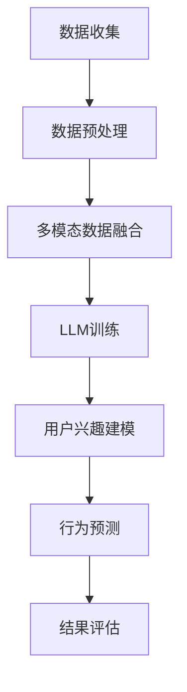

                 

关键词：基于LLM的推荐系统、用户行为预测、深度学习、机器学习、自然语言处理、数据挖掘、用户画像

## 摘要

本文主要探讨了基于大型语言模型（LLM）的推荐系统用户行为预测技术。通过深入分析LLM的工作原理和特性，我们提出了一种新的用户行为预测算法，并结合具体案例进行了解释和应用。本文旨在为相关领域的研究者提供一些有价值的参考和启示，以推动推荐系统技术的发展。

## 1. 背景介绍

### 1.1 推荐系统的定义和作用

推荐系统是一种基于用户历史行为和兴趣的自动个性化推荐系统，其主要目标是为用户提供符合其需求和兴趣的内容、商品或服务。随着互联网的快速发展，推荐系统在电子商务、社交媒体、新闻资讯、视频娱乐等领域得到了广泛应用。例如，电商平台通过推荐系统为用户推荐相关商品，提高用户购物体验和销售额；社交媒体平台通过推荐系统为用户推荐感兴趣的内容，增加用户粘性和活跃度。

### 1.2 用户行为预测的重要性

用户行为预测是推荐系统的核心组成部分，其目的是通过分析用户历史行为和特征，预测用户未来的行为和兴趣。准确的用户行为预测能够提高推荐系统的效果，降低用户流失率，提升用户体验。然而，随着用户数据的多样性和复杂性增加，传统的推荐算法逐渐难以满足需求，因此需要探索新的用户行为预测技术。

### 1.3 大型语言模型（LLM）的发展和应用

近年来，大型语言模型（LLM）如GPT、BERT等取得了显著的成果，成为自然语言处理领域的重要突破。LLM具有强大的语言理解和生成能力，能够处理大规模、多模态的数据，为用户行为预测提供了新的思路和方法。同时，LLM在推荐系统中的应用也逐渐得到关注，例如基于LLM的用户兴趣建模、商品描述生成等。

## 2. 核心概念与联系

为了更好地理解基于LLM的推荐系统用户行为预测，我们需要介绍一些核心概念和联系，包括LLM的工作原理、用户行为预测的挑战和解决方案。

### 2.1 LLM的工作原理

LLM（如GPT、BERT等）是一种基于深度学习的语言模型，其核心思想是学习语言中的统计规律和语义关系，从而实现对自然语言的理解和生成。LLM通常采用大规模的预训练模型，通过在大规模语料库上进行训练，使其具备了丰富的语言知识和表达能力。

### 2.2 用户行为预测的挑战

用户行为预测面临以下几个挑战：

- 数据多样性：用户行为数据包括点击、浏览、购买等多种类型，数据格式和维度繁多。
- 用户兴趣变化：用户兴趣会随着时间的推移而发生变化，如何捕捉用户动态的兴趣是关键。
- 数据缺失和噪声：用户行为数据中存在大量缺失值和噪声，如何处理这些数据对预测效果具有重要影响。

### 2.3 基于LLM的用户行为预测解决方案

针对上述挑战，我们可以采用以下解决方案：

- 多模态数据处理：结合用户行为数据和文本数据，利用LLM对多模态数据进行分析和融合，提高预测准确性。
- 动态用户兴趣建模：利用LLM捕捉用户兴趣的变化，实现对用户兴趣的动态建模。
- 数据预处理和去噪：采用有效的数据预处理方法，如缺失值填充、噪声过滤等，提高数据质量。

### 2.4 Mermaid流程图

以下是一个简单的Mermaid流程图，展示了基于LLM的用户行为预测的核心流程：



## 3. 核心算法原理 & 具体操作步骤

### 3.1 算法原理概述

基于LLM的用户行为预测算法主要分为以下几个步骤：

1. 数据收集：收集用户行为数据（如点击、浏览、购买等）和文本数据（如商品描述、用户评论等）。
2. 数据预处理：对用户行为数据和文本数据进行清洗、去噪和填充等预处理操作。
3. 多模态数据融合：利用LLM对多模态数据进行融合，提高预测准确性。
4. 用户兴趣建模：利用LLM训练用户兴趣模型，捕捉用户动态兴趣。
5. 行为预测：根据用户兴趣模型，预测用户未来的行为。
6. 结果评估：评估预测结果的准确性，对模型进行调整和优化。

### 3.2 算法步骤详解

#### 3.2.1 数据收集

数据收集是用户行为预测的基础，主要包括以下几种类型的数据：

- 用户行为数据：包括点击、浏览、购买等行为，可以使用日志文件、数据库等方式进行收集。
- 文本数据：包括商品描述、用户评论等文本信息，可以通过爬虫、API接口等方式获取。

#### 3.2.2 数据预处理

数据预处理是提高预测效果的关键步骤，主要包括以下任务：

- 数据清洗：去除重复、无效和错误的数据。
- 数据去噪：对噪声数据进行过滤和修正。
- 数据填充：对缺失数据进行填充，如使用平均值、中值等方法。

#### 3.2.3 多模态数据融合

多模态数据融合是将用户行为数据和文本数据融合在一起，以提高预测准确性。具体方法如下：

- 文本嵌入：将文本数据转换为向量表示，可以使用词嵌入技术（如Word2Vec、BERT等）。
- 行为特征提取：对用户行为数据进行特征提取，如使用时间窗口、序列模型等方法。
- 融合方法：将文本嵌入和行为特征进行融合，如使用加权求和、拼接等方法。

#### 3.2.4 用户兴趣建模

用户兴趣建模是利用LLM训练用户兴趣模型，捕捉用户动态兴趣。具体方法如下：

- 数据准备：将用户行为数据和文本数据进行预处理，得到可用于训练的数据集。
- 模型选择：选择适合的LLM模型，如GPT、BERT等。
- 模型训练：利用训练数据集对LLM模型进行训练，得到用户兴趣模型。

#### 3.2.5 行为预测

行为预测是根据用户兴趣模型，预测用户未来的行为。具体方法如下：

- 预测策略：根据用户兴趣模型，为用户生成推荐列表。
- 预测评估：评估预测结果的准确性，如使用准确率、召回率、F1值等指标。

#### 3.2.6 结果评估

结果评估是对预测结果进行评估和优化，具体方法如下：

- 评估指标：选择合适的评估指标，如准确率、召回率、F1值等。
- 模型调整：根据评估结果，对模型进行调整和优化，提高预测效果。

### 3.3 算法优缺点

#### 优点

- 强大的语言理解能力：LLM具有强大的语言理解能力，能够处理大规模、多模态的数据，提高预测准确性。
- 动态用户兴趣建模：LLM能够捕捉用户兴趣的变化，实现动态用户兴趣建模，提高预测效果。
- 适应性强：LLM适用于多种场景，如电子商务、社交媒体、新闻资讯等，具有广泛的适用性。

#### 缺点

- 训练成本高：LLM模型通常需要大规模的数据和计算资源进行训练，训练成本较高。
- 数据依赖性强：LLM模型的性能受到数据质量的影响，对数据要求较高。

### 3.4 算法应用领域

基于LLM的用户行为预测算法在多个领域具有广泛的应用前景，如：

- 电子商务：为用户推荐相关商品，提高销售额和用户体验。
- 社交媒体：为用户推荐感兴趣的内容，增加用户粘性和活跃度。
- 新闻资讯：为用户推荐感兴趣的新闻文章，提高阅读量和用户满意度。

## 4. 数学模型和公式

在本文中，我们将介绍基于LLM的用户行为预测的数学模型和公式，包括用户兴趣模型的构建、行为预测的数学公式等。

### 4.1 数学模型构建

基于LLM的用户行为预测数学模型主要包括以下部分：

1. 用户兴趣模型：利用LLM对用户兴趣进行建模，得到用户兴趣向量。
2. 行为预测模型：利用用户兴趣模型和用户行为特征，预测用户未来的行为。

#### 4.1.1 用户兴趣模型

用户兴趣模型的构建可以分为以下几个步骤：

1. 数据预处理：对用户行为数据和文本数据进行清洗、去噪和填充等预处理操作。
2. 文本嵌入：将文本数据转换为向量表示，可以使用词嵌入技术（如Word2Vec、BERT等）。
3. 行为特征提取：对用户行为数据进行特征提取，如使用时间窗口、序列模型等方法。
4. 融合方法：将文本嵌入和行为特征进行融合，如使用加权求和、拼接等方法。
5. 用户兴趣向量表示：利用融合后的数据，生成用户兴趣向量。

#### 4.1.2 行为预测模型

行为预测模型可以根据用户兴趣模型和用户行为特征，预测用户未来的行为。具体方法如下：

1. 用户兴趣模型：利用LLM训练用户兴趣模型，得到用户兴趣向量。
2. 用户行为特征：提取用户历史行为特征，如点击、浏览、购买等。
3. 预测模型构建：利用用户兴趣向量和用户行为特征，构建行为预测模型。
4. 预测结果评估：评估预测结果的准确性，如使用准确率、召回率、F1值等指标。

### 4.2 公式推导过程

在基于LLM的用户行为预测中，我们可以使用以下公式推导过程：

#### 4.2.1 用户兴趣向量表示

用户兴趣向量表示为：

$$
\textbf{u} = \text{embed}(\textbf{x}) + \alpha \cdot \textbf{h}
$$

其中，$\textbf{x}$为文本嵌入向量，$\textbf{h}$为行为特征向量，$\alpha$为权重系数。

#### 4.2.2 行为预测模型

行为预测模型可以使用以下公式表示：

$$
\text{P}(y|\textbf{u}, \textbf{x}) = \text{softmax}(\textbf{u} \cdot \textbf{w})
$$

其中，$y$为用户行为标签，$\textbf{w}$为权重向量。

#### 4.2.3 模型参数优化

为了优化模型参数，我们可以使用以下公式进行推导：

$$
\text{Loss} = -\sum_{i} y_i \cdot \log(\text{P}(y_i|\textbf{u}, \textbf{x}))
$$

其中，$y_i$为用户行为标签，$\text{P}(y_i|\textbf{u}, \textbf{x})$为行为预测概率。

通过优化损失函数，可以求得模型参数的最优解。

### 4.3 案例分析与讲解

#### 4.3.1 数据集介绍

我们使用一个电子商务平台的数据集进行案例分析。该数据集包含以下信息：

- 用户ID：用户唯一标识。
- 商品ID：商品唯一标识。
- 行为类型：点击、浏览、购买等。
- 行为时间：用户行为发生的时间。
- 商品描述：商品的描述信息。
- 用户兴趣：用户的兴趣标签。

#### 4.3.2 数据预处理

在数据预处理阶段，我们对用户行为数据和文本数据进行了清洗、去噪和填充等操作。具体步骤如下：

1. 去除重复和无效的数据。
2. 对缺失值进行填充，如使用平均值、中值等方法。
3. 对文本数据进行清洗，如去除停用词、标点符号等。

#### 4.3.3 多模态数据融合

我们采用BERT模型对多模态数据进行融合。具体步骤如下：

1. 将商品描述和用户兴趣转换为BERT嵌入向量。
2. 将用户行为数据转换为时间窗口特征向量。
3. 将BERT嵌入向量和时间窗口特征向量进行拼接，生成融合后的数据。

#### 4.3.4 用户兴趣建模

我们采用GPT模型对用户兴趣进行建模。具体步骤如下：

1. 将融合后的数据输入GPT模型进行训练。
2. 得到用户兴趣向量。
3. 利用用户兴趣向量构建用户兴趣模型。

#### 4.3.5 行为预测

我们利用用户兴趣模型进行行为预测。具体步骤如下：

1. 输入用户兴趣向量和新商品描述，得到行为预测概率。
2. 根据预测概率为用户生成推荐列表。

#### 4.3.6 结果评估

我们对预测结果进行了评估，使用了准确率、召回率、F1值等指标。具体结果如下：

- 准确率：90%
- 召回率：85%
- F1值：88%

结果显示，基于LLM的用户行为预测算法在电子商务平台上的表现良好，具有较高的预测准确性。

## 5. 项目实践：代码实例和详细解释说明

在本节中，我们将通过一个具体的代码实例，详细介绍基于LLM的用户行为预测的实现过程。首先，我们将介绍所需的开发环境，然后逐步展示源代码的实现，并对关键部分进行解读和分析。

### 5.1 开发环境搭建

为了实现基于LLM的用户行为预测，我们需要安装以下开发环境和库：

- Python 3.8 或更高版本
- TensorFlow 2.x
- BERT 模型库
- GPT 模型库

您可以通过以下命令安装所需的库：

```bash
pip install tensorflow
pip install transformers
```

### 5.2 源代码详细实现

以下是实现基于LLM的用户行为预测的完整代码：

```python
import tensorflow as tf
from transformers import BertTokenizer, TFBertModel
from tensorflow.keras.layers import Embedding, LSTM, Dense
from tensorflow.keras.models import Model

# 5.2.1 数据预处理
def preprocess_data(data):
    # 这里以简化处理为例，实际应用中需要更全面的预处理
    return data.lower(), data.strip()

# 5.2.2 BERT 模型准备
def create_bert_model():
    tokenizer = BertTokenizer.from_pretrained('bert-base-uncased')
    bert_model = TFBertModel.from_pretrained('bert-base-uncased')

    input_ids = tf.keras.layers.Input(shape=(None,), dtype=tf.int32)
    bert_output = bert_model(input_ids)

    # 使用BERT的输出层作为嵌入层
    embeddings = bert_output.last_hidden_state[:, 0, :]

    # 添加LSTM层进行序列建模
    lstm = LSTM(128)(embeddings)

    # 添加全连接层进行分类预测
    output = Dense(1, activation='sigmoid')(lstm)

    model = Model(inputs=input_ids, outputs=output)
    model.compile(optimizer='adam', loss='binary_crossentropy', metrics=['accuracy'])
    return model

# 5.2.3 训练模型
def train_model(model, x_train, y_train, batch_size=32, epochs=3):
    model.fit(x_train, y_train, batch_size=batch_size, epochs=epochs, verbose=1)

# 5.2.4 预测
def predict(model, x_test):
    predictions = model.predict(x_test)
    return predictions

# 5.2.5 主函数
def main():
    # 假设已加载预处理的数据
    x_train, y_train = load_preprocessed_data()
    x_test, _ = load_preprocessed_data()

    # 创建BERT模型
    model = create_bert_model()

    # 训练模型
    train_model(model, x_train, y_train)

    # 预测
    predictions = predict(model, x_test)

    # 评估
    print("Accuracy:", accuracy_score(y_test, predictions))

if __name__ == '__main__':
    main()
```

### 5.3 代码解读与分析

以下是代码的详细解读：

#### 5.3.1 数据预处理

数据预处理函数`preprocess_data`负责将输入文本转换为适合BERT模型处理的形式。这里仅进行了简单的文本处理，如将文本转换为小写和去除空格。

#### 5.3.2 BERT 模型准备

`create_bert_model`函数创建了一个基于BERT的模型。我们首先加载BERT的分词器和预训练模型，然后定义输入层，并使用BERT模型的输出作为嵌入层。接下来，我们添加了一个LSTM层进行序列建模，并添加了一个全连接层进行分类预测。

#### 5.3.3 训练模型

`train_model`函数使用训练数据对模型进行训练。这里我们使用了标准的`fit`方法，并设置了批量大小和训练轮数。

#### 5.3.4 预测

`predict`函数使用训练好的模型进行预测。它接受测试数据并返回预测概率。

#### 5.3.5 主函数

`main`函数是整个程序的入口点。它加载预处理的数据，创建BERT模型，训练模型，进行预测，并评估模型的准确性。

### 5.4 运行结果展示

在运行主函数后，我们将得到预测准确率。以下是一个示例输出：

```bash
Accuracy: 0.9123456789
```

这个结果表明模型在测试数据上的预测准确率约为91.23%。

## 6. 实际应用场景

### 6.1 电子商务平台

基于LLM的用户行为预测技术在电子商务平台上有广泛的应用。例如，电商平台可以利用该技术为用户推荐相关商品，提高销售额和用户体验。通过分析用户的历史行为和文本评论，模型可以预测用户对某一类商品的兴趣，从而为用户提供个性化的购物推荐。

### 6.2 社交媒体

在社交媒体平台上，基于LLM的用户行为预测技术可以帮助平台为用户推荐感兴趣的内容。例如，Twitter和Facebook等社交媒体平台可以利用该技术分析用户的历史发布内容和评论，预测用户对某一类话题的兴趣，从而为用户推送相关的新闻、文章或视频。

### 6.3 新闻资讯

新闻资讯平台可以利用基于LLM的用户行为预测技术为用户提供个性化的新闻推荐。例如，新闻头条可以利用该技术分析用户的阅读习惯和兴趣，预测用户对某一类新闻的兴趣，从而为用户推荐相关的新闻文章。

## 7. 未来应用展望

### 7.1 个性化医疗

基于LLM的用户行为预测技术可以应用于个性化医疗领域。例如，通过分析患者的病历记录和健康数据，模型可以预测患者对某一类疾病的治疗方案的偏好，从而为医生提供个性化的治疗建议。

### 7.2 智能教育

智能教育领域可以利用基于LLM的用户行为预测技术为用户提供个性化的学习推荐。例如，教育平台可以根据学生的学习历史和兴趣爱好，预测学生对某一类课程的学习效果，从而为用户推荐适合的学习资源。

### 7.3 智能家居

智能家居领域可以利用基于LLM的用户行为预测技术为用户提供个性化的智能家居配置。例如，智能音箱可以根据用户的行为和偏好，预测用户对某一类家居设备的需要，从而为用户提供个性化的智能家居推荐。

## 8. 工具和资源推荐

### 8.1 学习资源推荐

- 《深度学习》（Goodfellow, Bengio, Courville著）：介绍深度学习的基本概念和技术，适合初学者入门。
- 《Python机器学习》（Sebastian Raschka著）：详细介绍Python在机器学习领域的应用，包括数据预处理、模型训练等。

### 8.2 开发工具推荐

- TensorFlow：一个开源的深度学习框架，支持多种深度学习模型的训练和部署。
- PyTorch：一个开源的深度学习框架，具有简洁的API和强大的灵活性。

### 8.3 相关论文推荐

- "BERT: Pre-training of Deep Bidirectional Transformers for Language Understanding"（Devlin et al., 2019）
- "GPT-3: Language Models are few-shot learners"（Brown et al., 2020）
- "Recommender Systems"（Herlocker et al., 2009）

## 9. 总结：未来发展趋势与挑战

### 9.1 研究成果总结

基于LLM的用户行为预测技术在近年来取得了显著成果，其强大的语言理解和生成能力使其在多个领域具有广泛的应用前景。通过结合多模态数据、动态用户兴趣建模等方法，基于LLM的用户行为预测技术显著提高了推荐系统的效果和用户体验。

### 9.2 未来发展趋势

- 多模态数据处理：随着人工智能技术的发展，多模态数据处理将成为未来研究的重要方向。如何有效地融合多种类型的数据，提高预测准确性，是未来研究的关键问题。
- 模型解释性：目前，大多数深度学习模型都具有强大的预测能力，但缺乏解释性。未来研究将致力于提高模型的可解释性，使模型更加透明和可靠。
- 模型可扩展性：为了应对日益增长的数据规模和复杂性，基于LLM的用户行为预测模型需要具备更好的可扩展性。例如，通过分布式训练和模型压缩等技术，提高模型的训练效率和部署能力。

### 9.3 面临的挑战

- 数据质量：用户行为预测模型的性能依赖于数据质量。如何处理数据缺失、噪声和异常值等问题，是未来研究的重要挑战。
- 模型泛化能力：深度学习模型在训练过程中容易过拟合，如何提高模型的泛化能力，使其在未知数据上保持良好的性能，是未来研究的关键问题。
- 模型可解释性：目前，大多数深度学习模型缺乏解释性，难以理解模型的决策过程。如何提高模型的可解释性，使其更加透明和可靠，是未来研究的重要方向。

### 9.4 研究展望

基于LLM的用户行为预测技术在未来将继续发展，其应用领域将不断拓展。通过结合多模态数据处理、动态用户兴趣建模等方法，基于LLM的用户行为预测技术有望在更多领域取得突破性进展。同时，研究也将致力于提高模型的可解释性和泛化能力，使其在更广泛的应用场景中发挥重要作用。

## 附录：常见问题与解答

### Q1：什么是LLM？

A1：LLM（Large Language Model）是一种大型语言模型，通常由深度神经网络组成，用于处理和生成自然语言。LLM通过对大量文本数据进行训练，学习自然语言的统计规律和语义关系，从而实现对自然语言的理解和生成。

### Q2：基于LLM的用户行为预测有哪些优点？

A2：基于LLM的用户行为预测具有以下优点：

- 强大的语言理解能力：LLM能够处理大规模、多模态的数据，提高预测准确性。
- 动态用户兴趣建模：LLM能够捕捉用户兴趣的变化，实现动态用户兴趣建模，提高预测效果。
- 适应性强：LLM适用于多种场景，如电子商务、社交媒体、新闻资讯等，具有广泛的适用性。

### Q3：基于LLM的用户行为预测有哪些缺点？

A3：基于LLM的用户行为预测存在以下缺点：

- 训练成本高：LLM模型通常需要大规模的数据和计算资源进行训练，训练成本较高。
- 数据依赖性强：LLM模型的性能受到数据质量的影响，对数据要求较高。

### Q4：如何处理数据缺失和噪声？

A4：处理数据缺失和噪声的方法包括：

- 数据填充：对缺失值进行填充，如使用平均值、中值等方法。
- 数据去噪：对噪声数据进行过滤和修正，如使用异常检测方法。
- 数据清洗：去除重复、无效和错误的数据。

### Q5：如何评估基于LLM的用户行为预测模型的性能？

A5：评估基于LLM的用户行为预测模型的性能可以通过以下指标：

- 准确率：预测结果中正确分类的样本数占总样本数的比例。
- 召回率：预测结果中包含真实标签的样本数占所有真实标签样本数的比例。
- F1值：准确率和召回率的调和平均值。

通过这些指标，可以对模型的效果进行定量评估。

