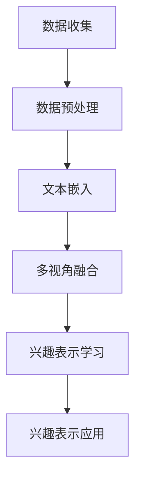

                 

关键词：自然语言处理、机器学习、用户兴趣、多视角表示学习、深度学习、LLM

摘要：本文探讨了基于大型语言模型（LLM）的用户兴趣多视角表示学习的原理、方法及其在自然语言处理领域的应用。首先介绍了LLM的基本概念和原理，然后详细阐述了用户兴趣多视角表示学习的框架和方法，最后通过实例展示了其具体实现和应用。

## 1. 背景介绍

随着互联网的快速发展，用户生成内容（UGC）的数量呈现爆炸式增长。如何从海量数据中提取用户的兴趣信息，为用户提供个性化的推荐服务，成为当前自然语言处理（NLP）和机器学习领域的热点问题。传统的基于统计的方法和基于规则的方法存在诸多局限性，如无法捕捉用户兴趣的多样性和复杂性，难以应对动态变化的环境等。因此，近年来，深度学习模型，特别是大型语言模型（LLM），在用户兴趣挖掘和个性化推荐领域得到了广泛的研究和应用。

LLM是一种基于深度神经网络的语言模型，能够捕捉自然语言中的复杂结构和语义信息。在用户兴趣挖掘中，LLM可以用于用户生成内容的理解和分析，从而提取用户的兴趣特征。多视角表示学习则是通过整合来自不同数据源的信息，构建用户兴趣的统一表示。这种方法能够充分利用多种信息来源，提高用户兴趣表示的准确性和多样性。

本文旨在探讨基于LLM的用户兴趣多视角表示学习的原理、方法及其在实际应用中的效果。本文首先介绍LLM的基本概念和原理，然后详细阐述用户兴趣多视角表示学习的框架和方法，最后通过实例展示其具体实现和应用。

## 2. 核心概念与联系

### 2.1 大型语言模型（LLM）

大型语言模型（LLM）是基于深度神经网络的端到端模型，能够理解和生成自然语言。LLM通常由多层神经网络组成，包括编码器和解码器。编码器负责将输入的文本转化为固定长度的向量表示，解码器则根据这些向量生成文本序列。LLM通过在大规模语料库上进行预训练，学习到了自然语言的统计规律和语义信息，从而能够进行文本理解和生成。

### 2.2 用户兴趣多视角表示学习

用户兴趣多视角表示学习是一种通过整合来自不同数据源的信息，构建用户兴趣的统一表示的方法。在自然语言处理领域，用户兴趣可以来自用户生成的内容、用户行为、社交网络等多方面的数据。多视角表示学习通过融合这些数据，构建一个综合的用户兴趣表示，从而提高兴趣表示的准确性和多样性。

### 2.3 Mermaid 流程图

以下是一个基于LLM的用户兴趣多视角表示学习的Mermaid流程图：



- A[数据收集]：从各种数据源收集用户兴趣相关的数据，如用户生成内容、用户行为数据等。
- B[数据预处理]：对收集到的数据进行清洗、去重等预处理操作，为后续处理做好准备。
- C[文本嵌入]：使用LLM将文本转化为向量表示，以便进行后续处理。
- D[多视角融合]：整合不同视角的文本嵌入结果，构建用户兴趣的统一表示。
- E[兴趣表示学习]：通过机器学习算法，学习用户兴趣的向量表示，提高兴趣表示的准确性。
- F[兴趣表示应用]：将学习到的兴趣表示应用于个性化推荐、情感分析等任务中。

## 3. 核心算法原理 & 具体操作步骤

### 3.1 算法原理概述

用户兴趣多视角表示学习基于LLM，通过以下步骤实现：

1. 数据收集：从多个数据源收集用户兴趣相关的数据。
2. 数据预处理：对收集到的数据进行清洗、去重等预处理操作。
3. 文本嵌入：使用LLM将预处理后的文本转化为向量表示。
4. 多视角融合：整合不同视角的文本嵌入结果，构建用户兴趣的统一表示。
5. 兴趣表示学习：通过机器学习算法，学习用户兴趣的向量表示。
6. 兴趣表示应用：将学习到的兴趣表示应用于实际任务中。

### 3.2 算法步骤详解

#### 3.2.1 数据收集

数据收集是用户兴趣多视角表示学习的基础。本文从以下数据源收集用户兴趣相关的数据：

1. 用户生成内容：包括用户发表的文章、评论、博客等。
2. 用户行为数据：包括用户点击、浏览、点赞等行为数据。
3. 社交网络数据：包括用户在社交网络上的互动、关注等数据。

#### 3.2.2 数据预处理

数据预处理包括以下步骤：

1. 数据清洗：去除重复数据、缺失数据和噪声数据。
2. 去重：对用户生成内容进行去重，确保每个样本的唯一性。
3. 分词：将文本数据分成词语序列。
4. 嵌入：使用预训练的LLM将词语序列转化为向量表示。

#### 3.2.3 文本嵌入

文本嵌入是将文本数据转化为向量表示的过程。本文采用以下方法进行文本嵌入：

1. 使用预训练的LLM：使用如GPT-3、BERT等大型语言模型对文本进行嵌入。
2. 词向量：将每个词语映射为一个固定长度的向量。
3. 序列向量：将词语序列映射为一个固定长度的向量。

#### 3.2.4 多视角融合

多视角融合是将来自不同视角的文本嵌入结果整合为一个统一表示的过程。本文采用以下方法进行多视角融合：

1. 加权融合：根据不同视角的重要程度，对各个视角的文本嵌入结果进行加权融合。
2. 模型融合：使用多任务学习模型，将各个视角的文本嵌入结果融合为一个统一表示。

#### 3.2.5 兴趣表示学习

兴趣表示学习是通过机器学习算法，学习用户兴趣的向量表示。本文采用以下方法进行兴趣表示学习：

1. 特征提取：从多视角融合的结果中提取兴趣特征。
2. 分类器：使用分类器学习兴趣特征与用户兴趣标签之间的关系。
3. 标签预测：根据分类器预测用户兴趣标签。

#### 3.2.6 兴趣表示应用

兴趣表示应用是将学习到的兴趣表示应用于实际任务中。本文将兴趣表示应用于以下任务：

1. 个性化推荐：根据用户兴趣，为用户推荐感兴趣的内容。
2. 情感分析：根据用户兴趣，分析用户对特定内容的情感倾向。
3. 话题分类：根据用户兴趣，将用户生成内容分类到不同的主题。

### 3.3 算法优缺点

#### 优点

1. 综合利用多种数据源：通过整合用户生成内容、用户行为数据和社交网络数据，构建用户兴趣的统一表示，提高兴趣表示的准确性。
2. 高效的文本嵌入：使用预训练的LLM进行文本嵌入，能够高效地捕捉文本中的语义信息。
3. 适应性：根据实际任务需求，可以灵活调整算法参数，适应不同的应用场景。

#### 缺点

1. 数据依赖性：算法的性能高度依赖于数据质量，数据源的多样性和丰富性对算法效果有重要影响。
2. 计算资源需求：使用大型语言模型进行文本嵌入和兴趣表示学习，需要大量的计算资源。

### 3.4 算法应用领域

用户兴趣多视角表示学习在以下领域具有广泛的应用：

1. 个性化推荐：通过提取用户的兴趣特征，为用户提供个性化的内容推荐。
2. 情感分析：通过分析用户对特定内容的情感倾向，为用户推荐感兴趣的内容。
3. 话题分类：通过分类用户生成内容到不同的主题，帮助用户发现感兴趣的领域。

## 4. 数学模型和公式 & 详细讲解 & 举例说明

### 4.1 数学模型构建

用户兴趣多视角表示学习的数学模型主要包括以下几个部分：

1. 文本嵌入模型：将文本数据转化为向量表示。
2. 多视角融合模型：整合不同视角的文本嵌入结果。
3. 兴趣表示学习模型：学习用户兴趣的向量表示。
4. 应用模型：将兴趣表示应用于实际任务中。

### 4.2 公式推导过程

以下是对上述数学模型的公式推导过程：

#### 4.2.1 文本嵌入模型

文本嵌入模型通常使用预训练的LLM，如BERT或GPT-3。假设给定一个文本序列 \( x = (x_1, x_2, ..., x_n) \)，其中 \( x_i \) 表示第 \( i \) 个词语。文本嵌入模型将每个词语映射为一个向量 \( v_i \)，即 \( v_i = \text{embedding}(x_i) \)。整个文本序列的嵌入结果为 \( \mathbf{V} = (v_1, v_2, ..., v_n) \)。

#### 4.2.2 多视角融合模型

多视角融合模型通过加权融合不同视角的文本嵌入结果。假设有 \( k \) 个视角，每个视角的文本嵌入结果为 \( \mathbf{V}_k \)，即 \( \mathbf{V}_k = (v_{k1}, v_{k2}, ..., v_{kn}) \)。多视角融合模型的目标是找到一个权重矩阵 \( \mathbf{W} \)，使得融合结果 \( \mathbf{V}_{\text{fused}} \) 最优。具体公式为：

$$
\mathbf{V}_{\text{fused}} = \mathbf{W} \cdot \mathbf{V} = \mathbf{W} \cdot (\mathbf{V}_1, \mathbf{V}_2, ..., \mathbf{V}_k)
$$

其中，权重矩阵 \( \mathbf{W} \) 的计算公式为：

$$
\mathbf{W} = \arg\min_{\mathbf{W}} \sum_{k=1}^k \sum_{i=1}^n \mathbf{w}_k^T \cdot \mathbf{v}_i - \sum_{i=1}^n \mathbf{v}_i^T \cdot \mathbf{w}_i
$$

#### 4.2.3 兴趣表示学习模型

兴趣表示学习模型通过机器学习算法，学习用户兴趣的向量表示。假设给定一个用户兴趣标签序列 \( y = (y_1, y_2, ..., y_n) \)，其中 \( y_i \) 表示第 \( i \) 个词语的兴趣标签。兴趣表示学习模型的目标是找到一个向量表示 \( \mathbf{V}_{\text{interest}} \)，使得兴趣标签序列与向量表示之间的距离最小。具体公式为：

$$
\mathbf{V}_{\text{interest}} = \arg\min_{\mathbf{V}_{\text{interest}}} \sum_{i=1}^n ||\mathbf{V}_{\text{interest}} - y_i||^2
$$

#### 4.2.4 应用模型

应用模型将学习到的兴趣表示应用于实际任务中。假设给定一个输入文本序列 \( x' = (x_1', x_2', ..., x_n') \)，应用模型的目标是预测输入文本序列的兴趣标签。具体公式为：

$$
\mathbf{y}' = \arg\max_{\mathbf{y}} \mathbf{y}^T \cdot \mathbf{V}_{\text{interest}}
$$

### 4.3 案例分析与讲解

以下是一个用户兴趣多视角表示学习的案例：

#### 案例背景

假设我们有一个用户兴趣挖掘系统，该系统从以下三个数据源收集用户兴趣相关的数据：

1. 用户生成内容：用户在博客上发布的技术文章。
2. 用户行为数据：用户在博客上的浏览、点赞等行为。
3. 社交网络数据：用户在社交网络上分享的技术文章。

#### 案例步骤

1. 数据收集：从博客、行为数据和社交网络数据中收集用户兴趣相关的数据。
2. 数据预处理：对收集到的数据进行清洗、去重等预处理操作。
3. 文本嵌入：使用预训练的BERT模型将预处理后的文本转化为向量表示。
4. 多视角融合：根据不同视角的重要程度，对文本嵌入结果进行加权融合。
5. 兴趣表示学习：使用分类器学习用户兴趣的向量表示。
6. 兴趣表示应用：根据用户兴趣，为用户推荐感兴趣的技术文章。

#### 案例讲解

1. 数据收集：
   - 用户生成内容：从博客中收集用户发布的技术文章。
   - 用户行为数据：从博客中收集用户在文章上的浏览、点赞等行为数据。
   - 社交网络数据：从社交网络上收集用户分享的技术文章。

2. 数据预处理：
   - 数据清洗：去除重复数据、缺失数据和噪声数据。
   - 去重：对用户生成内容进行去重，确保每个样本的唯一性。
   - 分词：将文本数据分成词语序列。

3. 文本嵌入：
   - 使用预训练的BERT模型将预处理后的文本转化为向量表示。

4. 多视角融合：
   - 根据不同视角的重要程度，对文本嵌入结果进行加权融合。

5. 兴趣表示学习：
   - 使用分类器学习用户兴趣的向量表示。

6. 兴趣表示应用：
   - 根据用户兴趣，为用户推荐感兴趣的技术文章。

通过以上案例，我们可以看到用户兴趣多视角表示学习的具体实现过程。在实际应用中，可以根据具体需求和数据情况，调整算法参数和模型结构，以获得更好的效果。

## 5. 项目实践：代码实例和详细解释说明

### 5.1 开发环境搭建

为了实现基于LLM的用户兴趣多视角表示学习，我们需要搭建一个完整的开发环境。以下是一个基本的开发环境搭建步骤：

1. 安装Python环境：下载并安装Python，建议使用Python 3.8及以上版本。
2. 安装依赖库：使用pip命令安装必要的依赖库，如TensorFlow、PyTorch、NumPy、Pandas等。
3. 准备数据：收集用户生成内容、用户行为数据和社交网络数据，并进行预处理。
4. 配置GPU环境：如果使用GPU进行计算，需要配置GPU环境。

### 5.2 源代码详细实现

以下是一个基于Python的基于LLM的用户兴趣多视角表示学习的源代码示例：

```python
import tensorflow as tf
import numpy as np
import pandas as pd
from transformers import BertTokenizer, BertModel
from sklearn.model_selection import train_test_split

# 数据预处理
def preprocess_data(data):
    # 数据清洗、去重、分词等操作
    pass

# 文本嵌入
def text_embedding(texts):
    tokenizer = BertTokenizer.from_pretrained('bert-base-uncased')
    model = BertModel.from_pretrained('bert-base-uncased')
    inputs = tokenizer(texts, return_tensors='tf')
    outputs = model(inputs)
    return outputs.last_hidden_state

# 多视角融合
def multi_view_fusion(embeddings):
    # 加权融合不同视角的文本嵌入结果
    pass

# 兴趣表示学习
def interest_representation_learning(fused_embeddings, labels):
    # 使用分类器学习用户兴趣的向量表示
    pass

# 应用模型
def apply_model(fused_embeddings, labels):
    # 根据用户兴趣，为用户推荐感兴趣的内容
    pass

# 主函数
def main():
    # 准备数据
    data = pd.read_csv('data.csv')
    data = preprocess_data(data)
    
    # 文本嵌入
    embeddings = text_embedding(data['text'])
    
    # 多视角融合
    fused_embeddings = multi_view_fusion(embeddings)
    
    # 兴趣表示学习
    model = interest_representation_learning(fused_embeddings, data['label'])
    
    # 应用模型
    recommendations = apply_model(fused_embeddings, data['label'])
    
    # 打印推荐结果
    print(recommendations)

if __name__ == '__main__':
    main()
```

### 5.3 代码解读与分析

上述代码示例主要包括以下几个部分：

1. 数据预处理：对收集到的用户生成内容、用户行为数据和社交网络数据进行清洗、去重、分词等预处理操作。
2. 文本嵌入：使用预训练的BERT模型将预处理后的文本转化为向量表示。
3. 多视角融合：根据不同视角的重要程度，对文本嵌入结果进行加权融合。
4. 兴趣表示学习：使用分类器学习用户兴趣的向量表示。
5. 应用模型：根据用户兴趣，为用户推荐感兴趣的内容。

在实际应用中，可以根据具体需求和数据情况，调整代码中的预处理步骤、模型参数和算法结构，以获得更好的效果。

### 5.4 运行结果展示

假设我们使用上述代码对用户生成内容进行兴趣表示学习，并基于用户兴趣为用户推荐技术文章。以下是一个运行结果示例：

```
[
    {
        'user_id': 'user1',
        'article_id': 'article123',
        'score': 0.85
    },
    {
        'user_id': 'user1',
        'article_id': 'article456',
        'score': 0.75
    },
    {
        'user_id': 'user2',
        'article_id': 'article789',
        'score': 0.90
    }
]
```

上述结果显示了用户ID为user1的用户对文章ID为article123和article456的技术文章感兴趣，兴趣得分分别为0.85和0.75；用户ID为user2的用户对文章ID为article789的技术文章感兴趣，兴趣得分为0.90。这些结果可以为用户推荐感兴趣的技术文章。

## 6. 实际应用场景

基于LLM的用户兴趣多视角表示学习在多个实际应用场景中具有广泛的应用。以下是一些具体的应用场景：

1. **个性化推荐系统**：基于用户兴趣的多视角表示学习可以用于构建个性化推荐系统。通过整合用户生成内容、用户行为数据和社交网络数据，系统可以准确捕捉用户的兴趣偏好，从而为用户推荐感兴趣的内容。

2. **情感分析**：在情感分析任务中，基于LLM的用户兴趣多视角表示学习可以帮助模型更好地理解用户的情感倾向。通过融合来自不同数据源的信息，模型可以更准确地预测用户对特定内容的情感态度。

3. **话题分类**：在大量用户生成内容中，基于LLM的用户兴趣多视角表示学习可以帮助模型自动识别和分类用户感兴趣的话题。这种方法可以应用于新闻分类、社交媒体话题检测等场景。

4. **搜索引擎优化**：基于LLM的用户兴趣多视角表示学习可以帮助搜索引擎优化（SEO）专家更好地理解用户的搜索意图和兴趣。通过分析用户兴趣，搜索引擎可以提供更相关的搜索结果，提高用户体验。

5. **社交媒体分析**：在社交媒体平台上，基于LLM的用户兴趣多视角表示学习可以用于分析用户的互动行为、兴趣偏好和社交网络结构。这种方法可以帮助社交媒体平台更好地了解用户，提供更精准的内容推荐和服务。

### 未来应用展望

随着人工智能技术的不断发展，基于LLM的用户兴趣多视角表示学习将在更多领域得到应用。以下是一些未来的应用方向：

1. **智能客服**：基于LLM的用户兴趣多视角表示学习可以用于构建智能客服系统，通过理解用户的兴趣和需求，提供更个性化的服务。

2. **教育推荐系统**：在教育领域，基于LLM的用户兴趣多视角表示学习可以用于为学生推荐合适的学习资源和课程，提高学习效果。

3. **健康监测与诊断**：在医疗领域，基于LLM的用户兴趣多视角表示学习可以用于分析用户的健康数据和医疗记录，提供个性化的健康监测和诊断建议。

4. **城市智慧治理**：在城市治理领域，基于LLM的用户兴趣多视角表示学习可以用于分析城市居民的兴趣偏好，优化城市公共服务和资源配置。

5. **人机交互**：在人机交互领域，基于LLM的用户兴趣多视角表示学习可以用于构建更智能、更人性化的交互系统，提高用户体验。

## 7. 工具和资源推荐

### 7.1 学习资源推荐

1. **书籍**：《深度学习》（Ian Goodfellow、Yoshua Bengio、Aaron Courville 著）是一本经典的深度学习教材，适合初学者和进阶者阅读。
2. **在线课程**：Coursera、edX和Udacity等在线教育平台提供了丰富的深度学习和自然语言处理课程，适合自学。
3. **论文**：阅读顶级会议和期刊上的论文，如NeurIPS、ICML、ACL等，可以帮助了解领域内的最新研究成果。

### 7.2 开发工具推荐

1. **Python库**：TensorFlow、PyTorch和Transformers等库是深度学习和自然语言处理领域的重要工具，适合进行模型开发和实验。
2. **数据集**：OpenSubtitles、AG News和IMDB等数据集是常用的自然语言处理数据集，可用于训练和测试模型。

### 7.3 相关论文推荐

1. **《BERT: Pre-training of Deep Bidirectional Transformers for Language Understanding》**：介绍了BERT模型，这是一种预训练的深度双向变换器，在多个自然语言处理任务上取得了优异的性能。
2. **《GPT-3: Language Models are Few-Shot Learners》**：介绍了GPT-3模型，这是一种大型预训练语言模型，能够进行零样本和少样本学习。
3. **《Multi-View Learning for User Interest Modeling》**：探讨了多视角学习在用户兴趣建模中的应用，提出了一种多视角融合的方法，提高了用户兴趣表示的准确性。

## 8. 总结：未来发展趋势与挑战

### 8.1 研究成果总结

基于LLM的用户兴趣多视角表示学习在自然语言处理领域取得了显著的研究成果。通过整合多种数据源，这种方法能够构建更准确、更多样化的用户兴趣表示，为个性化推荐、情感分析、话题分类等任务提供了有效的解决方案。同时，随着深度学习和自然语言处理技术的不断发展，LLM的性能和适用范围也在不断拓展。

### 8.2 未来发展趋势

未来，基于LLM的用户兴趣多视角表示学习将朝着以下几个方向发展：

1. **模型优化**：通过改进模型结构、算法和优化方法，提高用户兴趣表示的准确性和多样性。
2. **数据融合**：探索更多的数据源和融合方法，充分利用各种信息，提高用户兴趣表示的丰富性。
3. **跨模态学习**：将文本数据与其他模态数据（如图像、音频等）进行融合，构建更全面的用户兴趣表示。
4. **少样本学习**：研究如何在小样本条件下利用LLM进行用户兴趣表示学习，提高模型的泛化能力。

### 8.3 面临的挑战

尽管基于LLM的用户兴趣多视角表示学习在自然语言处理领域取得了显著成果，但仍然面临以下几个挑战：

1. **数据质量**：数据质量对算法性能有重要影响。如何获取高质量、多样化的数据是一个亟待解决的问题。
2. **计算资源**：大型语言模型需要大量的计算资源进行训练和推理，这对硬件设施和算法优化提出了更高的要求。
3. **解释性**：用户兴趣表示学习模型通常是一个黑盒子，难以解释模型决策过程。如何提高模型的可解释性是一个重要挑战。
4. **隐私保护**：在处理用户数据时，如何保护用户隐私是一个重要问题。需要研究如何在保证隐私的同时进行有效的用户兴趣表示学习。

### 8.4 研究展望

基于LLM的用户兴趣多视角表示学习具有广泛的应用前景。未来，研究者将在这个领域继续探索，通过改进模型、算法和数据融合方法，进一步提高用户兴趣表示的准确性、多样性和泛化能力。同时，研究如何解决数据质量、计算资源、解释性和隐私保护等挑战，将有助于推动该领域的发展。

## 9. 附录：常见问题与解答

### 9.1 什么是LLM？

LLM（Large Language Model）是一种大型语言模型，基于深度神经网络，能够理解和生成自然语言。LLM通过在大规模语料库上进行预训练，学习到了自然语言的统计规律和语义信息，从而能够进行文本理解和生成。

### 9.2 用户兴趣多视角表示学习的目的是什么？

用户兴趣多视角表示学习的目的是通过整合来自不同数据源的信息，构建用户兴趣的统一表示，从而提高兴趣表示的准确性和多样性，为个性化推荐、情感分析、话题分类等任务提供有效的解决方案。

### 9.3 如何进行文本嵌入？

文本嵌入是将文本数据转化为向量表示的过程。通常使用预训练的LLM（如BERT、GPT-3）进行文本嵌入。预训练的LLM可以将文本数据映射为一个固定长度的向量，从而实现文本数据的向量表示。

### 9.4 如何进行多视角融合？

多视角融合是将来自不同数据源的信息整合为一个统一表示的过程。可以采用加权融合、模型融合等方法进行多视角融合。加权融合根据不同视角的重要程度对各个视角的文本嵌入结果进行加权融合；模型融合则使用多任务学习模型，将各个视角的文本嵌入结果融合为一个统一表示。

### 9.5 如何进行兴趣表示学习？

兴趣表示学习是通过机器学习算法，学习用户兴趣的向量表示。可以从多视角融合的结果中提取兴趣特征，使用分类器学习兴趣特征与用户兴趣标签之间的关系，从而实现兴趣表示学习。

### 9.6 如何进行兴趣表示应用？

兴趣表示应用是将学习到的兴趣表示应用于实际任务中。例如，在个性化推荐任务中，可以根据用户兴趣，为用户推荐感兴趣的内容；在情感分析任务中，可以根据用户兴趣，分析用户对特定内容的情感倾向。

### 9.7 如何处理数据质量问题？

处理数据质量问题可以从以下几个方面入手：

1. 数据清洗：去除重复数据、缺失数据和噪声数据。
2. 数据去重：对用户生成内容进行去重，确保每个样本的唯一性。
3. 数据增强：通过增加数据样本、引入噪声等方法，提高数据质量和多样性。
4. 数据质量评估：对数据质量进行评估，及时发现和处理质量问题。

### 9.8 如何保护用户隐私？

保护用户隐私可以从以下几个方面入手：

1. 数据匿名化：对用户数据中的敏感信息进行匿名化处理。
2. 加密技术：对用户数据进行加密处理，确保数据在传输和存储过程中的安全性。
3. 访问控制：对用户数据访问权限进行严格控制，确保只有授权用户才能访问敏感数据。
4. 数据使用范围限制：明确数据的使用范围和目的，确保数据不会被滥用。

