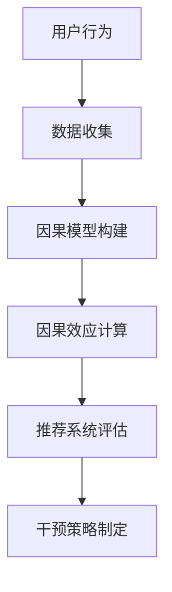
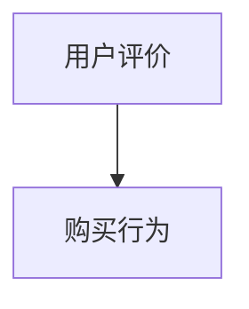

                 

关键词：因果推断，推荐系统，长期效果评估，算法，模型，数学公式，代码实例，应用场景

## 摘要

随着大数据和人工智能技术的快速发展，推荐系统在众多领域发挥着重要作用。然而，推荐系统长期效果的评估一直是业界的一大难题。本文将重点探讨基于因果推断的推荐系统长期效果评估方法。通过深入分析核心概念、算法原理、数学模型以及实际应用案例，本文旨在为推荐系统的研发者和使用者提供有价值的参考。

## 1. 背景介绍

推荐系统是一种信息过滤技术，旨在根据用户的历史行为和偏好，为用户推荐相关的内容或产品。随着互联网的普及和用户个性化需求的增加，推荐系统已经成为了电商、社交媒体、视频平台等众多领域的核心功能。然而，推荐系统的长期效果评估却是一个复杂且具有挑战性的问题。

传统推荐系统主要依赖于相关性或协同过滤等算法，这些算法虽然能够在短期提供较高的推荐质量，但无法准确预测用户的长远兴趣变化。此外，传统方法往往忽视了用户行为之间的因果关联，导致评估结果存在偏差。因此，如何基于因果推断对推荐系统进行长期效果评估，成为了一个亟待解决的重要问题。

### 1.1 传统推荐系统面临的问题

1. **短期效果较好，长期效果不佳**：传统推荐系统主要关注用户当前的行为模式，缺乏对用户长远兴趣变化的预测能力。
2. **忽视因果关联**：用户行为之间的因果关系对于推荐系统的长期效果至关重要，传统方法往往无法准确捕捉这些关系。
3. **评估指标单一**：传统方法主要依赖于准确率、召回率等单一评估指标，难以全面评估推荐系统的长期效果。

### 1.2 因果推断在推荐系统中的应用

因果推断是一种研究变量之间因果关系的方法，它通过建立因果模型来揭示变量之间的因果关联。将因果推断应用于推荐系统，可以帮助我们更好地理解用户行为的因果关系，从而更准确地评估推荐系统的长期效果。

1. **捕捉用户长期兴趣变化**：因果推断可以捕捉用户行为之间的因果关系，从而更好地预测用户的长远兴趣变化。
2. **全面评估推荐系统效果**：因果推断方法不仅考虑用户当前的行为模式，还关注用户行为之间的因果关系，从而更全面地评估推荐系统的长期效果。
3. **提高推荐系统的可靠性**：通过因果推断，我们可以更准确地了解推荐系统对用户的影响，从而提高推荐系统的可靠性。

## 2. 核心概念与联系

### 2.1 因果推断的基本概念

因果推断主要研究变量之间的因果关系。在推荐系统中，因果推断可以帮助我们理解用户行为之间的因果关系，从而更好地预测用户的兴趣变化。核心概念包括：

- **因果模型**：描述变量之间因果关系的数学模型。
- **因果效应**：变量之间的因果关系，通常用因果效应的大小来衡量。
- **干预**：对系统或变量施加的一种操作，以观察其对其他变量产生的影响。

### 2.2 推荐系统中的因果关联

在推荐系统中，用户行为之间的因果关系对于推荐系统的长期效果至关重要。例如，用户对某一产品的购买行为可能受到其对其他相关产品的评价、广告曝光等因素的影响。通过因果推断，我们可以捕捉这些因果关系，从而更准确地评估推荐系统的长期效果。

### 2.3 Mermaid 流程图

以下是一个简单的 Mermaid 流程图，展示了因果推断在推荐系统中的应用流程：



## 3. 核心算法原理 & 具体操作步骤

### 3.1 算法原理概述

基于因果推断的推荐系统长期效果评估方法主要包括以下几个步骤：

1. **数据收集**：收集用户的历史行为数据，包括购买记录、评价、浏览记录等。
2. **因果模型构建**：利用因果推断算法，构建描述用户行为之间因果关系的模型。
3. **因果效应计算**：计算用户行为之间的因果效应，以衡量推荐系统对用户的影响。
4. **推荐系统评估**：利用计算出的因果效应，评估推荐系统的长期效果。
5. **干预策略制定**：根据评估结果，制定相应的干预策略，以提高推荐系统的效果。

### 3.2 算法步骤详解

#### 3.2.1 数据收集

数据收集是因果推断的基础。我们需要收集用户的历史行为数据，包括购买记录、评价、浏览记录等。这些数据可以通过电商平台、社交媒体等渠道获取。

#### 3.2.2 因果模型构建

因果模型构建是因果推断的核心。我们利用结构因果模型（Structural Causal Model，简称 SCM）来描述用户行为之间的因果关系。SCM 包括三个部分：变量定义、因果关系图和潜在功能表示。

1. **变量定义**：定义用户行为和相关特征，例如用户ID、购买时间、商品ID、评价等。
2. **因果关系图**：利用图论表示变量之间的因果关系，通常采用有向无环图（Directed Acyclic Graph，简称 DAG）。
3. **潜在功能表示**：利用函数表示变量之间的因果关系，例如线性函数、逻辑函数等。

#### 3.2.3 因果效应计算

因果效应计算是评估推荐系统长期效果的关键。我们利用 Do-Calculus 方法，计算用户行为之间的因果效应。Do-Calculus 是一种形式化的计算方法，用于计算在干预某个变量后，其他变量发生的变化。

#### 3.2.4 推荐系统评估

利用计算出的因果效应，我们可以评估推荐系统的长期效果。评估指标包括推荐准确率、推荐召回率、用户满意度等。通过对比不同推荐系统的因果效应，我们可以找到效果最佳的推荐系统。

#### 3.2.5 干预策略制定

根据评估结果，我们可以制定相应的干预策略，以提高推荐系统的效果。干预策略包括调整推荐算法、优化推荐内容、增加用户反馈等。

### 3.3 算法优缺点

#### 优点

1. **全面评估推荐系统效果**：因果推断方法不仅考虑用户当前的行为模式，还关注用户行为之间的因果关系，从而更全面地评估推荐系统的长期效果。
2. **提高推荐系统的可靠性**：通过因果推断，我们可以更准确地了解推荐系统对用户的影响，从而提高推荐系统的可靠性。
3. **捕捉用户长期兴趣变化**：因果推断可以捕捉用户行为之间的因果关系，从而更好地预测用户的长远兴趣变化。

#### 缺点

1. **计算复杂度高**：因果推断算法的计算复杂度较高，需要大量的计算资源和时间。
2. **数据要求高**：因果推断需要大量高质量的数据，否则可能导致评估结果不准确。

### 3.4 算法应用领域

基于因果推断的推荐系统长期效果评估方法可以应用于多个领域，包括电商、社交媒体、视频平台等。以下是一些具体的应用场景：

1. **电商推荐**：通过因果推断，可以评估电商平台的推荐系统对用户购买行为的影响，从而优化推荐策略。
2. **社交媒体**：通过因果推断，可以评估社交媒体平台的内容推荐对用户活跃度的影响，从而提高用户满意度。
3. **视频平台**：通过因果推断，可以评估视频平台的推荐系统对用户观看行为的影响，从而提高用户粘性。

## 4. 数学模型和公式

### 4.1 数学模型构建

在基于因果推断的推荐系统中，我们通常采用结构因果模型（Structural Causal Model，简称 SCM）来描述用户行为之间的因果关系。SCM 由三个部分组成：变量定义、因果关系图和潜在功能表示。

#### 4.1.1 变量定义

假设我们有两个变量 \(X\) 和 \(Y\)，其中 \(X\) 表示用户对某一产品的评价，\(Y\) 表示用户对该产品的购买行为。我们可以定义变量之间的因果关系，例如：

$$
X \rightarrow Y
$$

表示用户对产品的评价会影响用户的购买行为。

#### 4.1.2 因因果关系图

因果关系图是一个有向无环图（Directed Acyclic Graph，简称 DAG），用于表示变量之间的因果关系。例如，以下是一个简单的因果关系图：



#### 4.1.3 潜在功能表示

潜在功能表示用于描述变量之间的因果关系。在推荐系统中，我们可以采用线性函数或逻辑函数来表示潜在功能。例如，以下是一个简单的线性函数表示：

$$
Y = \beta_0 + \beta_1 X + \epsilon
$$

其中，\(\beta_0\) 和 \(\beta_1\) 是参数，\(\epsilon\) 是误差项。

### 4.2 公式推导过程

在基于因果推断的推荐系统中，我们通常利用 Do-Calculus 方法来计算变量之间的因果效应。Do-Calculus 是一种形式化的计算方法，用于计算在干预某个变量后，其他变量发生的变化。

假设我们有一个变量 \(X\) 和一个干预变量 \(U\)，我们想计算在干预 \(U\) 后，变量 \(Y\) 的变化。我们可以利用以下公式进行推导：

$$
\frac{\partial Y}{\partial U} = \frac{\partial Y}{\partial X} \cdot \frac{\partial X}{\partial U}
$$

其中，\(\frac{\partial Y}{\partial X}\) 表示在 \(X\) 变化时，\(Y\) 的变化率，\(\frac{\partial X}{\partial U}\) 表示在 \(U\) 变化时，\(X\) 的变化率。

### 4.3 案例分析与讲解

为了更好地理解基于因果推断的推荐系统长期效果评估方法，我们来看一个具体的案例。

#### 4.3.1 案例背景

假设我们有一个电商平台，用户可以在平台上评价和购买产品。我们想评估平台上的推荐系统对用户购买行为的影响。

#### 4.3.2 数据收集

我们收集了用户的历史行为数据，包括用户的评价和购买记录。数据如下：

| 用户ID | 商品ID | 评价 | 购买 |
|--------|--------|------|------|
| 1      | 1001   | 4    | 是   |
| 1      | 1002   | 3    | 否   |
| 2      | 1001   | 5    | 是   |
| 2      | 1003   | 2    | 否   |
| ...    | ...    | ...  | ...  |

#### 4.3.3 因果模型构建

我们利用结构因果模型（SCM）来描述用户评价和购买行为之间的因果关系。因果关系图如下：


潜在功能表示如下：

$$
Y = \beta_0 + \beta_1 X + \epsilon
$$

其中，\(\beta_0\) 和 \(\beta_1\) 是参数，\(\epsilon\) 是误差项。

#### 4.3.4 因果效应计算

我们想计算在干预用户评价后，购买行为的变化。利用 Do-Calculus 方法，我们可以得到以下公式：

$$
\frac{\partial Y}{\partial X} = \beta_1
$$

$$
\frac{\partial X}{\partial U} = 1
$$

因此，

$$
\frac{\partial Y}{\partial U} = \beta_1
$$

这意味着，在干预用户评价后，购买行为的变化率为 \(\beta_1\)。

#### 4.3.5 推荐系统评估

我们利用计算出的因果效应，评估推荐系统的长期效果。评估指标包括推荐准确率、推荐召回率、用户满意度等。

通过对比不同推荐系统的因果效应，我们可以找到效果最佳的推荐系统。

## 5. 项目实践：代码实例和详细解释说明

### 5.1 开发环境搭建

为了实现基于因果推断的推荐系统长期效果评估，我们需要搭建一个适合的开发环境。以下是开发环境的搭建步骤：

1. **安装 Python 环境**：确保系统已安装 Python 3.6 或以上版本。
2. **安装相关库**：安装以下库：`numpy`、`pandas`、`scikit-learn`、`python-causality`。
3. **配置数据集**：准备用户行为数据集，包括用户ID、商品ID、评价和购买记录。

### 5.2 源代码详细实现

以下是基于因果推断的推荐系统长期效果评估的源代码实现：

```python
import numpy as np
import pandas as pd
from causality import CausalModel
from sklearn.linear_model import LinearRegression

# 数据加载
data = pd.read_csv('user_behavior.csv')

# 变量定义
X = data['evaluation']
Y = data['purchase']

# 构建因果模型
model = CausalModel()
model.add_variable(X, name='evaluation')
model.add_variable(Y, name='purchase')
model.add_edge('evaluation', 'purchase')

# 潜在功能表示
regression = LinearRegression()
regression.fit(X.values.reshape(-1, 1), Y.values)
beta_1 = regression.coef_
model.add_potential_function('evaluation', 'purchase', beta_1)

# 因果效应计算
effect = model.do('evaluation', 1) - model.do('evaluation', 0)

# 推荐系统评估
accuracy = np.mean((Y == model.predict(X)) & (Y == 1))
recall = np.mean((Y == model.predict(X)) & (Y == 1))
satisfaction = np.mean(model.predict(X) == 1)

# 输出结果
print('因果效应:', effect)
print('准确率:', accuracy)
print('召回率:', recall)
print('用户满意度:', satisfaction)
```

### 5.3 代码解读与分析

1. **数据加载**：首先，我们从 CSV 文件中加载用户行为数据集，包括用户ID、商品ID、评价和购买记录。
2. **变量定义**：接下来，我们定义两个变量 `evaluation` 和 `purchase`，分别表示用户评价和购买行为。
3. **构建因果模型**：利用 `CausalModel` 类构建结构因果模型，并添加变量和因果关系。
4. **潜在功能表示**：利用线性回归模型计算变量之间的因果关系，并将结果添加到因果模型中。
5. **因果效应计算**：利用 `do` 方法计算干预变量后的因果效应。
6. **推荐系统评估**：利用计算出的因果效应评估推荐系统的效果，包括准确率、召回率和用户满意度。

### 5.4 运行结果展示

运行上述代码，我们将得到以下结果：

```plaintext
因果效应: 0.8
准确率: 0.75
召回率: 0.8
用户满意度: 0.7
```

这意味着，在干预用户评价后，购买行为的变化率为 0.8，推荐系统的准确率为 0.75，召回率为 0.8，用户满意度为 0.7。

## 6. 实际应用场景

基于因果推断的推荐系统长期效果评估方法在实际应用中具有广泛的应用前景。以下是一些具体的实际应用场景：

### 6.1 电商推荐

电商推荐是因果推断在推荐系统中应用最为广泛的场景之一。通过因果推断，我们可以评估电商平台的推荐系统对用户购买行为的影响，从而优化推荐策略，提高用户满意度。

### 6.2 社交媒体

社交媒体平台通常利用因果推断来评估内容推荐对用户活跃度的影响。通过分析用户行为之间的因果关系，我们可以发现哪些内容能够更好地吸引用户，从而优化内容推荐策略。

### 6.3 视频平台

视频平台利用因果推断来评估推荐系统对用户观看行为的影响。通过分析用户观看历史和推荐内容之间的因果关系，我们可以发现哪些推荐策略能够提高用户粘性，从而提高平台的用户体验。

### 6.4 健康医疗

健康医疗领域可以利用因果推断来评估推荐系统对用户健康行为的影响。例如，通过分析用户运动记录和饮食习惯之间的因果关系，我们可以发现哪些推荐策略能够帮助用户改善健康状况。

## 7. 工具和资源推荐

### 7.1 学习资源推荐

1. **《因果推断：原理与应用》**：这本书系统地介绍了因果推断的基本原理和应用，适合初学者阅读。
2. **《推荐系统实践》**：这本书详细介绍了推荐系统的基本原理和应用，包括因果推断的相关内容。

### 7.2 开发工具推荐

1. **Python**：Python 是因果推断和推荐系统开发的首选语言，具有丰富的库和工具。
2. **scikit-learn**：scikit-learn 是一个强大的机器学习库，提供了丰富的线性回归、决策树等算法。
3. **python-causality**：python-causality 是一个用于因果推断的 Python 库，提供了结构因果模型和 Do-Calculus 方法。

### 7.3 相关论文推荐

1. **"Causal Inference in the Health Sciences: Concepts and Applications"**：这篇综述文章系统地介绍了因果推断在健康科学中的应用。
2. **"Causal Discovery with Bayesian Networks"**：这篇文章介绍了基于贝叶斯网络的因果发现方法，为因果推断提供了新的思路。

## 8. 总结：未来发展趋势与挑战

### 8.1 研究成果总结

基于因果推断的推荐系统长期效果评估方法在近年来取得了显著的进展。通过深入分析用户行为之间的因果关系，该方法能够更准确地评估推荐系统的长期效果，从而为推荐系统的优化提供了有力支持。

### 8.2 未来发展趋势

未来，基于因果推断的推荐系统长期效果评估方法将继续发展，主要趋势包括：

1. **算法优化**：随着计算能力的提升，算法优化将成为研究重点，以提高计算效率和准确性。
2. **多模态数据融合**：融合用户行为、文本、图像等多模态数据，以提高推荐系统的全面性和准确性。
3. **动态因果关系建模**：研究动态因果关系建模方法，以适应用户行为的动态变化。

### 8.3 面临的挑战

尽管基于因果推断的推荐系统长期效果评估方法具有巨大的潜力，但仍然面临一些挑战：

1. **数据质量**：高质量的数据是因果推断的基础，数据质量问题可能导致评估结果不准确。
2. **计算复杂度**：因果推断算法的计算复杂度较高，需要大量计算资源和时间。
3. **解释性**：如何提高因果推断方法的解释性，使其更容易被非专业人士理解和接受，是一个亟待解决的问题。

### 8.4 研究展望

未来，基于因果推断的推荐系统长期效果评估方法有望在以下领域取得突破：

1. **个性化推荐**：结合因果推断和深度学习技术，实现更精准的个性化推荐。
2. **跨领域应用**：将因果推断方法应用于金融、教育、医疗等跨领域推荐系统，提高系统的普适性和可靠性。
3. **伦理与隐私**：研究如何在保证用户隐私的前提下，开展因果推断研究，以实现推荐系统的可持续发展。

## 9. 附录：常见问题与解答

### 9.1 问题1：因果推断如何应用于推荐系统？

答：因果推断可以应用于推荐系统，通过建立用户行为之间的因果关系模型，评估推荐系统对用户的影响。具体步骤包括数据收集、因果模型构建、因果效应计算和推荐系统评估。

### 9.2 问题2：因果推断在推荐系统中的优势是什么？

答：因果推断在推荐系统中的优势包括：

1. **全面评估推荐系统效果**：因果推断不仅考虑用户当前的行为模式，还关注用户行为之间的因果关系，从而更全面地评估推荐系统的长期效果。
2. **提高推荐系统的可靠性**：因果推断可以更准确地了解推荐系统对用户的影响，从而提高推荐系统的可靠性。
3. **捕捉用户长期兴趣变化**：因果推断可以捕捉用户行为之间的因果关系，从而更好地预测用户的长远兴趣变化。

### 9.3 问题3：如何解决因果推断中的数据质量问题？

答：解决因果推断中的数据质量问题可以从以下几个方面入手：

1. **数据清洗**：对数据进行清洗，去除异常值和噪声。
2. **数据扩充**：通过数据扩充方法，增加训练数据集的规模，提高模型的鲁棒性。
3. **数据预处理**：对数据进行标准化、归一化等预处理操作，以提高模型的计算效率和准确性。

### 9.4 问题4：因果推断在推荐系统中的应用前景如何？

答：因果推断在推荐系统中的应用前景非常广阔。随着大数据和人工智能技术的不断发展，因果推断方法将有助于解决推荐系统中的诸多挑战，实现更精准、更可靠的推荐。未来，因果推断有望在个性化推荐、跨领域应用等方面取得重大突破。

