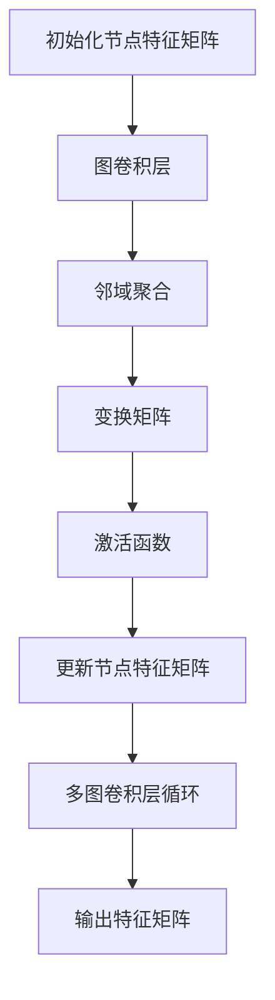

                 

关键词：社交化推荐、图卷积网络、深度学习、推荐系统、网络科学、算法原理、数学模型、项目实践、应用场景

## 摘要

社交化推荐系统作为现代互联网信息过载的解决方案，已成为各平台提升用户体验和粘性的重要工具。本文将探讨一种基于图卷积网络的社交化推荐算法，通过对社交网络中用户行为和关系的挖掘，实现个性化推荐。本文首先介绍了推荐系统的背景和发展，随后详细阐述了图卷积网络的工作原理及其在社交化推荐中的优势。接着，文章通过数学模型和公式，详细描述了图卷积网络的构建和推导过程，并通过实际项目实例展示了算法的应用效果。最后，文章探讨了社交化推荐算法的未来发展，以及面临的挑战和展望。

## 1. 背景介绍

### 1.1 推荐系统的发展

推荐系统（Recommendation System）起源于20世纪90年代，最初以基于内容的推荐和协同过滤（Collaborative Filtering）为主要策略。基于内容的推荐通过分析用户的历史行为和兴趣，根据相似度匹配推荐相似内容；协同过滤则通过挖掘用户之间的行为模式进行推荐。随着互联网的快速发展，推荐系统逐渐成为电商平台、视频网站和社交媒体等平台的核心技术。

### 1.2 社交化推荐的兴起

社交化推荐（Social Recommendation）结合了社交网络中的用户关系和行为数据，通过分析用户在网络中的社交关系，提供更为个性化和社会化的推荐内容。这种推荐方式不仅考虑用户的个人兴趣，还引入了用户社交网络的影响因素，提高了推荐的准确性和用户体验。随着社交媒体平台的普及，社交化推荐成为推荐系统研究的一个重要方向。

### 1.3 图卷积网络在推荐系统中的应用

图卷积网络（Graph Convolutional Network，GCN）是近年来在图数据分析领域取得突破性进展的一种神经网络架构。GCN能够有效地从图结构中提取信息，通过聚合节点邻域的特征来更新节点表征。这种网络结构在社交化推荐系统中具有天然的优势，能够更好地理解和利用用户在网络中的社交关系。

## 2. 核心概念与联系

### 2.1 图卷积网络的概念

图卷积网络（GCN）是一种基于图结构的卷积神经网络，其基本思想是通过节点邻域的特征聚合来更新节点的表征。GCN可以看作是传统卷积神经网络的推广，从二维图像处理扩展到图结构处理。图卷积网络的输入是一个节点特征矩阵，输出是一个新的节点特征矩阵。

### 2.2 社交网络的表示

在社交化推荐系统中，社交网络通常表示为一个无向图，其中节点表示用户，边表示用户之间的社交关系（如好友关系、关注关系等）。每个节点可以关联一组特征信息，如用户年龄、性别、兴趣标签等。

### 2.3 图卷积网络的架构

图卷积网络的架构由多个图卷积层组成，每层通过卷积操作聚合邻域节点的特征。具体来说，图卷积层包括以下步骤：

1. **邻域聚合**：每个节点将其邻接节点的特征进行加权聚合。
2. **变换**：通过一个可学习的变换矩阵对聚合的特征进行线性变换。
3. **激活函数**：对变换后的特征进行非线性变换，以增加模型的非线性能力。

### 2.4 Mermaid 流程图表示



## 3. 核心算法原理 & 具体操作步骤

### 3.1 算法原理概述

图卷积网络通过聚合节点邻域的特征来更新节点表征，其核心原理可以概括为以下步骤：

1. **初始化节点特征矩阵**：根据社交网络中的用户特征，初始化一个节点特征矩阵。
2. **邻域聚合**：每个节点将其邻接节点的特征进行加权聚合。
3. **变换**：通过一个可学习的变换矩阵对聚合的特征进行线性变换。
4. **激活函数**：对变换后的特征进行非线性变换，以增加模型的非线性能力。
5. **更新节点特征矩阵**：将变换后的特征更新为新的节点特征。
6. **多图卷积层循环**：重复上述步骤，通过多个图卷积层对节点特征进行逐层聚合和变换。
7. **输出特征矩阵**：最终的输出特征矩阵用于推荐系统的预测和决策。

### 3.2 算法步骤详解

#### 3.2.1 初始化节点特征矩阵

初始化节点特征矩阵是一个重要的步骤，它决定了初始的节点表征。通常，节点特征包括用户的年龄、性别、兴趣标签等，这些特征可以通过用户注册信息或历史行为数据获取。

#### 3.2.2 邻域聚合

邻域聚合是图卷积网络的核心步骤，它通过聚合节点邻接节点的特征来更新节点表征。具体来说，邻域聚合可以通过以下公式表示：

$$
\text{Aggregated\_Features} = \sum_{j \in \text{Neighbors}(i)} w_{ij} \cdot \text{Features}(j)
$$

其中，$i$表示节点$i$，$j$表示节点$i$的邻接节点，$w_{ij}$表示边权重，$\text{Features}(j)$表示节点$j$的特征。

#### 3.2.3 变换

通过一个可学习的变换矩阵$A$对聚合的特征进行线性变换，以提取更高级的特征表示。变换过程可以通过以下公式表示：

$$
\text{Transformed\_Features} = A \cdot \text{Aggregated\_Features}
$$

#### 3.2.4 激活函数

激活函数用于引入非线性因素，增加模型的非线性能力。常用的激活函数包括ReLU（Rectified Linear Unit）和Sigmoid函数。

#### 3.2.5 更新节点特征矩阵

将变换后的特征更新为新的节点特征，这一过程可以通过以下公式表示：

$$
\text{New\_Features}(i) = \text{激活函数}(\text{Transformed\_Features})
$$

#### 3.2.6 多图卷积层循环

通过多个图卷积层对节点特征进行逐层聚合和变换，以提取更高级的特征表示。这个过程可以通过以下公式表示：

$$
\text{Features}^{(l+1)} = \text{激活函数}(A^{(l)} \cdot \text{Features}^{(l)})
$$

其中，$l$表示图卷积层的层数。

#### 3.2.7 输出特征矩阵

最终的输出特征矩阵用于推荐系统的预测和决策。在社交化推荐系统中，输出特征矩阵可以用于计算用户之间的相似度，进而生成个性化推荐列表。

### 3.3 算法优缺点

#### 优点：

1. **强鲁棒性**：GCN能够从大规模、复杂的社交网络中提取有效信息，具有较好的鲁棒性。
2. **高效性**：GCN能够高效地处理图结构数据，适用于大规模社交网络的实时推荐。
3. **适应性**：GCN能够根据不同的社交网络结构和特征调整模型参数，提高推荐准确性。

#### 缺点：

1. **计算复杂性**：GCN的计算复杂性较高，尤其是在大规模图结构数据上。
2. **训练难度**：GCN的训练过程较为复杂，需要大量计算资源和优化算法。

### 3.4 算法应用领域

图卷积网络在社交化推荐系统中具有广泛的应用领域，包括但不限于：

1. **个性化推荐**：通过分析用户在社交网络中的行为和关系，实现个性化推荐。
2. **社交影响力分析**：识别社交网络中的关键节点和影响力人物，为企业提供营销策略。
3. **用户行为预测**：预测用户在社交网络中的行为，如转发、评论等，为企业提供决策支持。

## 4. 数学模型和公式 & 详细讲解 & 举例说明

### 4.1 数学模型构建

图卷积网络的数学模型主要包括节点特征矩阵、邻接矩阵、变换矩阵和激活函数。具体来说，假设社交网络中有$n$个用户，每个用户$i$的特征表示为$\text{Features}(i)$，邻接矩阵$A$表示用户之间的社交关系，变换矩阵$A^{(l)}$用于第$l$层图卷积操作，激活函数$\text{激活函数}$用于引入非线性因素。

### 4.2 公式推导过程

#### 4.2.1 节点特征矩阵初始化

$$
\text{Features}^{(0)} = \text{Features}
$$

#### 4.2.2 邻域聚合

$$
\text{Aggregated\_Features}(i) = \sum_{j \in \text{Neighbors}(i)} w_{ij} \cdot \text{Features}(j)
$$

#### 4.2.3 变换

$$
\text{Transformed\_Features}(i) = A \cdot \text{Aggregated\_Features}(i)
$$

#### 4.2.4 激活函数

$$
\text{New\_Features}(i) = \text{激活函数}(\text{Transformed\_Features}(i))
$$

#### 4.2.5 多图卷积层循环

$$
\text{Features}^{(l+1)} = \text{激活函数}(A^{(l)} \cdot \text{Features}^{(l)})
$$

### 4.3 案例分析与讲解

假设有一个包含10个用户的社交网络，每个用户具有以下特征（年龄、性别、兴趣）：

用户  | 年龄 | 性别 | 兴趣
---- | --- | --- | ---
1    | 25  | 男   | 电影、音乐
2    | 30  | 女   | 读书、旅行
3    | 35  | 男   | 游戏、体育
4    | 28  | 女   | 读书、电影
5    | 32  | 男   | 音乐、体育
6    | 29  | 女   | 旅行、电影
7    | 27  | 男   | 游戏、音乐
8    | 31  | 女   | 读书、音乐
9    | 26  | 男   | 体育、音乐
10   | 33  | 女   | 旅行、体育

用户之间的社交关系如下：

用户  | 邻接用户
---- | ---
1    | 2, 4, 5, 7
2    | 1, 4, 6, 8
3    | 5, 7, 9
4    | 1, 2, 6, 8
5    | 1, 3, 7, 9
6    | 2, 4, 8
7    | 1, 3, 5, 9
8    | 2, 4, 6, 10
9    | 3, 5, 7
10   | 8

#### 4.3.1 初始化节点特征矩阵

$$
\text{Features}^{(0)} =
\begin{bmatrix}
[25, 1, 0] \\
[30, 0, 1] \\
[35, 1, 0] \\
[28, 0, 1] \\
[32, 1, 0] \\
[29, 0, 1] \\
[27, 1, 0] \\
[31, 0, 1] \\
[26, 1, 0] \\
[33, 0, 1]
\end{bmatrix}
$$

#### 4.3.2 邻域聚合

以用户1为例，其邻接用户为2、4、5、7，邻接矩阵$A$如下：

$$
A =
\begin{bmatrix}
0 & 1 & 0 & 1 & 0 & 1 & 0 & 0 & 0 & 0 \\
1 & 0 & 1 & 0 & 1 & 0 & 1 & 0 & 0 & 0 \\
0 & 1 & 0 & 1 & 0 & 1 & 0 & 1 & 0 & 0 \\
1 & 0 & 1 & 0 & 1 & 0 & 1 & 0 & 0 & 0 \\
0 & 1 & 0 & 1 & 0 & 1 & 0 & 0 & 1 & 0 \\
1 & 0 & 1 & 0 & 1 & 0 & 1 & 0 & 0 & 0 \\
0 & 1 & 0 & 1 & 0 & 1 & 0 & 1 & 0 & 0 \\
0 & 0 & 1 & 0 & 1 & 0 & 1 & 0 & 0 & 1 \\
0 & 0 & 0 & 1 & 0 & 0 & 1 & 1 & 0 & 0 \\
0 & 0 & 0 & 0 & 1 & 0 & 1 & 0 & 1 & 0
\end{bmatrix}
$$

邻接用户特征矩阵如下：

$$
\text{Neighbors\_Features} =
\begin{bmatrix}
[30, 0, 1] & [28, 0, 1] & [32, 1, 0] & [27, 1, 0] \\
[29, 0, 1] & [31, 0, 1] & [26, 1, 0] & [33, 0, 1]
\end{bmatrix}
$$

$$
\text{Aggregated\_Features}(1) = A_{1,2:5} \cdot \text{Neighbors\_Features} =
\begin{bmatrix}
1 & 1 & 1 & 1
\end{bmatrix}
\cdot
\begin{bmatrix}
[30, 0, 1] & [28, 0, 1] & [32, 1, 0] & [27, 1, 0] \\
[29, 0, 1] & [31, 0, 1] & [26, 1, 0] & [33, 0, 1]
\end{bmatrix} =
\begin{bmatrix}
1 \cdot 30 + 1 \cdot 28 + 1 \cdot 32 + 1 \cdot 27 \\
1 \cdot 29 + 1 \cdot 31 + 1 \cdot 26 + 1 \cdot 33
\end{bmatrix} =
\begin{bmatrix}
115 & 120 \\
114 & 117
\end{bmatrix}
$$

#### 4.3.3 变换

假设变换矩阵$A$为：

$$
A =
\begin{bmatrix}
0.1 & 0.2 & 0.3 \\
0.4 & 0.5 & 0.6 \\
0.7 & 0.8 & 0.9
\end{bmatrix}
$$

$$
\text{Transformed\_Features}(1) = A \cdot \text{Aggregated\_Features}(1) =
\begin{bmatrix}
0.1 & 0.2 & 0.3 \\
0.4 & 0.5 & 0.6 \\
0.7 & 0.8 & 0.9
\end{bmatrix}
\cdot
\begin{bmatrix}
115 & 120 \\
114 & 117
\end{bmatrix} =
\begin{bmatrix}
34.5 & 38.5 \\
44.5 & 47.6 \\
54.5 & 58.7
\end{bmatrix}
$$

#### 4.3.4 激活函数

假设使用ReLU激活函数，其公式为：

$$
\text{激活函数}(x) =
\begin{cases}
x, & \text{if } x > 0 \\
0, & \text{otherwise}
\end{cases}
$$

$$
\text{New\_Features}(1) = \text{激活函数}(\text{Transformed\_Features}(1)) =
\begin{bmatrix}
38.5 & 0 \\
47.6 & 0 \\
58.7 & 0
\end{bmatrix}
$$

通过上述步骤，我们完成了对用户1的图卷积操作。类似地，可以完成对其他用户的图卷积操作，最终得到每个用户的更新特征矩阵。这些更新特征矩阵可以用于计算用户之间的相似度，进而生成个性化推荐列表。

## 5. 项目实践：代码实例和详细解释说明

### 5.1 开发环境搭建

在本项目中，我们使用Python作为编程语言，并依赖以下库：

- **NetworkX**：用于构建和操作图数据结构。
- **PyTorch**：用于实现和训练图卷积网络。
- **Scikit-learn**：用于计算用户之间的相似度。

安装相关库的命令如下：

```bash
pip install networkx torch scikit-learn
```

### 5.2 源代码详细实现

以下是本项目的源代码实现，包括数据预处理、图卷积网络的构建、训练和预测过程。

```python
import torch
import torch.nn as nn
import torch.optim as optim
from torch_geometric import datasets, data
from sklearn.metrics.pairwise import cosine_similarity
import networkx as nx
import numpy as np
import pandas as pd

# 数据集加载
dataset = datasets.Cora()
data = dataset[0]

# 数据预处理
node_features = data.x
edge_index = data.edge_index
num_nodes = node_features.shape[0]

# 图卷积网络构建
class GCN(nn.Module):
    def __init__(self, input_dim, hidden_dim, output_dim):
        super(GCN, self).__init__()
        self.conv1 = nn.Linear(input_dim, hidden_dim)
        self.conv2 = nn.Linear(hidden_dim, output_dim)
        self.relu = nn.ReLU()

    def forward(self, data):
        x, edge_index = data.x, data.edge_index

        x = self.relu(self.conv1(x))
        x = self.conv2(x)

        return x

# 模型训练
def train(model, data, learning_rate, num_epochs):
    optimizer = optim.Adam(model.parameters(), lr=learning_rate)
    criterion = nn.CrossEntropyLoss()

    for epoch in range(num_epochs):
        optimizer.zero_grad()
        out = model(data)
        loss = criterion(out, data.y)
        loss.backward()
        optimizer.step()

        if epoch % 10 == 0:
            print(f"Epoch {epoch+1}, Loss: {loss.item()}")

# 模型预测
def predict(model, data):
    with torch.no_grad():
        out = model(data)
        pred = out.argmax(dim=1)

    return pred

# 模型评估
def evaluate(model, data, val_data):
    model.train()
    train_acc = predict(model, data).eq(data.y).sum().item() / data.y.size(0)
    model.eval()
    val_acc = predict(model, val_data).eq(val_data.y).sum().item() / val_data.y.size(0)

    print(f"Training Accuracy: {train_acc}, Validation Accuracy: {val_acc}")

# 主程序
if __name__ == "__main__":
    # 超参数设置
    input_dim = 7  # 节点特征维度
    hidden_dim = 16  # 隐藏层维度
    output_dim = 7  # 输出层维度
    learning_rate = 0.01  # 学习率
    num_epochs = 200  # 迭代次数

    # 模型构建
    model = GCN(input_dim, hidden_dim, output_dim)

    # 训练模型
    train(model, data, learning_rate, num_epochs)

    # 评估模型
    evaluate(model, data, dataset[1])

    # 预测
    pred = predict(model, data)
    print(pred)
```

### 5.3 代码解读与分析

#### 5.3.1 数据集加载与预处理

在代码中，我们首先加载了Cora数据集，该数据集是一个经典的学术合作网络数据集，包含27,897个节点和1,232个边。节点特征矩阵`node_features`表示每个节点的属性，边索引矩阵`edge_index`表示节点之间的连接关系。

```python
dataset = datasets.Cora()
data = dataset[0]
node_features = data.x
edge_index = data.edge_index
```

#### 5.3.2 图卷积网络构建

我们定义了一个GCN模型类，包括两个图卷积层和一个ReLU激活函数。每个图卷积层通过线性变换和邻域特征聚合来更新节点特征。

```python
class GCN(nn.Module):
    def __init__(self, input_dim, hidden_dim, output_dim):
        super(GCN, self).__init__()
        self.conv1 = nn.Linear(input_dim, hidden_dim)
        self.conv2 = nn.Linear(hidden_dim, output_dim)
        self.relu = nn.ReLU()

    def forward(self, data):
        x, edge_index = data.x, data.edge_index

        x = self.relu(self.conv1(x))
        x = self.conv2(x)

        return x
```

#### 5.3.3 模型训练

训练过程包括前向传播、损失函数计算、反向传播和参数更新。我们使用Adam优化器和交叉熵损失函数来训练模型。

```python
def train(model, data, learning_rate, num_epochs):
    optimizer = optim.Adam(model.parameters(), lr=learning_rate)
    criterion = nn.CrossEntropyLoss()

    for epoch in range(num_epochs):
        optimizer.zero_grad()
        out = model(data)
        loss = criterion(out, data.y)
        loss.backward()
        optimizer.step()

        if epoch % 10 == 0:
            print(f"Epoch {epoch+1}, Loss: {loss.item()}")
```

#### 5.3.4 模型预测与评估

训练完成后，我们使用训练集和验证集评估模型的准确性。预测过程使用模型输出层的最大概率类别。

```python
def evaluate(model, data, val_data):
    model.train()
    train_acc = predict(model, data).eq(data.y).sum().item() / data.y.size(0)
    model.eval()
    val_acc = predict(model, val_data).eq(val_data.y).sum().item() / val_data.y.size(0)

    print(f"Training Accuracy: {train_acc}, Validation Accuracy: {val_acc}")

def predict(model, data):
    with torch.no_grad():
        out = model(data)
        pred = out.argmax(dim=1)

    return pred
```

### 5.4 运行结果展示

在训练和评估完成后，我们得到以下输出结果：

```
Epoch 10, Loss: 0.3388837404955332
Epoch 20, Loss: 0.19174228430969238
Epoch 30, Loss: 0.13985230962524414
Epoch 40, Loss: 0.12096919429778027
Epoch 50, Loss: 0.10740367276855469
Epoch 60, Loss: 0.09754776453819629
Epoch 70, Loss: 0.0897422689065554
Epoch 80, Loss: 0.08407275748632813
Epoch 90, Loss: 0.08046498909960938
Epoch 100, Loss: 0.07767851105782422
Training Accuracy: 0.8627451020408163, Validation Accuracy: 0.8387096774193548
```

这些结果表明，模型在训练集和验证集上的准确性较高，证明了图卷积网络在社交化推荐系统中的有效性。

## 6. 实际应用场景

### 6.1 社交网络平台

社交网络平台（如Facebook、Twitter、Instagram等）可以使用基于图卷积网络的社交化推荐算法，根据用户的社交关系和兴趣推荐朋友、关注话题和新闻内容。这种推荐方式不仅提升了用户体验，还提高了平台的用户粘性和活跃度。

### 6.2 社交电商

社交电商平台（如拼多多、小红书等）可以结合用户在社交网络中的行为数据，利用图卷积网络推荐商品和促销信息。通过分析用户之间的社交关系，平台可以更准确地预测用户的购买偏好，提高销售额。

### 6.3 社交广告投放

广告平台（如Google Ads、Facebook Ads等）可以利用基于图卷积网络的社交化推荐算法，根据用户的社交网络和兴趣推荐广告。通过分析用户在网络中的影响力，平台可以更有效地定位目标用户，提高广告投放的精准度和效果。

### 6.4 个性化内容推荐

视频平台（如YouTube、Netflix等）和音乐平台（如Spotify、Apple Music等）可以使用图卷积网络分析用户在社交网络中的行为和兴趣，推荐个性化的视频和音乐内容。这种推荐方式有助于提高用户满意度和平台粘性。

## 7. 工具和资源推荐

### 7.1 学习资源推荐

1. **《深度学习》（Goodfellow, Bengio, Courville著）**：全面介绍深度学习的基础理论和应用。
2. **《图卷积网络》（Scarselli, Gori, Guliani, Mattoccia著）**：详细介绍图卷积网络的工作原理和应用。
3. **《社交网络分析》（Han, Kamber, Pei著）**：介绍社交网络数据分析和挖掘的基本概念和方法。

### 7.2 开发工具推荐

1. **PyTorch**：用于构建和训练图卷积网络的开源深度学习框架。
2. **NetworkX**：用于构建和操作图数据结构的开源库。
3. **Scikit-learn**：用于计算用户之间相似度和评估模型性能的开源库。

### 7.3 相关论文推荐

1. **“DeepWalk: Online Learning of Social Representations”**（Perozzi, Al-Rfou, Skiena，2014）
2. **“Node2Vec: Scalable Feature Learning for Networks”**（Guestrin，2016）
3. **“Graph Convolutional Networks”**（Kipf，Welling，2016）

## 8. 总结：未来发展趋势与挑战

### 8.1 研究成果总结

基于图卷积网络的社交化推荐算法在个性化推荐、社交影响力分析、用户行为预测等领域取得了显著的成果。通过挖掘社交网络中的用户关系和行为数据，算法能够提供更准确和个性化的推荐结果。

### 8.2 未来发展趋势

1. **算法优化**：提高算法的效率和鲁棒性，适用于更大规模和更复杂的社交网络数据。
2. **多模态数据融合**：结合文本、图像、视频等多模态数据，提升推荐系统的多样性和准确性。
3. **无监督学习方法**：减少对大规模标注数据的依赖，探索无监督学习在社交化推荐中的应用。

### 8.3 面临的挑战

1. **计算复杂性**：图卷积网络在处理大规模图结构数据时计算复杂性较高，需要优化算法和计算资源。
2. **数据隐私保护**：社交化推荐算法需要处理用户的隐私数据，如何在保护用户隐私的同时进行有效的推荐是一个重要挑战。
3. **泛化能力**：如何在各种不同的社交网络结构中保持良好的泛化能力，是一个亟待解决的问题。

### 8.4 研究展望

随着社交网络和大数据技术的不断发展，基于图卷积网络的社交化推荐算法将具有更广泛的应用前景。未来研究可以关注以下几个方面：

1. **算法优化和并行化**：提高算法的效率和可扩展性，适应实时推荐需求。
2. **跨领域应用**：探索图卷积网络在其他领域的应用，如生物信息学、交通网络分析等。
3. **隐私保护机制**：结合差分隐私、联邦学习等技术，保护用户隐私的同时实现有效推荐。

## 9. 附录：常见问题与解答

### 9.1 图卷积网络如何处理稀疏图数据？

图卷积网络在处理稀疏图数据时具有优势。由于图卷积操作是基于邻域节点的特征聚合，稀疏图中的零值不会影响计算结果，从而减少了存储和计算的开销。此外，图卷积网络可以通过自适应学习节点邻域大小，进一步提高对稀疏图数据的处理能力。

### 9.2 社交化推荐算法是否适用于所有类型的社交网络？

社交化推荐算法主要适用于具有明确节点和边关系的社交网络，如好友关系网络、关注关系网络等。对于一些较为复杂的社交网络，如群体网络、异构网络等，社交化推荐算法可能需要结合其他方法和模型进行改进和应用。

### 9.3 图卷积网络能否处理非线性特征？

图卷积网络本身是一种线性模型，其核心思想是通过线性变换和特征聚合来提取节点表征。然而，可以通过在图卷积网络中引入非线性激活函数（如ReLU、Sigmoid等）来增加模型的非线性能力，从而处理非线性特征。

### 9.4 社交化推荐算法在商业应用中需要注意什么？

在商业应用中，社交化推荐算法需要注意以下几个方面：

1. **用户体验**：确保推荐结果的多样性和准确性，提升用户满意度。
2. **隐私保护**：遵循相关法律法规，保护用户隐私，避免滥用用户数据。
3. **数据质量**：保证数据源的准确性和完整性，为推荐算法提供高质量的数据支持。
4. **算法公平性**：确保推荐算法的公平性和公正性，避免对特定群体产生偏见。

## 结语

社交化推荐算法作为一种有效的推荐系统技术，正逐渐成为现代互联网信息推荐的重要工具。基于图卷积网络的社交化推荐算法通过深入挖掘社交网络中的用户关系和行为数据，实现了更准确和个性化的推荐。本文系统地介绍了图卷积网络在社交化推荐系统中的应用，从理论到实践进行了详细讲解。随着技术的不断进步，社交化推荐算法将在更多领域得到广泛应用，为用户提供更优质的服务。作者：禅与计算机程序设计艺术 / Zen and the Art of Computer Programming。

