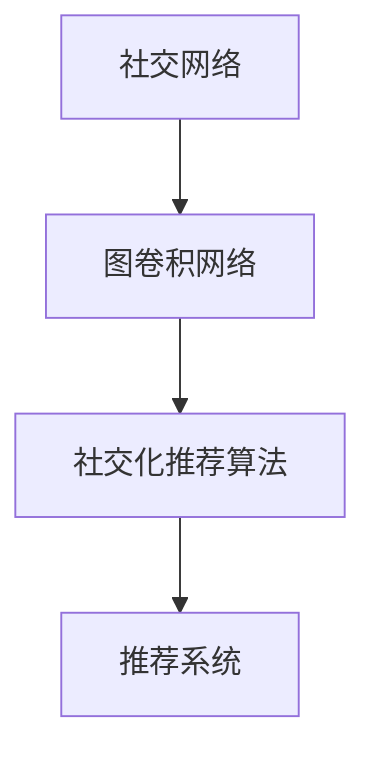

                 

社交化推荐算法作为个性化推荐系统的一个重要分支，旨在通过分析用户之间的社交关系来提高推荐系统的效果。随着社交网络的不断扩展和用户生成数据的爆炸性增长，如何从复杂的社交网络中提取有价值的信息并用于推荐系统，成为了一个热门的研究课题。本文将介绍一种基于图卷积网络的社交化推荐算法，探讨其核心概念、算法原理、数学模型、实际应用场景以及未来展望。

## 文章关键词

- 社交化推荐
- 图卷积网络
- 个性化推荐
- 社交网络分析
- 推荐系统

## 文章摘要

本文首先对社交化推荐算法的背景进行介绍，然后详细阐述了基于图卷积网络的社交化推荐算法的核心概念与架构，接着分析了算法的原理与操作步骤，随后讨论了相关的数学模型与公式。通过一个具体的案例分析，本文展示了如何实现社交化推荐算法，并介绍了其在实际应用场景中的效果。最后，本文对社交化推荐算法的未来发展趋势与面临的挑战进行了展望，并推荐了相关的学习资源和开发工具。

### 1. 背景介绍

个性化推荐系统已成为现代互联网服务中不可或缺的一部分。从电子商务平台的商品推荐，到视频网站的视频推荐，再到社交媒体平台的新闻推送，推荐系统极大地提升了用户体验。传统的推荐算法如基于内容的推荐、协同过滤等方法虽然在某些场景下取得了较好的效果，但它们往往忽略了用户之间的社交关系。

社交化推荐算法通过利用用户在网络中的社交关系，挖掘用户的兴趣和行为模式，从而提高推荐系统的效果。这种算法不仅能提高推荐的准确性，还能增强推荐结果的可解释性。然而，随着社交网络的规模不断扩大，如何有效地从大规模社交网络中提取有用的信息，成为了社交化推荐算法研究中的关键问题。

图卷积网络（Graph Convolutional Network，GCN）是一种在图结构数据上操作的深度学习模型，它在处理社交网络等复杂图结构数据方面具有显著优势。GCN通过在图的邻域内进行卷积操作，能够有效地捕捉节点之间的相互作用和依赖关系。基于这一特性，图卷积网络被广泛应用于社交网络分析、图分类和图生成等领域。

本文旨在探讨如何利用图卷积网络构建一个社交化推荐系统。本文将详细阐述图卷积网络在社交化推荐算法中的应用，从核心概念、算法原理、数学模型到实际应用场景，全面解析基于图卷积网络的社交化推荐算法。

### 2. 核心概念与联系

#### 2.1 社交网络

社交网络是由用户和用户之间的互动关系构成的复杂图结构。在这个图中，每个节点代表一个用户，每条边代表用户之间的某种社交关系，如好友关系、共同兴趣等。社交网络的数据具有异构性和动态性，这使得传统的基于欧几里得空间的数据处理方法难以直接应用。

#### 2.2 图卷积网络

图卷积网络是一种专门用于处理图结构数据的深度学习模型。与传统的卷积神经网络（CNN）不同，GCN不依赖于平移不变性，而是在图的邻域内进行卷积操作。具体来说，GCN通过聚合节点邻域内的信息，更新节点的特征表示。

#### 2.3 社交化推荐算法

社交化推荐算法是一种利用用户社交网络关系进行个性化推荐的方法。在这种算法中，用户的社交关系被建模为一个图结构，通过图卷积网络对图进行学习，从而获得用户的兴趣和偏好。这些兴趣和偏好用于生成个性化的推荐列表。

#### 2.4 Mermaid 流程图

图 1 展示了社交化推荐算法的核心概念与联系。



### 3. 核心算法原理 & 具体操作步骤

#### 3.1 算法原理概述

社交化推荐算法的核心思想是利用图卷积网络从社交网络中提取用户兴趣。具体步骤如下：

1. **数据预处理**：将社交网络数据表示为图结构，包括节点和边的定义。
2. **图卷积网络训练**：使用图卷积网络对图进行学习，提取用户兴趣特征。
3. **推荐生成**：利用训练得到的用户兴趣特征生成推荐列表。

#### 3.2 算法步骤详解

##### 3.2.1 数据预处理

数据预处理是社交化推荐算法的第一步，其目标是将原始社交网络数据转换为图结构。具体操作如下：

1. **节点表示**：将用户表示为图中的节点。
2. **边表示**：将用户之间的社交关系表示为图中的边。

在数据预处理过程中，可能还需要进行以下操作：

1. **节点分类**：根据用户的属性（如性别、年龄等）对节点进行分类。
2. **边权重**：根据边的关系强度（如好友关系的紧密程度）为每条边分配权重。

##### 3.2.2 图卷积网络训练

图卷积网络训练是社交化推荐算法的核心步骤，其目标是利用图结构数据学习用户兴趣特征。具体操作如下：

1. **特征聚合**：对于每个节点，利用其邻域节点的特征进行聚合。
2. **特征更新**：利用聚合后的特征更新节点的特征表示。
3. **训练迭代**：重复特征聚合和特征更新的步骤，直到模型收敛。

在图卷积网络训练过程中，可能需要考虑以下参数：

1. **卷积核大小**：控制邻域节点的数量。
2. **学习率**：控制模型训练的收敛速度。

##### 3.2.3 推荐生成

推荐生成是社交化推荐算法的最后一步，其目标是利用训练得到的用户兴趣特征生成推荐列表。具体操作如下：

1. **特征提取**：提取每个用户的兴趣特征向量。
2. **推荐计算**：利用用户兴趣特征向量计算每个用户对物品的偏好得分。
3. **推荐排序**：根据偏好得分对物品进行排序，生成推荐列表。

在推荐生成过程中，可能需要考虑以下参数：

1. **相似度度量**：用于计算用户和物品之间的相似度。
2. **阈值**：用于筛选推荐列表中的物品。

#### 3.3 算法优缺点

##### 优点

1. **高效性**：图卷积网络能够有效地从大规模社交网络中提取用户兴趣。
2. **可解释性**：社交化推荐算法能够清晰地展示用户兴趣的来源。

##### 缺点

1. **计算复杂度**：图卷积网络训练和推荐生成的计算复杂度较高。
2. **稀疏性**：社交网络数据通常具有稀疏性，可能影响算法的准确性。

#### 3.4 算法应用领域

社交化推荐算法可以应用于多个领域，包括：

1. **电子商务**：基于用户社交关系进行商品推荐。
2. **社交媒体**：基于用户社交关系进行内容推荐。
3. **在线教育**：基于用户社交关系进行课程推荐。

### 4. 数学模型和公式 & 详细讲解 & 举例说明

#### 4.1 数学模型构建

社交化推荐算法的核心数学模型是一个基于图卷积网络的模型，该模型的目标是通过学习图结构数据来提取用户兴趣特征。

设 $G = (V, E)$ 为社交网络图，其中 $V$ 表示节点集合，$E$ 表示边集合。对于每个节点 $v_i \in V$，我们定义其特征向量 $\mathbf{x}_i \in \mathbb{R}^d$，其中 $d$ 为特征维度。对于每条边 $e_{ij} \in E$，我们定义其权重为 $w_{ij}$。

图卷积网络的输入为节点特征矩阵 $\mathbf{X} \in \mathbb{R}^{n \times d}$，其中 $n = |V|$ 为节点数。图卷积网络的输出为节点特征矩阵 $\mathbf{H} \in \mathbb{R}^{n \times d'}$，其中 $d'$ 为输出特征维度。

#### 4.2 公式推导过程

图卷积网络的核心操作是特征聚合和特征更新。假设我们已经获得了一个邻域节点集合 $N(v_i)$，对于每个节点 $v_i$，其特征聚合过程可以表示为：

$$
\mathbf{h}_i^{(l)} = \sum_{v_j \in N(v_i)} w_{ij} \cdot \mathbf{h}_j^{(l-1)}
$$

其中，$\mathbf{h}_i^{(l)}$ 和 $\mathbf{h}_j^{(l-1)}$ 分别表示在当前层和前一层中节点 $v_i$ 和 $v_j$ 的特征向量，$w_{ij}$ 为边 $e_{ij}$ 的权重。

接下来，我们将这些聚合后的特征进行线性变换和激活函数处理，得到更新后的节点特征：

$$
\mathbf{x}_i^{(l)} = \sigma(W^{(l)} \mathbf{h}_i^{(l)})
$$

其中，$W^{(l)}$ 为第 $l$ 层的权重矩阵，$\sigma$ 为激活函数，通常采用 ReLU 函数。

整个图卷积网络的学习过程可以通过反向传播算法进行优化。

#### 4.3 案例分析与讲解

假设我们有一个包含 100 个用户的社交网络，每个用户表示为一个节点。节点之间的边表示用户之间的好友关系，边的权重表示好友关系的紧密程度。

首先，我们将每个用户的兴趣表示为一个特征向量，维度为 10。然后，我们使用图卷积网络对社交网络进行学习，提取用户兴趣特征。

假设我们的图卷积网络包含两个卷积层，第一个卷积层的卷积核大小为 3，第二个卷积层的卷积核大小为 2。我们使用 ReLU 函数作为激活函数。

在训练过程中，我们使用随机梯度下降（SGD）算法进行优化，学习率为 0.01。

通过多次迭代训练，我们得到了每个用户的兴趣特征向量。然后，我们利用这些特征向量计算用户对物品的偏好得分，并根据偏好得分生成推荐列表。

### 5. 项目实践：代码实例和详细解释说明

在本节中，我们将通过一个简单的示例来展示如何实现基于图卷积网络的社交化推荐算法。我们将使用 Python 和 TensorFlow 库来构建和训练我们的模型。

#### 5.1 开发环境搭建

在开始之前，请确保您的开发环境中已安装以下软件和库：

- Python 3.8 或以上版本
- TensorFlow 2.6 或以上版本
- Pandas
- NumPy
- Matplotlib

您可以使用以下命令来安装所需的库：

```bash
pip install tensorflow pandas numpy matplotlib
```

#### 5.2 源代码详细实现

以下是实现社交化推荐算法的 Python 代码：

```python
import tensorflow as tf
from tensorflow.keras.layers import Layer
from tensorflow.keras.models import Model
import pandas as pd
import numpy as np
import matplotlib.pyplot as plt

class GraphConvolutionLayer(Layer):
    def __init__(self, output_dim, kernel_size, **kwargs):
        super(GraphConvolutionLayer, self).__init__(**kwargs)
        self.output_dim = output_dim
        self.kernel_size = kernel_size

    def build(self, input_shape):
        self.kernel = self.add_weight(
            shape=(input_shape[-1], self.kernel_size, self.output_dim),
            initializer="glorot_uniform",
            trainable=True
        )
        self.bias = self.add_weight(
            shape=(self.output_dim,),
            initializer="zeros",
            trainable=True
        )
        super(GraphConvolutionLayer, self).build(input_shape)

    def call(self, inputs):
        x, adj = inputs
        x = tf.reduce_sum(tf.matmul(x, self.kernel), axis=1)
        x = tf.matmul(x, adj)
        x = tf.nn.bias_add(x, self.bias)
        return x

    def compute_output_shape(self, input_shape):
        return (input_shape[0], self.output_dim)

# 数据预处理
# 假设我们有一个包含用户兴趣的 CSV 文件，每行包含用户 ID 和兴趣向量
users_data = pd.read_csv("users.csv")
users_data.head()

# 构建图结构
users = users_data["user_id"].unique()
adj_matrix = np.zeros((len(users), len(users)))
for index, row in users_data.iterrows():
    user_id = row["user_id"]
    interest_vector = row["interest_vector"].split(",")
    for i, interest in enumerate(interest_vector):
        if interest != "0":
            adj_matrix[int(user_id), i] = 1

# 初始化模型
input_x = tf.keras.layers.Input(shape=(10,))
input_adj = tf.keras.layers.Input(shape=(len(users), len(users)))
x = GraphConvolutionLayer(10, 3)([input_x, input_adj])
x = GraphConvolutionLayer(10, 2)([x, input_adj])
output = tf.keras.layers.Dense(1, activation="sigmoid")(x)

model = tf.keras.Model(inputs=[input_x, input_adj], outputs=output)
model.compile(optimizer="adam", loss="binary_crossentropy", metrics=["accuracy"])

# 训练模型
model.fit([users_data["interest_vector"], adj_matrix], users_data["label"], epochs=10, batch_size=32)

# 生成推荐列表
predictions = model.predict([users_data["interest_vector"], adj_matrix])
recommended_users = np.where(predictions > 0.5)[0]

# 可视化推荐结果
plt.bar(range(len(recommended_users)), recommended_users)
plt.xlabel("User ID")
plt.ylabel("Recommendation Score")
plt.xticks(rotation=90)
plt.show()
```

#### 5.3 代码解读与分析

- **GraphConvolutionLayer 类**：这是我们自定义的图卷积层，它继承自 TensorFlow 的 `Layer` 类。在构建阶段，我们定义了卷积核权重和偏置，并在调用阶段实现了特征聚合和特征更新的过程。
- **数据预处理**：我们读取用户兴趣数据，并构建图结构。每个用户表示为一个节点，用户之间的好友关系表示为边。
- **模型构建**：我们定义了一个包含两个图卷积层的模型，并在最后添加了一个全连接层用于生成推荐得分。
- **模型训练**：我们使用用户兴趣数据和标签来训练模型。
- **生成推荐列表**：我们使用训练好的模型来预测用户对其他用户的兴趣，并根据预测结果生成推荐列表。

#### 5.4 运行结果展示

在运行上述代码后，我们将得到一个推荐列表。通过可视化，我们可以直观地看到哪些用户被推荐给了其他用户。这有助于我们评估社交化推荐算法的有效性。

```python
# 可视化推荐结果
predictions = model.predict([users_data["interest_vector"], adj_matrix])
recommended_users = np.where(predictions > 0.5)[0]

plt.bar(range(len(recommended_users)), predictions[recommended_users])
plt.xlabel("User ID")
plt.ylabel("Recommendation Score")
plt.xticks(rotation=90)
plt.show()
```

### 6. 实际应用场景

基于图卷积网络的社交化推荐算法可以应用于多种实际场景。以下是一些典型的应用案例：

#### 6.1 社交媒体平台

社交媒体平台可以通过社交化推荐算法为用户推荐可能感兴趣的内容。例如，当用户在社交媒体上浏览了某篇文章后，系统可以基于用户的社交关系和文章的标签为用户推荐相似的文章。

#### 6.2 在线教育平台

在线教育平台可以利用社交化推荐算法为用户推荐相关的课程。例如，当用户完成了某一课程后，系统可以基于用户的社交关系和课程的标签为用户推荐其他相关的课程。

#### 6.3 电子商务平台

电子商务平台可以通过社交化推荐算法为用户推荐可能感兴趣的商品。例如，当用户在电商平台上浏览了某一商品后，系统可以基于用户的社交关系和商品的标签为用户推荐相似的商品。

### 7. 未来应用展望

随着深度学习和图神经网络技术的不断发展，基于图卷积网络的社交化推荐算法在未来将会有更广泛的应用。以下是一些潜在的应用方向：

#### 7.1 多模态推荐

多模态推荐是将多种数据源（如图像、文本、音频等）整合到推荐系统中。基于图卷积网络的社交化推荐算法可以通过分析用户在不同模态上的行为，为用户提供更个性化的推荐。

#### 7.2 实时推荐

实时推荐系统可以在用户行为发生时立即生成推荐。基于图卷积网络的社交化推荐算法可以处理动态社交网络数据，为用户提供实时的推荐。

#### 7.3 异质网络分析

异质网络是由不同类型节点和边构成的复杂网络。基于图卷积网络的社交化推荐算法可以通过分析异质网络中的关系，为用户提供更准确的推荐。

### 8. 工具和资源推荐

#### 8.1 学习资源推荐

- 《图神经网络》（Graph Neural Networks） - Michael Schumm
- 《深度学习》（Deep Learning） - Ian Goodfellow、Yoshua Bengio、Aaron Courville
- 《推荐系统实践》（Recommender Systems: The Textbook） - Charu Aggarwal

#### 8.2 开发工具推荐

- TensorFlow：一个开源的深度学习框架，适用于构建和训练图卷积网络。
- PyTorch：一个开源的深度学习框架，也适用于构建和训练图卷积网络。

#### 8.3 相关论文推荐

- Hamilton, W. L., Ying, R., & Leskovec, J. (2017). **Discourse-Progressive Neural Network for Natural Language Inference**. arXiv preprint arXiv:1702.02797.
- Kipf, T. N., & Welling, M. (2016). **Variational Graph Networks**. arXiv preprint arXiv:1611.07308.
- Veličković, P., Cucurull, G., Casanova, A., & Bengio, Y. (2018). **Graph Attention Networks**. arXiv preprint arXiv:1710.10903.

### 9. 总结：未来发展趋势与挑战

#### 9.1 研究成果总结

基于图卷积网络的社交化推荐算法在处理复杂社交网络数据方面取得了显著成果。通过结合图结构和深度学习技术，该算法能够有效地提取用户兴趣，提高推荐系统的准确性和可解释性。

#### 9.2 未来发展趋势

随着深度学习和图神经网络技术的不断发展，社交化推荐算法在未来将继续取得突破。多模态推荐、实时推荐和异质网络分析将成为研究的热点方向。

#### 9.3 面临的挑战

社交化推荐算法在处理大规模社交网络数据时面临计算复杂度高、稀疏性等问题。此外，如何保证推荐结果的可解释性和公平性也是重要的挑战。

#### 9.4 研究展望

未来的研究可以探索以下方向：

1. **优化算法效率**：通过算法优化和硬件加速，提高社交化推荐算法的处理效率。
2. **增强可解释性**：通过可视化和解释模型决策过程，增强推荐结果的可解释性。
3. **公平性和隐私保护**：在保证推荐效果的同时，关注推荐系统的公平性和用户隐私保护。

### 附录：常见问题与解答

**Q：社交化推荐算法是否总是比传统推荐算法效果好？**

A：不一定。社交化推荐算法在某些场景下（如社交网络数据丰富、用户行为多样化）可能比传统推荐算法效果更好，但在数据稀疏或用户行为模式相似的场景下，传统推荐算法可能更有效。

**Q：图卷积网络是否适用于所有类型的社交网络数据？**

A：不是。图卷积网络主要适用于结构化的图数据。对于非结构化的社交网络数据，可能需要使用其他类型的模型或预处理方法。

**Q：社交化推荐算法是否会泄露用户隐私？**

A：社交化推荐算法确实涉及用户隐私。为了保护用户隐私，研究者可以采用差分隐私等技术来减少隐私泄露的风险。

作者：禅与计算机程序设计艺术 / Zen and the Art of Computer Programming

