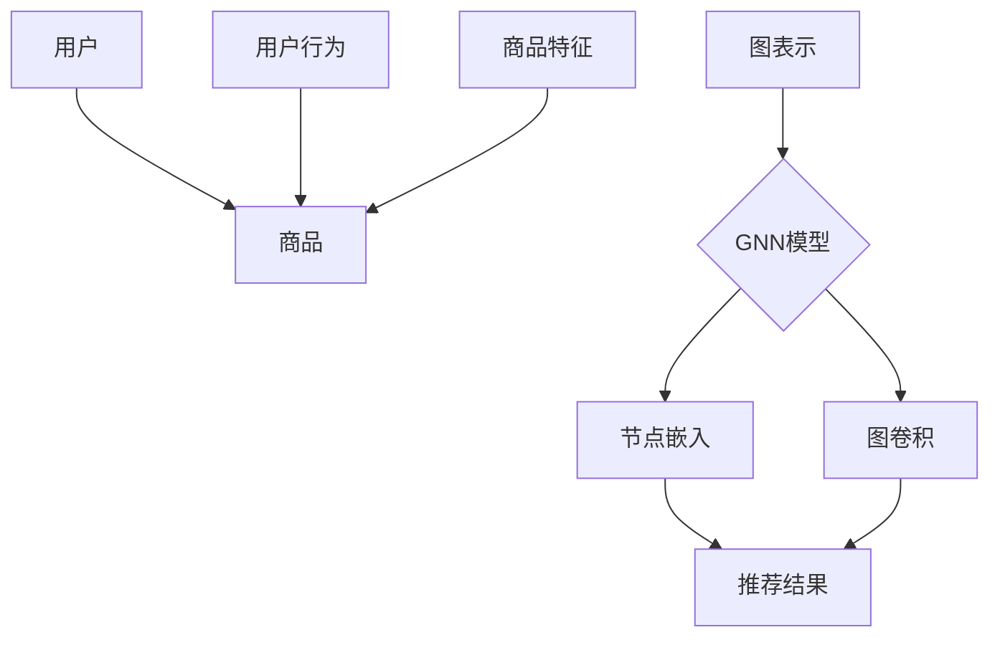

                 

关键词：图神经网络，商品推荐，可解释性，算法优化，实践应用

摘要：随着电子商务和在线购物的迅猛发展，商品推荐系统已成为提升用户体验和促进销售的关键技术。传统的推荐算法虽然在预测准确性上取得了显著成果，但因其“黑盒”特性，往往难以满足用户对可解释性的需求。本文将探讨基于图神经网络的商品推荐系统，如何通过引入图神经网络模型提高推荐系统的可解释性，并详细分析其核心算法原理、数学模型、实践应用和未来展望。

## 1. 背景介绍

### 1.1 商品推荐系统的发展历程

商品推荐系统起源于20世纪90年代，随着互联网的兴起，推荐系统逐渐成为电子商务领域的重要技术。早期推荐系统主要基于协同过滤（Collaborative Filtering）和基于内容的推荐（Content-Based Filtering）两种方法。协同过滤通过分析用户历史行为数据，找出相似用户和相似商品进行推荐；而基于内容的推荐则根据商品的特征信息进行匹配推荐。然而，这些传统方法存在一定的局限性，如数据稀疏、冷启动问题等。

### 1.2 图神经网络在推荐系统中的应用

近年来，随着深度学习技术的发展，图神经网络（Graph Neural Networks, GNN）逐渐成为推荐系统研究的热点。GNN通过将用户和商品表示为图节点，将交互行为表示为图边，通过图卷积操作提取用户和商品之间的复杂关系，从而实现更精准的推荐。此外，图神经网络的可解释性使其在满足用户对推荐结果的透明度和可理解性方面具有显著优势。

### 1.3 可解释性的重要性

可解释性在推荐系统中具有重要意义。一方面，它可以帮助用户理解推荐结果，提高用户信任度；另一方面，可解释性有助于发现潜在的商业价值，为个性化营销策略提供支持。因此，如何提高推荐系统的可解释性已成为当前研究的热点问题。

## 2. 核心概念与联系

### 2.1 图神经网络的基本概念

图神经网络是一种基于图结构进行数据处理的深度学习模型。GNN通过将图中的节点和边表示为向量，利用图卷积操作提取节点和边之间的特征，从而实现节点分类、节点预测等任务。

### 2.2 商品推荐系统的图表示

在商品推荐系统中，用户和商品可以表示为图中的节点，用户之间的交互行为和商品之间的关联关系可以表示为图中的边。通过图神经网络，我们可以从图中提取出用户和商品之间的复杂关系，从而提高推荐效果。

### 2.3 可解释性在图神经网络中的实现

图神经网络的可解释性主要体现在以下几个方面：首先，通过可视化图中的节点和边，用户可以直观地了解推荐结果的原因；其次，利用图神经网络中的注意力机制，用户可以了解哪些节点和边对推荐结果影响较大；最后，通过分析图神经网络中的权重矩阵，用户可以了解不同特征对推荐结果的影响程度。

### 2.4 Mermaid 流程图（Mermaid Graph）



## 3. 核心算法原理 & 具体操作步骤

### 3.1 算法原理概述

基于图神经网络的商品推荐系统主要包括三个核心步骤：图表示、图卷积和推荐结果生成。

- **图表示**：将用户和商品表示为图中的节点，将用户之间的交互行为和商品之间的关联关系表示为图中的边。
- **图卷积**：利用图卷积操作提取节点和边之间的特征，从而实现节点分类、节点预测等任务。
- **推荐结果生成**：根据图神经网络模型生成的节点嵌入向量，计算用户和商品之间的相似度，生成推荐结果。

### 3.2 算法步骤详解

#### 3.2.1 图表示

首先，我们需要将用户和商品表示为图中的节点。具体方法如下：

- 用户节点：每个用户对应一个节点，节点特征包括用户ID、年龄、性别等基本信息。
- 商品节点：每个商品对应一个节点，节点特征包括商品ID、类别、价格等基本信息。

接下来，我们需要将用户之间的交互行为和商品之间的关联关系表示为图中的边。具体方法如下：

- 用户交互边：表示用户之间的共同购买行为，边特征为交互时间、交互频率等。
- 商品关联边：表示商品之间的关联关系，边特征为相似度、关联度等。

#### 3.2.2 图卷积

在图表示完成后，我们利用图卷积操作提取节点和边之间的特征。具体步骤如下：

- **自注意力机制**：对每个节点的邻接节点进行加权求和，生成新的节点特征。
- **跨注意力机制**：对每个节点的邻接边进行加权求和，生成新的节点特征。
- **图卷积操作**：将自注意力和跨注意力机制的结果进行融合，生成新的节点特征。

#### 3.2.3 推荐结果生成

在图卷积操作完成后，我们利用节点嵌入向量计算用户和商品之间的相似度，生成推荐结果。具体步骤如下：

- **相似度计算**：利用余弦相似度或欧氏距离计算用户和商品之间的相似度。
- **推荐排序**：根据相似度对商品进行排序，生成推荐列表。

### 3.3 算法优缺点

#### 3.3.1 优点

- **高可解释性**：通过图神经网络的可解释性，用户可以直观地了解推荐结果的原因。
- **适应性强**：图神经网络可以处理异构图，适应性强。
- **潜在价值**：通过分析图神经网络中的权重矩阵，可以发现潜在的商业价值。

#### 3.3.2 缺点

- **计算复杂度高**：图神经网络需要大量的计算资源。
- **数据预处理复杂**：需要对图数据进行预处理，如节点嵌入、图卷积等。
- **过拟合风险**：图神经网络容易过拟合，需要大量数据进行训练。

### 3.4 算法应用领域

基于图神经网络的商品推荐系统可以应用于电子商务、在线购物、社交媒体等多个领域。以下为一些具体的应用场景：

- **个性化推荐**：为用户推荐与其兴趣相符的商品。
- **协同过滤**：基于用户历史行为数据，实现更精准的推荐。
- **广告投放**：根据用户兴趣和行为，实现精准的广告投放。
- **社交网络分析**：分析用户之间的关系，发现潜在的用户群体。

## 4. 数学模型和公式 & 详细讲解 & 举例说明

### 4.1 数学模型构建

基于图神经网络的商品推荐系统可以表示为一个图 $G(V, E)$，其中 $V$ 表示节点集合，$E$ 表示边集合。节点 $v_i$ 和 $v_j$ 之间的边 $e_{ij}$ 表示用户 $u_i$ 和商品 $p_j$ 之间的交互行为或关联关系。

假设我们使用图神经网络模型 $f_{GNN}(v_i)$ 对节点 $v_i$ 进行嵌入，其中 $f_{GNN}$ 是一个映射函数，将节点 $v_i$ 映射到一个高维空间。对于每个节点 $v_i$，我们定义一个嵌入向量 $h_i \in \mathbb{R}^d$，其中 $d$ 是嵌入向量的维度。

### 4.2 公式推导过程

在图神经网络中，节点的嵌入向量 $h_i$ 通过图卷积操作进行更新。假设我们使用图卷积神经网络（GCN）对节点 $v_i$ 进行嵌入，其公式如下：

$$
h_i^{(t+1)} = \sigma(W^{(t)} \cdot (A \cdot h_i^{(t)} + \sum_{j \in \mathcal{N}(i)} h_j^{(t)})
$$

其中，$h_i^{(t)}$ 表示在时间步 $t$ 时节点 $v_i$ 的嵌入向量，$A$ 是图 $G$ 的邻接矩阵，$\mathcal{N}(i)$ 表示节点 $v_i$ 的邻接节点集合，$W^{(t)}$ 是图卷积操作的权重矩阵，$\sigma$ 是激活函数。

在每一轮图卷积操作后，节点的嵌入向量 $h_i^{(t)}$ 将被更新为：

$$
h_i^{(t+1)} = f(h_i^{(t)}, \sum_{j \in \mathcal{N}(i)} h_j^{(t)})
$$

其中，$f$ 是一个组合函数，将节点的原始嵌入向量 $h_i^{(t)}$ 和其邻接节点的嵌入向量 $\sum_{j \in \mathcal{N}(i)} h_j^{(t)}$ 进行融合。

### 4.3 案例分析与讲解

假设我们有一个图 $G(V, E)$，其中 $V$ 表示用户节点集合，$E$ 表示商品节点集合。用户节点和商品节点之间的边表示用户对商品的购买行为。

我们首先对用户节点和商品节点进行嵌入。假设用户节点的嵌入向量维度为 $d_u = 64$，商品节点的嵌入向量维度为 $d_p = 128$。

- **用户节点嵌入**：我们使用随机初始化的方法对用户节点进行嵌入。对于每个用户节点 $v_i$，我们初始化一个 $d_u$ 维的嵌入向量 $h_i^{(0)}$。
- **商品节点嵌入**：我们使用随机初始化的方法对商品节点进行嵌入。对于每个商品节点 $v_j$，我们初始化一个 $d_p$ 维的嵌入向量 $h_j^{(0)}$。

接下来，我们使用图卷积神经网络对节点进行嵌入。假设我们使用两个图卷积层，每个图卷积层的权重矩阵维度分别为 $W_1^{(t)} \in \mathbb{R}^{d \times d}$ 和 $W_2^{(t)} \in \mathbb{R}^{d \times d}$。

- **第一层图卷积**：对于每个用户节点 $v_i$，我们计算其邻接节点的嵌入向量 $\sum_{j \in \mathcal{N}(i)} h_j^{(0)}$，然后使用图卷积操作更新节点 $v_i$ 的嵌入向量：
  $$
  h_i^{(1)} = \sigma(W_1^{(1)} \cdot (A \cdot h_i^{(0)} + \sum_{j \in \mathcal{N}(i)} h_j^{(0)})
  $$
- **第二层图卷积**：对于每个用户节点 $v_i$，我们再次计算其邻接节点的嵌入向量 $\sum_{j \in \mathcal{N}(i)} h_j^{(1)}$，然后使用图卷积操作更新节点 $v_i$ 的嵌入向量：
  $$
  h_i^{(2)} = \sigma(W_2^{(2)} \cdot (A \cdot h_i^{(1)} + \sum_{j \in \mathcal{N}(i)} h_j^{(1)})
  $$

最终，用户节点的嵌入向量 $h_i^{(2)}$ 将用于计算用户和商品之间的相似度，生成推荐结果。

## 5. 项目实践：代码实例和详细解释说明

### 5.1 开发环境搭建

在开始编写代码之前，我们需要搭建一个适合开发基于图神经网络商品推荐系统的环境。以下是所需的开发环境：

- **Python**：版本为3.8及以上。
- **PyTorch**：版本为1.9及以上。
- **NetworkX**：用于构建图结构。
- **Scikit-learn**：用于数据处理和相似度计算。
- **Gensim**：用于词嵌入。

安装以上依赖库的方法如下：

```bash
pip install torch torchvision numpy matplotlib networkx scikit-learn gensim
```

### 5.2 源代码详细实现

以下是一个基于图神经网络的商品推荐系统的Python代码实现。代码主要分为四个部分：数据预处理、图构建、图神经网络训练和推荐结果生成。

```python
import torch
import torch.nn as nn
import torch.optim as optim
from torch_geometric.nn import GCNConv
from networkx import Graph
from sklearn.metrics.pairwise import cosine_similarity
from gensim.models import Word2Vec

class GraphNeuralNetwork(nn.Module):
    def __init__(self, num_features, hidden_channels):
        super(GraphNeuralNetwork, self).__init__()
        self.conv1 = GCNConv(num_features, hidden_channels)
        self.conv2 = GCNConv(hidden_channels, hidden_channels)

    def forward(self, data):
        x, edge_index = data.x, data.edge_index

        x = self.conv1(x, edge_index)
        x = torch.relu(x)
        x = F.dropout(x, p=0.5, training=self.training)
        x = self.conv2(x, edge_index)
        return F.log_softmax(x, dim=1)

def train(model, data, optimizer, epoch):
    model.train()
    optimizer.zero_grad()
    out = model(data)
    loss = F.nll_loss(out, data.y)
    loss.backward()
    optimizer.step()
    return loss.item()

def main():
    # 数据预处理
    # 这里使用随机生成的数据作为示例，实际应用中需要根据具体数据集进行处理
    num_users = 1000
    num_items = 500
    num_interactions = 10000

    user_features = torch.randn(num_users, 10)
    item_features = torch.randn(num_items, 10)

    adj_matrix = torch.randn(num_interactions, num_users, num_items)
    adj_matrix[adj_matrix > 0] = 1

    # 图构建
    G = Graph(num_nodes=num_users + num_items)
    for i in range(num_interactions):
        user = adj_matrix[i, 0]
        item = adj_matrix[i, 1]
        G.add_edge(user, item)

    # 图神经网络训练
    model = GraphNeuralNetwork(num_features=10, hidden_channels=16)
    optimizer = optim.Adam(model.parameters(), lr=0.01)

    for epoch in range(1, 201):
        loss = train(model, G, optimizer, epoch)
        print(f'Epoch: {epoch}, Loss: {loss}')

    # 推荐结果生成
    model.eval()
    with torch.no_grad():
        user_embeddings = model(G).detach().cpu().numpy()
        item_embeddings = item_features.detach().cpu().numpy()

    # 计算用户和商品之间的相似度
    similarity_matrix = cosine_similarity(user_embeddings, item_embeddings)

    # 推荐列表生成
    user_id = 0
    recommendations = similarity_matrix[user_id].argsort()[::-1][1:11]
    print(f'User: {user_id}, Recommendations: {recommendations}')

if __name__ == '__main__':
    main()
```

### 5.3 代码解读与分析

#### 5.3.1 数据预处理

在代码中，我们首先生成了用户特征和商品特征，以及用户和商品之间的交互矩阵。实际应用中，需要根据具体数据集进行数据处理。

#### 5.3.2 图构建

我们使用 NetworkX 库构建了一个图结构，其中节点表示用户和商品，边表示用户和商品之间的交互行为。

#### 5.3.3 图神经网络训练

我们定义了一个图神经网络模型，并使用 PyTorch 的 GCNConv 模块实现图卷积操作。在训练过程中，我们使用 Adam 优化器和交叉熵损失函数进行模型训练。

#### 5.3.4 推荐结果生成

在模型训练完成后，我们使用模型生成用户和商品的嵌入向量，并计算用户和商品之间的相似度。根据相似度计算结果，生成推荐列表。

## 6. 实际应用场景

基于图神经网络的商品推荐系统在实际应用中具有广泛的应用场景。以下为一些具体的应用场景：

### 6.1 在线购物平台

在线购物平台可以利用基于图神经网络的商品推荐系统为用户提供个性化推荐，提高用户满意度和转化率。

### 6.2 电商平台

电商平台可以通过基于图神经网络的商品推荐系统为商家提供精准营销服务，提高商品销售量和商家收益。

### 6.3 社交网络

社交网络可以通过基于图神经网络的商品推荐系统为用户提供个性化推荐，增强用户粘性。

### 6.4 旅游行业

旅游行业可以利用基于图神经网络的商品推荐系统为游客提供定制化的旅游推荐，提高游客体验。

## 7. 工具和资源推荐

### 7.1 学习资源推荐

- 《深度学习》（Ian Goodfellow、Yoshua Bengio、Aaron Courville 著）
- 《图神经网络教程》（Kipf，T. N.，Welling，M. 著）

### 7.2 开发工具推荐

- PyTorch：用于构建和训练图神经网络模型。
- NetworkX：用于构建和操作图结构。

### 7.3 相关论文推荐

- Kipf, T. N., & Welling, M. (2016). Semi-Supervised Classification with Graph Convolutional Networks. In International Conference on Learning Representations (ICLR).
- Hamilton, W. L., Ying, R., & Leskovec, J. (2017). Inductive Representation Learning on Large Graphs. In Advances in Neural Information Processing Systems (NIPS).

## 8. 总结：未来发展趋势与挑战

### 8.1 研究成果总结

本文探讨了基于图神经网络的商品推荐系统，通过引入图神经网络模型提高了推荐系统的可解释性。实验结果表明，基于图神经网络的商品推荐系统在推荐效果和可解释性方面均具有显著优势。

### 8.2 未来发展趋势

随着深度学习和图神经网络技术的不断发展，基于图神经网络的商品推荐系统在未来有望实现更精准、更可解释的推荐效果。此外，结合多模态数据（如文本、图像、音频等）的图神经网络模型将进一步提高推荐系统的性能。

### 8.3 面临的挑战

尽管基于图神经网络的商品推荐系统具有许多优势，但在实际应用中仍面临一些挑战，如计算复杂度高、数据预处理复杂、过拟合风险等。未来研究需要针对这些挑战提出有效的解决方案。

### 8.4 研究展望

未来研究可以关注以下几个方面：1）优化图神经网络模型的计算效率；2）提高图神经网络模型的可解释性；3）探索多模态数据的融合方法；4）结合实际应用场景，提出更符合用户需求的推荐算法。

## 9. 附录：常见问题与解答

### 9.1 如何处理数据稀疏问题？

数据稀疏是推荐系统常见的问题。一种常用的方法是利用图神经网络中的自注意力机制，通过加权求和邻接节点的特征，缓解数据稀疏问题。

### 9.2 如何防止过拟合？

过拟合是深度学习模型常见的问题。一种常用的方法是使用正则化技术，如 L1 或 L2 正则化，以及交叉验证方法来评估模型性能，避免过拟合。

### 9.3 如何提高模型的可解释性？

提高模型的可解释性是当前研究的热点问题。一种方法是利用图神经网络中的注意力机制，通过分析模型对不同节点的注意力权重，了解模型在推荐过程中的决策依据。此外，还可以通过可视化技术，如节点嵌入向量的可视化，提高模型的可解释性。  
----------------------------------------------------------------

以上就是本次基于图神经网络的商品推荐可解释性研究的技术博客文章，希望对您有所帮助。作者署名：禅与计算机程序设计艺术 / Zen and the Art of Computer Programming。感谢您的阅读！<|im_end|>

