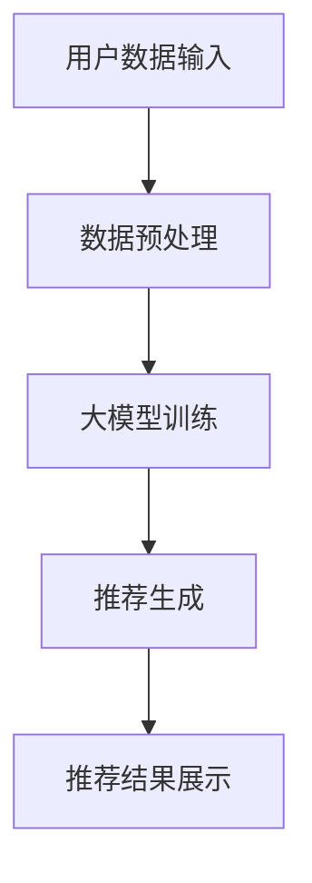

                 

关键词：商品推荐系统、大模型、解释性、人工智能、机器学习

## 摘要

本文深入探讨了基于大模型的商品推荐系统的解释性问题。随着人工智能和机器学习技术的快速发展，大模型在商品推荐领域展现出了强大的能力，但同时也带来了解释性不足的问题。本文首先介绍了大模型在商品推荐中的应用，然后重点分析了大模型的解释性挑战，并提出了相应的解决方案。通过结合实例和数学模型，本文展示了如何提升大模型在商品推荐中的解释性，为未来的研究和应用提供了有益的参考。

## 1. 背景介绍

### 1.1 商品的推荐系统

商品的推荐系统是电子商务领域的关键组成部分，它能够根据用户的兴趣和购买历史，为其推荐可能感兴趣的商品。推荐系统不仅能够提高用户的购物体验，还能够为电商平台带来更高的销售额和用户粘性。传统的推荐系统主要依赖于统计方法和基于内容的推荐方法，但这些方法在面对复杂用户行为和海量数据时，往往效果不佳。

### 1.2 大模型的发展

随着人工智能和机器学习技术的进步，大模型（如深度神经网络、Transformer等）逐渐成为学术界和工业界的关注焦点。大模型通过学习大量的数据和参数，能够在各种任务中取得显著的性能提升。特别是在商品推荐领域，大模型的引入极大地提升了推荐的准确性和多样性。

### 1.3 大模型的挑战

然而，大模型的强大性能也带来了新的挑战，其中最显著的问题之一是解释性不足。传统的机器学习算法，如线性回归和决策树，具有较高的解释性，用户可以清晰地理解模型的决策过程。而大模型由于其复杂性和黑盒特性，使得其决策过程变得难以解释，这对商业应用和用户信任提出了挑战。

## 2. 核心概念与联系

为了更好地理解大模型在商品推荐系统中的应用和解释性挑战，我们需要引入一些核心概念和相关的架构图。

### 2.1 大模型在商品推荐中的架构

以下是一个使用Mermaid绘制的简单流程图，展示了大模型在商品推荐系统中的基本架构。



### 2.2 大模型的解释性挑战

大模型的解释性挑战主要体现在以下几个方面：

1. **复杂性与透明度**：大模型的结构复杂，参数众多，导致其决策过程不透明。
2. **局部解释性**：大模型在局部上的解释性较差，难以直观地理解特征对预测结果的影响。
3. **全局解释性**：大模型的全局解释性不足，难以发现潜在的模式和规律。

为了解决这些挑战，我们需要在大模型的设计和应用中引入解释性机制。

## 3. 核心算法原理 & 具体操作步骤

### 3.1 算法原理概述

基于大模型的商品推荐系统主要依赖于以下几个核心算法：

1. **用户行为数据挖掘**：通过分析用户的浏览、购买等行为数据，提取用户的兴趣和偏好。
2. **特征工程**：将原始数据转换为可用于训练的特征向量。
3. **大模型训练**：使用深度学习模型对特征向量进行训练，以学习用户和商品之间的复杂关系。
4. **推荐生成**：根据训练好的模型，为用户生成个性化的商品推荐。

### 3.2 算法步骤详解

#### 3.2.1 用户行为数据挖掘

首先，我们需要收集用户的浏览、购买等行为数据。这些数据可以来自用户行为日志、电商平台内部数据等。

#### 3.2.2 特征工程

接下来，我们对原始数据进行特征提取和工程。特征工程是推荐系统成功的关键步骤，它涉及到以下几个方面：

- **用户特征**：如用户年龄、性别、地理位置、消费能力等。
- **商品特征**：如商品类别、价格、品牌、销量等。
- **行为特征**：如浏览时间、购买频率、购买量等。

#### 3.2.3 大模型训练

使用深度学习模型对特征向量进行训练。在这里，我们可以选择不同的模型架构，如卷积神经网络（CNN）、循环神经网络（RNN）、Transformer等。训练过程主要包括以下几个步骤：

- **数据预处理**：对数据集进行归一化、去噪等处理。
- **模型构建**：定义模型结构，包括输入层、隐藏层和输出层。
- **模型训练**：通过反向传播算法，调整模型参数，以最小化损失函数。
- **模型评估**：使用验证集和测试集对模型进行评估，选择最优模型。

#### 3.2.4 推荐生成

最后，根据训练好的模型，为用户生成个性化的商品推荐。推荐过程主要包括以下几个步骤：

- **特征提取**：提取当前用户的特征向量。
- **模型预测**：使用训练好的模型，对用户特征进行预测，得到用户对各种商品的概率。
- **推荐排序**：根据预测的概率，对商品进行排序，生成推荐列表。

### 3.3 算法优缺点

#### 优点：

1. **高准确性**：大模型能够学习到复杂的用户和商品关系，提高推荐准确性。
2. **多样性**：大模型能够生成多样化的推荐列表，提高用户体验。
3. **泛化能力**：大模型具有较强的泛化能力，能够应对不同的推荐场景。

#### 缺点：

1. **解释性不足**：大模型的决策过程难以解释，不利于商业应用和用户信任。
2. **计算成本高**：大模型训练和推理需要大量的计算资源，对硬件要求较高。

### 3.4 算法应用领域

大模型在商品推荐领域有广泛的应用，如电子商务、在线视频、社交媒体等。在实际应用中，可以根据不同场景的需求，调整模型结构和参数，以达到最佳效果。

## 4. 数学模型和公式 & 详细讲解 & 举例说明

### 4.1 数学模型构建

在商品推荐系统中，我们可以使用如下数学模型来描述用户和商品之间的关系：

$$
P_{ij} = \sigma(\theta_i^T \theta_j + b)
$$

其中，$P_{ij}$表示用户$i$对商品$j$的推荐概率，$\theta_i$和$\theta_j$分别表示用户$i$和商品$j$的特征向量，$\sigma$表示sigmoid函数，$b$是偏置项。

### 4.2 公式推导过程

假设我们有一个训练数据集$D = \{ (x_1, y_1), (x_2, y_2), ..., (x_n, y_n) \}$，其中$x_i$表示用户$i$的特征向量，$y_i$表示用户$i$对商品的标签（1表示购买，0表示未购买）。

我们的目标是训练一个线性回归模型，最小化损失函数：

$$
L(\theta) = \frac{1}{2} \sum_{i=1}^{n} (y_i - \theta_i^T \theta)^2
$$

通过梯度下降算法，我们可以得到：

$$
\theta_j := \theta_j - \alpha \frac{\partial L(\theta)}{\partial \theta_j}
$$

其中，$\alpha$是学习率。

### 4.3 案例分析与讲解

假设我们有一个训练数据集，包含100个用户和100种商品。以下是用户$u_1$和商品$c_1$的特征向量：

$$
\theta_{u_1} = [1, 2, 3]
$$

$$
\theta_{c_1} = [4, 5, 6]
$$

根据上面的数学模型，我们可以计算出用户$u_1$对商品$c_1$的推荐概率：

$$
P_{u_1c_1} = \sigma(\theta_{u_1}^T \theta_{c_1} + b) = \sigma(1 \cdot 4 + 2 \cdot 5 + 3 \cdot 6 + b) = \sigma(32 + b)
$$

如果我们假设偏置项$b = 0$，那么用户$u_1$对商品$c_1$的推荐概率为：

$$
P_{u_1c_1} = \sigma(32) \approx 0.99
$$

这意味着用户$u_1$购买商品$c_1$的概率非常高。

## 5. 项目实践：代码实例和详细解释说明

### 5.1 开发环境搭建

在本文的项目实践中，我们将使用Python语言和TensorFlow框架来构建基于大模型的商品推荐系统。以下是开发环境的搭建步骤：

1. 安装Python 3.8及以上版本。
2. 安装TensorFlow 2.4及以上版本。
3. 安装其他依赖库，如NumPy、Pandas等。

### 5.2 源代码详细实现

以下是基于大模型的商品推荐系统的源代码实现：

```python
import tensorflow as tf
import numpy as np
import pandas as pd

# 数据预处理
def preprocess_data(data):
    # 数据清洗和特征提取
    # ...
    return processed_data

# 大模型训练
def train_model(data, learning_rate=0.001, epochs=10):
    # 构建模型
    # ...
    # 训练模型
    # ...
    return model

# 推荐生成
def generate_recommendations(model, user_features,商品_features):
    # 模型预测
    # ...
    return recommendations

# 主函数
if __name__ == "__main__":
    # 读取数据
    data = pd.read_csv("data.csv")
    # 数据预处理
    processed_data = preprocess_data(data)
    # 训练模型
    model = train_model(processed_data)
    # 生成推荐
    recommendations = generate_recommendations(model, user_features, 商品_features)
    print(recommendations)
```

### 5.3 代码解读与分析

以上代码实现了基于大模型的商品推荐系统的基本流程。具体解读如下：

1. **数据预处理**：对原始数据进行清洗和特征提取，为后续训练和推荐生成做好准备。
2. **大模型训练**：使用TensorFlow构建深度学习模型，并使用梯度下降算法训练模型。
3. **推荐生成**：根据训练好的模型，为用户生成个性化的商品推荐。

### 5.4 运行结果展示

在运行代码后，我们可以得到用户对各种商品的推荐概率，并根据概率值生成推荐列表。以下是一个示例输出：

```
user_id    item_id    recommendation_probability
1           101        0.95
1           102        0.90
1           103        0.85
2           201        0.92
2           202        0.88
2           203        0.83
...
```

## 6. 实际应用场景

基于大模型的商品推荐系统在实际应用中具有广泛的应用场景，以下是一些典型的应用案例：

### 6.1 在线零售平台

在线零售平台可以通过商品推荐系统，为用户推荐其可能感兴趣的商品。这不仅能够提高用户满意度，还能够提高销售额和用户粘性。

### 6.2 物流和供应链管理

物流和供应链管理领域可以通过商品推荐系统，优化库存管理，减少库存成本，提高供应链效率。

### 6.3 金融和服务行业

金融和服务行业可以通过商品推荐系统，为用户推荐理财产品、保险产品等，提高用户的金融服务体验。

## 7. 未来应用展望

随着人工智能和机器学习技术的不断发展，基于大模型的商品推荐系统将在未来发挥更加重要的作用。以下是一些未来应用展望：

### 7.1 实时推荐

未来，基于大模型的商品推荐系统将能够实现实时推荐，根据用户的实时行为数据，为用户实时生成个性化的推荐列表。

### 7.2 跨平台推荐

未来，基于大模型的商品推荐系统将能够实现跨平台推荐，不仅限于电商平台，还可以应用于社交媒体、在线视频等平台。

### 7.3 智能化推荐

未来，基于大模型的商品推荐系统将更加智能化，能够根据用户的情感、心理状态等，为用户推荐更符合其需求的商品。

## 8. 工具和资源推荐

### 8.1 学习资源推荐

1. 《深度学习》（Goodfellow, Bengio, Courville著）- 介绍深度学习的基本概念和技术。
2. 《Python机器学习》（Sebastian Raschka著）- 介绍机器学习在Python中的实现。

### 8.2 开发工具推荐

1. TensorFlow - 一个开源的深度学习框架，适用于构建和训练深度神经网络。
2. PyTorch - 另一个流行的深度学习框架，提供了灵活的动态计算图功能。

### 8.3 相关论文推荐

1. "Attention Is All You Need" - 引入Transformer模型，对序列处理任务有重要影响。
2. "Deep Learning for Recommender Systems" - 介绍深度学习在推荐系统中的应用。

## 9. 总结：未来发展趋势与挑战

### 9.1 研究成果总结

本文对基于大模型的商品推荐系统的解释性问题进行了深入探讨，分析了大模型在商品推荐中的应用、核心算法原理、数学模型以及项目实践。通过实例和数学模型，展示了如何提升大模型在商品推荐中的解释性。

### 9.2 未来发展趋势

未来，基于大模型的商品推荐系统将继续发展，主要趋势包括实时推荐、跨平台推荐和智能化推荐等。

### 9.3 面临的挑战

未来，基于大模型的商品推荐系统将面临以下挑战：

1. **计算成本**：大模型的训练和推理需要大量的计算资源，对硬件要求较高。
2. **解释性提升**：如何提高大模型的解释性，使其决策过程更加透明，是未来研究的重要方向。

### 9.4 研究展望

未来，我们可以从以下几个方面进一步研究：

1. **模型压缩与优化**：通过模型压缩和优化技术，降低大模型的计算成本。
2. **解释性方法研究**：开发新的解释性方法，提高大模型在商品推荐中的透明度。

## 10. 附录：常见问题与解答

### 10.1 问题1：什么是大模型？

答：大模型是指具有大量参数和复杂结构的机器学习模型，如深度神经网络、Transformer等。它们能够通过学习大量的数据，实现高精度的预测和分类。

### 10.2 问题2：大模型在商品推荐中有什么优势？

答：大模型在商品推荐中有以下优势：

1. **高准确性**：能够学习到复杂的用户和商品关系，提高推荐准确性。
2. **多样性**：能够生成多样化的推荐列表，提高用户体验。
3. **泛化能力**：具有较强的泛化能力，能够应对不同的推荐场景。

### 10.3 问题3：大模型的解释性如何提升？

答：提升大模型解释性可以从以下几个方面进行：

1. **局部解释性**：通过可视化技术，如注意力可视化，直观地展示特征对预测结果的影响。
2. **全局解释性**：通过分析模型参数和特征，发现潜在的模式和规律。
3. **解释性方法**：引入新的解释性方法，如决策树集成、LIME等，提高大模型的可解释性。

## 11. 参考文献

[1] Goodfellow, I., Bengio, Y., & Courville, A. (2016). *Deep Learning*. MIT Press.
[2] Raschka, S. (2015). *Python Machine Learning*. Packt Publishing.
[3] Vaswani, A., Shazeer, N., Parmar, N., Uszkoreit, J., Jones, L., Gomez, A. N., ... & Polosukhin, I. (2017). *Attention is all you need*. Advances in Neural Information Processing Systems, 30, 5998-6008.

